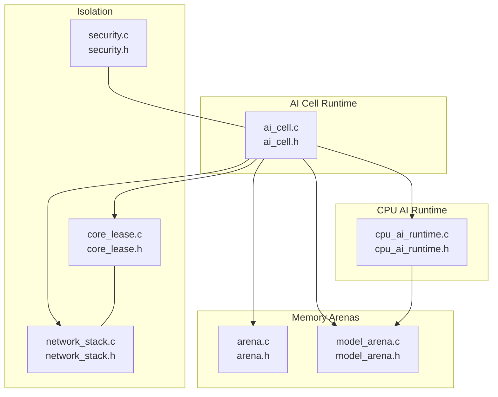
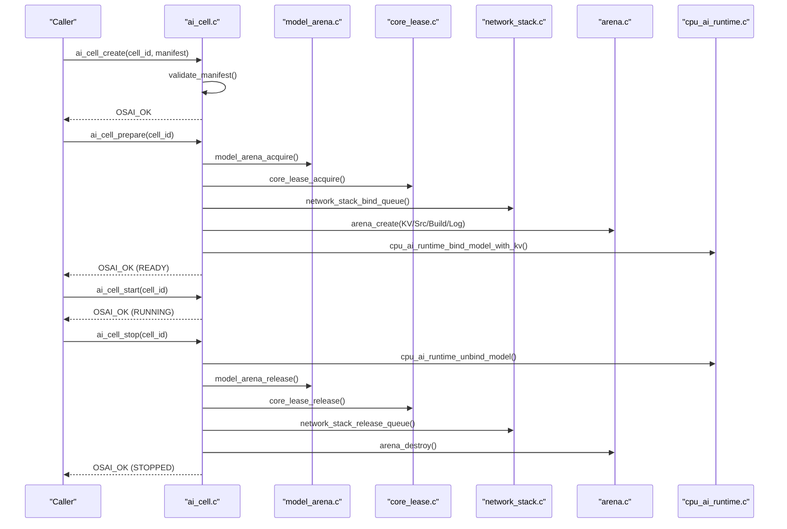
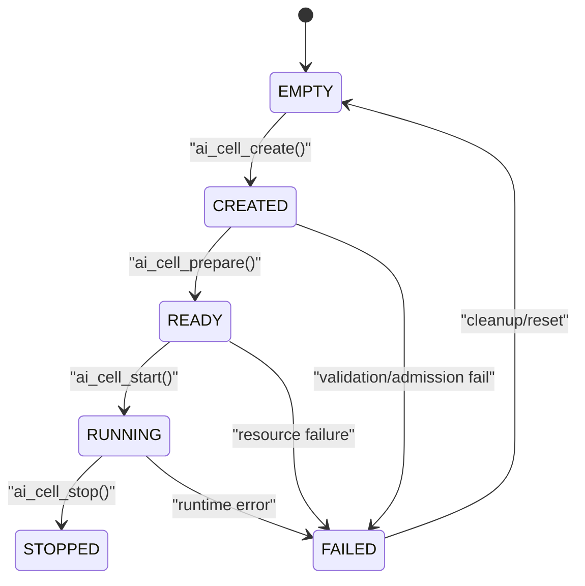
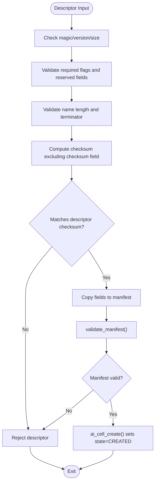
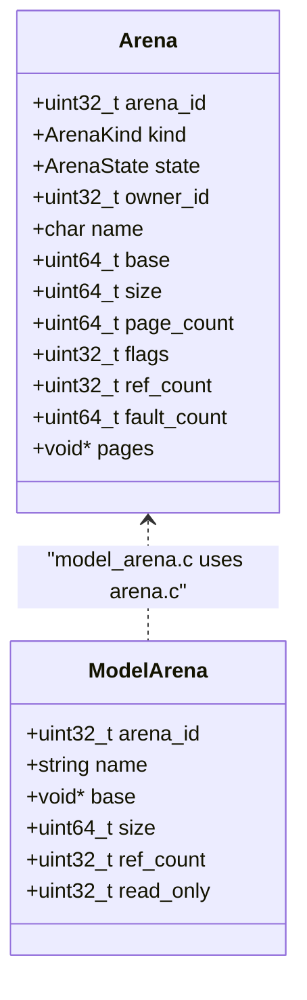
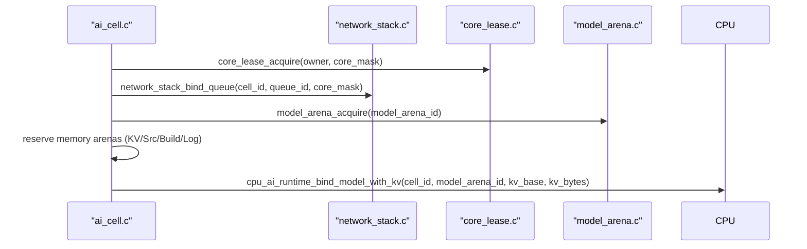
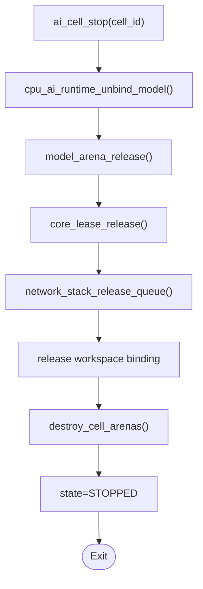
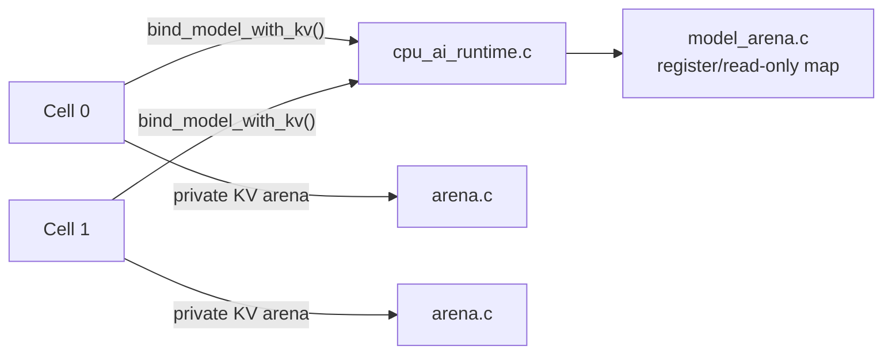
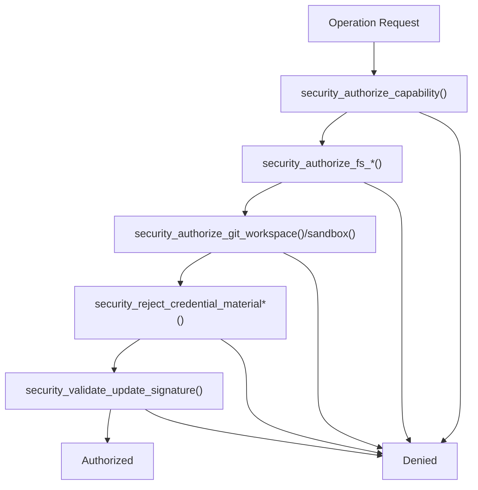
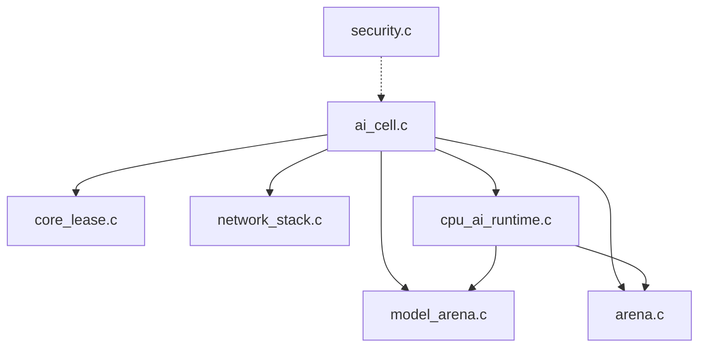

# AI Cell Management

<cite>
**Referenced Files in This Document**
- [ai_cell.h](file://kernel/include/osai/ai_cell.h)
- [ai_cell.c](file://kernel/runtime/ai_cell.c)
- [arena.h](file://kernel/include/osai/arena.h)
- [arena.c](file://kernel/mm/arena.c)
- [model_arena.h](file://kernel/include/osai/model_arena.h)
- [model_arena.c](file://kernel/runtime/model_arena.c)
- [cpu_ai_runtime.h](file://kernel/include/osai/cpu_ai_runtime.h)
- [cpu_ai_runtime.c](file://kernel/runtime/cpu_ai_runtime.c)
- [core_lease.h](file://kernel/include/osai/core_lease.h)
- [core_lease.c](file://kernel/runtime/core_lease.c)
- [network_stack.h](file://kernel/include/osai/network_stack.h)
- [network_stack.c](file://kernel/runtime/network_stack.c)
- [security.h](file://kernel/include/osai/security.h)
- [security.c](file://kernel/runtime/security.c)
</cite>

## Table of Contents
1. [Introduction](#introduction)
2. [Project Structure](#project-structure)
3. [Core Components](#core-components)
4. [Architecture Overview](#architecture-overview)
5. [Detailed Component Analysis](#detailed-component-analysis)
6. [Dependency Analysis](#dependency-analysis)
7. [Performance Considerations](#performance-considerations)
8. [Troubleshooting Guide](#troubleshooting-guide)
9. [Conclusion](#conclusion)

## Introduction
This document explains AI cell management in OSAI’s microkernel architecture. It covers the AI cell containerization system, including creation, binding, and lifecycle management; the cell state machine; resource allocation and memory management; cell ID validation; isolation mechanisms; inter-cell communication patterns; and the relationship between AI cells and the model arena (shared weight binding and KV cache management). Practical workflows for creation, binding, and cleanup are included, along with security boundaries, resource limits, and performance monitoring capabilities.

## Project Structure
OSAI organizes AI cell management across several kernel subsystems:
- AI cell runtime and descriptors define the cell identity, resources, and lifecycle.
- Arena and model arena subsystems manage shared memory regions and read-only model weights.
- CPU AI runtime binds model images and orchestrates decoding and KV writes.
- Core lease enforces CPU core isolation and prevents conflicts.
- Network stack binds NIC queues per cell for I/O.
- Security module enforces capability checks and policy-based authorizations.

**Diagram sources**
- [ai_cell.c:350-387](file://kernel/runtime/ai_cell.c#L350-L387)
- [arena.c:45-63](file://kernel/mm/arena.c#L45-L63)
- [model_arena.c:41-52](file://kernel/runtime/model_arena.c#L41-L52)
- [cpu_ai_runtime.c:334-355](file://kernel/runtime/cpu_ai_runtime.c#L334-L355)
- [core_lease.c:17-25](file://kernel/runtime/core_lease.c#L17-L25)
- [network_stack.c:607-695](file://kernel/runtime/network_stack.c#L607-L695)
- [security.c:177-196](file://kernel/runtime/security.c#L177-L196)

**Section sources**
- [ai_cell.h:1-103](file://kernel/include/osai/ai_cell.h#L1-L103)
- [ai_cell.c:350-387](file://kernel/runtime/ai_cell.c#L350-L387)
- [arena.h:1-57](file://kernel/include/osai/arena.h#L1-L57)
- [arena.c:45-63](file://kernel/mm/arena.c#L45-L63)
- [model_arena.h:1-28](file://kernel/include/osai/model_arena.h#L1-L28)
- [model_arena.c:41-52](file://kernel/runtime/model_arena.c#L41-L52)
- [cpu_ai_runtime.h:1-51](file://kernel/include/osai/cpu_ai_runtime.h#L1-L51)
- [cpu_ai_runtime.c:334-355](file://kernel/runtime/cpu_ai_runtime.c#L334-L355)
- [core_lease.h:1-17](file://kernel/include/osai/core_lease.h#L1-L17)
- [core_lease.c:17-25](file://kernel/runtime/core_lease.c#L17-L25)
- [network_stack.h:1-76](file://kernel/include/osai/network_stack.h#L1-L76)
- [network_stack.c:607-695](file://kernel/runtime/network_stack.c#L607-L695)
- [security.h:1-53](file://kernel/include/osai/security.h#L1-L53)
- [security.c:177-196](file://kernel/runtime/security.c#L177-L196)

## Core Components
- AI Cell Descriptor and Manifest: Define cell identity, resource requirements, and flags. Validation ensures required flags, name bounds, and checksum correctness.
- AI Cell Lifecycle: States include EMPTY, CREATED, READY, RUNNING, STOPPED, FAILED. Transitions occur via create, prepare, start, and stop.
- Resource Allocation: Memory arenas for KV cache, source index, build output, and logs; NIC queue binding; core lease acquisition; model arena binding.
- Model Arena: Shared read-only region for model weights; read-only mapping enforced.
- CPU AI Runtime: Validates model images, binds models with optional KV cache, performs deterministic decoding, and tracks metrics.
- Isolation: Core lease masks IRQ isolation and prevents overlapping core usage; network stack binds queues per cell; security policies authorize operations.

**Section sources**
- [ai_cell.h:24-76](file://kernel/include/osai/ai_cell.h#L24-L76)
- [ai_cell.c:406-421](file://kernel/runtime/ai_cell.c#L406-L421)
- [ai_cell.c:423-477](file://kernel/runtime/ai_cell.c#L423-L477)
- [ai_cell.c:480-508](file://kernel/runtime/ai_cell.c#L480-L508)
- [arena.h:14-42](file://kernel/include/osai/arena.h#L14-L42)
- [arena.c:102-154](file://kernel/mm/arena.c#L102-L154)
- [model_arena.c:54-84](file://kernel/runtime/model_arena.c#L54-L84)
- [cpu_ai_runtime.c:383-457](file://kernel/runtime/cpu_ai_runtime.c#L383-L457)
- [core_lease.c:64-95](file://kernel/runtime/core_lease.c#L64-L95)
- [network_stack.c:697-726](file://kernel/runtime/network_stack.c#L697-L726)
- [security.c:202-211](file://kernel/runtime/security.c#L202-L211)

## Architecture Overview
The AI cell runtime coordinates resource allocation and binding across subsystems. Creation validates manifests and descriptors; preparation acquires cores, binds NIC queues, reserves memory arenas, and binds shared model weights with KV cache; start transitions the cell to RUNNING; stop reverses bindings and releases resources.

**Diagram sources**
- [ai_cell.c:406-421](file://kernel/runtime/ai_cell.c#L406-L421)
- [ai_cell.c:423-477](file://kernel/runtime/ai_cell.c#L423-L477)
- [ai_cell.c:480-508](file://kernel/runtime/ai_cell.c#L480-L508)
- [model_arena.c:101-123](file://kernel/runtime/model_arena.c#L101-L123)
- [core_lease.c:64-95](file://kernel/runtime/core_lease.c#L64-L95)
- [network_stack.c:697-726](file://kernel/runtime/network_stack.c#L697-L726)
- [arena.c:102-154](file://kernel/mm/arena.c#L102-L154)
- [cpu_ai_runtime.c:383-457](file://kernel/runtime/cpu_ai_runtime.c#L383-L457)

## Detailed Component Analysis

### AI Cell Lifecycle and State Machine
- States: EMPTY, CREATED, READY, RUNNING, STOPPED, FAILED.
- Transitions:
  - CREATED after successful ai_cell_create().
  - READY after ai_cell_prepare() succeeds (model acquire, core lease, NIC queue, memory arenas, KV binding).
  - RUNNING after ai_cell_start().
  - STOPPED after ai_cell_stop() releases all resources.
  - FAILED on validation or admission failures during prepare.
- Metrics track transitions and resource admission/rejection.

**Diagram sources**
- [ai_cell.h:24-31](file://kernel/include/osai/ai_cell.h#L24-L31)
- [ai_cell.c:406-421](file://kernel/runtime/ai_cell.c#L406-L421)
- [ai_cell.c:423-477](file://kernel/runtime/ai_cell.c#L423-L477)
- [ai_cell.c:480-508](file://kernel/runtime/ai_cell.c#L480-L508)

**Section sources**
- [ai_cell.h:24-31](file://kernel/include/osai/ai_cell.h#L24-L31)
- [ai_cell.c:406-421](file://kernel/runtime/ai_cell.c#L406-L421)
- [ai_cell.c:423-477](file://kernel/runtime/ai_cell.c#L423-L477)
- [ai_cell.c:480-508](file://kernel/runtime/ai_cell.c#L480-L508)

### Cell Creation and Validation
- Descriptor validation checks magic/version/size/flags/name bounds/checksum.
- Manifest validation checks core mask, KV/source sizes, workspace/NIC IDs, and model arena availability.
- Name validation enforces bounded, null-terminated strings.

**Diagram sources**
- [ai_cell.c:148-181](file://kernel/runtime/ai_cell.c#L148-L181)
- [ai_cell.c:122-146](file://kernel/runtime/ai_cell.c#L122-L146)
- [ai_cell.c:107-113](file://kernel/runtime/ai_cell.c#L107-L113)

**Section sources**
- [ai_cell.c:148-181](file://kernel/runtime/ai_cell.c#L148-L181)
- [ai_cell.c:122-146](file://kernel/runtime/ai_cell.c#L122-L146)
- [ai_cell.c:107-113](file://kernel/runtime/ai_cell.c#L107-L113)

### Resource Allocation and Memory Management
- Memory arenas created per cell for:
  - KV cache: arena_create(kind=KV_CACHE)
  - Source index: arena_create(kind=SOURCE_INDEX)
  - Build output: fixed size arena
  - Log: fixed size arena
- Arena flags support read-only/shared/prefaulted visibility; memory is zero-filled and mapped via VMM.
- Model arena registers read-only model weights and maps them read-only; ref-counted access.

**Diagram sources**
- [arena.h:29-42](file://kernel/include/osai/arena.h#L29-L42)
- [arena.c:102-154](file://kernel/mm/arena.c#L102-L154)
- [model_arena.h:9-16](file://kernel/include/osai/model_arena.h#L9-L16)
- [model_arena.c:54-84](file://kernel/runtime/model_arena.c#L54-L84)

**Section sources**
- [arena.c:102-154](file://kernel/mm/arena.c#L102-L154)
- [arena.c:177-194](file://kernel/mm/arena.c#L177-L194)
- [model_arena.c:54-84](file://kernel/runtime/model_arena.c#L54-L84)
- [model_arena.c:101-123](file://kernel/runtime/model_arena.c#L101-L123)

### Binding Procedures and Inter-Cell Communication
- NIC Queue Binding: Per-cell binding via network_stack_bind_queue(); uniqueness enforced by owner tracking; release on stop.
- Git Workspace Binding: Per-cell workspace assignment; validated against configured max workspaces.
- CPU Core Lease: Exclusive core mask acquisition; IRQ isolation tracked; conflicts rejected.
- Inter-Cell Communication: Through shared model arena (read-only) and per-cell KV cache; network stack routes frames to cell-bound queues.

**Diagram sources**
- [ai_cell.c:435-468](file://kernel/runtime/ai_cell.c#L435-L468)
- [core_lease.c:64-95](file://kernel/runtime/core_lease.c#L64-L95)
- [network_stack.c:697-726](file://kernel/runtime/network_stack.c#L697-L726)
- [model_arena.c:101-123](file://kernel/runtime/model_arena.c#L101-L123)
- [cpu_ai_runtime.c:389-457](file://kernel/runtime/cpu_ai_runtime.c#L389-L457)

**Section sources**
- [ai_cell.c:183-198](file://kernel/runtime/ai_cell.c#L183-L198)
- [ai_cell.c:209-226](file://kernel/runtime/ai_cell.c#L209-L226)
- [core_lease.c:64-95](file://kernel/runtime/core_lease.c#L64-L95)
- [network_stack.c:697-726](file://kernel/runtime/network_stack.c#L697-L726)
- [cpu_ai_runtime.c:389-457](file://kernel/runtime/cpu_ai_runtime.c#L389-L457)

### Cleanup Operations
- Unbind model from CPU runtime.
- Release model arena reference.
- Release core lease.
- Release NIC queue and workspace bindings.
- Destroy memory arenas and update reserved counters.

**Diagram sources**
- [ai_cell.c:492-508](file://kernel/runtime/ai_cell.c#L492-L508)
- [cpu_ai_runtime.c:459-475](file://kernel/runtime/cpu_ai_runtime.c#L459-L475)
- [model_arena.c:115-123](file://kernel/runtime/model_arena.c#L115-L123)
- [core_lease.c:97-115](file://kernel/runtime/core_lease.c#L97-L115)
- [network_stack.c:728-745](file://kernel/runtime/network_stack.c#L728-L745)
- [ai_cell.c:228-269](file://kernel/runtime/ai_cell.c#L228-L269)

**Section sources**
- [ai_cell.c:492-508](file://kernel/runtime/ai_cell.c#L492-L508)
- [cpu_ai_runtime.c:459-475](file://kernel/runtime/cpu_ai_runtime.c#L459-L475)
- [model_arena.c:115-123](file://kernel/runtime/model_arena.c#L115-L123)
- [core_lease.c:97-115](file://kernel/runtime/core_lease.c#L97-L115)
- [network_stack.c:728-745](file://kernel/runtime/network_stack.c#L728-L745)
- [ai_cell.c:228-269](file://kernel/runtime/ai_cell.c#L228-L269)

### Relationship Between AI Cells and Model Arena
- Shared Weight Binding: Model arena is read-only and shared; multiple cells can bind the same model arena; ref-counted access ensures safe lifetime.
- KV Cache Management: Each cell gets its own KV cache arena; optional shared model binding allows multiple cells to share weights while maintaining private KV.

**Diagram sources**
- [cpu_ai_runtime.c:389-457](file://kernel/runtime/cpu_ai_runtime.c#L389-L457)
- [model_arena.c:54-84](file://kernel/runtime/model_arena.c#L54-L84)
- [arena.c:102-154](file://kernel/mm/arena.c#L102-L154)

**Section sources**
- [cpu_ai_runtime.c:389-457](file://kernel/runtime/cpu_ai_runtime.c#L389-L457)
- [model_arena.c:54-84](file://kernel/runtime/model_arena.c#L54-L84)
- [arena.c:102-154](file://kernel/mm/arena.c#L102-L154)

### Security Boundaries and Policy Enforcement
- Capability checks: security_authorize_capability requires granted set to include required bits.
- Filesystem access: granular read/write authorization gated by path trees.
- Git/workspace and sandbox ownership: operations allowed only for owners.
- Credential material rejection: patterns for tokens, secrets, and private keys are rejected.
- Update signatures: monotonic generation enforcement and public key validation.

**Diagram sources**
- [security.c:202-211](file://kernel/runtime/security.c#L202-L211)
- [security.c:213-239](file://kernel/runtime/security.c#L213-L239)
- [security.c:241-271](file://kernel/runtime/security.c#L241-L271)
- [security.c:300-337](file://kernel/runtime/security.c#L300-L337)
- [security.c:339-403](file://kernel/runtime/security.c#L339-L403)

**Section sources**
- [security.h:8-34](file://kernel/include/osai/security.h#L8-L34)
- [security.c:202-211](file://kernel/runtime/security.c#L202-L211)
- [security.c:213-239](file://kernel/runtime/security.c#L213-L239)
- [security.c:241-271](file://kernel/runtime/security.c#L241-L271)
- [security.c:300-337](file://kernel/runtime/security.c#L300-L337)
- [security.c:339-403](file://kernel/runtime/security.c#L339-L403)

## Dependency Analysis
- ai_cell.c depends on:
  - model_arena.c for shared model weights
  - core_lease.c for CPU isolation
  - network_stack.c for NIC queue binding
  - arena.c for per-cell memory arenas
  - cpu_ai_runtime.c for model binding and decoding
- cpu_ai_runtime.c depends on:
  - model_arena.c for model registration and read-only mapping
  - arena.c for KV cache mapping
- security.c provides cross-cutting authorization used by higher-level components.

**Diagram sources**
- [ai_cell.c:423-477](file://kernel/runtime/ai_cell.c#L423-L477)
- [cpu_ai_runtime.c:383-457](file://kernel/runtime/cpu_ai_runtime.c#L383-L457)
- [model_arena.c:101-123](file://kernel/runtime/model_arena.c#L101-L123)
- [core_lease.c:64-95](file://kernel/runtime/core_lease.c#L64-L95)
- [network_stack.c:697-726](file://kernel/runtime/network_stack.c#L697-L726)
- [arena.c:102-154](file://kernel/mm/arena.c#L102-L154)
- [security.c:202-211](file://kernel/runtime/security.c#L202-L211)

**Section sources**
- [ai_cell.c:423-477](file://kernel/runtime/ai_cell.c#L423-L477)
- [cpu_ai_runtime.c:383-457](file://kernel/runtime/cpu_ai_runtime.c#L383-L457)
- [model_arena.c:101-123](file://kernel/runtime/model_arena.c#L101-L123)
- [core_lease.c:64-95](file://kernel/runtime/core_lease.c#L64-L95)
- [network_stack.c:697-726](file://kernel/runtime/network_stack.c#L697-L726)
- [arena.c:102-154](file://kernel/mm/arena.c#L102-L154)
- [security.c:202-211](file://kernel/runtime/security.c#L202-L211)

## Performance Considerations
- Arena sizing: Fixed build/log sizes and configurable KV/source sizes; peak counters track reserved pages/bytes.
- Admission control: Rejection counters for descriptors and resources prevent overcommit.
- Core isolation: IRQ isolation and used mask help reduce contention and improve predictability.
- Network queue rings: Backpressure drops and completion accounting provide insight into throughput and pressure.
- Runtime metrics: Decode counts, KV write counts, and model load statistics enable performance monitoring.

[No sources needed since this section provides general guidance]

## Troubleshooting Guide
Common issues and diagnostics:
- Descriptor rejected: Check magic/version/size/flags, name bounds, and checksum.
- Resource admission failed: Inspect core mask validity, NIC queue ownership, workspace availability, and model arena presence.
- Conflict errors: Overlapping core masks, NIC queue reuse, or workspace reuse cause BUSY/INVALID.
- Stop failures: Ensure model is unbound, core lease released, NIC queue and workspace released, and arenas destroyed.
- Security denials: Review capability grants, filesystem paths, workspace ownership, and credential material detection.

**Section sources**
- [ai_cell.c:148-181](file://kernel/runtime/ai_cell.c#L148-L181)
- [ai_cell.c:435-468](file://kernel/runtime/ai_cell.c#L435-L468)
- [core_lease.c:64-95](file://kernel/runtime/core_lease.c#L64-L95)
- [network_stack.c:697-726](file://kernel/runtime/network_stack.c#L697-L726)
- [security.c:202-211](file://kernel/runtime/security.c#L202-L211)

## Conclusion
OSAI’s AI cell management integrates strict validation, resource isolation, and shared model/arena semantics to provide secure, efficient containerization for AI workloads. The lifecycle, resource allocation, and security controls collectively ensure predictable performance, strong isolation, and maintainable operations across multiple AI cells.