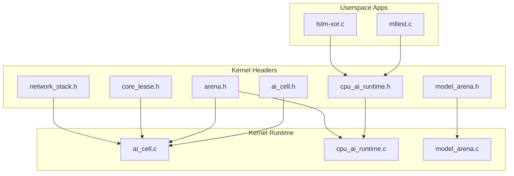
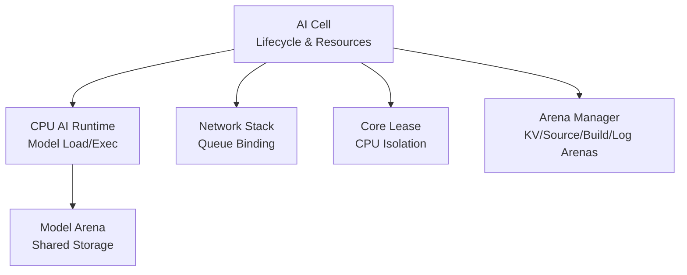
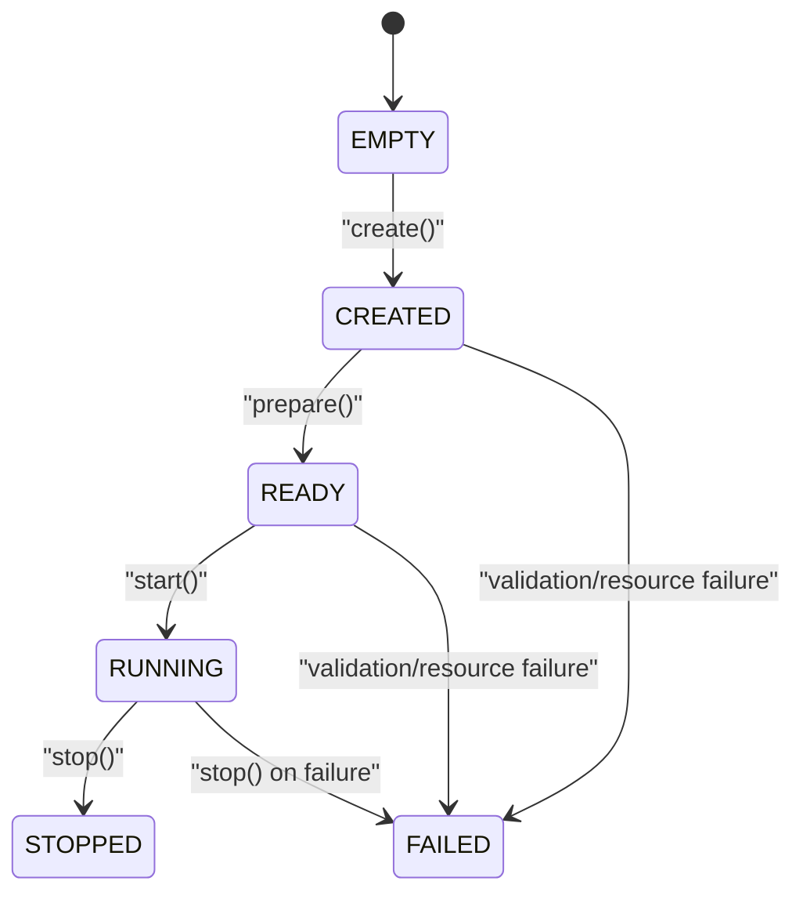
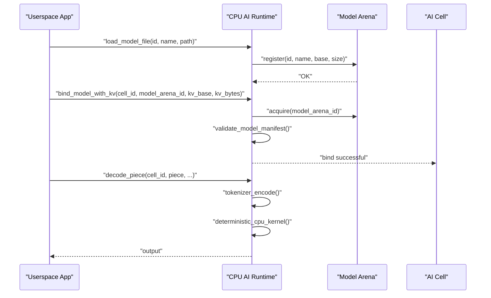
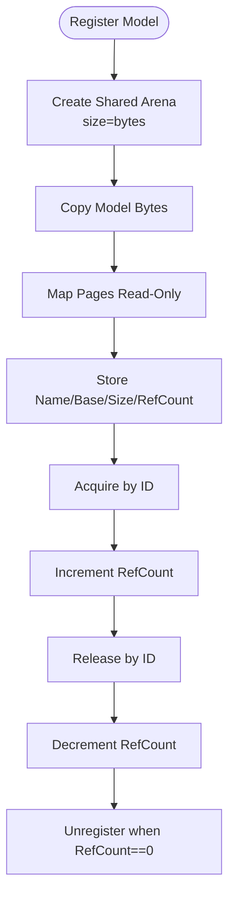
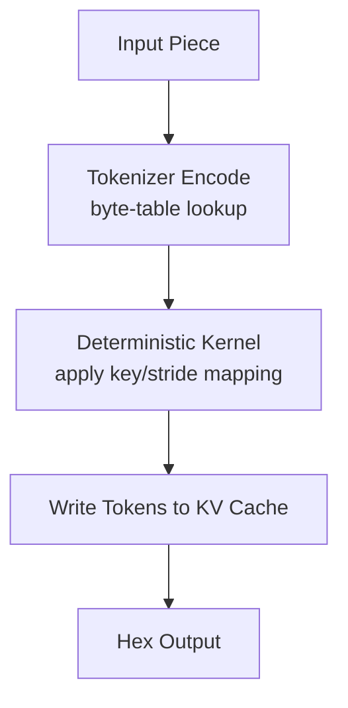
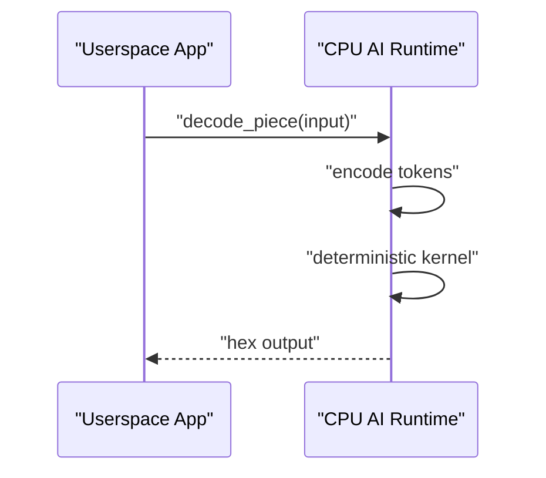
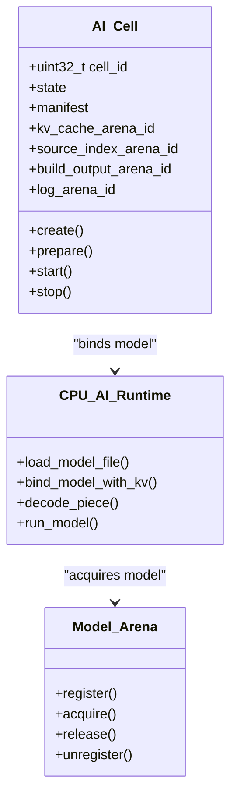
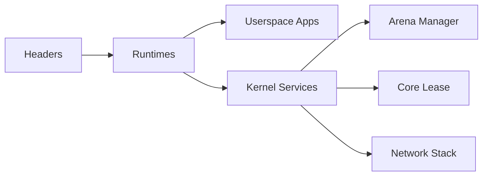

# AI Runtime System

<cite>
**Referenced Files in This Document**
- [README.md](file://README.md)
- [Makefile](file://Makefile)
- [ai_cell.h](file://kernel/include/osai/ai_cell.h)
- [cpu_ai_runtime.h](file://kernel/include/osai/cpu_ai_runtime.h)
- [model_arena.h](file://kernel/include/osai/model_arena.h)
- [arena.h](file://kernel/include/osai/arena.h)
- [core_lease.h](file://kernel/include/osai/core_lease.h)
- [network_stack.h](file://kernel/include/osai/network_stack.h)
- [ai_cell.c](file://kernel/runtime/ai_cell.c)
- [cpu_ai_runtime.c](file://kernel/runtime/cpu_ai_runtime.c)
- [model_arena.c](file://kernel/runtime/model_arena.c)
- [mltest.c](file://userspace/apps/mltest.c)
- [lstm-xor.c](file://userspace/apps/lstm-xor.c)
</cite>

## Table of Contents
1. [Introduction](#introduction)
2. [Project Structure](#project-structure)
3. [Core Components](#core-components)
4. [Architecture Overview](#architecture-overview)
5. [Detailed Component Analysis](#detailed-component-analysis)
6. [Dependency Analysis](#dependency-analysis)
7. [Performance Considerations](#performance-considerations)
8. [Troubleshooting Guide](#troubleshooting-guide)
9. [Conclusion](#conclusion)
10. [Appendices](#appendices)

## Introduction
This document describes the AI runtime system for OSAI’s specialized CPU-only AI agent hosting platform. It explains how AI Cells encapsulate and manage AI agents, how the CPU AI Runtime engine loads models, executes inference deterministically, and optimizes performance, and how the Model Arena manages model storage, versioning, and access patterns. It also covers tokenizer support, model format handling, inference result processing, deployment patterns, resource constraints, performance monitoring, integration with system resources (memory management and security boundaries), model lifecycle and rollback, and debugging techniques for AI workloads.

## Project Structure
The AI runtime system spans kernel headers and runtime implementations, plus userspace test applications that exercise the CPU-only ML dispatch and deterministic decoding.

**Diagram sources**
- [ai_cell.h:1-103](file://kernel/include/osai/ai_cell.h#L1-L103)
- [cpu_ai_runtime.h:1-51](file://kernel/include/osai/cpu_ai_runtime.h#L1-L51)
- [model_arena.h:1-28](file://kernel/include/osai/model_arena.h#L1-L28)
- [arena.h:1-57](file://kernel/include/osai/arena.h#L1-L57)
- [core_lease.h:1-17](file://kernel/include/osai/core_lease.h#L1-L17)
- [network_stack.h:1-76](file://kernel/include/osai/network_stack.h#L1-L76)
- [ai_cell.c:1-723](file://kernel/runtime/ai_cell.c#L1-L723)
- [cpu_ai_runtime.c:1-824](file://kernel/runtime/cpu_ai_runtime.c#L1-L824)
- [model_arena.c:1-141](file://kernel/runtime/model_arena.c#L1-L141)
- [mltest.c:1-61](file://userspace/apps/mltest.c#L1-L61)
- [lstm-xor.c:1-185](file://userspace/apps/lstm-xor.c#L1-L185)

**Section sources**
- [README.md:1-86](file://README.md#L1-L86)
- [Makefile:1-135](file://Makefile#L1-L135)

## Core Components
- AI Cell: Resource-managed container for an AI agent with lifecycle transitions, resource admission checks, NIC queue binding, workspace binding, and private KV cache arenas.
- CPU AI Runtime: Model loader and executor for CPU-only models, including tokenizer encoding, deterministic kernel execution, KV cache writes, and metrics.
- Model Arena: Shared read-only model storage registry with reference counting and read-only mapping.

Key responsibilities:
- AI Cell: Validates descriptors, reserves memory arenas, binds NIC queues and workspaces, binds models with KV cache, and orchestrates lifecycle transitions.
- CPU AI Runtime: Validates model images, registers models into the Model Arena, binds models to cells, encodes tokens, runs deterministic kernels, and tracks performance counters.
- Model Arena: Registers model bytes into arenas, maps them read-only, increments reference counts, and ensures safe sharing across cells.

**Section sources**
- [ai_cell.h:24-101](file://kernel/include/osai/ai_cell.h#L24-L101)
- [cpu_ai_runtime.h:7-48](file://kernel/include/osai/cpu_ai_runtime.h#L7-L48)
- [model_arena.h:9-25](file://kernel/include/osai/model_arena.h#L9-L25)

## Architecture Overview
The AI runtime architecture integrates AI Cells with the CPU AI Runtime and Model Arena, enforcing CPU-only constraints and deterministic execution. AI Cells manage resource contracts and lifecycle; the CPU AI Runtime validates and executes models; the Model Arena provides shared, read-only model storage.

**Diagram sources**
- [ai_cell.c:350-508](file://kernel/runtime/ai_cell.c#L350-L508)
- [cpu_ai_runtime.c:334-475](file://kernel/runtime/cpu_ai_runtime.c#L334-L475)
- [model_arena.c:41-99](file://kernel/runtime/model_arena.c#L41-L99)
- [network_stack.h:19-26](file://kernel/include/osai/network_stack.h#L19-L26)
- [core_lease.h:7-14](file://kernel/include/osai/core_lease.h#L7-L14)
- [arena.h:14-42](file://kernel/include/osai/arena.h#L14-L42)

## Detailed Component Analysis

### AI Cell Architecture
AI Cells encapsulate AI agents with strict resource contracts and lifecycle management. They enforce CPU-only, fixed-core, shared model, private KV cache, NIC queue, and Git workspace bindings. The runtime validates descriptors, reserves memory arenas, binds resources, and transitions through states.

**Diagram sources**
- [ai_cell.h:24-31](file://kernel/include/osai/ai_cell.h#L24-L31)
- [ai_cell.c:406-508](file://kernel/runtime/ai_cell.c#L406-L508)

Key implementation patterns:
- Descriptor validation enforces required flags, name length, checksum, and resource bounds.
- Memory arenas are reserved per cell for KV cache, source index, build output, and logs.
- NIC queue and workspace ownership tracking prevents conflicts.
- Metrics track descriptor acceptance/rejection, resource admission/rejection, arena usage, and binding/release counts.

**Section sources**
- [ai_cell.h:33-76](file://kernel/include/osai/ai_cell.h#L33-L76)
- [ai_cell.c:148-181](file://kernel/runtime/ai_cell.c#L148-L181)
- [ai_cell.c:271-335](file://kernel/runtime/ai_cell.c#L271-L335)
- [ai_cell.c:183-226](file://kernel/runtime/ai_cell.c#L183-L226)
- [ai_cell.c:389-477](file://kernel/runtime/ai_cell.c#L389-L477)

### CPU AI Runtime Engine
The CPU AI Runtime validates model images, registers models into the Model Arena, binds models to cells with optional KV cache, and executes deterministic kernels. It supports tokenizer byte-table encoding and a deterministic runtime kernel.

**Diagram sources**
- [cpu_ai_runtime.c:357-381](file://kernel/runtime/cpu_ai_runtime.c#L357-L381)
- [cpu_ai_runtime.c:389-457](file://kernel/runtime/cpu_ai_runtime.c#L389-L457)
- [cpu_ai_runtime.c:477-522](file://kernel/runtime/cpu_ai_runtime.c#L477-L522)
- [cpu_ai_runtime.c:231-332](file://kernel/runtime/cpu_ai_runtime.c#L231-L332)
- [model_arena.c:54-84](file://kernel/runtime/model_arena.c#L54-L84)

Key implementation patterns:
- Model image validation checks magic/version/header bytes, quantization, tokenizer/runtime IDs, CPU-only flag, ranges, minimum sizes, and payload hash.
- Deterministic kernel performs token-to-hex mapping using weights key/stride and records tokens into KV cache.
- Tokenizer encodes input bytes using a byte-table tokenizer.
- Metrics track load attempts, failures, tokenizer calls, runtime calls, KV writes, and admission rejections.

**Section sources**
- [cpu_ai_runtime.h:13-48](file://kernel/include/osai/cpu_ai_runtime.h#L13-L48)
- [cpu_ai_runtime.c:143-198](file://kernel/runtime/cpu_ai_runtime.c#L143-L198)
- [cpu_ai_runtime.c:231-332](file://kernel/runtime/cpu_ai_runtime.c#L231-L332)
- [cpu_ai_runtime.c:477-606](file://kernel/runtime/cpu_ai_runtime.c#L477-L606)

### Model Arena Implementation
The Model Arena provides shared, read-only model storage. Models are copied into arenas and mapped read-only. Reference counting enables safe sharing across multiple AI Cells.

**Diagram sources**
- [model_arena.c:54-84](file://kernel/runtime/model_arena.c#L54-L84)
- [model_arena.c:101-123](file://kernel/runtime/model_arena.c#L101-L123)

Key implementation patterns:
- Shared arena creation with read-only mapping ensures models are immutable and can be safely shared.
- Reference counting prevents premature unregistration while models are in use.
- Read-only mapping is enforced by remapping pages to present-only flags.

**Section sources**
- [model_arena.h:9-25](file://kernel/include/osai/model_arena.h#L9-L25)
- [model_arena.c:23-39](file://kernel/runtime/model_arena.c#L23-L39)
- [model_arena.c:54-99](file://kernel/runtime/model_arena.c#L54-L99)

### Tokenizer Support and Model Format Handling
Tokenizer support is implemented via a byte-table tokenizer. Model format is validated with a structured manifest containing magic/version/flags, offsets/sizes for weights and tokenizer, KV requirements, and payload hash. The runtime enforces CPU-only constraints and rejects GPU-required models.

**Diagram sources**
- [cpu_ai_runtime.c:231-252](file://kernel/runtime/cpu_ai_runtime.c#L231-L252)
- [cpu_ai_runtime.c:280-314](file://kernel/runtime/cpu_ai_runtime.c#L280-L314)
- [cpu_ai_runtime.c:254-278](file://kernel/runtime/cpu_ai_runtime.c#L254-L278)

Key implementation patterns:
- Tokenizer ID and runtime ID are validated against supported constants.
- Weights key/stride are verified to match the manifest.
- KV cache writes are bounded by allocated capacity.

**Section sources**
- [cpu_ai_runtime.h:8-11](file://kernel/include/osai/cpu_ai_runtime.h#L8-L11)
- [cpu_ai_runtime.c:143-198](file://kernel/runtime/cpu_ai_runtime.c#L143-L198)
- [cpu_ai_runtime.c:231-332](file://kernel/runtime/cpu_ai_runtime.c#L231-L332)

### Inference Result Processing
Inference results are produced deterministically by the runtime kernel. Userspace applications receive ASCII hex-encoded outputs and can parse or log results. The runtime tracks bytes in/out and decode call counts.

**Diagram sources**
- [cpu_ai_runtime.c:477-522](file://kernel/runtime/cpu_ai_runtime.c#L477-L522)
- [mltest.c:17-60](file://userspace/apps/mltest.c#L17-L60)
- [lstm-xor.c:104-184](file://userspace/apps/lstm-xor.c#L104-L184)

**Section sources**
- [cpu_ai_runtime.c:519-522](file://kernel/runtime/cpu_ai_runtime.c#L519-L522)
- [mltest.c:17-60](file://userspace/apps/mltest.c#L17-L60)
- [lstm-xor.c:104-184](file://userspace/apps/lstm-xor.c#L104-L184)

### AI Agent Deployment Patterns
AI Cells are deployed with explicit resource contracts:
- CPU-only constraint enforced by runtime validation.
- Fixed-core assignment via core lease masks.
- Shared model arena for weight reuse across cells.
- Private KV cache per cell for stateful decoding.
- Dedicated NIC queue and Git workspace binding for isolation.

**Diagram sources**
- [ai_cell.h:62-76](file://kernel/include/osai/ai_cell.h#L62-L76)
- [cpu_ai_runtime.h:13-48](file://kernel/include/osai/cpu_ai_runtime.h#L13-L48)
- [model_arena.h:18-25](file://kernel/include/osai/model_arena.h#L18-L25)

**Section sources**
- [ai_cell.c:406-477](file://kernel/runtime/ai_cell.c#L406-L477)
- [cpu_ai_runtime.c:389-457](file://kernel/runtime/cpu_ai_runtime.c#L389-L457)
- [model_arena.c:54-99](file://kernel/runtime/model_arena.c#L54-L99)

### Resource Constraints and Performance Monitoring
Resource constraints:
- CPU-only enforcement prevents GPU-required models from binding.
- Core lease masks isolate AI Cells on specific CPUs.
- NIC queue and workspace ownership prevent contention.
- Arena reservation enforces per-cell memory budgets.

Performance monitoring:
- Counters track descriptor acceptance/rejection, resource admission/rejection, arena usage, queue/workspace bindings, and conflicts.
- Runtime metrics include model load counts/failures, tokenizer calls, runtime calls, KV writes, and checksum failures.

**Section sources**
- [ai_cell.c:148-181](file://kernel/runtime/ai_cell.c#L148-L181)
- [ai_cell.c:183-226](file://kernel/runtime/ai_cell.c#L183-L226)
- [ai_cell.c:510-564](file://kernel/runtime/ai_cell.c#L510-L564)
- [cpu_ai_runtime.c:143-198](file://kernel/runtime/cpu_ai_runtime.c#L143-L198)
- [cpu_ai_runtime.c:615-673](file://kernel/runtime/cpu_ai_runtime.c#L615-L673)

### Integration with System Resources
Memory management:
- Arena manager creates typed arenas for model weights, KV cache, source index, build output, and logs.
- Model Arena maps model pages read-only to prevent modification and enable sharing.

Security boundaries:
- Model Arena enforces read-only mapping for shared weights.
- AI Cell resource ownership prevents cross-cell interference.
- CPU-only runtime rejects GPU-required models.

Networking:
- AI Cell binds NIC queues to specific cells and releases them on stop.
- Network stack exposes queue binding APIs for resource management.

**Section sources**
- [arena.h:14-42](file://kernel/include/osai/arena.h#L14-L42)
- [model_arena.c:23-39](file://kernel/runtime/model_arena.c#L23-L39)
- [ai_cell.c:183-226](file://kernel/runtime/ai_cell.c#L183-L226)
- [network_stack.h:19-26](file://kernel/include/osai/network_stack.h#L19-L26)

### Model Lifecycle, Updates, Rollback, and Debugging
Model lifecycle:
- Registration via file path into the Model Arena.
- Validation of model manifest and payload hash.
- Binding to AI Cells with optional KV cache.
- Unbinding and releasing when stopping.

Updates and rollback:
- New model registration replaces old entries; reference counting allows safe unregistration after release.
- Rollback can be achieved by unregistering current model and registering previous version.

Debugging:
- Self-tests validate descriptor validation, resource conflicts, and runtime kernel behavior.
- Logging provides detailed traces for model loading, binding, and execution.
- Metrics expose admission rejections, checksum failures, and resource usage.

**Section sources**
- [cpu_ai_runtime.c:357-381](file://kernel/runtime/cpu_ai_runtime.c#L357-L381)
- [cpu_ai_runtime.c:717-800](file://kernel/runtime/cpu_ai_runtime.c#L717-L800)
- [model_arena.c:86-99](file://kernel/runtime/model_arena.c#L86-L99)
- [ai_cell.c:599-722](file://kernel/runtime/ai_cell.c#L599-L722)

## Dependency Analysis
The AI runtime system exhibits clear layering:
- Headers define public interfaces and data structures.
- Runtime implementations depend on arena manager, core lease, and network stack.
- Userspace apps depend on CPU AI Runtime interfaces.

**Diagram sources**
- [ai_cell.h:1-103](file://kernel/include/osai/ai_cell.h#L1-L103)
- [cpu_ai_runtime.h:1-51](file://kernel/include/osai/cpu_ai_runtime.h#L1-L51)
- [model_arena.h:1-28](file://kernel/include/osai/model_arena.h#L1-L28)
- [arena.h:1-57](file://kernel/include/osai/arena.h#L1-L57)
- [core_lease.h:1-17](file://kernel/include/osai/core_lease.h#L1-L17)
- [network_stack.h:1-76](file://kernel/include/osai/network_stack.h#L1-L76)
- [ai_cell.c:1-723](file://kernel/runtime/ai_cell.c#L1-L723)
- [cpu_ai_runtime.c:1-824](file://kernel/runtime/cpu_ai_runtime.c#L1-L824)
- [model_arena.c:1-141](file://kernel/runtime/model_arena.c#L1-L141)
- [mltest.c:1-61](file://userspace/apps/mltest.c#L1-L61)
- [lstm-xor.c:1-185](file://userspace/apps/lstm-xor.c#L1-L185)

**Section sources**
- [ai_cell.c:1-723](file://kernel/runtime/ai_cell.c#L1-L723)
- [cpu_ai_runtime.c:1-824](file://kernel/runtime/cpu_ai_runtime.c#L1-L824)
- [model_arena.c:1-141](file://kernel/runtime/model_arena.c#L1-L141)

## Performance Considerations
- CPU-only enforcement removes GPU overhead and avoids GPU-related admission rejections.
- Shared model arenas reduce memory duplication and enable efficient weight reuse.
- Deterministic runtime kernels produce predictable execution times.
- Private KV caches per cell minimize contention and enable stateful decoding.
- Read-only mapping of model weights reduces TLB pressure and improves cache locality.

[No sources needed since this section provides general guidance]

## Troubleshooting Guide
Common issues and diagnostics:
- Descriptor validation failures: Check required flags, checksum, name length, and resource bounds.
- Resource admission rejections: Verify core mask availability, NIC queue ownership, and workspace availability.
- Model load failures: Confirm model file path, read-only mapping, and manifest validity.
- GPU-required model rejection: Ensure models are CPU-only as required.
- KV cache overflow: Increase KV cache allocation for the AI Cell.
- Tokenizer/runtime mismatch: Validate tokenizer/runtime IDs and payload hash.

Useful metrics:
- Descriptor accept/reject counts, resource admission/rejection, arena peak usage, queue/workspace bindings/releases, and conflicts.
- Model load counts/failures, tokenizer/runtime calls, KV write counts, and checksum failures.

**Section sources**
- [ai_cell.c:148-181](file://kernel/runtime/ai_cell.c#L148-L181)
- [ai_cell.c:510-564](file://kernel/runtime/ai_cell.c#L510-L564)
- [cpu_ai_runtime.c:143-198](file://kernel/runtime/cpu_ai_runtime.c#L143-L198)
- [cpu_ai_runtime.c:615-673](file://kernel/runtime/cpu_ai_runtime.c#L615-L673)

## Conclusion
OSAI’s AI runtime system provides a robust, CPU-only foundation for AI agent hosting. AI Cells encapsulate agents with strict resource contracts, CPU AI Runtime validates and executes models deterministically, and Model Arena offers shared, read-only model storage. Together, these components deliver predictable performance, strong isolation, and efficient resource utilization tailored for embedded AI workloads.

[No sources needed since this section summarizes without analyzing specific files]

## Appendices

### Userspace Test Applications
- mltest: Exercises the general CPU-only ML runtime dispatcher with XOR, SUM, and PARITY models.
- lstm-xor: Demonstrates CPU-only LSTM XOR training and decoding using the AI runtime.

**Section sources**
- [mltest.c:17-60](file://userspace/apps/mltest.c#L17-L60)
- [lstm-xor.c:104-184](file://userspace/apps/lstm-xor.c#L104-L184)