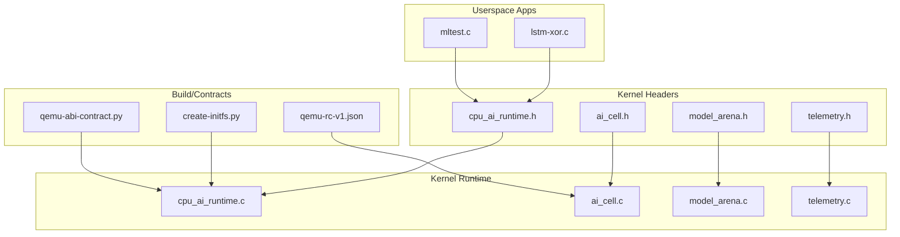
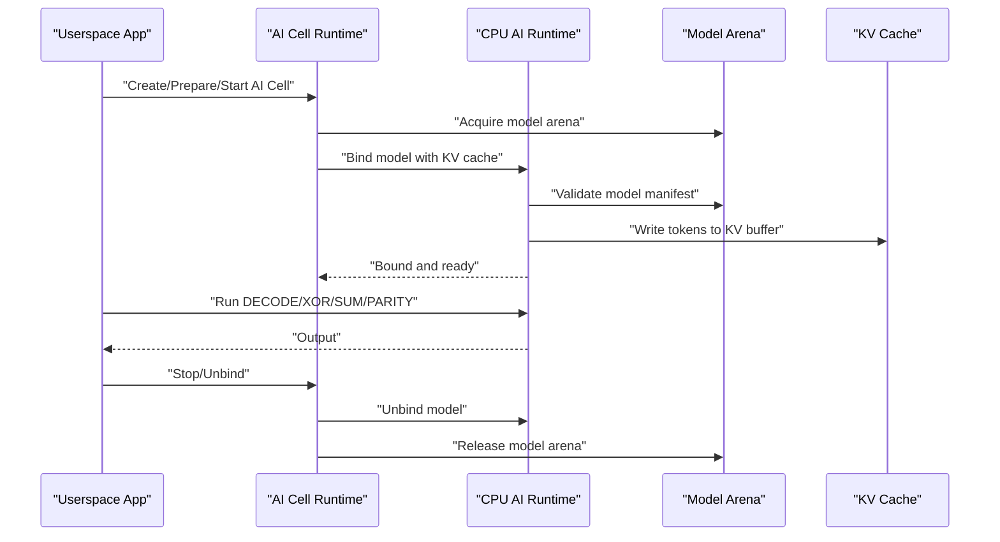
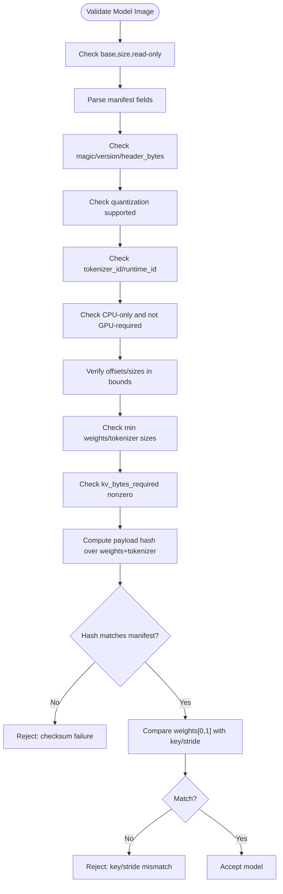
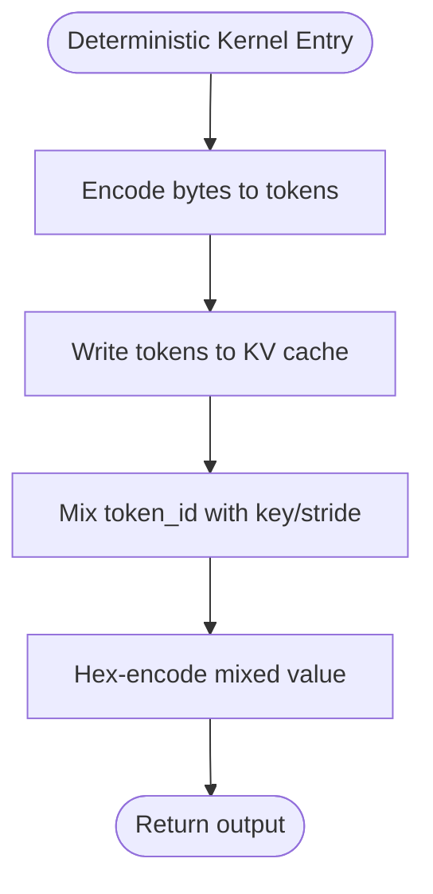
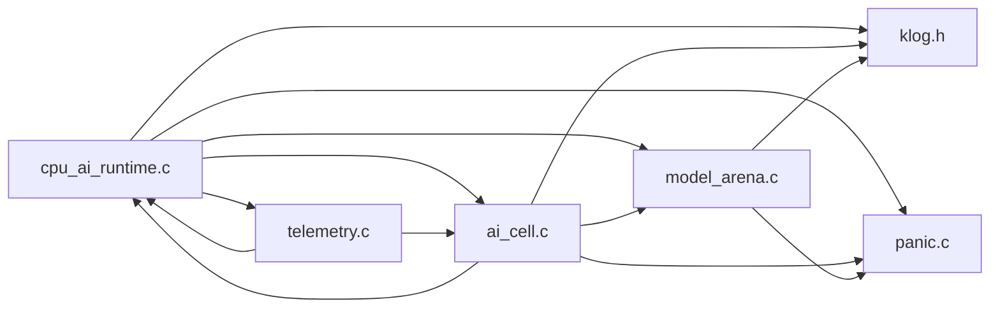

# CPU AI Runtime Engine

<cite>
**Referenced Files in This Document**
- [cpu_ai_runtime.h](file://kernel/include/osai/cpu_ai_runtime.h)
- [cpu_ai_runtime.c](file://kernel/runtime/cpu_ai_runtime.c)
- [ai_cell.h](file://kernel/include/osai/ai_cell.h)
- [ai_cell.c](file://kernel/runtime/ai_cell.c)
- [model_arena.h](file://kernel/include/osai/model_arena.h)
- [model_arena.c](file://kernel/runtime/model_arena.c)
- [telemetry.h](file://kernel/include/osai/telemetry.h)
- [telemetry.c](file://kernel/core/telemetry.c)
- [klog.h](file://kernel/include/osai/klog.h)
- [panic.c](file://kernel/core/panic.c)
- [qemu-rc-v1.json](file://contracts/qemu-rc-v1.json)
- [create-initfs.py](file://scripts/create-initfs.py)
- [qemu-abi-contract.py](file://scripts/qemu-abi-contract.py)
- [lstm-xor.c](file://userspace/apps/lstm-xor.c)
- [mltest.c](file://userspace/apps/mltest.c)
</cite>

## Table of Contents
1. [Introduction](#introduction)
2. [Project Structure](#project-structure)
3. [Core Components](#core-components)
4. [Architecture Overview](#architecture-overview)
5. [Detailed Component Analysis](#detailed-component-analysis)
6. [Dependency Analysis](#dependency-analysis)
7. [Performance Considerations](#performance-considerations)
8. [Troubleshooting Guide](#troubleshooting-guide)
9. [Conclusion](#conclusion)
10. [Appendices](#appendices)

## Introduction
This document describes the CPU AI Runtime Engine responsible for executing AI models on OSAI’s specialized CPU-only hardware. It covers the deterministic CPU kernel implementation, model validation and admission control, inference execution pipeline, tokenizer encoding, KV cache management, runtime dispatch for different model kinds (DECODE, XOR, SUM, PARITY), performance metrics, error handling, and debugging capabilities. The model manifest structure, magic numbers, versioning, quantization support, and flag management are documented alongside the end-to-end flow from model loading to inference.

## Project Structure
The CPU AI Runtime Engine resides in the kernel runtime and integrates with the AI Cell runtime and model arena subsystems. Userspace test applications demonstrate runtime usage and validation.

**Diagram sources**
- [cpu_ai_runtime.c:1-824](file://kernel/runtime/cpu_ai_runtime.c#L1-L824)
- [ai_cell.c:1-723](file://kernel/runtime/ai_cell.c#L1-L723)
- [model_arena.c:1-141](file://kernel/runtime/model_arena.c#L1-L141)
- [telemetry.c:1-133](file://kernel/core/telemetry.c#L1-L133)
- [cpu_ai_runtime.h:1-51](file://kernel/include/osai/cpu_ai_runtime.h#L1-L51)
- [ai_cell.h:1-103](file://kernel/include/osai/ai_cell.h#L1-L103)
- [model_arena.h:1-28](file://kernel/include/osai/model_arena.h#L1-L28)
- [telemetry.h:1-7](file://kernel/include/osai/telemetry.h#L1-L7)
- [lstm-xor.c:1-185](file://userspace/apps/lstm-xor.c#L1-L185)
- [mltest.c:1-61](file://userspace/apps/mltest.c#L1-L61)
- [create-initfs.py:53-91](file://scripts/create-initfs.py#L53-L91)
- [qemu-rc-v1.json:232-246](file://contracts/qemu-rc-v1.json#L232-L246)
- [qemu-abi-contract.py:70-127](file://scripts/qemu-abi-contract.py#L70-L127)

**Section sources**
- [cpu_ai_runtime.c:1-824](file://kernel/runtime/cpu_ai_runtime.c#L1-L824)
- [ai_cell.c:1-723](file://kernel/runtime/ai_cell.c#L1-L723)
- [model_arena.c:1-141](file://kernel/runtime/model_arena.c#L1-L141)
- [telemetry.c:1-133](file://kernel/core/telemetry.c#L1-L133)

## Core Components
- CPU AI Runtime Engine: Validates model manifests, loads models into a shared read-only arena, binds cells to models, encodes tokens via a byte-table tokenizer, manages KV cache writes, and executes deterministic kernels and generic ML dispatchers.
- AI Cell Runtime: Manages lifecycle of AI Cells, reserves per-cell resources (KV cache, source index, logs), binds NIC queues and workspaces, and orchestrates binding/unbinding with the CPU AI runtime.
- Model Arena: Provides a shared, read-only memory region for model weights and metadata, enforcing CPU-only constraints and reference counting.
- Telemetry: Emits comprehensive runtime statistics and counters for monitoring and debugging.

Key public APIs and counters are declared in the CPU AI runtime header and implemented in the runtime module.

**Section sources**
- [cpu_ai_runtime.h:1-51](file://kernel/include/osai/cpu_ai_runtime.h#L1-L51)
- [cpu_ai_runtime.c:1-824](file://kernel/runtime/cpu_ai_runtime.c#L1-L824)
- [ai_cell.h:1-103](file://kernel/include/osai/ai_cell.h#L1-L103)
- [ai_cell.c:1-723](file://kernel/runtime/ai_cell.c#L1-L723)
- [model_arena.h:1-28](file://kernel/include/osai/model_arena.h#L1-L28)
- [model_arena.c:1-141](file://kernel/runtime/model_arena.c#L1-L141)
- [telemetry.h:1-7](file://kernel/include/osai/telemetry.h#L1-L7)
- [telemetry.c:1-133](file://kernel/core/telemetry.c#L1-L133)

## Architecture Overview
The runtime enforces CPU-only execution, validates model integrity, and exposes a deterministic decoding kernel plus generic ML dispatchers. AI Cells coordinate resource allocation and model binding.

**Diagram sources**
- [ai_cell.c:423-490](file://kernel/runtime/ai_cell.c#L423-L490)
- [cpu_ai_runtime.c:389-457](file://kernel/runtime/cpu_ai_runtime.c#L389-L457)
- [model_arena.c:101-123](file://kernel/runtime/model_arena.c#L101-L123)

## Detailed Component Analysis

### Model Manifest and Validation
The model image begins with a fixed-size manifest containing magic number, version, offsets, sizes, flags, tokenizer/runtime identifiers, quantization, payload hash, and key/stride. Validation ensures:
- Magic and version match expected constants.
- Header size equals expected manifest size.
- Quantization supported level matches.
- Tokenizer/runtime identifiers match deterministic CPU expectations.
- Flags include CPU-only and exclude GPU-required.
- Offsets and sizes fit within model bounds and meet minimums.
- KV bytes required is nonzero.
- Payload hash matches FNV-1a64 over weights and tokenizer segments.
- First two weight bytes equal manifest key/stride.

Admission rejections increment counters for telemetry. GPU-required models are rejected immediately.

**Diagram sources**
- [cpu_ai_runtime.c:143-198](file://kernel/runtime/cpu_ai_runtime.c#L143-L198)
- [create-initfs.py:53-91](file://scripts/create-initfs.py#L53-L91)
- [qemu-rc-v1.json:232-246](file://contracts/qemu-rc-v1.json#L232-L246)

**Section sources**
- [cpu_ai_runtime.c:8-43](file://kernel/runtime/cpu_ai_runtime.c#L8-L43)
- [cpu_ai_runtime.c:143-198](file://kernel/runtime/cpu_ai_runtime.c#L143-L198)
- [create-initfs.py:53-91](file://scripts/create-initfs.py#L53-L91)
- [qemu-rc-v1.json:232-246](file://contracts/qemu-rc-v1.json#L232-L246)

### Deterministic CPU Kernel Implementation
The runtime supports a deterministic CPU kernel that:
- Encodes input bytes via a byte-table tokenizer.
- Writes tokens to KV cache in contiguous uint32 slots.
- Applies a deterministic mixing function using key and stride from weights.
- Produces hex-encoded output for each token.

**Diagram sources**
- [cpu_ai_runtime.c:231-314](file://kernel/runtime/cpu_ai_runtime.c#L231-L314)

**Section sources**
- [cpu_ai_runtime.c:231-314](file://kernel/runtime/cpu_ai_runtime.c#L231-L314)

### Tokenizer Encoding System
The tokenizer uses a fixed 256-byte lookup table keyed by source byte. Each input byte maps to a token ID stored alongside the original byte for potential downstream use.

- Tokenizer ID must match the expected byte-table identifier.
- Minimum tokenizer size enforced.
- Tokenization increments a counter for telemetry.

**Section sources**
- [cpu_ai_runtime.c:231-252](file://kernel/runtime/cpu_ai_runtime.c#L231-L252)

### KV Cache Management
Each cell maintains a private KV cache buffer with:
- Base pointer and total bytes.
- Cursor tracking current write position.
- Write accounting and overflow detection.

Writes are performed as contiguous arrays of uint32 tokens. Exceeding capacity returns memory error.

**Section sources**
- [cpu_ai_runtime.c:254-278](file://kernel/runtime/cpu_ai_runtime.c#L254-L278)
- [ai_cell.c:271-335](file://kernel/runtime/ai_cell.c#L271-L335)

### Runtime Dispatch Mechanism
The runtime dispatch supports:
- DECODE: Uses the deterministic CPU kernel for tokenization and hex output.
- XOR: Computes bitwise XOR of first two bytes and returns "1" or "0".
- SUM: Sums all input bytes and returns decimal string.
- PARITY: Computes odd/even parity over input bytes and returns textual result.

Dispatch increments counters for telemetry and logs CPU-only execution.

**Section sources**
- [cpu_ai_runtime.c:557-606](file://kernel/runtime/cpu_ai_runtime.c#L557-L606)
- [cpu_ai_runtime.h:8-11](file://kernel/include/osai/cpu_ai_runtime.h#L8-L11)

### Model Admission Control and GPU Rejection
- Admission rejections increment counters for telemetry.
- GPU-required models are rejected during validation.
- Model file load/rejection counters track initramfs ingestion.
- Manifest validation counts track enforcement frequency.

**Section sources**
- [cpu_ai_runtime.c:143-198](file://kernel/runtime/cpu_ai_runtime.c#L143-L198)
- [cpu_ai_runtime.c:357-381](file://kernel/runtime/cpu_ai_runtime.c#L357-L381)

### Checksum Validation Processes
- Payload hash computed over concatenated weights and tokenizer segments.
- Hash compared against manifest field; mismatches reject the model and increment checksum failure counter.
- Initramfs generation script constructs the same hash deterministically.

**Section sources**
- [cpu_ai_runtime.c:133-141](file://kernel/runtime/cpu_ai_runtime.c#L133-L141)
- [create-initfs.py:53-91](file://scripts/create-initfs.py#L53-L91)

### Userspace Execution Examples
- LSTM XOR demonstrates CPU-only inference via the runtime decode path.
- Generic ML tests validate XOR, SUM, and PARITY dispatchers.

**Section sources**
- [lstm-xor.c:104-184](file://userspace/apps/lstm-xor.c#L104-L184)
- [mltest.c:17-60](file://userspace/apps/mltest.c#L17-L60)

## Dependency Analysis
The CPU AI Runtime depends on:
- Model Arena for shared, read-only model storage.
- AI Cell runtime for resource orchestration and binding.
- Telemetry for metrics emission.
- KLog and Panic for logging and fatal error handling.

**Diagram sources**
- [cpu_ai_runtime.c:1-8](file://kernel/runtime/cpu_ai_runtime.c#L1-L8)
- [ai_cell.c:1-9](file://kernel/runtime/ai_cell.c#L1-L9)
- [model_arena.c:1-6](file://kernel/runtime/model_arena.c#L1-L6)
- [telemetry.c:1-23](file://kernel/core/telemetry.c#L1-L23)
- [klog.h:1-12](file://kernel/include/osai/klog.h#L1-L12)
- [panic.c:1-28](file://kernel/core/panic.c#L1-L28)

**Section sources**
- [cpu_ai_runtime.c:1-8](file://kernel/runtime/cpu_ai_runtime.c#L1-L8)
- [ai_cell.c:1-9](file://kernel/runtime/ai_cell.c#L1-L9)
- [model_arena.c:1-6](file://kernel/runtime/model_arena.c#L1-L6)
- [telemetry.c:1-23](file://kernel/core/telemetry.c#L1-L23)

## Performance Considerations
- Deterministic kernel performs minimal allocations and uses fixed-size buffers for tokenization and output.
- KV cache writes are contiguous and bounded by token count, enabling predictable memory usage.
- Shared model arenas reduce memory duplication across cells.
- Telemetry counters enable profiling of decode calls, runtime calls, KV writes, and admission rejections.

[No sources needed since this section provides general guidance]

## Troubleshooting Guide
Common issues and diagnostics:
- Admission rejections: Inspect counters for model file rejections, manifest validations, and checksum failures.
- GPU rejection: Models flagged GPU-required are rejected; ensure CPU-only models are used.
- KV write failures: Indicates insufficient KV buffer size or cursor overflow; verify cell KV allocation.
- Tokenizer failures: Ensure tokenizer size meets minimum and tokenizer_id matches expected value.
- Panic and logging: Use klog output and panic behavior for fatal conditions.

Operational checks:
- Self-tests exercise model validation, binding, and decode correctness.
- ABI contract checks validate model format constants and CPU-only enforcement.

**Section sources**
- [cpu_ai_runtime.c:717-800](file://kernel/runtime/cpu_ai_runtime.c#L717-L800)
- [ai_cell.c:599-722](file://kernel/runtime/ai_cell.c#L599-L722)
- [telemetry.c:24-132](file://kernel/core/telemetry.c#L24-L132)
- [klog.h:1-12](file://kernel/include/osai/klog.h#L1-L12)
- [panic.c:1-28](file://kernel/core/panic.c#L1-L28)
- [qemu-abi-contract.py:70-127](file://scripts/qemu-abi-contract.py#L70-L127)

## Conclusion
The CPU AI Runtime Engine provides a robust, CPU-only execution environment for AI models on OSAI. It enforces strict model validation, supports deterministic decoding and generic ML dispatchers, manages KV caches per cell, and exposes comprehensive telemetry for monitoring and debugging. The integration with AI Cell and Model Arena enables efficient resource sharing and lifecycle management.

[No sources needed since this section summarizes without analyzing specific files]

## Appendices

### Model Manifest Fields Reference
- magic: Magic number identifying the model format.
- version: Version of the model format.
- header_bytes: Size of the manifest header.
- quantization: Supported quantization level.
- flags: CPU-only and GPU-required flags.
- tokenizer_id: Expected tokenizer type (byte table).
- runtime_id: Expected runtime type (deterministic CPU).
- weights_offset/weights_size: Location and size of weights segment.
- tokenizer_offset/tokenizer_size: Location and size of tokenizer segment.
- kv_bytes_required: Required KV cache size for the model.
- payload_hash: FNV-1a64 hash over weights and tokenizer.
- key/stride: Used by the deterministic kernel.

**Section sources**
- [cpu_ai_runtime.c:25-43](file://kernel/runtime/cpu_ai_runtime.c#L25-L43)
- [create-initfs.py:53-91](file://scripts/create-initfs.py#L53-L91)
- [qemu-rc-v1.json:232-246](file://contracts/qemu-rc-v1.json#L232-L246)

### Userspace Test Applications
- LSTM XOR: Demonstrates CPU-only inference and training loop integration with the runtime decode path.
- ML Test: Exercises generic ML dispatchers (XOR, SUM, PARITY).

**Section sources**
- [lstm-xor.c:104-184](file://userspace/apps/lstm-xor.c#L104-L184)
- [mltest.c:17-60](file://userspace/apps/mltest.c#L17-L60)