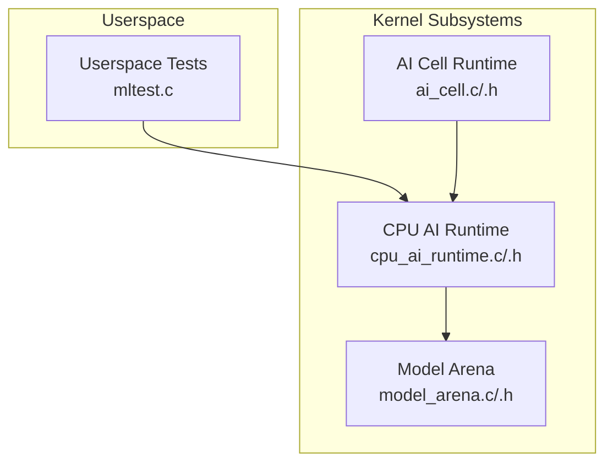
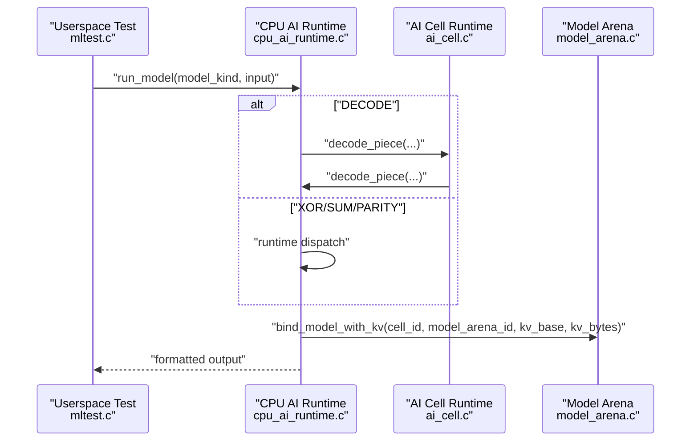
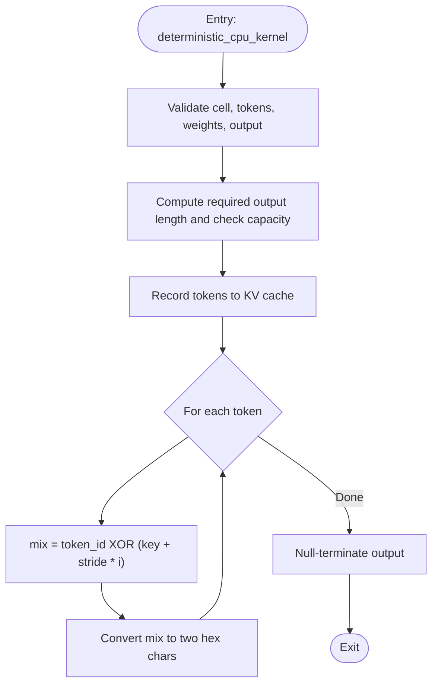
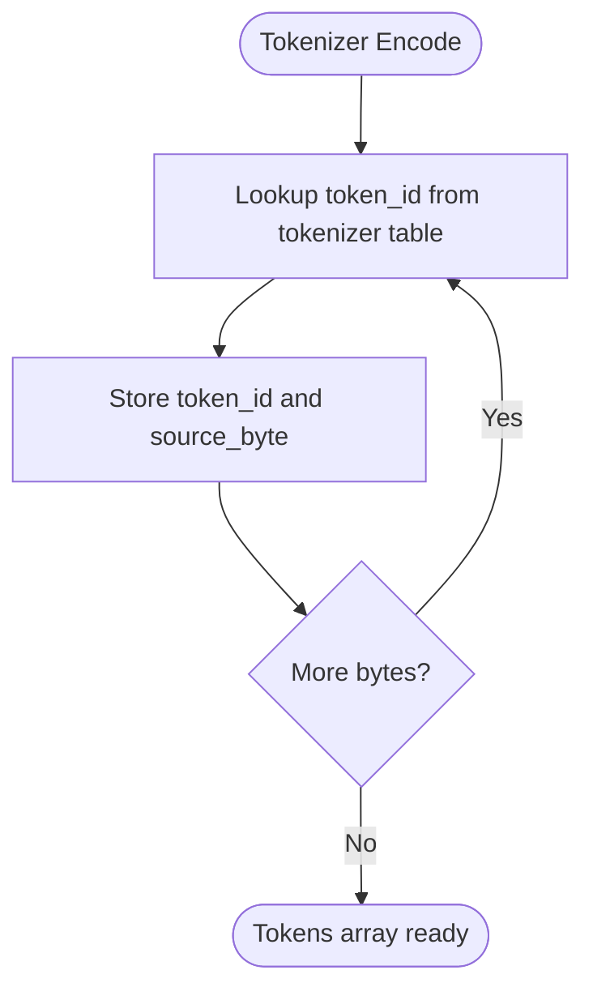
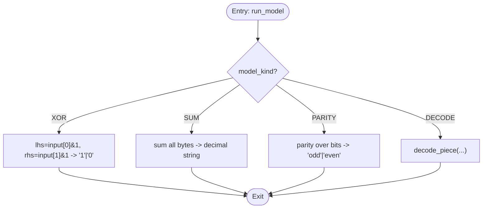
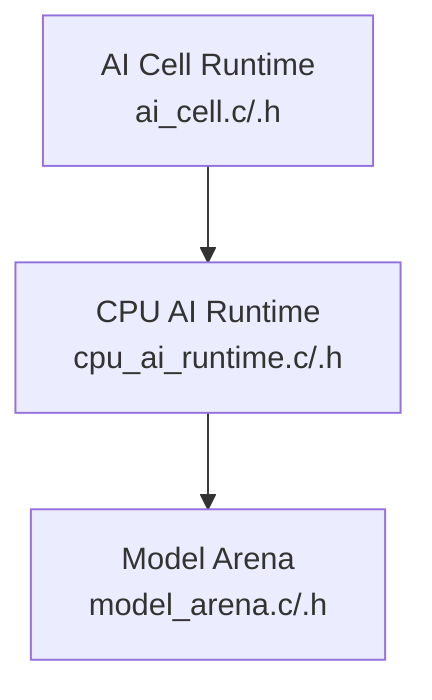

# Kernel Execution Engine

<cite>
**Referenced Files in This Document**
- [cpu_ai_runtime.h](file://kernel/include/osai/cpu_ai_runtime.h)
- [cpu_ai_runtime.c](file://kernel/runtime/cpu_ai_runtime.c)
- [ai_cell.h](file://kernel/include/osai/ai_cell.h)
- [ai_cell.c](file://kernel/runtime/ai_cell.c)
- [model_arena.h](file://kernel/include/osai/model_arena.h)
- [model_arena.c](file://kernel/runtime/model_arena.c)
- [mltest.c](file://userspace/apps/mltest.c)
</cite>

## Table of Contents
1. [Introduction](#introduction)
2. [Project Structure](#project-structure)
3. [Core Components](#core-components)
4. [Architecture Overview](#architecture-overview)
5. [Detailed Component Analysis](#detailed-component-analysis)
6. [Dependency Analysis](#dependency-analysis)
7. [Performance Considerations](#performance-considerations)
8. [Troubleshooting Guide](#troubleshooting-guide)
9. [Conclusion](#conclusion)

## Introduction
This document describes the kernel execution engine responsible for performing inference operations on validated AI models. It focuses on the deterministic CPU kernel implementation (CPU_AI_RUNTIME_DETERMINISTIC), which processes tokens through a fixed mathematical transformation using the model’s key and stride parameters. The engine supports token-by-token processing, runtime dispatch for different model kinds (OSAI_ML_MODEL_DECODE, XOR, SUM, PARITY), output formatting, memory management for output buffers, and integration with the KV cache for token recording. It also documents error handling, buffer overflow protection, and performance optimization techniques.

## Project Structure
The kernel execution engine spans several kernel subsystems:
- CPU AI Runtime: validates model images, binds models to execution cells, tokenizes input, executes kernels, and records tokens to KV cache.
- AI Cell: manages lifecycle and resources for AI workloads, including shared model binding and per-cell KV cache allocation.
- Model Arena: provides a shared, read-only memory region for model weights and tokenizer tables.
- Userspace tests: demonstrate runtime dispatch and output formatting for generic ML models.

**Diagram sources**
- [cpu_ai_runtime.c:1-824](file://kernel/runtime/cpu_ai_runtime.c#L1-L824)
- [cpu_ai_runtime.h:1-51](file://kernel/include/osai/cpu_ai_runtime.h#L1-L51)
- [ai_cell.c:1-723](file://kernel/runtime/ai_cell.c#L1-L723)
- [ai_cell.h:1-103](file://kernel/include/osai/ai_cell.h#L1-L103)
- [model_arena.c:1-141](file://kernel/runtime/model_arena.c#L1-L141)
- [model_arena.h:1-28](file://kernel/include/osai/model_arena.h#L1-L28)
- [mltest.c:1-60](file://userspace/apps/mltest.c#L1-L60)

**Section sources**
- [cpu_ai_runtime.c:1-824](file://kernel/runtime/cpu_ai_runtime.c#L1-L824)
- [cpu_ai_runtime.h:1-51](file://kernel/include/osai/cpu_ai_runtime.h#L1-L51)
- [ai_cell.c:1-723](file://kernel/runtime/ai_cell.c#L1-L723)
- [ai_cell.h:1-103](file://kernel/include/osai/ai_cell.h#L1-L103)
- [model_arena.c:1-141](file://kernel/runtime/model_arena.c#L1-L141)
- [model_arena.h:1-28](file://kernel/include/osai/model_arena.h#L1-L28)
- [mltest.c:1-60](file://userspace/apps/mltest.c#L1-L60)

## Core Components
- CPU AI Runtime: central runtime for model loading, binding, decoding, and generic ML dispatch. Implements deterministic CPU kernel and KV cache recording.
- AI Cell: orchestrates resource binding (NIC queue, workspace, KV cache, source index, logs) and coordinates model binding with the CPU AI runtime.
- Model Arena: registers model files into shared read-only arenas, ensuring safe concurrent access by multiple cells.
- Userspace tests: validate runtime dispatch for XOR, SUM, and PARITY models and confirm output formatting.

Key responsibilities:
- Deterministic CPU kernel: token-by-token processing combining token IDs with positional calculations using XOR and hexadecimal conversion.
- Runtime dispatch: routes requests to appropriate kernel implementations based on model_kind parameters.
- Output formatting: produces human-readable results for different model types with bounded output buffers.
- Memory management: enforces output capacity checks and KV cache write limits.
- Integration with KV cache: records decoded tokens for downstream use.

**Section sources**
- [cpu_ai_runtime.c:280-314](file://kernel/runtime/cpu_ai_runtime.c#L280-L314)
- [cpu_ai_runtime.c:557-606](file://kernel/runtime/cpu_ai_runtime.c#L557-L606)
- [ai_cell.c:455-468](file://kernel/runtime/ai_cell.c#L455-L468)
- [model_arena.c:54-84](file://kernel/runtime/model_arena.c#L54-L84)
- [mltest.c:17-60](file://userspace/apps/mltest.c#L17-L60)

## Architecture Overview
The runtime architecture integrates userspace requests with kernel-side execution and resource management.

**Diagram sources**
- [cpu_ai_runtime.c:557-606](file://kernel/runtime/cpu_ai_runtime.c#L557-L606)
- [cpu_ai_runtime.c:459-475](file://kernel/runtime/cpu_ai_runtime.c#L459-L475)
- [ai_cell.c:455-468](file://kernel/runtime/ai_cell.c#L455-L468)
- [model_arena.c:54-84](file://kernel/runtime/model_arena.c#L54-L84)
- [mltest.c:17-60](file://userspace/apps/mltest.c#L17-L60)

## Detailed Component Analysis

### Deterministic CPU Kernel Implementation
The deterministic CPU kernel performs token-by-token transformations using the model’s key and stride parameters embedded in the weights table. It:
- Validates input and output buffers.
- Records tokens to KV cache before processing.
- Applies a fixed mathematical transformation: XOR(token_id, key + stride * position), then converts the result to two hexadecimal characters.
- Produces a null-terminated hex string output.

**Diagram sources**
- [cpu_ai_runtime.c:280-314](file://kernel/runtime/cpu_ai_runtime.c#L280-L314)

**Section sources**
- [cpu_ai_runtime.c:280-314](file://kernel/runtime/cpu_ai_runtime.c#L280-L314)

### Token-by-Token Processing Algorithm
Token processing follows these steps:
- Tokenize input bytes via the byte-table tokenizer to produce token IDs.
- For each token, compute positional mix using the formula: mix = token_id XOR (key + stride * position).
- Convert the mix to uppercase hexadecimal and append to the output buffer.
- Enforce output capacity to prevent buffer overflow.

**Diagram sources**
- [cpu_ai_runtime.c:231-252](file://kernel/runtime/cpu_ai_runtime.c#L231-L252)

**Section sources**
- [cpu_ai_runtime.c:231-252](file://kernel/runtime/cpu_ai_runtime.c#L231-L252)
- [cpu_ai_runtime.c:280-314](file://kernel/runtime/cpu_ai_runtime.c#L280-L314)

### Runtime Dispatch Mechanism
The runtime dispatch routes requests based on model_kind:
- OSAI_ML_MODEL_DECODE: invokes decode pipeline (tokenizer + deterministic kernel + KV recording).
- OSAI_ML_MODEL_XOR: computes single-bit XOR of first two bytes and writes "1" or "0".
- OSAI_ML_MODEL_SUM: sums all input bytes and writes the decimal result.
- OSAI_ML_MODEL_PARITY: computes parity over bits and writes "odd" or "even".

**Diagram sources**
- [cpu_ai_runtime.c:557-606](file://kernel/runtime/cpu_ai_runtime.c#L557-L606)

**Section sources**
- [cpu_ai_runtime.c:557-606](file://kernel/runtime/cpu_ai_runtime.c#L557-L606)

### Output Formatting System
Output formatting ensures human-readable results:
- XOR: single character "1" or "0".
- SUM: decimal string representation of the total.
- PARITY: "odd" or "even".
- DECODE: concatenated two-character uppercase hex pairs per token plus null terminator.

Formatting helpers:
- Append ASCII text to output with capacity checks.
- Convert integers to decimal strings safely.

**Section sources**
- [cpu_ai_runtime.c:524-555](file://kernel/runtime/cpu_ai_runtime.c#L524-L555)
- [cpu_ai_runtime.c:577-597](file://kernel/runtime/cpu_ai_runtime.c#L577-L597)

### Memory Management and Buffer Overflow Protection
Safety mechanisms include:
- Output capacity checks before writing formatted results.
- KV cache write bounds checking to prevent overflow.
- Token count limits enforced during decode.
- Shared model arenas mapped read-only to prevent accidental writes.

**Section sources**
- [cpu_ai_runtime.c:291-294](file://kernel/runtime/cpu_ai_runtime.c#L291-L294)
- [cpu_ai_runtime.c:264-268](file://kernel/runtime/cpu_ai_runtime.c#L264-L268)
- [cpu_ai_runtime.c:499-501](file://kernel/runtime/cpu_ai_runtime.c#L499-L501)
- [model_arena.c:23-39](file://kernel/runtime/model_arena.c#L23-L39)

### Integration with KV Cache
KV cache integration:
- Each decode call records token IDs contiguously in 32-bit aligned slots.
- Cursor advances by token_count * sizeof(uint32_t).
- Writes tracked globally and per-cell for telemetry.

**Section sources**
- [cpu_ai_runtime.c:254-278](file://kernel/runtime/cpu_ai_runtime.c#L254-L278)

### Model Loading and Binding
Model loading and binding:
- Models are registered into shared read-only arenas.
- Manifest validation ensures correct magic/version/header/quantization, runtime flag, and payload hash.
- KV cache requirements are validated against requested arena size.
- Cells bind shared models and receive per-cell KV base and size.

**Section sources**
- [cpu_ai_runtime.c:143-198](file://kernel/runtime/cpu_ai_runtime.c#L143-L198)
- [cpu_ai_runtime.c:389-457](file://kernel/runtime/cpu_ai_runtime.c#L389-L457)
- [model_arena.c:54-84](file://kernel/runtime/model_arena.c#L54-L84)
- [ai_cell.c:455-468](file://kernel/runtime/ai_cell.c#L455-L468)

### Userspace Validation
Userspace tests validate:
- XOR model correctness ("1" for 1 XOR 0).
- SUM model correctness (1+2+3+4=10).
- PARITY model correctness ("odd" for 1 XOR 1 XOR 1).

**Section sources**
- [mltest.c:17-60](file://userspace/apps/mltest.c#L17-L60)

## Dependency Analysis
The runtime composes multiple kernel subsystems with clear boundaries and responsibilities.

**Diagram sources**
- [cpu_ai_runtime.c:1-824](file://kernel/runtime/cpu_ai_runtime.c#L1-L824)
- [ai_cell.c:1-723](file://kernel/runtime/ai_cell.c#L1-L723)
- [model_arena.c:1-141](file://kernel/runtime/model_arena.c#L1-L141)

**Section sources**
- [cpu_ai_runtime.c:1-824](file://kernel/runtime/cpu_ai_runtime.c#L1-L824)
- [ai_cell.c:1-723](file://kernel/runtime/ai_cell.c#L1-L723)
- [model_arena.c:1-141](file://kernel/runtime/model_arena.c#L1-L141)

## Performance Considerations
- Fixed-size loop with minimal branching per token for deterministic kernel.
- Single-pass tokenization and immediate output formatting reduce overhead.
- Shared read-only model arenas avoid repeated copies and enable efficient multi-cell sharing.
- KV cache writes are contiguous and bounded by token counts.
- Telemetry counters track dispatches and failures for operational insights.

[No sources needed since this section provides general guidance]

## Troubleshooting Guide
Common failure modes and mitigations:
- Invalid cell ID or state: ensure proper initialization and binding before decode.
- Insufficient output capacity: allocate larger buffers to accommodate 2 hex chars per token plus terminator.
- KV cache overflow: verify kv_bytes meets model requirements and cursor advancement.
- Model admission rejections: check manifest fields (magic, version, runtime flag, payload hash).
- GPU-required models rejected: runtime supports CPU-only models only.

Operational counters:
- Admission rejections, checksum failures, GPU rejections, and dispatch counts help diagnose issues.

**Section sources**
- [cpu_ai_runtime.c:143-198](file://kernel/runtime/cpu_ai_runtime.c#L143-L198)
- [cpu_ai_runtime.c:291-294](file://kernel/runtime/cpu_ai_runtime.c#L291-L294)
- [cpu_ai_runtime.c:264-268](file://kernel/runtime/cpu_ai_runtime.c#L264-L268)
- [cpu_ai_runtime.c:389-457](file://kernel/runtime/cpu_ai_runtime.c#L389-L457)

## Conclusion
The kernel execution engine provides a robust, deterministic CPU runtime for AI inference. It validates models, binds shared resources, processes tokens deterministically, and formats outputs safely. The runtime dispatch supports multiple model kinds, integrates with KV cache for token recording, and enforces strict buffer and capacity protections. Telemetry counters enable monitoring and troubleshooting, while shared model arenas optimize memory usage across multiple cells.