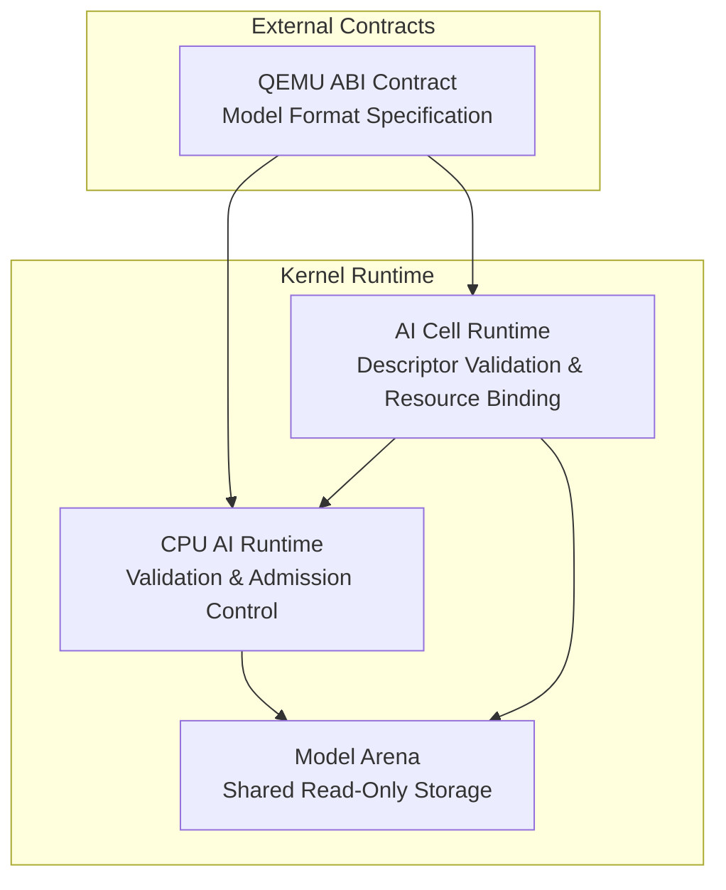
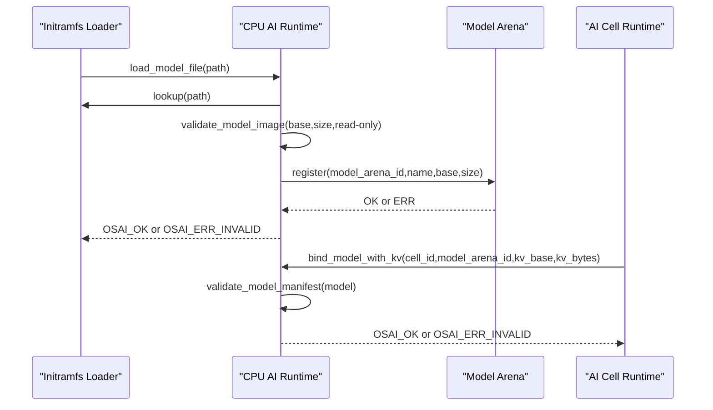
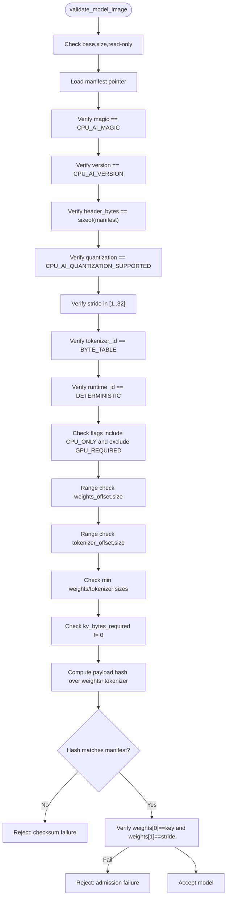
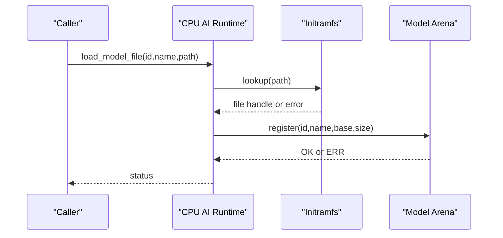
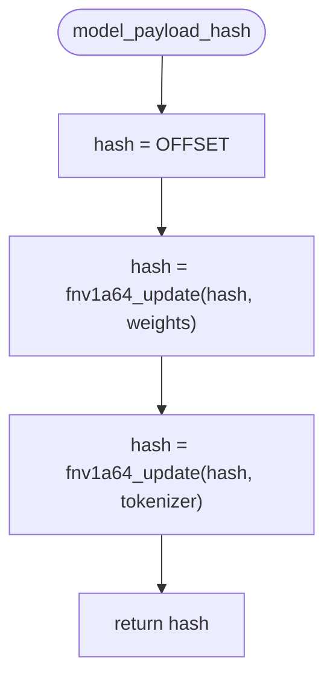
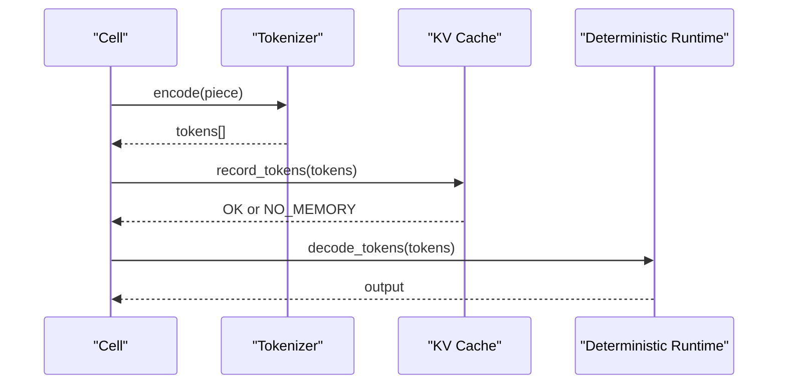
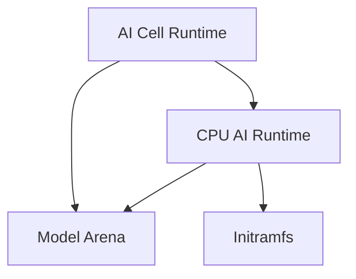

# Model Validation System

<cite>
**Referenced Files in This Document**
- [cpu_ai_runtime.h](file://kernel/include/osai/cpu_ai_runtime.h)
- [cpu_ai_runtime.c](file://kernel/runtime/cpu_ai_runtime.c)
- [model_arena.h](file://kernel/include/osai/model_arena.h)
- [model_arena.c](file://kernel/runtime/model_arena.c)
- [ai_cell.h](file://kernel/include/osai/ai_cell.h)
- [ai_cell.c](file://kernel/runtime/ai_cell.c)
- [qemu-rc-v1.json](file://contracts/qemu-rc-v1.json)
</cite>

## Table of Contents
1. [Introduction](#introduction)
2. [Project Structure](#project-structure)
3. [Core Components](#core-components)
4. [Architecture Overview](#architecture-overview)
5. [Detailed Component Analysis](#detailed-component-analysis)
6. [Dependency Analysis](#dependency-analysis)
7. [Performance Considerations](#performance-considerations)
8. [Troubleshooting Guide](#troubleshooting-guide)
9. [Conclusion](#conclusion)

## Introduction
This document describes the model validation system that ensures AI model integrity and compatibility in OSAI's CPU runtime. It covers the validation pipeline including magic number verification, version checking, header byte validation, quantization support verification, and flag validation. It also documents the admission control process that rejects GPU-required models and handles checksum failures, the model manifest structure with its 43 fields, the FNV1A64 hash algorithm implementation for payload verification, and range validation checks for weight and tokenizer sections. Finally, it outlines model loading rejection scenarios and their corresponding counters for monitoring and debugging.

## Project Structure
The model validation system spans several kernel components:
- CPU AI Runtime: Loads and validates model images, enforces admission rules, and tracks metrics.
- Model Arena: Provides shared, read-only storage for model weights and tokenizer tables.
- AI Cell: Manages higher-level AI cell descriptors and resources, including validation of descriptors and resource binding.

**Diagram sources**
- [cpu_ai_runtime.c:143-198](file://kernel/runtime/cpu_ai_runtime.c#L143-L198)
- [model_arena.c:54-84](file://kernel/runtime/model_arena.c#L54-L84)
- [ai_cell.c:148-181](file://kernel/runtime/ai_cell.c#L148-L181)
- [qemu-rc-v1.json:232-246](file://contracts/qemu-rc-v1.json#L232-L246)

**Section sources**
- [cpu_ai_runtime.c:1-120](file://kernel/runtime/cpu_ai_runtime.c#L1-L120)
- [model_arena.c:1-84](file://kernel/runtime/model_arena.c#L1-L84)
- [ai_cell.c:1-120](file://kernel/runtime/ai_cell.c#L1-L120)
- [qemu-rc-v1.json:232-246](file://contracts/qemu-rc-v1.json#L232-L246)

## Core Components
- CPU AI Runtime: Implements model validation, admission control, and runtime decoding. It defines constants for magic numbers, versions, header sizes, quantization support, and flags. It performs manifest validation, payload hashing, and range checks.
- Model Arena: Registers model images into shared, read-only memory arenas, ensuring models are immutable and can be safely shared across cells.
- AI Cell: Validates AI cell descriptors against required flags and checksums, reserves resources, and binds models to cells.

Key validation constants and structures:
- Magic number verification: CPU_AI_MAGIC
- Version checking: CPU_AI_VERSION
- Header byte validation: CPU_AI_HEADER_BYTES
- Quantization support verification: CPU_AI_QUANTIZATION_SUPPORTED
- Flag validation: CPU_AI_FLAG_CPU_ONLY and CPU_AI_FLAG_GPU_REQUIRED
- Tokenizer and runtime identifiers: CPU_AI_TOKENIZER_BYTE_TABLE and CPU_AI_RUNTIME_DETERMINISTIC
- Minimum sizes: CPU_AI_MIN_WEIGHT_BYTES and CPU_AI_TOKENIZER_BYTES

**Section sources**
- [cpu_ai_runtime.c:8-21](file://kernel/runtime/cpu_ai_runtime.c#L8-L21)
- [cpu_ai_runtime.c:25-43](file://kernel/runtime/cpu_ai_runtime.c#L25-L43)
- [cpu_ai_runtime.h:7-48](file://kernel/include/osai/cpu_ai_runtime.h#L7-L48)
- [model_arena.c:54-84](file://kernel/runtime/model_arena.c#L54-L84)
- [ai_cell.c:148-181](file://kernel/runtime/ai_cell.c#L148-L181)

## Architecture Overview
The model validation pipeline operates in two stages:
1. Model Image Validation: Validates the model manifest and payload integrity.
2. Admission Control: Enforces CPU-only requirement, GPU rejection, and resource availability.

**Diagram sources**
- [cpu_ai_runtime.c:357-381](file://kernel/runtime/cpu_ai_runtime.c#L357-L381)
- [cpu_ai_runtime.c:143-198](file://kernel/runtime/cpu_ai_runtime.c#L143-L198)
- [model_arena.c:54-84](file://kernel/runtime/model_arena.c#L54-L84)
- [cpu_ai_runtime.c:389-457](file://kernel/runtime/cpu_ai_runtime.c#L389-L457)
- [ai_cell.c:423-478](file://kernel/runtime/ai_cell.c#L423-L478)

## Detailed Component Analysis

### Model Manifest Structure and Validation
The model manifest is a fixed-size header containing metadata and offsets that define the model layout. The validation routine checks:
- Magic number equals CPU_AI_MAGIC
- Version equals CPU_AI_VERSION
- Header size equals CPU_AI_HEADER_BYTES
- Quantization equals CPU_AI_QUANTIZATION_SUPPORTED
- Stride within allowed bounds
- Tokenizer ID equals CPU_AI_TOKENIZER_BYTE_TABLE
- Runtime ID equals CPU_AI_RUNTIME_DETERMINISTIC
- Flags include CPU_AI_FLAG_CPU_ONLY and exclude GPU requirement
- Weight and tokenizer ranges are within model bounds
- Minimum sizes for weights and tokenizer
- KV cache requirement is nonzero
- Payload hash matches computed FNV1A64 over weights and tokenizer sections
- Initial bytes of weights match key and stride

**Diagram sources**
- [cpu_ai_runtime.c:143-198](file://kernel/runtime/cpu_ai_runtime.c#L143-L198)
- [cpu_ai_runtime.c:133-141](file://kernel/runtime/cpu_ai_runtime.c#L133-L141)
- [cpu_ai_runtime.c:117-122](file://kernel/runtime/cpu_ai_runtime.c#L117-L122)

**Section sources**
- [cpu_ai_runtime.c:25-43](file://kernel/runtime/cpu_ai_runtime.c#L25-L43)
- [cpu_ai_runtime.c:143-198](file://kernel/runtime/cpu_ai_runtime.c#L143-L198)
- [cpu_ai_runtime.c:133-141](file://kernel/runtime/cpu_ai_runtime.c#L133-L141)

### Admission Control and Rejection Scenarios
Admission control rejects models meeting any of the following criteria:
- Invalid base, insufficient size, or not read-only
- Wrong magic, version, header size, or quantization
- Unsupported tokenizer/runtime or invalid stride
- Missing CPU-only flag or presence of GPU-required flag
- Out-of-range or undersized weight/tokenizer sections
- Zero KV requirement
- Payload hash mismatch
- Key/stride mismatch at weights start

Rejection increments the admission reject counter and, specifically for GPU-required models, increments the GPU reject counter.

**Section sources**
- [cpu_ai_runtime.c:143-198](file://kernel/runtime/cpu_ai_runtime.c#L143-L198)
- [cpu_ai_runtime.c:171-180](file://kernel/runtime/cpu_ai_runtime.c#L171-L180)
- [cpu_ai_runtime.h:39-47](file://kernel/include/osai/cpu_ai_runtime.h#L39-L47)

### Model Loading and Registration
Model loading proceeds via the CPU AI runtime’s file loader:
- Validates path and file attributes
- Registers the model into a model arena as read-only
- On success, updates counters and logs model details

Registration copies the model into a shared arena and maps it read-only, enabling safe concurrent access.

**Diagram sources**
- [cpu_ai_runtime.c:357-381](file://kernel/runtime/cpu_ai_runtime.c#L357-L381)
- [model_arena.c:54-84](file://kernel/runtime/model_arena.c#L54-L84)

**Section sources**
- [cpu_ai_runtime.c:357-381](file://kernel/runtime/cpu_ai_runtime.c#L357-L381)
- [model_arena.c:54-84](file://kernel/runtime/model_arena.c#L54-L84)

### FNV1A64 Payload Hash Algorithm
The payload hash is computed over the concatenated weights and tokenizer sections using FNV-1a with:
- Offset basis: FNV1A64_OFFSET
- Prime multiplier: FNV1A64_PRIME

The algorithm iterates over bytes, XOR-ing and multiplying by the prime for each byte.

**Diagram sources**
- [cpu_ai_runtime.c:133-141](file://kernel/runtime/cpu_ai_runtime.c#L133-L141)
- [cpu_ai_runtime.c:124-131](file://kernel/runtime/cpu_ai_runtime.c#L124-L131)

**Section sources**
- [cpu_ai_runtime.c:19-20](file://kernel/runtime/cpu_ai_runtime.c#L19-L20)
- [cpu_ai_runtime.c:124-141](file://kernel/runtime/cpu_ai_runtime.c#L124-L141)

### Range Validation Checks
Range validation ensures that weight and tokenizer sections fall entirely within the model image:
- Offset must be less than total model size
- Size must not exceed remaining bytes from offset

These checks prevent buffer overruns and invalid memory accesses.

**Section sources**
- [cpu_ai_runtime.c:117-122](file://kernel/runtime/cpu_ai_runtime.c#L117-L122)

### Tokenizer and Runtime Integration
The runtime supports a byte-table tokenizer and a deterministic CPU dispatch runtime. Decoding converts input bytes into hex-encoded tokens using a simple mixing function keyed by manifest-provided key and stride, writing tokens into a KV cache.

**Diagram sources**
- [cpu_ai_runtime.c:231-252](file://kernel/runtime/cpu_ai_runtime.c#L231-L252)
- [cpu_ai_runtime.c:254-278](file://kernel/runtime/cpu_ai_runtime.c#L254-L278)
- [cpu_ai_runtime.c:280-314](file://kernel/runtime/cpu_ai_runtime.c#L280-L314)

**Section sources**
- [cpu_ai_runtime.c:231-314](file://kernel/runtime/cpu_ai_runtime.c#L231-L314)

### AI Cell Descriptor Validation
AI cell descriptors are validated against required flags and checksums. The descriptor checksum excludes the checksum field itself during computation. Descriptor validation ensures:
- Correct magic, version, and descriptor size
- Required flags present and no unsupported flags set
- Valid name length and content
- Predefined build/log sizes
- Descriptor checksum validity

**Section sources**
- [ai_cell.c:148-181](file://kernel/runtime/ai_cell.c#L148-L181)
- [ai_cell.h:43-60](file://kernel/include/osai/ai_cell.h#L43-L60)

## Dependency Analysis
The model validation system exhibits clear separation of concerns:
- CPU AI Runtime depends on Model Arena for shared storage and on Initramfs for model discovery.
- AI Cell Runtime depends on CPU AI Runtime for model binding and on Model Arena for model acquisition.
- Both components rely on FNV1A64 hashing for integrity verification.

**Diagram sources**
- [cpu_ai_runtime.c:3-6](file://kernel/runtime/cpu_ai_runtime.c#L3-L6)
- [model_arena.c:1-6](file://kernel/runtime/model_arena.c#L1-L6)
- [ai_cell.c:1-8](file://kernel/runtime/ai_cell.c#L1-L8)

**Section sources**
- [cpu_ai_runtime.c:3-6](file://kernel/runtime/cpu_ai_runtime.c#L3-L6)
- [model_arena.c:1-6](file://kernel/runtime/model_arena.c#L1-L6)
- [ai_cell.c:1-8](file://kernel/runtime/ai_cell.c#L1-L8)

## Performance Considerations
- Hashing cost: FNV1A64 over weights and tokenizer scales linearly with payload size. Keep payloads reasonably sized to minimize overhead.
- Memory mapping: Registering models as read-only avoids extra copies and enables efficient sharing across cells.
- Range checks: Minimal overhead but essential for safety; ensure manifests are correct to avoid repeated rejections.

## Troubleshooting Guide
Common rejection reasons and their counters:
- Admission reject count: Incremented for invalid base, wrong magic/version/header, unsupported quantization/tokenizer/runtime, missing CPU-only flag, GPU-required flag, out-of-range or undersized sections, zero KV requirement, or key/stride mismatch.
- GPU reject count: Incremented when GPU-required flag is detected.
- Checksum failure count: Incremented when payload hash does not match manifest.
- Model file load/reject counts: Track successful and rejected model file loads.
- Manifest validation count: Tracks total manifest validations performed.

Use these counters to diagnose issues:
- High admission reject count suggests malformed manifests or wrong flags.
- Non-zero GPU reject count indicates models marked GPU-required were rejected.
- Non-zero checksum failure count indicates corrupted payloads or incorrect hashing.

**Section sources**
- [cpu_ai_runtime.h:39-47](file://kernel/include/osai/cpu_ai_runtime.h#L39-L47)
- [cpu_ai_runtime.c:76-90](file://kernel/runtime/cpu_ai_runtime.c#L76-L90)
- [cpu_ai_runtime.c:148-198](file://kernel/runtime/cpu_ai_runtime.c#L148-L198)

## Conclusion
The model validation system in OSAI’s CPU runtime provides robust integrity and compatibility checks for AI models. Through strict manifest validation, payload hashing, and admission control, it ensures only CPU-only, properly structured models are admitted. The system’s counters enable effective monitoring and debugging of validation outcomes, supporting reliable operation in the kernel runtime environment.