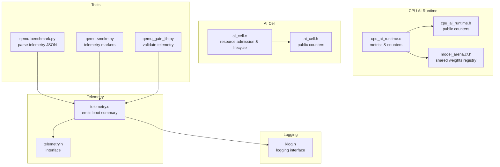
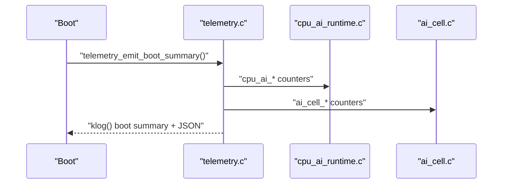
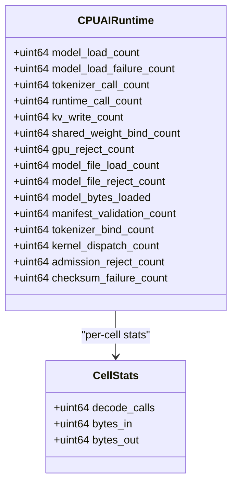
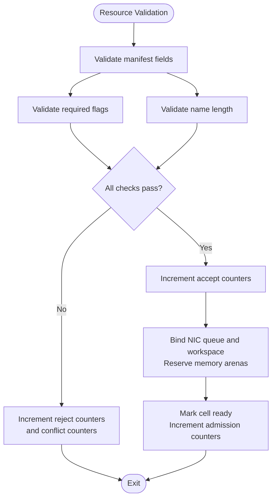
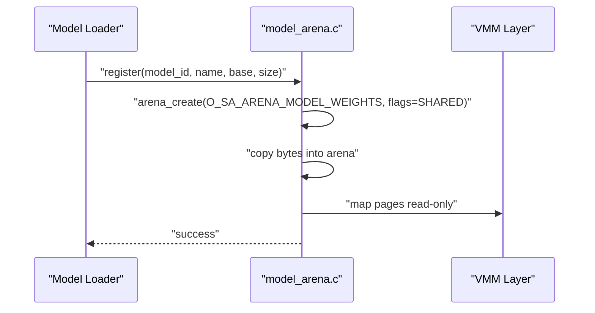
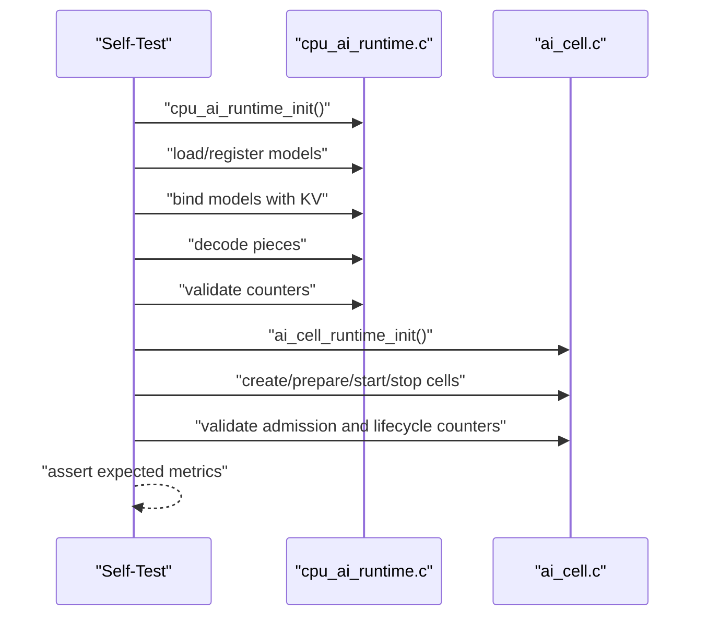
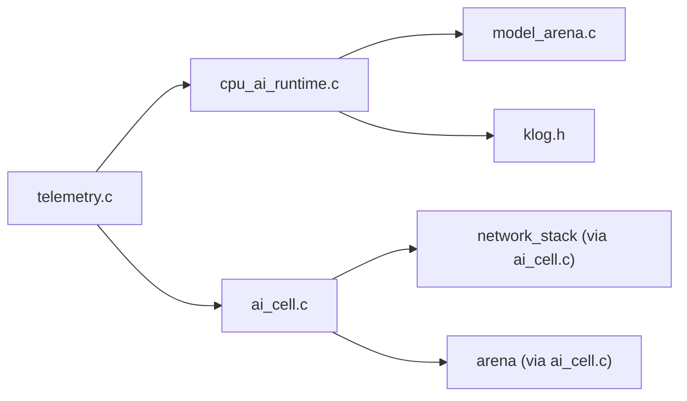

# Performance Monitoring and Metrics

<cite>
**Referenced Files in This Document**
- [telemetry.h](file://kernel/include/osai/telemetry.h)
- [telemetry.c](file://kernel/core/telemetry.c)
- [cpu_ai_runtime.h](file://kernel/include/osai/cpu_ai_runtime.h)
- [cpu_ai_runtime.c](file://kernel/runtime/cpu_ai_runtime.c)
- [ai_cell.h](file://kernel/include/osai/ai_cell.h)
- [ai_cell.c](file://kernel/runtime/ai_cell.c)
- [model_arena.h](file://kernel/include/osai/model_arena.h)
- [model_arena.c](file://kernel/runtime/model_arena.c)
- [klog.h](file://kernel/include/osai/klog.h)
- [qemu-benchmark.py](file://scripts/qemu-benchmark.py)
- [qemu-smoke.py](file://scripts/qemu-smoke.py)
- [qemu_gate_lib.py](file://scripts/qemu_gate_lib.py)
</cite>

## Table of Contents
1. [Introduction](#introduction)
2. [Project Structure](#project-structure)
3. [Core Components](#core-components)
4. [Architecture Overview](#architecture-overview)
5. [Detailed Component Analysis](#detailed-component-analysis)
6. [Dependency Analysis](#dependency-analysis)
7. [Performance Considerations](#performance-considerations)
8. [Troubleshooting Guide](#troubleshooting-guide)
9. [Conclusion](#conclusion)
10. [Appendices](#appendices)

## Introduction
This document describes the performance monitoring and metrics collection system that tracks runtime performance and operational statistics across the AI cell runtime and CPU AI runtime subsystems. It documents the counter system for model loads, tokenizer calls, runtime execution, KV cache operations, admission control, model file loading, payload hash validation, and per-cell statistics such as decode call counts and byte throughput. It also explains the self-test framework that validates runtime behavior and the logging system used for operational visibility. Finally, it covers the metric reporting interface and how to use it for system monitoring and debugging.

## Project Structure
The performance monitoring spans several kernel subsystems:
- Telemetry emission and boot summary reporting
- CPU AI runtime metrics and per-cell statistics
- AI cell lifecycle and resource admission metrics
- Model arena registration and shared weight binding
- Logging infrastructure for operational visibility
- Test harnesses that exercise and validate metrics

**Diagram sources**
- [telemetry.c:24-132](file://kernel/core/telemetry.c#L24-L132)
- [telemetry.h:4](file://kernel/include/osai/telemetry.h#L4)
- [cpu_ai_runtime.c:76-91](file://kernel/runtime/cpu_ai_runtime.c#L76-L91)
- [cpu_ai_runtime.h:33-48](file://kernel/include/osai/cpu_ai_runtime.h#L33-L48)
- [model_arena.c:54-84](file://kernel/runtime/model_arena.c#L54-L84)
- [ai_cell.c:26-40](file://kernel/runtime/ai_cell.c#L26-L40)
- [ai_cell.h:87-100](file://kernel/include/osai/ai_cell.h#L87-L100)
- [klog.h:6-10](file://kernel/include/osai/klog.h#L6-L10)
- [qemu-benchmark.py:8-19](file://scripts/qemu-benchmark.py#L8-L19)
- [qemu-smoke.py:333-336](file://scripts/qemu-smoke.py#L333-L336)
- [qemu_gate_lib.py:49-57](file://scripts/qemu_gate_lib.py#L49-L57)

**Section sources**
- [telemetry.c:24-132](file://kernel/core/telemetry.c#L24-L132)
- [cpu_ai_runtime.c:76-91](file://kernel/runtime/cpu_ai_runtime.c#L76-L91)
- [ai_cell.c:26-40](file://kernel/runtime/ai_cell.c#L26-L40)
- [model_arena.c:54-84](file://kernel/runtime/model_arena.c#L54-L84)
- [klog.h:6-10](file://kernel/include/osai/klog.h#L6-L10)
- [qemu-benchmark.py:8-19](file://scripts/qemu-benchmark.py#L8-L19)
- [qemu-smoke.py:333-336](file://scripts/qemu-smoke.py#L333-L336)
- [qemu_gate_lib.py:49-57](file://scripts/qemu_gate_lib.py#L49-L57)

## Core Components
- Telemetry emission: Centralized boot summary emission that aggregates counters from multiple subsystems into a single log line and a structured JSON payload.
- CPU AI runtime metrics: Counters for model loads/unloads, tokenizer calls, runtime dispatches, KV writes, shared weight binds, GPU rejections, model file loads/rejects, bytes loaded, manifest validations, tokenizer binds, kernel dispatches, admission rejections, checksum failures, plus per-cell statistics (decode calls, bytes_in, bytes_out).
- AI cell resource admission and lifecycle metrics: Descriptor acceptance/rejection, resource admission/rejection, arena reservations and peaks, queue/workspace bindings/releases, conflicts.
- Model arena: Shared read-only model weight registry with reference counting and read-only mapping.
- Logging: Kernel logging interface used by telemetry and runtime components to emit operational messages.
- Self-tests: Unit tests that validate metrics correctness and runtime behavior.

**Section sources**
- [telemetry.c:24-132](file://kernel/core/telemetry.c#L24-L132)
- [cpu_ai_runtime.c:76-91](file://kernel/runtime/cpu_ai_runtime.c#L76-L91)
- [cpu_ai_runtime.c:608-673](file://kernel/runtime/cpu_ai_runtime.c#L608-L673)
- [ai_cell.c:26-40](file://kernel/runtime/ai_cell.c#L26-L40)
- [ai_cell.c:510-564](file://kernel/runtime/ai_cell.c#L510-L564)
- [model_arena.c:54-84](file://kernel/runtime/model_arena.c#L54-L84)
- [klog.h:6-10](file://kernel/include/osai/klog.h#L6-L10)

## Architecture Overview
The telemetry system emits a boot summary that includes counters from CPU AI runtime and AI cell subsystems. These counters originate from runtime components and are aggregated into a human-readable log line and a structured JSON payload. Tests and gate scripts parse this JSON to validate system behavior and performance claims.

**Diagram sources**
- [telemetry.c:24-132](file://kernel/core/telemetry.c#L24-L132)
- [cpu_ai_runtime.c:615-673](file://kernel/runtime/cpu_ai_runtime.c#L615-L673)
- [ai_cell.c:510-564](file://kernel/runtime/ai_cell.c#L510-L564)

## Detailed Component Analysis

### Telemetry Emission and Reporting
- Purpose: Emit a boot summary containing counters from multiple subsystems.
- Mechanism: Aggregates counters via public accessor functions and logs both a formatted line and a JSON payload.
- Consumers: Test suites and gate scripts parse the JSON for validation and performance checks.

Key behaviors:
- Emits counters for CPU AI runtime and AI cell subsystems.
- Uses the kernel logging interface for visibility.
- JSON parsing helpers in test scripts extract and validate telemetry.

**Section sources**
- [telemetry.c:24-132](file://kernel/core/telemetry.c#L24-L132)
- [qemu-benchmark.py:8-19](file://scripts/qemu-benchmark.py#L8-L19)
- [qemu-smoke.py:333-336](file://scripts/qemu-smoke.py#L333-L336)
- [qemu_gate_lib.py:49-57](file://scripts/qemu_gate_lib.py#L49-L57)

### CPU AI Runtime Metrics and Per-Cell Statistics
Counters and statistics tracked:
- Model load counts: total successful loads and failures
- Tokenizer call statistics: number of tokenizer invocations
- Runtime execution metrics: total runtime calls and kernel dispatches
- KV cache operations: total KV writes
- Admission control tracking: GPU rejections, admission rejections
- Model file loading: file loads and rejections, bytes loaded
- Manifest validation and tokenizer binding: counts for validation and tokenizer binds
- Payload hash validation: checksum failure count
- Per-cell statistics: decode call count, bytes_in, bytes_out

Per-cell statistics are stored in the runtime cell structure and exposed via a dedicated accessor.

**Diagram sources**
- [cpu_ai_runtime.c:76-91](file://kernel/runtime/cpu_ai_runtime.c#L76-L91)
- [cpu_ai_runtime.c:50-72](file://kernel/runtime/cpu_ai_runtime.c#L50-L72)
- [cpu_ai_runtime.c:608-613](file://kernel/runtime/cpu_ai_runtime.c#L608-L613)

**Section sources**
- [cpu_ai_runtime.c:76-91](file://kernel/runtime/cpu_ai_runtime.c#L76-L91)
- [cpu_ai_runtime.c:50-72](file://kernel/runtime/cpu_ai_runtime.c#L50-L72)
- [cpu_ai_runtime.c:608-613](file://kernel/runtime/cpu_ai_runtime.c#L608-L613)
- [cpu_ai_runtime.h:33-48](file://kernel/include/osai/cpu_ai_runtime.h#L33-L48)

### AI Cell Resource Admission and Lifecycle Metrics
Counters tracked:
- Descriptor acceptance and rejection counts
- Resource admission and rejection counts
- Arena reservation totals and peak usage
- Queue and workspace bind/release counts
- Conflict counts

These counters are maintained in static variables and exposed via public accessors.

**Diagram sources**
- [ai_cell.c:122-181](file://kernel/runtime/ai_cell.c#L122-L181)
- [ai_cell.c:423-478](file://kernel/runtime/ai_cell.c#L423-L478)

**Section sources**
- [ai_cell.c:26-40](file://kernel/runtime/ai_cell.c#L26-L40)
- [ai_cell.c:122-181](file://kernel/runtime/ai_cell.c#L122-L181)
- [ai_cell.c:423-478](file://kernel/runtime/ai_cell.c#L423-L478)
- [ai_cell.h:87-100](file://kernel/include/osai/ai_cell.h#L87-L100)

### Model Arena and Shared Weight Binding
- Registers model images into shared read-only arenas.
- Maps arena pages as read-only to prevent modification.
- Tracks reference counts for shared weight reuse across cells.

**Diagram sources**
- [model_arena.c:54-84](file://kernel/runtime/model_arena.c#L54-L84)
- [model_arena.c:23-39](file://kernel/runtime/model_arena.c#L23-L39)

**Section sources**
- [model_arena.c:54-84](file://kernel/runtime/model_arena.c#L54-L84)
- [model_arena.c:23-39](file://kernel/runtime/model_arena.c#L23-L39)

### Self-Test Framework
Both CPU AI runtime and AI cell include self-tests that:
- Initialize subsystems and validate internal state transitions.
- Exercise metrics under normal and error conditions.
- Assert expected counter increments and per-cell statistics.

**Diagram sources**
- [cpu_ai_runtime.c:717-800](file://kernel/runtime/cpu_ai_runtime.c#L717-L800)
- [ai_cell.c:599-722](file://kernel/runtime/ai_cell.c#L599-L722)

**Section sources**
- [cpu_ai_runtime.c:717-800](file://kernel/runtime/cpu_ai_runtime.c#L717-L800)
- [ai_cell.c:599-722](file://kernel/runtime/ai_cell.c#L599-L722)

## Dependency Analysis
The telemetry emission depends on CPU AI runtime and AI cell counters. CPU AI runtime depends on model arena for shared weights and on logging for operational messages. AI cell depends on networking and arena subsystems for resource binding and memory arenas.

**Diagram sources**
- [telemetry.c:1-23](file://kernel/core/telemetry.c#L1-L23)
- [cpu_ai_runtime.c:1-7](file://kernel/runtime/cpu_ai_runtime.c#L1-L7)
- [ai_cell.c:1-9](file://kernel/runtime/ai_cell.c#L1-L9)

**Section sources**
- [telemetry.c:1-23](file://kernel/core/telemetry.c#L1-L23)
- [cpu_ai_runtime.c:1-7](file://kernel/runtime/cpu_ai_runtime.c#L1-L7)
- [ai_cell.c:1-9](file://kernel/runtime/ai_cell.c#L1-L9)

## Performance Considerations
- Counter granularity: Metrics are per-subsystem and per-cell, enabling targeted performance analysis.
- Overhead: Counters are integer increments and minimal overhead; logging should be used judiciously in hot paths.
- Memory mapping: Model arena mapping as read-only prevents accidental modifications and supports efficient sharing.
- Admission control: Early rejections reduce unnecessary work and help maintain system stability.

## Troubleshooting Guide
Common scenarios and diagnostics:
- Missing telemetry JSON: Verify the presence of the telemetry marker and ensure the JSON payload is well-formed.
- Excess admission rejections: Review model manifest validation and GPU requirement flags.
- KV write failures: Confirm KV buffer size and cursor alignment.
- Shared weight binding issues: Ensure model arena registration succeeded and reference counts are correct.

Operational visibility:
- Use kernel logging to inspect runtime messages and summaries.
- Parse telemetry JSON in test scripts to validate system health and performance.

**Section sources**
- [qemu-benchmark.py:8-19](file://scripts/qemu-benchmark.py#L8-L19)
- [qemu-smoke.py:333-336](file://scripts/qemu-smoke.py#L333-L336)
- [qemu_gate_lib.py:49-57](file://scripts/qemu_gate_lib.py#L49-L57)
- [klog.h:6-10](file://kernel/include/osai/klog.h#L6-L10)

## Conclusion
The performance monitoring system provides comprehensive counters for model loading, tokenizer and runtime activity, KV cache operations, admission control, and per-cell throughput. Telemetry aggregation enables centralized reporting, while self-tests validate correctness and behavior. The logging interface ensures operational visibility, and test scripts facilitate automated validation and performance gating.

## Appendices

### Metric Reference
- CPU AI runtime counters:
  - Model load counts: [cpu_ai_runtime_model_load_count:615-617](file://kernel/runtime/cpu_ai_runtime.c#L615-L617), [cpu_ai_runtime_model_load_failure_count:619-621](file://kernel/runtime/cpu_ai_runtime.c#L619-L621)
  - Tokenizer call statistics: [cpu_ai_runtime_tokenizer_call_count:623-625](file://kernel/runtime/cpu_ai_runtime.c#L623-L625)
  - Runtime execution metrics: [cpu_ai_runtime_runtime_call_count:627-629](file://kernel/runtime/cpu_ai_runtime.c#L627-L629), [cpu_ai_runtime_kernel_dispatch_count:663-665](file://kernel/runtime/cpu_ai_runtime.c#L663-L665)
  - KV cache operations: [cpu_ai_runtime_kv_write_count:631-633](file://kernel/runtime/cpu_ai_runtime.c#L631-L633)
  - Admission control tracking: [cpu_ai_runtime_admission_reject_count:667-669](file://kernel/runtime/cpu_ai_runtime.c#L667-L669), [cpu_ai_runtime_gpu_reject_count:639-641](file://kernel/runtime/cpu_ai_runtime.c#L639-L641)
  - Model file loading: [cpu_ai_runtime_model_file_load_count:643-645](file://kernel/runtime/cpu_ai_runtime.c#L643-L645), [cpu_ai_runtime_model_file_reject_count:647-649](file://kernel/runtime/cpu_ai_runtime.c#L647-L649)
  - Manifest validation and tokenizer binding: [cpu_ai_runtime_manifest_validation_count:655-657](file://kernel/runtime/cpu_ai_runtime.c#L655-L657), [cpu_ai_runtime_tokenizer_bind_count:659-661](file://kernel/runtime/cpu_ai_runtime.c#L659-L661)
  - Payload hash validation: [cpu_ai_runtime_checksum_failure_count:671-673](file://kernel/runtime/cpu_ai_runtime.c#L671-L673)
  - Bytes loaded: [cpu_ai_runtime_model_bytes_loaded:651-653](file://kernel/runtime/cpu_ai_runtime.c#L651-L653)
  - Shared weight binding: [cpu_ai_runtime_shared_weight_bind_count:635-637](file://kernel/runtime/cpu_ai_runtime.c#L635-L637)
  - Per-cell statistics: [cpu_ai_runtime_decode_count:608-613](file://kernel/runtime/cpu_ai_runtime.c#L608-L613)

- AI cell counters:
  - Descriptor acceptance/rejection: [ai_cell_descriptor_accept_count:514-516](file://kernel/runtime/ai_cell.c#L514-L516), [ai_cell_descriptor_reject_count:518-520](file://kernel/runtime/ai_cell.c#L518-L520)
  - Resource admission/rejection: [ai_cell_resource_admission_count:522-524](file://kernel/runtime/ai_cell.c#L522-L524), [ai_cell_resource_reject_count:526-528](file://kernel/runtime/ai_cell.c#L526-L528)
  - Arena reservations and peaks: [ai_cell_arena_pages_reserved:530-532](file://kernel/runtime/ai_cell.c#L530-L532), [ai_cell_arena_bytes_reserved:534-536](file://kernel/runtime/ai_cell.c#L534-L536), [ai_cell_arena_pages_peak:538-540](file://kernel/runtime/ai_cell.c#L538-L540), [ai_cell_arena_bytes_peak:542-544](file://kernel/runtime/ai_cell.c#L542-L544)
  - Queue/workspace bindings: [ai_cell_queue_bind_count:546-548](file://kernel/runtime/ai_cell.c#L546-L548), [ai_cell_queue_release_count:550-552](file://kernel/runtime/ai_cell.c#L550-L552), [ai_cell_workspace_bind_count:554-556](file://kernel/runtime/ai_cell.c#L554-L556), [ai_cell_workspace_release_count:558-560](file://kernel/runtime/ai_cell.c#L558-L560)
  - Conflicts: [ai_cell_conflict_count:562-564](file://kernel/runtime/ai_cell.c#L562-L564)

- Telemetry emission:
  - Boot summary emission: [telemetry_emit_boot_summary:24-132](file://kernel/core/telemetry.c#L24-L132)