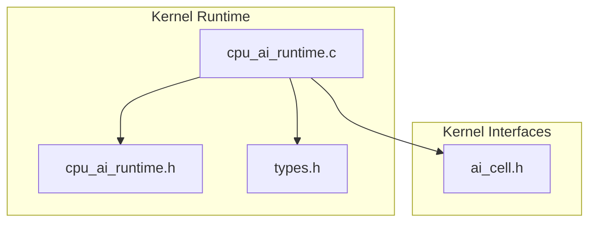
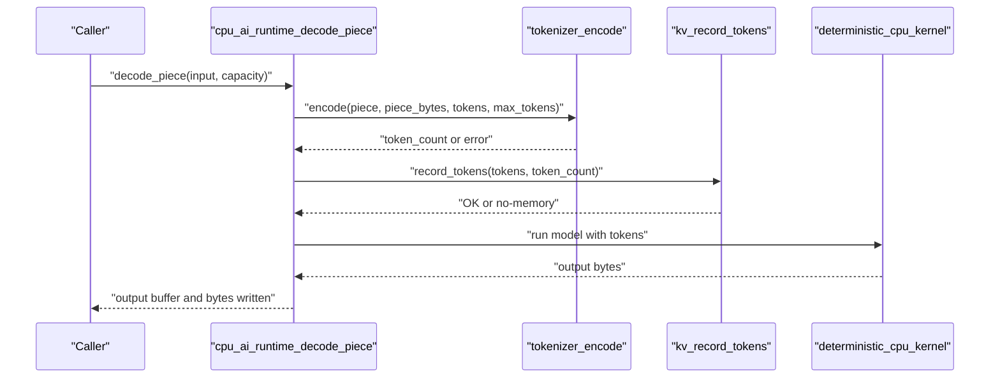
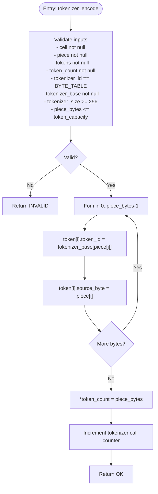
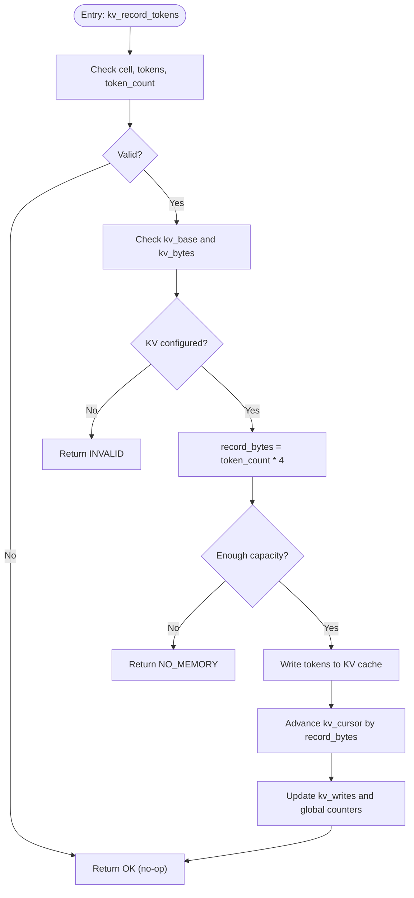
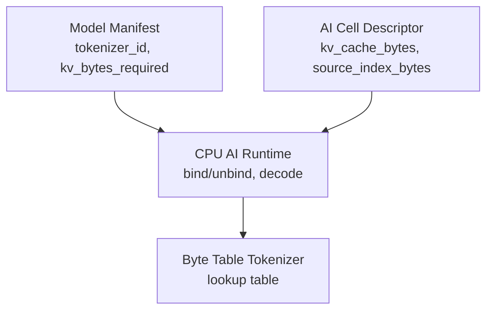

# Tokenizer Processing System

<cite>
**Referenced Files in This Document**
- [cpu_ai_runtime.c](file://kernel/runtime/cpu_ai_runtime.c)
- [cpu_ai_runtime.h](file://kernel/include/osai/cpu_ai_runtime.h)
- [ai_cell.h](file://kernel/include/osai/ai_cell.h)
- [types.h](file://kernel/include/osai/types.h)
</cite>

## Table of Contents
1. [Introduction](#introduction)
2. [Project Structure](#project-structure)
3. [Core Components](#core-components)
4. [Architecture Overview](#architecture-overview)
5. [Detailed Component Analysis](#detailed-component-analysis)
6. [Dependency Analysis](#dependency-analysis)
7. [Performance Considerations](#performance-considerations)
8. [Troubleshooting Guide](#troubleshooting-guide)
9. [Conclusion](#conclusion)

## Introduction
This document describes the tokenizer processing system responsible for converting raw input bytes into token sequences for AI model execution. The system implements a byte table tokenizer (CPU_AI_TOKENIZER_BYTE_TABLE) that maps each input byte to a token ID via a fixed 256-byte lookup table. It documents the tokenizer_encode function, token storage format, KV cache integration, token counting mechanisms, and performance considerations for high-throughput scenarios. Error handling for invalid inputs, insufficient capacity, and unsupported tokenizer types is also covered.

## Project Structure
The tokenizer and runtime logic resides in the kernel runtime module under the OSAI project. The primary implementation is contained in a single C source file with supporting headers defining constants, structures, and APIs.

**Diagram sources**
- [cpu_ai_runtime.c:1-824](file://kernel/runtime/cpu_ai_runtime.c#L1-L824)
- [cpu_ai_runtime.h:1-51](file://kernel/include/osai/cpu_ai_runtime.h#L1-L51)
- [ai_cell.h:1-103](file://kernel/include/osai/ai_cell.h#L1-L103)
- [types.h:1-9](file://kernel/include/osai/types.h#L1-L9)

**Section sources**
- [cpu_ai_runtime.c:1-824](file://kernel/runtime/cpu_ai_runtime.c#L1-L824)
- [cpu_ai_runtime.h:1-51](file://kernel/include/osai/cpu_ai_runtime.h#L1-L51)
- [ai_cell.h:1-103](file://kernel/include/osai/ai_cell.h#L1-L103)
- [types.h:1-9](file://kernel/include/osai/types.h#L1-L9)

## Core Components
- Byte table tokenizer: A fixed-size lookup table of 256 entries mapping each possible byte value to a token ID.
- Token structure: Each token is represented as a pair of fields: token_id and source_byte.
- Capacity limit: The maximum number of tokens processed per decode piece is bounded by CPU_AI_MAX_TOKENS.
- KV cache integration: Tokens are recorded in the cell's KV cache during decoding for downstream model execution.
- Counting metrics: The runtime tracks tokenizer calls, runtime calls, and KV writes for observability.

Key constants and structures:
- CPU_AI_TOKENIZER_BYTE_TABLE: Identifies the byte table tokenizer type.
- CPU_AI_MAX_TOKENS: Upper bound on tokens per decode piece.
- CPU_AI_TOKENIZER_BYTES: Size of the tokenizer table (256).
- cpu_ai_token_t: Token representation with token_id and source_byte.
- osai_cpu_ai_runtime_cell_t: Per-cell state including tokenizer and KV cache pointers.

**Section sources**
- [cpu_ai_runtime.c:13-18](file://kernel/runtime/cpu_ai_runtime.c#L13-L18)
- [cpu_ai_runtime.c:45-48](file://kernel/runtime/cpu_ai_runtime.c#L45-L48)
- [cpu_ai_runtime.c:50-72](file://kernel/runtime/cpu_ai_runtime.c#L50-L72)
- [cpu_ai_runtime.c:231-252](file://kernel/runtime/cpu_ai_runtime.c#L231-L252)
- [cpu_ai_runtime.c:254-278](file://kernel/runtime/cpu_ai_runtime.c#L254-L278)

## Architecture Overview
The tokenizer pipeline integrates with the AI runtime to transform input bytes into tokens, record them in KV cache, and produce deterministic output for model execution.

**Diagram sources**
- [cpu_ai_runtime.c:477-522](file://kernel/runtime/cpu_ai_runtime.c#L477-L522)
- [cpu_ai_runtime.c:231-252](file://kernel/runtime/cpu_ai_runtime.c#L231-L252)
- [cpu_ai_runtime.c:254-278](file://kernel/runtime/cpu_ai_runtime.c#L254-L278)
- [cpu_ai_runtime.c:280-314](file://kernel/runtime/cpu_ai_runtime.c#L280-L314)

## Detailed Component Analysis

### Byte Table Tokenizer Implementation
The byte table tokenizer maps each input byte to a token ID using a 256-entry lookup table. The encoding process iterates over each input byte, retrieves the corresponding token ID from the tokenizer base pointer, and stores both token_id and source_byte in the output token array.

**Diagram sources**
- [cpu_ai_runtime.c:231-252](file://kernel/runtime/cpu_ai_runtime.c#L231-L252)

**Section sources**
- [cpu_ai_runtime.c:13-18](file://kernel/runtime/cpu_ai_runtime.c#L13-L18)
- [cpu_ai_runtime.c:231-252](file://kernel/runtime/cpu_ai_runtime.c#L231-L252)

### Token Storage Format and Memory Layout
Each token is stored as a cpu_ai_token_t structure with two fields:
- token_id: The token identifier derived from the tokenizer table.
- source_byte: The original input byte that produced the token.

Memory layout per token:
- Fixed width: sizeof(cpu_ai_token_t) = sizeof(uint32_t) + sizeof(uint8_t) = 5 bytes.
- Array layout: tokens[0..token_count-1] stored contiguously in caller-provided memory.

Token generation relationship:
- For each input byte at position i, the system sets tokens[i].token_id = tokenizer_base[input[i]] and tokens[i].source_byte = input[i].

**Section sources**
- [cpu_ai_runtime.c:45-48](file://kernel/runtime/cpu_ai_runtime.c#L45-L48)
- [cpu_ai_runtime.c:245-248](file://kernel/runtime/cpu_ai_runtime.c#L245-L248)

### KV Cache Integration for Token Recording
During decoding, the runtime records token IDs into the cell's KV cache. The recording process:
- Validates cell, tokens, and token_count.
- Ensures KV cache is configured (kv_base and kv_bytes).
- Computes required bytes as token_count * sizeof(uint32_t).
- Checks capacity against remaining KV space.
- Writes token IDs sequentially and advances the cursor.
- Updates write counters for observability.

**Diagram sources**
- [cpu_ai_runtime.c:254-278](file://kernel/runtime/cpu_ai_runtime.c#L254-L278)

**Section sources**
- [cpu_ai_runtime.c:254-278](file://kernel/runtime/cpu_ai_runtime.c#L254-L278)

### Token Counting Mechanisms
The runtime maintains several counters for monitoring:
- Tokenizer call count: Incremented after successful tokenizer_encode.
- Runtime call count: Incremented after successful kernel execution.
- KV write count: Incremented per token written to KV cache.
- Decode call count: Incremented per decode_piece invocation.

These counters are exposed via dedicated getters and used in self-tests to validate behavior.

**Section sources**
- [cpu_ai_runtime.c:74-90](file://kernel/runtime/cpu_ai_runtime.c#L74-L90)
- [cpu_ai_runtime.c:250](file://kernel/runtime/cpu_ai_runtime.c#L250)
- [cpu_ai_runtime.c:312](file://kernel/runtime/cpu_ai_runtime.c#L312)
- [cpu_ai_runtime.c:275-276](file://kernel/runtime/cpu_ai_runtime.c#L275-L276)
- [cpu_ai_runtime.c:608-673](file://kernel/runtime/cpu_ai_runtime.c#L608-L673)

### Deterministic Runtime and Output Generation
After tokenization and KV recording, the deterministic runtime produces a hex-encoded output. For each token:
- Uses weights key and stride to compute a mixed value.
- Encodes the mixed value as two hexadecimal characters.
- Null-terminates the output buffer.

Output length is 2 * token_count.

**Section sources**
- [cpu_ai_runtime.c:280-314](file://kernel/runtime/cpu_ai_runtime.c#L280-L314)

## Dependency Analysis
The tokenizer and runtime depend on shared model manifests and cell descriptors. The runtime validates model images and binds models to cells, ensuring the tokenizer type and KV cache requirements are met.

**Diagram sources**
- [cpu_ai_runtime.c:152-198](file://kernel/runtime/cpu_ai_runtime.c#L152-L198)
- [cpu_ai_runtime.c:389-457](file://kernel/runtime/cpu_ai_runtime.c#L389-L457)
- [ai_cell.h:33-60](file://kernel/include/osai/ai_cell.h#L33-L60)

**Section sources**
- [cpu_ai_runtime.c:152-198](file://kernel/runtime/cpu_ai_runtime.c#L152-L198)
- [cpu_ai_runtime.c:389-457](file://kernel/runtime/cpu_ai_runtime.c#L389-L457)
- [ai_cell.h:33-60](file://kernel/include/osai/ai_cell.h#L33-L60)

## Performance Considerations
- Throughput scaling: The system processes up to CPU_AI_MAX_TOKENS per decode piece. For high-throughput scenarios, batch input appropriately to maximize utilization without exceeding capacity.
- Memory locality: The tokenizer loop performs sequential reads from input and tokenizer base, followed by sequential writes to tokens. This pattern is cache-friendly.
- KV write efficiency: Writing token IDs as 32-bit integers minimizes overhead. Ensure KV cache alignment and sufficient capacity to avoid frequent rejections.
- Constant-time operations: Lookup in the 256-byte table is O(n) with minimal overhead; the dominant cost is memory bandwidth for large inputs.
- Counter updates: Atomic increments for counters are lightweight but should be considered in lock-free contexts.

[No sources needed since this section provides general guidance]

## Troubleshooting Guide
Common errors and their causes:
- INVALID input: Returned when cell, piece, tokens, or token_count pointers are null, tokenizer_id does not match BYTE_TABLE, tokenizer_base is null, tokenizer_size is less than 256, or piece_bytes exceeds token_capacity.
- NO_MEMORY during KV recording: Occurs when requested bytes exceed KV capacity or when kv_cursor overflows the available space.
- INVALID during decode: Returned when the cell is not bound or when piece_bytes exceeds CPU_AI_MAX_TOKENS.
- INVALID during bind: Triggered if KV cache is not provided or if kv_bytes is less than required by the model manifest.

Diagnostic checks:
- Verify model manifest fields: tokenizer_id must be BYTE_TABLE, kv_bytes_required must be set, and tokenizer_size must be at least 256.
- Confirm KV cache allocation: Ensure kv_base and kv_bytes are valid and sufficient for the intended workload.
- Monitor counters: Use tokenizer_call_count, runtime_call_count, and kv_write_count to validate operation.

**Section sources**
- [cpu_ai_runtime.c:237-243](file://kernel/runtime/cpu_ai_runtime.c#L237-L243)
- [cpu_ai_runtime.c:264-268](file://kernel/runtime/cpu_ai_runtime.c#L264-L268)
- [cpu_ai_runtime.c:499-501](file://kernel/runtime/cpu_ai_runtime.c#L499-L501)
- [cpu_ai_runtime.c:159-175](file://kernel/runtime/cpu_ai_runtime.c#L159-L175)
- [cpu_ai_runtime.c:414-419](file://kernel/runtime/cpu_ai_runtime.c#L414-L419)

## Conclusion
The tokenizer processing system provides a fast, deterministic mechanism to convert input bytes into token sequences using a 256-entry lookup table. It enforces capacity limits, integrates with KV cache for token recording, and exposes counters for observability. Proper model binding and KV cache sizing are essential for reliable operation and high throughput.