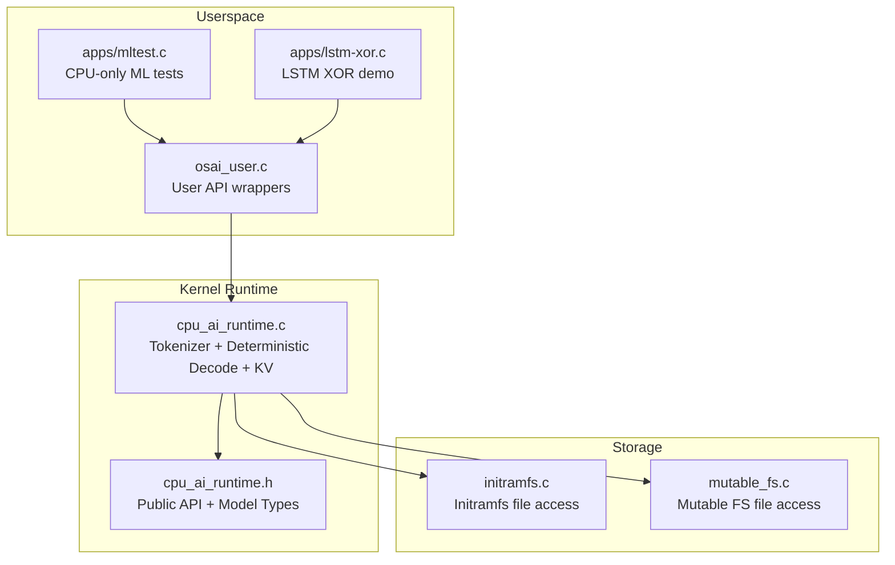
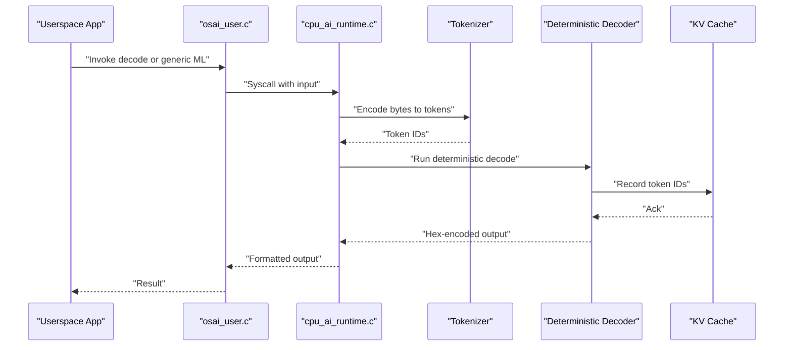
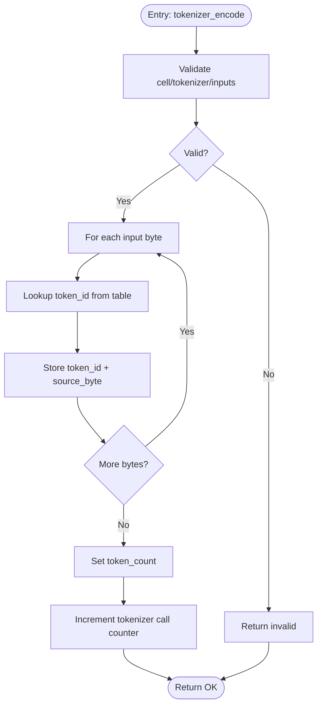
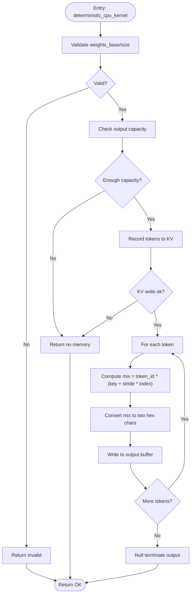
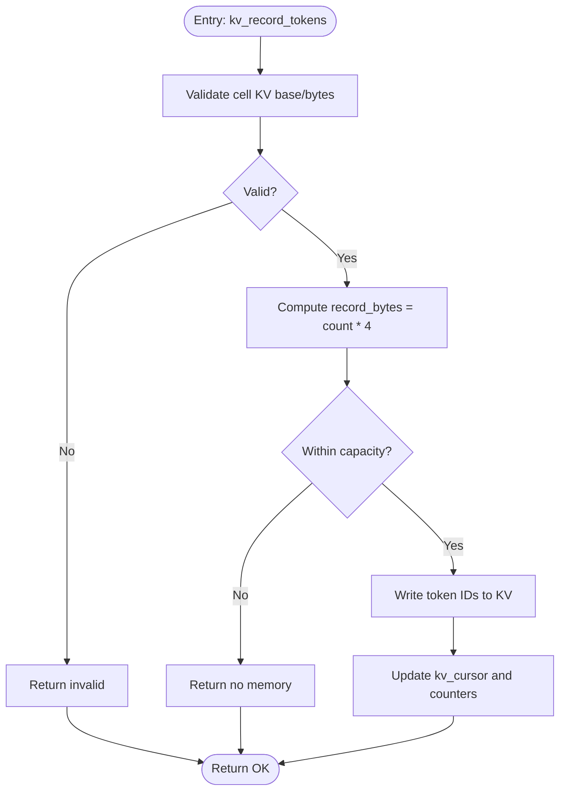
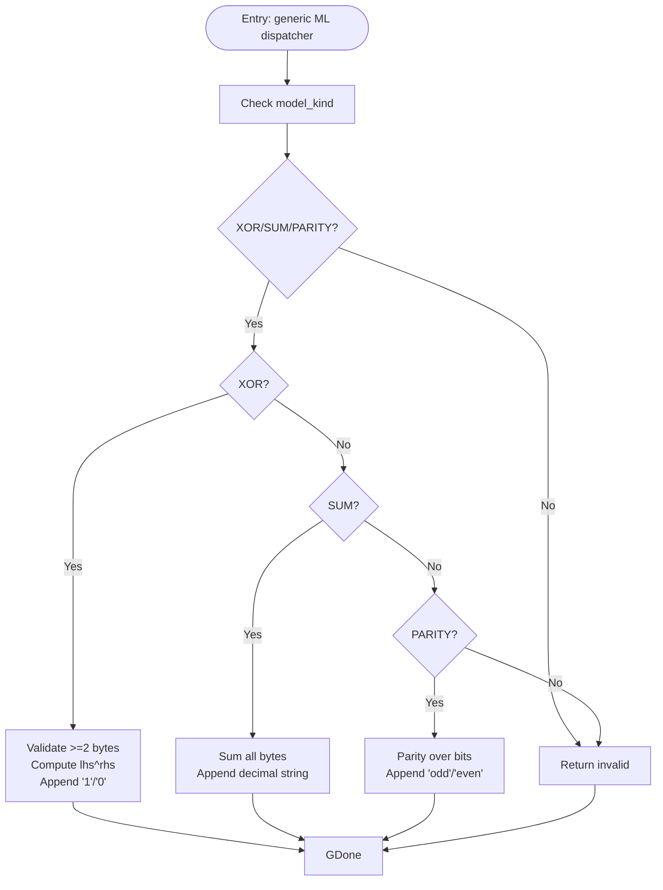
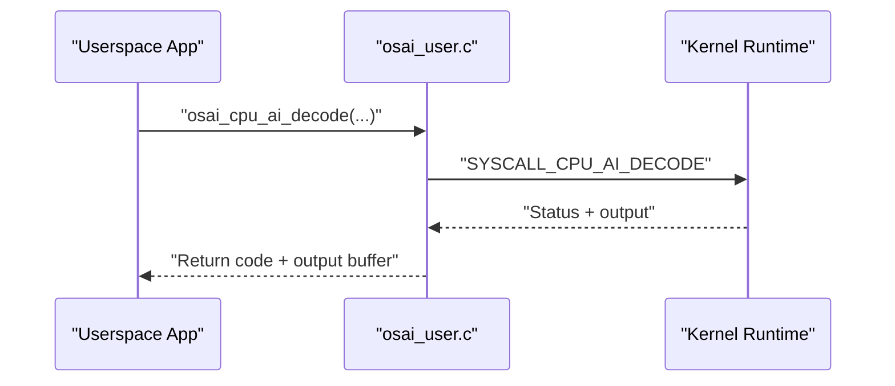
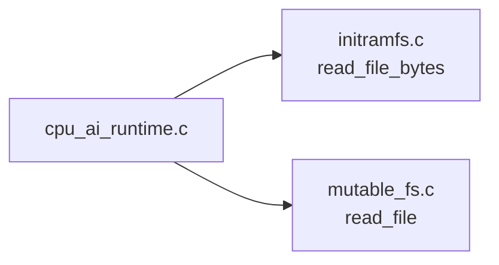
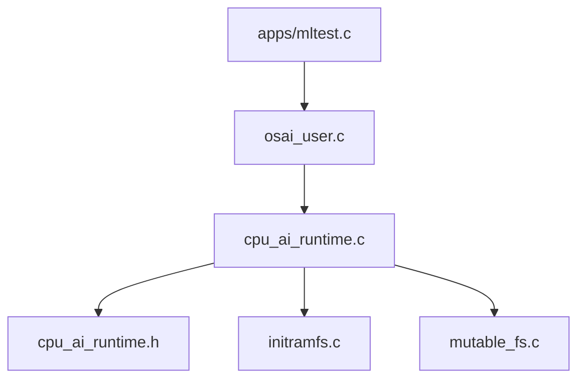

# Inference Execution

<cite>
**Referenced Files in This Document**
- [cpu_ai_runtime.c](file://kernel/runtime/cpu_ai_runtime.c)
- [cpu_ai_runtime.h](file://kernel/include/osai/cpu_ai_runtime.h)
- [osai_user.c](file://userspace/lib/osai_user.c)
- [mltest.c](file://userspace/apps/mltest.c)
- [lstm-xor.c](file://userspace/apps/lstm-xor.c)
- [initramfs.c](file://kernel/fs/initramfs.c)
- [mutable_fs.c](file://kernel/fs/mutable_fs.c)
</cite>

## Table of Contents
1. [Introduction](#introduction)
2. [Project Structure](#project-structure)
3. [Core Components](#core-components)
4. [Architecture Overview](#architecture-overview)
5. [Detailed Component Analysis](#detailed-component-analysis)
6. [Dependency Analysis](#dependency-analysis)
7. [Performance Considerations](#performance-considerations)
8. [Troubleshooting Guide](#troubleshooting-guide)
9. [Conclusion](#conclusion)

## Introduction
This document explains AI inference execution in OSAI's optimized runtime environment. It covers the end-to-end inference pipeline from input tokenization through model execution to result generation, including deterministic decoding, token processing workflows, and output formatting. It also documents supported model types (DECODE, XOR, SUM, PARITY), their execution paths, performance optimizations, memory usage patterns, throughput considerations, integration with KV caches and tokenizer systems, weight management, and debugging/profiling guidance.

## Project Structure
OSAI organizes AI inference under the kernel runtime and exposes user-space APIs via a lightweight userspace library. The key elements are:
- Kernel runtime: tokenization, deterministic decoding, KV cache recording, and model dispatch
- Userspace API: wrappers around kernel syscalls for inference
- Test applications: validation of CPU-only ML models and LSTM-based XOR demonstration
- Filesystem integration: loading model artifacts and configuration

**Diagram sources**
- [osai_user.c:163-174](file://userspace/lib/osai_user.c#L163-L174)
- [cpu_ai_runtime.c:477-522](file://kernel/runtime/cpu_ai_runtime.c#L477-L522)
- [cpu_ai_runtime.h:13-34](file://kernel/include/osai/cpu_ai_runtime.h#L13-L34)
- [initramfs.c:255-360](file://kernel/fs/initramfs.c#L255-L360)
- [mutable_fs.c:813-820](file://kernel/fs/mutable_fs.c#L813-L820)

**Section sources**
- [cpu_ai_runtime.c:477-522](file://kernel/runtime/cpu_ai_runtime.c#L477-L522)
- [cpu_ai_runtime.h:13-34](file://kernel/include/osai/cpu_ai_runtime.h#L13-L34)
- [osai_user.c:163-174](file://userspace/lib/osai_user.c#L163-L174)
- [mltest.c:17-60](file://userspace/apps/mltest.c#L17-L60)
- [lstm-xor.c:56-102](file://userspace/apps/lstm-xor.c#L56-L102)

## Core Components
- Tokenizer: byte-to-token mapping using a fixed-size lookup table bound per runtime cell
- Deterministic decoder: a lightweight CPU kernel that deterministically transforms tokens into hex-encoded output and records token IDs to KV cache
- Generic ML dispatcher: supports XOR, SUM, and PARITY operations executed purely on CPU
- Runtime cell: encapsulates tokenizer binding, weights pointer/size, KV cache region, and metrics counters
- Userspace API: wraps syscalls to invoke decode and generic ML models

Key responsibilities:
- Tokenization validates cell state and tokenizer binding, then maps each byte to a token ID
- Deterministic decode validates weights, writes tokens to KV cache, and produces hex-encoded output
- Generic ML models validate inputs and produce formatted textual outputs
- Userspace invokes runtime through syscalls and receives formatted results

**Section sources**
- [cpu_ai_runtime.c:231-314](file://kernel/runtime/cpu_ai_runtime.c#L231-L314)
- [cpu_ai_runtime.c:557-606](file://kernel/runtime/cpu_ai_runtime.c#L557-L606)
- [cpu_ai_runtime.c:477-522](file://kernel/runtime/cpu_ai_runtime.c#L477-L522)
- [cpu_ai_runtime.h:7-34](file://kernel/include/osai/cpu_ai_runtime.h#L7-L34)
- [osai_user.c:163-174](file://userspace/lib/osai_user.c#L163-L174)

## Architecture Overview
The inference pipeline is a staged process:
1. Userspace constructs a request and invokes the runtime via syscalls
2. Kernel runtime validates the cell and tokenizer binding
3. Input bytes are tokenized into token IDs
4. For DECODE models, deterministic CPU kernel executes and writes tokens to KV cache
5. Output is formatted and returned to userspace

**Diagram sources**
- [osai_user.c:163-174](file://userspace/lib/osai_user.c#L163-L174)
- [cpu_ai_runtime.c:477-522](file://kernel/runtime/cpu_ai_runtime.c#L477-L522)
- [cpu_ai_runtime.c:231-314](file://kernel/runtime/cpu_ai_runtime.c#L231-L314)
- [cpu_ai_runtime.c:280-314](file://kernel/runtime/cpu_ai_runtime.c#L280-L314)

## Detailed Component Analysis

### Tokenization Workflow
- Validates cell existence, state, and tokenizer binding
- Uses a byte-table tokenizer to map each input byte to a token ID
- Returns token count and populates token array

**Diagram sources**
- [cpu_ai_runtime.c:231-252](file://kernel/runtime/cpu_ai_runtime.c#L231-L252)

**Section sources**
- [cpu_ai_runtime.c:231-252](file://kernel/runtime/cpu_ai_runtime.c#L231-L252)

### Deterministic Decoding Algorithm
- Validates weights presence and minimum size
- Ensures sufficient output capacity
- Records tokens to KV cache
- Applies a deterministic transform mixing token ID with key+stride and index
- Formats each mixed value into two hexadecimal characters

**Diagram sources**
- [cpu_ai_runtime.c:280-314](file://kernel/runtime/cpu_ai_runtime.c#L280-L314)

**Section sources**
- [cpu_ai_runtime.c:280-314](file://kernel/runtime/cpu_ai_runtime.c#L280-L314)

### KV Cache Integration
- Validates KV base and capacity
- Computes record size as token_count * sizeof(uint32_t)
- Checks bounds and cursor overflow
- Writes token IDs contiguously and updates write counters

**Diagram sources**
- [cpu_ai_runtime.c:254-278](file://kernel/runtime/cpu_ai_runtime.c#L254-L278)

**Section sources**
- [cpu_ai_runtime.c:254-278](file://kernel/runtime/cpu_ai_runtime.c#L254-L278)

### Generic ML Models (XOR, SUM, PARITY)
- XOR: expects at least two bytes; computes single-bit XOR and outputs "1" or "0"
- SUM: sums all input bytes and outputs the decimal string
- PARITY: computes parity over bits and outputs "odd" or "even"

**Diagram sources**
- [cpu_ai_runtime.c:557-606](file://kernel/runtime/cpu_ai_runtime.c#L557-L606)

**Section sources**
- [cpu_ai_runtime.c:557-606](file://kernel/runtime/cpu_ai_runtime.c#L557-L606)
- [mltest.c:17-60](file://userspace/apps/mltest.c#L17-L60)

### Userspace API and Invocation
- Provides syscall wrappers for decode and generic ML invocation
- Encodes request parameters and decodes returned sizes

**Diagram sources**
- [osai_user.c:163-174](file://userspace/lib/osai_user.c#L163-L174)

**Section sources**
- [osai_user.c:163-174](file://userspace/lib/osai_user.c#L163-L174)

### Model Loading and Filesystem Integration
- Model artifacts and configurations are accessed via filesystem abstractions
- Initramfs and mutable filesystem support file reads for model loading

**Diagram sources**
- [cpu_ai_runtime.c:765-769](file://kernel/runtime/cpu_ai_runtime.c#L765-L769)
- [initramfs.c:255-360](file://kernel/fs/initramfs.c#L255-L360)
- [mutable_fs.c:813-820](file://kernel/fs/mutable_fs.c#L813-L820)

**Section sources**
- [cpu_ai_runtime.c:765-769](file://kernel/runtime/cpu_ai_runtime.c#L765-L769)
- [initramfs.c:255-360](file://kernel/fs/initramfs.c#L255-L360)
- [mutable_fs.c:813-820](file://kernel/fs/mutable_fs.c#L813-L820)

## Dependency Analysis
- Public API exposure: userspace apps depend on osai_user.c wrappers; osai_user.c depends on kernel syscall interface
- Runtime internals: cpu_ai_runtime.c depends on tokenizer, deterministic decoder, KV cache, and model arena bindings
- Filesystem: runtime uses initramfs and mutable filesystem for artifact loading

**Diagram sources**
- [mltest.c:17-60](file://userspace/apps/mltest.c#L17-L60)
- [osai_user.c:163-174](file://userspace/lib/osai_user.c#L163-L174)
- [cpu_ai_runtime.c:477-522](file://kernel/runtime/cpu_ai_runtime.c#L477-L522)
- [cpu_ai_runtime.h:13-34](file://kernel/include/osai/cpu_ai_runtime.h#L13-L34)
- [initramfs.c:255-360](file://kernel/fs/initramfs.c#L255-L360)
- [mutable_fs.c:813-820](file://kernel/fs/mutable_fs.c#L813-L820)

**Section sources**
- [cpu_ai_runtime.h:13-34](file://kernel/include/osai/cpu_ai_runtime.h#L13-L34)
- [osai_user.c:163-174](file://userspace/lib/osai_user.c#L163-L174)
- [cpu_ai_runtime.c:477-522](file://kernel/runtime/cpu_ai_runtime.c#L477-L522)

## Performance Considerations
- Throughput: decode throughput scales linearly with input length; each byte becomes two hex characters in output
- Memory: output capacity must accommodate 2*token_count plus null terminator; KV writes are contiguous 32-bit token IDs
- Complexity: tokenization O(n); deterministic decode O(n); generic models O(n) for SUM/PARITY, O(1) for XOR
- Optimizations:
  - Batch decode calls to reduce syscall overhead
  - Pre-validate input lengths to avoid repeated checks
  - Reuse runtime cells with shared weights to minimize load overhead
  - Ensure KV cache region is sufficiently sized to avoid rejections

[No sources needed since this section provides general guidance]

## Troubleshooting Guide
Common issues and resolutions:
- Invalid cell or unbound tokenizer: ensure cell is bound and tokenizer is configured before decode
- Insufficient output capacity: allocate larger output buffers to hold 2*token_count + null terminator
- No memory during KV write: verify KV region size and cursor position; ensure token_count allows full write
- Invalid generic model kind: confirm model_kind matches supported values (DECODE/XOR/SUM/PARITY)
- Decode count mismatches: use runtime counters to verify decode invocations and bytes processed

Validation references:
- Decode piece validation and counters
- Generic ML model test coverage
- KV write and load failure counters

**Section sources**
- [cpu_ai_runtime.c:477-522](file://kernel/runtime/cpu_ai_runtime.c#L477-L522)
- [cpu_ai_runtime.c:557-606](file://kernel/runtime/cpu_ai_runtime.c#L557-L606)
- [mltest.c:17-60](file://userspace/apps/mltest.c#L17-L60)

## Conclusion
OSAI’s runtime provides a compact, deterministic inference pipeline suitable for CPU-only environments. Tokenization, deterministic decoding, and KV cache recording form the backbone of DECODE operations, while generic ML models (XOR, SUM, PARITY) demonstrate lightweight computation paths. Userspace APIs enable straightforward invocation, and filesystem integrations support artifact loading. Adhering to capacity and binding requirements ensures robust, predictable performance.