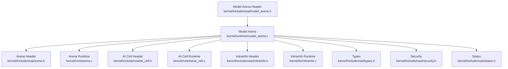
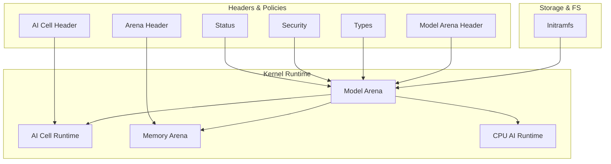
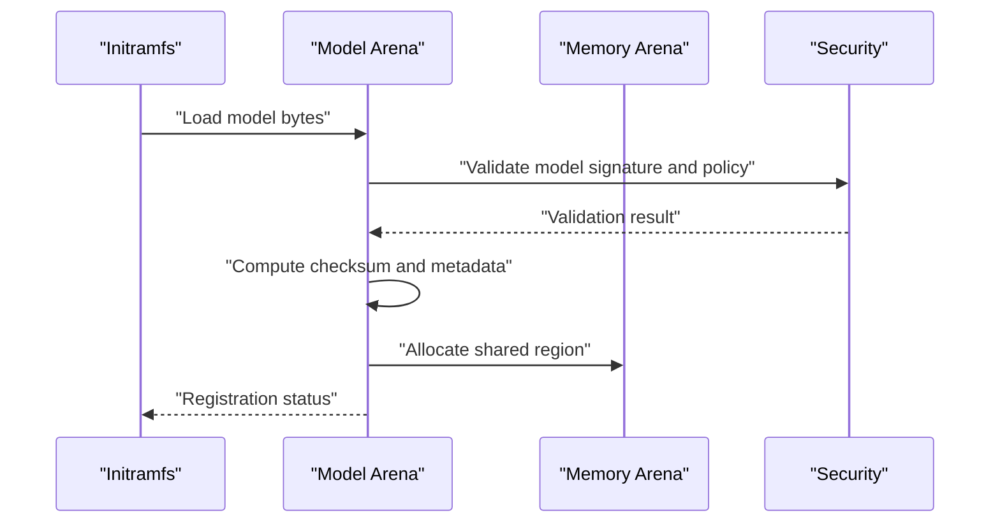
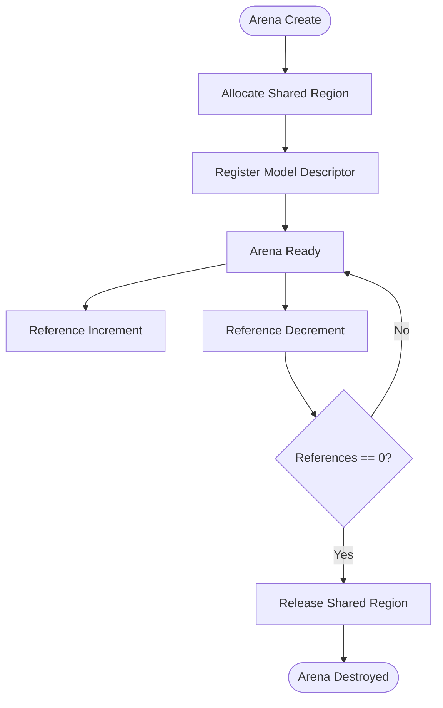
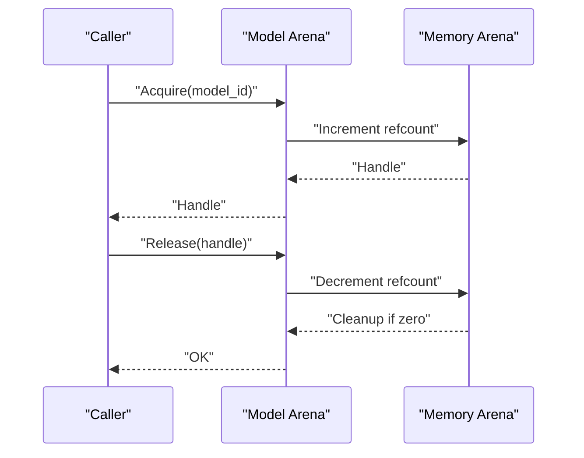
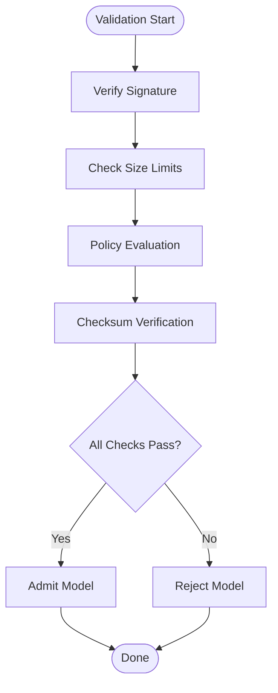
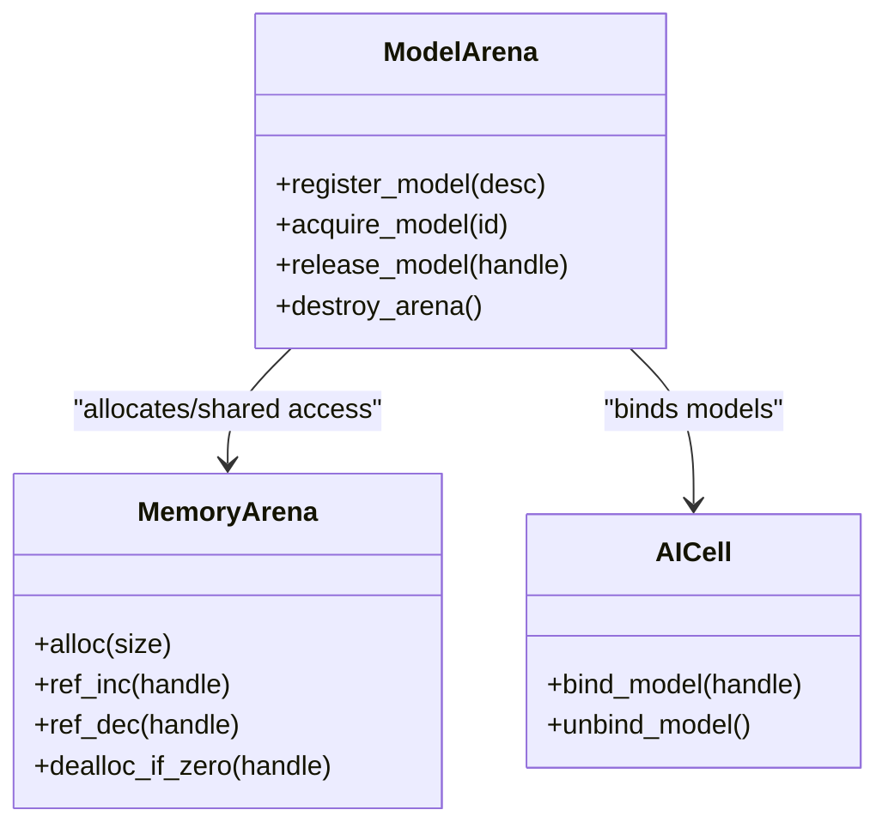
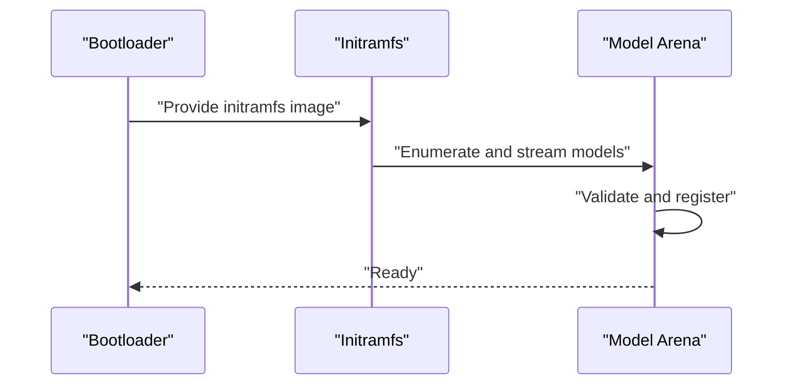
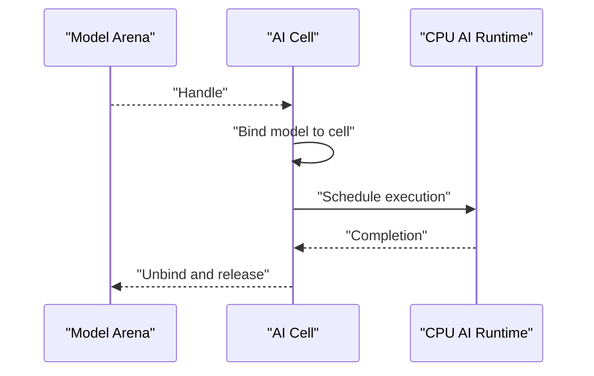
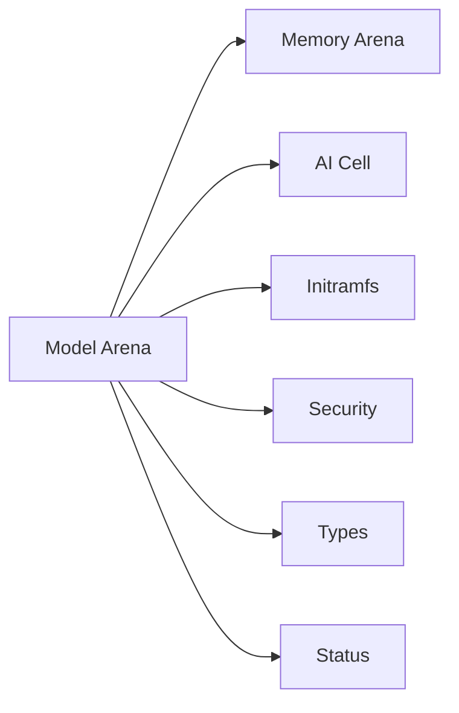

# Model Arena Management

<cite>
**Referenced Files in This Document**
- [model_arena.h](file://kernel/include/osai/model_arena.h)
- [model_arena.c](file://kernel/runtime/model_arena.c)
- [ai_cell.h](file://kernel/include/osai/ai_cell.h)
- [ai_cell.c](file://kernel/runtime/ai_cell.c)
- [initramfs.h](file://kernel/include/osai/initramfs.h)
- [initramfs.c](file://kernel/fs/initramfs.c)
- [arena.h](file://kernel/include/osai/arena.h)
- [arena.c](file://kernel/mm/arena.c)
- [types.h](file://kernel/include/osai/types.h)
- [security.h](file://kernel/include/osai/security.h)
- [status.h](file://kernel/include/osai/status.h)
- [persistence.h](file://kernel/include/osai/persistence.h)
- [cpu_ai_runtime.h](file://kernel/include/osai/cpu_ai_runtime.h)
- [cpu_ai_runtime.c](file://kernel/runtime/cpu_ai_runtime.c)
</cite>

## Table of Contents
1. [Introduction](#introduction)
2. [Project Structure](#project-structure)
3. [Core Components](#core-components)
4. [Architecture Overview](#architecture-overview)
5. [Detailed Component Analysis](#detailed-component-analysis)
6. [Dependency Analysis](#dependency-analysis)
7. [Performance Considerations](#performance-considerations)
8. [Troubleshooting Guide](#troubleshooting-guide)
9. [Conclusion](#conclusion)

## Introduction
This document describes the Model Arena system that manages AI model storage, versioning, and access patterns in OSAI. It covers model registration, arena lifecycle (creation and destruction), model acquisition and release, validation and admission control, shared access patterns with reference counting, memory mapping strategies, integration with initramfs for model distribution, and the relationship with AI cells for model binding. Security, access control, and performance optimization techniques are also addressed.

## Project Structure
The Model Arena resides in the kernel runtime and integrates with memory management, filesystem, and AI cell subsystems. Key files include:
- Model Arena interface and implementation
- AI Cell integration for model binding
- Memory arena abstraction for shared allocations
- initramfs integration for model distribution
- Supporting headers for types, security, status, and persistence

**Diagram sources**
- [model_arena.c](file://kernel/runtime/model_arena.c)
- [model_arena.h](file://kernel/include/osai/model_arena.h)
- [ai_cell.h](file://kernel/include/osai/ai_cell.h)
- [ai_cell.c](file://kernel/runtime/ai_cell.c)
- [arena.h](file://kernel/include/osai/arena.h)
- [arena.c](file://kernel/mm/arena.c)
- [initramfs.h](file://kernel/include/osai/initramfs.h)
- [initramfs.c](file://kernel/fs/initramfs.c)
- [types.h](file://kernel/include/osai/types.h)
- [security.h](file://kernel/include/osai/security.h)
- [status.h](file://kernel/include/osai/status.h)

**Section sources**
- [model_arena.h](file://kernel/include/osai/model_arena.h)
- [model_arena.c](file://kernel/runtime/model_arena.c)
- [ai_cell.h](file://kernel/include/osai/ai_cell.h)
- [ai_cell.c](file://kernel/runtime/ai_cell.c)
- [arena.h](file://kernel/include/osai/arena.h)
- [arena.c](file://kernel/mm/arena.c)
- [initramfs.h](file://kernel/include/osai/initramfs.h)
- [initramfs.c](file://kernel/fs/initramfs.c)
- [types.h](file://kernel/include/osai/types.h)
- [security.h](file://kernel/include/osai/security.h)
- [status.h](file://kernel/include/osai/status.h)

## Core Components
- Model Arena: central manager for model registration, versioning, validation, admission control, and access lifecycle.
- AI Cell: binds models to execution contexts and enforces per-cell resource policies.
- Memory Arena: provides shared allocation and reference counting for models.
- Initramfs: distributes models to the OS during early boot.
- Types and Status: define model metadata, identifiers, and status codes.
- Security and Persistence: enforce access control and durable state.

Key responsibilities:
- Registration: accept model descriptors, compute checksums, and register versions.
- Admission Control: validate models against policy and capacity constraints.
- Access Lifecycle: acquire/release models with reference counting and memory mapping.
- Distribution: load models from initramfs into the arena.
- Binding: associate models with AI cells for execution.

**Section sources**
- [model_arena.h](file://kernel/include/osai/model_arena.h)
- [model_arena.c](file://kernel/runtime/model_arena.c)
- [ai_cell.h](file://kernel/include/osai/ai_cell.h)
- [ai_cell.c](file://kernel/runtime/ai_cell.c)
- [arena.h](file://kernel/include/osai/arena.h)
- [arena.c](file://kernel/mm/arena.c)
- [initramfs.h](file://kernel/include/osai/initramfs.h)
- [initramfs.c](file://kernel/fs/initramfs.c)
- [types.h](file://kernel/include/osai/types.h)
- [security.h](file://kernel/include/osai/security.h)
- [status.h](file://kernel/include/osai/status.h)

## Architecture Overview
The Model Arena orchestrates model lifecycle and access across memory, filesystem, and AI execution layers.

**Diagram sources**
- [model_arena.c](file://kernel/runtime/model_arena.c)
- [ai_cell.c](file://kernel/runtime/ai_cell.c)
- [arena.c](file://kernel/mm/arena.c)
- [initramfs.c](file://kernel/fs/initramfs.c)
- [model_arena.h](file://kernel/include/osai/model_arena.h)
- [ai_cell.h](file://kernel/include/osai/ai_cell.h)
- [arena.h](file://kernel/include/osai/arena.h)
- [types.h](file://kernel/include/osai/types.h)
- [security.h](file://kernel/include/osai/security.h)
- [status.h](file://kernel/include/osai/status.h)

## Detailed Component Analysis

### Model Registration and Versioning
- Accepts model descriptors with metadata (name, version, size, checksum).
- Computes and verifies checksums during registration.
- Maintains versioned entries and resolves conflicts or upgrades.
- Enforces admission control policies (size limits, allowed formats, security posture).

**Diagram sources**
- [model_arena.c](file://kernel/runtime/model_arena.c)
- [initramfs.c](file://kernel/fs/initramfs.c)
- [security.h](file://kernel/include/osai/security.h)
- [arena.c](file://kernel/mm/arena.c)

**Section sources**
- [model_arena.c](file://kernel/runtime/model_arena.c)
- [initramfs.c](file://kernel/fs/initramfs.c)
- [security.h](file://kernel/include/osai/security.h)
- [status.h](file://kernel/include/osai/status.h)

### Arena Creation and Destruction
- Creation allocates a shared memory region sized to the model plus overhead.
- Destruction releases the region only when reference count reaches zero.
- Reference counting ensures safe concurrent access and prevents premature deallocation.

**Diagram sources**
- [arena.c](file://kernel/mm/arena.c)
- [model_arena.c](file://kernel/runtime/model_arena.c)

**Section sources**
- [arena.c](file://kernel/mm/arena.c)
- [model_arena.c](file://kernel/runtime/model_arena.c)

### Model Acquisition and Release Mechanisms
- Acquire returns a handle to a model with an incremented reference count.
- Release decrements the reference count; on zero, triggers cleanup.
- Supports exclusive and shared access modes depending on usage pattern.

**Diagram sources**
- [model_arena.c](file://kernel/runtime/model_arena.c)
- [arena.c](file://kernel/mm/arena.c)

**Section sources**
- [model_arena.c](file://kernel/runtime/model_arena.c)
- [arena.c](file://kernel/mm/arena.c)

### Model Validation Pipeline and Admission Control
- Validates model signature and cryptographic checksum.
- Enforces policy constraints (allowed formats, max size, cell-specific quotas).
- Rejects models that fail validation or exceed capacity.

**Diagram sources**
- [model_arena.c](file://kernel/runtime/model_arena.c)
- [security.h](file://kernel/include/osai/security.h)
- [status.h](file://kernel/include/osai/status.h)

**Section sources**
- [model_arena.c](file://kernel/runtime/model_arena.c)
- [security.h](file://kernel/include/osai/security.h)
- [status.h](file://kernel/include/osai/status.h)

### Shared Model Access Patterns and Reference Counting
- Shared memory regions enable multiple clients to access the same model.
- Reference counting prevents use-after-free and ensures synchronized cleanup.
- Memory mapping strategies minimize copies and optimize access locality.

**Diagram sources**
- [model_arena.c](file://kernel/runtime/model_arena.c)
- [arena.c](file://kernel/mm/arena.c)
- [ai_cell.c](file://kernel/runtime/ai_cell.c)

**Section sources**
- [model_arena.c](file://kernel/runtime/model_arena.c)
- [arena.c](file://kernel/mm/arena.c)
- [ai_cell.c](file://kernel/runtime/ai_cell.c)

### Integration with Initramfs for Model Distribution
- Models are embedded in initramfs and loaded during early boot.
- Model Arena reads model segments from initramfs and registers them.
- Supports incremental loading and lazy initialization to reduce boot latency.

**Diagram sources**
- [initramfs.c](file://kernel/fs/initramfs.c)
- [model_arena.c](file://kernel/runtime/model_arena.c)

**Section sources**
- [initramfs.c](file://kernel/fs/initramfs.c)
- [model_arena.c](file://kernel/runtime/model_arena.c)

### Relationship with AI Cells for Model Binding
- AI cells bind acquired models to execution contexts.
- Enforces per-cell quotas and isolation.
- Coordinates with CPU AI runtime for scheduling and execution.

**Diagram sources**
- [ai_cell.c](file://kernel/runtime/ai_cell.c)
- [cpu_ai_runtime.c](file://kernel/runtime/cpu_ai_runtime.c)
- [model_arena.c](file://kernel/runtime/model_arena.c)

**Section sources**
- [ai_cell.c](file://kernel/runtime/ai_cell.c)
- [cpu_ai_runtime.c](file://kernel/runtime/cpu_ai_runtime.c)
- [model_arena.c](file://kernel/runtime/model_arena.c)

### Practical Examples

#### Model Loading Workflow
- Load model from initramfs.
- Validate signature and checksum.
- Allocate shared memory arena.
- Register model descriptor.
- Bind to target AI cell.

**Section sources**
- [initramfs.c](file://kernel/fs/initramfs.c)
- [model_arena.c](file://kernel/runtime/model_arena.c)
- [ai_cell.c](file://kernel/runtime/ai_cell.c)

#### Arena Configuration
- Configure shared region size based on model metadata.
- Set admission thresholds for size and format.
- Enable reference counting and memory mapping options.

**Section sources**
- [arena.h](file://kernel/include/osai/arena.h)
- [arena.c](file://kernel/mm/arena.c)
- [model_arena.h](file://kernel/include/osai/model_arena.h)

#### Model Lifecycle Management
- Registration: compute checksum and metadata.
- Acquisition: increment reference count.
- Release: decrement reference count; cleanup on zero.
- Destruction: free shared region.

**Section sources**
- [model_arena.c](file://kernel/runtime/model_arena.c)
- [arena.c](file://kernel/mm/arena.c)

### Security, Access Control, and Performance Optimization
- Security: signature verification, checksum validation, and policy enforcement.
- Access Control: per-cell quotas and isolation enforced by AI Cell.
- Performance: shared memory mapping, reference counting, and lazy loading.

**Section sources**
- [security.h](file://kernel/include/osai/security.h)
- [ai_cell.c](file://kernel/runtime/ai_cell.c)
- [model_arena.c](file://kernel/runtime/model_arena.c)

## Dependency Analysis
The Model Arena depends on memory management, filesystem, AI cell runtime, and supporting headers for types and status.

**Diagram sources**
- [model_arena.c](file://kernel/runtime/model_arena.c)
- [arena.c](file://kernel/mm/arena.c)
- [ai_cell.c](file://kernel/runtime/ai_cell.c)
- [initramfs.c](file://kernel/fs/initramfs.c)
- [security.h](file://kernel/include/osai/security.h)
- [types.h](file://kernel/include/osai/types.h)
- [status.h](file://kernel/include/osai/status.h)

**Section sources**
- [model_arena.c](file://kernel/runtime/model_arena.c)
- [arena.c](file://kernel/mm/arena.c)
- [ai_cell.c](file://kernel/runtime/ai_cell.c)
- [initramfs.c](file://kernel/fs/initramfs.c)
- [security.h](file://kernel/include/osai/security.h)
- [types.h](file://kernel/include/osai/types.h)
- [status.h](file://kernel/include/osai/status.h)

## Performance Considerations
- Prefer shared memory mapping to avoid redundant copies.
- Use reference counting to batch cleanup and reduce fragmentation.
- Lazy loading from initramfs reduces boot-time pressure.
- Enforce admission control to prevent oversized models from degrading performance.

[No sources needed since this section provides general guidance]

## Troubleshooting Guide
Common issues and resolutions:
- Validation failures: check signatures and checksums; ensure policy alignment.
- Admission rejections: verify size/format constraints and quotas.
- Access violations: confirm AI cell binding and permissions.
- Memory leaks: ensure release calls match acquire calls.

**Section sources**
- [model_arena.c](file://kernel/runtime/model_arena.c)
- [status.h](file://kernel/include/osai/status.h)
- [security.h](file://kernel/include/osai/security.h)

## Conclusion
The Model Arena provides a robust framework for managing AI models in OSAI, integrating secure validation, shared access via reference counting, and efficient memory mapping. Its integration with initramfs and AI cells enables scalable model distribution and execution while enforcing access control and performance constraints.

[No sources needed since this section summarizes without analyzing specific files]