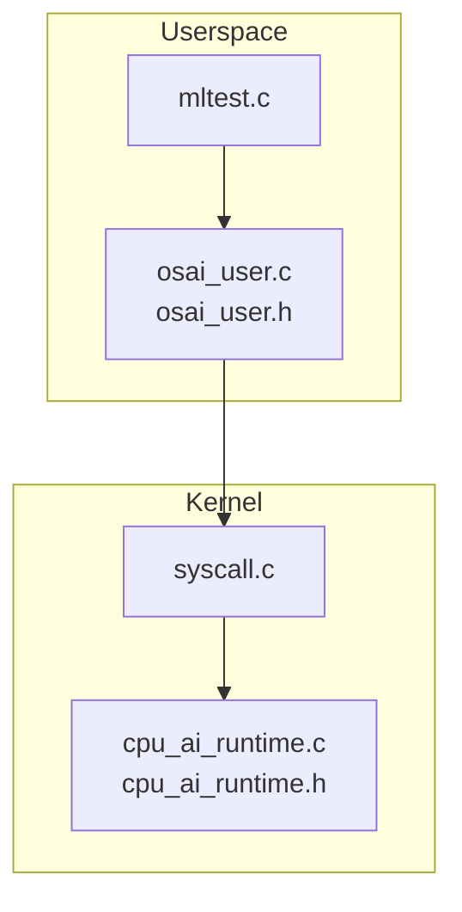
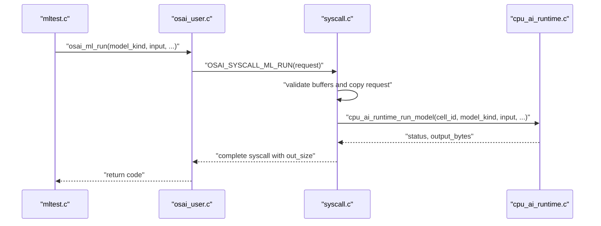
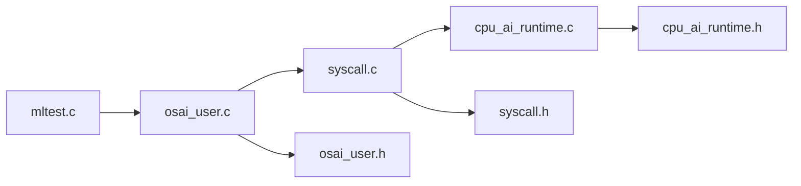

# AI Runtime API

<cite>
**Referenced Files in This Document**
- [cpu_ai_runtime.h](file://kernel/include/osai/cpu_ai_runtime.h)
- [cpu_ai_runtime.c](file://kernel/runtime/cpu_ai_runtime.c)
- [syscall.c](file://kernel/user/syscall.c)
- [osai_user.c](file://userspace/lib/osai_user.c)
- [osai_user.h](file://userspace/include/osai_user.h)
- [mltest.c](file://userspace/apps/mltest.c)
- [syscall.h](file://kernel/include/osai/syscall.h)
</cite>

## Table of Contents
1. [Introduction](#introduction)
2. [Project Structure](#project-structure)
3. [Core Components](#core-components)
4. [Architecture Overview](#architecture-overview)
5. [Detailed Component Analysis](#detailed-component-analysis)
6. [Dependency Analysis](#dependency-analysis)
7. [Performance Considerations](#performance-considerations)
8. [Troubleshooting Guide](#troubleshooting-guide)
9. [Conclusion](#conclusion)
10. [Appendices](#appendices)

## Introduction
This document describes the AI runtime API for OSAI’s machine learning capabilities. It focuses on the CPU-only inference runtime, covering supported model types, the user-space API surface, kernel-side dispatch logic, input/output buffer management, model selection, and inference execution patterns. It also documents usage via example applications, performance characteristics, error handling, and security boundaries enforced by the runtime.

## Project Structure
The AI runtime spans userspace and kernel components:
- Userspace API: thin wrappers around system calls for AI operations.
- Kernel API: CPU AI runtime interface and syscall handler.
- Example application: demonstrates usage of XOR, SUM, and PARITY models.

**Diagram sources**
- [osai_user.c:163-174](file://userspace/lib/osai_user.c#L163-L174)
- [osai_user.c:219-231](file://userspace/lib/osai_user.c#L219-L231)
- [osai_user.h:27-27](file://userspace/include/osai_user.h#L27-L27)
- [syscall.c:602-636](file://kernel/user/syscall.c#L602-L636)
- [cpu_ai_runtime.c:557-606](file://kernel/runtime/cpu_ai_runtime.c#L557-L606)
- [cpu_ai_runtime.h:8-11](file://kernel/include/osai/cpu_ai_runtime.h#L8-L11)
- [mltest.c:17-60](file://userspace/apps/mltest.c#L17-L60)

**Section sources**
- [osai_user.c:163-174](file://userspace/lib/osai_user.c#L163-L174)
- [osai_user.c:219-231](file://userspace/lib/osai_user.c#L219-L231)
- [osai_user.h:27-27](file://userspace/include/osai_user.h#L27-L27)
- [syscall.c:602-636](file://kernel/user/syscall.c#L602-L636)
- [cpu_ai_runtime.c:557-606](file://kernel/runtime/cpu_ai_runtime.c#L557-L606)
- [cpu_ai_runtime.h:8-11](file://kernel/include/osai/cpu_ai_runtime.h#L8-L11)
- [mltest.c:17-60](file://userspace/apps/mltest.c#L17-L60)

## Core Components
- Model identifiers and runtime API:
  - OSAI_ML_MODEL_DECODE, OSAI_ML_MODEL_XOR, OSAI_ML_MODEL_SUM, OSAI_ML_MODEL_PARITY
  - cpu_ai_runtime_run_model, cpu_ai_runtime_decode_piece, and related helpers
- Userspace API:
  - osai_cpu_ai_decode for decode operations
  - osai_ml_run for general model execution
- Syscall boundary:
  - OSAI_SYSCALL_ML_RUN and associated syscall handler

Key responsibilities:
- Validate buffers and sizes on the kernel boundary.
- Route model kinds to appropriate CPU-only implementations.
- Manage output buffer growth and null termination.
- Track runtime statistics and decode counters.

**Section sources**
- [cpu_ai_runtime.h:8-11](file://kernel/include/osai/cpu_ai_runtime.h#L8-L11)
- [cpu_ai_runtime.h:13-34](file://kernel/include/osai/cpu_ai_runtime.h#L13-L34)
- [osai_user.c:163-174](file://userspace/lib/osai_user.c#L163-L174)
- [osai_user.c:219-231](file://userspace/lib/osai_user.c#L219-L231)
- [syscall.h:33-33](file://kernel/include/osai/syscall.h#L33-L33)
- [syscall.c:602-636](file://kernel/user/syscall.c#L602-L636)

## Architecture Overview
The AI runtime follows a strict userspace-to-kernel boundary:
- Userspace constructs a request and invokes osai_ml_run or osai_cpu_ai_decode.
- The syscall handler validates memory regions and copies parameters.
- The kernel routes to cpu_ai_runtime_run_model or cpu_ai_runtime_decode_piece.
- Results are copied back to userspace and the syscall completes.

**Diagram sources**
- [mltest.c:17-60](file://userspace/apps/mltest.c#L17-L60)
- [osai_user.c:219-231](file://userspace/lib/osai_user.c#L219-L231)
- [syscall.c:602-636](file://kernel/user/syscall.c#L602-L636)
- [cpu_ai_runtime.c:557-606](file://kernel/runtime/cpu_ai_runtime.c#L557-L606)

## Detailed Component Analysis

### Model Types and Selection
Supported model kinds:
- OSAI_ML_MODEL_DECODE: Decode tokenized input into text using a bound cell.
- OSAI_ML_MODEL_XOR: Binary XOR over the first two bytes of input.
- OSAI_ML_MODEL_SUM: Sum all bytes in input and return decimal text.
- OSAI_ML_MODEL_PARITY: Compute parity over bits and return “odd” or “even”.

Selection logic:
- cpu_ai_runtime_run_model checks model_kind and executes the corresponding branch.
- OSAI_ML_MODEL_DECODE is routed to cpu_ai_runtime_decode_piece.

Behavioral notes:
- XOR requires at least two bytes; otherwise invalid.
- SUM computes a total and writes a decimal string.
- PARITY reduces bits by XOR and emits textual classification.

**Section sources**
- [cpu_ai_runtime.h:8-11](file://kernel/include/osai/cpu_ai_runtime.h#L8-L11)
- [cpu_ai_runtime.c:557-606](file://kernel/runtime/cpu_ai_runtime.c#L557-L606)

### Userspace API: osai_ml_run
Purpose:
- Encapsulates a single ML inference call with model selection and buffer management.

Parameters:
- model_kind: One of the supported model identifiers.
- input, input_size: Pointer and length of the input payload.
- output, output_size: Output buffer pointer and capacity.
- out_size: Pointer to receive the number of bytes written.

Execution pattern:
- Packs a request struct and invokes a syscall.
- Returns negative on failure; zero or positive on success.

Usage example:
- See mltest.c for XOR, SUM, and PARITY invocations.

**Section sources**
- [osai_user.c:219-231](file://userspace/lib/osai_user.c#L219-L231)
- [osai_user.h:27-27](file://userspace/include/osai_user.h#L27-L27)
- [mltest.c:17-60](file://userspace/apps/mltest.c#L17-L60)

### Userspace API: osai_cpu_ai_decode
Purpose:
- Performs decode operations directly via a dedicated syscall.

Parameters:
- Same shape as osai_ml_run but intended for DECODE model semantics.

Execution pattern:
- Similar validation and syscall invocation as osai_ml_run.

**Section sources**
- [osai_user.c:163-174](file://userspace/lib/osai_user.c#L163-L174)

### Kernel Syscall Handler: OSAI_SYSCALL_ML_RUN
Responsibilities:
- Validates request size and layout.
- Validates user buffers for input, output, and out_size.
- Copies bounded input into a local buffer.
- Ensures CPU AI binding and delegates to cpu_ai_runtime_run_model.
- Writes back the output byte count.

Security and validation:
- Rejects malformed requests and invalid buffer permissions.
- Enforces maximum input size to prevent overflows.

**Section sources**
- [syscall.c:602-636](file://kernel/user/syscall.c#L602-L636)
- [syscall.h:33-33](file://kernel/include/osai/syscall.h#L33-L33)

### Kernel Runtime Dispatcher: cpu_ai_runtime_run_model
Responsibilities:
- Validates output capacity and initializes output.
- Routes to decode or model-specific logic.
- Implements XOR, SUM, and PARITY computations.
- Updates runtime counters and logs.

Output management:
- Uses helper routines to append text and numeric digits safely.
- Ensures null termination and respects capacity.

**Section sources**
- [cpu_ai_runtime.c:557-606](file://kernel/runtime/cpu_ai_runtime.c#L557-L606)
- [cpu_ai_runtime.c:524-555](file://kernel/runtime/cpu_ai_runtime.c#L524-L555)

### Decode Path: cpu_ai_runtime_decode_piece
Responsibilities:
- Tokenizes input using a tokenizer.
- Decodes tokens into text using a decoder.
- Updates decode metrics and logs.

Constraints:
- Enforces maximum token counts.
- Requires a bound cell state.

**Section sources**
- [cpu_ai_runtime.c:477-522](file://kernel/runtime/cpu_ai_runtime.c#L477-L522)

### Example Application: mltest
Demonstrates:
- XOR returning a single-character result.
- SUM returning a decimal string.
- PARITY returning a textual classification.

Validation:
- Compares returned text against expected values.
- Logs outcomes and exits with non-zero on failure.

**Section sources**
- [mltest.c:17-60](file://userspace/apps/mltest.c#L17-L60)

## Dependency Analysis
High-level dependencies:
- Userspace API depends on syscall numbers and request layouts.
- Syscall handler depends on kernel runtime APIs.
- Runtime implementations depend on internal helpers for safe output building.

**Diagram sources**
- [mltest.c:17-60](file://userspace/apps/mltest.c#L17-L60)
- [osai_user.c:219-231](file://userspace/lib/osai_user.c#L219-L231)
- [syscall.c:602-636](file://kernel/user/syscall.c#L602-L636)
- [cpu_ai_runtime.c:557-606](file://kernel/runtime/cpu_ai_runtime.c#L557-L606)
- [cpu_ai_runtime.h:8-11](file://kernel/include/osai/cpu_ai_runtime.h#L8-L11)
- [osai_user.h:27-27](file://userspace/include/osai_user.h#L27-L27)
- [syscall.h:33-33](file://kernel/include/osai/syscall.h#L33-L33)

**Section sources**
- [mltest.c:17-60](file://userspace/apps/mltest.c#L17-L60)
- [osai_user.c:219-231](file://userspace/lib/osai_user.c#L219-L231)
- [syscall.c:602-636](file://kernel/user/syscall.c#L602-L636)
- [cpu_ai_runtime.c:557-606](file://kernel/runtime/cpu_ai_runtime.c#L557-L606)
- [cpu_ai_runtime.h:8-11](file://kernel/include/osai/cpu_ai_runtime.h#L8-L11)
- [osai_user.h:27-27](file://userspace/include/osai_user.h#L27-L27)
- [syscall.h:33-33](file://kernel/include/osai/syscall.h#L33-L33)

## Performance Considerations
- CPU-only inference:
  - XOR, SUM, and PARITY operate in linear time relative to input size.
  - Output assembly uses digit reversal for numeric results; complexity is proportional to the number of digits.
- Buffer management:
  - Output capacity must be sufficient; runtime appends until capacity allows or null terminates.
- Logging overhead:
  - Kernel logs are enabled; disable or reduce logging in performance-sensitive contexts.
- Throughput:
  - For repeated small inferences, consider batching inputs where applicable and minimizing userspace-kernelspace transitions.

[No sources needed since this section provides general guidance]

## Troubleshooting Guide
Common errors and causes:
- Invalid model kind:
  - Returned when model_kind does not match supported values.
- Invalid input:
  - XOR requires at least two bytes; otherwise invalid.
  - Empty or insufficiently sized buffers cause invalid status.
- Buffer capacity:
  - Output capacity must be at least 2; otherwise invalid.
- Syscall rejections:
  - Malformed request layout or untrusted buffer permissions lead to rejection.

Diagnostic steps:
- Verify model_kind constants and input sizes.
- Ensure output buffer capacity accommodates expected output.
- Confirm syscall completion and returned status codes.
- Review kernel logs for runtime counters and messages.

**Section sources**
- [cpu_ai_runtime.c:557-606](file://kernel/runtime/cpu_ai_runtime.c#L557-L606)
- [syscall.c:602-636](file://kernel/user/syscall.c#L602-L636)

## Conclusion
OSAI’s AI runtime provides a minimal, secure, and predictable CPU-only inference surface. Userspace invokes osai_ml_run or osai_cpu_ai_decode, which are validated and dispatched by the kernel to model-specific handlers. The runtime supports basic logic models (XOR, SUM, PARITY) and a decode path for tokenized inputs. Robust buffer validation, explicit model routing, and clear error signaling enable reliable operation under constrained environments.

[No sources needed since this section summarizes without analyzing specific files]

## Appendices

### API Reference Summary

- Model identifiers
  - OSAI_ML_MODEL_DECODE
  - OSAI_ML_MODEL_XOR
  - OSAI_ML_MODEL_SUM
  - OSAI_ML_MODEL_PARITY

- Userspace functions
  - osai_cpu_ai_decode(input, input_size, output, output_size, out_size)
  - osai_ml_run(model_kind, input, input_size, output, output_size, out_size)

- Kernel runtime functions
  - cpu_ai_runtime_run_model(cell_id, model_kind, input, input_bytes, output, output_capacity, output_bytes)
  - cpu_ai_runtime_decode_piece(cell_id, piece, piece_bytes, output, output_capacity, output_bytes)

- Syscalls
  - OSAI_SYSCALL_ML_RUN

**Section sources**
- [cpu_ai_runtime.h:8-11](file://kernel/include/osai/cpu_ai_runtime.h#L8-L11)
- [cpu_ai_runtime.h:13-34](file://kernel/include/osai/cpu_ai_runtime.h#L13-L34)
- [osai_user.c:163-174](file://userspace/lib/osai_user.c#L163-L174)
- [osai_user.c:219-231](file://userspace/lib/osai_user.c#L219-L231)
- [syscall.h:33-33](file://kernel/include/osai/syscall.h#L33-L33)

### Usage Examples

- XOR
  - Input: two bytes; Output: “1” or “0”
  - See [mltest.c:26-31](file://userspace/apps/mltest.c#L26-L31)

- SUM
  - Input: array of bytes; Output: decimal string
  - See [mltest.c:37-42](file://userspace/apps/mltest.c#L37-L42)

- PARITY
  - Input: array of bytes; Output: “odd” or “even”
  - See [mltest.c:48-53](file://userspace/apps/mltest.c#L48-L53)

**Section sources**
- [mltest.c:17-60](file://userspace/apps/mltest.c#L17-L60)

### Security Model and Resource Limits
- Syscall validation:
  - Request size and layout checked.
  - Input and output buffers validated for access and writability.
  - Input size capped to a bounded maximum.
- Capability gating:
  - OSAI_SYSCALL_ML_RUN is registered with a capability flag indicating controlled access.
- Cell binding:
  - Decode path requires a bound cell state.

**Section sources**
- [syscall.c:602-636](file://kernel/user/syscall.c#L602-L636)
- [syscall.c:54-54](file://kernel/user/syscall.c#L54-L54)
- [cpu_ai_runtime.c:477-522](file://kernel/runtime/cpu_ai_runtime.c#L477-L522)