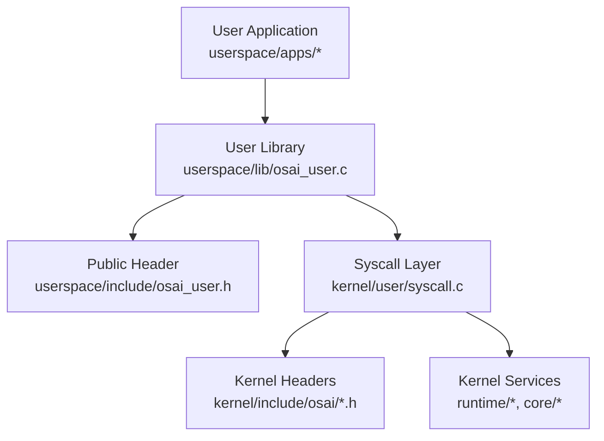
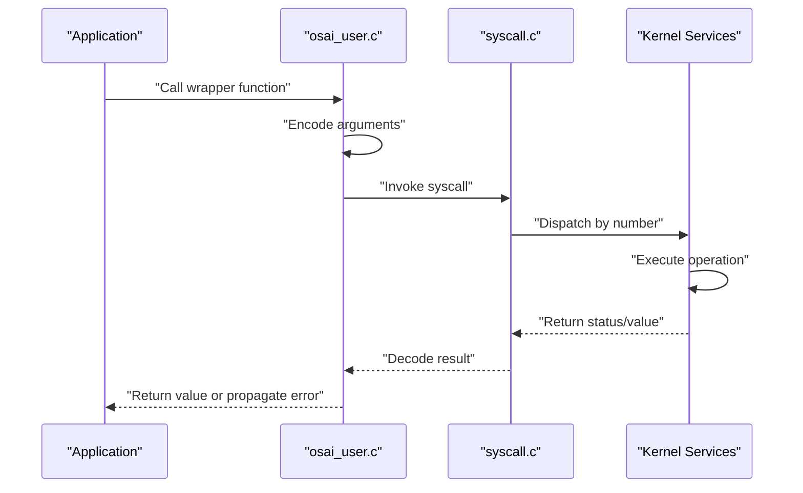
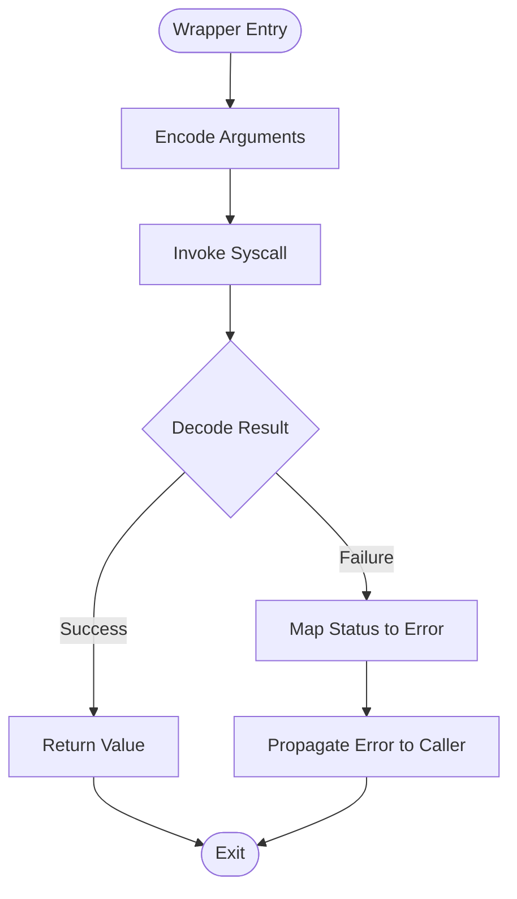
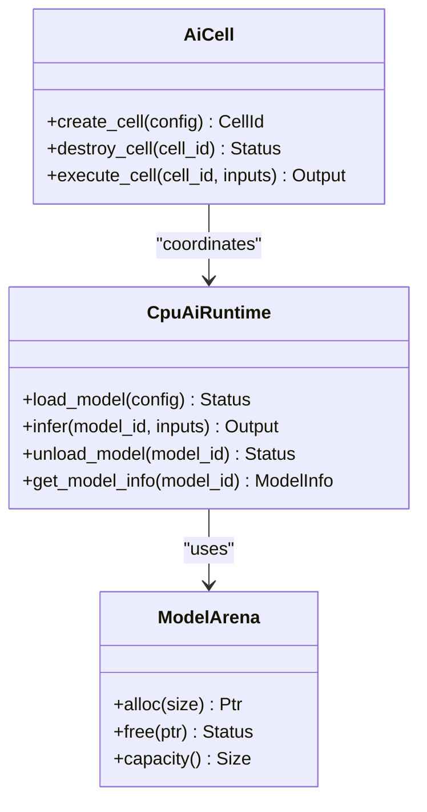
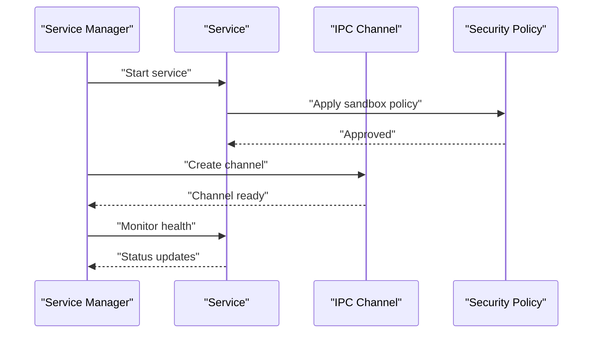
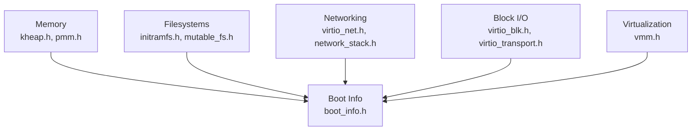
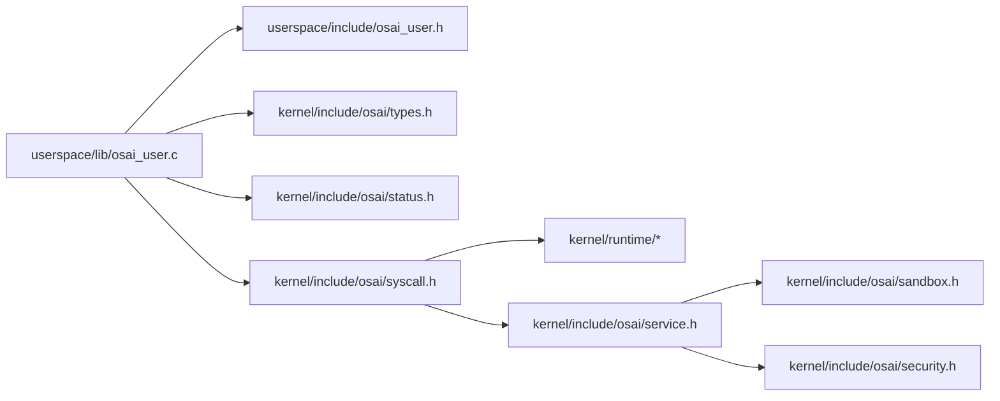

# API Reference

<cite>
**Referenced Files in This Document**
- [syscall.h](file://kernel/include/osai/syscall.h)
- [types.h](file://kernel/include/osai/types.h)
- [status.h](file://kernel/include/osai/status.h)
- [osai_user.h](file://userspace/include/osai_user.h)
- [osai_user.c](file://userspace/lib/osai_user.c)
- [service.h](file://kernel/include/osai/service.h)
- [cpu_ai_runtime.h](file://kernel/include/osai/cpu_ai_runtime.h)
- [ai_cell.h](file://kernel/include/osai/ai_cell.h)
- [model_arena.h](file://kernel/include/osai/model_arena.h)
- [sandbox.h](file://kernel/include/osai/sandbox.h)
- [security.h](file://kernel/include/osai/security.h)
- [network_stack.h](file://kernel/include/osai/network_stack.h)
- [virtio_blk.h](file://kernel/include/osai/virtio_blk.h)
- [virtio_net.h](file://kernel/include/osai/virtio_net.h)
- [virtio_transport.h](file://kernel/include/osai/virtio_transport.h)
- [persistence.h](file://kernel/include/osai/persistence.h)
- [remote_login.h](file://kernel/include/osai/remote_login.h)
- [update.h](file://kernel/include/osai/update.h)
- [telemetry.h](file://kernel/include/osai/telemetry.h)
- [boot_info.h](file://kernel/include/osai/boot_info.h)
- [initramfs.h](file://kernel/include/osai/initramfs.h)
- [mutable_fs.h](file://kernel/include/osai/mutable_fs.h)
- [vmm.h](file://kernel/include/osai/vmm.h)
- [kheap.h](file://kernel/include/osai/kheap.h)
- [pmm.h](file://kernel/include/osai/pmm.h)
- [source_index.h](file://kernel/include/osai/source_index.h)
- [git_workspace.h](file://kernel/include/osai/git_workspace.h)
- [exception.h](file://kernel/include/osai/exception.h)
- [panic.h](file://kernel/include/osai/panic.h)
- [klog.h](file://kernel/include/osai/klog.h)
- [timer.h](file://kernel/include/osai/timer.h)
- [gic.h](file://kernel/include/osai/gic.h)
- [smp.h](file://kernel/include/osai/smp.h)
- [user.h](file://kernel/include/osai/user.h)
- [service.c](file://kernel/user/service.c)
- [syscall.c](file://kernel/user/syscall.c)
- [user.c](file://kernel/user/user.c)
- [hello.c](file://userspace/apps/hello.c)
- [osai-shell.c](file://userspace/apps/osai-shell.c)
- [sysinfo.c](file://userspace/apps/sysinfo.c)
- [systest.c](file://userspace/apps/systest.c)
- [mltest.c](file://userspace/apps/mltest.c)
- [lstm-xor.c](file://userspace/apps/lstm-xor.c)
- [nettest.c](file://userspace/apps/nettest.c)
- [sshtest.c](file://userspace/apps/sshtest.c)
- [smptest.c](file://userspace/apps/smptest.c)
- [qemu-rc-v1.json](file://contracts/qemu-rc-v1.json)
- [README.md](file://README.md)
- [SECURITY.md](file://SECURITY.md)
</cite>

## Table of Contents
1. [Introduction](#introduction)
2. [Project Structure](#project-structure)
3. [Core Components](#core-components)
4. [Architecture Overview](#architecture-overview)
5. [Detailed Component Analysis](#detailed-component-analysis)
6. [Dependency Analysis](#dependency-analysis)
7. [Performance Considerations](#performance-considerations)
8. [Troubleshooting Guide](#troubleshooting-guide)
9. [Conclusion](#conclusion)
10. [Appendices](#appendices)

## Introduction
This document provides a comprehensive API reference for OSAI’s system interfaces and user-space APIs. It covers:
- System call interface: numbering, parameter structures, return values, and error codes
- User-space library functions for interacting with kernel services, AI runtime, and system resources
- AI runtime APIs for model loading, inference execution, and resource management
- Service management APIs for process supervision and inter-process communication
- API versioning, backward compatibility, and migration guidelines
- Security considerations, performance implications, and best practices

OSAI exposes a minimal kernel with a small set of system calls and a user-space library that wraps these calls. Applications are linked against the user-space library and use documented interfaces to access kernel services.

## Project Structure
The repository organizes kernel interfaces under kernel/include/osai/, user-space headers and library under userspace/include and userspace/lib, and example applications under userspace/apps. Contracts define ABI stability guarantees.

```mermaid
graph TB
subgraph "Kernel Headers"
K_SYSCALL["kernel/include/osai/syscall.h"]
K_TYPES["kernel/include/osai/types.h"]
K_STATUS["kernel/include/osai/status.h"]
K_AI["kernel/include/osai/cpu_ai_runtime.h"]
K_AI_CELL["kernel/include/osai/ai_cell.h"]
K_MODEL_ARENA["kernel/include/osai/model_arena.h"]
K_SERVICE["kernel/include/osai/service.h"]
K_SANDBOX["kernel/include/osai/sandbox.h"]
K_NET["kernel/include/osai/network_stack.h"]
K_VIRTIO_BLK["kernel/include/osai/virtio_blk.h"]
K_VIRTIO_NET["kernel/include/osai/virtio_net.h"]
K_VIRTIO_TRANS["kernel/include/osai/virtio_transport.h"]
K_PERSIST["kernel/include/osai/persistence.h"]
K_BOOT["kernel/include/osai/boot_info.h"]
K_INITRAMFS["kernel/include/osai/initramfs.h"]
K_MUT_FS["kernel/include/osai/mutable_fs.h"]
K_VMM["kernel/include/osai/vmm.h"]
K_KHEAP["kernel/include/osai/kheap.h"]
K_PMM["kernel/include/osai/pmm.h"]
K_SRC_IDX["kernel/include/osai/source_index.h"]
K_GIT_WS["kernel/include/osai/git_workspace.h"]
K_SEC["kernel/include/osai/security.h"]
K_TIMER["kernel/include/osai/timer.h"]
K_GIC["kernel/include/osai/gic.h"]
K_SMP["kernel/include/osai/smp.h"]
K_USER["kernel/include/osai/user.h"]
end
subgraph "User-Space"
U_HDR["userspace/include/osai_user.h"]
U_LIB["userspace/lib/osai_user.c"]
APPS["userspace/apps/*"]
end
K_SYSCALL --> U_LIB
K_TYPES --> U_LIB
K_STATUS --> U_LIB
K_AI --> U_LIB
K_AI_CELL --> U_LIB
K_MODEL_ARENA --> U_LIB
K_SERVICE --> U_LIB
K_SANDBOX --> U_LIB
K_NET --> U_LIB
K_VIRTIO_BLK --> U_LIB
K_VIRTIO_NET --> U_LIB
K_VIRTIO_TRANS --> U_LIB
K_PERSIST --> U_LIB
K_BOOT --> U_LIB
K_INITRAMFS --> U_LIB
K_MUT_FS --> U_LIB
K_VMM --> U_LIB
K_KHEAP --> U_LIB
K_PMM --> U_LIB
K_SRC_IDX --> U_LIB
K_GIT_WS --> U_LIB
K_SEC --> U_LIB
K_TIMER --> U_LIB
K_GIC --> U_LIB
K_SMP --> U_LIB
K_USER --> U_LIB
U_HDR --> U_LIB
U_LIB --> APPS
```

**Diagram sources**
- [syscall.h](file://kernel/include/osai/syscall.h)
- [types.h](file://kernel/include/osai/types.h)
- [status.h](file://kernel/include/osai/status.h)
- [osai_user.h](file://userspace/include/osai_user.h)
- [osai_user.c](file://userspace/lib/osai_user.c)

**Section sources**
- [syscall.h](file://kernel/include/osai/syscall.h)
- [osai_user.h](file://userspace/include/osai_user.h)
- [osai_user.c](file://userspace/lib/osai_user.c)

## Core Components
This section documents the foundational interfaces that define OSAI’s API surface.

- System Call Interface
  - System call numbers and dispatch are defined in the kernel header. The user-space library provides wrappers that encode arguments, invoke the system call, and decode return values and errors.
  - Parameter structures and return values are defined in shared headers to ensure ABI stability.
  - Error codes are standardized via a common status type.

- User-Space Library
  - The user-space library exports convenience functions for common operations, hiding low-level syscall mechanics from applications.
  - It also provides initialization helpers and resource cleanup routines.

- AI Runtime Interfaces
  - Model loading, inference execution, and resource management are exposed through dedicated headers and functions.

- Service Management Interfaces
  - Process supervision and IPC are provided via service-related headers and functions.

**Section sources**
- [syscall.h](file://kernel/include/osai/syscall.h)
- [types.h](file://kernel/include/osai/types.h)
- [status.h](file://kernel/include/osai/status.h)
- [osai_user.h](file://userspace/include/osai_user.h)
- [osai_user.c](file://userspace/lib/osai_user.c)
- [service.h](file://kernel/include/osai/service.h)
- [cpu_ai_runtime.h](file://kernel/include/osai/cpu_ai_runtime.h)
- [ai_cell.h](file://kernel/include/osai/ai_cell.h)
- [model_arena.h](file://kernel/include/osai/model_arena.h)

## Architecture Overview
The OSAI architecture separates kernel services behind a small syscall interface. User-space applications link against a thin library that translates high-level operations into syscalls.

**Diagram sources**
- [osai_user.c](file://userspace/lib/osai_user.c)
- [osai_user.h](file://userspace/include/osai_user.h)
- [syscall.c](file://kernel/user/syscall.c)
- [syscall.h](file://kernel/include/osai/syscall.h)

## Detailed Component Analysis

### System Call Interface
- Purpose: Expose kernel services to user-space via a fixed set of system call numbers.
- Responsibilities:
  - Define syscall numbers
  - Define argument and return value structures
  - Define standardized status/error codes
- Typical usage pattern:
  - Application calls a user-space wrapper
  - Wrapper encodes arguments and invokes the syscall
  - Kernel decodes arguments, executes operation, and returns status/value
  - Wrapper decodes result and propagates errors

**Diagram sources**
- [osai_user.c](file://userspace/lib/osai_user.c)
- [syscall.c](file://kernel/user/syscall.c)
- [syscall.h](file://kernel/include/osai/syscall.h)

**Section sources**
- [syscall.h](file://kernel/include/osai/syscall.h)
- [types.h](file://kernel/include/osai/types.h)
- [status.h](file://kernel/include/osai/status.h)
- [osai_user.c](file://userspace/lib/osai_user.c)

### User-Space Library Functions
- Purpose: Provide ergonomic wrappers around syscalls, handle argument encoding/decoding, and expose typed APIs to applications.
- Typical categories:
  - Resource allocation and management
  - AI runtime operations
  - Service management and IPC
  - System information and diagnostics
- Error handling:
  - Return standardized status codes
  - Provide helper functions to interpret status and derive human-readable messages

**Diagram sources**
- [osai_user.c](file://userspace/lib/osai_user.c)
- [status.h](file://kernel/include/osai/status.h)

**Section sources**
- [osai_user.h](file://userspace/include/osai_user.h)
- [osai_user.c](file://userspace/lib/osai_user.c)

### AI Runtime APIs
- Model Loading
  - Load a model into runtime-managed memory
  - Validate model metadata and compatibility
- Inference Execution
  - Submit inputs to a loaded model
  - Retrieve outputs and metrics
- Resource Management
  - Allocate and free model-specific arenas
  - Manage per-model leases and lifetimes

**Diagram sources**
- [cpu_ai_runtime.h](file://kernel/include/osai/cpu_ai_runtime.h)
- [ai_cell.h](file://kernel/include/osai/ai_cell.h)
- [model_arena.h](file://kernel/include/osai/model_arena.h)

**Section sources**
- [cpu_ai_runtime.h](file://kernel/include/osai/cpu_ai_runtime.h)
- [ai_cell.h](file://kernel/include/osai/ai_cell.h)
- [model_arena.h](file://kernel/include/osai/model_arena.h)

### Service Management APIs
- Process Supervision
  - Register and supervise long-running services
  - Monitor health and restart on failure
- Inter-Process Communication
  - Provide IPC channels for service-to-service messaging
  - Enforce sandbox boundaries and permissions

**Diagram sources**
- [service.h](file://kernel/include/osai/service.h)
- [sandbox.h](file://kernel/include/osai/sandbox.h)
- [security.h](file://kernel/include/osai/security.h)

**Section sources**
- [service.h](file://kernel/include/osai/service.h)
- [sandbox.h](file://kernel/include/osai/sandbox.h)
- [security.h](file://kernel/include/osai/security.h)

### System Resources and Device Interfaces
- Memory Management
  - Kernel heap and physical memory management
- Storage and Networking
  - Virtio block and network drivers
  - Transport abstractions
- Persistence and Boot
  - Persistent storage and initramfs
  - Boot information and firmware handoff

**Diagram sources**
- [kheap.h](file://kernel/include/osai/kheap.h)
- [pmm.h](file://kernel/include/osai/pmm.h)
- [initramfs.h](file://kernel/include/osai/initramfs.h)
- [mutable_fs.h](file://kernel/include/osai/mutable_fs.h)
- [virtio_net.h](file://kernel/include/osai/virtio_net.h)
- [virtio_blk.h](file://kernel/include/osai/virtio_blk.h)
- [virtio_transport.h](file://kernel/include/osai/virtio_transport.h)
- [boot_info.h](file://kernel/include/osai/boot_info.h)
- [vmm.h](file://kernel/include/osai/vmm.h)

**Section sources**
- [kheap.h](file://kernel/include/osai/kheap.h)
- [pmm.h](file://kernel/include/osai/pmm.h)
- [initramfs.h](file://kernel/include/osai/initramfs.h)
- [mutable_fs.h](file://kernel/include/osai/mutable_fs.h)
- [virtio_net.h](file://kernel/include/osai/virtio_net.h)
- [virtio_blk.h](file://kernel/include/osai/virtio_blk.h)
- [virtio_transport.h](file://kernel/include/osai/virtio_transport.h)
- [boot_info.h](file://kernel/include/osai/boot_info.h)
- [vmm.h](file://kernel/include/osai/vmm.h)

### Example Applications
- Hello World
  - Demonstrates basic user-space initialization and syscall usage
- OSAI Shell
  - Interactive shell leveraging kernel services
- System Information and Tests
  - Utilities for diagnostics and testing
- Machine Learning Examples
  - Model loading and inference tests
- Network and SSH Tests
  - Connectivity and secure shell tests

**Section sources**
- [hello.c](file://userspace/apps/hello.c)
- [osai-shell.c](file://userspace/apps/osai-shell.c)
- [sysinfo.c](file://userspace/apps/sysinfo.c)
- [systest.c](file://userspace/apps/systest.c)
- [mltest.c](file://userspace/apps/mltest.c)
- [lstm-xor.c](file://userspace/apps/lstm-xor.c)
- [nettest.c](file://userspace/apps/nettest.c)
- [sshtest.c](file://userspace/apps/sshtest.c)
- [smptest.c](file://userspace/apps/smptest.c)

## Dependency Analysis
OSAI’s API design emphasizes a clean separation between user-space library and kernel headers. The user-space library depends on shared types and status definitions, while the kernel depends on service and device headers.

**Diagram sources**
- [osai_user.c](file://userspace/lib/osai_user.c)
- [osai_user.h](file://userspace/include/osai_user.h)
- [syscall.h](file://kernel/include/osai/syscall.h)
- [types.h](file://kernel/include/osai/types.h)
- [status.h](file://kernel/include/osai/status.h)
- [service.h](file://kernel/include/osai/service.h)
- [sandbox.h](file://kernel/include/osai/sandbox.h)
- [security.h](file://kernel/include/osai/security.h)

**Section sources**
- [osai_user.c](file://userspace/lib/osai_user.c)
- [osai_user.h](file://userspace/include/osai_user.h)
- [syscall.h](file://kernel/include/osai/syscall.h)
- [types.h](file://kernel/include/osai/types.h)
- [status.h](file://kernel/include/osai/status.h)
- [service.h](file://kernel/include/osai/service.h)
- [sandbox.h](file://kernel/include/osai/sandbox.h)
- [security.h](file://kernel/include/osai/security.h)

## Performance Considerations
- Syscall overhead: Minimize the number of syscalls by batching operations where appropriate.
- Memory management: Prefer stack allocation for small buffers; use kernel heap only when necessary.
- AI runtime: Reuse loaded models and avoid frequent load/unload cycles.
- Networking: Use vectored I/O and asynchronous patterns when available.
- Device I/O: Leverage DMA-capable transports and minimize copies.

[No sources needed since this section provides general guidance]

## Troubleshooting Guide
- Error Codes
  - Use the standardized status type to detect and log failures.
  - Map status codes to human-readable messages for diagnostics.
- Panic and Exceptions
  - Kernel panic and exception handlers provide crash logs and backtraces.
- Logging
  - Use kernel logging facilities for verbose diagnostics during development.
- Telemetry
  - Collect runtime telemetry for performance profiling and anomaly detection.

**Section sources**
- [status.h](file://kernel/include/osai/status.h)
- [panic.h](file://kernel/include/osai/panic.h)
- [exception.h](file://kernel/include/osai/exception.h)
- [klog.h](file://kernel/include/osai/klog.h)
- [telemetry.h](file://kernel/include/osai/telemetry.h)

## Conclusion
OSAI’s API is designed for simplicity and safety, with a minimal syscall surface and a user-space library that encapsulates kernel interactions. By adhering to the documented interfaces, applications can reliably access AI runtime capabilities, manage services, and utilize system resources while maintaining strong security and performance characteristics.

[No sources needed since this section summarizes without analyzing specific files]

## Appendices

### API Versioning and Compatibility
- ABI Contracts
  - ABI stability is governed by the QEMU release contract, which defines supported syscalls and data structures.
- Migration Guidelines
  - When upgrading, verify syscall numbers and struct layouts against the current contract.
  - Prefer using the user-space library’s wrappers to insulate applications from low-level changes.
- Backward Compatibility
  - New features are introduced alongside existing ones; deprecated interfaces are removed after a deprecation period.

**Section sources**
- [qemu-rc-v1.json](file://contracts/qemu-rc-v1.json)

### Security Considerations
- Sandboxing
  - Apply sandbox policies to isolate services and limit privileges.
- Access Control
  - Enforce least privilege and validate all inputs.
- Remote Access
  - Secure remote login mechanisms are available but should be configured carefully.
- Audit and Telemetry
  - Enable telemetry to monitor suspicious activities.

**Section sources**
- [sandbox.h](file://kernel/include/osai/sandbox.h)
- [security.h](file://kernel/include/osai/security.h)
- [remote_login.h](file://kernel/include/osai/remote_login.h)
- [telemetry.h](file://kernel/include/osai/telemetry.h)

### Best Practices
- Use the user-space library wrappers for all kernel interactions.
- Always check and propagate status codes.
- Keep models and resources in the smallest scope necessary.
- Use persistent storage judiciously and flush when required.
- Test networking and device drivers in isolation before integration.

[No sources needed since this section provides general guidance]