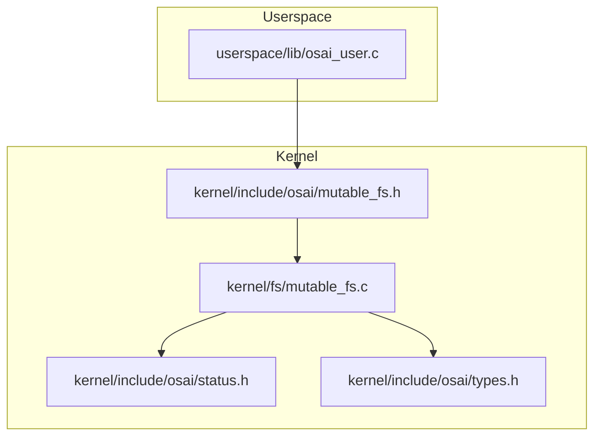
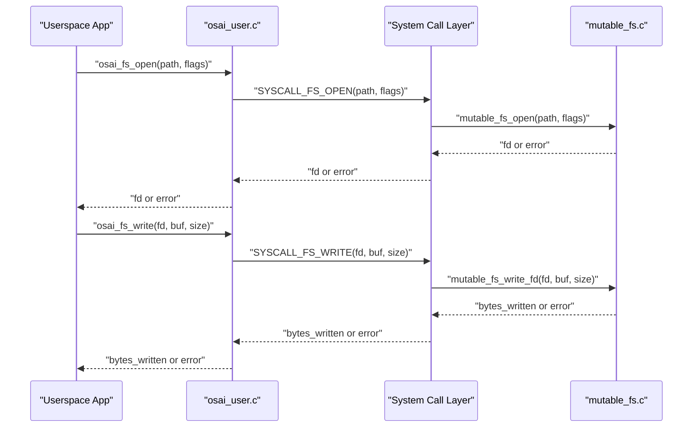
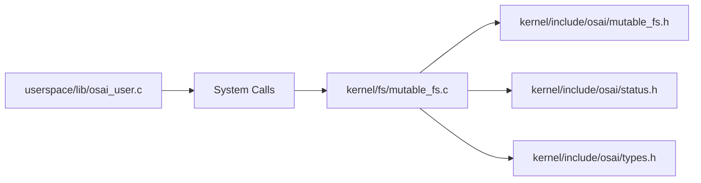

# Filesystem API

<cite>
**Referenced Files in This Document**
- [mutable_fs.h](file://kernel/include/osai/mutable_fs.h)
- [mutable_fs.c](file://kernel/fs/mutable_fs.c)
- [osai_user.c](file://userspace/lib/osai_user.c)
- [status.h](file://kernel/include/osai/status.h)
- [types.h](file://kernel/include/osai/types.h)
</cite>

## Table of Contents
1. [Introduction](#introduction)
2. [Project Structure](#project-structure)
3. [Core Components](#core-components)
4. [Architecture Overview](#architecture-overview)
5. [Detailed Component Analysis](#detailed-component-analysis)
6. [Dependency Analysis](#dependency-analysis)
7. [Performance Considerations](#performance-considerations)
8. [Troubleshooting Guide](#troubleshooting-guide)
9. [Conclusion](#conclusion)

## Introduction
This document describes OSAI’s mutable filesystem API for kernel-managed storage. It covers file operations including open/create/truncate semantics, streaming reads/writes via file descriptors, directory creation, deletion, renaming, listing, and metadata inspection. It also documents the filesystem statistics structure, error handling patterns, and operational constraints. The goal is to enable safe and efficient use of the mutable filesystem from both kernel and userspace.

## Project Structure
The mutable filesystem is implemented in the kernel and exposed to userspace via a thin userspace library that invokes system calls.

**Diagram sources**
- [mutable_fs.h:1-82](file://kernel/include/osai/mutable_fs.h#L1-L82)
- [mutable_fs.c:1-120](file://kernel/fs/mutable_fs.c#L1-L120)
- [osai_user.c:71-128](file://userspace/lib/osai_user.c#L71-L128)
- [status.h:1-14](file://kernel/include/osai/status.h#L1-L14)
- [types.h:1-9](file://kernel/include/osai/types.h#L1-L9)

**Section sources**
- [mutable_fs.h:1-82](file://kernel/include/osai/mutable_fs.h#L1-L82)
- [mutable_fs.c:1-120](file://kernel/fs/mutable_fs.c#L1-L120)
- [osai_user.c:71-128](file://userspace/lib/osai_user.c#L71-L128)
- [status.h:1-14](file://kernel/include/osai/status.h#L1-L14)
- [types.h:1-9](file://kernel/include/osai/types.h#L1-L9)

## Core Components
- Public API surface for mutable filesystem operations is declared in the header and implemented in the C file.
- Userspace wrappers forward requests to the kernel via system calls.

Key elements:
- Open flags constants for mutable filesystem operations
- Function prototypes for file operations
- Statistics structure for file metadata
- Status codes returned by operations

**Section sources**
- [mutable_fs.h:7-62](file://kernel/include/osai/mutable_fs.h#L7-L62)
- [mutable_fs.c:1348-1514](file://kernel/fs/mutable_fs.c#L1348-L1514)
- [status.h:4-11](file://kernel/include/osai/status.h#L4-L11)
- [types.h:4-7](file://kernel/include/osai/types.h#L4-L7)

## Architecture Overview
The filesystem is a kernel-managed, journaled mutable storage layer backed by virtualized block devices. Userspace applications call wrapper functions that translate to system calls. Kernel-side handlers validate paths, enforce policies, manage snapshots, and perform block I/O.

**Diagram sources**
- [osai_user.c:103-117](file://userspace/lib/osai_user.c#L103-L117)
- [mutable_fs.c:1387-1499](file://kernel/fs/mutable_fs.c#L1387-L1499)

**Section sources**
- [osai_user.c:71-128](file://userspace/lib/osai_user.c#L71-L128)
- [mutable_fs.c:1387-1499](file://kernel/fs/mutable_fs.c#L1387-L1499)

## Detailed Component Analysis

### Open Flags and Behavior
Open flags define how a file descriptor is created and behave as follows:
- OSAI_MFS_OPEN_READ: Open for reading; combined with WRITE allows read/write streaming.
- OSAI_MFS_OPEN_WRITE: Open for writing; combined with READ enables streaming read/write.
- OSAI_MFS_OPEN_CREATE: Create the file if it does not exist; requires WRITE and a valid parent.
- OSAI_MFS_OPEN_TRUNCATE: Truncate the file to zero length upon successful open; implies CREATE.

Behavioral rules enforced by the kernel:
- At least one of READ or WRITE must be set.
- Only the defined flag bits are permitted.
- If CREATE is set and the file does not exist, a new empty file is created under a valid parent directory.
- If TRUNCATE is set and the file exists, it is truncated to zero length.
- Up to a fixed number of file descriptors can be open concurrently.

Return values:
- Positive integer indicates a valid file descriptor.
- Negative status code indicates failure.

Usage example references:
- Opening a file for read/write with create and truncate semantics
- Subsequent streaming read/write operations via the returned file descriptor

**Section sources**
- [mutable_fs.h:10-13](file://kernel/include/osai/mutable_fs.h#L10-L13)
- [mutable_fs.c:1387-1441](file://kernel/fs/mutable_fs.c#L1387-L1441)

### Streaming Reads and Writes
After obtaining a file descriptor, userspace can stream data:
- Read: Returns number of bytes read or negative error code. Reads are position-aware and constrained by current file size.
- Write: Writes data at the current cursor position, extending the file as needed. Enforces per-file size limits and cursor bounds.

Constraints:
- READ flag must be set for read operations.
- WRITE flag must be set for write operations.
- Cursor advances by number of bytes transferred.
- Per-file size limit applies to total content size.

Return values:
- Non-negative indicates bytes processed.
- Negative status code indicates failure.

Usage example references:
- Using osai_fs_read and osai_fs_write after successful osai_fs_open

**Section sources**
- [mutable_fs.c:1443-1499](file://kernel/fs/mutable_fs.c#L1443-L1499)

### Close
Closes an open file descriptor, releasing internal resources associated with it.

Return values:
- Status code indicating success or failure.

Usage example references:
- Closing a file descriptor after read/write operations

**Section sources**
- [mutable_fs.c:1501-1514](file://kernel/fs/mutable_fs.c#L1501-L1514)

### Stat
Retrieves metadata for a path, including type, block count, size, generation, and content hash. The kernel normalizes the path and returns the visible node’s attributes.

Structure fields:
- type: Directory or file indicator
- block_count: Number of allocated blocks
- size: Content size in bytes
- generation: Node generation counter
- content_hash: Content checksum

Return values:
- Status code indicating success or failure.

Usage example references:
- Using osai_fs_stat to inspect file metadata

**Section sources**
- [mutable_fs.h:15-21](file://kernel/include/osai/mutable_fs.h#L15-L21)
- [mutable_fs.c:915-935](file://kernel/fs/mutable_fs.c#L915-L935)

### List
Lists direct children of a directory. Returns newline-separated names and the total output size. Root listing behavior differs from non-root.

Return values:
- Status code indicating success or failure.
- On success, caller receives the number of bytes written to the buffer.

Usage example references:
- Using osai_fs_list to enumerate directory entries

**Section sources**
- [mutable_fs.c:969-1018](file://kernel/fs/mutable_fs.c#L969-L1018)

### Mkdir
Creates a directory under a valid parent. The operation is rejected if the parent does not exist or if the filesystem is not mounted read-write.

Return values:
- Status code indicating success or failure.

Usage example references:
- Using osai_fs_mkdir to create directories

**Section sources**
- [mutable_fs.c:669-701](file://kernel/fs/mutable_fs.c#L669-L701)

### Delete
Deletes a file or an empty directory. Deletion of a directory with active children is rejected.

Return values:
- Status code indicating success or failure.

Usage example references:
- Using osai_fs_delete to remove files or empty directories

**Section sources**
- [mutable_fs.c:857-882](file://kernel/fs/mutable_fs.c#L857-L882)

### Rename
Renames a file or directory to a new path. The destination must not already exist and must have a valid parent. Renaming a directory with active children is rejected.

Return values:
- Status code indicating success or failure.

Usage example references:
- Using osai_fs_rename to move/rename entries

**Section sources**
- [mutable_fs.c:884-913](file://kernel/fs/mutable_fs.c#L884-L913)

### Userspace Wrappers
Userspace provides thin wrappers around system calls for each operation. These wrappers serialize arguments and interpret return codes.

- osai_fs_open, osai_fs_read, osai_fs_write, osai_fs_close
- osai_fs_stat
- osai_fs_mkdir, osai_fs_delete, osai_fs_rename, osai_fs_list

These wrappers accept and return the same conceptual types as the kernel APIs.

**Section sources**
- [osai_user.c:71-128](file://userspace/lib/osai_user.c#L71-L128)

## Dependency Analysis
The kernel mutable filesystem implementation depends on:
- Block device abstraction for low-level I/O
- Internal structures for metadata, journaling, and node management
- Status codes for error reporting

**Diagram sources**
- [osai_user.c:71-128](file://userspace/lib/osai_user.c#L71-L128)
- [mutable_fs.c:1-120](file://kernel/fs/mutable_fs.c#L1-L120)
- [mutable_fs.h:1-82](file://kernel/include/osai/mutable_fs.h#L1-L82)
- [status.h:1-14](file://kernel/include/osai/status.h#L1-L14)
- [types.h:1-9](file://kernel/include/osai/types.h#L1-L9)

**Section sources**
- [mutable_fs.c:1-120](file://kernel/fs/mutable_fs.c#L1-L120)
- [mutable_fs.h:1-82](file://kernel/include/osai/mutable_fs.h#L1-L82)
- [status.h:1-14](file://kernel/include/osai/status.h#L1-L14)
- [types.h:1-9](file://kernel/include/osai/types.h#L1-L9)

## Performance Considerations
- File size and block constraints: Files are limited to a fixed maximum size and are stored in contiguous sectors. Excessive fragmentation is mitigated by allocating full sectors per block.
- Journaling overhead: Pending writes are journaled before committing to metadata, ensuring crash safety at the cost of extra I/O.
- Metadata operations: Listing, stat, and directory operations iterate nodes and compute hashes; avoid frequent repeated queries for large directories.
- Streaming I/O: Prefer sequential reads/writes to minimize repeated metadata updates and hashing.
- Concurrency: The filesystem maintains a bounded number of open file descriptors; excessive concurrent handles can fail with memory errors.

[No sources needed since this section provides general guidance]

## Troubleshooting Guide
Common errors and likely causes:
- Invalid path or malformed path: Path validation rejects invalid characters, leading to invalid path errors.
- Not found: Attempting to open/read a non-existent file without CREATE, or accessing deleted nodes.
- No memory: Exhaustion of nodes or open file descriptors; ensure cleanup via close.
- Busy: Attempting to delete a directory with active children or opening a non-file path.
- IO errors: Underlying block device failures during read/write/journal operations.
- Invalid flags: Passing unsupported combinations of open flags.

Operational counters:
- The kernel tracks counts for mounts, formats, commits, rollbacks, reads, writes, deletes, renames, lists, stats, opens, closes, rejections, checksum errors, allocations, frees, replays, and journal writes. Use these to diagnose anomalies.

**Section sources**
- [mutable_fs.c:857-882](file://kernel/fs/mutable_fs.c#L857-L882)
- [mutable_fs.c:1387-1441](file://kernel/fs/mutable_fs.c#L1387-L1441)
- [mutable_fs.c:1516-1538](file://kernel/fs/mutable_fs.c#L1516-L1538)

## Conclusion
OSAI’s mutable filesystem provides a compact, crash-safe, and constrained interface suitable for embedded and kernel-managed workloads. Its API supports robust open/create/truncate semantics, streaming I/O, directory operations, and metadata inspection. By adhering to path validation, flag constraints, and size limits, and by monitoring operational counters, developers can build reliable applications that integrate seamlessly with the kernel’s storage subsystem.