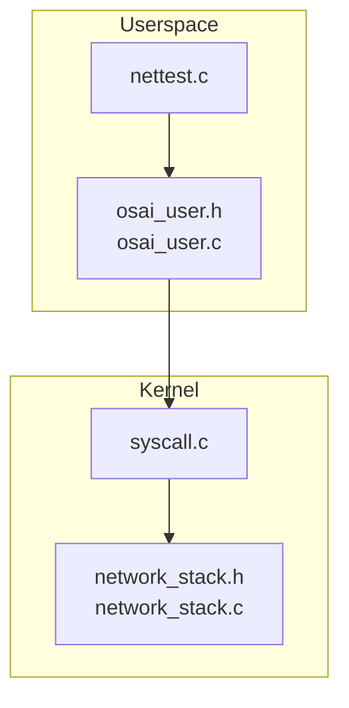
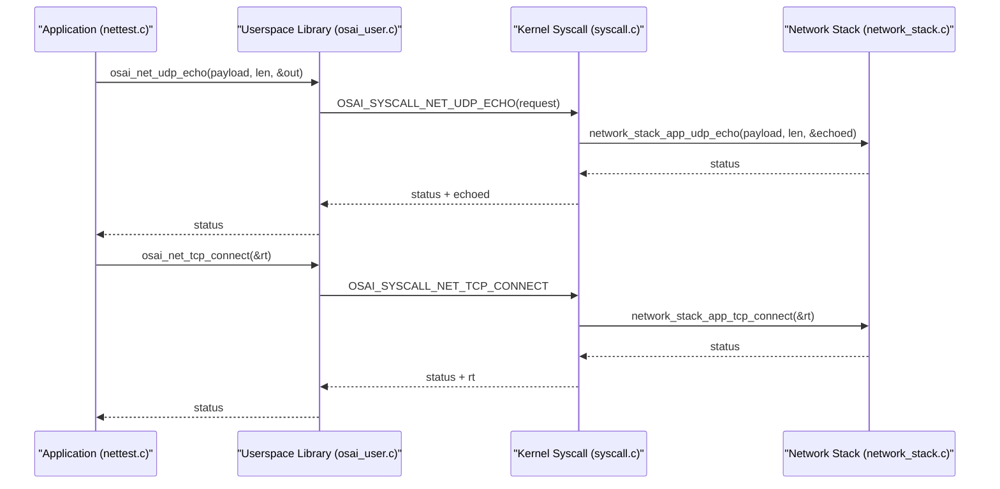
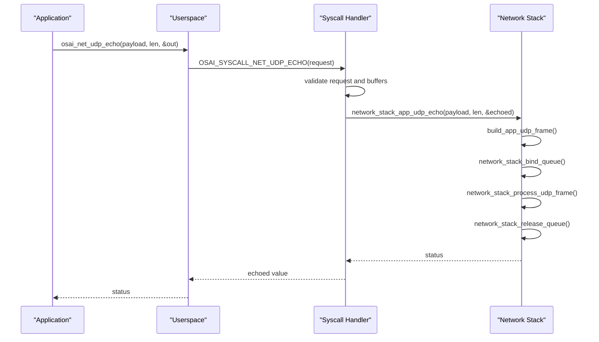
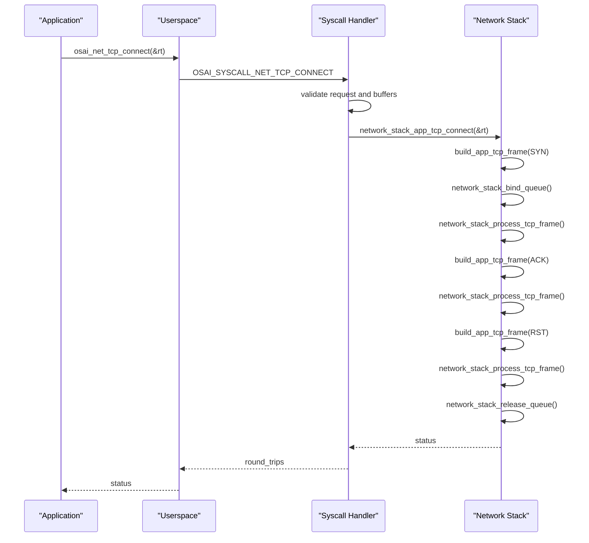
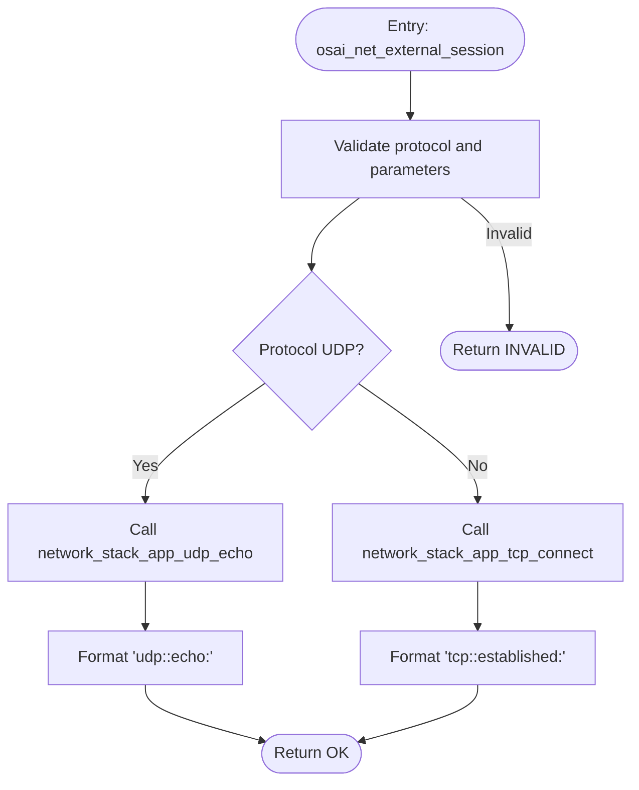
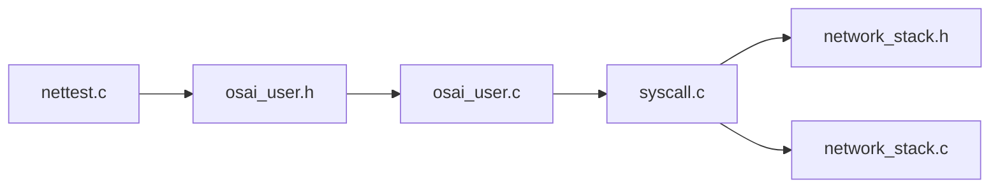

# Networking API

<cite>
**Referenced Files in This Document**
- [network_stack.h](file://kernel/include/osai/network_stack.h)
- [network_stack.c](file://kernel/runtime/network_stack.c)
- [syscall.c](file://kernel/user/syscall.c)
- [nettest.c](file://userspace/apps/nettest.c)
- [osai_user.h](file://userspace/include/osai_user.h)
- [osai_user.c](file://userspace/lib/osai_user.c)
</cite>

## Table of Contents
1. [Introduction](#introduction)
2. [Project Structure](#project-structure)
3. [Core Components](#core-components)
4. [Architecture Overview](#architecture-overview)
5. [Detailed Component Analysis](#detailed-component-analysis)
6. [Dependency Analysis](#dependency-analysis)
7. [Performance Considerations](#performance-considerations)
8. [Troubleshooting Guide](#troubleshooting-guide)
9. [Conclusion](#conclusion)

## Introduction
This document provides comprehensive networking API documentation for OSAI's network operations. It focuses on:
- UDP echo functionality via osai_net_udp_echo
- TCP connect verification via osai_net_tcp_connect
- External network sessions via osai_net_external_session_request_t
- Protocol constants OSAI_NET_PROTOCOL_UDP and OSAI_NET_PROTOCOL_TCP
- Parameter structures, return values, and error handling
- Usage examples for network testing, external connectivity, and diagnostics
- Security considerations, firewall implications, and performance optimization techniques

## Project Structure
The networking stack spans kernel and userspace components:
- Kernel runtime implements low-level packet building, protocol handling, and external session orchestration
- Userspace exposes thin wrappers for application use
- Syscalls bridge userspace calls to kernel functionality

**Diagram sources**
- [osai_user.h](file://userspace/include/osai_user.h)
- [osai_user.c](file://userspace/lib/osai_user.c)
- [syscall.c](file://kernel/user/syscall.c)
- [network_stack.h](file://kernel/include/osai/network_stack.h)
- [network_stack.c](file://kernel/runtime/network_stack.c)

**Section sources**
- [osai_user.h](file://userspace/include/osai_user.h)
- [osai_user.c](file://userspace/lib/osai_user.c)
- [syscall.c](file://kernel/user/syscall.c)
- [network_stack.h](file://kernel/include/osai/network_stack.h)
- [network_stack.c](file://kernel/runtime/network_stack.c)

## Core Components
This section documents the primary networking APIs and their roles.

- osai_net_udp_echo
  - Purpose: Validates UDP echo capability by sending a small payload and receiving an identical response
  - Parameters:
    - payload: pointer to user buffer containing the message
    - payload_len: length of the message (must be > 0 and ≤ 64)
    - out_value: pointer to receive the number of echoed bytes
  - Returns: status indicating success or failure
  - Error handling: returns invalid argument for bad parameters; IO errors propagate from kernel path
  - Example usage: see nettest.c main routine

- osai_net_tcp_connect
  - Purpose: Verifies TCP connectivity by performing a minimal handshake simulation
  - Parameters:
    - round_trips: pointer to receive the measured round-trip metric
  - Returns: status indicating success or failure
  - Error handling: returns invalid argument for null pointer; IO errors propagate from kernel path
  - Example usage: see nettest.c main routine

- osai_net_external_session_request_t
  - Purpose: Describes an external network session request for UDP/TCP connectivity tests
  - Fields:
    - protocol: either OSAI_NET_PROTOCOL_UDP or OSAI_NET_PROTOCOL_TCP
    - port: destination port for the session
    - payload: pointer to the payload buffer (UDP only)
    - payload_len: payload length (UDP only)
    - output: caller-owned buffer to receive formatted results
    - output_capacity: capacity of the output buffer
    - output_bytes: pointer to receive the number of bytes written to output
  - Returns: status indicating success or failure
  - Error handling: invalid protocol or insufficient buffer capacity yields invalid argument; IO errors indicate underlying transport failures

- Protocol Constants
  - OSAI_NET_PROTOCOL_UDP: identifies UDP-based external session
  - OSAI_NET_PROTOCOL_TCP: identifies TCP-based external session

**Section sources**
- [osai_user.h](file://userspace/include/osai_user.h)
- [osai_user.c](file://userspace/lib/osai_user.c)
- [syscall.c](file://kernel/user/syscall.c)
- [network_stack.h](file://kernel/include/osai/network_stack.h)
- [network_stack.c](file://kernel/runtime/network_stack.c)
- [nettest.c](file://userspace/apps/nettest.c)

## Architecture Overview
The networking API follows a layered design:
- Userspace applications call osai_* wrappers
- Userspace library translates calls into syscall requests
- Kernel syscall handler validates arguments and invokes network_stack functions
- Network stack builds protocol frames, manages queues, and returns results

**Diagram sources**
- [nettest.c](file://userspace/apps/nettest.c)
- [osai_user.c](file://userspace/lib/osai_user.c)
- [syscall.c](file://kernel/user/syscall.c)
- [network_stack.c](file://kernel/runtime/network_stack.c)

## Detailed Component Analysis

### UDP Echo Path
The UDP echo path constructs a minimal IP+UDP frame, writes the payload, binds a queue, processes the frame, and reports echoed byte counts.

Key behaviors:
- Payload length constrained to a safe upper bound
- Queue binding/release ensures isolated processing
- Frame construction embeds IP and UDP headers with payload
- Logging records operation metadata

**Diagram sources**
- [syscall.c](file://kernel/user/syscall.c)
- [network_stack.c](file://kernel/runtime/network_stack.c)

**Section sources**
- [syscall.c](file://kernel/user/syscall.c)
- [network_stack.c](file://kernel/runtime/network_stack.c)

### TCP Connect Path
The TCP connect path simulates a minimal handshake using SYN, ACK, and RST frames to measure basic connectivity and round-trip characteristics.

Key behaviors:
- Uses fixed remote port for test traffic
- Measures round-trips across SYN/ACK/RST sequence
- Queue lifecycle mirrors UDP path for isolation

**Diagram sources**
- [syscall.c](file://kernel/user/syscall.c)
- [network_stack.c](file://kernel/runtime/network_stack.c)

**Section sources**
- [syscall.c](file://kernel/user/syscall.c)
- [network_stack.c](file://kernel/runtime/network_stack.c)

### External Session Path
External sessions combine userspace request parsing with kernel orchestration to produce human-readable summaries of connectivity outcomes.

Key behaviors:
- Validates protocol constant values
- Produces concise textual summaries for diagnostics
- Logs operation metrics for observability

**Diagram sources**
- [network_stack.c](file://kernel/runtime/network_stack.c)

**Section sources**
- [network_stack.c](file://kernel/runtime/network_stack.c)

### Userspace API Surface
Userspace wrappers expose the kernel functionality to applications with minimal overhead.

- osai_net_udp_echo: wraps syscall for UDP echo
- osai_net_tcp_connect: wraps syscall for TCP connect
- osai_net_external_session_request_t: request structure for external sessions
- osai_net_external_session: orchestrates external connectivity tests

Validation and usage examples are demonstrated in nettest.c.

**Section sources**
- [osai_user.h](file://userspace/include/osai_user.h)
- [osai_user.c](file://userspace/lib/osai_user.c)
- [nettest.c](file://userspace/apps/nettest.c)

## Dependency Analysis
The networking API exhibits clean separation of concerns:
- Userspace depends on syscall interface and kernel exports
- Syscall layer enforces buffer validation and marshals requests
- Network stack encapsulates protocol-specific logic and resource management

**Diagram sources**
- [nettest.c](file://userspace/apps/nettest.c)
- [osai_user.h](file://userspace/include/osai_user.h)
- [osai_user.c](file://userspace/lib/osai_user.c)
- [syscall.c](file://kernel/user/syscall.c)
- [network_stack.h](file://kernel/include/osai/network_stack.h)
- [network_stack.c](file://kernel/runtime/network_stack.c)

**Section sources**
- [nettest.c](file://userspace/apps/nettest.c)
- [osai_user.h](file://userspace/include/osai_user.h)
- [osai_user.c](file://userspace/lib/osai_user.c)
- [syscall.c](file://kernel/user/syscall.c)
- [network_stack.h](file://kernel/include/osai/network_stack.h)
- [network_stack.c](file://kernel/runtime/network_stack.c)

## Performance Considerations
- Payload sizing: UDP echo payload length is bounded; keep payloads small to minimize overhead while ensuring meaningful tests
- Queue isolation: Binding/releasing queues per operation prevents contention and improves predictability
- TCP round-trip measurement: The connect path measures minimal handshakes; avoid excessive repeated invocations during steady-state monitoring
- Buffer management: External session output requires sufficient capacity; pre-size buffers to avoid partial writes
- Logging: Excessive logging can impact performance; use judiciously in diagnostic scenarios

## Troubleshooting Guide
Common issues and resolutions:
- Invalid argument errors:
  - Occur when parameters are null or payload length exceeds limits
  - Verify non-null pointers and payload bounds before invoking APIs
- IO errors:
  - Indicate underlying transport or processing failures
  - Retry after verifying network stack health and queue availability
- Buffer capacity errors:
  - External session output may fail if capacity is insufficient
  - Ensure output_capacity is adequate for expected summary length
- Connectivity anomalies:
  - TCP connect may report elevated round-trips due to emulation specifics
  - Use UDP echo for pure payload validation; TCP connect for handshake verification

**Section sources**
- [syscall.c](file://kernel/user/syscall.c)
- [network_stack.c](file://kernel/runtime/network_stack.c)

## Conclusion
OSAI's networking API provides robust primitives for validating UDP echo, TCP connectivity, and external network sessions. The design emphasizes safety through strict parameter validation, isolation via queue management, and clarity via structured output. By following the guidelines and examples herein, developers can effectively test, diagnose, and optimize network operations within the OSAI environment.