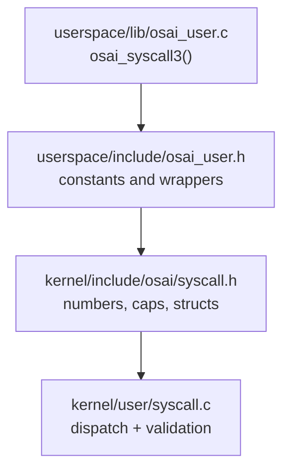
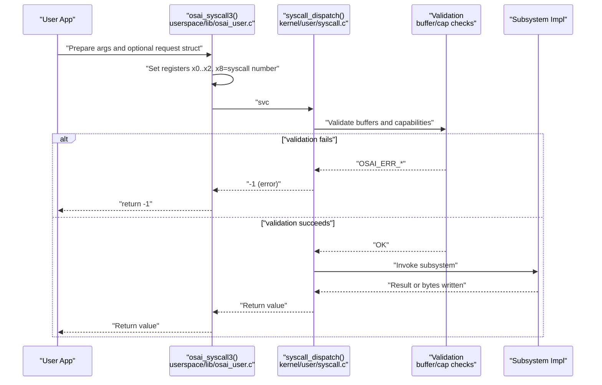
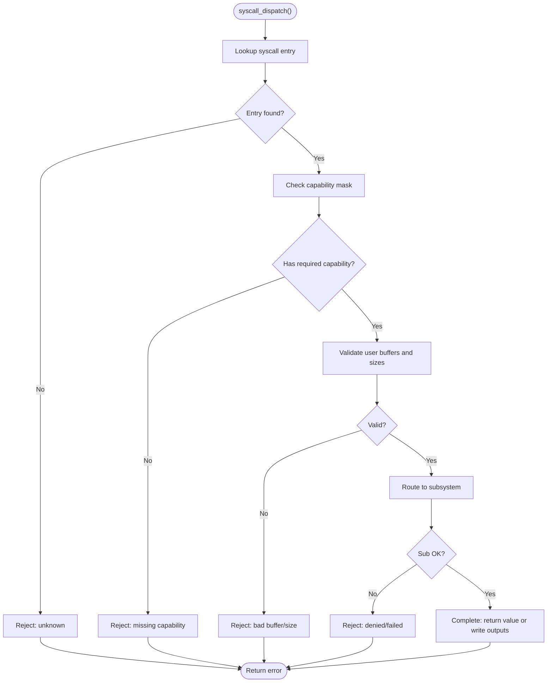
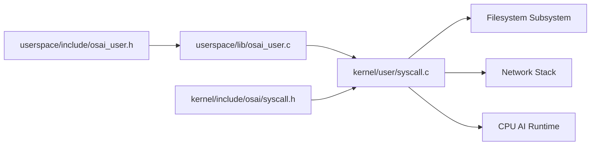

# System Calls

<cite>
**Referenced Files in This Document**
- [syscall.h](file://kernel/include/osai/syscall.h)
- [osai_user.h](file://userspace/include/osai_user.h)
- [syscall.c](file://kernel/user/syscall.c)
- [osai_user.c](file://userspace/lib/osai_user.c)
- [network_stack.h](file://kernel/include/osai/network_stack.h)
- [nettest.c](file://userspace/apps/nettest.c)
</cite>

## Update Summary
**Changes Made**
- Added documentation for new socket operations: OSAI_SYSCALL_NET_LISTEN, OSAI_SYSCALL_NET_ACCEPT, OSAI_SYSCALL_NET_RECV, OSAI_SYSCALL_NET_SEND, OSAI_SYSCALL_NET_CLOSE
- Updated syscall numbers to reflect new socket operations (now 33 syscalls total)
- Added capability mask OSAI_CAP_NET_SOCKET for socket operations
- Updated individual system call documentation to include new socket operations
- Enhanced usage examples to demonstrate socket operation patterns
- Updated syscall table to include new socket operations

## Table of Contents
1. [Introduction](#introduction)
2. [Project Structure](#project-structure)
3. [Core Components](#core-components)
4. [Architecture Overview](#architecture-overview)
5. [Detailed Component Analysis](#detailed-component-analysis)
6. [Dependency Analysis](#dependency-analysis)
7. [Performance Considerations](#performance-considerations)
8. [Troubleshooting Guide](#troubleshooting-guide)
9. [Conclusion](#conclusion)

## Introduction
This document describes OSAI's kernel-user interface system call ABI. It covers all system call numbers, parameter structures, dispatch semantics, security gating, and usage patterns. It also documents the osai_syscall3 function and its parameter-passing mechanism, and provides guidance on secure and efficient syscall usage from user space.

## Project Structure
OSAI separates the kernel-side syscall dispatcher and user-space wrappers:
- Kernel header defines syscall numbers, capability masks, and request structures.
- Kernel dispatcher validates arguments, enforces capabilities, and invokes subsystems.
- User-space header exposes typed wrappers and constants.
- User-space library implements osai_syscall3 and convenience functions.

**Diagram sources**
- [osai_user.c:3-13](file://userspace/lib/osai_user.c#L3-L13)
- [osai_user.h:1-178](file://userspace/include/osai_user.h#L1-L178)
- [syscall.h:1-146](file://kernel/include/osai/syscall.h#L1-L146)
- [syscall.c:1-821](file://kernel/user/syscall.c#L1-L821)

**Section sources**
- [osai_user.c:1-364](file://userspace/lib/osai_user.c#L1-L364)
- [osai_user.h:1-178](file://userspace/include/osai_user.h#L1-L178)
- [syscall.h:1-146](file://kernel/include/osai/syscall.h#L1-L146)
- [syscall.c:1-821](file://kernel/user/syscall.c#L1-L821)

## Core Components
- System call numbers and capability masks are defined in the kernel header.
- Request structures unify pointer-length pairs and output slots for complex syscalls.
- The kernel dispatcher validates buffers, authorizes capabilities, and routes to subsystems.
- User-space wrappers construct requests and call osai_syscall3, returning standardized statuses.

Key elements:
- Syscall numbers include logging, process lifecycle, OS control plane, filesystem operations, timing, networking, SMP/thread groups, AI/ML inference, and remote login.
- Capability masks govern access to sensitive operations.
- Validation routines check buffer ownership and enforce security policies.

**Section sources**
- [syscall.h:7-57](file://kernel/include/osai/syscall.h#L7-L57)
- [syscall.c:17-61](file://kernel/user/syscall.c#L17-L61)
- [osai_user.h:8-33](file://userspace/include/osai_user.h#L8-L33)

## Architecture Overview
The syscall ABI uses a unified entry point with a small fixed set of registers. User-space constructs a request structure (when needed), passes pointers and sizes, and receives either a scalar result or writes into caller-owned buffers.

**Diagram sources**
- [osai_user.c:3-13](file://userspace/lib/osai_user.c#L3-L13)
- [syscall.c:180-187](file://kernel/user/syscall.c#L180-L187)

## Detailed Component Analysis

### System Call Numbers and Purpose
Below are the documented syscall numbers and their purposes. Each entry includes the number, name, and primary purpose.

- OSAI_SYSCALL_LOG (1): Write a log message from user space. Validates user buffer and rejects secret-like content.
- OSAI_SYSCALL_EXIT (2): Terminate current process with a status code.
- OSAI_SYSCALL_OSCTL (3): Execute privileged OS control commands after validation.
- OSAI_SYSCALL_READ_SERVICE_DESCRIPTOR (4): Read embedded service descriptor into a caller-provided buffer.
- OSAI_SYSCALL_SERVICE_STATUS (5) .. OSAI_SYSCALL_SERVICE_ROLLBACK (9): Control lifecycle of named services.
- OSAI_SYSCALL_SERVICE_UPDATE (10): Apply updates using a signature string.
- OSAI_SYSCALL_FS_OPEN (11) .. OSAI_SYSCALL_FS_LIST (19): Full filesystem API: open, read, write, close, stat, mkdir, delete, rename, list.
- OSAI_SYSCALL_CLOCK_NANOS (20): Read monotonic nanosecond timestamp.
- OSAI_SYSCALL_NET_UDP_ECHO (21) .. OSAI_SYSCALL_NET_TCP_CONNECT (22): Network tests via UDP echo and TCP connect.
- OSAI_SYSCALL_SMP_RUN (23): Run CPU-bound tasks across available cores; returns counts/checksums via caller buffers.
- OSAI_SYSCALL_CPU_AI_DECODE (24): Decode AI-related input using bound runtime; returns decoded size.
- OSAI_SYSCALL_REMOTE_LOGIN (25): Execute remote login commands with user and command strings.
- OSAI_SYSCALL_NET_EXTERNAL_SESSION (26): Perform external network sessions with protocol/port and payload.
- OSAI_SYSCALL_THREAD_GROUP_RUN (27): Run a user thread group workload; returns counts/checksums via caller buffers.
- OSAI_SYSCALL_ML_RUN (28): Run ML models with input and receive output; returns written size.
- OSAI_SYSCALL_NET_LISTEN (29): Create a listening socket on a specified port; returns socket descriptor.
- OSAI_SYSCALL_NET_ACCEPT (30): Accept incoming connections on a listening socket; returns connection socket descriptor.
- OSAI_SYSCALL_NET_RECV (31): Receive data from a socket into caller-provided buffer; returns bytes received.
- OSAI_SYSCALL_NET_SEND (32): Send data from caller-provided buffer to a socket; returns bytes sent.
- OSAI_SYSCALL_NET_CLOSE (33): Close a socket and free resources.

Security and capability mapping:
- Each syscall has an associated capability mask. The dispatcher checks the current process capability mask against the required capability before invoking the handler.
- Control-plane syscalls (OSCTL and several others) are tracked separately for auditing.
- Socket operations require OSAI_CAP_NET_SOCKET capability.

**Section sources**
- [syscall.h:7-39](file://kernel/include/osai/syscall.h#L7-L39)
- [syscall.c:23-61](file://kernel/user/syscall.c#L23-L61)
- [syscall.c:180-766](file://kernel/user/syscall.c#L180-L766)

### Parameter Passing Mechanism: osai_syscall3
osai_syscall3 sets up registers for the SVC instruction and returns the kernel's 64-bit result in x0. The signature is:

- Function: osai_syscall3(number, arg0, arg1, arg2)
- Registers: x0=arg0, x1=arg1, x2=arg2, x8=number
- Instruction: svc #0
- Return: value returned by kernel (often cast to int for convenience)

User-space wrappers pass either raw pointers/lengths or request structures. For syscalls requiring a request struct, wrappers populate a stack-allocated struct and pass its address and size.

Examples of wrappers:
- Logging: passes a C string and its length.
- FS operations: pass fd, buffer, and size; some pass a request struct with output slots.
- Networking: pass a request struct containing payload, sizes, and output storage.
- SMP/AI/ML: pass request structs with input/output pointers and sizes.
- Socket operations: pass osai_socket_request_t with sockfd, port, buffer, and output slots.

Note: On error, wrappers typically compare the return against a sentinel indicating failure and convert to a conventional negative status.

**Section sources**
- [osai_user.c:3-13](file://userspace/lib/osai_user.c#L3-L13)
- [osai_user.c:233-289](file://userspace/lib/osai_user.c#L233-L289)
- [osai_user.h:125-132](file://userspace/include/osai_user.h#L125-L132)

### Dispatch and Validation Flow
The kernel dispatcher performs:
- Lookup by syscall number
- Capability check against the current process
- Buffer validation for user pointers and sizes
- Optional policy checks (e.g., secret material rejection)
- Invocation of the appropriate subsystem routine
- Returning either a scalar result or writing into caller-provided output buffers

**Diagram sources**
- [syscall.c:180-187](file://kernel/user/syscall.c#L180-L187)
- [syscall.c:188-194](file://kernel/user/syscall.c#L188-L194)
- [syscall.c:676-766](file://kernel/user/syscall.c#L676-L766)

**Section sources**
- [syscall.c:104-112](file://kernel/user/syscall.c#L104-L112)
- [syscall.c:180-187](file://kernel/user/syscall.c#L180-L187)
- [syscall.c:188-194](file://kernel/user/syscall.c#L188-L194)

### Individual System Calls

#### OSAI_SYSCALL_LOG
- Purpose: Log a user-provided message to kernel log.
- Parameters: arg0=address of message, arg1=length, arg2=unused.
- Validation: Validates user buffer; rejects messages containing credential-like content.
- Returns: 0 on success, error code otherwise.
- Usage pattern: Wrapper computes length and calls osai_syscall3 with number and args.

**Section sources**
- [syscall.h:7](file://kernel/include/osai/syscall.h#L7)
- [osai_user.h:136](file://userspace/include/osai_user.h#L136)
- [osai_user.c:50-52](file://userspace/lib/osai_user.c#L50-L52)
- [syscall.c:196-208](file://kernel/user/syscall.c#L196-L208)

#### OSAI_SYSCALL_EXIT
- Purpose: Terminate current process with a status code.
- Parameters: arg0=status code, others unused.
- Behavior: Records process exit metrics and triggers termination.
- Returns: Does not return on success; wrapper waits indefinitely after calling.
- Usage pattern: osai_exit(status).

**Section sources**
- [syscall.h:8](file://kernel/include/osai/syscall.h#L8)
- [osai_user.h:138](file://userspace/include/osai_user.h#L138)
- [osai_user.c:54-59](file://userspace/lib/osai_user.c#L54-L59)
- [syscall.c:210-222](file://kernel/user/syscall.c#L210-L222)

#### OSAI_SYSCALL_OSCTL
- Purpose: Execute privileged OS control commands.
- Parameters: arg0=address of command string, arg1=length, arg2=unused.
- Validation: Copies and validates command string; rejects credential-like content.
- Returns: 0 on success, -1 on error.
- Usage pattern: osai_osctl(command) returns 0/-1.

**Section sources**
- [syscall.h:9](file://kernel/include/osai/syscall.h#L9)
- [osai_user.h:140](file://userspace/include/osai_user.h#L140)
- [osai_user.c:65-69](file://userspace/lib/osai_user.c#L65-L69)
- [syscall.c:248-261](file://kernel/user/syscall.c#L248-L261)

#### OSAI_SYSCALL_CLOCK_NANOS
- Purpose: Read monotonic nanosecond timestamp.
- Parameters: none.
- Returns: 64-bit timestamp.
- Usage pattern: osai_clock_nanos().

**Section sources**
- [syscall.h:26](file://kernel/include/osai/syscall.h#L26)
- [osai_user.h:139](file://userspace/include/osai_user.h#L139)
- [osai_user.c:61-63](file://userspace/lib/osai_user.c#L61-L63)
- [syscall.c:224-226](file://kernel/user/syscall.c#L224-L226)

#### OSAI_SYSCALL_FS_* Operations
- OSAI_SYSCALL_FS_OPEN: Open a file; flags include read/write/create/truncate bits. Validates path and permissions; returns fd.
- OSAI_SYSCALL_FS_READ: Read into a caller-provided buffer; validates writability.
- OSAI_SYSCALL_FS_WRITE: Write from a caller-provided buffer; rejects secret-like content.
- OSAI_SYSCALL_FS_CLOSE: Close an fd.
- OSAI_SYSCALL_FS_STAT: Fill a stat structure for a path.
- OSAI_SYSCALL_FS_MKDIR: Create directory after authorization.
- OSAI_SYSCALL_FS_DELETE: Delete path after authorization.
- OSAI_SYSCALL_FS_RENAME: Rename with separate old/new path buffers and lengths.
- OSAI_SYSCALL_FS_LIST: List directory contents into a caller buffer; writes actual size to out slot.

Validation and security:
- Path strings copied into bounded buffers.
- Buffer validation ensures caller owns writable regions when needed.
- Authorization enforced per operation (read vs write).
- Some operations require explicit capability masks.

Usage patterns:
- Wrappers compute lengths and pass flags or request structs.
- LIST returns bytes written via an out-size pointer.

**Section sources**
- [syscall.h:17-25](file://kernel/include/osai/syscall.h#L17-L25)
- [osai_user.h:11-19](file://userspace/include/osai_user.h#L11-L19)
- [osai_user.h:42-66](file://userspace/include/osai_user.h#L42-L66)
- [osai_user.c:103-128](file://userspace/lib/osai_user.c#L103-L128)
- [osai_user.c:81-101](file://userspace/lib/osai_user.c#L81-L101)
- [syscall.c:301-327](file://kernel/user/syscall.c#L301-L327)
- [syscall.c:329-355](file://kernel/user/syscall.c#L329-L355)
- [syscall.c:357-362](file://kernel/user/syscall.c#L357-L362)
- [syscall.c:364-375](file://kernel/user/syscall.c#L364-L375)
- [syscall.c:377-399](file://kernel/user/syscall.c#L377-L399)
- [syscall.c:401-422](file://kernel/user/syscall.c#L401-L422)
- [syscall.c:424-448](file://kernel/user/syscall.c#L424-L448)

#### OSAI_SYSCALL_NET_* Functions
- OSAI_SYSCALL_NET_UDP_ECHO: Echo a payload and return echoed byte count via out-value.
- OSAI_SYSCALL_NET_TCP_CONNECT: Measure round-trip latency and return measurement via out-value.
- Both use a request struct with payload pointer/size and an output slot.

Validation:
- Validates request struct size and payload bounds.
- Validates output storage is writable.

**Section sources**
- [syscall.h:27-28](file://kernel/include/osai/syscall.h#L27-L28)
- [osai_user.h:21-22](file://userspace/include/osai_user.h#L21-L22)
- [osai_user.h:68-72](file://userspace/include/osai_user.h#L68-L72)
- [osai_user.c:130-149](file://userspace/lib/osai_user.c#L130-L149)
- [syscall.c:450-494](file://kernel/user/syscall.c#L450-L494)

#### OSAI_SYSCALL_SMP_RUN
- Purpose: Execute a user-defined workload across available CPUs; returns number of workers and checksum via caller buffers.
- Request fields: worker_count, iterations, out_workers, out_checksum.
- Validation: Validates request struct and output buffers.

**Section sources**
- [syscall.h:29](file://kernel/include/osai/syscall.h#L29)
- [osai_user.h:23](file://userspace/include/osai_user.h#L23)
- [osai_user.h:79-83](file://userspace/include/osai_user.h#L79-L83)
- [osai_user.c:151-161](file://userspace/lib/osai_user.c#L151-L161)
- [syscall.c:496-520](file://kernel/user/syscall.c#L496-L520)

#### OSAI_SYSCALL_CPU_AI_DECODE
- Purpose: Decode AI-related input using a bound runtime; returns decoded size.
- Request fields: input, input_size, output, output_size, out_size.
- Validation: Validates input/output buffers and size limits; binds AI runtime on first use.

**Section sources**
- [syscall.h:30](file://kernel/include/osai/syscall.h#L30)
- [osai_user.h:24](file://userspace/include/osai_user.h#L24)
- [osai_user.h:85-91](file://userspace/include/osai_user.h#L85-L91)
- [osai_user.c:163-174](file://userspace/lib/osai_user.c#L163-L174)
- [syscall.c:522-553](file://kernel/user/syscall.c#L522-L553)

#### OSAI_SYSCALL_REMOTE_LOGIN
- Purpose: Execute remote login commands with user and command strings; returns output size.
- Request fields: user, user_size, command, command_size, output, output_size, out_size.
- Validation: Copies user and command strings; validates output buffer.

**Section sources**
- [syscall.h:31](file://kernel/include/osai/syscall.h#L31)
- [osai_user.h:25](file://userspace/include/osai_user.h#L25)
- [osai_user.h:93-99](file://userspace/include/osai_user.h#L93-L99)
- [osai_user.c:176-189](file://userspace/lib/osai_user.c#L176-L189)
- [syscall.c:555-583](file://kernel/user/syscall.c#L555-L583)

#### OSAI_SYSCALL_NET_EXTERNAL_SESSION
- Purpose: Perform external network session with protocol/port and payload; returns output size.
- Request fields: protocol, port, payload, payload_size, output, output_size, out_size.
- Validation: Validates payload size and output buffer.

**Section sources**
- [syscall.h:32](file://kernel/include/osai/syscall.h#L32)
- [osai_user.h:26](file://userspace/include/osai_user.h#L26)
- [osai_user.h:101-107](file://userspace/include/osai_user.h#L101-L107)
- [osai_user.c:191-205](file://userspace/lib/osai_user.c#L191-L205)
- [syscall.c:585-615](file://kernel/user/syscall.c#L585-L615)

#### OSAI_SYSCALL_THREAD_GROUP_RUN
- Purpose: Run a user thread group workload; returns number of threads and checksum via caller buffers.
- Request fields: thread_count, iterations, out_threads, out_checksum.
- Validation: Validates request struct and output buffers.

**Section sources**
- [syscall.h:33](file://kernel/include/osai/syscall.h#L33)
- [osai_user.h:27](file://userspace/include/osai_user.h#L27)
- [osai_user.h:109-115](file://userspace/include/osai_user.h#L109-L115)
- [osai_user.c:207-217](file://userspace/lib/osai_user.c#L207-L217)
- [syscall.c:617-641](file://kernel/user/syscall.c#L617-L641)

#### OSAI_SYSCALL_ML_RUN
- Purpose: Run ML models with input and receive output; returns written size.
- Request fields: model_kind, input, input_size, output, output_size, out_size.
- Validation: Validates input/output buffers and size limits; binds AI runtime on first use.

**Section sources**
- [syscall.h:34](file://kernel/include/osai/syscall.h#L34)
- [osai_user.h:28](file://userspace/include/osai_user.h#L28)
- [osai_user.h:117-123](file://userspace/include/osai_user.h#L117-L123)
- [osai_user.c:219-231](file://userspace/lib/osai_user.c#L219-L231)
- [syscall.c:643-674](file://kernel/user/syscall.c#L643-L674)

#### OSAI_SYSCALL_NET_LISTEN
- Purpose: Create a listening socket on a specified port; returns socket descriptor.
- Request fields: sockfd (must be 0), port, buffer (must be 0), buffer_size (must be 0), out_bytes (must be 0), out_sockfd.
- Validation: Validates request struct, output buffer, port range (1-65535), and allocates kernel socket.

**Section sources**
- [syscall.h:35](file://kernel/include/osai/syscall.h#L35)
- [osai_user.h:29](file://userspace/include/osai_user.h#L29)
- [osai_user.h:125-132](file://userspace/include/osai_user.h#L125-L132)
- [osai_user.c:233-244](file://userspace/lib/osai_user.c#L233-L244)
- [syscall.c:676-697](file://kernel/user/syscall.c#L676-697)

#### OSAI_SYSCALL_NET_ACCEPT
- Purpose: Accept incoming connections on a listening socket; returns connection socket descriptor.
- Request fields: sockfd (listening socket), port (must be 0), buffer (must be 0), buffer_size (must be 0), out_bytes (must be 0), out_sockfd.
- Validation: Validates request struct, output buffer, and creates connected kernel socket.

**Section sources**
- [syscall.h:36](file://kernel/include/osai/syscall.h#L36)
- [osai_user.h:30](file://userspace/include/osai_user.h#L30)
- [osai_user.h:125-132](file://userspace/include/osai_user.h#L125-L132)
- [osai_user.c:246-257](file://userspace/lib/osai_user.c#L246-L257)
- [syscall.c:699-719](file://kernel/user/syscall.c#L699-719)

#### OSAI_SYSCALL_NET_RECV
- Purpose: Receive data from a socket into caller-provided buffer; returns bytes received.
- Request fields: sockfd, port (must be 0), buffer, buffer_size, out_bytes, out_sockfd (must be 0).
- Validation: Validates request struct, buffer bounds, and output buffer.

**Section sources**
- [syscall.h:37](file://kernel/include/osai/syscall.h#L37)
- [osai_user.h:31](file://userspace/include/osai_user.h#L31)
- [osai_user.h:125-132](file://userspace/include/osai_user.h#L125-L132)
- [osai_user.c:259-269](file://userspace/lib/osai_user.c#L259-L269)
- [syscall.c:721-739](file://kernel/user/syscall.c#L721-739)

#### OSAI_SYSCALL_NET_SEND
- Purpose: Send data from caller-provided buffer to a socket; returns bytes sent.
- Request fields: sockfd, port (must be 0), buffer, buffer_size, out_bytes, out_sockfd (must be 0).
- Validation: Validates request struct, buffer bounds, and output buffer.

**Section sources**
- [syscall.h:38](file://kernel/include/osai/syscall.h#L38)
- [osai_user.h:32](file://userspace/include/osai_user.h#L32)
- [osai_user.h:125-132](file://userspace/include/osai_user.h#L125-L132)
- [osai_user.c:272-284](file://userspace/lib/osai_user.c#L272-L284)
- [syscall.c:741-760](file://kernel/user/syscall.c#L741-760)

#### OSAI_SYSCALL_NET_CLOSE
- Purpose: Close a socket and free resources.
- Parameters: arg0=socket descriptor, others unused.
- Validation: Frees kernel socket resources.

**Section sources**
- [syscall.h:39](file://kernel/include/osai/syscall.h#L39)
- [osai_user.h:33](file://userspace/include/osai_user.h#L33)
- [osai_user.c:286-289](file://userspace/lib/osai_user.c#L286-L289)
- [syscall.c:762-766](file://kernel/user/syscall.c#L762-766)

### Security Considerations
- Capability-based gating: Each syscall requires a specific capability mask; the dispatcher checks the current process' mask and may trigger authorization events.
- Buffer validation: All user pointers are validated for size and ownership before use.
- Secret material rejection: Several syscalls reject buffers containing credential-like content.
- Policy enforcement: FS operations enforce read/write authorization per path; OSCTL and logging reject sensitive inputs.
- Audit counters: Control-plane syscalls increment counters for successful invocations and denials.
- Socket operations require OSAI_CAP_NET_SOCKET capability for network socket operations.

Best practices:
- Always pass valid, bounded buffers and sizes.
- Use capability-aware design to minimize required privileges.
- Avoid embedding secrets in buffers passed to logging or FS write operations.
- Prefer wrappers that compute lengths and sizes automatically.
- For socket operations, ensure proper connection lifecycle management (listen -> accept -> send/recv -> close).

**Section sources**
- [syscall.c:136-140](file://kernel/user/syscall.c#L136-140)
- [syscall.c:188-194](file://kernel/user/syscall.c#L188-194)
- [syscall.c:306-321](file://kernel/user/syscall.c#L306-321)
- [syscall.c:114-126](file://kernel/user/syscall.c#L114-126)
- [syscall.c:800-808](file://kernel/user/syscall.c#L800-808)

### Usage Examples
Below are representative usage patterns for selected syscalls. Replace placeholders with actual values and ensure buffers are allocated by the caller.

- Logging:
  - Prepare a null-terminated string.
  - Call the wrapper; it computes length and invokes osai_syscall3.
  - See [osai_user.c:50-52](file://userspace/lib/osai_user.c#L50-L52).

- Exit:
  - Call osai_exit(status); wrapper invokes osai_syscall3 and waits.
  - See [osai_user.c:54-59](file://userspace/lib/osai_user.c#L54-L59).

- OS control:
  - Prepare a command string; call osai_osctl(command).
  - See [osai_user.c:65-69](file://userspace/lib/osai_user.c#L65-L69).

- File operations:
  - Open: osai_fs_open(path, flags) -> fd.
  - Read: osai_fs_read(fd, buffer, size) -> bytes or -1.
  - Write: osai_fs_write(fd, buffer, size) -> bytes or -1.
  - Close: osai_fs_close(fd) -> 0 or -1.
  - Stat: osai_fs_stat(path, &stat) -> 0 or -1.
  - Mkdir/Delete/Rename/List: wrappers handle request structs and lengths.
  - See [osai_user.c:103-128](file://userspace/lib/osai_user.c#L103-L128) and [osai_user.c:81-101](file://userspace/lib/osai_user.c#L81-L101).

- Networking:
  - UDP echo: osai_net_udp_echo(payload, size, &echoed) -> 0/-1.
  - TCP connect: osai_net_tcp_connect(&round_trips) -> 0/-1.
  - See [osai_user.c:130-149](file://userspace/lib/osai_user.c#L130-L149).

- Socket operations (new):
  - Listen: osai_net_listen(port, &sockfd) -> 0/-1.
  - Accept: osai_net_accept(listen_sockfd, &conn_sockfd) -> 0/-1.
  - Send: osai_net_send(conn_sockfd, buffer, size, &sent_bytes) -> 0/-1.
  - Receive: osai_net_recv(conn_sockfd, buffer, size, &received_bytes) -> 0/-1.
  - Close: osai_net_close(sockfd) -> 0/-1.
  - See [osai_user.c:233-289](file://userspace/lib/osai_user.c#L233-L289).

- SMP/AI/ML:
  - SMP: osai_smp_run(worker_count, iterations, &workers, &checksum) -> 0/-1.
  - CPU AI decode: osai_cpu_ai_decode(input, in_size, output, out_size, &out_size) -> 0/-1.
  - ML run: osai_ml_run(model_kind, input, in_size, output, out_size, &out_size) -> 0/-1.
  - See [osai_user.c:151-174](file://userspace/lib/osai_user.c#L151-L174) and [osai_user.c:219-231](file://userspace/lib/osai_user.c#L219-L231).

- Remote login:
  - osai_remote_login(user, command, output, out_size, &out_size) -> 0/-1.
  - See [osai_user.c:176-189](file://userspace/lib/osai_user.c#L176-L189).

- External session:
  - osai_net_external_session(protocol, port, payload, size, output, out_size, &out_size) -> 0/-1.
  - See [osai_user.c:191-205](file://userspace/lib/osai_user.c#L191-L205).

- Thread group:
  - osai_thread_group_run(thread_count, iterations, &threads, &checksum) -> 0/-1.
  - See [osai_user.c:207-217](file://userspace/lib/osai_user.c#L207-L217).

**Section sources**
- [osai_user.c:50-59](file://userspace/lib/osai_user.c#L50-L59)
- [osai_user.c:65-69](file://userspace/lib/osai_user.c#L65-L69)
- [osai_user.c:103-128](file://userspace/lib/osai_user.c#L103-L128)
- [osai_user.c:130-149](file://userspace/lib/osai_user.c#L130-L149)
- [osai_user.c:151-174](file://userspace/lib/osai_user.c#L151-L174)
- [osai_user.c:176-189](file://userspace/lib/osai_user.c#L176-L189)
- [osai_user.c:191-205](file://userspace/lib/osai_user.c#L191-L205)
- [osai_user.c:207-217](file://userspace/lib/osai_user.c#L207-L217)
- [osai_user.c:219-231](file://userspace/lib/osai_user.c#L219-L231)
- [osai_user.c:233-289](file://userspace/lib/osai_user.c#L233-L289)

## Dependency Analysis
The syscall interface spans user-space wrappers and kernel dispatchers. Dependencies:
- User-space wrappers depend on osai_user.h constants and osai_syscall3.
- osai_syscall3 depends on the platform SVC instruction and register ABI.
- Kernel dispatcher depends on subsystems (filesystem, network, AI runtime, etc.) and validation utilities.

**Diagram sources**
- [osai_user.h:1-178](file://userspace/include/osai_user.h#L1-L178)
- [osai_user.c:1-364](file://userspace/lib/osai_user.c#L1-L364)
- [syscall.h:1-146](file://kernel/include/osai/syscall.h#L1-L146)
- [syscall.c:1-821](file://kernel/user/syscall.c#L1-L821)

**Section sources**
- [osai_user.h:1-178](file://userspace/include/osai_user.h#L1-L178)
- [osai_user.c:1-364](file://userspace/lib/osai_user.c#L1-L364)
- [syscall.h:1-146](file://kernel/include/osai/syscall.h#L1-L146)
- [syscall.c:1-821](file://kernel/user/syscall.c#L1-L821)

## Performance Considerations
- Minimize syscall frequency: batch reads/writes and reuse fds.
- Use appropriate buffer sizes: avoid excessive reallocation and copying.
- Prefer streaming APIs where available (e.g., LIST with caller-provided buffer).
- Avoid passing very large payloads: the dispatcher enforces upper bounds for some syscalls.
- Use capability-aware design to reduce rejections and retries.
- For socket operations, minimize connection churn and reuse sockets when possible.

## Troubleshooting Guide
Common issues and resolutions:
- Unknown syscall number: Returned immediately as rejected. Verify number constants and ensure the syscall is supported.
- Missing capability: The dispatcher logs denial and returns an error. Adjust process capabilities accordingly.
- Bad user buffer: Validation failures occur if pointers are invalid or sizes exceed limits. Ensure buffers are owned by the caller and properly sized.
- Secret material rejected: Logging and FS write operations reject buffers containing credential-like content. Remove secrets before invoking these syscalls.
- FS permission denied: Ensure the path is authorized for the intended operation (read vs write).
- Network request denied: Validate request struct size and payload bounds; ensure output buffer is writable.
- Socket operation failures: Validate socket descriptors, port numbers, and buffer sizes; ensure proper connection lifecycle.

Audit helpers:
- Control-plane invocation counters and denial counters are exposed for diagnostics.

**Section sources**
- [syscall.c:186-187](file://kernel/user/syscall.c#L186-187)
- [syscall.c:188-194](file://kernel/user/syscall.c#L188-194)
- [syscall.c:306-321](file://kernel/user/syscall.c#L306-321)
- [syscall.c:800-808](file://kernel/user/syscall.c#L800-808)

## Conclusion
OSAI's syscall ABI provides a compact, capability-gated interface for user-kernel communication. The osai_syscall3 wrapper standardizes parameter passing, while the kernel dispatcher enforces validation and authorization. The recent addition of socket operations (LISTEN, ACCEPT, RECV, SEND, CLOSE) enhances the network capabilities with proper capability-based access control. By following the usage patterns and security guidelines outlined here, applications can reliably and efficiently interact with OSAI's kernel facilities.