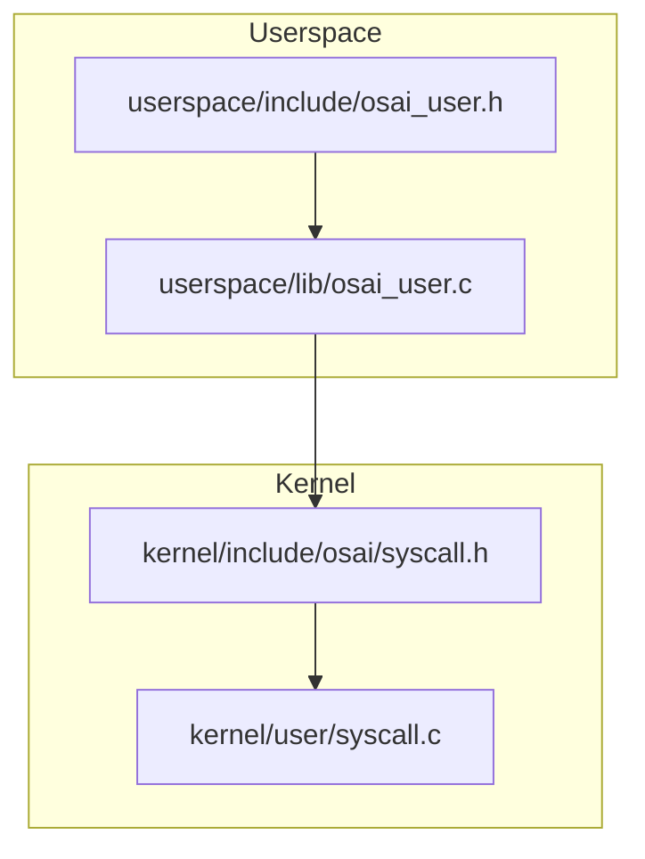
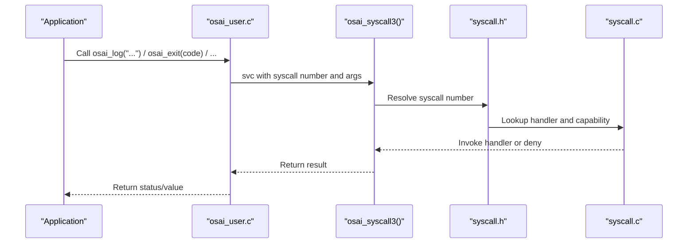
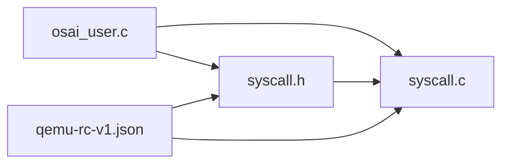

# Utility Functions

<cite>
**Referenced Files in This Document**
- [osai_user.h](file://userspace/include/osai_user.h)
- [osai_user.c](file://userspace/lib/osai_user.c)
- [syscall.h](file://kernel/include/osai/syscall.h)
- [syscall.c](file://kernel/user/syscall.c)
- [qemu-rc-v1.json](file://contracts/qemu-rc-v1.json)
- [systest.c](file://userspace/apps/systest.c)
</cite>

## Table of Contents
1. [Introduction](#introduction)
2. [Project Structure](#project-structure)
3. [Core Components](#core-components)
4. [Architecture Overview](#architecture-overview)
5. [Detailed Component Analysis](#detailed-component-analysis)
6. [Dependency Analysis](#dependency-analysis)
7. [Performance Considerations](#performance-considerations)
8. [Security Considerations](#security-considerations)
9. [Troubleshooting Guide](#troubleshooting-guide)
10. [Conclusion](#conclusion)

## Introduction
This document describes OSAI’s userspace utility and helper functions that provide logging, timing, process control, system control, string manipulation, buffer operations, and file I/O helpers. It explains the purpose, parameters, usage patterns, performance characteristics, and security considerations for each utility function. The goal is to help developers use these utilities safely and efficiently across applications and services.

## Project Structure
The utility functions live in the userspace library and are thin wrappers around kernel-provided system calls. They are declared in the userspace header and implemented in the userspace library. Kernel-side syscall registration and capability enforcement are defined in kernel headers and syscall tables.

**Diagram sources**
- [osai_user.h](file://userspace/include/osai_user.h)
- [osai_user.c](file://userspace/lib/osai_user.c)
- [syscall.h](file://kernel/include/osai/syscall.h)
- [syscall.c](file://kernel/user/syscall.c)

**Section sources**
- [osai_user.h](file://userspace/include/osai_user.h)
- [osai_user.c](file://userspace/lib/osai_user.c)
- [syscall.h](file://kernel/include/osai/syscall.h)
- [syscall.c](file://kernel/user/syscall.c)

## Core Components
This section summarizes the primary utility functions documented in this guide, grouped by category.

- Logging
  - osai_log: Logs a null-terminated string via a kernel log syscall.
  - osai_log_u64: Formats a line with a prefix, a decimal u64 value, and a suffix, then logs it.

- Timing
  - osai_clock_nanos: Returns monotonic time in nanoseconds via a kernel clock syscall.

- Process Control
  - osai_exit: Terminates the current process and enters a low-power wait loop.

- System Control
  - osai_osctl: Sends a command string to the kernel for system-level actions.

- String Manipulation
  - osai_strlen: Computes length of a null-terminated string (with null-pointer guard).
  - osai_append_cstr: Safely appends a null-terminated string into a bounded buffer with offset tracking.
  - osai_append_u64: Converts a u64 to ASCII and appends it into a bounded buffer with offset tracking.

- Buffer Operations
  - osai_memzero: Clears memory by setting bytes to zero.

- File I/O Helpers
  - osai_write_file: Opens, writes, and closes a file in one call.
  - osai_read_file: Opens, reads up to a given size, closes, and ensures null termination if applicable.

Usage examples and best practices are included per function below.

**Section sources**
- [osai_user.h](file://userspace/include/osai_user.h)
- [osai_user.c](file://userspace/lib/osai_user.c)

## Architecture Overview
The userspace utilities call into the kernel via system calls. Each syscall is registered with a numeric identifier and a capability mask. The kernel enforces capability checks before executing handlers.

**Diagram sources**
- [osai_user.c](file://userspace/lib/osai_user.c)
- [syscall.h](file://kernel/include/osai/syscall.h)
- [syscall.c](file://kernel/user/syscall.c)

## Detailed Component Analysis

### Logging Utilities

#### osai_log
- Purpose: Log a null-terminated string to the kernel log facility.
- Parameters:
  - text: pointer to a null-terminated C string; may be null (no-op).
- Behavior:
  - Calls osai_strlen to compute length.
  - Invokes the log syscall with the string pointer and length.
- Usage example:
  - See [systest.c](file://userspace/apps/systest.c) for a typical call site pattern.
- Best practices:
  - Ensure the string is null-terminated.
  - Avoid passing null pointers; the function handles null gracefully.
- Complexity: O(n) where n is the string length.
- Safety: No dynamic allocation; safe for small messages.

**Section sources**
- [osai_user.c](file://userspace/lib/osai_user.c)
- [osai_user.h](file://userspace/include/osai_user.h)
- [systest.c](file://userspace/apps/systest.c)

#### osai_log_u64
- Purpose: Format and log a line composed of a prefix, a u64 value, and a suffix.
- Parameters:
  - prefix: C string prefix.
  - value: 64-bit unsigned integer to format.
  - suffix: C string suffix.
- Behavior:
  - Allocates an internal buffer and offset.
  - Clears the buffer.
  - Appends prefix, value, and suffix using helper appenders.
  - Logs the resulting string.
- Usage example:
  - See [systest.c](file://userspace/apps/systest.c) for a typical call site pattern.
- Best practices:
  - Keep total formatted length within the internal buffer capacity.
  - Ensure prefix and suffix are null-terminated.
- Complexity: O(k) where k is the number of digits plus prefix/suffix lengths.
- Safety: Uses bounded buffers and offset tracking to prevent overruns.

**Section sources**
- [osai_user.c](file://userspace/lib/osai_user.c)
- [osai_user.h](file://userspace/include/osai_user.h)
- [systest.c](file://userspace/apps/systest.c)

### Timing Utility

#### osai_clock_nanos
- Purpose: Obtain monotonic time in nanoseconds.
- Parameters: None.
- Behavior:
  - Invokes the clock_nanos syscall and returns the result.
- Usage example:
  - Use to measure elapsed time around critical sections.
- Best practices:
  - Treat return values as opaque; compare differences rather than absolute values.
- Complexity: O(1).
- Safety: No side effects; safe to call frequently.

**Section sources**
- [osai_user.c](file://userspace/lib/osai_user.c)
- [osai_user.h](file://userspace/include/osai_user.h)

### Process Control

#### osai_exit
- Purpose: Terminate the current process.
- Parameters:
  - code: exit status cast to an unsigned 32-bit value.
- Behavior:
  - Invokes the exit syscall with the code.
  - Enters a low-power wait loop afterward.
- Usage example:
  - Call after cleanup or error handling.
- Best practices:
  - Prefer explicit cleanup before exit.
  - Use non-zero codes to signal failure.
- Complexity: O(1).
- Safety: Does not return; ensures the process stops.

**Section sources**
- [osai_user.c](file://userspace/lib/osai_user.c)
- [osai_user.h](file://userspace/include/osai_user.h)

### System Control

#### osai_osctl
- Purpose: Send a command string to the kernel for system-level actions.
- Parameters:
  - command: null-terminated command string.
- Behavior:
  - Computes length via osai_strlen.
  - Invokes the osctl syscall.
  - Returns 0 on success, -1 on failure.
- Usage example:
  - See [systest.c](file://userspace/apps/systest.c) for a typical call site pattern.
- Best practices:
  - Validate command strings against allowed set.
  - Avoid passing untrusted input without prior sanitization.
- Complexity: O(n) for string length.
- Safety: Kernel validates commands; callers should constrain input.

**Section sources**
- [osai_user.c](file://userspace/lib/osai_user.c)
- [osai_user.h](file://userspace/include/osai_user.h)
- [systest.c](file://userspace/apps/systest.c)

### String Manipulation Utilities

#### osai_strlen
- Purpose: Compute the length of a null-terminated string.
- Parameters:
  - text: pointer to a C string or null.
- Behavior:
  - Returns 0 for null input.
  - Iterates until null terminator to count characters.
- Usage example:
  - Used by logging and syscall wrappers to pass string lengths.
- Best practices:
  - Ensure the string is null-terminated.
  - Do not pass raw memory without null terminators.
- Complexity: O(n).
- Safety: No bounds checking; caller must ensure validity.

**Section sources**
- [osai_user.c](file://userspace/lib/osai_user.c)
- [osai_user.h](file://userspace/include/osai_user.h)

#### osai_append_cstr
- Purpose: Append a null-terminated string into a bounded buffer with offset tracking.
- Parameters:
  - buffer: destination buffer.
  - capacity: maximum number of bytes the buffer can hold.
  - offset: pointer to current offset; updated on successful append.
  - text: null-terminated string to append.
- Behavior:
  - Skips if any pointer is null or capacity is zero.
  - Appends characters while avoiding overflow and ensuring null termination.
- Usage example:
  - Used internally by osai_log_u64 to build formatted lines.
- Best practices:
  - Initialize offset to zero before first append.
  - Ensure capacity excludes the null terminator slot.
- Complexity: O(n) for appended string length.
- Safety: Prevents buffer overruns; caller must manage offsets.

**Section sources**
- [osai_user.c](file://userspace/lib/osai_user.c)
- [osai_user.h](file://userspace/include/osai_user.h)

#### osai_append_u64
- Purpose: Convert a u64 to ASCII and append it into a bounded buffer with offset tracking.
- Parameters:
  - buffer: destination buffer.
  - capacity: maximum number of bytes the buffer can hold.
  - offset: pointer to current offset; updated on successful append.
  - value: 64-bit unsigned integer to convert and append.
- Behavior:
  - Handles zero as a special case.
  - Extracts digits in reverse order and appends them.
- Usage example:
  - Used internally by osai_log_u64 to embed numeric values.
- Best practices:
  - Ensure sufficient capacity for the maximum digit count plus terminator.
  - Combine with osai_append_cstr for composite formatting.
- Complexity: O(k) where k is the number of digits.
- Safety: Prevents overflows via capacity checks.

**Section sources**
- [osai_user.c](file://userspace/lib/osai_user.c)
- [osai_user.h](file://userspace/include/osai_user.h)

### Buffer Operations

#### osai_memzero
- Purpose: Clear memory by setting bytes to zero.
- Parameters:
  - buffer: pointer to memory region.
  - size: number of bytes to zero out.
- Behavior:
  - Iterates over the region and sets each byte to zero.
- Usage example:
  - Used to initialize buffers before sensitive operations.
- Best practices:
  - Prefer memset for constant-time clearing; use memzero for explicit zeroing semantics.
- Complexity: O(n).
- Safety: Safe for any valid buffer and size.

**Section sources**
- [osai_user.c](file://userspace/lib/osai_user.c)
- [osai_user.h](file://userspace/include/osai_user.h)

### File I/O Helpers

#### osai_write_file
- Purpose: Open, write, and close a file in one call.
- Parameters:
  - path: target file path.
  - content: null-terminated string to write.
- Behavior:
  - Opens with read/write flags.
  - Writes the content.
  - Closes the file descriptor.
- Usage example:
  - See [systest.c](file://userspace/apps/systest.c) for a typical call site pattern.
- Best practices:
  - Ensure the path exists and permissions allow writing.
  - Use appropriate filesystem paths and avoid sensitive locations.
- Complexity: O(n) for the content length.
- Safety: Handles errors by returning negative values; caller should check return codes.

**Section sources**
- [osai_user.c](file://userspace/lib/osai_user.c)
- [osai_user.h](file://userspace/include/osai_user.h)
- [systest.c](file://userspace/apps/systest.c)

#### osai_read_file
- Purpose: Open, read up to a given size, close, and ensure null termination if applicable.
- Parameters:
  - path: source file path.
  - buffer: destination buffer.
  - buffer_size: maximum number of bytes to read.
- Behavior:
  - Opens with read-only flags.
  - Reads up to buffer_size bytes.
  - Closes the file descriptor.
  - Null-terminates if fewer bytes were read than buffer_size.
- Usage example:
  - See [systest.c](file://userspace/apps/systest.c) for a typical call site pattern.
- Best practices:
  - Initialize buffer before reading.
  - Check return value for success and adjust downstream logic accordingly.
- Complexity: O(n) for the number of bytes read.
- Safety: Ensures null termination when feasible; caller must manage buffer capacity.

**Section sources**
- [osai_user.c](file://userspace/lib/osai_user.c)
- [osai_user.h](file://userspace/include/osai_user.h)
- [systest.c](file://userspace/apps/systest.c)

## Dependency Analysis
The userspace utilities depend on syscall identifiers and capability masks defined in kernel headers. The syscall table registers handlers and required capabilities. Contract files enumerate syscalls and capabilities for ABI verification.

**Diagram sources**
- [osai_user.c](file://userspace/lib/osai_user.c)
- [syscall.h](file://kernel/include/osai/syscall.h)
- [syscall.c](file://kernel/user/syscall.c)
- [qemu-rc-v1.json](file://contracts/qemu-rc-v1.json)

**Section sources**
- [osai_user.c](file://userspace/lib/osai_user.c)
- [syscall.h](file://kernel/include/osai/syscall.h)
- [syscall.c](file://kernel/user/syscall.c)
- [qemu-rc-v1.json](file://contracts/qemu-rc-v1.json)

## Performance Considerations
- Logging overhead:
  - osai_log and osai_log_u64 involve syscall overhead and string computations proportional to input sizes.
  - Minimize frequent logging in tight loops; batch messages when possible.
- Timing:
  - osai_clock_nanos is O(1); suitable for high-frequency measurements.
- String operations:
  - osai_strlen, osai_append_cstr, and osai_append_u64 are linear in their input sizes.
  - Reuse buffers and offsets to reduce allocations.
- File I/O:
  - osai_write_file and osai_read_file perform open/read/close syscalls per call.
  - For repeated operations, consider caching or batching to reduce syscall frequency.

[No sources needed since this section provides general guidance]

## Security Considerations
- Capability enforcement:
  - Syscalls are registered with capability masks; kernel enforces access control before invoking handlers.
  - Ensure your application has the required capabilities for the targeted syscalls.
- Input validation:
  - Always null-terminate strings passed to logging and formatting functions.
  - Validate buffer capacities and offsets to prevent overruns.
- Sensitive data:
  - Use osai_memzero to clear sensitive buffers after use.
  - Avoid logging secrets; sanitize logs before emitting.
- Command safety:
  - osai_osctl accepts arbitrary command strings; restrict allowed commands and sanitize inputs.
- File paths:
  - Validate paths and permissions; avoid writing to protected locations.

**Section sources**
- [syscall.h](file://kernel/include/osai/syscall.h)
- [syscall.c](file://kernel/user/syscall.c)
- [qemu-rc-v1.json](file://contracts/qemu-rc-v1.json)

## Troubleshooting Guide
- osai_log returns immediately without error propagation; if nothing appears in logs, verify:
  - The kernel log is enabled and accessible.
  - The string is null-terminated.
- osai_log_u64 failures:
  - Ensure the internal buffer capacity is sufficient for the combined prefix, digits, and suffix.
  - Verify offset initialization and capacity accounting.
- osai_exit:
  - After calling, the process enters a wait loop; confirm cleanup occurred before exit.
- osai_osctl:
  - Returns -1 on failure; inspect kernel-side command handling for accepted commands.
- osai_write_file / osai_read_file:
  - Negative return indicates failure; check file existence, permissions, and path correctness.
  - For reads, ensure buffer_size accounts for the null terminator when treating as a C string.

**Section sources**
- [osai_user.c](file://userspace/lib/osai_user.c)
- [osai_user.h](file://userspace/include/osai_user.h)
- [systest.c](file://userspace/apps/systest.c)

## Conclusion
The OSAI utility functions provide a concise, safe, and efficient set of helpers for logging, timing, process control, system control, string manipulation, buffer operations, and file I/O. By following the usage guidelines, performance tips, and security recommendations in this document, developers can integrate these utilities reliably across applications and services.