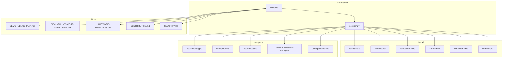
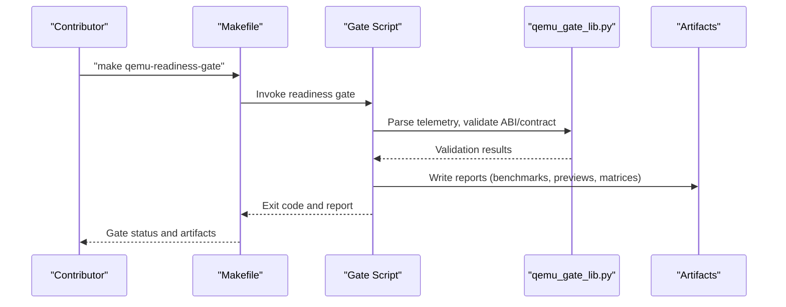
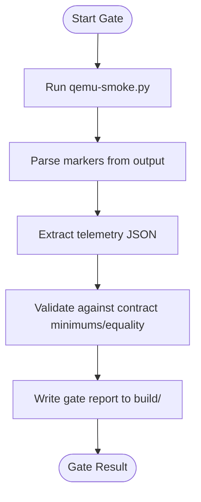
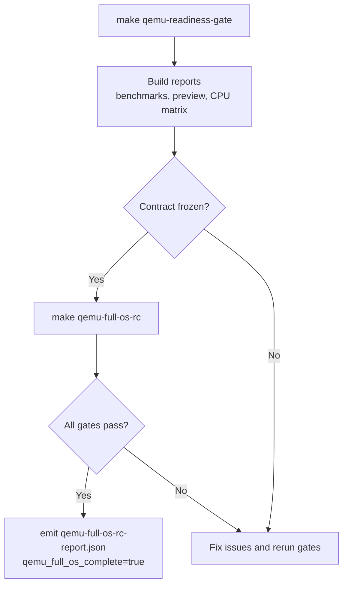
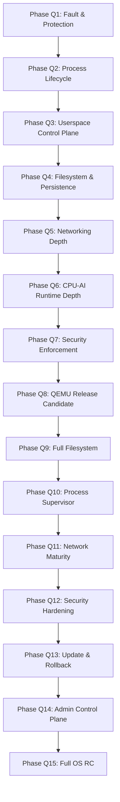
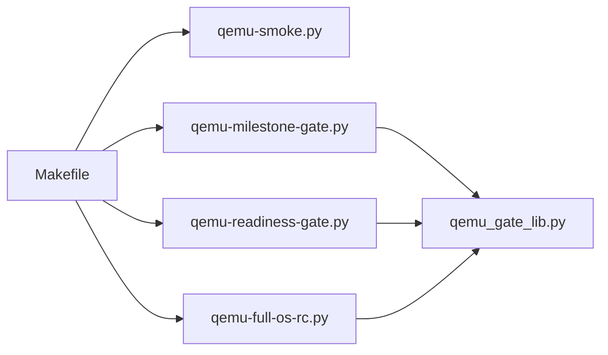

# Contributing

<cite>
**Referenced Files in This Document**
- [CONTRIBUTING.md](file://CONTRIBUTING.md)
- [README.md](file://README.md)
- [HARDWARE-READINESS.md](file://HARDWARE-READINESS.md)
- [SECURITY.md](file://SECURITY.md)
- [Makefile](file://Makefile)
- [scripts/qemu_gate_lib.py](file://scripts/qemu_gate_lib.py)
- [scripts/qemu-milestone-gate.py](file://scripts/qemu-milestone-gate.py)
- [scripts/qemu-100-gate.py](file://scripts/qemu-100-gate.py)
- [scripts/qemu-readiness-gate.py](file://scripts/qemu-readiness-gate.py)
- [QEMU-FULL-OS-PLAN.md](file://QEMU-FULL-OS-PLAN.md)
- [QEMU-FULL-OS-CORE-WORKDOWN.md](file://QEMU-FULL-OS-CORE-WORKDOWN.md)
- [requirements-dev.txt](file://requirements-dev.txt)
</cite>

## Table of Contents
1. [Introduction](#introduction)
2. [Project Structure](#project-structure)
3. [Core Components](#core-components)
4. [Architecture Overview](#architecture-overview)
5. [Detailed Component Analysis](#detailed-component-analysis)
6. [Dependency Analysis](#dependency-analysis)
7. [Performance Considerations](#performance-considerations)
8. [Troubleshooting Guide](#troubleshooting-guide)
9. [Conclusion](#conclusion)
10. [Appendices](#appendices)

## Introduction
This document explains how to contribute effectively to OSAI. It consolidates development guidelines, testing and validation requirements, workflow practices, hardware readiness criteria, roadmap and feature cycles, and community engagement practices. It also covers security and licensing considerations to help contributors ship reliable, secure, and well-documented changes aligned with the project’s design goals.

## Project Structure
OSAI is organized into a kernel, userspace, scripts, and documentation assets. The primary development entry points are:
- Kernel and architecture-specific sources under kernel/
- Userspace programs and libraries under userspace/
- Automated validation and build orchestration via Makefile targets and Python scripts under scripts/
- Planning and readiness documentation under QEMU-FULL-OS-PLAN.md, QEMU-FULL-OS-CORE-WORKDOWN.md, HARDWARE-READINESS.md, and CONTRIBUTING.md
- Security guidance under SECURITY.md

**Diagram sources**
- [Makefile:1-135](file://Makefile#L1-L135)
- [QEMU-FULL-OS-PLAN.md:1-168](file://QEMU-FULL-OS-PLAN.md#L1-L168)
- [QEMU-FULL-OS-CORE-WORKDOWN.md:1-368](file://QEMU-FULL-OS-CORE-WORKDOWN.md#L1-L368)
- [HARDWARE-READINESS.md:1-135](file://HARDWARE-READINESS.md#L1-L135)
- [CONTRIBUTING.md:1-17](file://CONTRIBUTING.md#L1-L17)
- [SECURITY.md:1-18](file://SECURITY.md#L1-L18)

**Section sources**
- [Makefile:1-135](file://Makefile#L1-L135)
- [README.md:1-86](file://README.md#L1-L86)

## Core Components
- Contribution rules and workflow: One-task-per-commit, run relevant tests and gates, preserve boot logs and benchmarks, update docs when architecture/APIs change, avoid unmeasured performance claims, and protect secrets.
- Validation pipeline: Makefile orchestrates QEMU gates, smoke, matrices, and release candidates. Scripts implement gate logic, ABI/contract validation, and telemetry parsing.
- Hardware readiness: Gates define correctness-only contracts and freeze ABIs and formats before Intel Desktop bring-up.
- Roadmap and feature cycles: The QEMU Full OS plan and core workdown enumerate phases, milestones, and completion criteria.

**Section sources**
- [CONTRIBUTING.md:1-17](file://CONTRIBUTING.md#L1-L17)
- [Makefile:1-135](file://Makefile#L1-L135)
- [HARDWARE-READINESS.md:1-135](file://HARDWARE-READINESS.md#L1-L135)
- [QEMU-FULL-OS-PLAN.md:1-168](file://QEMU-FULL-OS-PLAN.md#L1-L168)
- [QEMU-FULL-OS-CORE-WORKDOWN.md:1-368](file://QEMU-FULL-OS-CORE-WORKDOWN.md#L1-L368)

## Architecture Overview
The contribution workflow centers on local QEMU validation gates that produce structured reports and enforce frozen contracts. Contributors run targeted gates, inspect artifacts, and iterate until gates pass. The Makefile exposes a consistent CLI for building images, running smoke tests, executing milestone gates, and validating contracts.

**Diagram sources**
- [Makefile:127-131](file://Makefile#L127-L131)
- [scripts/qemu-readiness-gate.py:460-535](file://scripts/qemu-readiness-gate.py#L460-L535)
- [scripts/qemu_gate_lib.py:16-127](file://scripts/qemu_gate_lib.py#L16-L127)

**Section sources**
- [Makefile:1-135](file://Makefile#L1-L135)
- [scripts/qemu-readiness-gate.py:1-535](file://scripts/qemu-readiness-gate.py#L1-L535)
- [scripts/qemu_gate_lib.py:1-127](file://scripts/qemu_gate_lib.py#L1-L127)

## Detailed Component Analysis

### Contribution Rules and Workflow
- One task per commit or pull request.
- Run relevant tests, build checks, or QEMU boot commands before submitting.
- Keep boot logs and benchmark outputs when they support the change.
- Update the GitHub Wiki or repository notes when code changes alter architecture, build steps, APIs, or benchmark methodology.
- Do not make benchmark claims without measured data and a documented baseline.
- Do not commit credentials, tokens, keys, passwords, or secret benchmark data.

**Section sources**
- [CONTRIBUTING.md:5-16](file://CONTRIBUTING.md#L5-L16)

### Testing and Validation Pipeline
- Makefile targets orchestrate smoke, gates, matrices, and release candidates.
- Gate scripts validate telemetry, ABI, and contract compliance, and write structured reports.
- The gate library provides helpers for running commands, parsing telemetry, and validating contracts.

**Diagram sources**
- [scripts/qemu-milestone-gate.py:215-274](file://scripts/qemu-milestone-gate.py#L215-L274)
- [scripts/qemu_gate_lib.py:49-127](file://scripts/qemu_gate_lib.py#L49-L127)

**Section sources**
- [Makefile:31-131](file://Makefile#L31-L131)
- [scripts/qemu-milestone-gate.py:1-274](file://scripts/qemu-milestone-gate.py#L1-L274)
- [scripts/qemu_gate_lib.py:1-127](file://scripts/qemu_gate_lib.py#L1-L127)

### Hardware Readiness and Release Candidate Gates
- Milestone 33: QEMU readiness gate freezes contracts and produces readiness, benchmark, preview, and CPU matrix reports.
- Milestone 42: Full OS release candidate gate validates ABI/format contracts against source and marks completion.
- Post-51: Additional hardening gates validate regression suites, fault injection, ABI contracts, boot loops, and developer UX.

**Diagram sources**
- [HARDWARE-READINESS.md:28-50](file://HARDWARE-READINESS.md#L28-L50)
- [scripts/qemu-readiness-gate.py:460-535](file://scripts/qemu-readiness-gate.py#L460-L535)
- [scripts/qemu-100-gate.py:22-55](file://scripts/qemu-100-gate.py#L22-L55)

**Section sources**
- [HARDWARE-READINESS.md:1-135](file://HARDWARE-READINESS.md#L1-L135)
- [scripts/qemu-readiness-gate.py:1-535](file://scripts/qemu-readiness-gate.py#L1-L535)
- [scripts/qemu-100-gate.py:1-55](file://scripts/qemu-100-gate.py#L1-L55)

### QEMU Full OS Plan and Feature Cycles
- The plan outlines phases from fault and protection gates to full OS release candidate.
- The core workdown enumerates required tasks per phase and completion criteria.
- Milestones 34–42 and 52–59 correspond to specific gates and deliverables.

**Diagram sources**
- [QEMU-FULL-OS-PLAN.md:58-168](file://QEMU-FULL-OS-PLAN.md#L58-L168)
- [QEMU-FULL-OS-CORE-WORKDOWN.md:7-368](file://QEMU-FULL-OS-CORE-WORKDOWN.md#L7-L368)

**Section sources**
- [QEMU-FULL-OS-PLAN.md:1-168](file://QEMU-FULL-OS-PLAN.md#L1-L168)
- [QEMU-FULL-OS-CORE-WORKDOWN.md:1-368](file://QEMU-FULL-OS-CORE-WORKDOWN.md#L1-L368)

### Security and Secret Handling
- Do not commit secrets; revoke and rotate if exposed.
- Security model emphasizes capability-based policies, sandboxing, signed updates, and SSH-only administration.
- Vulnerability reporting during design/development uses repository issues/PRs.

**Section sources**
- [SECURITY.md:1-18](file://SECURITY.md#L1-L18)
- [CONTRIBUTING.md:9-12](file://CONTRIBUTING.md#L9-L12)

### Licensing Considerations
- License is to be decided; contributions should align with the eventual license terms.

**Section sources**
- [README.md:83-86](file://README.md#L83-L86)

## Dependency Analysis
The Makefile defines the primary entry points and links them to Python gate scripts. Gate scripts depend on a shared library for common validations and telemetry parsing.

**Diagram sources**
- [Makefile:31-131](file://Makefile#L31-L131)
- [scripts/qemu_gate_lib.py:1-127](file://scripts/qemu_gate_lib.py#L1-L127)
- [scripts/qemu-milestone-gate.py:1-274](file://scripts/qemu-milestone-gate.py#L1-L274)
- [scripts/qemu-readiness-gate.py:1-535](file://scripts/qemu-readiness-gate.py#L1-L535)

**Section sources**
- [Makefile:1-135](file://Makefile#L1-L135)
- [scripts/qemu_gate_lib.py:1-127](file://scripts/qemu_gate_lib.py#L1-L127)

## Performance Considerations
- Benchmarks are correctness-only and must not be presented as hardware performance claims.
- Performance claims are explicitly disallowed until hardware targets are reached and validated baselines are established.
- Contract scopes and gate statuses enforce “no performance claims” during QEMU-only phases.

**Section sources**
- [HARDWARE-READINESS.md:25-26](file://HARDWARE-READNESS.md#L25-L26)
- [HARDWARE-READINESS.md:83-95](file://HARDWARE-READINESS.md#L83-L95)
- [scripts/qemu-readiness-gate.py:237-243](file://scripts/qemu-readiness-gate.py#L237-L243)

## Troubleshooting Guide
Common issues and remedies:
- Gate failures due to missing artifacts or invalid JSON: ensure prerequisites (images, contracts) are built and intact.
- Telemetry mismatch: verify that the kernel/userspace emits expected telemetry and that gate scripts parse the last telemetry marker correctly.
- ABI/format mismatches: confirm syscall/capability definitions match the frozen contract.
- SSH bridge access: use the documented SSH bridge target to access the QEMU environment.

**Section sources**
- [scripts/qemu-readiness-gate.py:215-225](file://scripts/qemu-readiness-gate.py#L215-L225)
- [scripts/qemu_gate_lib.py:49-58](file://scripts/qemu_gate_lib.py#L49-L58)
- [README.md:70-75](file://README.md#L70-L75)

## Conclusion
Contributors should focus on small, reviewable changes tied to the current implementation plan, run the appropriate QEMU gates and smoke tests, preserve supporting artifacts, and update documentation when architecture or APIs change. Adhering to security and secret-handling practices ensures safe collaboration. The QEMU Full OS plan and core workdown provide a clear roadmap for feature development cycles and completion criteria.

## Appendices

### A. Contribution Checklist
- One task per commit or PR.
- Run relevant tests/gates locally before submitting.
- Attach boot logs and benchmark outputs when relevant.
- Update wiki/docs when architecture/APIs change.
- Do not publish performance claims without measured data and documented baselines.
- Protect secrets and revoke/rotate if exposed.

**Section sources**
- [CONTRIBUTING.md:7-16](file://CONTRIBUTING.md#L7-L16)

### B. Local Development Commands
- Build and run QEMU smoke: make qemu-smoke
- Run milestone gates: make qemu-<milestone>-gate
- Run readiness gate: make qemu-readiness-gate
- Run full OS release candidate: make qemu-full-os-rc
- SSH bridge to QEMU: make osai-ssh-bridge

**Section sources**
- [Makefile:31-131](file://Makefile#L31-L131)
- [README.md:63-75](file://README.md#L63-L75)

### C. Platform Support Expectations
- Implementation order: QEMU on macOS → Intel Desktop → Intel Xeon → ARM/NVIDIA N1X-class SoCs.
- No GPU or vendor accelerator dependencies; CPU-only AI runtime is the baseline.

**Section sources**
- [README.md:39-49](file://README.md#L39-L49)

### D. Community Engagement Practices
- Use the GitHub Wiki for design and planning.
- Engage via issues and pull requests for design concerns and proposals.
- Follow the Codex Work Packages wiki for operational task lists.

**Section sources**
- [README.md:50-61](file://README.md#L50-L61)
- [CONTRIBUTING.md:14-16](file://CONTRIBUTING.md#L14-L16)