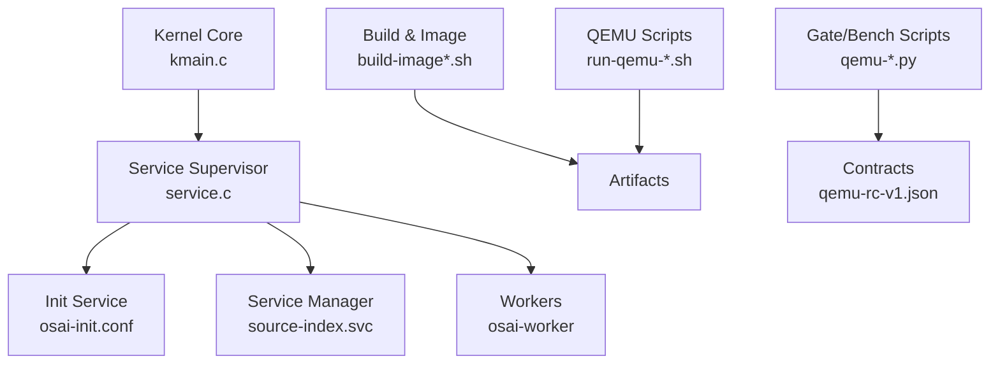
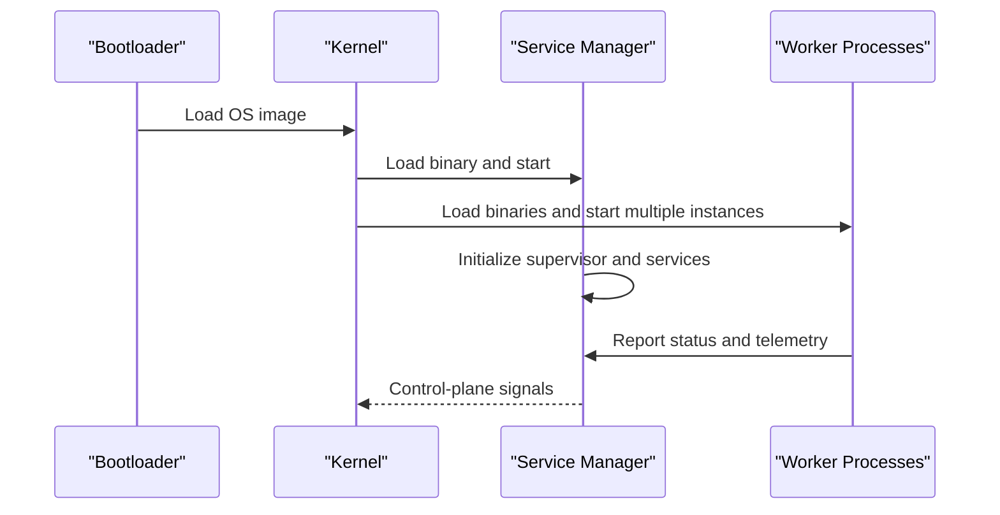
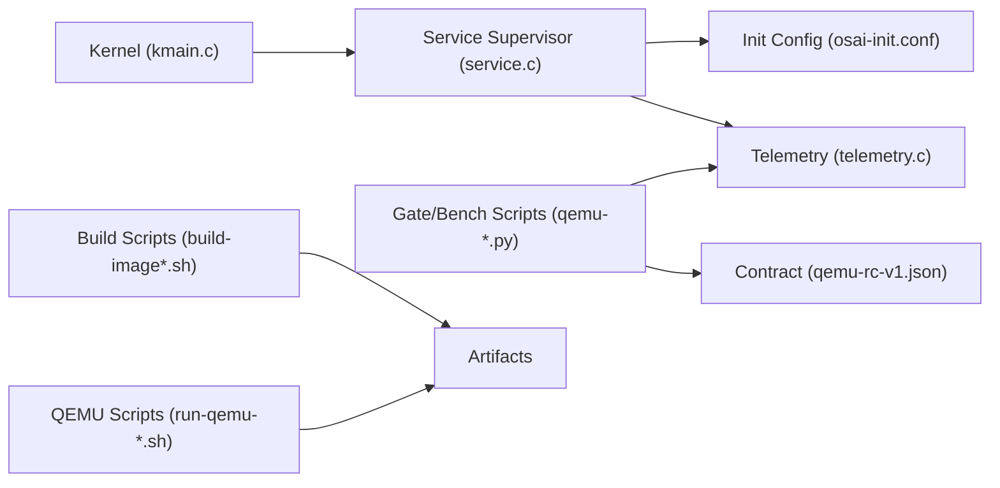
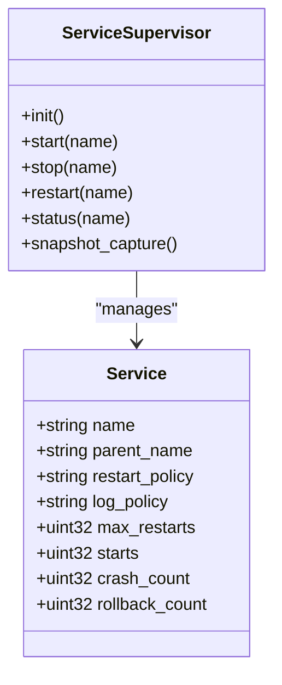
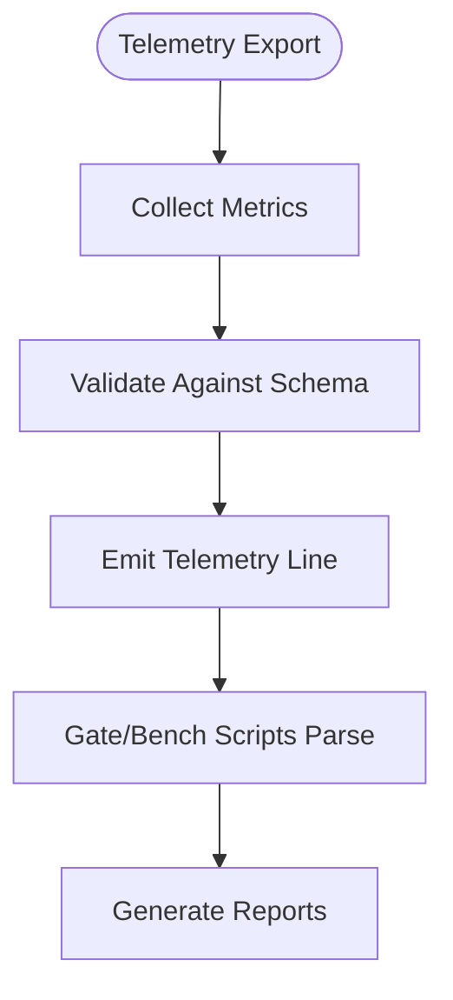

# Deployment and Operations

<cite>
**Referenced Files in This Document**
- [README.md](file://README.md)
- [Makefile](file://Makefile)
- [scripts/build-image.sh](file://scripts/build-image.sh)
- [scripts/build-image-x86_64.sh](file://scripts/build-image-x86_64.sh)
- [scripts/create-initfs.py](file://scripts/create-initfs.py)
- [scripts/run-qemu-aarch64.sh](file://scripts/run-qemu-aarch64.sh)
- [scripts/run-qemu-x86_64.sh](file://scripts/run-qemu-x86_64.sh)
- [userspace/init/osai-init.conf](file://userspace/init/osai-init.conf)
- [userspace/service-manager/source-index.svc](file://userspace/service-manager/source-index.svc)
- [kernel/user/service.c](file://kernel/user/service.c)
- [kernel/core/kmain.c](file://kernel/core/kmain.c)
- [kernel/core/telemetry.c](file://kernel/core/telemetry.c)
- [scripts/qemu-smoke.py](file://scripts/qemu-smoke.py)
- [scripts/qemu-benchmark.py](file://scripts/qemu-benchmark.py)
- [scripts/qemu-readiness-gate.py](file://scripts/qemu-readiness-gate.py)
- [scripts/qemu_gate_lib.py](file://scripts/qemu_gate_lib.py)
- [scripts/intel-desktop-gate.py](file://scripts/intel-desktop-gate.py)
- [contracts/qemu-rc-v1.json](file://contracts/qemu-rc-v1.json)
- [SECURITY.md](file://SECURITY.md)
</cite>

## Table of Contents
1. [Introduction](#introduction)
2. [Project Structure](#project-structure)
3. [Core Components](#core-components)
4. [Architecture Overview](#architecture-overview)
5. [Detailed Component Analysis](#detailed-component-analysis)
6. [Dependency Analysis](#dependency-analysis)
7. [Performance Considerations](#performance-considerations)
8. [Troubleshooting Guide](#troubleshooting-guide)
9. [Conclusion](#conclusion)
10. [Appendices](#appendices)

## Introduction
This document provides comprehensive deployment and operations guidance for the OSAI system. It covers platform-specific installation procedures for QEMU virtualization, Intel Desktop, and ARM systems; service configuration via osai-init.conf; service manager and worker process lifecycle; monitoring, logging, and telemetry; maintenance procedures including updates and rollbacks; operational troubleshooting; performance optimization; capacity planning; security operations; backup and disaster recovery.

## Project Structure
OSAI is organized into kernel, userspace, scripts, and contracts. Key areas for deployment and operations:
- Kernel: core initialization, service supervision, telemetry, and user-space integration
- Userspace: init configuration, service manager, and worker binaries
- Scripts: build, image creation, QEMU orchestration, and gate/bench automation
- Contracts: QEMU readiness contract for automated validation

**Diagram sources**
- [kernel/core/kmain.c:176-200](file://kernel/core/kmain.c#L176-L200)
- [kernel/user/service.c:778-822](file://kernel/user/service.c#L778-L822)
- [userspace/init/osai-init.conf](file://userspace/init/osai-init.conf)
- [userspace/service-manager/source-index.svc](file://userspace/service-manager/source-index.svc)
- [scripts/build-image.sh](file://scripts/build-image.sh)
- [scripts/run-qemu-aarch64.sh](file://scripts/run-qemu-aarch64.sh)
- [scripts/run-qemu-x86_64.sh](file://scripts/run-qemu-x86_64.sh)
- [contracts/qemu-rc-v1.json](file://contracts/qemu-rc-v1.json)

**Section sources**
- [README.md](file://README.md)
- [Makefile](file://Makefile)

## Core Components
- Service supervisor and lifecycle: initializes built-in services, manages restart/log policies, and exposes start/stop/restart/status APIs
- Init configuration: defines service entries and policies loaded during early boot
- Service manager and workers: control plane and compute workers started by the kernel
- Telemetry: exports metrics for monitoring and validation
- Gate/bench scripts: automate smoke, benchmark, readiness checks, and contract validation

**Section sources**
- [kernel/user/service.c:156-195](file://kernel/user/service.c#L156-L195)
- [kernel/user/service.c:327-353](file://kernel/user/service.c#L327-L353)
- [kernel/user/service.c:778-822](file://kernel/user/service.c#L778-L822)
- [userspace/init/osai-init.conf](file://userspace/init/osai-init.conf)
- [userspace/service-manager/source-index.svc](file://userspace/service-manager/source-index.svc)
- [kernel/core/telemetry.c:96-119](file://kernel/core/telemetry.c#L96-L119)
- [scripts/qemu-smoke.py:297-336](file://scripts/qemu-smoke.py#L297-L336)
- [scripts/qemu-benchmark.py:161-189](file://scripts/qemu-benchmark.py#L161-L189)
- [scripts/qemu-readiness-gate.py:77-117](file://scripts/qemu-readiness-gate.py#L77-L117)
- [scripts/qemu_gate_lib.py:45-80](file://scripts/qemu_gate_lib.py#L45-L80)

## Architecture Overview
The system boots into the kernel, which loads and starts the service manager and worker processes. The service supervisor enforces policies and maintains state for built-in services. Telemetry is exported for monitoring. Gate/bench scripts validate readiness and performance against a contract.

**Diagram sources**
- [kernel/core/kmain.c:176-200](file://kernel/core/kmain.c#L176-L200)
- [kernel/user/service.c:778-822](file://kernel/user/service.c#L778-L822)
- [kernel/core/telemetry.c:96-119](file://kernel/core/telemetry.c#L96-L119)

## Detailed Component Analysis

### Service Configuration Management (osai-init.conf)
- Purpose: Defines initial services, restart policy, and logging policy for built-in services
- Policy fields validated by the supervisor:
  - Restart policy: accepts specific policy values and snapshots configuration
  - Log policy: serial or off
  - Max restarts: numeric limit applied during lifecycle
- Supervisor captures snapshots of policies and logs configuration events

Operational guidance:
- Edit osai-init.conf to adjust restart/log behavior for built-in services
- Apply changes by rebuilding artifacts and rebooting
- Monitor service transitions and restarts via telemetry

**Section sources**
- [userspace/init/osai-init.conf](file://userspace/init/osai-init.conf)
- [kernel/user/service.c:327-353](file://kernel/user/service.c#L327-L353)
- [kernel/user/service.c:355-367](file://kernel/user/service.c#L355-L367)
- [kernel/user/service.c:778-798](file://kernel/user/service.c#L778-L798)

### Service Manager and Worker Process Lifecycle
- Kernel loads and starts:
  - Service manager with administrative capabilities
  - Multiple worker processes with restricted capabilities
- Supervisor supports:
  - Start/stop/restart/status operations
  - Built-in services: init, manager, worker
  - Child service support and descriptors

Operational guidance:
- Use service commands to manage built-in services
- Workers are auto-started; monitor their lifecycle via telemetry
- Snapshot captured for auditing policy changes

**Section sources**
- [kernel/core/kmain.c:176-200](file://kernel/core/kmain.c#L176-L200)
- [kernel/user/service.c:181-195](file://kernel/user/service.c#L181-L195)
- [kernel/user/service.c:808-822](file://kernel/user/service.c#L808-L822)

### Monitoring, Logging, and Telemetry
- Telemetry exports counts and metrics for:
  - Services: child descriptors, tree edges, transitions, restarts, crashes, cleanups, log records
  - Admin operations: policy exports, status exports, log reads, accept/reject counters
  - Control plane: syscalls and denials
  - User processes: loaded, runnable, running, exited, failed, reclaims, scheduled, active
- Gate/bench scripts validate presence of telemetry and contract compliance

Operational guidance:
- Parse telemetry output to track service health and admin activity
- Use smoke/benchmark gates to validate telemetry completeness
- Ensure contract-defined minimums are met for readiness

**Section sources**
- [kernel/core/telemetry.c:96-119](file://kernel/core/telemetry.c#L96-L119)
- [scripts/qemu-smoke.py:297-336](file://scripts/qemu-smoke.py#L297-L336)
- [scripts/qemu-benchmark.py:161-189](file://scripts/qemu-benchmark.py#L161-L189)
- [scripts/qemu_gate_lib.py:45-80](file://scripts/qemu_gate_lib.py#L45-L80)
- [scripts/qemu-readiness-gate.py:77-117](file://scripts/qemu-readiness-gate.py#L77-L117)

### Platform Installation Procedures

#### QEMU Virtualization (x86_64 and aarch64)
- Build images and initramfs:
  - Use build-image.sh and build-image-x86_64.sh to produce artifacts
  - create-initfs.py generates the initial filesystem
- Run QEMU:
  - run-qemu-x86_64.sh for x86_64
  - run-qemu-aarch64.sh for aarch64
- Validation:
  - qemu-smoke.py validates basic functionality and telemetry presence
  - qemu-benchmark.py checks telemetry completeness
  - intel-desktop-gate.py and qemu-readiness-gate.py enforce readiness and contract compliance

Operational guidance:
- Ensure CPU models and accelerators are supported by your QEMU version
- Review gate reports for pass/fail criteria and missing markers
- Confirm telemetry keys and minimum thresholds meet contract expectations

**Section sources**
- [scripts/build-image.sh](file://scripts/build-image.sh)
- [scripts/build-image-x86_64.sh](file://scripts/build-image-x86_64.sh)
- [scripts/create-initfs.py](file://scripts/create-initfs.py)
- [scripts/run-qemu-x86_64.sh](file://scripts/run-qemu-x86_64.sh)
- [scripts/run-qemu-aarch64.sh](file://scripts/run-qemu-aarch64.sh)
- [scripts/qemu-smoke.py:297-336](file://scripts/qemu-smoke.py#L297-L336)
- [scripts/qemu-benchmark.py:161-189](file://scripts/qemu-benchmark.py#L161-L189)
- [scripts/intel-desktop-gate.py:36-76](file://scripts/intel-desktop-gate.py#L36-L76)
- [scripts/qemu-readiness-gate.py:77-117](file://scripts/qemu-readiness-gate.py#L77-L117)
- [scripts/qemu_gate_lib.py:45-80](file://scripts/qemu_gate_lib.py#L45-L80)

#### Intel Desktop
- Gate validation focuses on QEMU correctness and planning contracts
- Hardware performance claims are deferred until validated on physical hardware
- Gate script produces structured reports with elapsed time, milestones, and missing markers

Operational guidance:
- Use intel-desktop-gate.py to validate readiness pre-hardware
- Track missing markers and fix boot/probe outputs accordingly
- Prepare tuned Linux/BSD baselines per gate notes

**Section sources**
- [scripts/intel-desktop-gate.py:36-76](file://scripts/intel-desktop-gate.py#L36-L76)

#### ARM Systems
- CPU model validation is enforced; unsupported models fail with explicit errors
- Accelerator and CPU selection are configurable via run script arguments

Operational guidance:
- Verify QEMU CPU model support before launching
- Adjust accelerator and CPU parameters to match target hardware capabilities

**Section sources**
- [scripts/qemu-cpu-matrix.py:120-136](file://scripts/qemu-cpu-matrix.py#L120-L136)

### Maintenance Procedures: Updates, Rollbacks, Recovery
- Update and rollback tracking:
  - Supervisor tracks update attempts, rejections, and rollback counts
- Rollback enforcement:
  - Security telemetry includes rollback denials and signature rejects
- Recovery:
  - Supervisor snapshots policies and restarts services according to policy
  - Workers are reclaimed after exit and restarted per policy

Operational guidance:
- Monitor update/rollback counters in telemetry to detect failed attempts
- Enforce security policies to prevent unauthorized updates
- Leverage restart policy to recover from transient failures

**Section sources**
- [kernel/user/service.c:156-179](file://kernel/user/service.c#L156-L179)
- [kernel/user/service.c:327-353](file://kernel/user/service.c#L327-L353)
- [kernel/core/telemetry.c:96-119](file://kernel/core/telemetry.c#L96-L119)
- [scripts/qemu-readiness-gate.py:77-117](file://scripts/qemu-readiness-gate.py#L77-L117)

### Operational Troubleshooting Guide
Common issues and resolutions:
- Missing telemetry markers:
  - Smoke/benchmark scripts require specific markers; ensure kernel and service manager emit telemetry lines
- Contract violations:
  - Use qemu_gate_lib.py to parse telemetry and validate against contract schema
  - Address missing keys or insufficient minimums reported by readiness gate
- QEMU CPU model errors:
  - Failures indicate unsupported CPU model; consult QEMU help output and adjust configuration
- Service lifecycle problems:
  - Inspect service supervisor logs and telemetry for restarts/crashes
  - Adjust osai-init.conf policies and rebuild artifacts

**Section sources**
- [scripts/qemu-smoke.py:297-336](file://scripts/qemu-smoke.py#L297-L336)
- [scripts/qemu-benchmark.py:161-189](file://scripts/qemu-benchmark.py#L161-L189)
- [scripts/qemu_gate_lib.py:45-80](file://scripts/qemu_gate_lib.py#L45-L80)
- [scripts/qemu-readiness-gate.py:77-117](file://scripts/qemu-readiness-gate.py#L77-L117)
- [scripts/qemu-cpu-matrix.py:120-136](file://scripts/qemu-cpu-matrix.py#L120-L136)
- [kernel/user/service.c:778-822](file://kernel/user/service.c#L778-L822)

### Performance Optimization and Capacity Planning
- Telemetry-driven optimization:
  - Monitor user process metrics (loaded, running, scheduled) to size worker pools
  - Track control plane syscalls and denials to identify bottlenecks
- Benchmarking:
  - Use qemu-benchmark.py to validate telemetry completeness and derive performance baselines
- Capacity planning:
  - Align worker counts with observed scheduling and active process metrics
  - Plan for service restarts and cleanup overhead using telemetry counters

**Section sources**
- [kernel/core/telemetry.c:96-119](file://kernel/core/telemetry.c#L96-L119)
- [scripts/qemu-benchmark.py:161-189](file://scripts/qemu-benchmark.py#L161-L189)

### Security Operations, Backup, and Disaster Recovery
- Security operations:
  - Security telemetry includes capability denials, FS/workspace/sandbox denials, rollback denials, credential/signature rejects
  - Enforce policy to reject unauthorized operations and updates
- Backup and recovery:
  - Persistence-related runtime components exist; ensure backups capture critical state and logs
  - Disaster recovery should restore artifacts, re-run initramfs creation, and validate with smoke/benchmark gates

**Section sources**
- [scripts/qemu-readiness-gate.py:77-117](file://scripts/qemu-readiness-gate.py#L77-L117)
- [SECURITY.md](file://SECURITY.md)

## Dependency Analysis
Key dependencies and relationships:
- Kernel depends on service supervisor for service lifecycle
- Service supervisor depends on init configuration for policy
- Gate/bench scripts depend on telemetry output and contract schema
- QEMU scripts depend on build artifacts and initramfs

**Diagram sources**
- [kernel/core/kmain.c:176-200](file://kernel/core/kmain.c#L176-L200)
- [kernel/user/service.c:778-822](file://kernel/user/service.c#L778-L822)
- [userspace/init/osai-init.conf](file://userspace/init/osai-init.conf)
- [kernel/core/telemetry.c:96-119](file://kernel/core/telemetry.c#L96-L119)
- [scripts/qemu_gate_lib.py:45-80](file://scripts/qemu_gate_lib.py#L45-L80)
- [contracts/qemu-rc-v1.json](file://contracts/qemu-rc-v1.json)
- [scripts/build-image.sh](file://scripts/build-image.sh)
- [scripts/run-qemu-aarch64.sh](file://scripts/run-qemu-aarch64.sh)

**Section sources**
- [kernel/core/kmain.c:176-200](file://kernel/core/kmain.c#L176-L200)
- [kernel/user/service.c:778-822](file://kernel/user/service.c#L778-L822)
- [scripts/qemu_gate_lib.py:45-80](file://scripts/qemu_gate_lib.py#L45-L80)

## Performance Considerations
- Use telemetry counters to size worker pools and identify hot paths
- Minimize control plane denials by aligning capabilities and policies
- Validate readiness and performance baselines with gate/bench scripts before production deployment

[No sources needed since this section provides general guidance]

## Troubleshooting Guide
- Telemetry gaps:
  - Confirm presence of telemetry markers and validate against contract
- Gate failures:
  - Review missing markers and elapsed time; iterate on boot/probe outputs
- CPU model issues:
  - Adjust CPU model to a supported value and rerun

**Section sources**
- [scripts/qemu_gate_lib.py:45-80](file://scripts/qemu_gate_lib.py#L45-L80)
- [scripts/qemu-readiness-gate.py:77-117](file://scripts/qemu-readiness-gate.py#L77-L117)
- [scripts/qemu-smoke.py:297-336](file://scripts/qemu-smoke.py#L297-L336)

## Conclusion
This guide consolidates deployment and operations practices for OSAI across platforms, service configuration, monitoring, maintenance, troubleshooting, performance tuning, and security. Adhering to the documented procedures and leveraging telemetry/gate scripts ensures reliable operation and predictable maintenance cycles.

[No sources needed since this section summarizes without analyzing specific files]

## Appendices

### Appendix A: Service Manager Class Model

**Diagram sources**
- [kernel/user/service.c:778-822](file://kernel/user/service.c#L778-L822)
- [kernel/user/service.c:156-195](file://kernel/user/service.c#L156-L195)

### Appendix B: Telemetry Export Flow

**Diagram sources**
- [kernel/core/telemetry.c:96-119](file://kernel/core/telemetry.c#L96-L119)
- [scripts/qemu_gate_lib.py:45-80](file://scripts/qemu_gate_lib.py#L45-L80)
- [scripts/qemu-benchmark.py:161-189](file://scripts/qemu-benchmark.py#L161-L189)