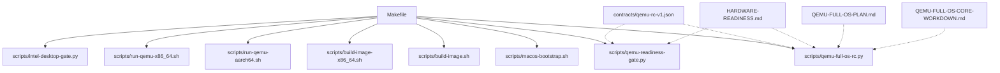
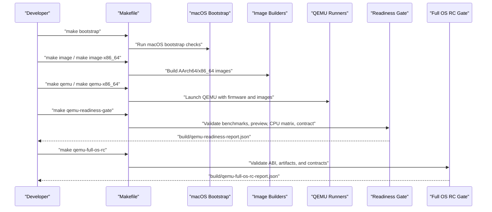
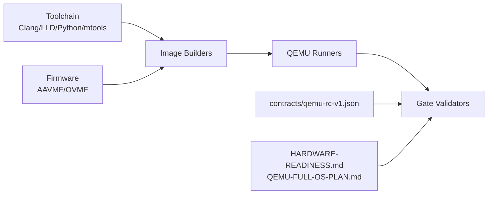

# Installation Procedures

<cite>
**Referenced Files in This Document**
- [README.md](file://README.md)
- [Makefile](file://Makefile)
- [HARDWARE-READINESS.md](file://HARDWARE-READINESS.md)
- [QEMU-FULL-OS-PLAN.md](file://QEMU-FULL-OS-PLAN.md)
- [QEMU-FULL-OS-CORE-WORKDOWN.md](file://QEMU-FULL-OS-CORE-WORKDOWN.md)
- [contracts/qemu-rc-v1.json](file://contracts/qemu-rc-v1.json)
- [scripts/macos-bootstrap.sh](file://scripts/macos-bootstrap.sh)
- [scripts/build-image.sh](file://scripts/build-image.sh)
- [scripts/build-image-x86_64.sh](file://scripts/build-image-x86_64.sh)
- [scripts/run-qemu-aarch64.sh](file://scripts/run-qemu-aarch64.sh)
- [scripts/run-qemu-x86_64.sh](file://scripts/run-qemu-x86_64.sh)
- [scripts/qemu-readiness-gate.py](file://scripts/qemu-readiness-gate.py)
- [scripts/qemu-full-os-rc.py](file://scripts/qemu-full-os-rc.py)
- [scripts/intel-desktop-gate.py](file://scripts/intel-desktop-gate.py)
- [requirements-dev.txt](file://requirements-dev.txt)
</cite>

## Table of Contents
1. [Introduction](#introduction)
2. [Project Structure](#project-structure)
3. [Core Components](#core-components)
4. [Architecture Overview](#architecture-overview)
5. [Detailed Component Analysis](#detailed-component-analysis)
6. [Dependency Analysis](#dependency-analysis)
7. [Performance Considerations](#performance-considerations)
8. [Troubleshooting Guide](#troubleshooting-guide)
9. [Conclusion](#conclusion)
10. [Appendices](#appendices)

## Introduction
This document provides end-to-end installation and verification procedures for OSAI across supported platforms. It covers:
- QEMU virtualization setup for macOS (AArch64 and x86_64)
- Intel Desktop preparation and verification criteria
- ARM/AArch64 embedded SD card preparation and device-specific configuration
- Build system requirements and cross-compilation setup
- Verification procedures and troubleshooting

OSAI is a server-only operating system for CPU-only embedded AI agents. The canonical path begins on macOS with QEMU, progresses through readiness and release-candidate gates, and unlocks Intel Desktop bring-up only after the full OS release-candidate gate passes.

**Section sources**
- [README.md:1-86](file://README.md#L1-L86)

## Project Structure
At a high level, OSAI’s build and test infrastructure is driven by a Makefile with targeted scripts for building images, running QEMU, and validating gates. The repository includes:
- Bootloader and kernel sources for AArch64 and x86_64
- Userspace init, service manager, and worker binaries
- Scripts for macOS bootstrap, image creation, QEMU invocation, and gate validation
- Contract definitions and planning documents

**Diagram sources**
- [Makefile:1-135](file://Makefile#L1-L135)
- [scripts/macos-bootstrap.sh:1-251](file://scripts/macos-bootstrap.sh#L1-L251)
- [scripts/build-image.sh:1-366](file://scripts/build-image.sh#L1-L366)
- [scripts/build-image-x86_64.sh:1-141](file://scripts/build-image-x86_64.sh#L1-L141)
- [scripts/run-qemu-aarch64.sh:1-162](file://scripts/run-qemu-aarch64.sh#L1-L162)
- [scripts/run-qemu-x86_64.sh:1-127](file://scripts/run-qemu-x86_64.sh#L1-L127)
- [scripts/qemu-readiness-gate.py:1-535](file://scripts/qemu-readiness-gate.py#L1-L535)
- [scripts/qemu-full-os-rc.py:1-362](file://scripts/qemu-full-os-rc.py#L1-L362)
- [scripts/intel-desktop-gate.py:1-77](file://scripts/intel-desktop-gate.py#L1-L77)
- [contracts/qemu-rc-v1.json:1-415](file://contracts/qemu-rc-v1.json#L1-L415)
- [HARDWARE-READINESS.md:1-135](file://HARDWARE-READINESS.md#L1-L135)
- [QEMU-FULL-OS-PLAN.md:1-168](file://QEMU-FULL-OS-PLAN.md#L1-L168)
- [QEMU-FULL-OS-CORE-WORKDOWN.md:1-368](file://QEMU-FULL-OS-CORE-WORKDOWN.md#L1-L368)

**Section sources**
- [Makefile:1-135](file://Makefile#L1-L135)

## Core Components
- macOS bootstrap: Validates tooling and firmware prerequisites for QEMU AArch64 emulation on Apple Silicon.
- Image builders: Produce UEFI boot images and VirtIO test images for AArch64 and x86_64.
- QEMU runners: Launch AArch64 and x86_64 VMs with appropriate firmware, accelerators, and networking.
- Gate validators: Enforce correctness contracts, ABI parity, telemetry thresholds, and CPU compatibility matrices.

Key entry points:
- make bootstrap
- make image and make image-x86_64
- make qemu and make qemu-x86_64
- make qemu-readiness-gate and make qemu-full-os-rc
- make intel-desktop-gate

Verification artifacts:
- build/qemu-benchmark-report.json
- build/qemu-preview-manifest.json
- build/qemu-cpu-matrix-report.json
- build/qemu-readiness-report.json
- build/qemu-full-os-rc-report.json

**Section sources**
- [Makefile:1-135](file://Makefile#L1-L135)
- [scripts/macos-bootstrap.sh:1-251](file://scripts/macos-bootstrap.sh#L1-L251)
- [scripts/build-image.sh:1-366](file://scripts/build-image.sh#L1-L366)
- [scripts/build-image-x86_64.sh:1-141](file://scripts/build-image-x86_64.sh#L1-L141)
- [scripts/run-qemu-aarch64.sh:1-162](file://scripts/run-qemu-aarch64.sh#L1-L162)
- [scripts/run-qemu-x86_64.sh:1-127](file://scripts/run-qemu-x86_64.sh#L1-L127)
- [scripts/qemu-readiness-gate.py:1-535](file://scripts/qemu-readiness-gate.py#L1-L535)
- [scripts/qemu-full-os-rc.py:1-362](file://scripts/qemu-full-os-rc.py#L1-L362)
- [scripts/intel-desktop-gate.py:1-77](file://scripts/intel-desktop-gate.py#L1-L77)

## Architecture Overview
The installation pipeline integrates build, virtualization, and validation:

**Diagram sources**
- [Makefile:1-135](file://Makefile#L1-L135)
- [scripts/macos-bootstrap.sh:1-251](file://scripts/macos-bootstrap.sh#L1-L251)
- [scripts/build-image.sh:1-366](file://scripts/build-image.sh#L1-L366)
- [scripts/build-image-x86_64.sh:1-141](file://scripts/build-image-x86_64.sh#L1-L141)
- [scripts/run-qemu-aarch64.sh:1-162](file://scripts/run-qemu-aarch64.sh#L1-L162)
- [scripts/run-qemu-x86_64.sh:1-127](file://scripts/run-qemu-x86_64.sh#L1-L127)
- [scripts/qemu-readiness-gate.py:1-535](file://scripts/qemu-readiness-gate.py#L1-L535)
- [scripts/qemu-full-os-rc.py:1-362](file://scripts/qemu-full-os-rc.py#L1-L362)

## Detailed Component Analysis

### QEMU Virtualization Setup (macOS)
Prerequisites:
- macOS host (Apple Silicon recommended)
- QEMU with AArch64 HVF acceleration and EDK2/AAVMF firmware
- LLVM/Clang and LLD for cross-toolchains
- Python 3 and mtools for image creation

Steps:
1. Bootstrap and validate prerequisites
   - Run: make bootstrap
   - Confirms QEMU, Clang, LLD, Python, Git, Make, and firmware presence
2. Build AArch64 UEFI boot image
   - Run: make image
   - Creates FAT image with BOOTAA64.EFI and kernel.elf
3. Launch QEMU AArch64
   - Run: make qemu
   - Uses HVF acceleration if available; falls back to TCG
   - Exposes serial console and optional SSH bridge via port forwarding

Verification:
- Console output indicates successful UEFI boot and kernel handoff
- make qemu-readiness-gate produces build/qemu-readiness-report.json
- make qemu-full-os-rc produces build/qemu-full-os-rc-report.json

Notes:
- Firmware path can be overridden via OSAI_AAVMF_CODE
- Acceleration defaults to hvf when available; otherwise tcg

**Section sources**
- [scripts/macos-bootstrap.sh:1-251](file://scripts/macos-bootstrap.sh#L1-L251)
- [scripts/build-image.sh:1-366](file://scripts/build-image.sh#L1-L366)
- [scripts/run-qemu-aarch64.sh:1-162](file://scripts/run-qemu-aarch64.sh#L1-L162)
- [Makefile:1-135](file://Makefile#L1-L135)
- [HARDWARE-READINESS.md:1-135](file://HARDWARE-READINESS.md#L1-L135)
- [QEMU-FULL-OS-PLAN.md:1-168](file://QEMU-FULL-OS-PLAN.md#L1-L168)

### QEMU x86_64 Emulation (macOS)
Prerequisites:
- QEMU with x86_64 OVMF firmware
- Optional OVMF override via OSAI_OVMF_CODE

Steps:
1. Build x86_64 UEFI boot image
   - Run: make image-x86_64
   - Creates FAT image with BOOTX64.EFI and kernel.elf
2. Launch QEMU x86_64
   - Run: make qemu-x86_64
   - Defaults to machine=q35, cpu=max, memory=2G, smp=4
3. Gate validation
   - make qemu-readiness-gate and make qemu-full-os-rc

Verification:
- Gate outputs confirm ABI, telemetry, filesystem, and CPU matrix conformance
- Intel Desktop entry criteria validated by intel-desktop-gate

**Section sources**
- [scripts/build-image-x86_64.sh:1-141](file://scripts/build-image-x86_64.sh#L1-L141)
- [scripts/run-qemu-x86_64.sh:1-127](file://scripts/run-qemu-x86_64.sh#L1-L127)
- [scripts/intel-desktop-gate.py:1-77](file://scripts/intel-desktop-gate.py#L1-L77)
- [HARDWARE-READINESS.md:1-135](file://HARDWARE-READINESS.md#L1-L135)

### Intel Desktop Installation Procedures
Entry criteria:
- make qemu-full-os-rc passes locally
- build/qemu-full-os-rc-report.json exists with qemu_full_os_complete=true
- make qemu-readiness-gate passes locally
- contracts/qemu-rc-v1.json remains frozen

Gate validation:
- make intel-desktop-gate executes qemu-x86_64 smoke with specific CPU and accelerator settings
- Generates build/intel-desktop-gate-report.json with milestone markers and telemetry assertions

Verification checklist:
- Hot-core telemetry shows zero migration and context switches
- QEMU correctness, physical hardware requirement, and baseline requirements are satisfied
- Performance claims remain disallowed until measured baselines are established

**Section sources**
- [HARDWARE-READINESS.md:97-135](file://HARDWARE-READINESS.md#L97-L135)
- [scripts/intel-desktop-gate.py:1-77](file://scripts/intel-desktop-gate.py#L1-L77)
- [QEMU-FULL-OS-PLAN.md:145-168](file://QEMU-FULL-OS-PLAN.md#L145-L168)

### ARM/AArch64 Embedded Systems (SD Card Preparation)
Note: The repository demonstrates AArch64 UEFI boot and VirtIO-based images suitable for QEMU. For physical AArch64 devices, the typical approach involves:
- Preparing an SD card with a FAT partition for UEFI firmware and kernel image
- Placing BOOTAA64.EFI and kernel.elf on the FAT partition
- Ensuring device firmware supports UEFI boot and exposes VirtIO-compatible block and network devices
- Using the same image creation workflow to produce the FAT image and VirtIO test image

Operational guidance:
- Build the AArch64 image as described in QEMU AArch64 setup
- Copy the FAT image content to the SD card using standard tools
- Insert the SD card into the target AArch64 board and power on

Compatibility:
- The frozen contract specifies architecture=aarch64 and firmware=UEFI
- CPU matrix includes Cortex-A series and Neoverse variants for boot probing

**Section sources**
- [scripts/build-image.sh:1-366](file://scripts/build-image.sh#L1-L366)
- [contracts/qemu-rc-v1.json:5-12](file://contracts/qemu-rc-v1.json#L5-L12)
- [contracts/qemu-rc-v1.json:370-402](file://contracts/qemu-rc-v1.json#L370-L402)

### Build System Requirements and Cross-Compilation
Toolchain:
- Clang and LLD from LLVM (Homebrew preferred)
- Python 3 and mtools for image creation
- QEMU system emulators for AArch64 and x86_64
- Git and Make for repository management

Cross-compilation targets:
- AArch64: --target=aarch64-unknown-windows for UEFI loader; aarch64-none-elf for kernel and userspace
- x86_64: --target=x86_64-unknown-windows for UEFI loader; x86_64-none-elf for kernel

Dependencies:
- paramiko (development dependency for SSH bridge)
- macOS bootstrap script validates presence of required tools and firmware

Environment variables:
- OSAI_AAVMF_CODE: path to EDK2/AAVMF firmware for AArch64
- OSAI_OVMF_CODE: path to OVMF firmware for x86_64
- OSAI_QEMU_*: customize QEMU acceleration, CPU, memory, SMP, and ports

**Section sources**
- [scripts/macos-bootstrap.sh:1-251](file://scripts/macos-bootstrap.sh#L1-L251)
- [scripts/build-image.sh:78-84](file://scripts/build-image.sh#L78-L84)
- [scripts/build-image-x86_64.sh:69-75](file://scripts/build-image-x86_64.sh#L69-L75)
- [requirements-dev.txt:1-2](file://requirements-dev.txt#L1-L2)

### Verification Procedures
Gate-based validation ensures correctness and contract compliance:
- make qemu-readiness-gate
  - Validates benchmark, preview manifest, CPU matrix, and frozen contract
  - Produces build/qemu-readiness-report.json
- make qemu-full-os-rc
  - Validates ABI against source headers
  - Produces build/qemu-full-os-rc-report.json with qemu_full_os_complete=true
- make intel-desktop-gate
  - Executes x86_64 smoke with specific CPU and accelerator
  - Produces build/intel-desktop-gate-report.json

Contract validation:
- contracts/qemu-rc-v1.json defines ABI, telemetry schema, filesystem, persistence, service descriptors, security policy, update system, and admin control plane
- CPU matrix tiers specify ARM64 boot probes and x86_64 command-profiles

**Section sources**
- [scripts/qemu-readiness-gate.py:1-535](file://scripts/qemu-readiness-gate.py#L1-L535)
- [scripts/qemu-full-os-rc.py:1-362](file://scripts/qemu-full-os-rc.py#L1-L362)
- [contracts/qemu-rc-v1.json:1-415](file://contracts/qemu-rc-v1.json#L1-L415)
- [QEMU-FULL-OS-PLAN.md:121-132](file://QEMU-FULL-OS-PLAN.md#L121-L132)

## Dependency Analysis
The build and test pipeline depends on:
- Toolchain: Clang, LLD, Python, mtools, QEMU
- Firmware: EDK2/AAVMF (AArch64) and OVMF (x86_64)
- Artifacts: UEFI images, kernel ELF, userspace binaries, VirtIO test images
- Contracts: Frozen QEMU release-candidate contract

**Diagram sources**
- [scripts/macos-bootstrap.sh:1-251](file://scripts/macos-bootstrap.sh#L1-L251)
- [scripts/build-image.sh:1-366](file://scripts/build-image.sh#L1-L366)
- [scripts/build-image-x86_64.sh:1-141](file://scripts/build-image-x86_64.sh#L1-L141)
- [scripts/run-qemu-aarch64.sh:1-162](file://scripts/run-qemu-aarch64.sh#L1-L162)
- [scripts/run-qemu-x86_64.sh:1-127](file://scripts/run-qemu-x86_64.sh#L1-L127)
- [scripts/qemu-readiness-gate.py:1-535](file://scripts/qemu-readiness-gate.py#L1-L535)
- [scripts/qemu-full-os-rc.py:1-362](file://scripts/qemu-full-os-rc.py#L1-L362)
- [contracts/qemu-rc-v1.json:1-415](file://contracts/qemu-rc-v1.json#L1-L415)
- [HARDWARE-READINESS.md:1-135](file://HARDWARE-READINESS.md#L1-L135)
- [QEMU-FULL-OS-PLAN.md:1-168](file://QEMU-FULL-OS-PLAN.md#L1-L168)

**Section sources**
- [Makefile:1-135](file://Makefile#L1-L135)

## Performance Considerations
- QEMU correctness gates do not authorize performance claims against Linux or BSD; physical hardware performance baselines are required before performance assertions
- Intel Desktop performance claims remain disallowed until measured baselines are established
- Gate outputs explicitly mark performance_claims_allowed=false

[No sources needed since this section provides general guidance]

## Troubleshooting Guide
Common issues and resolutions:
- Missing QEMU or firmware
  - Cause: QEMU not installed or firmware not found
  - Resolution: Install QEMU via Homebrew and ensure EDK2/AAVMF or OVMF is present; optionally set OSAI_AAVMF_CODE or OSAI_OVMF_CODE
- Toolchain not found
  - Cause: Clang, LLD, or Python not installed
  - Resolution: Install LLVM via Homebrew and ensure PATH includes /opt/homebrew/bin or /usr/local/bin
- Missing images
  - Cause: make image or make image-x86_64 not executed
  - Resolution: Run make image (AArch64) or make image-x86_64 (x86_64) before launching QEMU
- Gate failures
  - Cause: telemetry thresholds, ABI mismatches, or CPU matrix tier failures
  - Resolution: Review build/qemu-benchmark-report.json, build/qemu-readiness-report.json, and build/qemu-full-os-rc-report.json; fix root causes indicated by failure lists

Validation aids:
- make qemu-readiness-gate aggregates benchmark, preview, CPU matrix, and contract validations
- make qemu-full-os-rc additionally validates ABI against source headers

**Section sources**
- [scripts/macos-bootstrap.sh:163-250](file://scripts/macos-bootstrap.sh#L163-L250)
- [scripts/build-image.sh:78-84](file://scripts/build-image.sh#L78-L84)
- [scripts/build-image-x86_64.sh:69-75](file://scripts/build-image-x86_64.sh#L69-L75)
- [scripts/qemu-readiness-gate.py:460-535](file://scripts/qemu-readiness-gate.py#L460-L535)
- [scripts/qemu-full-os-rc.py:284-362](file://scripts/qemu-full-os-rc.py#L284-L362)

## Conclusion
OSAI’s installation and verification process is centered on QEMU correctness and contract freezing. The macOS bootstrap validates tooling and firmware, image builders produce UEFI and VirtIO assets, and gate validators ensure ABI, telemetry, and CPU compatibility meet the frozen contract. Intel Desktop implementation proceeds only after the full OS release-candidate gate passes locally, guaranteeing stability before physical hardware development.

[No sources needed since this section summarizes without analyzing specific files]

## Appendices

### Compatibility Matrix (QEMU)
- Architecture: aarch64 (UEFI)
- CPU matrix tiers include ARM64 boot probes and x86_64 command-profiles
- Firmware: EDK2/AAVMF for AArch64; OVMF for x86_64

**Section sources**
- [contracts/qemu-rc-v1.json:5-12](file://contracts/qemu-rc-v1.json#L5-L12)
- [contracts/qemu-rc-v1.json:370-402](file://contracts/qemu-rc-v1.json#L370-L402)

### Entry Criteria for Intel Desktop
- make qemu-full-os-rc passes locally and produces build/qemu-full-os-rc-report.json with qemu_full_os_complete=true
- make qemu-readiness-gate passes locally and produces build/qemu-readiness-report.json
- contracts/qemu-rc-v1.json remains frozen
- Intel Desktop gate validates QEMU correctness and planning contracts

**Section sources**
- [HARDWARE-READINESS.md:97-135](file://HARDWARE-READINESS.md#L97-L135)
- [QEMU-FULL-OS-PLAN.md:145-168](file://QEMU-FULL-OS-PLAN.md#L145-L168)