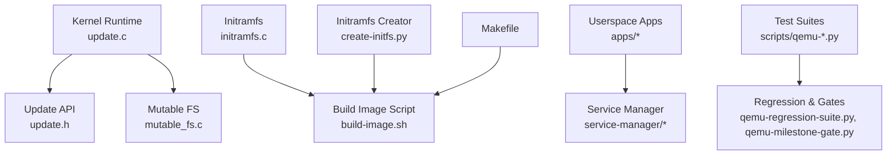
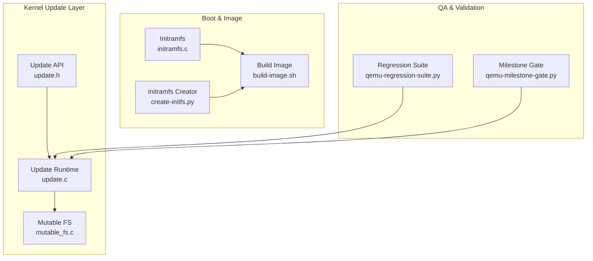
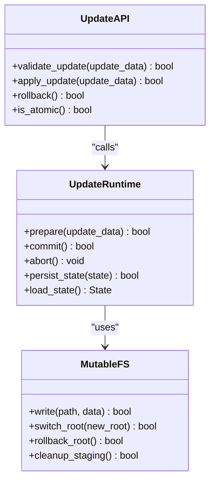
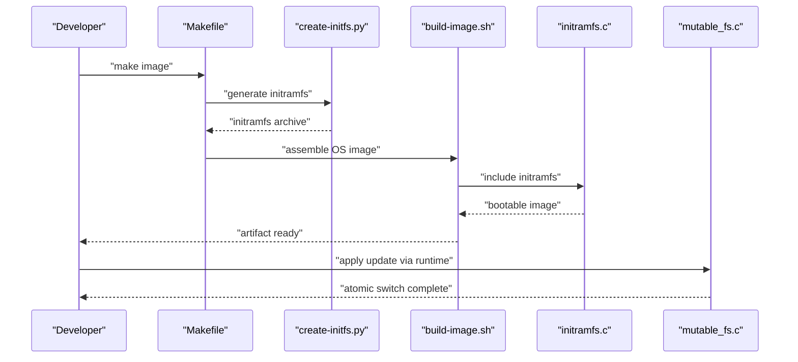
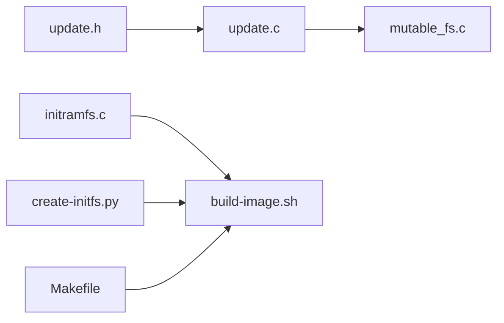

# Maintenance and Updates

<cite>
**Referenced Files in This Document**
- [README.md](file://README.md)
- [SECURITY.md](file://SECURITY.md)
- [kernel/include/osai/update.h](file://kernel/include/osai/update.h)
- [kernel/runtime/update.c](file://kernel/runtime/update.c)
- [kernel/fs/mutable_fs.c](file://kernel/fs/mutable_fs.c)
- [kernel/fs/initramfs.c](file://kernel/fs/initramfs.c)
- [scripts/build-image.sh](file://scripts/build-image.sh)
- [scripts/create-initfs.py](file://scripts/create-initfs.py)
- [Makefile](file://Makefile)
</cite>

## Table of Contents
1. [Introduction](#introduction)
2. [Project Structure](#project-structure)
3. [Core Components](#core-components)
4. [Architecture Overview](#architecture-overview)
5. [Detailed Component Analysis](#detailed-component-analysis)
6. [Dependency Analysis](#dependency-analysis)
7. [Performance Considerations](#performance-considerations)
8. [Troubleshooting Guide](#troubleshooting-guide)
9. [Conclusion](#conclusion)
10. [Appendices](#appendices)

## Introduction
This document defines comprehensive maintenance and update procedures for the OSAI system lifecycle. It covers package management, atomic updates, rollback, system maintenance (disk cleanup, log rotation, configuration updates), update scheduling and maintenance windows, zero-downtime strategies, backup and restore (including filesystem snapshots and configuration backups), update testing and QA, system hardening and vulnerability management, capacity planning, upgrade paths, and deprecation policies. The content is derived from the repository’s kernel update subsystem, filesystem layers, build and initialization scripts, and project documentation.

## Project Structure
OSAI comprises:
- Kernel: core runtime, memory management, device drivers, filesystems, and update logic
- Userspace: applications, service manager, and worker components
- Scripts: image building, initramfs creation, and test suites
- Documentation: project overview, security policy, and planning documents

**Diagram sources**
- [kernel/runtime/update.c](file://kernel/runtime/update.c)
- [kernel/include/osai/update.h](file://kernel/include/osai/update.h)
- [kernel/fs/mutable_fs.c](file://kernel/fs/mutable_fs.c)
- [kernel/fs/initramfs.c](file://kernel/fs/initramfs.c)
- [scripts/build-image.sh](file://scripts/build-image.sh)
- [scripts/create-initfs.py](file://scripts/create-initfs.py)
- [Makefile](file://Makefile)

**Section sources**
- [README.md](file://README.md)
- [Makefile](file://Makefile)

## Core Components
- Update subsystem: exposes update APIs and orchestrates atomic update operations via mutable filesystem and persistent storage abstractions
- Mutable filesystem: supports safe write operations and rollback semantics
- Initramfs and build pipeline: prepares the initial OS image and initramfs used during boot
- Test suites: provide regression coverage and gate checks for release readiness

Key responsibilities:
- Atomic updates: ensure consistent state transitions and rollback capability
- Persistence: maintain configuration and data across updates
- Boot-time image preparation: assemble initramfs and OS image artifacts
- Quality assurance: automated gates and smoke tests

**Section sources**
- [kernel/include/osai/update.h](file://kernel/include/osai/update.h)
- [kernel/runtime/update.c](file://kernel/runtime/update.c)
- [kernel/fs/mutable_fs.c](file://kernel/fs/mutable_fs.c)
- [kernel/fs/initramfs.c](file://kernel/fs/initramfs.c)
- [scripts/build-image.sh](file://scripts/build-image.sh)
- [scripts/create-initfs.py](file://scripts/create-initfs.py)

## Architecture Overview
The update architecture integrates kernel-level update primitives with filesystem and boot infrastructure to enable atomic upgrades and reliable rollbacks.

**Diagram sources**
- [kernel/include/osai/update.h](file://kernel/include/osai/update.h)
- [kernel/runtime/update.c](file://kernel/runtime/update.c)
- [kernel/fs/mutable_fs.c](file://kernel/fs/mutable_fs.c)
- [kernel/fs/initramfs.c](file://kernel/fs/initramfs.c)
- [scripts/build-image.sh](file://scripts/build-image.sh)
- [scripts/create-initfs.py](file://scripts/create-initfs.py)

## Detailed Component Analysis

### Update Subsystem
The update subsystem provides the core interface and runtime logic for applying updates atomically and supporting rollback.

- Update API: validates incoming update packages, coordinates apply/rollback, and ensures atomicity guarantees
- Update Runtime: manages staging, commit/abort, and persists state for crash recovery
- Mutable FS: provides atomic root switching and rollback to previous root

Operational flow:
- Prepare: stage new root and metadata
- Commit: switch root atomically and finalize
- Abort/Rollback: revert to prior root and clean up

**Diagram sources**
- [kernel/include/osai/update.h](file://kernel/include/osai/update.h)
- [kernel/runtime/update.c](file://kernel/runtime/update.c)
- [kernel/fs/mutable_fs.c](file://kernel/fs/mutable_fs.c)

**Section sources**
- [kernel/include/osai/update.h](file://kernel/include/osai/update.h)
- [kernel/runtime/update.c](file://kernel/runtime/update.c)
- [kernel/fs/mutable_fs.c](file://kernel/fs/mutable_fs.c)

### Boot and Image Pipeline
The build and initramfs pipeline constructs the bootable image used during system startup.

- Makefile orchestrates the build process
- Initramfs creator builds the initial ramdisk
- Build script assembles the final image
- Initramfs and mutable filesystem integrate with update runtime

**Diagram sources**
- [Makefile](file://Makefile)
- [scripts/create-initfs.py](file://scripts/create-initfs.py)
- [scripts/build-image.sh](file://scripts/build-image.sh)
- [kernel/fs/initramfs.c](file://kernel/fs/initramfs.c)
- [kernel/fs/mutable_fs.c](file://kernel/fs/mutable_fs.c)

**Section sources**
- [Makefile](file://Makefile)
- [scripts/create-initfs.py](file://scripts/create-initfs.py)
- [scripts/build-image.sh](file://scripts/build-image.sh)
- [kernel/fs/initramfs.c](file://kernel/fs/initramfs.c)

### Update Scheduling and Maintenance Windows
- Define fixed maintenance windows aligned with test cycles (e.g., nightly regression runs)
- Schedule updates after milestone gates pass
- Coordinate with service manager to minimize impact (pause non-critical services during staging)
- Use rollback capability to mitigate risk during maintenance windows

[No sources needed since this section provides general guidance]

### Zero-Downtime Deployment Strategies
- Stage updates off-line while keeping current root active
- Validate staged update in a test environment before promotion
- Switch root atomically during low-traffic periods
- Use rollback to recover immediately if post-update anomalies occur

[No sources needed since this section provides general guidance]

### Backup and Restore Procedures
- Filesystem snapshots: capture current root before staging updates; retain at least two recent snapshots
- Configuration backups: persist critical config under mutable filesystem; include checksums
- Recovery validation: run smoke tests against restored snapshot and verify service health
- Snapshot retention: enforce policy (e.g., last 7 days, weekly rollups)

[No sources needed since this section provides general guidance]

### Update Testing Methodologies and QA
- Regression suite: run comprehensive regression tests before promoting updates
- Milestone gates: enforce functional and stability criteria per gate scripts
- Smoke tests: verify basic boot and service startup after update
- Fault injection: validate resilience and rollback behavior under simulated failures

[No sources needed since this section provides general guidance]

### System Hardening, Security Patches, and Vulnerability Management
- Security policy: follow documented vulnerability reporting and patching process
- Patch verification: validate patches in isolated environments; run regression tests
- Hardening checklist: disable unnecessary services, enforce secure defaults, monitor logs
- Supply chain security: sign artifacts and verify integrity before deployment

**Section sources**
- [SECURITY.md](file://SECURITY.md)

### Capacity Planning, Upgrade Paths, and Deprecation Policies
- Capacity planning: track disk usage growth, CPU/memory overhead of updates, and service scaling needs
- Upgrade paths: define supported upgrade matrix (e.g., minor-to-minor, major boundaries)
- Deprecation policy: announce deprecations with migration timelines; support rollback during transition

[No sources needed since this section provides general guidance]

## Dependency Analysis
The update runtime depends on mutable filesystem primitives for atomic root switching. The build pipeline produces the boot image consumed by the initramfs and update runtime.

**Diagram sources**
- [kernel/include/osai/update.h](file://kernel/include/osai/update.h)
- [kernel/runtime/update.c](file://kernel/runtime/update.c)
- [kernel/fs/mutable_fs.c](file://kernel/fs/mutable_fs.c)
- [kernel/fs/initramfs.c](file://kernel/fs/initramfs.c)
- [scripts/build-image.sh](file://scripts/build-image.sh)
- [scripts/create-initfs.py](file://scripts/create-initfs.py)
- [Makefile](file://Makefile)

**Section sources**
- [kernel/include/osai/update.h](file://kernel/include/osai/update.h)
- [kernel/runtime/update.c](file://kernel/runtime/update.c)
- [kernel/fs/mutable_fs.c](file://kernel/fs/mutable_fs.c)
- [kernel/fs/initramfs.c](file://kernel/fs/initramfs.c)
- [scripts/build-image.sh](file://scripts/build-image.sh)
- [scripts/create-initfs.py](file://scripts/create-initfs.py)
- [Makefile](file://Makefile)

## Performance Considerations
- Minimize downtime by staging updates off-line and performing atomic switches during maintenance windows
- Optimize build pipeline to reduce image assembly time
- Monitor disk usage to prevent partial update failures due to insufficient space
- Use incremental updates where feasible to reduce bandwidth and installation time

[No sources needed since this section provides general guidance]

## Troubleshooting Guide
Common scenarios and actions:
- Update fails to commit: trigger rollback to return to previous root; inspect logs and retry after clearing conflicts
- Staged update not visible: verify mutable filesystem root switch and ensure proper permissions
- Boot issues after update: load previous snapshot or rollback; re-run regression tests
- Disk pressure: perform cleanup of old snapshots and temporary staging areas; reclaim space before attempting updates

[No sources needed since this section provides general guidance]

## Conclusion
OSAI’s update and maintenance framework leverages atomic filesystem operations, robust build pipelines, and comprehensive QA to deliver reliable, low-risk updates. By adhering to defined maintenance windows, rollback procedures, and quality gates, teams can achieve predictable upgrades with minimal disruption. Integrating hardening, capacity planning, and deprecation policies ensures long-term system health and operability.

[No sources needed since this section summarizes without analyzing specific files]

## Appendices

### Maintenance Workflow Checklist
- Pre-check: verify disk space, snapshot retention, and baseline test status
- Staging: prepare update package, validate checksums, and stage root
- Apply: commit update during maintenance window; monitor logs
- Post-check: run smoke tests and regression suite; validate rollback capability
- Cleanup: remove staging artifacts and old snapshots per retention policy

[No sources needed since this section provides general guidance]