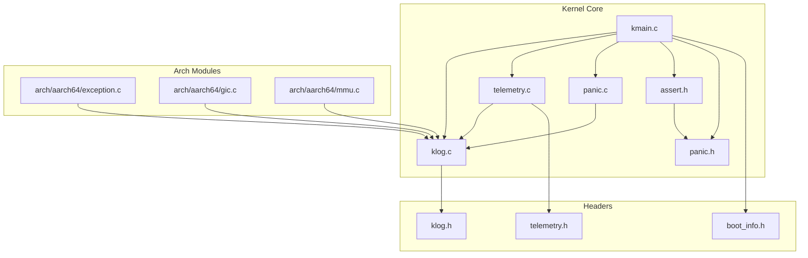
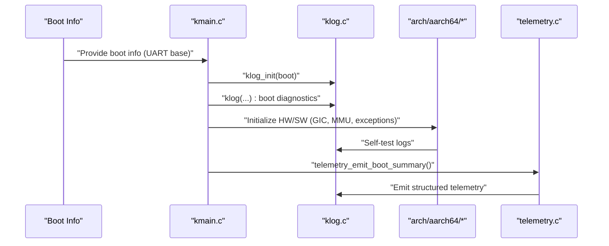
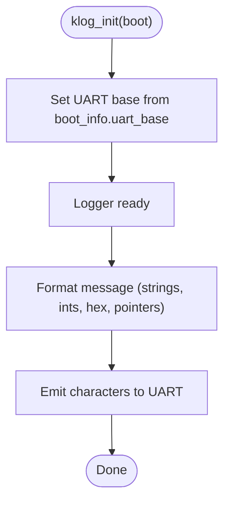
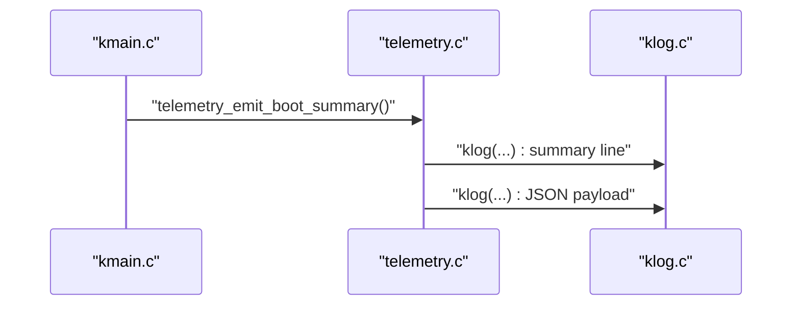
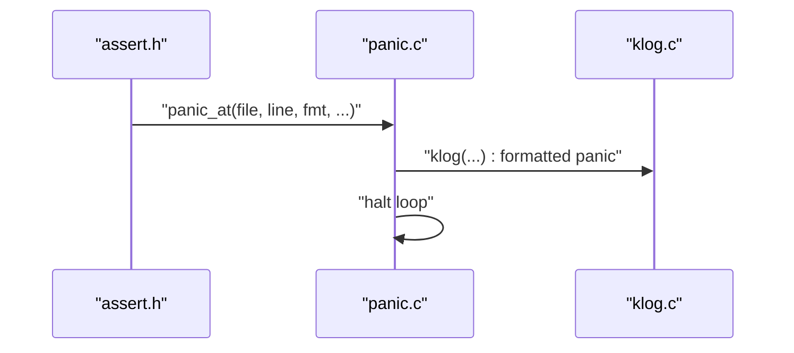
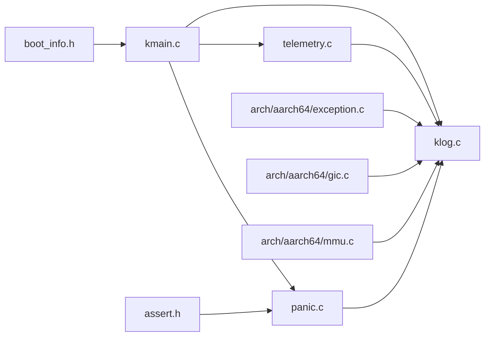

# Monitoring and Logging

<cite>
**Referenced Files in This Document**
- [klog.c](file://kernel/core/klog.c)
- [klog.h](file://kernel/include/osai/klog.h)
- [telemetry.c](file://kernel/core/telemetry.c)
- [telemetry.h](file://kernel/include/osai/telemetry.h)
- [kmain.c](file://kernel/core/kmain.c)
- [panic.c](file://kernel/core/panic.c)
- [assert.h](file://kernel/include/osai/assert.h)
- [panic.h](file://kernel/include/osai/panic.h)
- [boot_info.h](file://kernel/include/osai/boot_info.h)
- [exception.c](file://kernel/arch/aarch64/exception.c)
- [gic.c](file://kernel/arch/aarch64/gic.c)
- [mmu.c](file://kernel/arch/aarch64/mmu.c)
</cite>

## Table of Contents
1. [Introduction](#introduction)
2. [Project Structure](#project-structure)
3. [Core Components](#core-components)
4. [Architecture Overview](#architecture-overview)
5. [Detailed Component Analysis](#detailed-component-analysis)
6. [Dependency Analysis](#dependency-analysis)
7. [Performance Considerations](#performance-considerations)
8. [Troubleshooting Guide](#troubleshooting-guide)
9. [Conclusion](#conclusion)
10. [Appendices](#appendices)

## Introduction
This document describes the OSAI system’s monitoring and logging infrastructure with a focus on kernel logging, telemetry emission, and observability primitives. It explains how kernel messages are formatted and emitted via UART, how telemetry data is collected and exported, and how to leverage these facilities for debugging, alerting, and centralized monitoring. The content is derived from the kernel’s logging and telemetry sources and is intended for both developers and operators who need to observe and troubleshoot the system.

## Project Structure
The logging and telemetry functionality resides primarily in the kernel core and architecture-specific modules:
- Kernel logging: initialization and formatting routines
- Telemetry: boot summary emission and metric aggregation
- Panic and assertion: fatal event logging and halting behavior
- Boot info: platform-provided configuration including UART base address
- Architecture modules: exception handling, GIC, and MMU emit diagnostic logs during self-tests

**Diagram sources**
- [kmain.c](file://kernel/core/kmain.c)
- [klog.c](file://kernel/core/klog.c)
- [telemetry.c](file://kernel/core/telemetry.c)
- [panic.c](file://kernel/core/panic.c)
- [assert.h](file://kernel/include/osai/assert.h)
- [panic.h](file://kernel/include/osai/panic.h)
- [klog.h](file://kernel/include/osai/klog.h)
- [boot_info.h](file://kernel/include/osai/boot_info.h)
- [telemetry.h](file://kernel/include/osai/telemetry.h)
- [exception.c](file://kernel/arch/aarch64/exception.c)
- [gic.c](file://kernel/arch/aarch64/gic.c)
- [mmu.c](file://kernel/arch/aarch64/mmu.c)

**Section sources**
- [kmain.c](file://kernel/core/kmain.c)
- [klog.c](file://kernel/core/klog.c)
- [telemetry.c](file://kernel/core/telemetry.c)
- [panic.c](file://kernel/core/panic.c)
- [assert.h](file://kernel/include/osai/assert.h)
- [panic.h](file://kernel/include/osai/panic.h)
- [klog.h](file://kernel/include/osai/klog.h)
- [boot_info.h](file://kernel/include/osai/boot_info.h)
- [telemetry.h](file://kernel/include/osai/telemetry.h)
- [exception.c](file://kernel/arch/aarch64/exception.c)
- [gic.c](file://kernel/arch/aarch64/gic.c)
- [mmu.c](file://kernel/arch/aarch64/mmu.c)

## Core Components
- Kernel logging (UART): Initializes UART base from boot info and provides printf-like formatting with support for strings, integers, pointers, and long variants. Characters are emitted directly to the serial port.
- Telemetry emission: Emits a structured boot summary including counts and totals for memory, heap, arenas, sandboxes, persistence, mutable filesystem, updates, AI cells, CPU AI runtime, Git workspace, networking, services, and user processes.
- Panic and assertions: Emit human-readable diagnostics and enter a halted state to aid debugging.
- Boot info: Provides the UART base address and other platform metadata required by the kernel to initialize logging.

Key responsibilities:
- klog.c: UART-backed logging, formatting, and output
- telemetry.c: Aggregates and emits telemetry metrics
- panic.c and assert.h: Fatal error reporting and halting
- boot_info.h: Platform configuration including UART base

**Section sources**
- [klog.c](file://kernel/core/klog.c)
- [klog.h](file://kernel/include/osai/klog.h)
- [telemetry.c](file://kernel/core/telemetry.c)
- [telemetry.h](file://kernel/include/osai/telemetry.h)
- [panic.c](file://kernel/core/panic.c)
- [assert.h](file://kernel/include/osai/assert.h)
- [panic.h](file://kernel/include/osai/panic.h)
- [boot_info.h](file://kernel/include/osai/boot_info.h)

## Architecture Overview
The logging and telemetry pipeline is driven by the kernel entry point and self-tests. Initialization sets up logging, followed by hardware and subsystem self-tests that emit diagnostic logs. Telemetry is emitted after initialization completes, providing a snapshot of system state and activity counters.

**Diagram sources**
- [kmain.c](file://kernel/core/kmain.c)
- [klog.c](file://kernel/core/klog.c)
- [telemetry.c](file://kernel/core/telemetry.c)
- [exception.c](file://kernel/arch/aarch64/exception.c)
- [gic.c](file://kernel/arch/aarch64/gic.c)
- [mmu.c](file://kernel/arch/aarch64/mmu.c)

## Detailed Component Analysis

### Kernel Logging Infrastructure (UART)
- Initialization: The logger reads the UART base address from boot info and prepares the serial port for output.
- Formatting: Supports string insertion, unsigned integers, hexadecimal output, pointer printing, and long variants. Newlines are normalized to carriage return + line feed for terminal compatibility.
- Output destination: Direct UART writes via a platform-specific register offset.

**Diagram sources**
- [klog.c](file://kernel/core/klog.c)
- [boot_info.h](file://kernel/include/osai/boot_info.h)

**Section sources**
- [klog.c](file://kernel/core/klog.c)
- [klog.h](file://kernel/include/osai/klog.h)
- [boot_info.h](file://kernel/include/osai/boot_info.h)

### Telemetry Collection and Emission
- Purpose: Produce a boot-time summary of system state and operational counters for observability.
- Content: Includes CPU topology, memory subsystem stats, heap and arena metrics, sandbox transitions, persistence and mutable filesystem operations, update transactions, AI cell and CPU AI runtime activity, Git workspace syncs, network stack statistics, service lifecycle, and user process accounting.
- Emission: Uses the kernel logger to print a concise line followed by a JSON payload.

**Diagram sources**
- [telemetry.c](file://kernel/core/telemetry.c)
- [kmain.c](file://kernel/core/kmain.c)
- [klog.c](file://kernel/core/klog.c)

**Section sources**
- [telemetry.c](file://kernel/core/telemetry.c)
- [telemetry.h](file://kernel/include/osai/telemetry.h)
- [kmain.c](file://kernel/core/kmain.c)

### Panic and Assertion Handling
- Assertions: Macro triggers a panic on failure, invoking the panic handler with the failing expression.
- Panic: Formats and prints a panic message including file and line, then halts execution in a low-power wait loop.

**Diagram sources**
- [assert.h](file://kernel/include/osai/assert.h)
- [panic.c](file://kernel/core/panic.c)
- [panic.h](file://kernel/include/osai/panic.h)
- [klog.c](file://kernel/core/klog.c)

**Section sources**
- [assert.h](file://kernel/include/osai/assert.h)
- [panic.c](file://kernel/core/panic.c)
- [panic.h](file://kernel/include/osai/panic.h)
- [klog.c](file://kernel/core/klog.c)

### Architecture-Specific Logging During Self-Tests
- Exceptions: Logs vector base and reports controlled faults and fatal exceptions.
- GIC: Discovers and validates distributor properties and self-test results.
- MMU: Validates early translation tables and descriptor states.

These logs are essential for diagnosing low-level issues during bring-up and testing.

**Section sources**
- [exception.c](file://kernel/arch/aarch64/exception.c)
- [gic.c](file://kernel/arch/aarch64/gic.c)
- [mmu.c](file://kernel/arch/aarch64/mmu.c)

## Dependency Analysis
The logging and telemetry subsystems depend on shared headers and the boot info structure. The kernel entry point orchestrates initialization and telemetry emission.

**Diagram sources**
- [kmain.c](file://kernel/core/kmain.c)
- [klog.c](file://kernel/core/klog.c)
- [telemetry.c](file://kernel/core/telemetry.c)
- [panic.c](file://kernel/core/panic.c)
- [assert.h](file://kernel/include/osai/assert.h)
- [panic.h](file://kernel/include/osai/panic.h)
- [boot_info.h](file://kernel/include/osai/boot_info.h)
- [exception.c](file://kernel/arch/aarch64/exception.c)
- [gic.c](file://kernel/arch/aarch64/gic.c)
- [mmu.c](file://kernel/arch/aarch64/mmu.c)

**Section sources**
- [kmain.c](file://kernel/core/kmain.c)
- [klog.c](file://kernel/core/klog.c)
- [telemetry.c](file://kernel/core/telemetry.c)
- [panic.c](file://kernel/core/panic.c)
- [assert.h](file://kernel/include/osai/assert.h)
- [panic.h](file://kernel/include/osai/panic.h)
- [boot_info.h](file://kernel/include/osai/boot_info.h)
- [exception.c](file://kernel/arch/aarch64/exception.c)
- [gic.c](file://kernel/arch/aarch64/gic.c)
- [mmu.c](file://kernel/arch/aarch64/mmu.c)

## Performance Considerations
- UART throughput: Serial output is bandwidth-limited; avoid excessive logging in hot paths. Prefer selective emission and batched telemetry updates.
- Formatting overhead: Integer and pointer conversions are straightforward but still introduce CPU cycles; minimize per-frame logging frequency.
- Panic path: The halt loop conserves power and simplifies debugging; ensure minimal logging after panic to reduce contention.

## Troubleshooting Guide
- Enable UART console: Ensure the platform provides a valid UART base in boot info so that klog_init can enable logging.
- Interpret telemetry: Use the emitted JSON payload to correlate memory, filesystem, and runtime metrics against observed behavior.
- Panic analysis: Note the file and line from panic logs to locate the failing assertion or error path.
- Hardware self-test logs: Review exception, GIC, and MMU self-test logs for early-stage failures.

Operational tips:
- Use the panic halt behavior to capture a clean snapshot for post-mortem analysis.
- Correlate telemetry timestamps with external timestamps if available to align logs with system events.

**Section sources**
- [klog.c](file://kernel/core/klog.c)
- [telemetry.c](file://kernel/core/telemetry.c)
- [panic.c](file://kernel/core/panic.c)
- [assert.h](file://kernel/include/osai/assert.h)
- [boot_info.h](file://kernel/include/osai/boot_info.h)

## Conclusion
OSAI’s kernel logging and telemetry provide a compact yet effective observability foundation. UART-backed logging ensures visibility during boot and runtime, while telemetry emission delivers a comprehensive snapshot of system state and activity. Together with panic and assertion handling, these components form a practical toolkit for debugging, monitoring, and incident response.

## Appendices

### Log Levels and Message Formatting
- Levels: The kernel logging interface does not define explicit severity levels; logs are emitted as plain text. Panic and assertion paths indicate fatal conditions.
- Formatting: Supports strings, unsigned integers, long unsigned integers, hexadecimal, and pointer formats. Newlines are normalized to CR+LF.

**Section sources**
- [klog.c](file://kernel/core/klog.c)
- [klog.h](file://kernel/include/osai/klog.h)

### Output Destinations
- UART: All kernel logs are written to the platform’s UART device via the base address provided in boot info.

**Section sources**
- [klog.c](file://kernel/core/klog.c)
- [boot_info.h](file://kernel/include/osai/boot_info.h)

### Telemetry Metrics and Counters
- Memory: PMM total/free pages, kernel heap pages and bytes
- Runtime: Arena active and committed pages, sandbox counts and transitions
- Persistence and FS: Snapshots, rollbacks, disk operations, checksum errors, mount/format/boot loads, file operations, journal writes, allocations/frees, multi-sector files, state records, renames, lists, stats, opens/closes, rejects, checksum errors
- Updates: Transactions, staged, committed, failures, recoveries, rollbacks, boot fallbacks, rollback points, records persisted, rejects
- AI Cell and CPU AI Runtime: Transitions, descriptors, resource admissions/rejections, arena reservations and peaks, queue/workspace binds/releases, conflicts, model loads and failures, tokenizer/runtime calls, KV writes, shared weight binds, GPU rejections, model file loads/rejections, bytes loaded, manifest validations, kernel dispatches, admission rejections, checksum failures
- Git Workspace: Active, syncs, applies, reverts, conflicts
- Network Stack: UDP/TCP TX/RX, malformed/dropped, flows, hits/expired, latency percentiles, packet drops, lifecycle, queue enqueues/completions, backpressure drops, core mismatches
- Services: Child descriptors, tree edges, transitions, restarts, crashes, cleanups, log records, admin exports/status exports/log reads, remote safe accepts/rejects, command denials
- Syscalls and Control Plane: Control plane syscalls and denials, service descriptor reads
- Userspace: Process transitions, loaded/runnable/running/waiting/exited/failed, reclaims, scheduled, waits/wakes, active

**Section sources**
- [telemetry.c](file://kernel/core/telemetry.c)

### Log Aggregation, Rotation, and Storage
- Aggregation: Logs are emitted to UART; external systems can collect and forward logs from the serial console.
- Rotation: No built-in log rotation is present in the kernel; operators should manage rotation at the collector level.
- Storage: Kernel logs are not persisted to disk; rely on external collectors for retention and archival.

[No sources needed since this section provides general guidance]

### Remote Logging and Centralized Monitoring
- Forwarding: Capture UART output from the platform console and forward to a log aggregator or SIEM.
- Integration: Use the emitted telemetry JSON payload to populate dashboards and alerting rules.

[No sources needed since this section provides general guidance]

### Debugging Techniques
- Use panic logs to identify failing assertions and exact locations.
- Correlate telemetry snapshots around incidents to assess resource usage and error rates.
- Review architecture self-test logs for hardware-related issues.

**Section sources**
- [panic.c](file://kernel/core/panic.c)
- [telemetry.c](file://kernel/core/telemetry.c)
- [exception.c](file://kernel/arch/aarch64/exception.c)
- [gic.c](file://kernel/arch/aarch64/gic.c)
- [mmu.c](file://kernel/arch/aarch64/mmu.c)