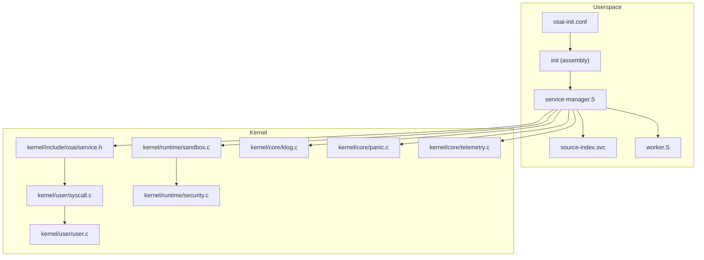
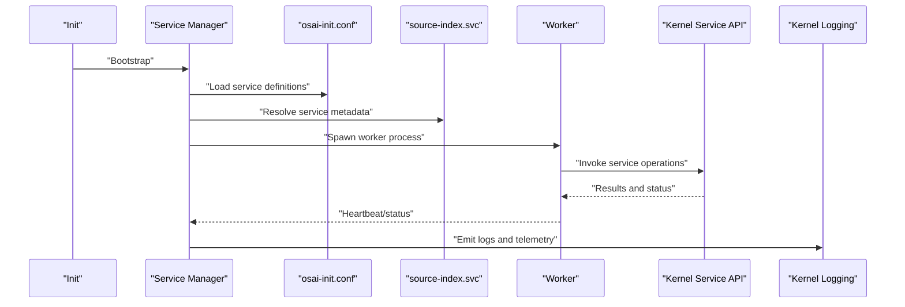
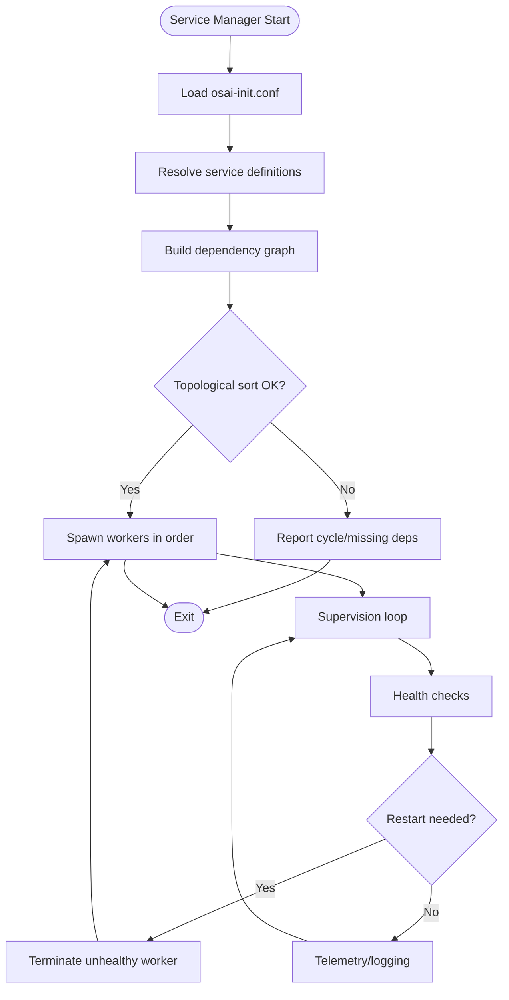
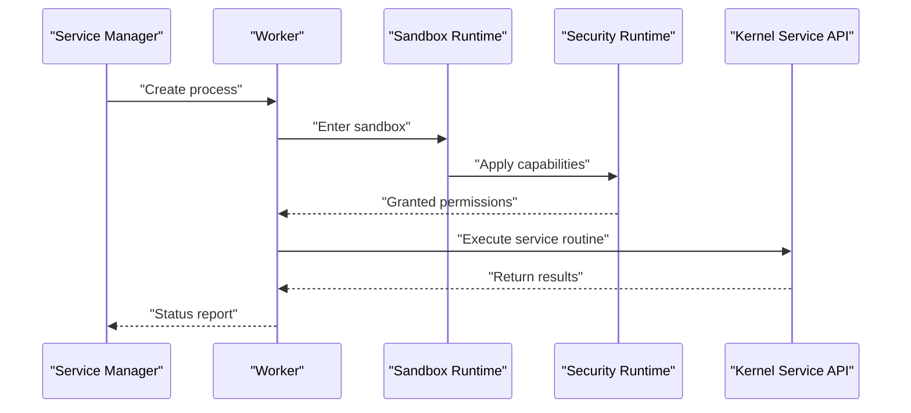
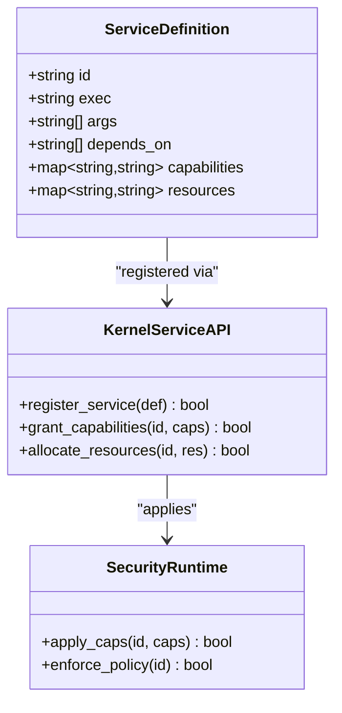
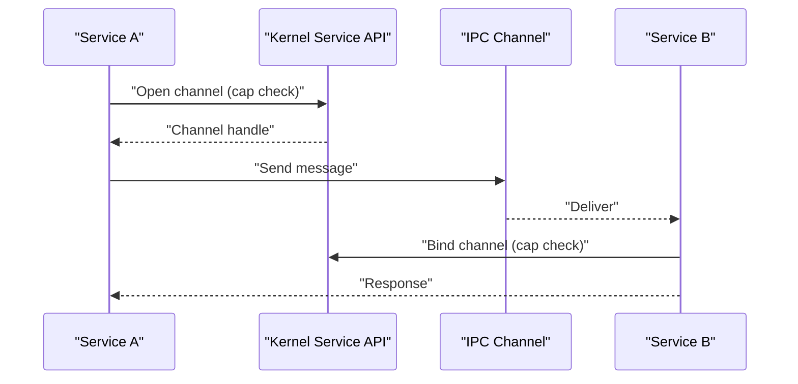
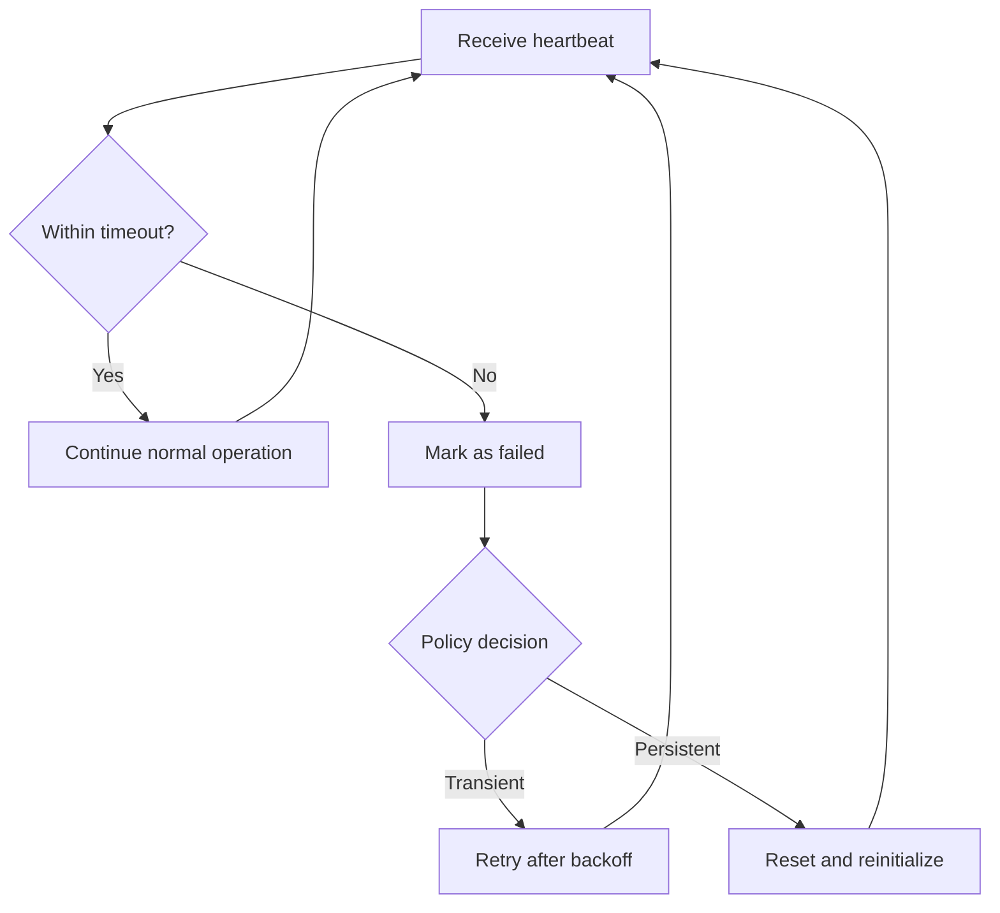
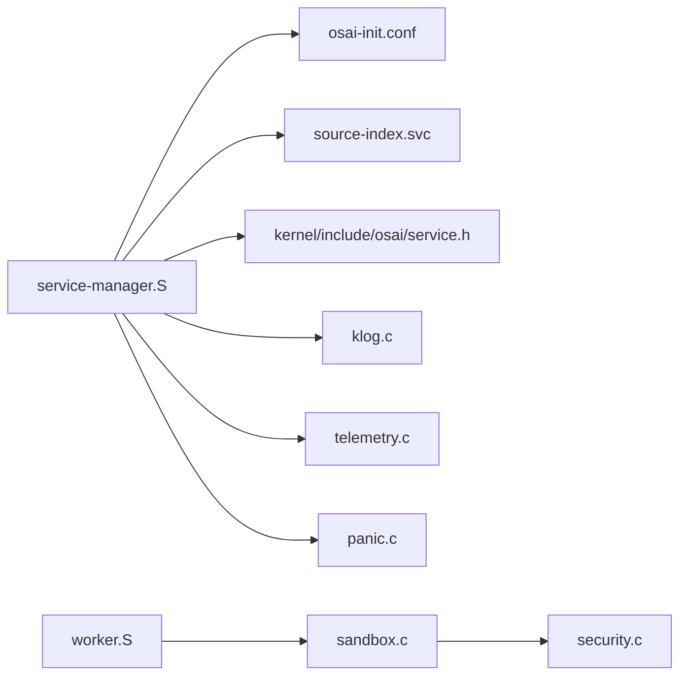

# Service Management

<cite>
**Referenced Files in This Document**
- [osai-init.conf](file://userspace/init/osai-init.conf)
- [service-manager.S](file://userspace/service-manager/service-manager.S)
- [source-index.svc](file://userspace/service-manager/source-index.svc)
- [worker.S](file://userspace/worker/worker.S)
- [service.h](file://kernel/include/osai/service.h)
- [syscall.c](file://kernel/user/syscall.c)
- [user.c](file://kernel/user/user.c)
- [sandbox.c](file://kernel/runtime/sandbox.c)
- [security.c](file://kernel/runtime/security.c)
- [klog.c](file://kernel/core/klog.c)
- [panic.c](file://kernel/core/panic.c)
- [telemetry.c](file://kernel/core/telemetry.c)
- [README.md](file://README.md)
</cite>

## Table of Contents
1. [Introduction](#introduction)
2. [Project Structure](#project-structure)
3. [Core Components](#core-components)
4. [Architecture Overview](#architecture-overview)
5. [Detailed Component Analysis](#detailed-component-analysis)
6. [Dependency Analysis](#dependency-analysis)
7. [Performance Considerations](#performance-considerations)
8. [Troubleshooting Guide](#troubleshooting-guide)
9. [Conclusion](#conclusion)

## Introduction
This document describes OSAI’s microkernel service architecture with a focus on service management. It covers the service manager implementation, process supervision, service lifecycle management, inter-service communication, configuration via osai-init.conf, worker process management, service isolation, registration and capability assignment, monitoring and health checks, debugging and profiling, and strategies for scaling and fault tolerance. The goal is to provide a practical guide for operators and developers working with OSAI’s userspace services.

## Project Structure
OSAI organizes service-related code across userspace and kernel layers:
- Userspace configuration and bootstrap: osai-init.conf, init assembly, and service-manager assembly
- Service runtime and isolation: kernel service interface, sandboxing, and security runtime
- Worker processes: dedicated worker assembly for isolated execution
- Logging and diagnostics: kernel logging, telemetry, and panic facilities

**Diagram sources**
- [osai-init.conf](file://userspace/init/osai-init.conf)
- [service-manager.S](file://userspace/service-manager/service-manager.S)
- [source-index.svc](file://userspace/service-manager/source-index.svc)
- [worker.S](file://userspace/worker/worker.S)
- [service.h](file://kernel/include/osai/service.h)
- [syscall.c](file://kernel/user/syscall.c)
- [user.c](file://kernel/user/user.c)
- [sandbox.c](file://kernel/runtime/sandbox.c)
- [security.c](file://kernel/runtime/security.c)
- [klog.c](file://kernel/core/klog.c)
- [panic.c](file://kernel/core/panic.c)
- [telemetry.c](file://kernel/core/telemetry.c)

**Section sources**
- [osai-init.conf](file://userspace/init/osai-init.conf)
- [service-manager.S](file://userspace/service-manager/service-manager.S)
- [source-index.svc](file://userspace/service-manager/source-index.svc)
- [worker.S](file://userspace/worker/worker.S)
- [service.h](file://kernel/include/osai/service.h)
- [syscall.c](file://kernel/user/syscall.c)
- [user.c](file://kernel/user/user.c)
- [sandbox.c](file://kernel/runtime/sandbox.c)
- [security.c](file://kernel/runtime/security.c)
- [klog.c](file://kernel/core/klog.c)
- [panic.c](file://kernel/core/panic.c)
- [telemetry.c](file://kernel/core/telemetry.c)

## Core Components
- Service Manager: orchestrates service lifecycle, supervision, and inter-service coordination. Implemented in assembly and linked with service definitions.
- Worker Processes: isolated execution units spawned per service definition for workload execution.
- Configuration: osai-init.conf defines services, dependencies, and startup order.
- Kernel Service Interface: exposes service-related system calls and runtime primitives.
- Isolation and Security: sandboxing and security runtime enforce boundaries and capabilities.
- Diagnostics: kernel logging, telemetry, and panic handlers support monitoring and debugging.

**Section sources**
- [service-manager.S](file://userspace/service-manager/service-manager.S)
- [worker.S](file://userspace/worker/worker.S)
- [osai-init.conf](file://userspace/init/osai-init.conf)
- [service.h](file://kernel/include/osai/service.h)
- [sandbox.c](file://kernel/runtime/sandbox.c)
- [security.c](file://kernel/runtime/security.c)
- [klog.c](file://kernel/core/klog.c)
- [telemetry.c](file://kernel/core/telemetry.c)
- [panic.c](file://kernel/core/panic.c)

## Architecture Overview
The service architecture follows a microkernel design:
- Userspace boots via init and loads osai-init.conf
- The service manager parses service definitions and starts workers
- Workers execute service tasks under kernel-enforced isolation
- Inter-service communication is mediated through kernel-provided channels and shared resources
- Monitoring and diagnostics are integrated into the kernel logging and telemetry subsystems

**Diagram sources**
- [osai-init.conf](file://userspace/init/osai-init.conf)
- [service-manager.S](file://userspace/service-manager/service-manager.S)
- [source-index.svc](file://userspace/service-manager/source-index.svc)
- [worker.S](file://userspace/worker/worker.S)
- [service.h](file://kernel/include/osai/service.h)
- [klog.c](file://kernel/core/klog.c)

## Detailed Component Analysis

### Service Manager Implementation
Responsibilities:
- Parse osai-init.conf and resolve service definitions
- Manage worker lifecycle (spawn, supervise, restart)
- Coordinate inter-service dependencies and startup ordering
- Provide health checks and monitoring hooks
- Integrate with kernel service APIs for capability enforcement

Key behaviors:
- Startup sequencing based on dependency graph derived from configuration
- Supervision loop with restart policies for failed workers
- Heartbeat and status reporting to monitoring subsystems

**Diagram sources**
- [service-manager.S](file://userspace/service-manager/service-manager.S)
- [osai-init.conf](file://userspace/init/osai-init.conf)

**Section sources**
- [service-manager.S](file://userspace/service-manager/service-manager.S)
- [osai-init.conf](file://userspace/init/osai-init.conf)

### osai-init.conf Configuration Format
Purpose:
- Define services, their dependencies, and startup order
- Assign capabilities and resource limits
- Configure inter-service communication channels and shared resources

Structure highlights:
- Service entries with identifiers, executable paths, and arguments
- Dependency declarations linking services to prerequisites
- Startup ordering directives ensuring correct initialization sequence
- Capability assignments for IPC, memory, and device access
- Resource allocation parameters for CPU and memory budgets

Operational impact:
- Determines the dependency graph and topological startup order
- Guides capability assignment during worker creation
- Influences inter-service routing and channel setup

**Section sources**
- [osai-init.conf](file://userspace/init/osai-init.conf)

### Worker Process Management and Service Isolation
Workers:
- Dedicated execution contexts per service definition
- Isolated via kernel sandboxing and security runtime
- Spawned and supervised by the service manager

Isolation mechanisms:
- Memory protection and address-space separation
- Capability-based access control enforced by security runtime
- Controlled IPC channels and shared memory segments
- Optional CPU scheduling quotas and memory limits

**Diagram sources**
- [worker.S](file://userspace/worker/worker.S)
- [sandbox.c](file://kernel/runtime/sandbox.c)
- [security.c](file://kernel/runtime/security.c)
- [service.h](file://kernel/include/osai/service.h)

**Section sources**
- [worker.S](file://userspace/worker/worker.S)
- [sandbox.c](file://kernel/runtime/sandbox.c)
- [security.c](file://kernel/runtime/security.c)

### Service Registration, Capability Assignment, and Resource Allocation
Registration:
- Services register definitions in source-index.svc and osai-init.conf
- Kernel service API validates and publishes service identities

Capability assignment:
- Capabilities mapped from configuration to kernel grants
- Enforced by security runtime at spawn and runtime

Resource allocation:
- CPU and memory budgets configured per service
- Enforcement via scheduler and memory manager integration

**Diagram sources**
- [source-index.svc](file://userspace/service-manager/source-index.svc)
- [osai-init.conf](file://userspace/init/osai-init.conf)
- [service.h](file://kernel/include/osai/service.h)
- [security.c](file://kernel/runtime/security.c)

**Section sources**
- [source-index.svc](file://userspace/service-manager/source-index.svc)
- [osai-init.conf](file://userspace/init/osai-init.conf)
- [service.h](file://kernel/include/osai/service.h)
- [security.c](file://kernel/runtime/security.c)

### Inter-Service Communication
Mechanisms:
- Kernel-mediated IPC channels for message passing
- Shared memory regions with controlled access
- Capability-based routing to prevent unauthorized access

Workflow:
- Sender acquires channel handle via granted capability
- Receiver binds to channel and listens for messages
- Kernel enforces access control and buffer safety

**Diagram sources**
- [service.h](file://kernel/include/osai/service.h)
- [syscall.c](file://kernel/user/syscall.c)

**Section sources**
- [service.h](file://kernel/include/osai/service.h)
- [syscall.c](file://kernel/user/syscall.c)

### Monitoring, Health Checks, and Automatic Restart Policies
Monitoring:
- Kernel logging emits structured events for service lifecycle and errors
- Telemetry tracks metrics such as uptime, restart counts, and resource usage
- Panic handler captures fatal errors for post-mortem analysis

Health checks:
- Periodic heartbeat signals from workers
- Status polling and liveness probes
- Failure detection thresholds and timeouts

Automatic restart:
- Backoff strategies for transient failures
- Hard restarts for persistent faults
- Dependency-aware restart ordering

**Diagram sources**
- [klog.c](file://kernel/core/klog.c)
- [telemetry.c](file://kernel/core/telemetry.c)
- [panic.c](file://kernel/core/panic.c)
- [service-manager.S](file://userspace/service-manager/service-manager.S)

**Section sources**
- [klog.c](file://kernel/core/klog.c)
- [telemetry.c](file://kernel/core/telemetry.c)
- [panic.c](file://kernel/core/panic.c)
- [service-manager.S](file://userspace/service-manager/service-manager.S)

### Debugging Techniques, Log Collection, and Performance Profiling
Debugging:
- Kernel logs capture service events, capability denials, and panics
- Panic dumps enable post-mortem analysis of failures
- Telemetry data supports performance and reliability trends

Log collection:
- Centralized logging pipeline aggregates kernel and service logs
- Structured formats facilitate filtering and correlation

Profiling:
- Kernel telemetry records timing and utilization metrics
- Optional sampling profilers for hot-spot identification

**Section sources**
- [klog.c](file://kernel/core/klog.c)
- [panic.c](file://kernel/core/panic.c)
- [telemetry.c](file://kernel/core/telemetry.c)

### Scaling, Load Balancing, and Fault Tolerance
Scaling:
- Horizontal scaling by spawning multiple worker instances per service
- Resource-based autoscaling with budget-aware scheduling

Load balancing:
- Round-robin or capability-aware distribution across workers
- Shared resource contention handled by kernel-managed queues

Fault tolerance:
- Multi-instance redundancy with health-based failover
- Graceful degradation and circuit-breaking for dependent services
- Snapshot and rollback for critical services using persistence runtime

**Section sources**
- [service-manager.S](file://userspace/service-manager/service-manager.S)
- [sandbox.c](file://kernel/runtime/sandbox.c)
- [security.c](file://kernel/runtime/security.c)

## Dependency Analysis
The service manager depends on configuration, service definitions, and kernel interfaces. Workers depend on sandboxing and security runtimes. Logging and telemetry integrate with the kernel core.

**Diagram sources**
- [service-manager.S](file://userspace/service-manager/service-manager.S)
- [osai-init.conf](file://userspace/init/osai-init.conf)
- [source-index.svc](file://userspace/service-manager/source-index.svc)
- [worker.S](file://userspace/worker/worker.S)
- [sandbox.c](file://kernel/runtime/sandbox.c)
- [security.c](file://kernel/runtime/security.c)
- [service.h](file://kernel/include/osai/service.h)
- [klog.c](file://kernel/core/klog.c)
- [telemetry.c](file://kernel/core/telemetry.c)
- [panic.c](file://kernel/core/panic.c)

**Section sources**
- [service-manager.S](file://userspace/service-manager/service-manager.S)
- [osai-init.conf](file://userspace/init/osai-init.conf)
- [source-index.svc](file://userspace/service-manager/source-index.svc)
- [worker.S](file://userspace/worker/worker.S)
- [sandbox.c](file://kernel/runtime/sandbox.c)
- [security.c](file://kernel/runtime/security.c)
- [service.h](file://kernel/include/osai/service.h)
- [klog.c](file://kernel/core/klog.c)
- [telemetry.c](file://kernel/core/telemetry.c)
- [panic.c](file://kernel/core/panic.c)

## Performance Considerations
- Minimize IPC overhead by batching messages and using shared memory where appropriate
- Apply capability scoping to reduce kernel-side checks
- Tune worker counts and resource budgets to avoid contention
- Use telemetry-driven autoscaling to match demand

## Troubleshooting Guide
Common issues and resolutions:
- Service fails to start: inspect kernel logs for capability denials and panic dumps
- Deadlock or starvation: review IPC channel usage and worker scheduling
- Resource exhaustion: adjust resource budgets and enable telemetry alerts
- Dependency cycles: fix osai-init.conf ordering and remove circular dependencies

**Section sources**
- [klog.c](file://kernel/core/klog.c)
- [panic.c](file://kernel/core/panic.c)
- [telemetry.c](file://kernel/core/telemetry.c)
- [osai-init.conf](file://userspace/init/osai-init.conf)

## Conclusion
OSAI’s microkernel service architecture provides robust process supervision, strong isolation, and flexible configuration. By leveraging the service manager, kernel interfaces, and diagnostic subsystems, operators can deploy scalable, resilient services with precise control over capabilities and resources.