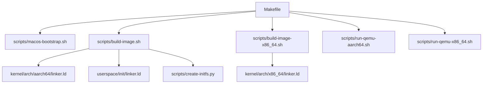
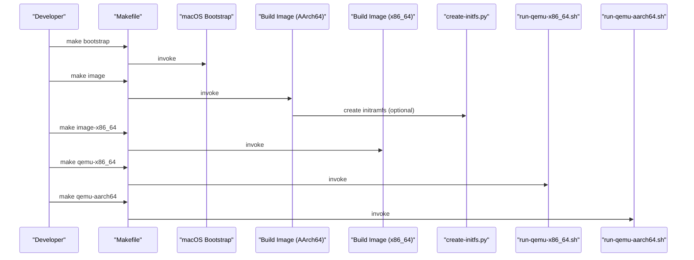
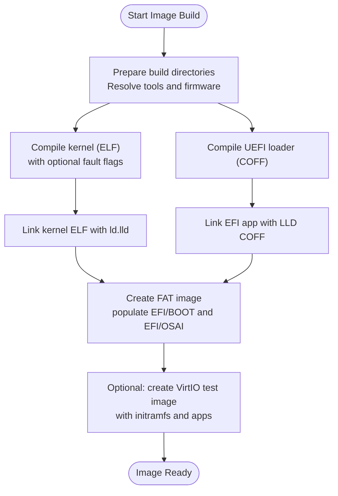
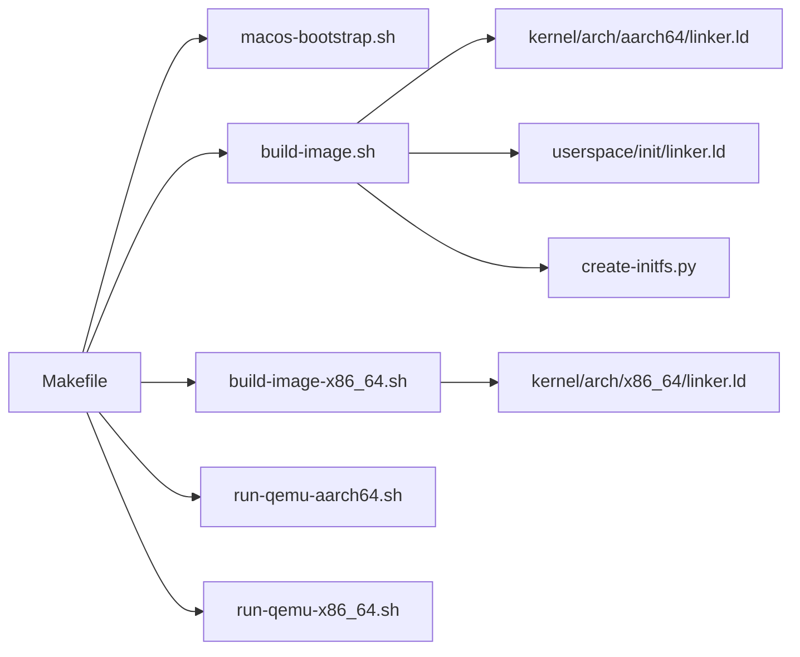

# Build System

<cite>
**Referenced Files in This Document**
- [Makefile](file://Makefile)
- [macos-bootstrap.sh](file://scripts/macos-bootstrap.sh)
- [build-image.sh](file://scripts/build-image.sh)
- [build-image-x86_64.sh](file://scripts/build-image-x86_64.sh)
- [create-initfs.py](file://scripts/create-initfs.py)
- [run-qemu-aarch64.sh](file://scripts/run-qemu-aarch64.sh)
- [run-qemu-x86_64.sh](file://scripts/run-qemu-x86_64.sh)
- [linker.ld (aarch64)](file://kernel/arch/aarch64/linker.ld)
- [linker.ld (x86_64)](file://kernel/arch/x86_64/linker.ld)
- [userspace linker.ld](file://userspace/init/linker.ld)
</cite>

## Table of Contents
1. [Introduction](#introduction)
2. [Project Structure](#project-structure)
3. [Core Components](#core-components)
4. [Architecture Overview](#architecture-overview)
5. [Detailed Component Analysis](#detailed-component-analysis)
6. [Dependency Analysis](#dependency-analysis)
7. [Performance Considerations](#performance-considerations)
8. [Troubleshooting Guide](#troubleshooting-guide)
9. [Conclusion](#conclusion)

## Introduction
This document describes OSAI’s build system and packaging infrastructure. It explains the Makefile orchestration, cross-compilation toolchains for AArch64 and x86_64, image generation for bootable disk images with UEFI loaders and initramfs, macOS bootstrap procedures, and QEMU launch scripts. It also covers build configuration options, optimization levels, and debug symbol generation, along with target relationships and common build issues.

## Project Structure
The build system centers around a Makefile that orchestrates shell scripts and Python helpers. The scripts compile kernel and userspace components for target architectures, produce EFI applications, and assemble bootable images. QEMU launchers run the resulting images with configurable firmware and hardware parameters.

**Diagram sources**
- [Makefile:1-135](file://Makefile#L1-L135)
- [build-image.sh:1-366](file://scripts/build-image.sh#L1-L366)
- [build-image-x86_64.sh:1-141](file://scripts/build-image-x86_64.sh#L1-L141)
- [linker.ld (aarch64):1-49](file://kernel/arch/aarch64/linker.ld#L1-L49)
- [linker.ld (x86_64):1-35](file://kernel/arch/x86_64/linker.ld#L1-L35)
- [userspace linker.ld:1-22](file://userspace/init/linker.ld#L1-L22)
- [create-initfs.py:1-162](file://scripts/create-initfs.py#L1-L162)
- [run-qemu-aarch64.sh:1-162](file://scripts/run-qemu-aarch64.sh#L1-L162)
- [run-qemu-x86_64.sh:1-127](file://scripts/run-qemu-x86_64.sh#L1-L127)

**Section sources**
- [Makefile:1-135](file://Makefile#L1-L135)

## Core Components
- Makefile orchestration: Defines top-level targets, dependency ordering, and invokes scripts for bootstrapping, building images, and launching QEMU tests.
- macOS bootstrap: Validates and locates required tools (Clang via LLVM, LLD, QEMU, Python, Git, mtools) and firmware (AArch64 EDK2/AAVMF).
- AArch64 image builder: Compiles UEFI loader (COFF), kernel (ELF), userspace ELF binaries, and packages them into a FAT image with initramfs.
- x86_64 image builder: Similar pipeline for x86_64 UEFI loader and kernel.
- Initramfs creator: Writes a custom read-only filesystem image containing essential binaries and manifests.
- QEMU launchers: Start emulators with configurable accelerators, machines, CPUs, memory, SMP, and port forwarding.

**Section sources**
- [Makefile:1-135](file://Makefile#L1-L135)
- [macos-bootstrap.sh:1-251](file://scripts/macos-bootstrap.sh#L1-L251)
- [build-image.sh:1-366](file://scripts/build-image.sh#L1-L366)
- [build-image-x86_64.sh:1-141](file://scripts/build-image-x86_64.sh#L1-L141)
- [create-initfs.py:1-162](file://scripts/create-initfs.py#L1-L162)
- [run-qemu-aarch64.sh:1-162](file://scripts/run-qemu-aarch64.sh#L1-L162)
- [run-qemu-x86_64.sh:1-127](file://scripts/run-qemu-x86_64.sh#L1-L127)

## Architecture Overview
The build pipeline compiles architecture-specific kernels and userspace components, links them with appropriate linkers, and packages them into bootable images. QEMU is used to validate the images.

**Diagram sources**
- [Makefile:1-135](file://Makefile#L1-L135)
- [macos-bootstrap.sh:1-251](file://scripts/macos-bootstrap.sh#L1-L251)
- [build-image.sh:1-366](file://scripts/build-image.sh#L1-L366)
- [build-image-x86_64.sh:1-141](file://scripts/build-image-x86_64.sh#L1-L141)
- [create-initfs.py:1-162](file://scripts/create-initfs.py#L1-L162)
- [run-qemu-x86_64.sh:1-127](file://scripts/run-qemu-x86_64.sh#L1-L127)
- [run-qemu-aarch64.sh:1-162](file://scripts/run-qemu-aarch64.sh#L1-L162)

## Detailed Component Analysis

### Makefile Orchestration
- Top-level targets:
  - all depends on bootstrap and image.
  - test depends on bootstrap, image, and qemu-dry-run.
  - image invokes the AArch64 image builder.
  - image-x86_64 invokes the x86_64 image builder.
  - qemu, qemu-aarch64, and qemu-x86_64 launch QEMU with respective images.
  - Dry-run and gate targets invoke QEMU with --dry-run and run test suites.
  - clean removes build, out, and dist directories.
- Dependency ordering ensures prerequisites are built before dependent targets.

**Section sources**
- [Makefile:1-135](file://Makefile#L1-L135)

### macOS Bootstrap Procedures
- Detects host OS and architecture, validates presence of required tools and optional tools, and checks QEMU capabilities and firmware availability.
- Locates LLVM/Clang, LLD, QEMU, Python, Git, Make, hdiutil, diskutil, dd, and mtools.
- Verifies QEMU accelerator and machine support; locates AArch64 EDK2/AAVMF firmware via environment variable or common paths.
- Exits with actionable hints when required tools or firmware are missing.

**Section sources**
- [macos-bootstrap.sh:1-251](file://scripts/macos-bootstrap.sh#L1-L251)

### Cross-Compilation Toolchains and Compiler Flags
- AArch64:
  - UEFI loader compiled with Clang targeting Windows COFF; linked with LLD COFF to produce EFI application.
  - Kernel compiled with Clang targeting bare-metal AArch64 ELF; linked with ld.lld using aarch64 linker script.
  - Userspace ELF binaries compiled and linked similarly; initramfs created with Python helper.
- x86_64:
  - UEFI loader compiled with Clang targeting Windows x86_64 COFF; linked with LLD COFF to produce EFI application.
  - Kernel compiled with Clang targeting bare-metal x86_64 ELF; linked with ld.lld using x86_64 linker script.
- Shared flags:
  - Freestanding, no stack protector, no builtin, no PIC/PIE, strict warnings, and include paths for headers.
- Optional fault injection flags controlled via environment variable during kernel build.

**Section sources**
- [build-image.sh:88-217](file://scripts/build-image.sh#L88-L217)
- [build-image-x86_64.sh:78-126](file://scripts/build-image-x86_64.sh#L78-L126)
- [linker.ld (aarch64):1-49](file://kernel/arch/aarch64/linker.ld#L1-L49)
- [linker.ld (x86_64):1-35](file://kernel/arch/x86_64/linker.ld#L1-L35)

### Image Generation Pipeline
- AArch64:
  - Produces a FAT-formatted image with UEFI loader and kernel under EFI partitions.
  - Creates a separate VirtIO block test image populated with initramfs using the Python helper.
- x86_64:
  - Produces a FAT-formatted image with UEFI loader and kernel under EFI partitions.
- Initramfs:
  - Embeds /init, service-manager, worker, configuration, service descriptor, and CPU-AI model.
  - Supports additional executable overlays via arguments.
  - Enforces fixed layout and sector alignment.

**Diagram sources**
- [build-image.sh:1-366](file://scripts/build-image.sh#L1-L366)
- [build-image-x86_64.sh:1-141](file://scripts/build-image-x86_64.sh#L1-L141)
- [create-initfs.py:94-157](file://scripts/create-initfs.py#L94-L157)

**Section sources**
- [build-image.sh:1-366](file://scripts/build-image.sh#L1-L366)
- [build-image-x86_64.sh:1-141](file://scripts/build-image-x86_64.sh#L1-L141)
- [create-initfs.py:1-162](file://scripts/create-initfs.py#L1-L162)

### QEMU Launch Scripts
- AArch64:
  - Resolves firmware path, selects accelerator (HVF if available, otherwise TCG), sets machine, CPU, memory, SMP, and drives.
  - Supports optional port forwarding and legacy virtio-net device pairing.
- x86_64:
  - Resolves OVMF firmware path, sets machine, CPU, memory, SMP, and drives.
  - Enables port forwarding for SSH-like connectivity.
- Both support a --dry-run mode to print the constructed command without executing.

**Section sources**
- [run-qemu-aarch64.sh:1-162](file://scripts/run-qemu-aarch64.sh#L1-L162)
- [run-qemu-x86_64.sh:1-127](file://scripts/run-qemu-x86_64.sh#L1-L127)

### Target Relationships and Outputs
- make bootstrap: Validates toolchain and firmware; prepares environment.
- make image: Builds AArch64 UEFI loader, kernel, userspace ELFs, FAT image, and optional VirtIO test image.
- make image-x86_64: Builds x86_64 UEFI loader and kernel, FAT image.
- make qemu-aarch64: Runs AArch64 image in QEMU with firmware and networking.
- make qemu-x86_64: Runs x86_64 image in QEMU with OVMF firmware and networking.
- make qemu-dry-run: Prints QEMU commands for both architectures without running.

**Section sources**
- [Makefile:1-135](file://Makefile#L1-L135)

## Dependency Analysis
- Makefile orchestrates scripts and tests.
- AArch64 image builder depends on:
  - Clang/LD.LLVM for compiling/linking.
  - mtools for FAT image manipulation.
  - Python for initramfs creation.
  - Firmware paths resolved by the script.
- x86_64 image builder mirrors the AArch64 pipeline with x86_64 toolchain and firmware.
- QEMU launchers depend on installed QEMU and firmware files, resolving paths via helper functions.

**Diagram sources**
- [Makefile:1-135](file://Makefile#L1-L135)
- [build-image.sh:1-366](file://scripts/build-image.sh#L1-L366)
- [build-image-x86_64.sh:1-141](file://scripts/build-image-x86_64.sh#L1-L141)
- [linker.ld (aarch64):1-49](file://kernel/arch/aarch64/linker.ld#L1-L49)
- [linker.ld (x86_64):1-35](file://kernel/arch/x86_64/linker.ld#L1-L35)
- [userspace linker.ld:1-22](file://userspace/init/linker.ld#L1-L22)
- [create-initfs.py:1-162](file://scripts/create-initfs.py#L1-L162)
- [run-qemu-aarch64.sh:1-162](file://scripts/run-qemu-aarch64.sh#L1-L162)
- [run-qemu-x86_64.sh:1-127](file://scripts/run-qemu-x86_64.sh#L1-L127)

**Section sources**
- [Makefile:1-135](file://Makefile#L1-L135)

## Performance Considerations
- Use HVF acceleration on Apple Silicon for AArch64 emulation when available; otherwise fall back to TCG.
- Adjust memory and SMP settings via environment variables for QEMU runs to balance performance and resource usage.
- Keep toolchain versions aligned (LLVM/Clang, LLD) to avoid unnecessary rebuilds and ensure consistent linking.
- Reuse intermediate artifacts by avoiding unnecessary clean operations during iterative development.

## Troubleshooting Guide
- Missing tools or firmware:
  - Ensure LLVM/Clang, LLD, QEMU, Python, Git, Make, hdiutil, diskutil, dd, and mtools are installed and discoverable.
  - Set firmware paths via environment variables if located outside standard Homebrew prefixes.
- AArch64 image build fails:
  - Verify EDK2/AAVMF firmware availability and correct target paths.
  - Confirm kernel fault test flag values if used.
- x86_64 image build fails:
  - Ensure OVMF firmware is present and readable.
- QEMU fails to start:
  - Check firmware file existence and permissions.
  - Validate image paths and that images were built prior to launching QEMU.
  - Use --dry-run to inspect the generated command and confirm parameters.
- Clean slate:
  - Run make clean to remove build artifacts and retry.

**Section sources**
- [macos-bootstrap.sh:1-251](file://scripts/macos-bootstrap.sh#L1-L251)
- [build-image.sh:1-366](file://scripts/build-image.sh#L1-L366)
- [build-image-x86_64.sh:1-141](file://scripts/build-image-x86_64.sh#L1-L141)
- [run-qemu-aarch64.sh:1-162](file://scripts/run-qemu-aarch64.sh#L1-L162)
- [run-qemu-x86_64.sh:1-127](file://scripts/run-qemu-x86_64.sh#L1-L127)

## Conclusion
OSAI’s build system leverages a Makefile-driven orchestration to coordinate cross-compilation, packaging, and testing across AArch64 and x86_64. The scripts enforce consistent toolchain usage, produce architecture-specific bootable images, and integrate QEMU-based validation. By adhering to the documented environment setup and configuration options, developers can reliably reproduce builds and iterate efficiently.