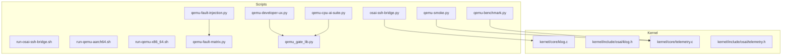
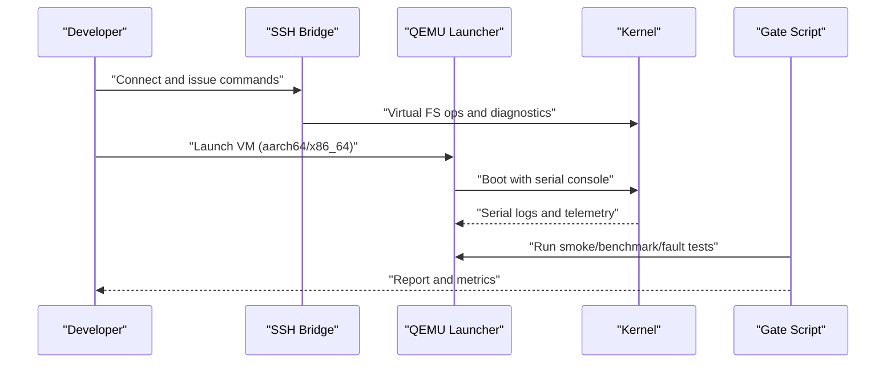
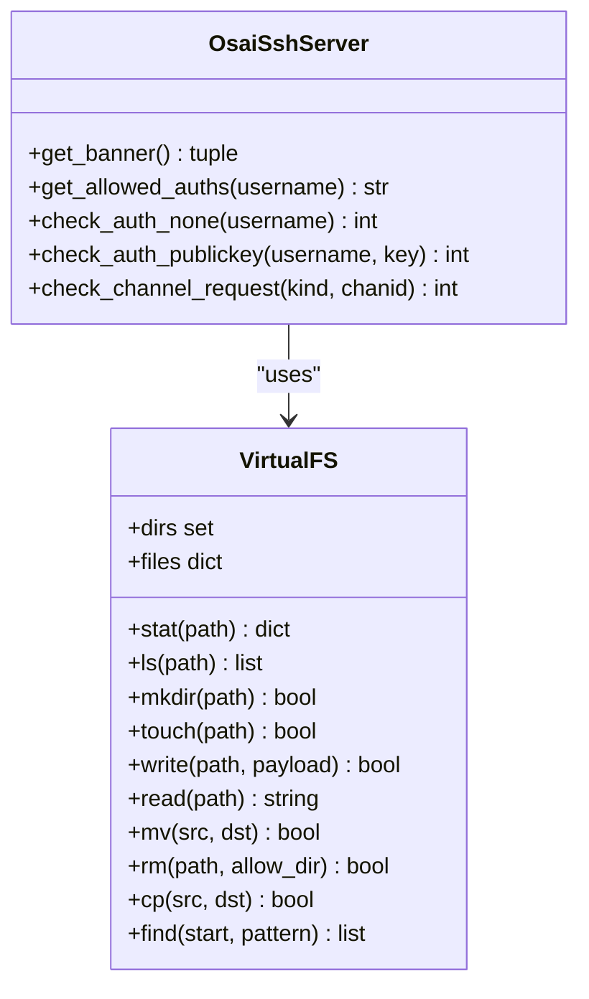
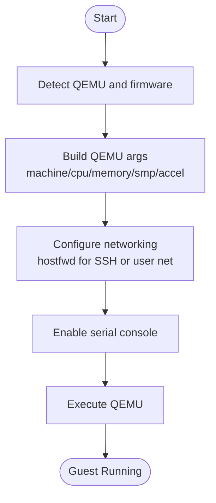
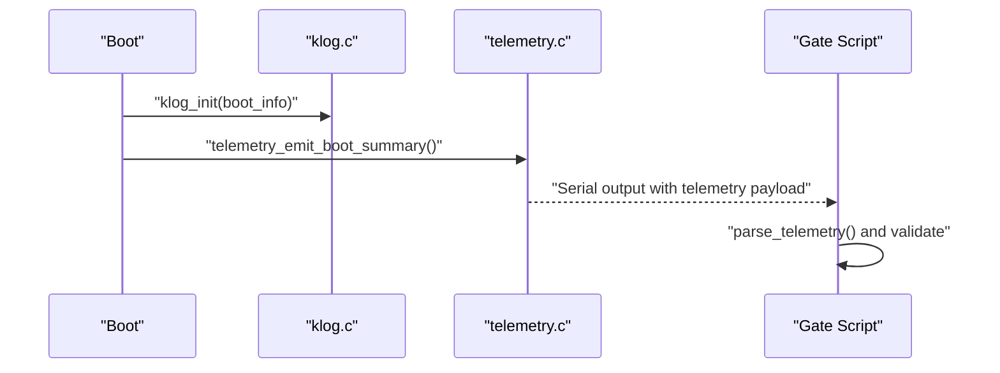
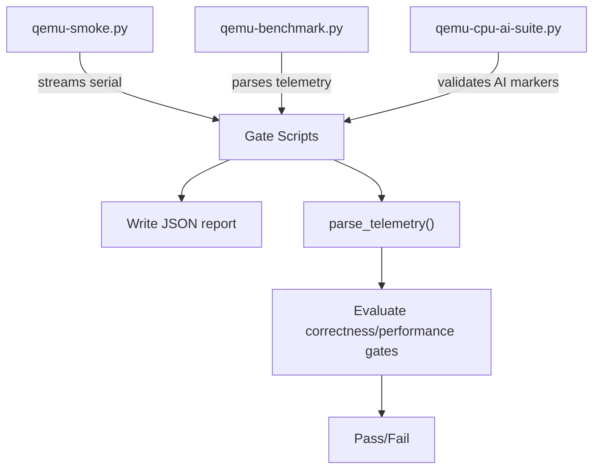
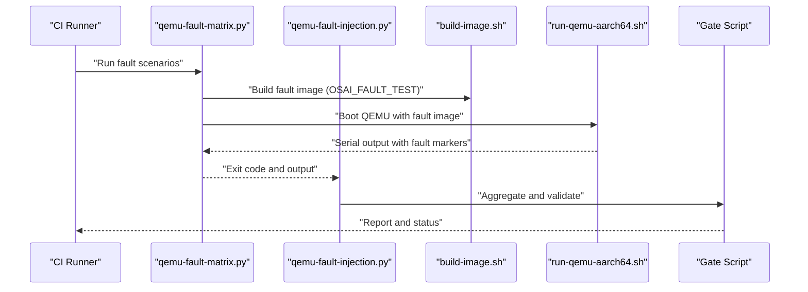
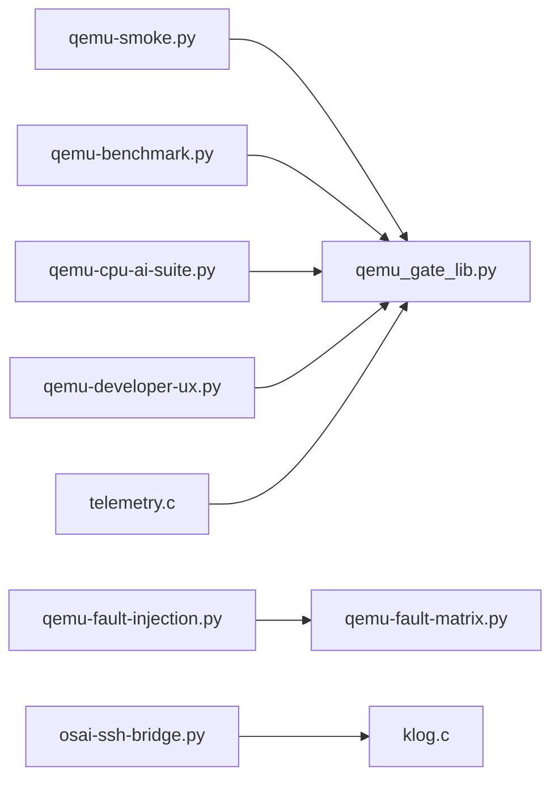

# Debugging and Profiling

<cite>
**Referenced Files in This Document**
- [osai-ssh-bridge.py](file://scripts/osai-ssh-bridge.py)
- [run-osai-ssh-bridge.sh](file://scripts/run-osai-ssh-bridge.sh)
- [run-qemu-aarch64.sh](file://scripts/run-qemu-aarch64.sh)
- [run-qemu-x86_64.sh](file://scripts/run-qemu-x86_64.sh)
- [qemu-developer-ux.py](file://scripts/qemu-developer-ux.py)
- [qemu-fault-injection.py](file://scripts/qemu-fault-injection.py)
- [qemu-fault-matrix.py](file://scripts/qemu-fault-matrix.py)
- [qemu-benchmark.py](file://scripts/qemu-benchmark.py)
- [qemu-smoke.py](file://scripts/qemu-smoke.py)
- [qemu-cpu-ai-suite.py](file://scripts/qemu-cpu-ai-suite.py)
- [qemu_gate_lib.py](file://scripts/qemu_gate_lib.py)
- [klog.c](file://kernel/core/klog.c)
- [klog.h](file://kernel/include/osai/klog.h)
- [telemetry.c](file://kernel/core/telemetry.c)
- [telemetry.h](file://kernel/include/osai/telemetry.h)
</cite>

## Table of Contents
1. [Introduction](#introduction)
2. [Project Structure](#project-structure)
3. [Core Components](#core-components)
4. [Architecture Overview](#architecture-overview)
5. [Detailed Component Analysis](#detailed-component-analysis)
6. [Dependency Analysis](#dependency-analysis)
7. [Performance Considerations](#performance-considerations)
8. [Troubleshooting Guide](#troubleshooting-guide)
9. [Conclusion](#conclusion)
10. [Appendices](#appendices)

## Introduction
This document provides comprehensive debugging and profiling workflows for OSAI development and testing. It covers:
- SSH bridge utilities for remote kernel debugging and log collection
- QEMU launch scripts for aarch64 and x86_64, including debugging flags and monitor access
- Kernel logging and telemetry for diagnostics
- Profiling tools for correctness and performance measurement
- Logging configuration, trace collection, and diagnostic command usage
- Fault injection testing methodologies and systematic debugging approaches
- Common debugging scenarios, error interpretation, and optimization strategies for AI workloads

## Project Structure
OSAI organizes debugging and profiling assets primarily under scripts/ and kernel/. The scripts provide automation for launching QEMU, collecting telemetry, and validating system behavior. The kernel exposes logging and telemetry APIs used during boot and runtime.

**Diagram sources**
- [osai-ssh-bridge.py:1-952](file://scripts/osai-ssh-bridge.py#L1-L952)
- [run-osai-ssh-bridge.sh:1-33](file://scripts/run-osai-ssh-bridge.sh#L1-L33)
- [run-qemu-aarch64.sh:1-162](file://scripts/run-qemu-aarch64.sh#L1-L162)
- [run-qemu-x86_64.sh:1-127](file://scripts/run-qemu-x86_64.sh#L1-L127)
- [qemu-smoke.py:1-388](file://scripts/qemu-smoke.py#L1-L388)
- [qemu-benchmark.py:1-345](file://scripts/qemu-benchmark.py#L1-L345)
- [qemu-fault-injection.py:1-81](file://scripts/qemu-fault-injection.py#L1-L81)
- [qemu-fault-matrix.py:1-136](file://scripts/qemu-fault-matrix.py#L1-L136)
- [qemu-developer-ux.py:1-70](file://scripts/qemu-developer-ux.py#L1-L70)
- [qemu_gate_lib.py:1-127](file://scripts/qemu_gate_lib.py#L1-L127)
- [klog.c:1-101](file://kernel/core/klog.c#L1-L101)
- [klog.h:1-12](file://kernel/include/osai/klog.h#L1-L12)
- [telemetry.c:1-133](file://kernel/core/telemetry.c#L1-L133)
- [telemetry.h:1-7](file://kernel/include/osai/telemetry.h#L1-L7)

**Section sources**
- [osai-ssh-bridge.py:1-952](file://scripts/osai-ssh-bridge.py#L1-L952)
- [run-qemu-aarch64.sh:1-162](file://scripts/run-qemu-aarch64.sh#L1-L162)
- [run-qemu-x86_64.sh:1-127](file://scripts/run-qemu-x86_64.sh#L1-L127)
- [klog.c:1-101](file://kernel/core/klog.c#L1-L101)
- [telemetry.c:1-133](file://kernel/core/telemetry.c#L1-L133)

## Core Components
- SSH Bridge: Provides a virtual filesystem and a restricted command set to collect logs, inspect state, and package diagnostics from the guest OS via SSH.
- QEMU Launchers: Configure machine, CPU, memory, accelerators, and networking for aarch64 and x86_64, enabling serial console and optional host forwarding for SSH.
- Telemetry and Logging: Kernel emits structured telemetry and serial logs for diagnostics and performance measurement.
- Gate Scripts: Validate smoke, correctness, CPU-AI runtime, and developer UX gates; parse telemetry and produce reports.

Key responsibilities:
- Remote diagnostics: SSH bridge commands (ls, cat, head/tail, tar/cpio, find/grep) and virtual filesystem operations
- Boot and runtime tracing: Serial console output and telemetry emission
- Controlled fault injection: Trigger page, read-only, and NX faults and verify safe handling
- Performance and correctness gates: Smoke, benchmark, and AI suite validations

**Section sources**
- [osai-ssh-bridge.py:511-767](file://scripts/osai-ssh-bridge.py#L511-L767)
- [run-qemu-aarch64.sh:132-154](file://scripts/run-qemu-aarch64.sh#L132-L154)
- [run-qemu-x86_64.sh:109-119](file://scripts/run-qemu-x86_64.sh#L109-L119)
- [klog.c:24-100](file://kernel/core/klog.c#L24-L100)
- [telemetry.c:24-132](file://kernel/core/telemetry.c#L24-L132)
- [qemu-smoke.py:10-330](file://scripts/qemu-smoke.py#L10-L330)
- [qemu-benchmark.py:8-340](file://scripts/qemu-benchmark.py#L8-L340)
- [qemu-cpu-ai-suite.py:8-93](file://scripts/qemu-cpu-ai-suite.py#L8-L93)

## Architecture Overview
The debugging and profiling pipeline integrates shell scripts, Python gate validators, and kernel telemetry/logging.

**Diagram sources**
- [osai-ssh-bridge.py:511-767](file://scripts/osai-ssh-bridge.py#L511-L767)
- [run-qemu-aarch64.sh:132-154](file://scripts/run-qemu-aarch64.sh#L132-L154)
- [run-qemu-x86_64.sh:109-119](file://scripts/run-qemu-x86_64.sh#L109-L119)
- [klog.c:24-100](file://kernel/core/klog.c#L24-L100)
- [telemetry.c:24-132](file://kernel/core/telemetry.c#L24-L132)
- [qemu-smoke.py:339-383](file://scripts/qemu-smoke.py#L339-L383)
- [qemu-benchmark.py:22-340](file://scripts/qemu-benchmark.py#L22-L340)

## Detailed Component Analysis

### SSH Bridge Utilities
The SSH bridge provides a restricted shell interface to the guest OS, exposing a virtual filesystem and a curated command set. It supports:
- Directory and file operations (ls, mkdir, touch, cp, mv, rm, rmdir)
- Content operations (cat, head, tail, grep, stat)
- Archive operations (tar, cpio) for packaging diagnostics
- Status and system info queries (status, sysinfo)
- Path normalization and safety checks

**Diagram sources**
- [osai-ssh-bridge.py:54-232](file://scripts/osai-ssh-bridge.py#L54-L232)
- [osai-ssh-bridge.py:770-800](file://scripts/osai-ssh-bridge.py#L770-L800)

Operational tips:
- Use tar -cf/-xf to package logs and artifacts for off-host analysis
- Use head/tail and grep to quickly locate errors in large logs
- Use find to enumerate files matching patterns for targeted investigations

**Section sources**
- [osai-ssh-bridge.py:511-767](file://scripts/osai-ssh-bridge.py#L511-L767)
- [run-osai-ssh-bridge.sh:1-33](file://scripts/run-osai-ssh-bridge.sh#L1-L33)

### QEMU Launch Scripts and Monitor Access
Two dedicated launchers configure VMs for aarch64 and x86_64:
- Machine, CPU, memory, SMP, accelerators, and firmware selection
- Serial console enabled for logs
- Networking via virtio-net with optional hostfwd for SSH
- Optional dry-run to preview generated command lines

**Diagram sources**
- [run-qemu-aarch64.sh:132-154](file://scripts/run-qemu-aarch64.sh#L132-L154)
- [run-qemu-x86_64.sh:109-119](file://scripts/run-qemu-x86_64.sh#L109-L119)

Debugging flags and monitor access:
- Serial console: -nographic and -serial mon:stdio enable console output
- Host forwarding: -netdev user,id=net0,hostfwd=tcp::PORT-:22 enables SSH to port PORT on host
- Firmware: -drive if=pflash,format=raw,readonly,file=FIRMWARE selects UEFI firmware

**Section sources**
- [run-qemu-aarch64.sh:98-154](file://scripts/run-qemu-aarch64.sh#L98-L154)
- [run-qemu-x86_64.sh:96-119](file://scripts/run-qemu-x86_64.sh#L96-L119)

### Kernel Logging and Telemetry
Kernel logging:
- klog_init initializes UART base from boot info
- klog emits formatted messages to serial console
- Used extensively by boot stages and subsystems

Telemetry:
- telemetry_emit_boot_summary prints a structured telemetry payload containing counters for memory, storage, networking, AI runtime, and security
- Gate scripts parse the last telemetry line to validate correctness and performance gates

**Diagram sources**
- [klog.c:24-100](file://kernel/core/klog.c#L24-L100)
- [telemetry.c:24-132](file://kernel/core/telemetry.c#L24-L132)
- [qemu_gate_lib.py:49-57](file://scripts/qemu_gate_lib.py#L49-L57)

**Section sources**
- [klog.c:24-100](file://kernel/core/klog.c#L24-L100)
- [klog.h:1-12](file://kernel/include/osai/klog.h#L1-L12)
- [telemetry.c:24-132](file://kernel/core/telemetry.c#L24-L132)
- [telemetry.h:1-7](file://kernel/include/osai/telemetry.h#L1-L7)
- [qemu_gate_lib.py:49-57](file://scripts/qemu_gate_lib.py#L49-L57)

### Profiling Tools and Correctness Gates
Smoke tests:
- qemu-smoke.py launches QEMU, streams serial output, and validates presence of expected markers indicating successful subsystem initialization and basic functionality

Benchmark:
- qemu-benchmark.py runs smoke and parses telemetry to enforce correctness gates (e.g., minimums for AI runtime, mutable FS, persistence, network queues)
- Emits a structured report with pass/fail status and detailed telemetry

CPU-AI Suite:
- qemu-cpu-ai-suite.py validates CPU-only AI runtime behavior and counter thresholds

Developer UX:
- qemu-developer-ux.py ensures required Makefile targets and documentation markers exist and that dry-run commands succeed

**Diagram sources**
- [qemu-smoke.py:339-383](file://scripts/qemu-smoke.py#L339-L383)
- [qemu-benchmark.py:22-340](file://scripts/qemu-benchmark.py#L22-L340)
- [qemu-cpu-ai-suite.py:43-93](file://scripts/qemu-cpu-ai-suite.py#L43-L93)
- [qemu-developer-ux.py:32-65](file://scripts/qemu-developer-ux.py#L32-L65)
- [qemu_gate_lib.py:49-57](file://scripts/qemu_gate_lib.py#L49-L57)

**Section sources**
- [qemu-smoke.py:10-330](file://scripts/qemu-smoke.py#L10-L330)
- [qemu-benchmark.py:8-340](file://scripts/qemu-benchmark.py#L8-L340)
- [qemu-cpu-ai-suite.py:8-93](file://scripts/qemu-cpu-ai-suite.py#L8-L93)
- [qemu-developer-ux.py:28-65](file://scripts/qemu-developer-ux.py#L28-L65)
- [qemu_gate_lib.py:16-31](file://scripts/qemu_gate_lib.py#L16-L31)

### Fault Injection Testing
Controlled fault injection validates robustness by triggering specific exceptions and ensuring safe handling:
- qemu-fault-matrix.py triggers page, read-only data, and NX execute faults and verifies expected exception classes and controlled fault reporting
- qemu-fault-injection.py orchestrates fault matrix and smoke tests, aggregates markers, and produces a report

**Diagram sources**
- [qemu-fault-matrix.py:38-97](file://scripts/qemu-fault-matrix.py#L38-L97)
- [qemu-fault-injection.py:42-76](file://scripts/qemu-fault-injection.py#L42-L76)

**Section sources**
- [qemu-fault-matrix.py:10-97](file://scripts/qemu-fault-matrix.py#L10-L97)
- [qemu-fault-injection.py:42-76](file://scripts/qemu-fault-injection.py#L42-L76)

### Logging Configuration and Trace Collection
- Serial console: Both launchers enable -nographic and -serial mon:stdio to stream kernel logs
- SSH bridge diagnostics: Use cat/head/tail/grep/find to inspect logs and artifacts
- Telemetry parsing: Gate scripts extract the last telemetry line and validate against contracts

Recommended collection procedure:
- Boot QEMU with serial console enabled
- Capture serial output to a file
- Extract telemetry payload and validate against expected gates
- Package logs with tar/cpio for off-host analysis

**Section sources**
- [run-qemu-aarch64.sh:138-139](file://scripts/run-qemu-aarch64.sh#L138-L139)
- [run-qemu-x86_64.sh:114-115](file://scripts/run-qemu-x86_64.sh#L114-L115)
- [osai-ssh-bridge.py:511-767](file://scripts/osai-ssh-bridge.py#L511-L767)
- [qemu_gate_lib.py:49-57](file://scripts/qemu_gate_lib.py#L49-L57)

### Kernel Debugging Techniques
While OSAI’s kernel is minimal and debugged primarily via serial logs and telemetry, the following techniques apply:
- Breakpoint insertion: Not applicable in current scripts; rely on serial logs and telemetry
- Register inspection: Not exposed in current scripts; use serial logs to correlate events
- Memory analysis: Use telemetry counters for PMM, arena, and mutable FS to infer memory usage trends

Practical steps:
- Enable serial console and capture logs
- Correlate subsystem logs with telemetry counters
- Use SSH bridge to collect and archive logs for offline analysis

**Section sources**
- [klog.c:24-100](file://kernel/core/klog.c#L24-L100)
- [telemetry.c:24-132](file://kernel/core/telemetry.c#L24-L132)

## Dependency Analysis
The scripts depend on each other and on the kernel telemetry/log outputs. Gate scripts depend on qemu_gate_lib for common utilities like process execution, telemetry parsing, and report writing.

**Diagram sources**
- [qemu_smoke.py:339-383](file://scripts/qemu-smoke.py#L339-L383)
- [qemu_benchmark.py:22-340](file://scripts/qemu-benchmark.py#L22-L340)
- [qemu_fault-injection.py:42-76](file://scripts/qemu-fault-injection.py#L42-L76)
- [qemu-fault-matrix.py:38-97](file://scripts/qemu-fault-matrix.py#L38-L97)
- [qemu-cpu-ai-suite.py:43-93](file://scripts/qemu-cpu-ai-suite.py#L43-L93)
- [qemu-developer-ux.py:32-65](file://scripts/qemu-developer-ux.py#L32-L65)
- [qemu_gate_lib.py:16-31](file://scripts/qemu_gate_lib.py#L16-L31)
- [klog.c:24-100](file://kernel/core/klog.c#L24-L100)
- [telemetry.c:24-132](file://kernel/core/telemetry.c#L24-L132)

**Section sources**
- [qemu_gate_lib.py:1-127](file://scripts/qemu_gate_lib.py#L1-L127)

## Performance Considerations
- Prefer dry-run modes to validate configurations before launching VMs
- Use accelerators (e.g., hvf for macOS) when available to reduce overhead
- Limit concurrent gate executions to avoid resource contention
- Focus on telemetry-driven gates to quantify performance and correctness baselines

[No sources needed since this section provides general guidance]

## Troubleshooting Guide
Common scenarios and resolutions:
- Missing firmware: Ensure OVMF/AAVMF paths are correct or set environment variables to point to firmware images
- SSH connectivity: Verify hostfwd configuration and port availability
- Missing telemetry: Confirm serial console is enabled and that the last telemetry line is present
- Gate failures: Inspect parsed telemetry keys and adjust expectations or fix underlying issues

Diagnostic commands:
- Use SSH bridge to list and filter logs
- Use tar/cpio to package artifacts for analysis
- Use grep to locate specific error markers

**Section sources**
- [run-qemu-aarch64.sh:41-96](file://scripts/run-qemu-aarch64.sh#L41-L96)
- [run-qemu-x86_64.sh:41-94](file://scripts/run-qemu-x86_64.sh#L41-L94)
- [osai-ssh-bridge.py:511-767](file://scripts/osai-ssh-bridge.py#L511-L767)
- [qemu_gate_lib.py:49-57](file://scripts/qemu_gate_lib.py#L49-L57)

## Conclusion
OSAI’s debugging and profiling ecosystem combines serial console logging, kernel telemetry, and Python-based gate scripts to validate correctness and performance. The SSH bridge simplifies remote diagnostics and artifact collection. By leveraging dry-run modes, accelerators, and telemetry-driven gates, developers can efficiently troubleshoot and optimize AI workloads in the OSAI environment.

[No sources needed since this section summarizes without analyzing specific files]

## Appendices

### Appendix A: Quick Reference
- Launch aarch64 VM: [run-qemu-aarch64.sh:1-162](file://scripts/run-qemu-aarch64.sh#L1-L162)
- Launch x86_64 VM: [run-qemu-x86_64.sh:1-127](file://scripts/run-qemu-x86_64.sh#L1-L127)
- SSH bridge: [osai-ssh-bridge.py:511-767](file://scripts/osai-ssh-bridge.py#L511-L767), [run-osai-ssh-bridge.sh:1-33](file://scripts/run-osai-ssh-bridge.sh#L1-L33)
- Smoke test: [qemu-smoke.py:339-383](file://scripts/qemu-smoke.py#L339-L383)
- Benchmark: [qemu-benchmark.py:22-340](file://scripts/qemu-benchmark.py#L22-L340)
- CPU-AI suite: [qemu-cpu-ai-suite.py:43-93](file://scripts/qemu-cpu-ai-suite.py#L43-L93)
- Fault injection: [qemu-fault-injection.py:42-76](file://scripts/qemu-fault-injection.py#L42-L76), [qemu-fault-matrix.py:38-97](file://scripts/qemu-fault-matrix.py#L38-L97)
- Developer UX: [qemu-developer-ux.py:32-65](file://scripts/qemu-developer-ux.py#L32-L65)
- Kernel logging: [klog.c:24-100](file://kernel/core/klog.c#L24-L100), [klog.h:1-12](file://kernel/include/osai/klog.h#L1-L12)
- Telemetry: [telemetry.c:24-132](file://kernel/core/telemetry.c#L24-L132), [telemetry.h:1-7](file://kernel/include/osai/telemetry.h#L1-L7)
- Gate utilities: [qemu_gate_lib.py:16-31](file://scripts/qemu_gate_lib.py#L16-L31)

[No sources needed since this appendix lists references already cited above]