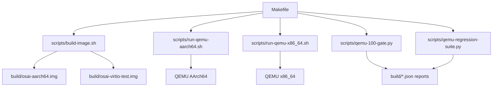
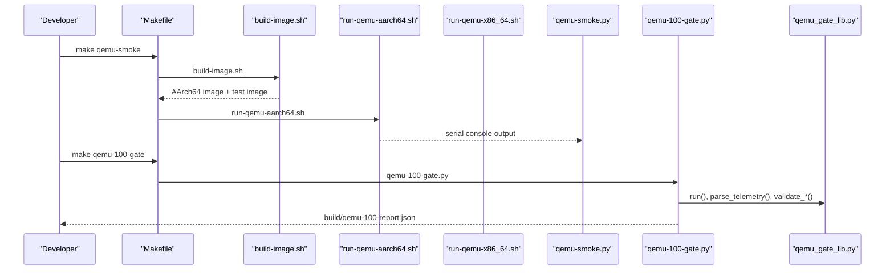
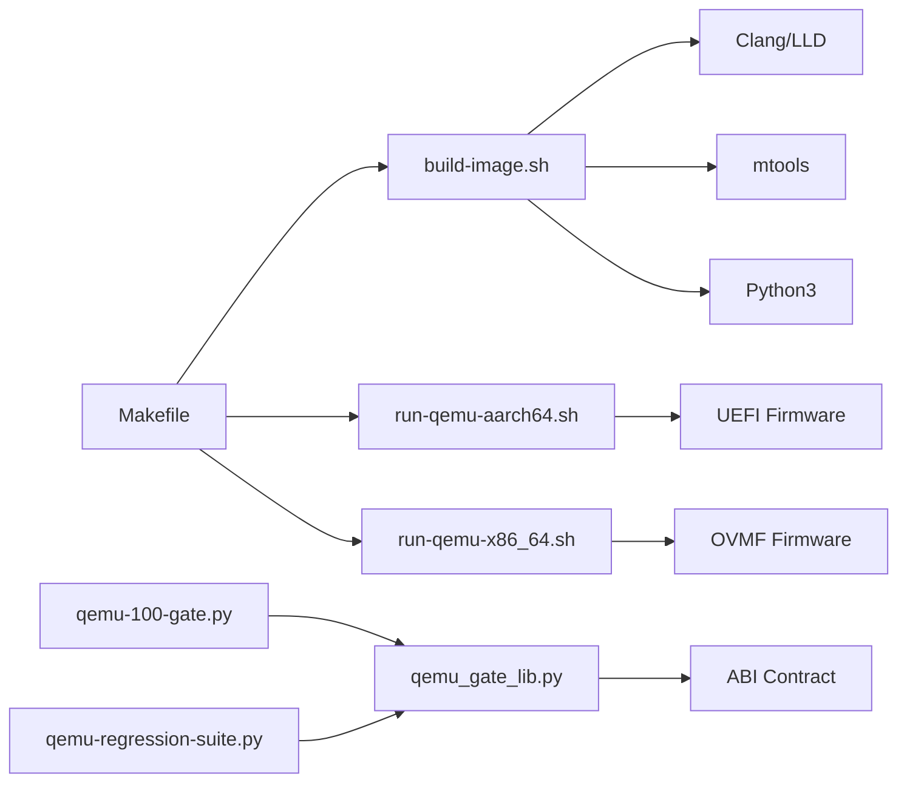

# Development Tools

<cite>
**Referenced Files in This Document**
- [Makefile](file://Makefile)
- [README.md](file://README.md)
- [scripts/build-image.sh](file://scripts/build-image.sh)
- [scripts/build-image-x86_64.sh](file://scripts/build-image-x86_64.sh)
- [scripts/create-initfs.py](file://scripts/create-initfs.py)
- [scripts/macos-bootstrap.sh](file://scripts/macos-bootstrap.sh)
- [scripts/run-qemu-aarch64.sh](file://scripts/run-qemu-aarch64.sh)
- [scripts/run-qemu-x86_64.sh](file://scripts/run-qemu-x86_64.sh)
- [scripts/qemu_gate_lib.py](file://scripts/qemu_gate_lib.py)
- [scripts/qemu-smoke.py](file://scripts/qemu-smoke.py)
- [scripts/qemu-100-gate.py](file://scripts/qemu-100-gate.py)
- [scripts/qemu-regression-suite.py](file://scripts/qemu-regression-suite.py)
- [requirements-dev.txt](file://requirements-dev.txt)
</cite>

## Table of Contents
1. [Introduction](#introduction)
2. [Project Structure](#project-structure)
3. [Core Components](#core-components)
4. [Architecture Overview](#architecture-overview)
5. [Detailed Component Analysis](#detailed-component-analysis)
6. [Dependency Analysis](#dependency-analysis)
7. [Performance Considerations](#performance-considerations)
8. [Troubleshooting Guide](#troubleshooting-guide)
9. [Conclusion](#conclusion)
10. [Appendices](#appendices)

## Introduction
This document describes the development tools that power OSAI’s build system and testing framework. It explains how Make orchestrates the build and test workflows, how cross-compilation toolchains produce kernel and userspace artifacts, and how image generation scripts assemble bootable images for QEMU. It also documents the QEMU testing framework, including smoke tests, milestone gates, regression suites, and developer UX helpers. Guidance is included for debugging, profiling, continuous integration, and quality assurance.

## Project Structure
The development tooling centers on a Makefile-driven workflow with shell and Python scripts under scripts/. The build produces AArch64 and x86_64 artifacts, creates FAT UEFI boot images, and prepares initramfs images for userspace. QEMU launchers configure emulators with firmware, virtual disks, and networking. Gate scripts validate correctness and telemetry against contracts.

**Diagram sources**
- [Makefile:1-135](file://Makefile#L1-L135)
- [scripts/build-image.sh:1-366](file://scripts/build-image.sh#L1-L366)
- [scripts/run-qemu-aarch64.sh:1-162](file://scripts/run-qemu-aarch64.sh#L1-L162)
- [scripts/run-qemu-x86_64.sh:1-127](file://scripts/run-qemu-x86_64.sh#L1-L127)
- [scripts/qemu-100-gate.py:1-55](file://scripts/qemu-100-gate.py#L1-L55)
- [scripts/qemu-regression-suite.py:1-86](file://scripts/qemu-regression-suite.py#L1-L86)

**Section sources**
- [Makefile:1-135](file://Makefile#L1-L135)
- [README.md:63-75](file://README.md#L63-L75)

## Core Components
- Makefile orchestration: Defines targets for building images, launching QEMU, running smoke and gate tests, and cleaning artifacts.
- Cross-compilation toolchain: Uses Clang and LLD to compile kernel and userspace for AArch64 and x86_64.
- Image generation: Creates UEFI FAT images and VirtIO test images with initramfs content.
- QEMU launchers: Configure firmware, accelerators, machines, CPUs, memory, SMP, and networking.
- Testing framework: Smoke tests, milestone gates, regression suites, and developer UX helpers.
- Gate library: Shared utilities for running commands, parsing telemetry, validating ABI/contract, and writing reports.

**Section sources**
- [Makefile:1-135](file://Makefile#L1-L135)
- [scripts/build-image.sh:1-366](file://scripts/build-image.sh#L1-L366)
- [scripts/run-qemu-aarch64.sh:1-162](file://scripts/run-qemu-aarch64.sh#L1-L162)
- [scripts/run-qemu-x86_64.sh:1-127](file://scripts/run-qemu-x86_64.sh#L1-L127)
- [scripts/qemu_gate_lib.py:1-127](file://scripts/qemu_gate_lib.py#L1-L127)

## Architecture Overview
The build-and-test pipeline integrates shell scripts, Python gate utilities, and QEMU emulators. The Makefile coordinates high-level tasks, delegating to specialized scripts for toolchain invocation, image assembly, and VM execution. Gate scripts encapsulate validation logic and produce structured reports.

**Diagram sources**
- [Makefile:31-32](file://Makefile#L31-L32)
- [scripts/build-image.sh:12-21](file://scripts/build-image.sh#L12-L21)
- [scripts/run-qemu-aarch64.sh:132-161](file://scripts/run-qemu-aarch64.sh#L132-L161)
- [scripts/qemu-smoke.py:339-387](file://scripts/qemu-smoke.py#L339-L387)
- [scripts/qemu-100-gate.py:22-55](file://scripts/qemu-100-gate.py#L22-L55)
- [scripts/qemu_gate_lib.py:16-31](file://scripts/qemu_gate_lib.py#L16-L31)

## Detailed Component Analysis

### Build System Orchestration (Makefile)
- Phony targets cover all-in-one builds, image creation, QEMU runs, dry-run checks, smoke tests, milestone gates, regression suites, benchmarks, fault injection, and cleanup.
- Targets delegate to scripts for platform-specific actions and orchestrate multi-stage workflows (e.g., image-x86_64 depends on image-x86_64 script).
- Dry-run targets for QEMU emit the constructed command without executing it.

Key behaviors:
- Bootstrap and test sequences prepare the environment and run minimal checks.
- Image targets compile kernel and userspace and assemble FAT images.
- QEMU targets launch emulators with configurable accelerators, machines, CPUs, memory, SMP, and networking.

**Section sources**
- [Makefile:1-135](file://Makefile#L1-L135)

### Cross-Compilation Toolchain
- AArch64 toolchain: Clang compiles assembly and C sources with freestanding flags; LLD links with custom linker scripts.
- x86_64 toolchain: Similar pattern for userspace and kernel components.
- Fault injection toggles controlled via environment variable during kernel compilation.

Toolchain highlights:
- Freestanding compilation flags (-ffreestanding, -fno-builtin, -fno-pic/-fno-pie).
- Explicit inclusion of kernel and userspace headers.
- Optional fault-testing modes for kernel components.

**Section sources**
- [scripts/build-image.sh:88-217](file://scripts/build-image.sh#L88-L217)
- [scripts/build-image.sh:219-277](file://scripts/build-image.sh#L219-L277)
- [scripts/build-image.sh:313-337](file://scripts/build-image.sh#L313-L337)
- [scripts/build-image.sh:126-135](file://scripts/build-image.sh#L126-L135)

### Image Generation Scripts
- AArch64 image creation:
  - Builds UEFI loader (COFF) and kernel ELF.
  - Creates FAT image, populates EFI directories, copies loader and kernel.
  - Generates a VirtIO test block image with a magic header and initramfs via Python helper.
- x86_64 image creation:
  - Delegated to a dedicated script (invoked by Makefile target).

Image assembly steps:
- Zero-filled disk images, format with mtools, create directories, copy binaries.
- Initramfs packaging driven by a Python script that consumes init ELF, service-manager ELF, worker ELF, configuration, and app binaries.

**Section sources**
- [scripts/build-image.sh:342-366](file://scripts/build-image.sh#L342-L366)
- [scripts/create-initfs.py](file://scripts/create-initfs.py)
- [Makefile:12-16](file://Makefile#L12-L16)

### QEMU Launchers and Configuration
- AArch64 launcher:
  - Detects firmware candidates and sets machine, CPU, memory, SMP, accelerators (prefers hvf on macOS, falls back to tcg).
  - Configures serial console, pflash firmware, virtio disk for the boot image, and optional VirtIO test block.
  - Supports host forwarding for SSH and adds a second net device.
- x86_64 launcher:
  - Detects OVMF firmware, sets machine, CPU, memory, SMP.
  - Configures serial console, pflash firmware, virtio disk for the x86_64 image, and user-forwarded SSH port.

Environment overrides:
- Acceleration, machine, CPU, memory, SMP, firmware paths, and image paths are configurable via environment variables.

**Section sources**
- [scripts/run-qemu-aarch64.sh:41-161](file://scripts/run-qemu-aarch64.sh#L41-L161)
- [scripts/run-qemu-x86_64.sh:41-126](file://scripts/run-qemu-x86_64.sh#L41-L126)

### Testing Framework: Smoke Tests
- qemu-smoke.py:
  - Spawns a QEMU AArch64 instance via Make.
  - Streams serial output and scans for a comprehensive list of expected boot and runtime markers.
  - Validates presence of a complete telemetry JSON line.
  - Times out after a configurable duration and cancels the process if needed.
  - Produces pass/fail outcomes suitable for gating.

Validation scope:
- Kernel subsystems, filesystems, networking, security, AI cell, CPU AI runtime, userspace services, and app binaries.

**Section sources**
- [scripts/qemu-smoke.py:10-330](file://scripts/qemu-smoke.py#L10-L330)
- [scripts/qemu-smoke.py:339-387](file://scripts/qemu-smoke.py#L339-L387)

### Milestone Gates and Regression Suites
- qemu-100-gate.py:
  - Executes a curated sequence of milestone gates and related tests.
  - Aggregates results into a structured report with pass/fail status and timestamps.
- qemu_gate_lib.py:
  - Provides shared primitives: running commands with timeouts, writing reports, loading contracts, parsing telemetry, checking markers, validating syscall ABI and capabilities, and computing status.
- qemu-regression-suite.py:
  - Runs smoke, parses telemetry, validates against the ABI/contract, and checks groups of markers for process lifecycle, filesystem rollback, AI Cell conflicts, network state, and security denials.
  - Emits a detailed report with telemetry keys and failure lists.

**Section sources**
- [scripts/qemu-100-gate.py:1-55](file://scripts/qemu-100-gate.py#L1-L55)
- [scripts/qemu_gate_lib.py:1-127](file://scripts/qemu_gate_lib.py#L1-L127)
- [scripts/qemu-regression-suite.py:1-86](file://scripts/qemu-regression-suite.py#L1-L86)

### Developer Utilities and SSH Bridge
- macOS bootstrap script:
  - Verifies tools (QEMU, Clang, LLD, Python, Git, Make, mtools) and firmware availability.
  - Checks for HVF acceleration and required machine support.
  - Emits actionable guidance for fixing missing prerequisites.
- SSH bridge:
  - Provides a convenience target to forward ports and connect to the guest for remote login.

**Section sources**
- [scripts/macos-bootstrap.sh:148-250](file://scripts/macos-bootstrap.sh#L148-L250)
- [README.md:70-75](file://README.md#L70-L75)

## Dependency Analysis
The development tools form a layered dependency graph:
- Makefile depends on shell scripts for build and QEMU execution.
- Shell scripts depend on system tools (Clang, LLD, mtools, Python) and firmware images.
- Python gate scripts depend on qemu_gate_lib.py and the ABI/contract definition.
- Reports produced by gate scripts are consumed by developers and CI.

**Diagram sources**
- [Makefile:1-135](file://Makefile#L1-L135)
- [scripts/build-image.sh:78-84](file://scripts/build-image.sh#L78-L84)
- [scripts/run-qemu-aarch64.sh:93-96](file://scripts/run-qemu-aarch64.sh#L93-L96)
- [scripts/run-qemu-x86_64.sh:91-94](file://scripts/run-qemu-x86_64.sh#L91-L94)
- [scripts/qemu-100-gate.py:22-55](file://scripts/qemu-100-gate.py#L22-L55)
- [scripts/qemu_gate_lib.py:16-46](file://scripts/qemu_gate_lib.py#L16-L46)

**Section sources**
- [Makefile:1-135](file://Makefile#L1-L135)
- [scripts/qemu_gate_lib.py:119-127](file://scripts/qemu_gate_lib.py#L119-L127)

## Performance Considerations
- Acceleration selection:
  - AArch64 launcher prefers hvf on macOS; falls back to tcg if unavailable.
  - x86_64 launcher defaults to tcg; override via environment for acceleration.
- Resource sizing:
  - Memory, SMP, and CPU are configurable via environment variables to balance performance and host resources.
- Telemetry-driven validation:
  - Regression suite validates telemetry against contract thresholds to detect regressions.

[No sources needed since this section provides general guidance]

## Troubleshooting Guide
Common issues and remedies:
- Missing tools or firmware:
  - Use the macOS bootstrap script to verify tool availability and firmware paths; export firmware variables if located outside standard paths.
- QEMU acceleration:
  - Ensure QEMU supports hvf (macOS) or equivalent acceleration; otherwise, rely on tcg.
- Missing images:
  - Build images first (make image or make image-x86_64) or set the appropriate image path variables.
- Port forwarding:
  - For SSH access, ensure hostfwd is enabled and the port matches the expected value.
- Gate failures:
  - Review generated JSON reports in build/ for detailed failure lists and telemetry keys.

**Section sources**
- [scripts/macos-bootstrap.sh:235-239](file://scripts/macos-bootstrap.sh#L235-L239)
- [scripts/run-qemu-aarch64.sh:93-106](file://scripts/run-qemu-aarch64.sh#L93-L106)
- [scripts/run-qemu-x86_64.sh:103-107](file://scripts/run-qemu-x86_64.sh#L103-L107)
- [README.md:70-75](file://README.md#L70-L75)

## Conclusion
OSAI’s development tools provide a cohesive workflow for building, assembling, and validating the operating system across architectures. The Makefile orchestrates tasks, shell scripts manage cross-compilation and image creation, and Python-based gates enforce correctness and telemetry contracts. Together, these tools enable rapid iteration, reliable regression detection, and smooth developer onboarding.

[No sources needed since this section summarizes without analyzing specific files]

## Appendices

### Continuous Integration Setup
- Recommended pipeline stages:
  - Bootstrap: install dependencies and verify firmware.
  - Build: compile kernel and userspace for target architectures.
  - Image: generate FAT boot images and test images.
  - Test: run smoke tests and regression suites.
  - Gate: execute milestone gates and publish reports.
- Environment variables:
  - Configure accelerators, firmware paths, and image paths as needed for CI runners.
- Artifacts:
  - Store build outputs and gate reports for traceability.

[No sources needed since this section provides general guidance]

### Quality Assurance Procedures
- Smoke tests: baseline boot and runtime coverage.
- Regression suites: contract-driven validation of critical subsystems.
- Milestone gates: aggregated pass/fail for feature completeness.
- Telemetry validation: ensure metrics meet contract-defined thresholds.

**Section sources**
- [scripts/qemu-regression-suite.py:46-82](file://scripts/qemu-regression-suite.py#L46-L82)
- [scripts/qemu-100-gate.py:22-50](file://scripts/qemu-100-gate.py#L22-L50)

### Tool Configuration and Customization
- Environment variables:
  - AArch64: firmware path, accelerator, machine, CPU, memory, SMP, image paths, hostfwd port.
  - x86_64: firmware path, accelerator, machine, CPU, memory, SMP, image path.
  - Fault injection: toggle kernel fault-testing modes via environment.
- Gate customization:
  - Modify gate command sequences and report schemas in gate scripts.
- Dependencies:
  - Python dependency for SSH bridge and gate scripts is specified in requirements.

**Section sources**
- [scripts/run-qemu-aarch64.sh:98-118](file://scripts/run-qemu-aarch64.sh#L98-L118)
- [scripts/run-qemu-x86_64.sh:96-101](file://scripts/run-qemu-x86_64.sh#L96-L101)
- [scripts/build-image.sh:126-135](file://scripts/build-image.sh#L126-L135)
- [requirements-dev.txt:1-2](file://requirements-dev.txt#L1-L2)