# Testing Framework

<cite>
**Referenced Files in This Document**
- [README.md](file://README.md)
- [Makefile](file://Makefile)
- [scripts/qemu-smoke.py](file://scripts/qemu-smoke.py)
- [scripts/qemu-benchmark.py](file://scripts/qemu-benchmark.py)
- [scripts/qemu-preview.py](file://scripts/qemu-preview.py)
- [scripts/qemu-readiness-gate.py](file://scripts/qemu-readiness-gate.py)
- [scripts/qemu-milestone-gate.py](file://scripts/qemu-milestone-gate.py)
- [scripts/qemu-regression-suite.py](file://scripts/qemu-regression-suite.py)
- [scripts/qemu-full-os-rc.py](file://scripts/qemu-full-os-rc.py)
- [scripts/qemu-cpu-matrix.py](file://scripts/qemu-cpu-matrix.py)
- [scripts/qemu_gate_lib.py](file://scripts/qemu_gate_lib.py)
- [scripts/run-qemu-aarch64.sh](file://scripts/run-qemu-aarch64.sh)
- [scripts/run-qemu-x86_64.sh](file://scripts/run-qemu-x86_64.sh)
- [contracts/qemu-rc-v1.json](file://contracts/qemu-rc-v1.json)
</cite>

## Table of Contents
1. [Introduction](#introduction)
2. [Project Structure](#project-structure)
3. [Core Components](#core-components)
4. [Architecture Overview](#architecture-overview)
5. [Detailed Component Analysis](#detailed-component-analysis)
6. [Dependency Analysis](#dependency-analysis)
7. [Performance Considerations](#performance-considerations)
8. [Troubleshooting Guide](#troubleshooting-guide)
9. [Conclusion](#conclusion)
10. [Appendices](#appendices)

## Introduction
This document describes OSAI’s QEMU-based automated testing infrastructure. It covers smoke tests for basic functionality verification, milestone gates for feature completion validation, regression suites for stability assurance, and OS Runtime Contract testing. It also explains the test execution workflow, test case organization, result reporting mechanisms, continuous integration pipelines, configuration options, timeouts, failure handling, and guidance for writing and extending tests. Finally, it outlines environment setup, resource requirements, and performance benchmarking capabilities.

## Project Structure
The testing framework is organized around Python orchestration scripts and supporting shell helpers:
- Smoke tests: qemu-smoke.py drives QEMU and asserts a broad set of boot-time and runtime markers.
- Benchmark pipeline: qemu-benchmark.py validates telemetry and gates for correctness-only claims.
- Preview and readiness: qemu-preview.py and qemu-readiness-gate.py assemble and validate cross-artifact contracts.
- Milestone gates: qemu-milestone-gate.py validates specific subsystems against contract-defined telemetry and markers.
- Regression suite: qemu-regression-suite.py aggregates smoke and contract checks into a single report.
- Full OS release candidate: qemu-full-os-rc.py orchestrates readiness, benchmark, preview, CPU matrix, and contract validation into a consolidated report.
- CPU matrix: qemu-cpu-matrix.py probes a wide range of CPU/accelerator combinations for boot feasibility.
- Gate library: qemu_gate_lib.py centralizes common utilities for running commands, parsing telemetry, and writing reports.
- Shell runners: run-qemu-aarch64.sh and run-qemu-x86_64.sh encapsulate QEMU invocation and environment detection.
- Contracts: contracts/qemu-rc-v1.json defines the frozen runtime contract for QEMU.

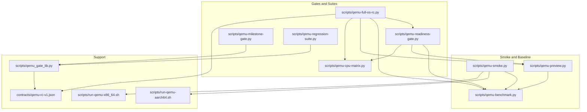

**Diagram sources**
- [scripts/qemu-smoke.py:1-388](file://scripts/qemu-smoke.py#L1-L388)
- [scripts/qemu-benchmark.py:1-345](file://scripts/qemu-benchmark.py#L1-L345)
- [scripts/qemu-preview.py:1-70](file://scripts/qemu-preview.py#L1-L70)
- [scripts/qemu-readiness-gate.py:1-535](file://scripts/qemu-readiness-gate.py#L1-L535)
- [scripts/qemu-milestone-gate.py:1-274](file://scripts/qemu-milestone-gate.py#L1-L274)
- [scripts/qemu-regression-suite.py:1-86](file://scripts/qemu-regression-suite.py#L1-L86)
- [scripts/qemu-full-os-rc.py:1-362](file://scripts/qemu-full-os-rc.py#L1-L362)
- [scripts/qemu-cpu-matrix.py:1-274](file://scripts/qemu-cpu-matrix.py#L1-L274)
- [scripts/qemu_gate_lib.py:1-127](file://scripts/qemu_gate_lib.py#L1-L127)
- [scripts/run-qemu-aarch64.sh:1-162](file://scripts/run-qemu-aarch64.sh#L1-L162)
- [scripts/run-qemu-x86_64.sh:1-127](file://scripts/run-qemu-x86_64.sh#L1-L127)
- [contracts/qemu-rc-v1.json:1-415](file://contracts/qemu-rc-v1.json#L1-L415)

**Section sources**
- [scripts/qemu-smoke.py:1-388](file://scripts/qemu-smoke.py#L1-L388)
- [scripts/qemu-benchmark.py:1-345](file://scripts/qemu-benchmark.py#L1-L345)
- [scripts/qemu-preview.py:1-70](file://scripts/qemu-preview.py#L1-L70)
- [scripts/qemu-readiness-gate.py:1-535](file://scripts/qemu-readiness-gate.py#L1-L535)
- [scripts/qemu-milestone-gate.py:1-274](file://scripts/qemu-milestone-gate.py#L1-L274)
- [scripts/qemu-regression-suite.py:1-86](file://scripts/qemu-regression-suite.py#L1-L86)
- [scripts/qemu-full-os-rc.py:1-362](file://scripts/qemu-full-os-rc.py#L1-L362)
- [scripts/qemu-cpu-matrix.py:1-274](file://scripts/qemu-cpu-matrix.py#L1-L274)
- [scripts/qemu_gate_lib.py:1-127](file://scripts/qemu_gate_lib.py#L1-L127)
- [scripts/run-qemu-aarch64.sh:1-162](file://scripts/run-qemu-aarch64.sh#L1-L162)
- [scripts/run-qemu-x86_64.sh:1-127](file://scripts/run-qemu-x86_64.sh#L1-L127)
- [contracts/qemu-rc-v1.json:1-415](file://contracts/qemu-rc-v1.json#L1-L415)

## Core Components
- Smoke test runner: qemu-smoke.py executes a QEMU build target, streams console output, and asserts a comprehensive list of markers and a telemetry payload presence. It supports a configurable timeout via an environment variable and terminates the process gracefully on timeout or completion.
- Benchmark pipeline: qemu-benchmark.py runs smoke, parses telemetry, validates a fixed set of gates, and produces a correctness-only benchmark report. It enforces that performance claims are not allowed and requires a baseline for any performance-related statements.
- Preview and readiness: qemu-preview.py invokes the benchmark and emits a preview manifest aligned with the release candidate contract. qemu-readiness-gate.py validates the contract, benchmark, preview, and CPU matrix reports, and documents the frozen QEMU contracts and Intel Desktop entry criteria.
- Milestone gates: qemu-milestone-gate.py selects a milestone configuration, runs smoke, validates markers and telemetry against the contract, and writes a milestone-specific report.
- Regression suite: qemu-regression-suite.py runs smoke, validates telemetry against the contract, checks predefined marker groups, and aggregates results into a single report.
- Full OS release candidate: qemu-full-os-rc.py orchestrates readiness, benchmark, preview, CPU matrix, and contract validation, and produces a consolidated report indicating whether the QEMU full OS release candidate criteria are met.
- Gate library: qemu_gate_lib.py provides shared utilities for running commands, parsing telemetry, validating against the contract, and writing reports.
- CPU matrix: qemu-cpu-matrix.py probes a matrix of CPU/accelerator configurations and validates boot feasibility across architectures and platforms.
- Shell runners: run-qemu-aarch64.sh and run-qemu-x86_64.sh encapsulate QEMU invocation, firmware detection, and environment configuration.

**Section sources**
- [scripts/qemu-smoke.py:339-388](file://scripts/qemu-smoke.py#L339-L388)
- [scripts/qemu-benchmark.py:22-345](file://scripts/qemu-benchmark.py#L22-L345)
- [scripts/qemu-preview.py:20-70](file://scripts/qemu-preview.py#L20-L70)
- [scripts/qemu-readiness-gate.py:460-535](file://scripts/qemu-readiness-gate.py#L460-L535)
- [scripts/qemu-milestone-gate.py:215-274](file://scripts/qemu-milestone-gate.py#L215-L274)
- [scripts/qemu-regression-suite.py:46-86](file://scripts/qemu-regression-suite.py#L46-L86)
- [scripts/qemu-full-os-rc.py:284-362](file://scripts/qemu-full-os-rc.py#L284-L362)
- [scripts/qemu_gate_lib.py:16-127](file://scripts/qemu_gate_lib.py#L16-L127)
- [scripts/qemu-cpu-matrix.py:209-274](file://scripts/qemu-cpu-matrix.py#L209-L274)
- [scripts/run-qemu-aarch64.sh:1-162](file://scripts/run-qemu-aarch64.sh#L1-L162)
- [scripts/run-qemu-x86_64.sh:1-127](file://scripts/run-qemu-x86_64.sh#L1-L127)

## Architecture Overview
The testing architecture is a layered pipeline:
- Orchestration: Python scripts coordinate test execution and validation.
- QEMU runtime: Shell runners and Make targets launch QEMU with appropriate firmware and images.
- Telemetry extraction: Tests parse a structured telemetry payload emitted during boot.
- Contract validation: Reports are validated against the frozen QEMU release candidate contract.
- Reporting: JSON reports are produced and consumed by downstream stages.

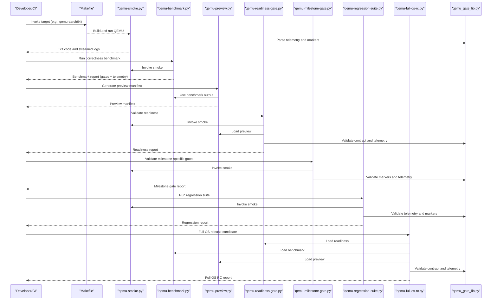

**Diagram sources**
- [scripts/qemu-smoke.py:339-388](file://scripts/qemu-smoke.py#L339-L388)
- [scripts/qemu-benchmark.py:22-345](file://scripts/qemu-benchmark.py#L22-L345)
- [scripts/qemu-preview.py:20-70](file://scripts/qemu-preview.py#L20-L70)
- [scripts/qemu-readiness-gate.py:460-535](file://scripts/qemu-readiness-gate.py#L460-L535)
- [scripts/qemu-milestone-gate.py:215-274](file://scripts/qemu-milestone-gate.py#L215-L274)
- [scripts/qemu-regression-suite.py:46-86](file://scripts/qemu-regression-suite.py#L46-L86)
- [scripts/qemu-full-os-rc.py:284-362](file://scripts/qemu-full-os-rc.py#L284-L362)
- [scripts/qemu_gate_lib.py:16-127](file://scripts/qemu_gate_lib.py#L16-L127)

## Detailed Component Analysis

### Smoke Test Runner (qemu-smoke.py)
Purpose:
- Boot QEMU and assert a comprehensive set of kernel/userspace markers and a telemetry payload.
- Provide a fast pass/fail indicator for basic system functionality.

Key behaviors:
- Launches a Make target to start QEMU and streams output incrementally.
- Maintains a timeout controlled by an environment variable.
- Validates a long list of expected markers and ensures the telemetry payload is present and complete.
- Terminates the QEMU process gracefully on success or timeout.

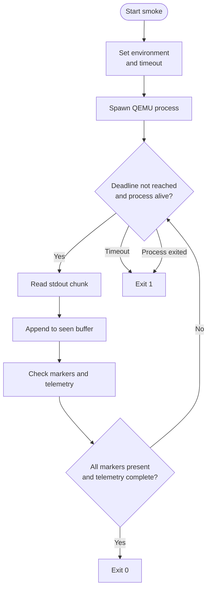

**Diagram sources**
- [scripts/qemu-smoke.py:339-388](file://scripts/qemu-smoke.py#L339-L388)

**Section sources**
- [scripts/qemu-smoke.py:10-330](file://scripts/qemu-smoke.py#L10-L330)
- [scripts/qemu-smoke.py:339-388](file://scripts/qemu-smoke.py#L339-L388)

### Benchmark Pipeline (qemu-benchmark.py)
Purpose:
- Collect telemetry from smoke and validate a fixed set of gates to ensure correctness-only claims.

Key behaviors:
- Runs smoke and parses telemetry.
- Validates a comprehensive set of gates covering CPU, memory, filesystem, AI cell, security, persistence, update, network, and service telemetry.
- Produces a correctness-only benchmark report and optionally writes it to a configured path.

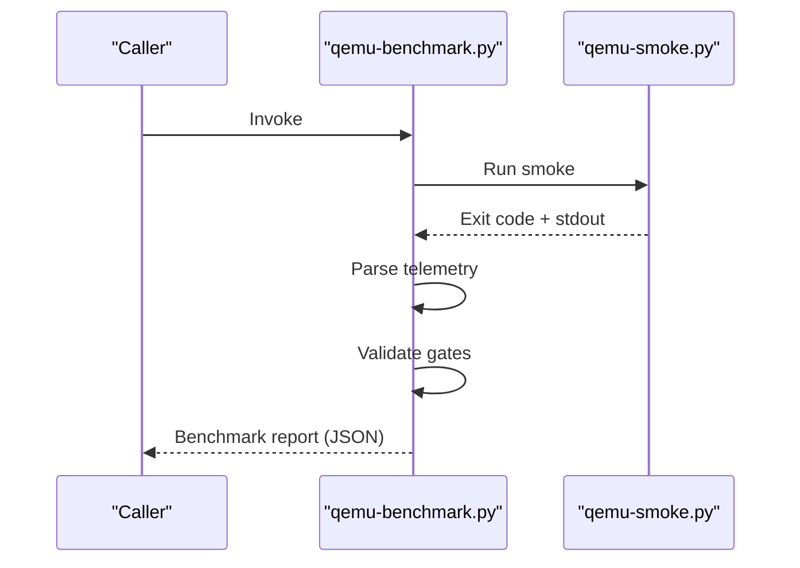

**Diagram sources**
- [scripts/qemu-benchmark.py:22-345](file://scripts/qemu-benchmark.py#L22-L345)

**Section sources**
- [scripts/qemu-benchmark.py:8-186](file://scripts/qemu-benchmark.py#L8-L186)
- [scripts/qemu-benchmark.py:191-341](file://scripts/qemu-benchmark.py#L191-L341)

### Preview and Readiness Gates
Preview (qemu-preview.py):
- Invokes the benchmark and emits a preview manifest aligned with the release candidate contract.

Readiness (qemu-readiness-gate.py):
- Validates the frozen QEMU contracts, benchmark gates, preview telemetry alignment, and CPU matrix coverage.
- Documents Intel Desktop entry criteria and required documentation snippets.

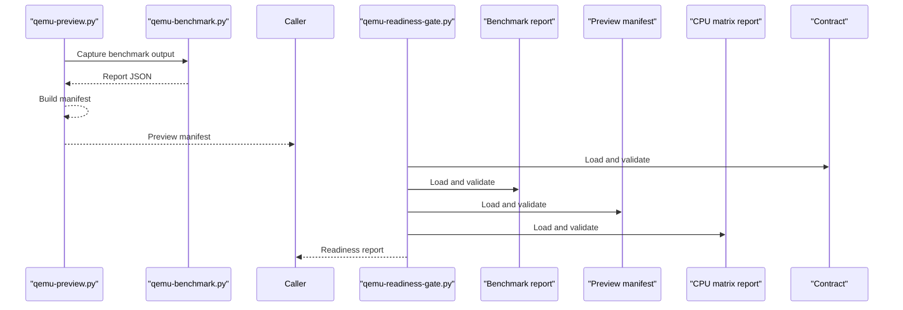

**Diagram sources**
- [scripts/qemu-preview.py:20-70](file://scripts/qemu-preview.py#L20-L70)
- [scripts/qemu-readiness-gate.py:460-535](file://scripts/qemu-readiness-gate.py#L460-L535)

**Section sources**
- [scripts/qemu-preview.py:20-70](file://scripts/qemu-preview.py#L20-L70)
- [scripts/qemu-readiness-gate.py:16-75](file://scripts/qemu-readiness-gate.py#L16-L75)
- [scripts/qemu-readiness-gate.py:237-401](file://scripts/qemu-readiness-gate.py#L237-L401)

### Milestone Gates (qemu-milestone-gate.py)
Purpose:
- Validate specific milestones (filesystem, app agent, network, CPU-AI runtime, AI cell, security, update) against markers and telemetry.

Key behaviors:
- Selects a milestone configuration and runs smoke.
- Validates markers and telemetry against the contract.
- Writes a milestone-specific report with aggregated checks and failures.

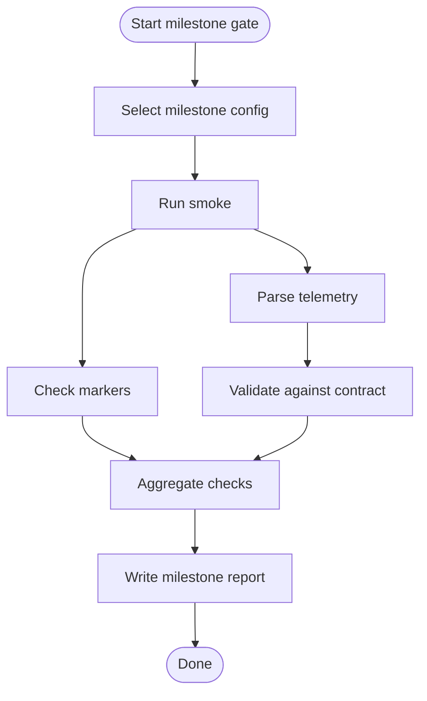

**Diagram sources**
- [scripts/qemu-milestone-gate.py:215-274](file://scripts/qemu-milestone-gate.py#L215-L274)

**Section sources**
- [scripts/qemu-milestone-gate.py:7-212](file://scripts/qemu-milestone-gate.py#L7-L212)
- [scripts/qemu-milestone-gate.py:215-274](file://scripts/qemu-milestone-gate.py#L215-L274)

### Regression Suite (qemu-regression-suite.py)
Purpose:
- Aggregate smoke, contract validation, and marker groups into a single regression report.

Key behaviors:
- Runs smoke and parses telemetry.
- Validates telemetry against the contract.
- Checks predefined marker groups and writes a consolidated report.

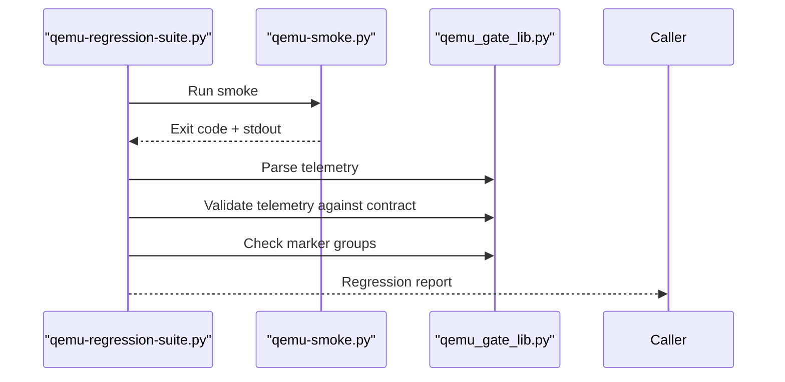

**Diagram sources**
- [scripts/qemu-regression-suite.py:46-86](file://scripts/qemu-regression-suite.py#L46-L86)
- [scripts/qemu_gate_lib.py:49-81](file://scripts/qemu_gate_lib.py#L49-L81)

**Section sources**
- [scripts/qemu-regression-suite.py:10-81](file://scripts/qemu-regression-suite.py#L10-L81)

### Full OS Release Candidate (qemu-full-os-rc.py)
Purpose:
- Orchestrate readiness, benchmark, preview, CPU matrix, and contract validation into a single consolidated report.

Key behaviors:
- Loads and validates each artifact against the contract.
- Ensures documentation compliance and frozen contract status.
- Produces a final report indicating whether the QEMU full OS release candidate criteria are met.

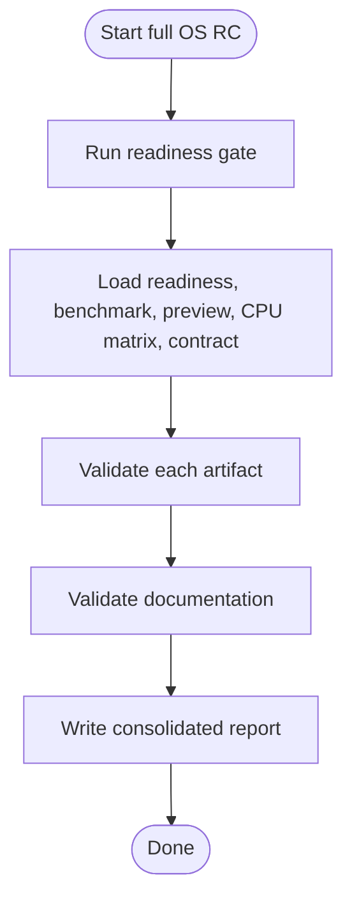

**Diagram sources**
- [scripts/qemu-full-os-rc.py:284-362](file://scripts/qemu-full-os-rc.py#L284-L362)

**Section sources**
- [scripts/qemu-full-os-rc.py:11-55](file://scripts/qemu-full-os-rc.py#L11-L55)
- [scripts/qemu-full-os-rc.py:284-362](file://scripts/qemu-full-os-rc.py#L284-L362)

### CPU Matrix (qemu-cpu-matrix.py)
Purpose:
- Probe a matrix of CPU/accelerator configurations for boot feasibility across AArch64 and x86_64.

Key behaviors:
- Detects QEMU binaries and supported CPUs.
- Executes smoke or dry-run probes for each tier.
- Aggregates results into a CPU matrix report.

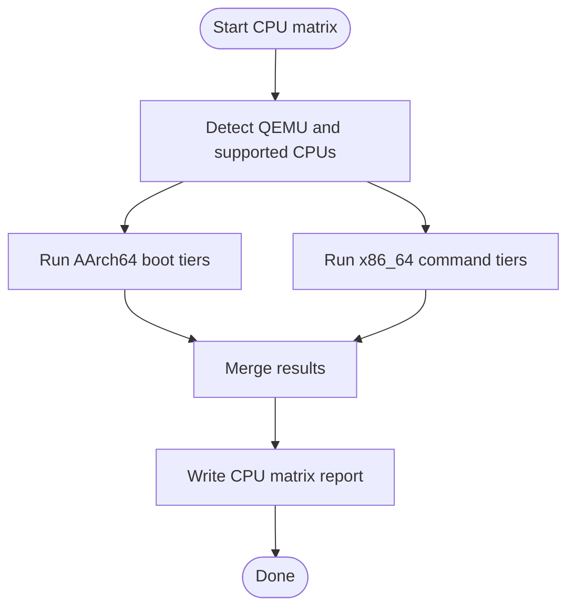

**Diagram sources**
- [scripts/qemu-cpu-matrix.py:209-274](file://scripts/qemu-cpu-matrix.py#L209-L274)

**Section sources**
- [scripts/qemu-cpu-matrix.py:24-51](file://scripts/qemu-cpu-matrix.py#L24-L51)
- [scripts/qemu-cpu-matrix.py:120-206](file://scripts/qemu-cpu-matrix.py#L120-L206)
- [scripts/qemu-cpu-matrix.py:209-274](file://scripts/qemu-cpu-matrix.py#L209-L274)

### Gate Library (qemu_gate_lib.py)
Purpose:
- Provide shared utilities for running commands, parsing telemetry, validating against the contract, and writing reports.

Key utilities:
- run: Executes commands with environment merging and timeouts.
- write_report: Serializes and writes JSON reports.
- parse_telemetry: Extracts and parses the telemetry payload.
- check_markers: Compares expected markers against output.
- validate_telemetry_against_contract: Enforces contract minimums and equals.
- result/status_from_failures: Builds structured check results and computes overall status.

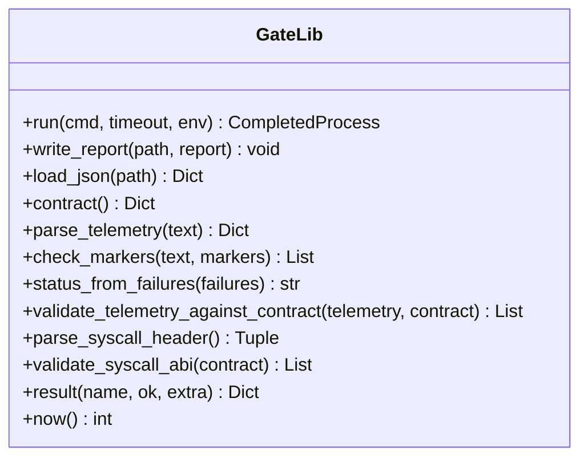

**Diagram sources**
- [scripts/qemu_gate_lib.py:16-127](file://scripts/qemu_gate_lib.py#L16-L127)

**Section sources**
- [scripts/qemu_gate_lib.py:16-127](file://scripts/qemu_gate_lib.py#L16-L127)

## Dependency Analysis
- Smoke depends on QEMU shell runners and Make targets to produce console output consumed by telemetry parsing.
- Benchmark depends on smoke and telemetry parsing to validate gates.
- Preview depends on benchmark output to construct a manifest aligned with the contract.
- Readiness depends on benchmark, preview, CPU matrix, and contract validation.
- Milestone gates depend on smoke and the gate library for telemetry and marker validation.
- Regression suite depends on smoke and the gate library for telemetry and marker validation.
- Full OS release candidate depends on readiness, benchmark, preview, CPU matrix, and contract validation.

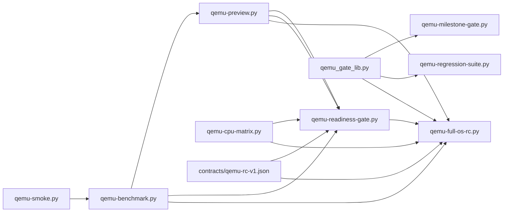

**Diagram sources**
- [scripts/qemu-smoke.py:339-388](file://scripts/qemu-smoke.py#L339-L388)
- [scripts/qemu-benchmark.py:22-345](file://scripts/qemu-benchmark.py#L22-L345)
- [scripts/qemu-preview.py:20-70](file://scripts/qemu-preview.py#L20-L70)
- [scripts/qemu-readiness-gate.py:460-535](file://scripts/qemu-readiness-gate.py#L460-L535)
- [scripts/qemu-milestone-gate.py:215-274](file://scripts/qemu-milestone-gate.py#L215-L274)
- [scripts/qemu-regression-suite.py:46-86](file://scripts/qemu-regression-suite.py#L46-L86)
- [scripts/qemu-full-os-rc.py:284-362](file://scripts/qemu-full-os-rc.py#L284-L362)
- [scripts/qemu_gate_lib.py:16-127](file://scripts/qemu_gate_lib.py#L16-L127)
- [scripts/qemu-cpu-matrix.py:209-274](file://scripts/qemu-cpu-matrix.py#L209-L274)
- [contracts/qemu-rc-v1.json:1-415](file://contracts/qemu-rc-v1.json#L1-L415)

**Section sources**
- [scripts/qemu_gate_lib.py:16-127](file://scripts/qemu_gate_lib.py#L16-L127)
- [scripts/qemu-readiness-gate.py:460-535](file://scripts/qemu-readiness-gate.py#L460-L535)
- [scripts/qemu-full-os-rc.py:284-362](file://scripts/qemu-full-os-rc.py#L284-L362)

## Performance Considerations
- Correctness-only focus: The benchmark enforces that performance claims are not allowed and requires a baseline for any performance-related statements.
- Telemetry-driven gates: Gates validate minimum thresholds for CPU, memory, filesystem, AI cell, security, persistence, update, network, and service telemetry to ensure correctness.
- CPU matrix coverage: Validates boot feasibility across a wide range of CPU/accelerator configurations to ensure portability.

[No sources needed since this section provides general guidance]

## Troubleshooting Guide
Common issues and resolutions:
- Missing QEMU firmware:
  - Ensure AArch64 firmware is available for qemu-system-aarch64 and x86_64 firmware for qemu-system-x86_64.
  - Set environment variables to point to firmware if not detected automatically.
- Missing artifacts:
  - Verify that build artifacts (images, reports) exist and are readable.
  - Ensure the build directory exists and is writable.
- Timeout exceeded:
  - Increase the smoke timeout via the environment variable controlling the smoke test duration.
- Contract mismatches:
  - Validate that the contract is frozen and matches expectations.
  - Ensure syscall ABI and telemetry schema align with the contract.
- Gate failures:
  - Review the specific gate failures and adjust expectations or fix underlying issues.

**Section sources**
- [scripts/run-qemu-aarch64.sh:41-64](file://scripts/run-qemu-aarch64.sh#L41-L64)
- [scripts/run-qemu-x86_64.sh:41-62](file://scripts/run-qemu-x86_64.sh#L41-L62)
- [scripts/qemu-readiness-gate.py:215-225](file://scripts/qemu-readiness-gate.py#L215-L225)
- [scripts/qemu-full-os-rc.py:291-293](file://scripts/qemu-full-os-rc.py#L291-L293)

## Conclusion
OSAI’s QEMU testing framework provides a robust, contract-driven pipeline for smoke testing, benchmarking, milestone validation, regression assurance, and full OS release candidate assessment. By leveraging shared utilities, structured telemetry, and frozen contracts, the framework ensures correctness-only claims, portability across CPU/accelerator configurations, and reliable CI integration.

[No sources needed since this section summarizes without analyzing specific files]

## Appendices

### Test Execution Workflow
- Smoke: qemu-smoke.py boots QEMU and asserts markers and telemetry.
- Benchmark: qemu-benchmark.py validates gates and produces a correctness-only report.
- Preview: qemu-preview.py constructs a manifest aligned with the contract.
- Readiness: qemu-readiness-gate.py validates readiness and Intel Desktop entry criteria.
- Milestone gates: qemu-milestone-gate.py validates specific subsystems.
- Regression suite: qemu-regression-suite.py aggregates smoke and contract checks.
- Full OS RC: qemu-full-os-rc.py orchestrates all validations and produces a consolidated report.

**Section sources**
- [scripts/qemu-smoke.py:339-388](file://scripts/qemu-smoke.py#L339-L388)
- [scripts/qemu-benchmark.py:22-345](file://scripts/qemu-benchmark.py#L22-L345)
- [scripts/qemu-preview.py:20-70](file://scripts/qemu-preview.py#L20-L70)
- [scripts/qemu-readiness-gate.py:460-535](file://scripts/qemu-readiness-gate.py#L460-L535)
- [scripts/qemu-milestone-gate.py:215-274](file://scripts/qemu-milestone-gate.py#L215-L274)
- [scripts/qemu-regression-suite.py:46-86](file://scripts/qemu-regression-suite.py#L46-L86)
- [scripts/qemu-full-os-rc.py:284-362](file://scripts/qemu-full-os-rc.py#L284-L362)

### Test Case Organization
- Smoke markers: Comprehensive list of kernel and userspace markers.
- Benchmark gates: Fixed set of gates derived from telemetry.
- Milestone configurations: Per-milestone markers and telemetry minimums/equality checks.
- Regression groups: Predefined marker groups for process lifecycle, filesystem rollback, AI cell conflicts, network state, and security denials.

**Section sources**
- [scripts/qemu-smoke.py:10-330](file://scripts/qemu-smoke.py#L10-L330)
- [scripts/qemu-benchmark.py:191-316](file://scripts/qemu-benchmark.py#L191-L316)
- [scripts/qemu-milestone-gate.py:7-212](file://scripts/qemu-milestone-gate.py#L7-L212)
- [scripts/qemu-regression-suite.py:10-43](file://scripts/qemu-regression-suite.py#L10-L43)

### Result Reporting Mechanisms
- JSON reports: Each stage writes a structured JSON report with schema, status, created timestamps, and artifacts.
- Consolidation: Full OS release candidate merges readiness, benchmark, preview, CPU matrix, and contract reports.
- Gate library: Provides standardized report writing and validation utilities.

**Section sources**
- [scripts/qemu_gate_lib.py:34-38](file://scripts/qemu_gate_lib.py#L34-L38)
- [scripts/qemu-full-os-rc.py:318-349](file://scripts/qemu-full-os-rc.py#L318-L349)

### Continuous Integration Pipelines
- Makefile targets orchestrate smoke, benchmark, preview, readiness, CPU matrix, and full OS RC stages.
- Environment variables control timeouts and output paths.
- CI should invoke Make targets and collect JSON reports for downstream analysis.

**Section sources**
- [Makefile](file://Makefile)
- [scripts/qemu-full-os-rc.py:288-293](file://scripts/qemu-full-os-rc.py#L288-L293)
- [scripts/qemu-benchmark.py:335-340](file://scripts/qemu-benchmark.py#L335-L340)

### Test Configuration Options
- Smoke timeout: Controlled by an environment variable used by smoke and related scripts.
- Firmware selection: Shell runners detect firmware locations and support overrides via environment variables.
- CPU/accelerator selection: CPU matrix and milestone gates configure CPU models and accelerators.
- Output paths: Environment variables control benchmark and full OS RC report output.

**Section sources**
- [scripts/qemu-smoke.py:352-352](file://scripts/qemu-smoke.py#L352-L352)
- [scripts/run-qemu-aarch64.sh:98-118](file://scripts/run-qemu-aarch64.sh#L98-L118)
- [scripts/run-qemu-x86_64.sh:96-101](file://scripts/run-qemu-x86_64.sh#L96-L101)
- [scripts/qemu-cpu-matrix.py:224-225](file://scripts/qemu-cpu-matrix.py#L224-L225)
- [scripts/qemu-benchmark.py:335-340](file://scripts/qemu-benchmark.py#L335-L340)

### Timeout Settings and Failure Handling
- Smoke timeout: Configurable via environment variable; smoke terminates gracefully on success or timeout.
- Gate timeouts: Gate library run function accepts a timeout parameter; CPU matrix and milestone gates specify explicit timeouts.
- Failure handling: Scripts aggregate failures, write reports, and exit with non-zero status on validation failures.

**Section sources**
- [scripts/qemu_smoke.py:352-352](file://scripts/qemu-smoke.py#L352-L352)
- [scripts/qemu_gate_lib.py:16-31](file://scripts/qemu_gate_lib.py#L16-L31)
- [scripts/qemu-cpu-matrix.py:54-64](file://scripts/qemu-cpu-matrix.py#L54-L64)

### Writing New Test Cases and Extending Existing Tests
- Add smoke markers: Extend the smoke markers list to assert new functionality.
- Add benchmark gates: Extend the gates dictionary and telemetry key sets in the benchmark script.
- Add milestone configurations: Add new milestone entries with markers and telemetry minimums/equalities.
- Add regression groups: Extend marker groups in the regression suite.
- Use gate library: Leverage shared utilities for running commands, parsing telemetry, and writing reports.

**Section sources**
- [scripts/qemu-smoke.py:10-330](file://scripts/qemu-smoke.py#L10-L330)
- [scripts/qemu-benchmark.py:45-188](file://scripts/qemu-benchmark.py#L45-L188)
- [scripts/qemu-milestone-gate.py:7-212](file://scripts/qemu-milestone-gate.py#L7-L212)
- [scripts/qemu-regression-suite.py:10-43](file://scripts/qemu-regression-suite.py#L10-L43)
- [scripts/qemu_gate_lib.py:16-127](file://scripts/qemu_gate_lib.py#L16-L127)

### Integrating with CI/CD Systems
- Invoke Make targets for smoke, benchmark, preview, readiness, CPU matrix, and full OS RC.
- Collect JSON reports from the build directory.
- Fail builds on non-zero exit codes from any stage.
- Use environment variables to control timeouts and output paths.

**Section sources**
- [Makefile](file://Makefile)
- [scripts/qemu-full-os-rc.py:288-293](file://scripts/qemu-full-os-rc.py#L288-L293)

### Test Environment Setup and Resource Requirements
- QEMU binaries: qemu-system-aarch64 and qemu-system-x86_64 must be installed and discoverable.
- Firmware: AArch64 and x86_64 firmware files must be available or specified via environment variables.
- Images: Boot images and test block images must be built and accessible.
- Memory/CPU: Configure machine, memory, SMP, and CPU via environment variables for shell runners.

**Section sources**
- [scripts/run-qemu-aarch64.sh:88-96](file://scripts/run-qemu-aarch64.sh#L88-L96)
- [scripts/run-qemu-x86_64.sh:86-94](file://scripts/run-qemu-x86_64.sh#L86-L94)
- [scripts/run-qemu-aarch64.sh:120-130](file://scripts/run-qemu-aarch64.sh#L120-L130)
- [scripts/run-qemu-x86_64.sh:103-107](file://scripts/run-qemu-x86_64.sh#L103-L107)

### Performance Benchmarking Capabilities
- Correctness-only: The benchmark enforces correctness-only claims and prohibits performance claims.
- Gates: Validates minimum thresholds for telemetry to ensure correctness.
- Baseline requirement: Requires a baseline for any performance-related statements.

**Section sources**
- [scripts/qemu-benchmark.py:322-331](file://scripts/qemu-benchmark.py#L322-L331)
- [scripts/qemu-readiness-gate.py:237-267](file://scripts/qemu-readiness-gate.py#L237-L267)