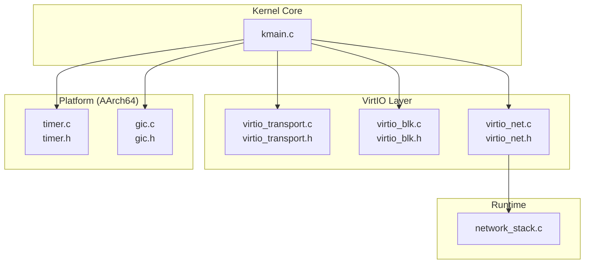
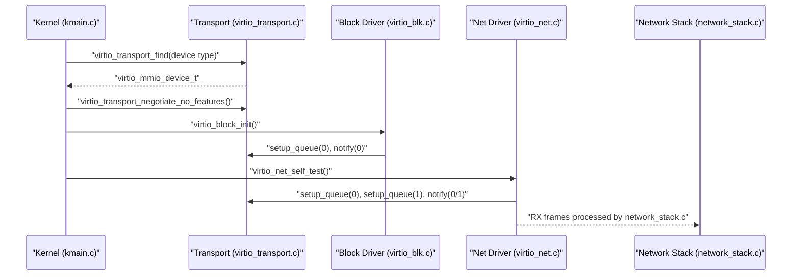
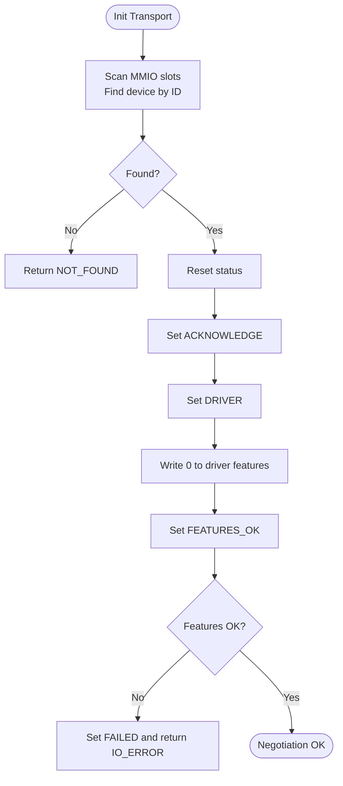
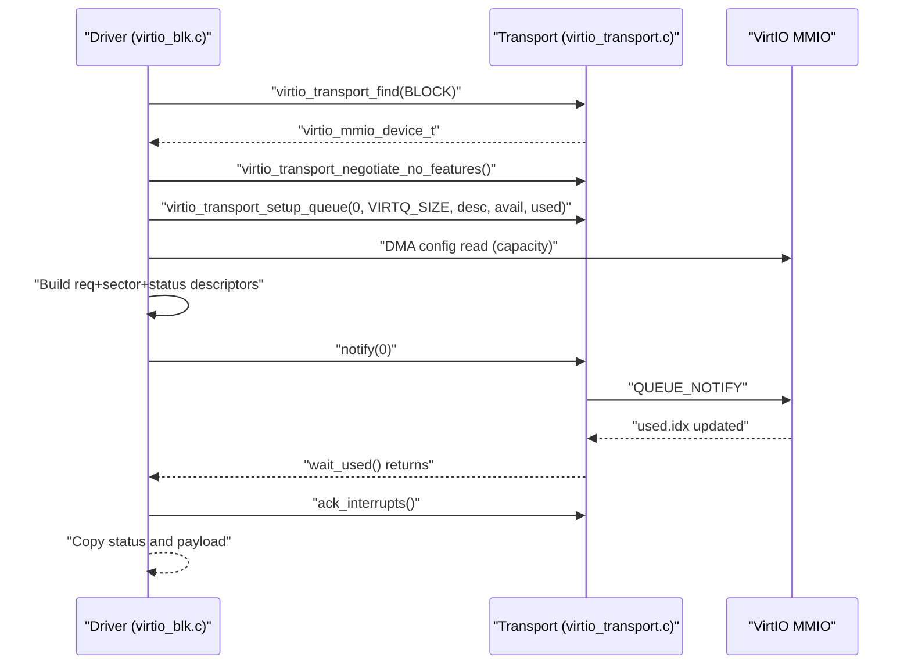
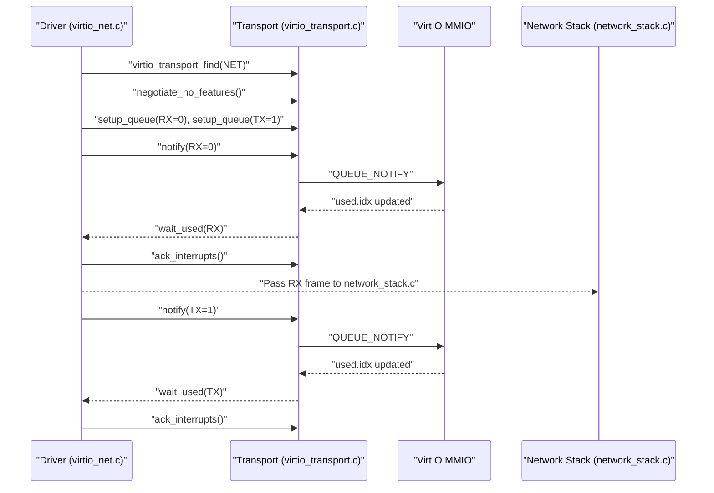
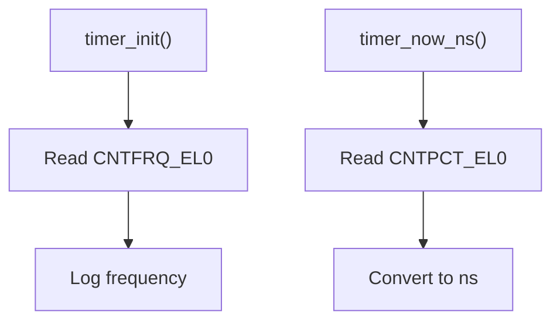
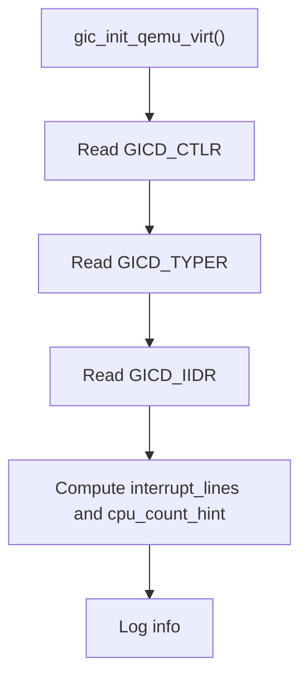
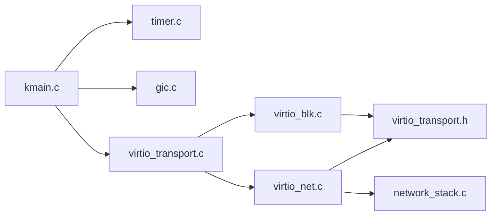

# Device Drivers

<cite>
**Referenced Files in This Document**
- [virtio_blk.c](file://kernel/dev/virtio/virtio_blk.c)
- [virtio_net.c](file://kernel/dev/virtio/virtio_net.c)
- [virtio_transport.c](file://kernel/dev/virtio/virtio_transport.c)
- [virtio_blk.h](file://kernel/include/osai/virtio_blk.h)
- [virtio_net.h](file://kernel/include/osai/virtio_net.h)
- [virtio_transport.h](file://kernel/include/osai/virtio_transport.h)
- [kmain.c](file://kernel/core/kmain.c)
- [timer.c](file://kernel/arch/aarch64/timer.c)
- [gic.c](file://kernel/arch/aarch64/gic.c)
- [timer.h](file://kernel/include/osai/timer.h)
- [gic.h](file://kernel/include/osai/gic.h)
- [network_stack.c](file://kernel/runtime/network_stack.c)
</cite>

## Table of Contents
1. [Introduction](#introduction)
2. [Project Structure](#project-structure)
3. [Core Components](#core-components)
4. [Architecture Overview](#architecture-overview)
5. [Detailed Component Analysis](#detailed-component-analysis)
6. [Dependency Analysis](#dependency-analysis)
7. [Performance Considerations](#performance-considerations)
8. [Troubleshooting Guide](#troubleshooting-guide)
9. [Conclusion](#conclusion)
10. [Appendices](#appendices)

## Introduction
This document describes the device drivers for OSAI’s VirtIO-based virtualization stack. It covers:
- VirtIO block driver for disk I/O operations, queue management, and performance characteristics
- VirtIO network driver for packet processing, interrupt handling, and integration with the network stack
- VirtIO transport layer for device discovery, negotiation, queue setup, and communication via MMIO
- Platform-specific drivers for AArch64 timer and GIC interrupt controller
- Driver initialization sequences, device enumeration, error handling, and integration points
- Debugging techniques, performance profiling, and troubleshooting hardware compatibility

## Project Structure
The VirtIO stack resides under kernel/dev/virtio and integrates with platform-specific code under kernel/arch/aarch64. The kernel entry point initializes platform devices and runs driver self-tests.

**Diagram sources**
- [kmain.c:60-133](file://kernel/core/kmain.c#L60-L133)
- [virtio_transport.c:1-183](file://kernel/dev/virtio/virtio_transport.c#L1-L183)
- [virtio_blk.c:1-225](file://kernel/dev/virtio/virtio_blk.c#L1-L225)
- [virtio_net.c:1-183](file://kernel/dev/virtio/virtio_net.c#L1-L183)
- [timer.c:1-55](file://kernel/arch/aarch64/timer.c#L1-L55)
- [gic.c:1-39](file://kernel/arch/aarch64/gic.c#L1-L39)
- [network_stack.c:1-800](file://kernel/runtime/network_stack.c#L1-L800)

**Section sources**
- [kmain.c:60-133](file://kernel/core/kmain.c#L60-L133)

## Core Components
- VirtIO transport layer: Implements MMIO-based device discovery, feature negotiation, queue setup, notification, and interrupt acknowledgment.
- VirtIO block driver: Manages a single queue to perform sector reads/writes, with DMA mapping and status checking.
- VirtIO network driver: Sets up separate RX/TX queues, builds ARP frames, and validates replies; integrates with the network stack.
- Platform drivers: AArch64 timer and GIC for timing and interrupts.

Key APIs and data structures are declared in the public headers.

**Section sources**
- [virtio_transport.h:12-62](file://kernel/include/osai/virtio_transport.h#L12-L62)
- [virtio_blk.h:7-13](file://kernel/include/osai/virtio_blk.h#L7-L13)
- [virtio_net.h:4](file://kernel/include/osai/virtio_net.h#L4-L4)
- [timer.h:6-10](file://kernel/include/osai/timer.h#L6-L10)
- [gic.h:6-16](file://kernel/include/osai/gic.h#L6-L16)

## Architecture Overview
The VirtIO transport layer abstracts MMIO registers and queue management. Block and network drivers rely on it for device enumeration and queue configuration. The network stack consumes RX frames produced by the network driver.

**Diagram sources**
- [kmain.c:118-122](file://kernel/core/kmain.c#L118-L122)
- [virtio_transport.c:75-122](file://kernel/dev/virtio/virtio_transport.c#L75-L122)
- [virtio_blk.c:87-113](file://kernel/dev/virtio/virtio_blk.c#L87-L113)
- [virtio_net.c:131-182](file://kernel/dev/virtio/virtio_net.c#L131-L182)
- [network_stack.c:607-726](file://kernel/runtime/network_stack.c#L607-L726)

## Detailed Component Analysis

### VirtIO Transport Layer
Responsibilities:
- Discover VirtIO devices via MMIO scanning within a fixed range and stride
- Negotiate features without selecting any optional features
- Configure queues with descriptor, driver, and device ring addresses
- Notify queues and wait for completion using a bounded spin loop
- Acknowledge interrupts and reset device status

Implementation highlights:
- MMIO register constants define the VirtIO ABI layout
- DMA addresses are resolved via virtual-memory translation
- Memory barriers ensure ordering for MMIO operations
- Interrupt acknowledgment reads and clears the interrupt status

**Diagram sources**
- [virtio_transport.c:75-122](file://kernel/dev/virtio/virtio_transport.c#L75-L122)

**Section sources**
- [virtio_transport.c:1-183](file://kernel/dev/virtio/virtio_transport.c#L1-L183)
- [virtio_transport.h:42-62](file://kernel/include/osai/virtio_transport.h#L42-L62)

### VirtIO Block Driver
Responsibilities:
- Initialize the block device, negotiate features, and set up a single queue
- Perform sector reads and writes using a three-descriptor chain: request, payload, status
- Validate capacity and handle errors for invalid sectors or I/O failures
- Provide a self-test that exercises read/write and reset

Queue management:
- Descriptor chain flags control direction and chaining
- Status byte indicates operation outcome
- Barrier ensures memory ordering before notifying the device

**Diagram sources**
- [virtio_blk.c:87-181](file://kernel/dev/virtio/virtio_blk.c#L87-L181)
- [virtio_transport.c:124-182](file://kernel/dev/virtio/virtio_transport.c#L124-L182)

**Section sources**
- [virtio_blk.c:1-225](file://kernel/dev/virtio/virtio_blk.c#L1-L225)
- [virtio_blk.h:7-13](file://kernel/include/osai/virtio_blk.h#L7-L13)

### VirtIO Network Driver
Responsibilities:
- Allocate RX and TX queues and buffers
- Build ARP requests and validate replies
- Enqueue RX descriptors, send TX descriptors, and await completions
- Integrate with the network stack for UDP/TCP parsing and flow management

Packet processing:
- RX descriptor marked with WRITE flag to receive frames
- TX descriptor holds the prepared frame
- Wait for used index updates and acknowledge interrupts

**Diagram sources**
- [virtio_net.c:131-182](file://kernel/dev/virtio/virtio_net.c#L131-L182)
- [virtio_transport.c:124-182](file://kernel/dev/virtio/virtio_transport.c#L124-L182)
- [network_stack.c:747-800](file://kernel/runtime/network_stack.c#L747-L800)

**Section sources**
- [virtio_net.c:1-183](file://kernel/dev/virtio/virtio_net.c#L1-L183)
- [virtio_net.h:4](file://kernel/include/osai/virtio_net.h#L4-L4)

### Platform-Specific Drivers

#### AArch64 Timer
- Reads the generic counter frequency and current counter
- Converts counter ticks to nanoseconds
- Provides monotonic self-test

**Diagram sources**
- [timer.c:19-32](file://kernel/arch/aarch64/timer.c#L19-L32)
- [timer.c:34-38](file://kernel/arch/aarch64/timer.c#L34-L38)

**Section sources**
- [timer.c:1-55](file://kernel/arch/aarch64/timer.c#L1-L55)
- [timer.h:6-10](file://kernel/include/osai/timer.h#L6-L10)

#### AArch64 GIC
- Initializes QEMU Virt GIC by reading distributor registers
- Discovers number of interrupt lines and CPU count hint
- Self-test validates expected base address and minimum line count

**Diagram sources**
- [gic.c:17-28](file://kernel/arch/aarch64/gic.c#L17-L28)

**Section sources**
- [gic.c:1-39](file://kernel/arch/aarch64/gic.c#L1-L39)
- [gic.h:6-16](file://kernel/include/osai/gic.h#L6-L16)

## Dependency Analysis
- Drivers depend on the VirtIO transport layer for MMIO operations and queue management
- Block and network drivers depend on VMM translation for DMA addresses
- Kernel entry initializes platform devices and runs driver self-tests
- Network stack consumes RX frames produced by the network driver

**Diagram sources**
- [kmain.c:60-133](file://kernel/core/kmain.c#L60-L133)
- [virtio_transport.c:1-183](file://kernel/dev/virtio/virtio_transport.c#L1-L183)
- [virtio_blk.c:1-225](file://kernel/dev/virtio/virtio_blk.c#L1-L225)
- [virtio_net.c:1-183](file://kernel/dev/virtio/virtio_net.c#L1-L183)
- [network_stack.c:1-800](file://kernel/runtime/network_stack.c#L1-L800)

**Section sources**
- [virtio_transport.h:12-62](file://kernel/include/osai/virtio_transport.h#L12-L62)

## Performance Considerations
- Queue sizing: The VirtIO queue size is fixed at a small power-of-two, limiting batching opportunities. Larger queues could improve throughput at the cost of latency and memory footprint.
- DMA mapping: Each transfer resolves a virtual address to a physical address via VMM translation; minimizing per-transfer overhead helps reduce latency.
- Spin-waiting: Completion polling uses a bounded spin loop; consider yielding or sleeping to reduce CPU contention on slow devices.
- Interrupt handling: Acknowledging interrupts promptly prevents spurious notifications and improves responsiveness.
- Packet processing: Network stack enforces backpressure via queue rings; ensure RX enqueue/complete accounting matches driver behavior to avoid stalls.

[No sources needed since this section provides general guidance]

## Troubleshooting Guide
Common issues and remedies:
- Device not found during enumeration:
  - Verify MMIO mapping and base addresses; check platform mapping in kernel entry
  - Confirm device IDs and magic/version checks in transport layer
- Feature negotiation failure:
  - Ensure no features are selected; the transport negotiates with zero features
  - Check that FEATURES_OK bit is set after negotiation
- Queue setup errors:
  - Validate queue size does not exceed maximum reported by device
  - Ensure descriptor, driver, and device ring addresses are valid and mapped
- I/O timeouts:
  - Confirm used index increments and that wait_used returns success
  - Acknowledge interrupts before polling again
- Disk I/O failures:
  - Validate sector indices and capacity bounds
  - Check status byte after completion
- Network RX/TX stalls:
  - Ensure RX descriptors are properly marked WRITE and queued
  - Verify notify is issued and used index advances
  - Confirm network stack bindings and queue rings are configured

**Section sources**
- [virtio_transport.c:75-182](file://kernel/dev/virtio/virtio_transport.c#L75-L182)
- [virtio_blk.c:122-181](file://kernel/dev/virtio/virtio_blk.c#L122-L181)
- [virtio_net.c:131-182](file://kernel/dev/virtio/virtio_net.c#L131-L182)
- [kmain.c:118-122](file://kernel/core/kmain.c#L118-L122)

## Conclusion
OSAI’s VirtIO stack provides a compact, MMIO-backed implementation for block and network devices on AArch64. The transport layer encapsulates device discovery and queue management, while block and network drivers demonstrate minimal-features operation and robust completion handling. Platform drivers supply timing and interrupt infrastructure. The kernel entry point orchestrates initialization and validates driver behavior through self-tests. For production workloads, consider increasing queue sizes, optimizing interrupt handling, and integrating deeper network stack features.

[No sources needed since this section summarizes without analyzing specific files]

## Appendices

### Driver Initialization Sequences
- Kernel entry initializes exceptions, timers, SMP, VMM, MMIO mappings, and GIC
- Runs self-tests for VirtIO block and network drivers
- Loads and runs user-space components

**Section sources**
- [kmain.c:60-133](file://kernel/core/kmain.c#L60-L133)

### Integration Between Drivers and Transport
- Both drivers call transport functions to enumerate devices, negotiate features, set up queues, notify, wait, and acknowledge interrupts
- DMA addresses are resolved through VMM translation before writing to device registers

**Section sources**
- [virtio_blk.c:87-113](file://kernel/dev/virtio/virtio_blk.c#L87-L113)
- [virtio_net.c:131-152](file://kernel/dev/virtio/virtio_net.c#L131-L152)
- [virtio_transport.c:124-182](file://kernel/dev/virtio/virtio_transport.c#L124-L182)