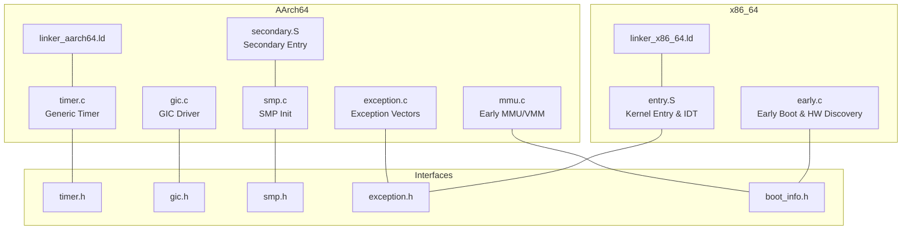
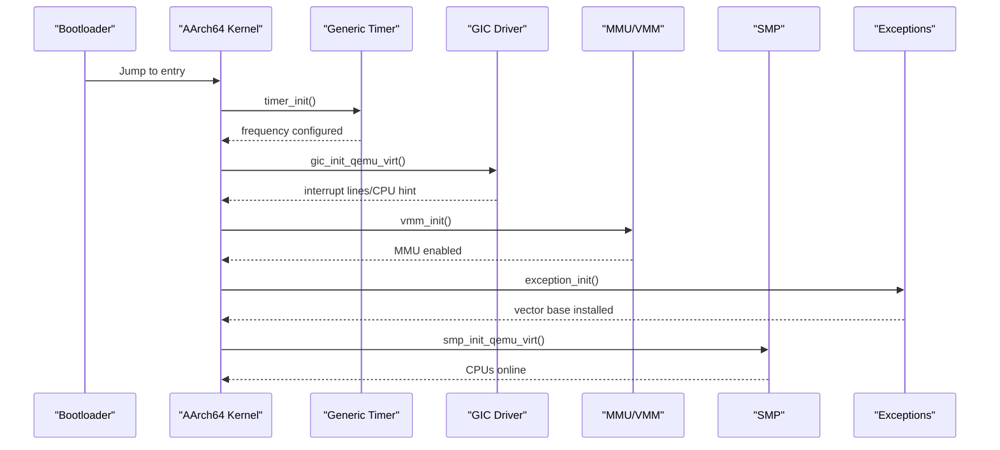
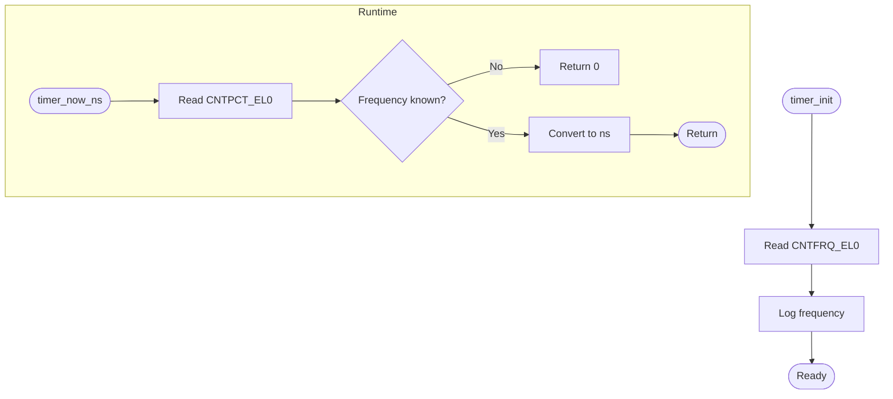
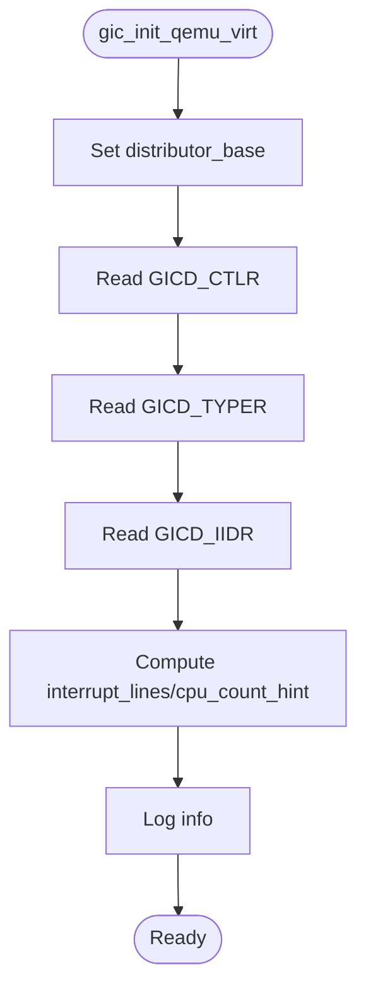
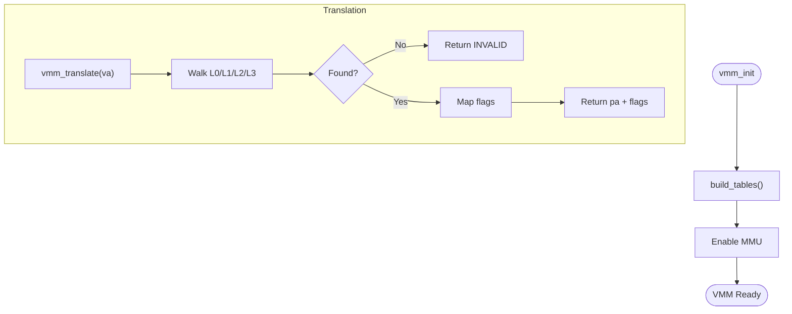
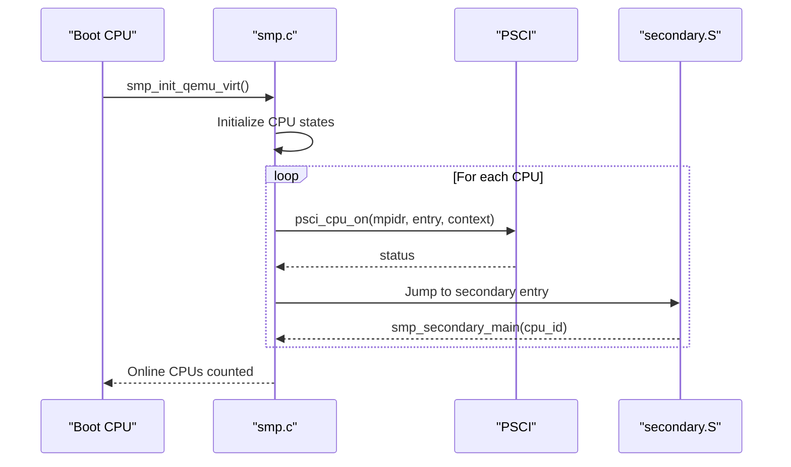
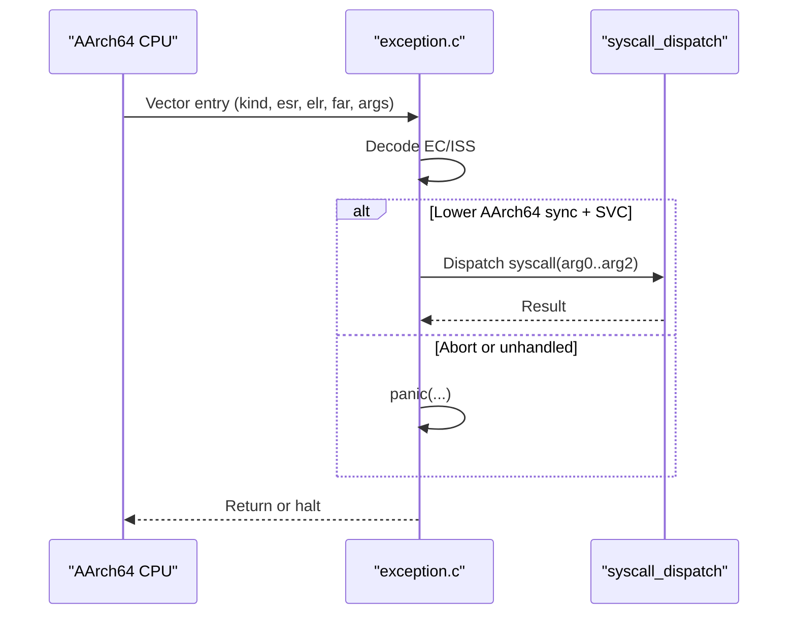
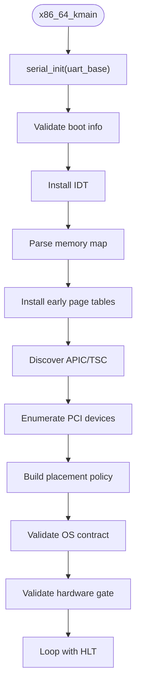
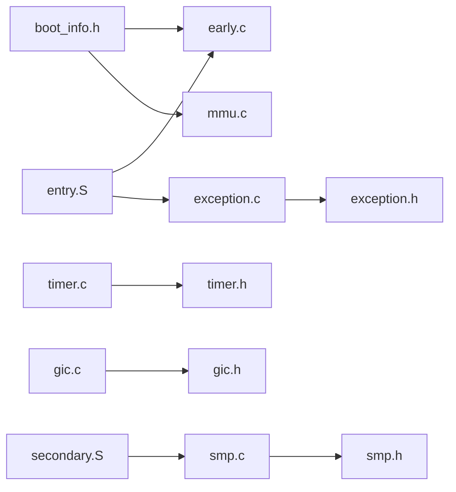

# Platform-Specific Drivers

<cite>
**Referenced Files in This Document**
- [timer.c](file://kernel/arch/aarch64/timer.c)
- [gic.c](file://kernel/arch/aarch64/gic.c)
- [early.c](file://kernel/arch/x86_64/early.c)
- [timer.h](file://kernel/include/osai/timer.h)
- [gic.h](file://kernel/include/osai/gic.h)
- [mmu.c](file://kernel/arch/aarch64/mmu.c)
- [smp.c](file://kernel/arch/aarch64/smp.c)
- [exception.c](file://kernel/arch/aarch64/exception.c)
- [entry.S](file://kernel/arch/x86_64/entry.S)
- [boot_info.h](file://kernel/include/osai/boot_info.h)
- [secondary.S](file://kernel/arch/aarch64/secondary.S)
- [linker_aarch64.ld](file://kernel/arch/aarch64/linker.ld)
- [linker_x86_64.ld](file://kernel/arch/x86_64/linker.ld)
- [smp.h](file://kernel/include/osai/smp.h)
- [exception.h](file://kernel/include/osai/exception.h)
</cite>

## Table of Contents
1. [Introduction](#introduction)
2. [Project Structure](#project-structure)
3. [Core Components](#core-components)
4. [Architecture Overview](#architecture-overview)
5. [Detailed Component Analysis](#detailed-component-analysis)
6. [Dependency Analysis](#dependency-analysis)
7. [Performance Considerations](#performance-considerations)
8. [Troubleshooting Guide](#troubleshooting-guide)
9. [Conclusion](#conclusion)
10. [Appendices](#appendices)

## Introduction
This document describes the platform-specific device drivers in OSAI, focusing on:
- AArch64 generic timer implementation for frequency configuration and tick generation
- AArch64 GIC driver for interrupt discovery and routing
- x86_64 early boot path for hardware feature detection and system initialization
- Hardware Abstraction Layers and integration with the kernel’s scheduler and exception/interrupt handling
- Examples of driver initialization, hardware feature detection, and compatibility handling across SoC variants

## Project Structure
OSAI organizes platform drivers by architecture under kernel/arch/<arch>/ with public interfaces exposed via kernel/include/osai/*. The AArch64 implementation includes timer, GIC, MMU/VMM, SMP, and exception handling. The x86_64 implementation focuses on early boot, IDT setup, and hardware discovery.

**Diagram sources**
- [timer.c:1-55](file://kernel/arch/aarch64/timer.c#L1-L55)
- [gic.c:1-39](file://kernel/arch/aarch64/gic.c#L1-L39)
- [mmu.c:1-452](file://kernel/arch/aarch64/mmu.c#L1-L452)
- [smp.c:1-285](file://kernel/arch/aarch64/smp.c#L1-L285)
- [exception.c:1-138](file://kernel/arch/aarch64/exception.c#L1-L138)
- [secondary.S:1-16](file://kernel/arch/aarch64/secondary.S#L1-L16)
- [linker_aarch64.ld:1-50](file://kernel/arch/aarch64/linker.ld#L1-L50)
- [entry.S:1-100](file://kernel/arch/x86_64/entry.S#L1-L100)
- [early.c:1-726](file://kernel/arch/x86_64/early.c#L1-L726)
- [linker_x86_64.ld:1-36](file://kernel/arch/x86_64/linker.ld#L1-L36)
- [timer.h:1-13](file://kernel/include/osai/timer.h#L1-L13)
- [gic.h:1-19](file://kernel/include/osai/gic.h#L1-L19)
- [smp.h:1-49](file://kernel/include/osai/smp.h#L1-L49)
- [exception.h:1-33](file://kernel/include/osai/exception.h#L1-L33)
- [boot_info.h:1-34](file://kernel/include/osai/boot_info.h#L1-L34)

**Section sources**
- [linker_aarch64.ld:1-50](file://kernel/arch/aarch64/linker.ld#L1-L50)
- [linker_x86_64.ld:1-36](file://kernel/arch/x86_64/linker.ld#L1-L36)

## Core Components
- AArch64 Generic Timer: Reads the generic counter frequency, provides monotonic counter and nanosecond conversion, and validates correctness.
- AArch64 GIC: Discovers GIC distributor properties (interrupt lines, CPU count) and exposes a typed info structure.
- AArch64 MMU/VMM: Builds early page tables, enables MMU, translates and maps pages, and enforces memory attributes.
- AArch64 SMP: Initializes CPU states, boots secondary cores via PSCI, manages core roles and leases, and supports workload dispatch.
- AArch64 Exceptions: Installs vector base, classifies exception types, and routes system calls.
- x86_64 Early Boot: Serial console, IDT setup, memory map parsing, early paging, APIC/TSC discovery, PCI enumeration, placement policy, OS contract validation, and hardware gate checks.

**Section sources**
- [timer.c:1-55](file://kernel/arch/aarch64/timer.c#L1-L55)
- [gic.c:1-39](file://kernel/arch/aarch64/gic.c#L1-L39)
- [mmu.c:1-452](file://kernel/arch/aarch64/mmu.c#L1-L452)
- [smp.c:1-285](file://kernel/arch/aarch64/smp.c#L1-L285)
- [exception.c:1-138](file://kernel/arch/aarch64/exception.c#L1-L138)
- [early.c:1-726](file://kernel/arch/x86_64/early.c#L1-L726)

## Architecture Overview
The platform drivers form the foundation for kernel initialization and runtime:
- AArch64 relies on architectural registers (CNTFRQ_EL0, CNTPCT_EL0) for timing and EL1 vectors for exceptions. The GIC is discovered via MMIO to route interrupts.
- x86_64 sets up an IDT, installs early page tables, discovers APIC and TSC features, enumerates PCI devices, and validates OS contracts before halting in a controlled loop.

**Diagram sources**
- [timer.c:34-38](file://kernel/arch/aarch64/timer.c#L34-L38)
- [gic.c:17-28](file://kernel/arch/aarch64/gic.c#L17-L28)
- [mmu.c:335-339](file://kernel/arch/aarch64/mmu.c#L335-L339)
- [exception.c:85-95](file://kernel/arch/aarch64/exception.c#L85-L95)
- [smp.c:61-104](file://kernel/arch/aarch64/smp.c#L61-L104)

## Detailed Component Analysis

### AArch64 Generic Timer
- Frequency acquisition: Reads CNTFRQ_EL0 to configure the timer frequency.
- Counter and time conversion: Uses CNTPCT_EL0 for monotonic counts and converts to nanoseconds.
- Self-test: Validates monotonicity of counter and time values.

**Diagram sources**
- [timer.c:19-32](file://kernel/arch/aarch64/timer.c#L19-L32)
- [timer.c:34-38](file://kernel/arch/aarch64/timer.c#L34-L38)

**Section sources**
- [timer.c:1-55](file://kernel/arch/aarch64/timer.c#L1-L55)
- [timer.h:6-10](file://kernel/include/osai/timer.h#L6-L10)

### AArch64 GIC Driver
- QEMU virt GICD base is fixed for emulation.
- Reads GICD_CTLR, GICD_TYPER, GICD_IIDR to determine interrupt lines and CPU count hint.
- Exposes a typed info structure for downstream consumers.

**Diagram sources**
- [gic.c:17-28](file://kernel/arch/aarch64/gic.c#L17-L28)

**Section sources**
- [gic.c:1-39](file://kernel/arch/aarch64/gic.c#L1-L39)
- [gic.h:6-12](file://kernel/include/osai/gic.h#L6-L12)

### AArch64 MMU and VMM
- Builds early identity mapping and kernel page tables, preserves serial MMIO region, and enables MMU.
- Provides translation, mapping, unmapping, and user buffer validation with attribute enforcement.

**Diagram sources**
- [mmu.c:258-280](file://kernel/arch/aarch64/mmu.c#L258-L280)
- [mmu.c:335-339](file://kernel/arch/aarch64/mmu.c#L335-L339)
- [mmu.c:341-379](file://kernel/arch/aarch64/mmu.c#L341-L379)

**Section sources**
- [mmu.c:1-452](file://kernel/arch/aarch64/mmu.c#L1-L452)

### AArch64 SMP
- Initializes CPU states, marks boot CPU as housekeeping, boots secondary CPUs via PSCI, and manages core roles and leases.
- Supports workload dispatch across online CPUs.

**Diagram sources**
- [smp.c:61-104](file://kernel/arch/aarch64/smp.c#L61-L104)
- [secondary.S:1-16](file://kernel/arch/aarch64/secondary.S#L1-L16)

**Section sources**
- [smp.c:1-285](file://kernel/arch/aarch64/smp.c#L1-L285)
- [smp.h:1-49](file://kernel/include/osai/smp.h#L1-L49)

### AArch64 Exception Handling
- Installs vector base address for exception vectors.
- Routes SVC (syscall) from lower exception level; handles instruction/data aborts as fatal; logs and panics on unexpected exceptions.

**Diagram sources**
- [exception.c:114-137](file://kernel/arch/aarch64/exception.c#L114-L137)

**Section sources**
- [exception.c:1-138](file://kernel/arch/aarch64/exception.c#L1-L138)
- [exception.h:1-33](file://kernel/include/osai/exception.h#L1-L33)

### x86_64 Early Boot
- Serial console initialization and logging.
- IDT installation with dedicated ISR stubs.
- Memory map parsing and PMM statistics.
- Early page table installation with NX enablement and identity mapping.
- APIC/TSC feature discovery and reporting.
- PCI enumeration and device classification.
- Placement policy construction and OS contract validation.
- Hardware gate checks and milestone reporting.

**Diagram sources**
- [early.c:673-725](file://kernel/arch/x86_64/early.c#L673-L725)
- [entry.S:1-100](file://kernel/arch/x86_64/entry.S#L1-L100)

**Section sources**
- [early.c:1-726](file://kernel/arch/x86_64/early.c#L1-L726)
- [entry.S:1-100](file://kernel/arch/x86_64/entry.S#L1-L100)
- [boot_info.h:20-31](file://kernel/include/osai/boot_info.h#L20-L31)

## Dependency Analysis
- AArch64 timer depends on architectural counters and logs via kernel log facilities.
- GIC driver depends on MMIO reads of GICD registers and exposes a typed info structure.
- MMU/VMM depends on boot info for kernel bounds and serial MMIO region; integrates with exception handling for TLB invalidation.
- SMP depends on PSCI for secondary CPU bring-up and interacts with timer for tick suppression during leases.
- x86_64 early boot depends on boot_info for memory map and kernel bounds; installs IDT and performs PCI/contract validation.

**Diagram sources**
- [boot_info.h:1-34](file://kernel/include/osai/boot_info.h#L1-L34)
- [mmu.c:1-452](file://kernel/arch/aarch64/mmu.c#L1-L452)
- [early.c:1-726](file://kernel/arch/x86_64/early.c#L1-L726)
- [timer.c:1-55](file://kernel/arch/aarch64/timer.c#L1-L55)
- [gic.c:1-39](file://kernel/arch/aarch64/gic.c#L1-L39)
- [exception.c:1-138](file://kernel/arch/aarch64/exception.c#L1-L138)
- [smp.c:1-285](file://kernel/arch/aarch64/smp.c#L1-L285)
- [entry.S:1-100](file://kernel/arch/x86_64/entry.S#L1-L100)
- [secondary.S:1-16](file://kernel/arch/aarch64/secondary.S#L1-L16)
- [timer.h:1-13](file://kernel/include/osai/timer.h#L1-L13)
- [gic.h:1-19](file://kernel/include/osai/gic.h#L1-L19)
- [exception.h:1-33](file://kernel/include/osai/exception.h#L1-L33)
- [smp.h:1-49](file://kernel/include/osai/smp.h#L1-L49)

**Section sources**
- [timer.c:1-55](file://kernel/arch/aarch64/timer.c#L1-L55)
- [gic.c:1-39](file://kernel/arch/aarch64/gic.c#L1-L39)
- [mmu.c:1-452](file://kernel/arch/aarch64/mmu.c#L1-L452)
- [smp.c:1-285](file://kernel/arch/aarch64/smp.c#L1-L285)
- [exception.c:1-138](file://kernel/arch/aarch64/exception.c#L1-L138)
- [early.c:1-726](file://kernel/arch/x86_64/early.c#L1-L726)
- [entry.S:1-100](file://kernel/arch/x86_64/entry.S#L1-L100)
- [secondary.S:1-16](file://kernel/arch/aarch64/secondary.S#L1-L16)
- [boot_info.h:1-34](file://kernel/include/osai/boot_info.h#L1-L34)
- [timer.h:1-13](file://kernel/include/osai/timer.h#L1-L13)
- [gic.h:1-19](file://kernel/include/osai/gic.h#L1-L19)
- [exception.h:1-33](file://kernel/include/osai/exception.h#L1-L33)
- [smp.h:1-49](file://kernel/include/osai/smp.h#L1-L49)

## Performance Considerations
- AArch64 timer uses architectural counters for low overhead; ensure monotonic behavior and avoid excessive conversions.
- GIC discovery reads a small fixed set of registers; cache results in driver state to minimize repeated MMIO.
- MMU/VMM early mapping uses identity blocks for speed; translate/map operations should batch updates to reduce TLB flushes.
- SMP workload dispatch caps iterations and worker counts to bound overhead; leverage online CPU count for parallelism.
- x86_64 early boot performs linear scans over memory descriptors, PCI config space, and CPU topology; keep iteration limits sane.

[No sources needed since this section provides general guidance]

## Troubleshooting Guide
- Timer self-test failure indicates counter or frequency issues; verify CNTFRQ_EL0 and CNTPCT_EL0 accessibility.
- GIC self-test failure suggests incorrect base or insufficient interrupt lines; confirm QEMU virt GICD presence and register reads.
- MMU/VMM translation failures indicate invalid descriptors or missing page tables; check L0/L1/L2/L3 walk and flags mapping.
- SMP bring-up stalls imply PSCI failures or missing secondary stacks; verify PSCI status and stack alignment.
- x86_64 early boot panics often stem from invalid boot info, empty memory map, or missing PCI devices; validate UEFI boot info and device enumeration.
- Exception misrouting occurs if vector base is not installed or syscall dispatch is missing; confirm VBAR_EL1 and SVC handling.

**Section sources**
- [timer.c:40-54](file://kernel/arch/aarch64/timer.c#L40-L54)
- [gic.c:34-38](file://kernel/arch/aarch64/gic.c#L34-L38)
- [mmu.c:433-451](file://kernel/arch/aarch64/mmu.c#L433-L451)
- [smp.c:273-284](file://kernel/arch/aarch64/smp.c#L273-L284)
- [early.c:306-313](file://kernel/arch/x86_64/early.c#L306-L313)
- [exception.c:97-105](file://kernel/arch/aarch64/exception.c#L97-L105)

## Conclusion
OSAI’s platform drivers provide robust, architecture-specific foundations:
- AArch64 leverages architectural timers and exceptions, discovers GIC capabilities, and establishes MMU/VMM and SMP.
- x86_64 implements a comprehensive early boot path with hardware discovery, paging, and contract validation.
These components integrate tightly with the kernel’s scheduler and runtime, enabling reliable timer-based scheduling and interrupt-driven event processing across diverse SoC environments.

[No sources needed since this section summarizes without analyzing specific files]

## Appendices

### Integration with Scheduler and Event Processing
- Timer-based scheduling: AArch64 timer provides frequency and monotonic counter for tick generation and sleep calculations.
- Interrupt handling: AArch64 exceptions route system calls; x86_64 IDT forwards interrupts to common handlers.
- Power management: AArch64 SMP supports core lease transitions and tick suppression for idle-like behavior; x86_64 APIC/TSC discovery informs timer features.

**Section sources**
- [timer.c:1-55](file://kernel/arch/aarch64/timer.c#L1-L55)
- [exception.c:1-138](file://kernel/arch/aarch64/exception.c#L1-L138)
- [entry.S:1-100](file://kernel/arch/x86_64/entry.S#L1-L100)
- [smp.c:1-285](file://kernel/arch/aarch64/smp.c#L1-L285)
- [early.c:434-469](file://kernel/arch/x86_64/early.c#L434-L469)

### Compatibility Across SoC Variants
- AArch64 GIC: Uses QEMU virt GICD base for emulation; adapt base and register offsets for real hardware.
- x86_64 PCI: Enumerates devices generically; adjust expectations for different vendors/classes in production systems.
- Linker scripts: AArch64 and x86_64 define distinct memory layouts; ensure alignment and symbol placement match target hardware.

**Section sources**
- [gic.c:5-28](file://kernel/arch/aarch64/gic.c#L5-L28)
- [early.c:471-538](file://kernel/arch/x86_64/early.c#L471-L538)
- [linker_aarch64.ld:1-50](file://kernel/arch/aarch64/linker.ld#L1-L50)
- [linker_x86_64.ld:1-36](file://kernel/arch/x86_64/linker.ld#L1-L36)