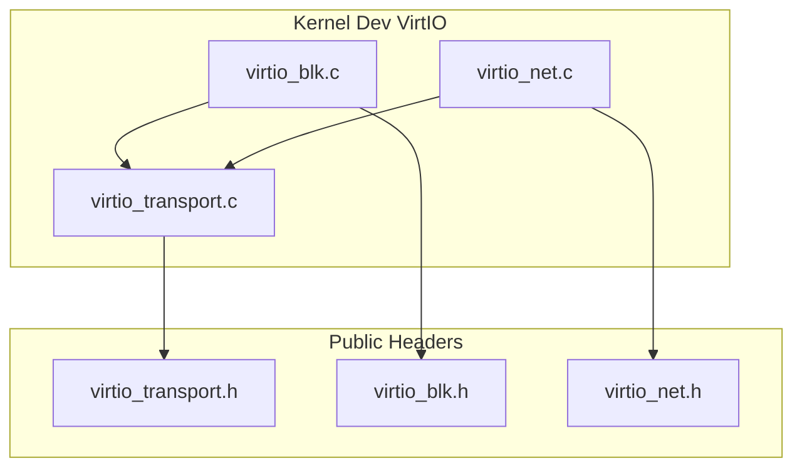
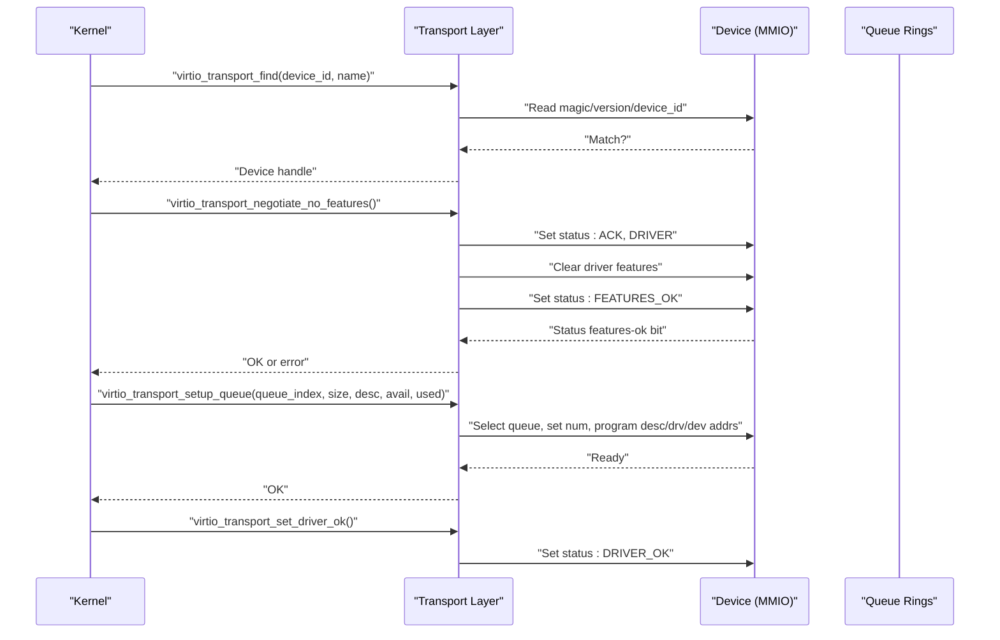
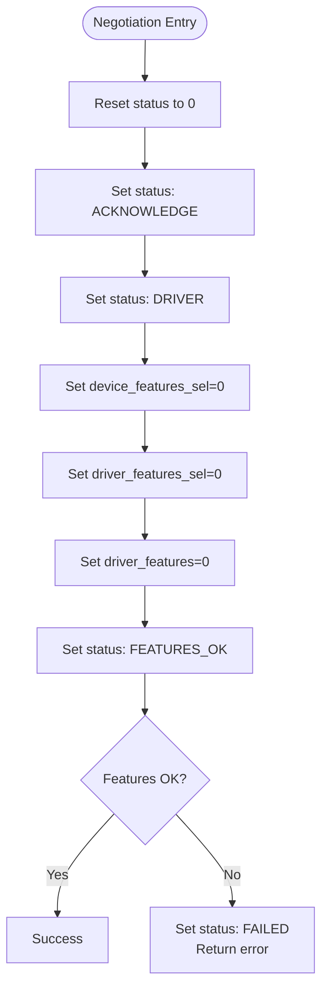
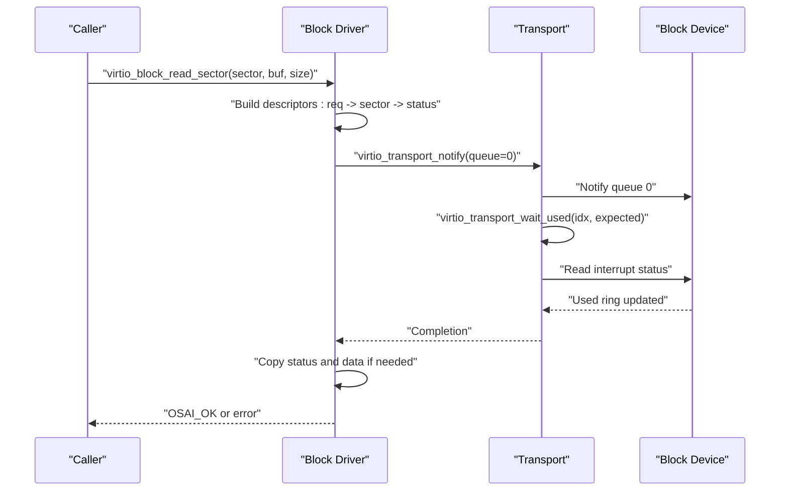
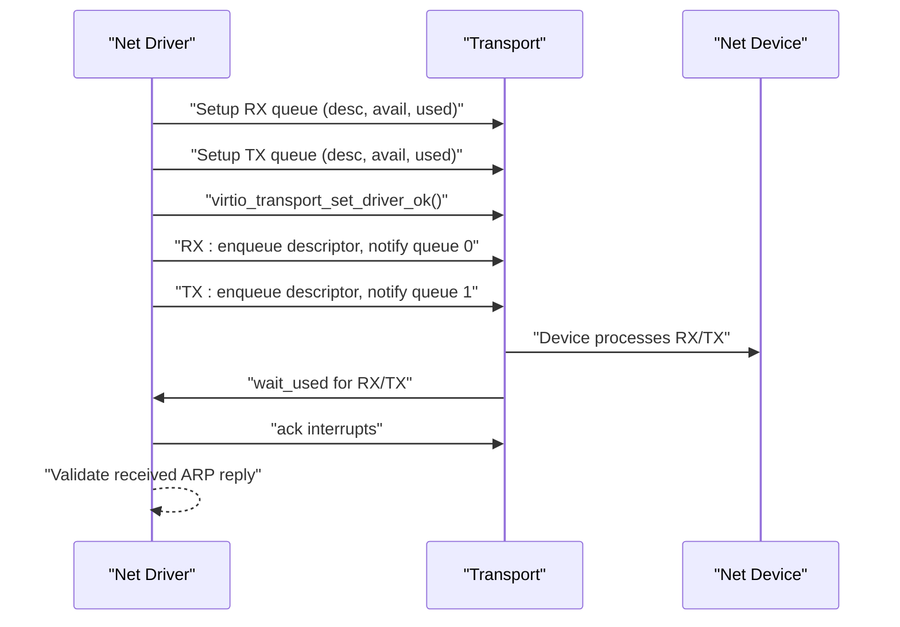
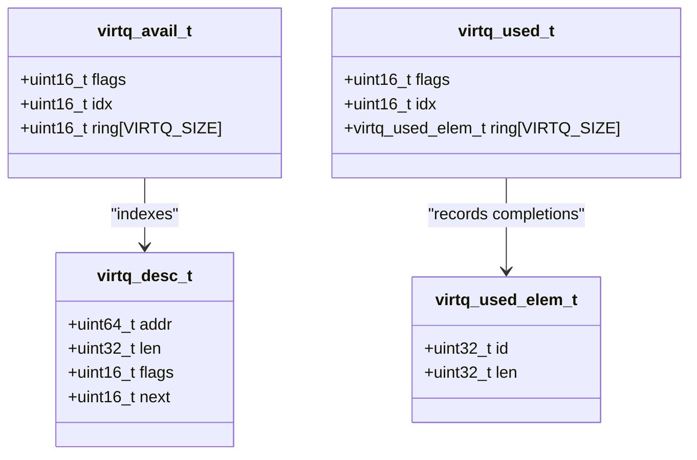
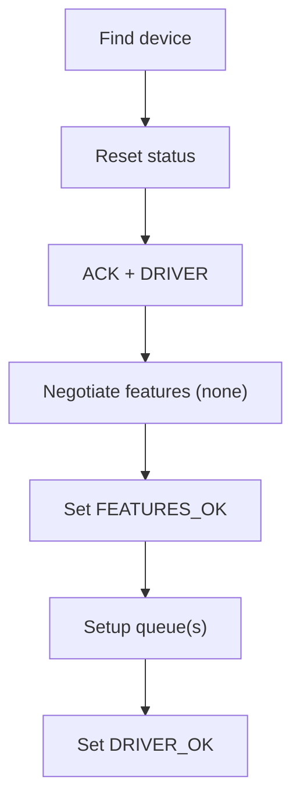
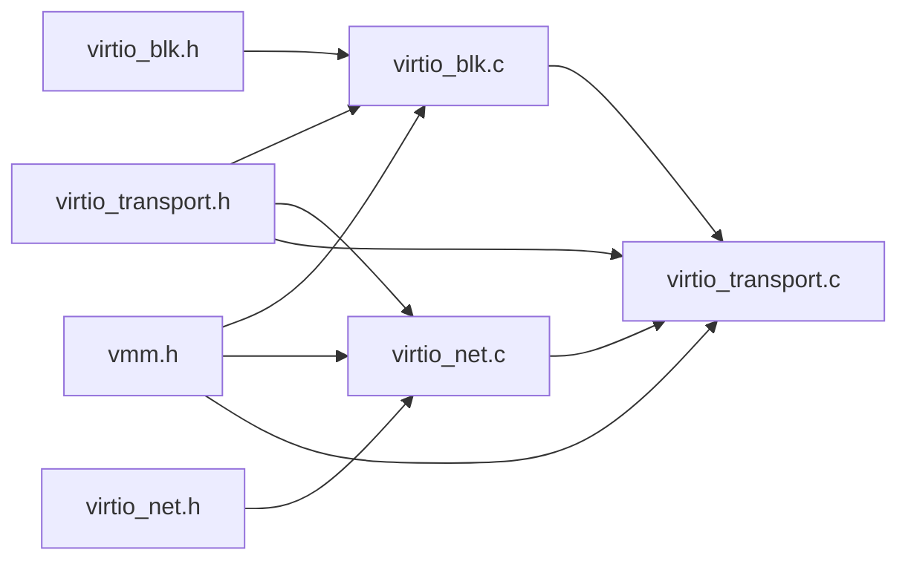

# VirtIO Drivers

<cite>
**Referenced Files in This Document**
- [virtio_blk.c](file://kernel/dev/virtio/virtio_blk.c)
- [virtio_net.c](file://kernel/dev/virtio/virtio_net.c)
- [virtio_transport.c](file://kernel/dev/virtio/virtio_transport.c)
- [virtio_blk.h](file://kernel/include/osai/virtio_blk.h)
- [virtio_net.h](file://kernel/include/osai/virtio_net.h)
- [virtio_transport.h](file://kernel/include/osai/virtio_transport.h)
- [kmain.c](file://kernel/core/kmain.c)
- [vmm.h](file://kernel/include/osai/vmm.h)
- [mmu.c](file://kernel/arch/aarch64/mmu.c)
</cite>

## Table of Contents
1. [Introduction](#introduction)
2. [Project Structure](#project-structure)
3. [Core Components](#core-components)
4. [Architecture Overview](#architecture-overview)
5. [Detailed Component Analysis](#detailed-component-analysis)
6. [Dependency Analysis](#dependency-analysis)
7. [Performance Considerations](#performance-considerations)
8. [Troubleshooting Guide](#troubleshooting-guide)
9. [Conclusion](#conclusion)
10. [Appendices](#appendices)

## Introduction
This document explains OSAI’s VirtIO device drivers for block and network devices. It covers the VirtIO block driver (disk I/O), the VirtIO network driver (packet RX/TX), and the underlying VirtIO transport layer that implements the VirtIO specification over MMIO. Topics include driver initialization, feature negotiation, queue setup, descriptor tables, scatter-gather DMA handling, notification mechanisms, status reporting, and performance optimization. Practical examples are provided via code snippet paths to guide driver registration, device probing, and I/O handling.

## Project Structure
The VirtIO implementation resides under kernel/dev/virtio and exposes public APIs via kernel/include/osai. The transport layer handles MMIO registers and queue setup, while block and network drivers implement device-specific logic.

**Diagram sources**
- [virtio_transport.c:1-183](file://kernel/dev/virtio/virtio_transport.c#L1-L183)
- [virtio_blk.c:1-225](file://kernel/dev/virtio/virtio_blk.c#L1-L225)
- [virtio_net.c:1-183](file://kernel/dev/virtio/virtio_net.c#L1-L183)
- [virtio_transport.h:1-64](file://kernel/include/osai/virtio_transport.h#L1-L64)
- [virtio_blk.h:1-16](file://kernel/include/osai/virtio_blk.h#L1-L16)
- [virtio_net.h:1-7](file://kernel/include/osai/virtio_net.h#L1-L7)

**Section sources**
- [virtio_transport.c:1-183](file://kernel/dev/virtio/virtio_transport.c#L1-L183)
- [virtio_blk.c:1-225](file://kernel/dev/virtio/virtio_blk.c#L1-L225)
- [virtio_net.c:1-183](file://kernel/dev/virtio/virtio_net.c#L1-L183)
- [virtio_transport.h:1-64](file://kernel/include/osai/virtio_transport.h#L1-L64)
- [virtio_blk.h:1-16](file://kernel/include/osai/virtio_blk.h#L1-L16)
- [virtio_net.h:1-7](file://kernel/include/osai/virtio_net.h#L1-L7)

## Core Components
- Transport layer (virtio_transport.c): Implements MMIO register access, device discovery, feature negotiation, queue setup, notifications, and interrupt acknowledgment.
- Block driver (virtio_blk.c): Provides sector-based read/write operations, descriptor table construction, DMA mapping, and completion polling.
- Network driver (virtio_net.c): Manages separate RX/TX queues, builds Ethernet frames, validates ARP replies, and demonstrates packet exchange.

Key public APIs:
- Block: [virtio_block_init:7-13](file://kernel/include/osai/virtio_blk.h#L7-L13), [virtio_block_read_sector:8-12](file://kernel/include/osai/virtio_blk.h#L8-L12), [virtio_block_write_sector:9-13](file://kernel/include/osai/virtio_blk.h#L9-L13), [virtio_block_capacity_sectors:10-13](file://kernel/include/osai/virtio_blk.h#L10-L13)
- Network: [virtio_net_self_test:4-4](file://kernel/include/osai/virtio_net.h#L4-L4)
- Transport: [virtio_transport_find:45-46](file://kernel/include/osai/virtio_transport.h#L45-L46), [virtio_transport_negotiate_no_features:48-50](file://kernel/include/osai/virtio_transport.h#L48-L50), [virtio_transport_setup_queue:50-55](file://kernel/include/osai/virtio_transport.h#L50-L55), [virtio_transport_set_driver_ok:55-56](file://kernel/include/osai/virtio_transport.h#L55-L56), [virtio_transport_notify:57-58](file://kernel/include/osai/virtio_transport.h#L57-L58), [virtio_transport_wait_used:59-60](file://kernel/include/osai/virtio_transport.h#L59-L60), [virtio_transport_ack_interrupts:61-61](file://kernel/include/osai/virtio_transport.h#L61-L61)

**Section sources**
- [virtio_blk.h:1-16](file://kernel/include/osai/virtio_blk.h#L1-L16)
- [virtio_net.h:1-7](file://kernel/include/osai/virtio_net.h#L1-L7)
- [virtio_transport.h:1-64](file://kernel/include/osai/virtio_transport.h#L1-L64)

## Architecture Overview
The drivers follow the VirtIO specification over MMIO. Device discovery scans a fixed range of MMIO slots. Feature negotiation sets driver status bits and disables features for simplicity. Queue setup programs descriptor, driver, and device ring addresses. I/O operations enqueue descriptors, notify the device, wait for completion, and acknowledge interrupts.

**Diagram sources**
- [virtio_transport.c:75-122](file://kernel/dev/virtio/virtio_transport.c#L75-L122)
- [virtio_transport.c:124-151](file://kernel/dev/virtio/virtio_transport.c#L124-L151)
- [virtio_transport.c:153-156](file://kernel/dev/virtio/virtio_transport.c#L153-L156)

**Section sources**
- [virtio_transport.c:75-156](file://kernel/dev/virtio/virtio_transport.c#L75-L156)

## Detailed Component Analysis

### VirtIO Transport Layer
Responsibilities:
- MMIO register access helpers and memory barriers.
- Device discovery scanning MMIO slots for matching magic, version, and device ID.
- Feature negotiation sequence and status transitions.
- Queue setup: select queue, validate max size, set queue size, program descriptor and ring addresses, mark ready.
- Notification and completion polling with timeout.
- Interrupt acknowledgment.

Important behaviors:
- Memory barrier ensures ordering around descriptor updates and notifications.
- DMA addresses are resolved via VMM translation to guarantee device accessibility.
- Status bits follow VirtIO semantics: ACK, DRIVER, FEATURES_OK, DRIVER_OK, FAILED.

**Diagram sources**
- [virtio_transport.c:104-122](file://kernel/dev/virtio/virtio_transport.c#L104-L122)

**Section sources**
- [virtio_transport.c:41-98](file://kernel/dev/virtio/virtio_transport.c#L41-L98)
- [virtio_transport.c:104-151](file://kernel/dev/virtio/virtio_transport.c#L104-L151)
- [virtio_transport.c:164-182](file://kernel/dev/virtio/virtio_transport.c#L164-L182)
- [vmm.h:1-28](file://kernel/include/osai/vmm.h#L1-L28)
- [mmu.c:341-394](file://kernel/arch/aarch64/mmu.c#L341-L394)

### VirtIO Block Driver
Responsibilities:
- Initialize driver state and allocate per-queue descriptor tables and buffers.
- Probe for a VirtIO block device and negotiate features.
- Set up a single queue and read device capacity from config.
- Perform sector reads/writes using three-descriptor requests: request header, payload, status.

I/O flow:
- Build a request descriptor pointing to a small request header.
- Chain a second descriptor for the sector-sized payload buffer.
- Add a third descriptor for a one-byte status field.
- Enqueue via avail ring, bump index, notify device, poll used ring, ack interrupts, and copy back data if read.

**Diagram sources**
- [virtio_blk.c:122-181](file://kernel/dev/virtio/virtio_blk.c#L122-L181)
- [virtio_transport.c:158-173](file://kernel/dev/virtio/virtio_transport.c#L158-L173)
- [virtio_transport.c:175-182](file://kernel/dev/virtio/virtio_transport.c#L175-L182)

**Section sources**
- [virtio_blk.c:87-113](file://kernel/dev/virtio/virtio_blk.c#L87-L113)
- [virtio_blk.c:122-181](file://kernel/dev/virtio/virtio_blk.c#L122-L181)
- [virtio_blk.c:194-224](file://kernel/dev/virtio/virtio_blk.c#L194-L224)

### VirtIO Network Driver
Responsibilities:
- Allocate separate RX and TX queues and buffers.
- Discover a VirtIO network device and negotiate features.
- Set up RX queue with a writeable descriptor for incoming packets and TX queue for outgoing frames.
- Send an ARP request and wait for a reply; validate the response.

Packet flow:
- RX: Descriptor marked WRITE so the device writes directly into a receive buffer; enqueue and notify.
- TX: Descriptor holds the prepared frame; enqueue and notify.
- Completion: Poll used rings and acknowledge interrupts.

**Diagram sources**
- [virtio_net.c:131-182](file://kernel/dev/virtio/virtio_net.c#L131-L182)
- [virtio_transport.c:124-151](file://kernel/dev/virtio/virtio_transport.c#L124-L151)
- [virtio_transport.c:158-182](file://kernel/dev/virtio/virtio_transport.c#L158-L182)

**Section sources**
- [virtio_net.c:48-70](file://kernel/dev/virtio/virtio_net.c#L48-L70)
- [virtio_net.c:131-182](file://kernel/dev/virtio/virtio_net.c#L131-L182)

### Descriptor Tables and Scatter-Gather DMA
- Descriptor layout: address, length, flags, next pointer.
- Flags include NEXT and WRITE; chaining enables scatter-gather across multiple pages.
- DMA addresses are computed via VMM translation to ensure device accessibility.
- Barrier ensures memory ordering around descriptor updates and notifications.

**Diagram sources**
- [virtio_transport.h:12-34](file://kernel/include/osai/virtio_transport.h#L12-L34)

**Section sources**
- [virtio_transport.h:7-34](file://kernel/include/osai/virtio_transport.h#L7-L34)
- [virtio_transport.c:51-68](file://kernel/dev/virtio/virtio_transport.c#L51-L68)
- [vmm.h:1-28](file://kernel/include/osai/vmm.h#L1-L28)
- [mmu.c:341-394](file://kernel/arch/aarch64/mmu.c#L341-L394)

### Driver Initialization Sequences and Device Probing
- Discovery: scan MMIO slots for VirtIO magic/version and matching device ID.
- Negotiation: set status bits and clear features to zero.
- Queue setup: select queue, confirm max size, set queue size, program descriptor and ring addresses, mark ready.
- Finalization: set DRIVER_OK to signal readiness to the device.

**Diagram sources**
- [virtio_transport.c:75-122](file://kernel/dev/virtio/virtio_transport.c#L75-L122)
- [virtio_transport.c:124-151](file://kernel/dev/virtio/virtio_transport.c#L124-L151)
- [virtio_transport.c:153-156](file://kernel/dev/virtio/virtio_transport.c#L153-L156)

**Section sources**
- [virtio_transport.c:75-156](file://kernel/dev/virtio/virtio_transport.c#L75-L156)

### I/O Operation Handling Examples
- Block read: [virtio_block_read_sector:183-187](file://kernel/dev/virtio/virtio_blk.c#L183-L187)
- Block write: [virtio_block_write_sector:189-193](file://kernel/dev/virtio/virtio_blk.c#L189-L193)
- Block self-test: [virtio_block_self_test:195-224](file://kernel/dev/virtio/virtio_blk.c#L195-L224)
- Network self-test: [virtio_net_self_test:131-182](file://kernel/dev/virtio/virtio_net.c#L131-L182)

**Section sources**
- [virtio_blk.c:183-193](file://kernel/dev/virtio/virtio_blk.c#L183-L193)
- [virtio_blk.c:195-224](file://kernel/dev/virtio/virtio_blk.c#L195-L224)
- [virtio_net.c:131-182](file://kernel/dev/virtio/virtio_net.c#L131-L182)

## Dependency Analysis
- virtio_blk.c depends on virtio_transport.h and vmm.h for queue setup and DMA translation.
- virtio_net.c depends on virtio_transport.h and vmm.h similarly.
- virtio_transport.c depends on vmm.h for DMA address computation and uses architecture-specific barrier intrinsics.
- Public headers define the API surface and shared data structures.

**Diagram sources**
- [virtio_blk.c:1-6](file://kernel/dev/virtio/virtio_blk.c#L1-L6)
- [virtio_net.c:1-6](file://kernel/dev/virtio/virtio_net.c#L1-L6)
- [virtio_transport.c:1-4](file://kernel/dev/virtio/virtio_transport.c#L1-L4)
- [virtio_transport.h:1-64](file://kernel/include/osai/virtio_transport.h#L1-L64)
- [vmm.h:1-28](file://kernel/include/osai/vmm.h#L1-L28)

**Section sources**
- [virtio_blk.c:1-6](file://kernel/dev/virtio/virtio_blk.c#L1-L6)
- [virtio_net.c:1-6](file://kernel/dev/virtio/virtio_net.c#L1-L6)
- [virtio_transport.c:1-4](file://kernel/dev/virtio/virtio_transport.c#L1-L4)
- [virtio_transport.h:1-64](file://kernel/include/osai/virtio_transport.h#L1-L64)
- [vmm.h:1-28](file://kernel/include/osai/vmm.h#L1-L28)

## Performance Considerations
- Queue sizing: VIRTQ_SIZE is small (8), which reduces memory footprint but may increase overhead for large transfers. Consider batching multiple sectors or frames when extending the driver.
- Descriptor chaining: Prefer contiguous buffers when possible to minimize descriptor count and improve cache locality.
- DMA translation: Ensure buffers are allocated from appropriate pools and avoid frequent allocations during I/O hot paths.
- Notification and polling: Use notify only after enqueuing descriptors and poll with a bounded spin limit to avoid starvation.
- Interrupt handling: Acknowledge interrupts promptly to prevent spurious wakeups and maintain responsiveness.

[No sources needed since this section provides general guidance]

## Troubleshooting Guide
Common issues and mitigations:
- Queue overflow: Ensure the number of descriptors enqueued does not exceed queue size and that the used index advances as expected. Use wait_used with a bounded loop and log unexpected timeouts.
- Descriptor corruption: Zero descriptor tables before reuse, set NEXT flags correctly, and ensure chained indices are within bounds.
- DMA errors: Verify VMM translation succeeds and buffers are mapped as device-accessible. Confirm barrier usage around descriptor updates.
- Interrupt storms: Acknowledge interrupts after processing and avoid re-enqueuing descriptors without device consent.
- Capacity mismatch: Validate sector indices against reported capacity before issuing I/O.

Relevant code paths:
- Wait and ack: [virtio_transport_wait_used:164-173](file://kernel/dev/virtio/virtio_transport.c#L164-L173), [virtio_transport_ack_interrupts:175-182](file://kernel/dev/virtio/virtio_transport.c#L175-L182)
- DMA translation: [dma_address:62-68](file://kernel/dev/virtio/virtio_transport.c#L62-L68), [vmm_translate:341-394](file://kernel/arch/aarch64/mmu.c#L341-L394)
- Self-tests: [virtio_block_self_test:195-224](file://kernel/dev/virtio/virtio_blk.c#L195-L224), [virtio_net_self_test:131-182](file://kernel/dev/virtio/virtio_net.c#L131-L182)

**Section sources**
- [virtio_transport.c:164-182](file://kernel/dev/virtio/virtio_transport.c#L164-L182)
- [virtio_transport.c:62-68](file://kernel/dev/virtio/virtio_transport.c#L62-L68)
- [mmu.c:341-394](file://kernel/arch/aarch64/mmu.c#L341-L394)
- [virtio_blk.c:195-224](file://kernel/dev/virtio/virtio_blk.c#L195-L224)
- [virtio_net.c:131-182](file://kernel/dev/virtio/virtio_net.c#L131-L182)

## Conclusion
OSAI’s VirtIO drivers implement a minimal, robust transport and device layer over MMIO. The block driver demonstrates sector-based I/O with descriptor chaining and explicit status handling, while the network driver showcases dual queues and basic frame validation. The transport layer encapsulates VirtIO protocol mechanics, including device discovery, feature negotiation, queue setup, notifications, and completion polling. Extending these drivers involves careful descriptor management, DMA mapping, and adherence to VirtIO semantics.

[No sources needed since this section summarizes without analyzing specific files]

## Appendices

### Example: Driver Registration and Device Probing
- Block: [virtio_block_init:87-113](file://kernel/dev/virtio/virtio_blk.c#L87-L113)
- Network: [virtio_net_self_test:131-182](file://kernel/dev/virtio/virtio_net.c#L131-L182)
- Entry point tests: [kmain.c:117-121](file://kernel/core/kmain.c#L117-L121)

**Section sources**
- [virtio_blk.c:87-113](file://kernel/dev/virtio/virtio_blk.c#L87-L113)
- [virtio_net.c:131-182](file://kernel/dev/virtio/virtio_net.c#L131-L182)
- [kmain.c:117-121](file://kernel/core/kmain.c#L117-L121)