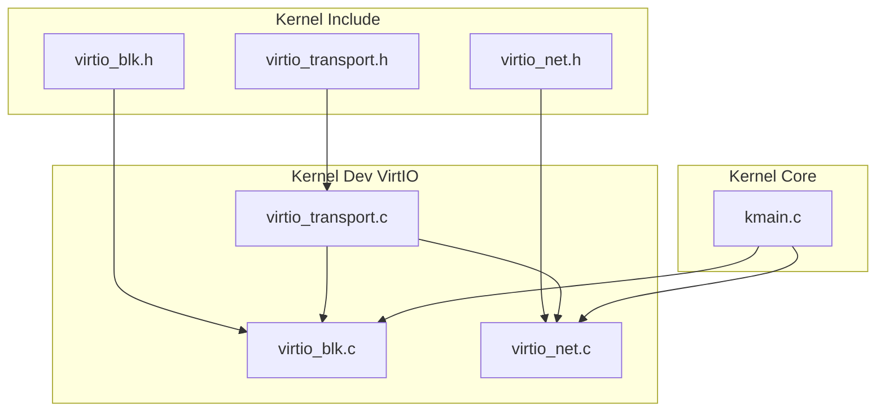
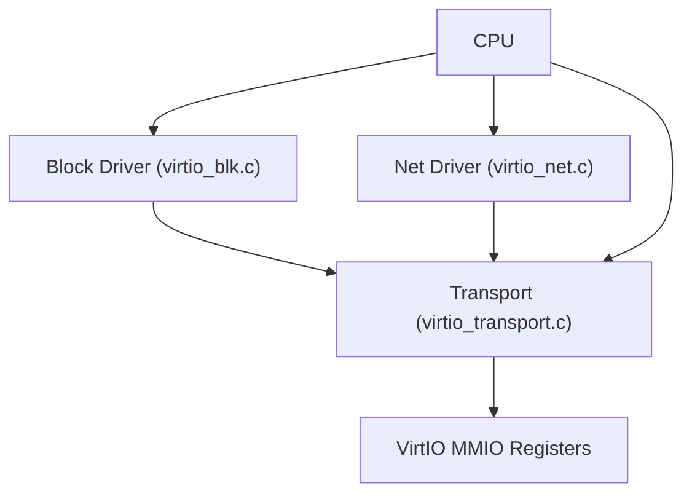
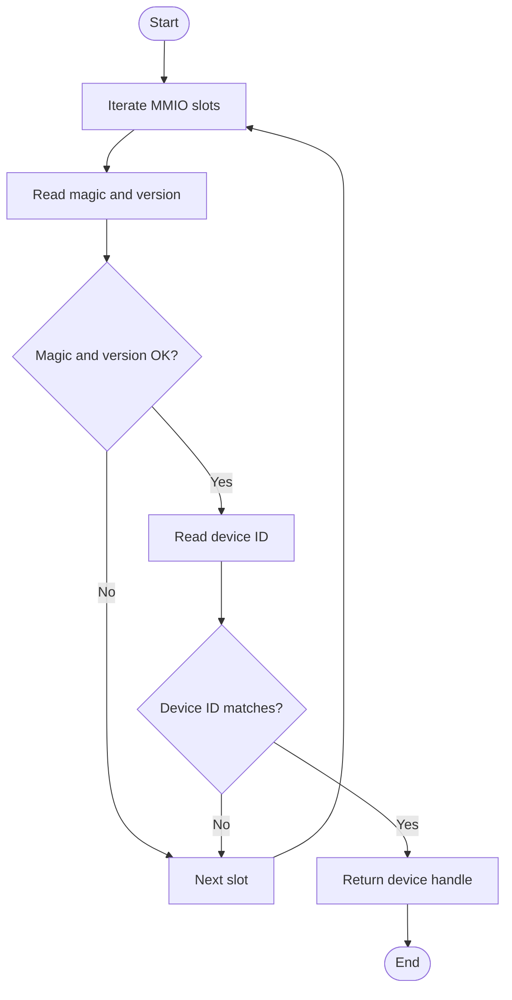
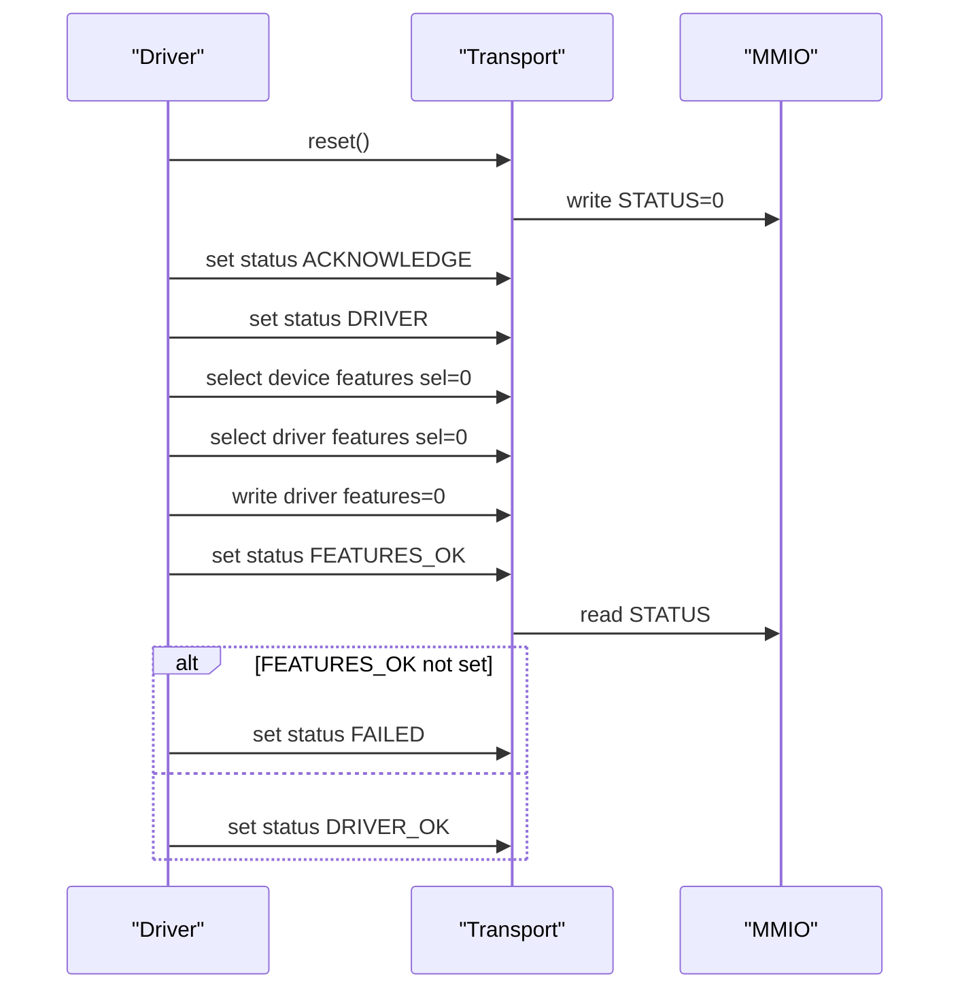
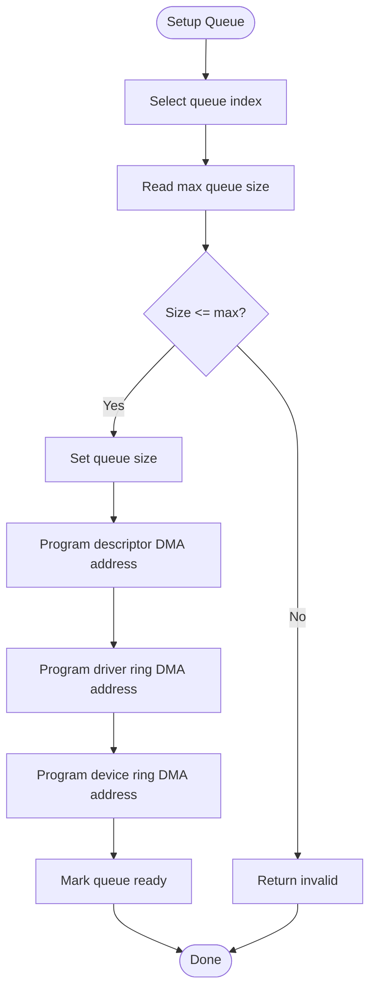
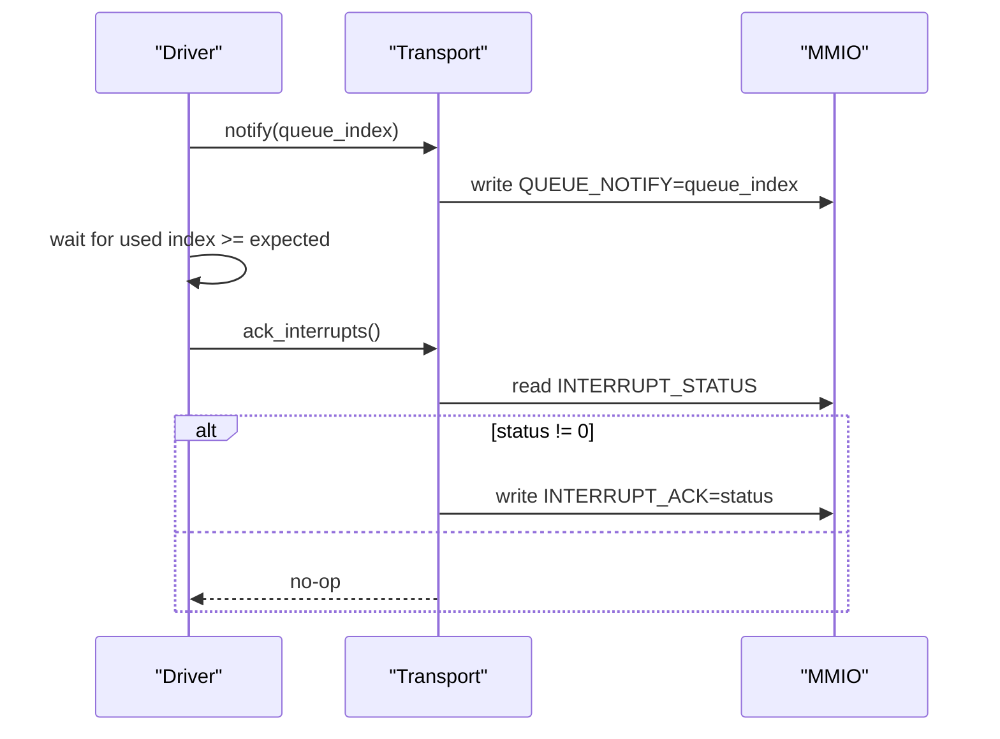
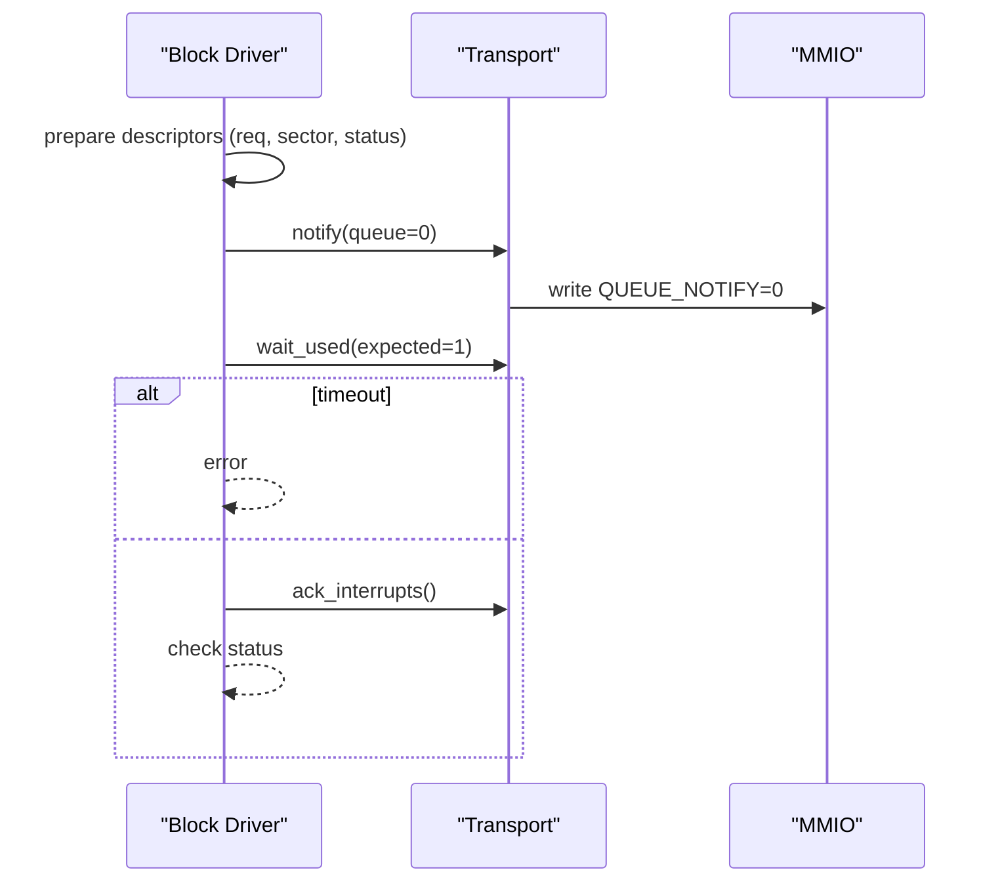
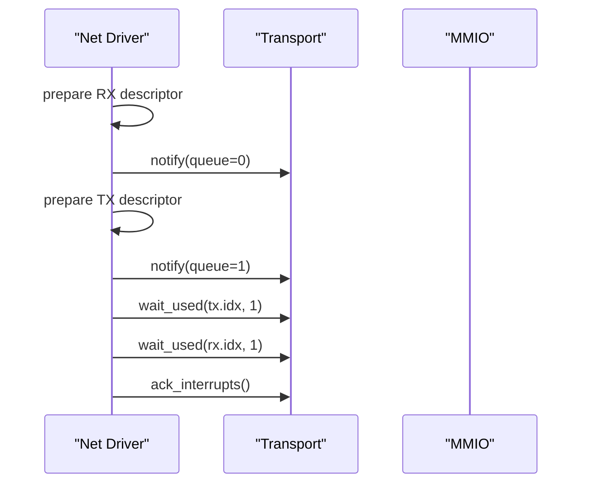
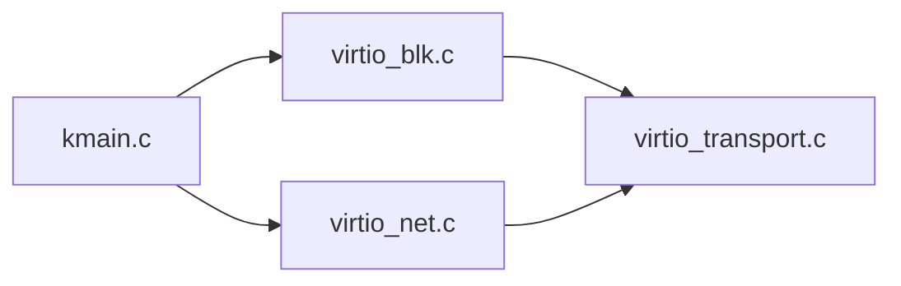
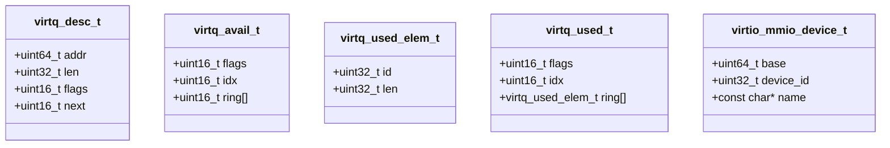

# VirtIO Transport Layer

<cite>
**Referenced Files in This Document**
- [virtio_transport.c](file://kernel/dev/virtio/virtio_transport.c)
- [virtio_transport.h](file://kernel/include/osai/virtio_transport.h)
- [virtio_blk.c](file://kernel/dev/virtio/virtio_blk.c)
- [virtio_net.c](file://kernel/dev/virtio/virtio_net.c)
- [virtio_blk.h](file://kernel/include/osai/virtio_blk.h)
- [virtio_net.h](file://kernel/include/osai/virtio_net.h)
- [kmain.c](file://kernel/core/kmain.c)
</cite>

## Table of Contents
1. [Introduction](#introduction)
2. [Project Structure](#project-structure)
3. [Core Components](#core-components)
4. [Architecture Overview](#architecture-overview)
5. [Detailed Component Analysis](#detailed-component-analysis)
6. [Dependency Analysis](#dependency-analysis)
7. [Performance Considerations](#performance-considerations)
8. [Troubleshooting Guide](#troubleshooting-guide)
9. [Conclusion](#conclusion)
10. [Appendices](#appendices)

## Introduction
This document describes the VirtIO transport layer implementation present in the kernel. It explains how devices are discovered via MMIO, how configuration registers are accessed, how device status and feature negotiation work, how queues are set up and used, and how interrupts are handled. It also covers memory mapping for VirtIO rings, DMA buffer allocation, error handling, device reset, and practical examples of initialization, binding, and cleanup. Performance considerations such as ring sizing, batching, and interrupt optimization are included.

## Project Structure
The VirtIO transport layer is implemented under kernel/dev/virtio and exposed via public headers under kernel/include/osai. Device-specific drivers (block and network) consume the transport APIs to bind to hardware.

**Diagram sources**
- [virtio_transport.h:1-64](file://kernel/include/osai/virtio_transport.h#L1-L64)
- [virtio_transport.c:1-183](file://kernel/dev/virtio/virtio_transport.c#L1-L183)
- [virtio_blk.c:1-225](file://kernel/dev/virtio/virtio_blk.c#L1-L225)
- [virtio_net.c:1-183](file://kernel/dev/virtio/virtio_net.c#L1-L183)
- [virtio_blk.h:1-16](file://kernel/include/osai/virtio_blk.h#L1-L16)
- [virtio_net.h:1-7](file://kernel/include/osai/virtio_net.h#L1-L7)
- [kmain.c:1-223](file://kernel/core/kmain.c#L1-L223)

**Section sources**
- [virtio_transport.c:1-183](file://kernel/dev/virtio/virtio_transport.c#L1-L183)
- [virtio_transport.h:1-64](file://kernel/include/osai/virtio_transport.h#L1-L64)
- [virtio_blk.c:1-225](file://kernel/dev/virtio/virtio_blk.c#L1-L225)
- [virtio_net.c:1-183](file://kernel/dev/virtio/virtio_net.c#L1-L183)
- [virtio_blk.h:1-16](file://kernel/include/osai/virtio_blk.h#L1-L16)
- [virtio_net.h:1-7](file://kernel/include/osai/virtio_net.h#L1-L7)
- [kmain.c:1-223](file://kernel/core/kmain.c#L1-L223)

## Core Components
- Transport MMIO interface: read/write helpers, barrier, and register offsets for VirtIO MMIO.
- Device discovery and identification: scan MMIO slots for a matching device ID and version.
- Status management: set and interpret VirtIO status bits.
- Feature negotiation: select driver features and finalize negotiation.
- Queue setup: configure queue index, size, and DMA addresses for descriptor, driver, and device rings.
- Notification and synchronization: notify device, wait for completion, acknowledge interrupts.
- Memory mapping and DMA: translate virtual buffers to DMA addresses for device access.

Key public APIs and data structures are declared in the transport header and implemented in the transport module.

**Section sources**
- [virtio_transport.h:1-64](file://kernel/include/osai/virtio_transport.h#L1-L64)
- [virtio_transport.c:41-182](file://kernel/dev/virtio/virtio_transport.c#L41-L182)

## Architecture Overview
The transport layer abstracts VirtIO MMIO registers and provides a simple API for higher-level drivers. Block and network drivers initialize the transport, negotiate features, set up queues, and exchange data via VirtIO rings. Interrupts are acknowledged after processing.

**Diagram sources**
- [virtio_transport.c:1-183](file://kernel/dev/virtio/virtio_transport.c#L1-L183)
- [virtio_blk.c:1-225](file://kernel/dev/virtio/virtio_blk.c#L1-L225)
- [virtio_net.c:1-183](file://kernel/dev/virtio/virtio_net.c#L1-L183)

## Detailed Component Analysis

### Transport MMIO Interface
- Read/write helpers: provide 32-bit MMIO accessors for a given base and offset.
- Barrier: ensures ordering around MMIO operations.
- Register constants: define VirtIO MMIO offsets for magic, version, device/vendor IDs, features, queue configuration, interrupt status/ack, and status.

Implementation highlights:
- Read/write helpers encapsulate pointer arithmetic and volatile access.
- Barrier uses an architecture-specific instruction to prevent reordering.
- Register offsets align with VirtIO MMIO specification.

**Section sources**
- [virtio_transport.c:41-53](file://kernel/dev/virtio/virtio_transport.c#L41-L53)
- [virtio_transport.c:11-32](file://kernel/dev/virtio/virtio_transport.c#L11-L32)

### Device Discovery and Enumeration
- Scans a fixed range of MMIO slots at a constant base with stride.
- Validates magic number and minimum version.
- Matches against requested device ID and returns the device handle with base address and name.

Discovery flow:

**Diagram sources**
- [virtio_transport.c:75-98](file://kernel/dev/virtio/virtio_transport.c#L75-L98)

**Section sources**
- [virtio_transport.c:75-98](file://kernel/dev/virtio/virtio_transport.c#L75-L98)

### Status Management and Feature Negotiation
- Reset clears all status bits.
- Acknowledge and driver presence steps are performed before feature selection.
- Negotiation writes zero features to finalize a “no-features” baseline.
- Final status checks ensure FEATURES_OK is set; otherwise marks FAILED.

Negotiation sequence:

**Diagram sources**
- [virtio_transport.c:100-122](file://kernel/dev/virtio/virtio_transport.c#L100-L122)

**Section sources**
- [virtio_transport.c:100-122](file://kernel/dev/virtio/virtio_transport.c#L100-L122)

### Queue Setup and Ring Management
- Select queue index and verify maximum supported queue size.
- Set queue size and program DMA addresses for descriptor, driver, and device rings.
- Mark queue ready to activate it.

Queue setup flow:

**Diagram sources**
- [virtio_transport.c:124-151](file://kernel/dev/virtio/virtio_transport.c#L124-L151)

**Section sources**
- [virtio_transport.c:124-151](file://kernel/dev/virtio/virtio_transport.c#L124-L151)

### Interrupt Handling and Notification Delivery
- Acknowledge interrupts by reading status and writing back the status value.
- Notify device by writing the queue index to the notification register.
- Synchronize with a spin-wait loop that checks the used index.

Interrupt and notification flow:

**Diagram sources**
- [virtio_transport.c:158-182](file://kernel/dev/virtio/virtio_transport.c#L158-L182)

**Section sources**
- [virtio_transport.c:158-182](file://kernel/dev/virtio/virtio_transport.c#L158-L182)

### Memory Mapping and DMA Buffer Allocation
- DMA addresses are derived by translating virtual pointers through the virtual memory manager.
- Drivers allocate per-queue buffers and packets, ensuring alignment and size requirements.
- Barrier is used around enqueue operations to ensure device visibility.

DMA and barrier usage:
- Translation uses a VMM function to resolve physical addresses.
- Drivers zero-initialize buffers before use.
- Barrier precedes notifications to flush writes.

**Section sources**
- [virtio_transport.c:62-68](file://kernel/dev/virtio/virtio_transport.c#L62-L68)
- [virtio_blk.c:51-57](file://kernel/dev/virtio/virtio_blk.c#L51-L57)
- [virtio_blk.c:164-167](file://kernel/dev/virtio/virtio_blk.c#L164-L167)
- [virtio_net.c:36-42](file://kernel/dev/virtio/virtio_net.c#L36-L42)
- [virtio_net.c:158-170](file://kernel/dev/virtio/virtio_net.c#L158-L170)

### Block Device Driver Integration
- Allocates per-queue descriptor, available, and used buffers plus a request and sector buffer.
- Reads device capacity from configuration space.
- Sets up a single queue and marks driver OK.
- Performs read/write operations by building descriptors for request, payload, and status.

Block transfer flow:

**Diagram sources**
- [virtio_blk.c:122-181](file://kernel/dev/virtio/virtio_blk.c#L122-L181)
- [virtio_transport.c:158-173](file://kernel/dev/virtio/virtio_transport.c#L158-L173)

**Section sources**
- [virtio_blk.c:65-85](file://kernel/dev/virtio/virtio_blk.c#L65-L85)
- [virtio_blk.c:87-113](file://kernel/dev/virtio/virtio_blk.c#L87-L113)
- [virtio_blk.c:122-181](file://kernel/dev/virtio/virtio_blk.c#L122-L181)

### Network Device Driver Integration
- Allocates separate RX/TX descriptor, available, and used buffers plus packet buffers.
- Sets up two queues (RX on 0, TX on 1) and marks driver OK.
- Sends an ARP request via TX queue and waits for RX completion.

Network transfer flow:

**Diagram sources**
- [virtio_net.c:131-182](file://kernel/dev/virtio/virtio_net.c#L131-L182)
- [virtio_transport.c:158-173](file://kernel/dev/virtio/virtio_transport.c#L158-L173)

**Section sources**
- [virtio_net.c:48-70](file://kernel/dev/virtio/virtio_net.c#L48-L70)
- [virtio_net.c:131-182](file://kernel/dev/virtio/virtio_net.c#L131-L182)

### Initialization, Binding, and Cleanup Examples
- Initialization:
  - Allocate driver state and buffers.
  - Find device by ID and name.
  - Negotiate features (no features) and set up queues.
  - Mark driver OK.
- Binding:
  - Build descriptors for request, payload, and status.
  - Enqueue descriptors and notify device.
  - Wait for completion and acknowledge interrupts.
- Cleanup:
  - Reset device to clear status and disable it.

Example references:
- Block initialization and self-test: [virtio_blk.c:87-113](file://kernel/dev/virtio/virtio_blk.c#L87-L113), [virtio_blk.c:195-224](file://kernel/dev/virtio/virtio_blk.c#L195-L224)
- Net initialization and self-test: [virtio_net.c:131-182](file://kernel/dev/virtio/virtio_net.c#L131-L182)
- Kernel integration and MMIO mapping: [kmain.c:81-84](file://kernel/core/kmain.c#L81-L84), [kmain.c:118-122](file://kernel/core/kmain.c#L118-L122)

**Section sources**
- [virtio_blk.c:87-113](file://kernel/dev/virtio/virtio_blk.c#L87-L113)
- [virtio_blk.c:195-224](file://kernel/dev/virtio/virtio_blk.c#L195-L224)
- [virtio_net.c:131-182](file://kernel/dev/virtio/virtio_net.c#L131-L182)
- [kmain.c:81-84](file://kernel/core/kmain.c#L81-L84)
- [kmain.c:118-122](file://kernel/core/kmain.c#L118-L122)

## Dependency Analysis
The VirtIO transport layer is consumed by block and network drivers. The kernel’s main entry initializes MMIO mappings and invokes driver self-tests.

**Diagram sources**
- [kmain.c:1-223](file://kernel/core/kmain.c#L1-L223)
- [virtio_transport.c:1-183](file://kernel/dev/virtio/virtio_transport.c#L1-L183)
- [virtio_blk.c:1-225](file://kernel/dev/virtio/virtio_blk.c#L1-L225)
- [virtio_net.c:1-183](file://kernel/dev/virtio/virtio_net.c#L1-L183)

**Section sources**
- [kmain.c:1-223](file://kernel/core/kmain.c#L1-L223)
- [virtio_transport.c:1-183](file://kernel/dev/virtio/virtio_transport.c#L1-L183)
- [virtio_blk.c:1-225](file://kernel/dev/virtio/virtio_blk.c#L1-L225)
- [virtio_net.c:1-183](file://kernel/dev/virtio/virtio_net.c#L1-L183)

## Performance Considerations
- Ring sizing: The transport enforces queue size against the device’s reported maximum. Choose sizes appropriate for workload characteristics.
- Batch processing: Drivers enqueue multiple descriptors per submission to reduce notification overhead.
- Interrupt optimization: Acknowledge interrupts promptly after processing completions to avoid missed notifications. Use barriers to ensure device-visible updates before notifying.
- DMA coherency: Ensure proper barrier usage around enqueue operations and before notifying the device.
- Spin-wait limits: A bounded spin loop prevents indefinite blocking; consider yielding or sleeping in higher-level contexts if applicable.

[No sources needed since this section provides general guidance]

## Troubleshooting Guide
Common issues and remedies:
- Device not found:
  - Verify MMIO mapping and slot range.
  - Confirm magic/version and device ID match expectations.
- Negotiation failure:
  - Ensure FEATURES_OK is set after writing driver features.
  - Reset and retry if FAILED bit is observed.
- Queue setup errors:
  - Validate queue size does not exceed device maximum.
  - Confirm DMA addresses are properly translated and aligned.
- No completion:
  - Check used index updates and spin-wait conditions.
  - Acknowledge interrupts to clear pending status.
- Reset procedure:
  - Clear status to reset device state.

**Section sources**
- [virtio_transport.c:75-98](file://kernel/dev/virtio/virtio_transport.c#L75-L98)
- [virtio_transport.c:100-122](file://kernel/dev/virtio/virtio_transport.c#L100-L122)
- [virtio_transport.c:124-151](file://kernel/dev/virtio/virtio_transport.c#L124-L151)
- [virtio_transport.c:164-173](file://kernel/dev/virtio/virtio_transport.c#L164-L173)
- [virtio_transport.c:100-102](file://kernel/dev/virtio/virtio_transport.c#L100-L102)

## Conclusion
The VirtIO transport layer provides a minimal, efficient abstraction over VirtIO MMIO registers. It supports device discovery, status management, feature negotiation, queue setup, and interrupt handling. Block and network drivers demonstrate practical usage patterns for initialization, data transfer, and cleanup. Proper DMA address translation, barrier usage, and interrupt acknowledgment are essential for correctness and performance.

[No sources needed since this section summarizes without analyzing specific files]

## Appendices

### Data Structures Overview

**Diagram sources**
- [virtio_transport.h:12-40](file://kernel/include/osai/virtio_transport.h#L12-L40)