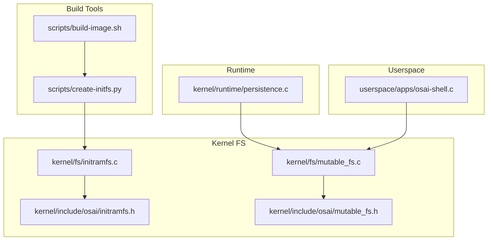
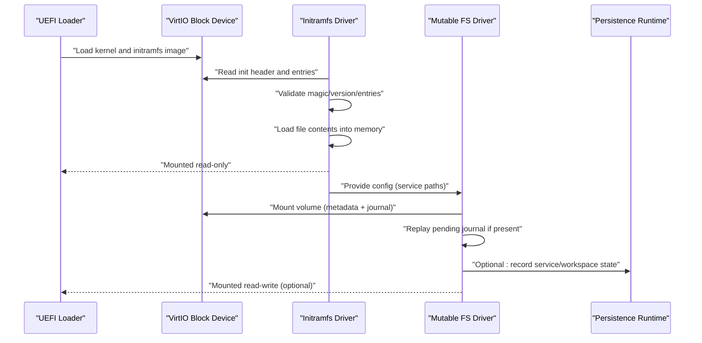
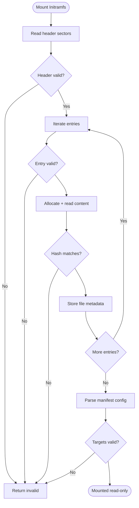
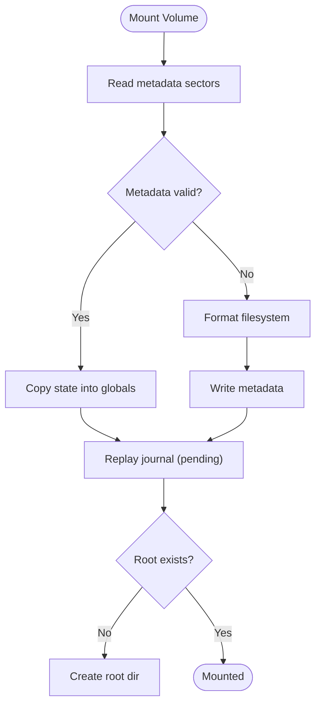
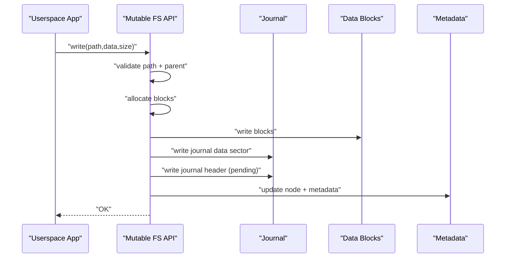
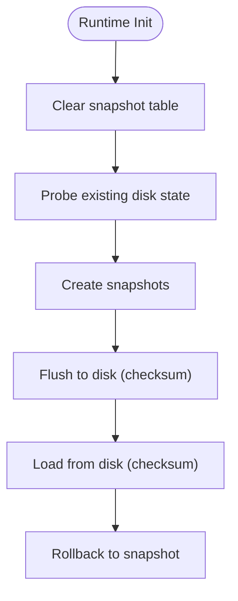
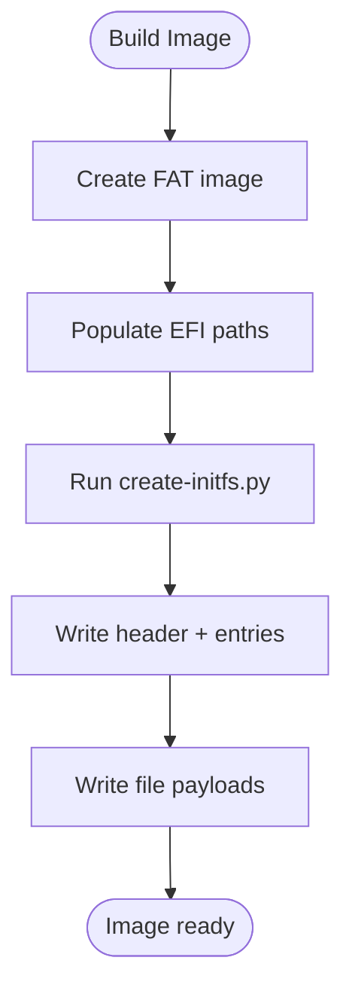
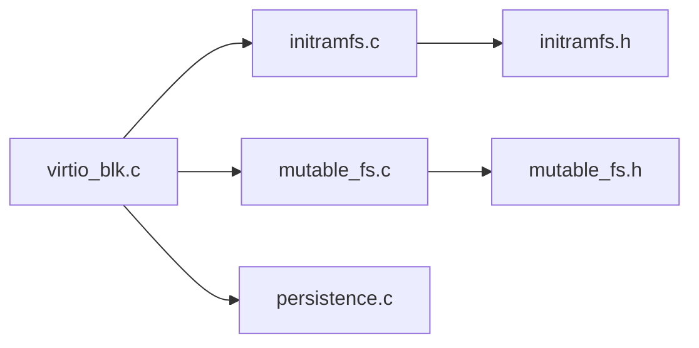

# File Systems

<cite>
**Referenced Files in This Document**
- [initramfs.c](file://kernel/fs/initramfs.c)
- [initramfs.h](file://kernel/include/osai/initramfs.h)
- [mutable_fs.c](file://kernel/fs/mutable_fs.c)
- [mutable_fs.h](file://kernel/include/osai/mutable_fs.h)
- [persistence.c](file://kernel/runtime/persistence.c)
- [create-initfs.py](file://scripts/create-initfs.py)
- [build-image.sh](file://scripts/build-image.sh)
- [osai-shell.c](file://userspace/apps/osai-shell.c)
</cite>

## Table of Contents
1. [Introduction](#introduction)
2. [Project Structure](#project-structure)
3. [Core Components](#core-components)
4. [Architecture Overview](#architecture-overview)
5. [Detailed Component Analysis](#detailed-component-analysis)
6. [Dependency Analysis](#dependency-analysis)
7. [Performance Considerations](#performance-considerations)
8. [Troubleshooting Guide](#troubleshooting-guide)
9. [Conclusion](#conclusion)
10. [Appendices](#appendices)

## Introduction
This document explains OSAI’s dual-file system architecture: an immutable Initramfs (read-only) and a mutable filesystem (read-write) with journaling and snapshots. It covers image creation, mounting procedures, file operations, directory structures, persistence semantics, backup/recovery, maintenance, and debugging. It also describes how the two filesystems relate during boot and runtime.

## Project Structure
OSAI’s filesystem-related code spans kernel filesystem drivers, public headers, runtime persistence, and build-time tools:
- Initramfs driver and header define the read-only image format and lookup interface.
- Mutable filesystem driver defines a small read-write journaling filesystem with snapshots and a dedicated persistence region.
- Build scripts assemble the images and populate the initramfs.
- Userspace shell demonstrates typical file operations against the mutable filesystem.

**Diagram sources**
- [create-initfs.py:94-157](file://scripts/create-initfs.py#L94-L157)
- [build-image.sh:353-365](file://scripts/build-image.sh#L353-L365)
- [initramfs.c:319-396](file://kernel/fs/initramfs.c#L319-L396)
- [mutable_fs.c:603-656](file://kernel/fs/mutable_fs.c#L603-L656)
- [persistence.c:145-252](file://kernel/runtime/persistence.c#L145-L252)
- [osai-shell.c:38-96](file://userspace/apps/osai-shell.c#L38-L96)

**Section sources**
- [create-initfs.py:94-157](file://scripts/create-initfs.py#L94-L157)
- [build-image.sh:353-365](file://scripts/build-image.sh#L353-L365)
- [initramfs.c:319-396](file://kernel/fs/initramfs.c#L319-L396)
- [mutable_fs.c:603-656](file://kernel/fs/mutable_fs.c#L603-L656)
- [persistence.c:145-252](file://kernel/runtime/persistence.c#L145-L252)
- [osai-shell.c:38-96](file://userspace/apps/osai-shell.c#L38-L96)

## Core Components
- Initramfs (read-only): A compact image containing executables, configuration, descriptors, and models. Mounted from a virtual block device and validated via header, entries, and content hashes.
- Mutable Filesystem (read-write): A small journaling filesystem with snapshots, metadata checksums, and a dedicated journal area. Supports directory and file operations, with commit/rollback semantics.
- Persistence Region: A separate sector region for snapshot metadata, enabling rollback and recovery of stateful configurations.

Key capabilities:
- Initramfs: Mount, validate, and lookup files by path; enforce immutability.
- Mutable FS: Mount, create directories, write/read files, list, stat, rename, open/close, commit/rollback, and journal replay.
- Persistence: Snapshot creation, rollback, and disk-backed storage of snapshot records.

**Section sources**
- [initramfs.h:7-31](file://kernel/include/osai/initramfs.h#L7-L31)
- [mutable_fs.h:15-81](file://kernel/include/osai/mutable_fs.h#L15-L81)
- [persistence.c:145-252](file://kernel/runtime/persistence.c#L145-L252)

## Architecture Overview
The system boots from a FAT-formatted disk image. The UEFI loader places the kernel and initramfs image into memory. The kernel mounts the initramfs read-only from the virtual block device. After initialization, the kernel mounts the mutable filesystem read-write, optionally replaying a pending journal entry. The persistence region stores snapshot metadata for rollback support.

**Diagram sources**
- [initramfs.c:319-396](file://kernel/fs/initramfs.c#L319-L396)
- [mutable_fs.c:603-656](file://kernel/fs/mutable_fs.c#L603-L656)
- [persistence.c:145-252](file://kernel/runtime/persistence.c#L145-L252)

## Detailed Component Analysis

### Initramfs Implementation
Initramfs is a compact read-only filesystem embedded in the block image. It validates a header, enumerates entries, loads content into memory, and verifies content hashes. It also parses a manifest configuration to derive service paths and policies.

Key behaviors:
- Header validation: magic, version, sector/block sizes, entry counts, flags, offsets, and image bounds.
- Entry validation: path prefix, size, type, offset alignment, and content hash.
- Manifest parsing: extracts service targets, manager, descriptor, mode, and child service policy.
- Lookup: linear scan by path; returns pointer to in-memory file metadata.

**Diagram sources**
- [initramfs.c:319-396](file://kernel/fs/initramfs.c#L319-L396)
- [initramfs.c:281-317](file://kernel/fs/initramfs.c#L281-L317)
- [initramfs.c:167-222](file://kernel/fs/initramfs.c#L167-L222)

**Section sources**
- [initramfs.c:319-396](file://kernel/fs/initramfs.c#L319-L396)
- [initramfs.c:281-317](file://kernel/fs/initramfs.c#L281-L317)
- [initramfs.c:167-222](file://kernel/fs/initramfs.c#L167-L222)
- [initramfs.h:7-31](file://kernel/include/osai/initramfs.h#L7-L31)

### Mutable Filesystem (Journaling, Snapshots, Operations)
The mutable filesystem is a small, read-write journaling filesystem with:
- Metadata area with checksum and node table.
- Journal area for pending writes.
- Data area for file content blocks.
- Snapshot support with rollback capability.
- Path validation and block allocation.

Core operations:
- Mount: read metadata, validate, format if invalid, replay journal, ensure root exists.
- Directory creation: validate path and parent existence, allocate node.
- File write: allocate blocks, write data, update node, journal pending write.
- File read: resolve node, read blocks.
- List/stat/rename/open/close: path validation and node lookup.
- Commit/rollback: advance committed generation or revert to snapshot.

**Diagram sources**
- [mutable_fs.c:603-656](file://kernel/fs/mutable_fs.c#L603-L656)
- [mutable_fs.c:558-601](file://kernel/fs/mutable_fs.c#L558-L601)

**Diagram sources**
- [mutable_fs.c:746-800](file://kernel/fs/mutable_fs.c#L746-L800)
- [mutable_fs.c:1151-1178](file://kernel/fs/mutable_fs.c#L1151-L1178)
- [mutable_fs.c:394-415](file://kernel/fs/mutable_fs.c#L394-L415)

**Section sources**
- [mutable_fs.c:603-656](file://kernel/fs/mutable_fs.c#L603-L656)
- [mutable_fs.c:558-601](file://kernel/fs/mutable_fs.c#L558-L601)
- [mutable_fs.c:746-800](file://kernel/fs/mutable_fs.c#L746-L800)
- [mutable_fs.c:1151-1178](file://kernel/fs/mutable_fs.c#L1151-L1178)
- [mutable_fs.c:394-415](file://kernel/fs/mutable_fs.c#L394-L415)
- [mutable_fs.h:49-81](file://kernel/include/osai/mutable_fs.h#L49-L81)

### Persistence Region (Snapshots and Rollback)
The persistence region is a single sector storing snapshot records with checksum validation. It supports:
- Creating snapshots with kind, owner, and label.
- Rolling back to the latest snapshot for a given kind and owner.
- Loading/storing snapshot table to/from disk with checksum verification.

**Diagram sources**
- [persistence.c:145-154](file://kernel/runtime/persistence.c#L145-L154)
- [persistence.c:201-252](file://kernel/runtime/persistence.c#L201-L252)
- [persistence.c:294-320](file://kernel/runtime/persistence.c#L294-L320)
- [persistence.c:322-339](file://kernel/runtime/persistence.c#L322-L339)

**Section sources**
- [persistence.c:145-154](file://kernel/runtime/persistence.c#L145-L154)
- [persistence.c:201-252](file://kernel/runtime/persistence.c#L201-L252)
- [persistence.c:294-320](file://kernel/runtime/persistence.c#L294-L320)
- [persistence.c:322-339](file://kernel/runtime/persistence.c#L322-L339)

### Image Creation and Boot-Time Layout
The build pipeline creates a VirtIO test image and populates it with:
- UEFI bootloader and kernel.
- Initramfs image built from ELF binaries, configuration, service descriptor, and a CPU AI model.
- Optional extra files mapped as initramfs entries.

The initramfs image layout:
- Header sector(s) with magic, version, entry table, and flags.
- Payload area starting at aligned offset with file contents.
- Manifest entry identifies the configuration file used to bootstrap services.

**Diagram sources**
- [build-image.sh:353-365](file://scripts/build-image.sh#L353-L365)
- [create-initfs.py:94-157](file://scripts/create-initfs.py#L94-L157)

**Section sources**
- [build-image.sh:353-365](file://scripts/build-image.sh#L353-L365)
- [create-initfs.py:94-157](file://scripts/create-initfs.py#L94-L157)

### Userspace Interaction and Typical Workflows
Userspace applications interact with the mutable filesystem through a shell-like interface. The shell demonstrates:
- Listing directories and files.
- Creating directories and files.
- Writing and reading file content.
- Archiving and extracting files with tar/cpio.
- Renaming and removing files.
- Querying file stats.

These operations exercise the mutable filesystem APIs for directory creation, file write/read, listing, stat, rename, and delete.

**Section sources**
- [osai-shell.c:38-96](file://userspace/apps/osai-shell.c#L38-L96)
- [mutable_fs.h:49-81](file://kernel/include/osai/mutable_fs.h#L49-L81)

## Dependency Analysis
- Initramfs depends on the virtual block transport to read sectors and uses a heap allocator for loading file contents.
- Mutable filesystem depends on the virtual block transport for metadata, journal, and data sectors, and maintains internal node tables and checksums.
- Persistence runtime depends on the virtual block transport for a fixed-sector region and uses checksums to protect snapshot records.
- Build tools depend on Python and mtools to construct the image and populate the initramfs.

**Diagram sources**
- [initramfs.c:1-5](file://kernel/fs/initramfs.c#L1-L5)
- [mutable_fs.c:1-4](file://kernel/fs/mutable_fs.c#L1-L4)
- [persistence.c:1-4](file://kernel/runtime/persistence.c#L1-L4)
- [initramfs.h:1-33](file://kernel/include/osai/initramfs.h#L1-L33)
- [mutable_fs.h:1-82](file://kernel/include/osai/mutable_fs.h#L1-L82)

**Section sources**
- [initramfs.c:1-5](file://kernel/fs/initramfs.c#L1-L5)
- [mutable_fs.c:1-4](file://kernel/fs/mutable_fs.c#L1-L4)
- [persistence.c:1-4](file://kernel/runtime/persistence.c#L1-L4)
- [initramfs.h:1-33](file://kernel/include/osai/initramfs.h#L1-L33)
- [mutable_fs.h:1-82](file://kernel/include/osai/mutable_fs.h#L1-L82)

## Performance Considerations
- Initramfs:
  - Entirely in-memory after mount; fast random access reads.
  - Content hashing ensures integrity but adds CPU cost on load.
- Mutable FS:
  - Small fixed-size sectors; predictable latency.
  - Journaling avoids partial writes but requires two writes per file write (data + journal).
  - Metadata checksum protects against silent corruption but adds CPU overhead.
  - Allocation is contiguous block assignment within limits; fragmentation risk is low due to small node count.
- Persistence:
  - Single-sector snapshot table; minimal overhead.
  - Checksum verification on load/write prevents corruption.

[No sources needed since this section provides general guidance]

## Troubleshooting Guide
Common issues and remedies:
- Initramfs mount failures:
  - Invalid header or entry: indicates corrupted image or wrong tooling; rebuild with the initramfs builder.
  - Hash mismatch: content altered or media error; reflash image.
  - Missing or non-executable targets: fix configuration manifest paths.
- Mutable FS mount/format loops:
  - Invalid metadata: triggers automatic format; verify block device capacity and geometry.
  - Journal replay errors: pending journal inconsistent; clear journal or reflash image.
  - No free nodes or blocks: increase capacity or reduce file count; inspect counters.
- Persistence region errors:
  - Checksum mismatch: disk corruption; rewrite snapshot table.
  - No existing state: expected on first boot; normal.
- Operational errors:
  - Invalid path or permissions: ensure proper path normalization and parent existence.
  - Open/close leaks: ensure handles are closed; monitor open/close counters.

Diagnostic aids:
- Counters exposed by the mutable filesystem (open, close, write, read, delete, commit, rollback, reject, checksum errors, replay, journal writes).
- Self-tests for initramfs and persistence regions validate basic assumptions.

**Section sources**
- [initramfs.c:333-339](file://kernel/fs/initramfs.c#L333-L339)
- [initramfs.c:367-371](file://kernel/fs/initramfs.c#L367-L371)
- [mutable_fs.c:616-628](file://kernel/fs/mutable_fs.c#L616-L628)
- [mutable_fs.c:564-578](file://kernel/fs/mutable_fs.c#L564-L578)
- [mutable_fs.c:408-411](file://kernel/fs/mutable_fs.c#L408-L411)
- [persistence.c:218-226](file://kernel/runtime/persistence.c#L218-L226)
- [mutable_fs.h:25-47](file://kernel/include/osai/mutable_fs.h#L25-L47)

## Conclusion
OSAI’s dual-file system architecture separates immutable boot-time assets (initramfs) from mutable runtime state (mutable filesystem) with journaling and snapshots. The initramfs provides a secure, verifiable baseline; the mutable filesystem enables safe, transaction-like updates with rollback. The persistence region complements this by maintaining snapshot metadata for recovery. Together, they support robust boot, operation, and recovery workflows.

[No sources needed since this section summarizes without analyzing specific files]

## Appendices

### Filesystem Layout Reference
- Initramfs:
  - Header sector(s) with magic, version, entry table, flags, offsets.
  - Payload area starting at aligned offset with file contents.
- Mutable FS:
  - Metadata sectors at start.
  - Journal sectors immediately after metadata.
  - Data sectors after journal.
- Persistence:
  - Fixed single sector for snapshot records.

**Section sources**
- [create-initfs.py:138-149](file://scripts/create-initfs.py#L138-L149)
- [mutable_fs.c:6-28](file://kernel/fs/mutable_fs.c#L6-L28)
- [persistence.c:8-14](file://kernel/runtime/persistence.c#L8-L14)