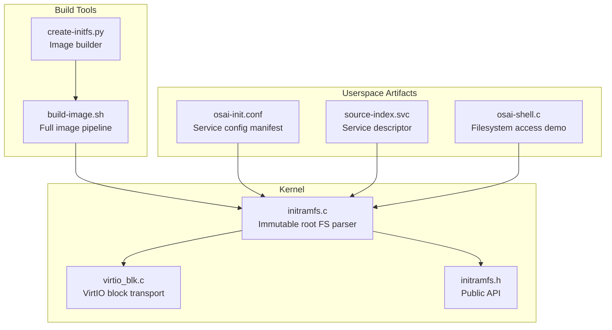
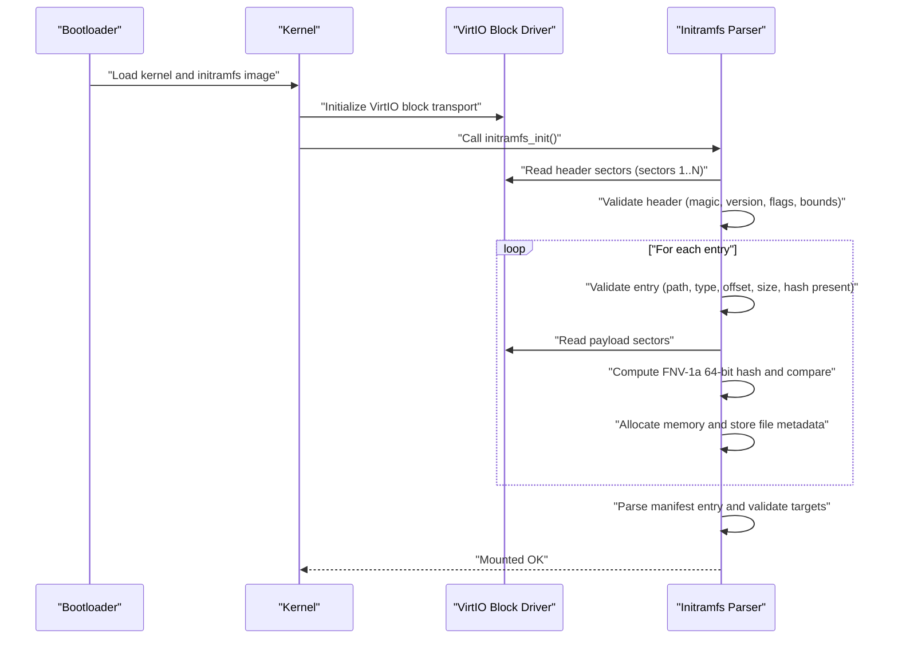
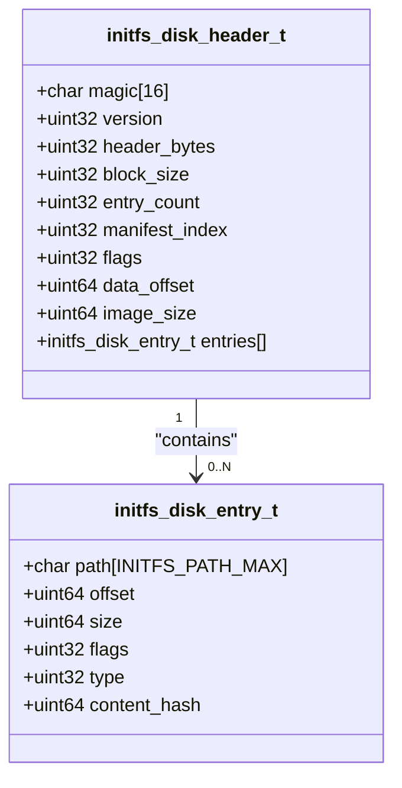
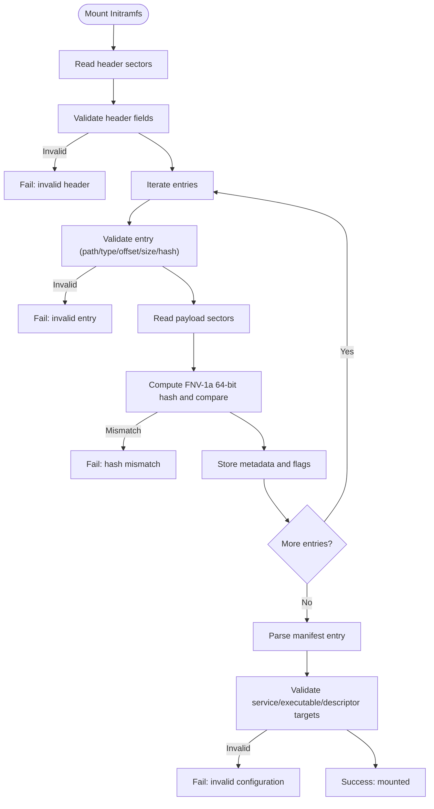
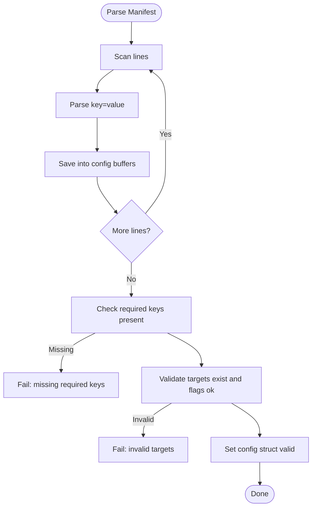
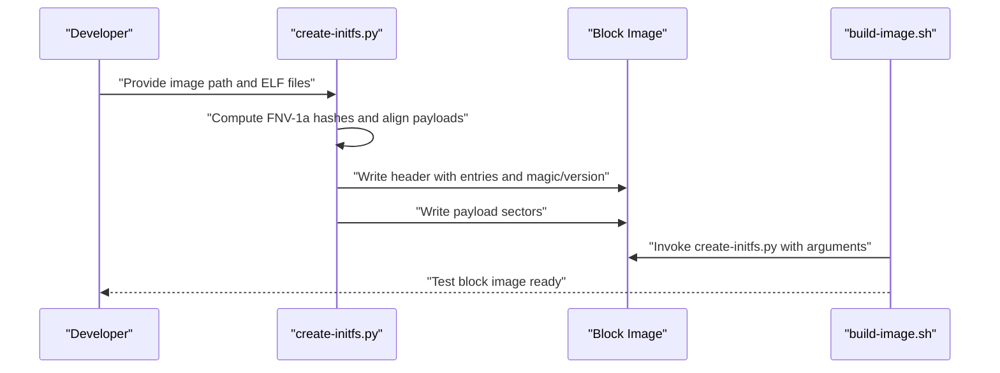
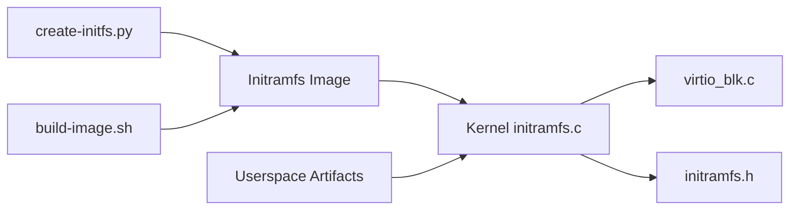

# Initramfs - Immutable Root Filesystem

<cite>
**Referenced Files in This Document**
- [initramfs.c](file://kernel/fs/initramfs.c)
- [initramfs.h](file://kernel/include/osai/initramfs.h)
- [virtio_blk.c](file://kernel/dev/virtio/virtio_blk.c)
- [create-initfs.py](file://scripts/create-initfs.py)
- [build-image.sh](file://scripts/build-image.sh)
- [osai-init.conf](file://userspace/init/osai-init.conf)
- [source-index.svc](file://userspace/service-manager/source-index.svc)
- [osai-shell.c](file://userspace/apps/osai-shell.c)
</cite>

## Table of Contents
1. [Introduction](#introduction)
2. [Project Structure](#project-structure)
3. [Core Components](#core-components)
4. [Architecture Overview](#architecture-overview)
5. [Detailed Component Analysis](#detailed-component-analysis)
6. [Dependency Analysis](#dependency-analysis)
7. [Performance Considerations](#performance-considerations)
8. [Troubleshooting Guide](#troubleshooting-guide)
9. [Conclusion](#conclusion)
10. [Appendices](#appendices)

## Introduction
This document describes OSAI’s Initramfs implementation as an immutable root filesystem stored on a VirtIO block device. It explains the filesystem format, including the magic header signature, versioning, and sector-based layout; the disk entry structure with path storage, offsets, sizes, flags, and content hashing; the mounting process from VirtIO block devices; the configuration manifest system for service startup; file lookup mechanisms, executable flag handling, and content verification via hash comparison; and the filesystem creation tools and integration with the boot process. It also covers error handling, validation procedures, and debugging techniques for initramfs corruption or mount failures.

## Project Structure
The initramfs subsystem spans kernel-side filesystem parsing and VirtIO block transport, plus userspace artifacts and build scripts:
- Kernel filesystem parser and public API: [initramfs.c](file://kernel/fs/initramfs.c), [initramfs.h](file://kernel/include/osai/initramfs.h)
- VirtIO block transport: [virtio_blk.c](file://kernel/dev/virtio/virtio_blk.c)
- Build-time image creation and packaging: [create-initfs.py](file://scripts/create-initfs.py), [build-image.sh](file://scripts/build-image.sh)
- Userspace configuration and service descriptors: [osai-init.conf](file://userspace/init/osai-init.conf), [source-index.svc](file://userspace/service-manager/source-index.svc)
- Example userspace tool demonstrating filesystem access: [osai-shell.c](file://userspace/apps/osai-shell.c)

**Diagram sources**
- [initramfs.c](file://kernel/fs/initramfs.c)
- [initramfs.h](file://kernel/include/osai/initramfs.h)
- [virtio_blk.c](file://kernel/dev/virtio/virtio_blk.c)
- [create-initfs.py](file://scripts/create-initfs.py)
- [build-image.sh](file://scripts/build-image.sh)
- [osai-init.conf](file://userspace/init/osai-init.conf)
- [source-index.svc](file://userspace/service-manager/source-index.svc)
- [osai-shell.c](file://userspace/apps/osai-shell.c)

**Section sources**
- [initramfs.c](file://kernel/fs/initramfs.c)
- [initramfs.h](file://kernel/include/osai/initramfs.h)
- [virtio_blk.c](file://kernel/dev/virtio/virtio_blk.c)
- [create-initfs.py](file://scripts/create-initfs.py)
- [build-image.sh](file://scripts/build-image.sh)
- [osai-init.conf](file://userspace/init/osai-init.conf)
- [source-index.svc](file://userspace/service-manager/source-index.svc)
- [osai-shell.c](file://userspace/apps/osai-shell.c)

## Core Components
- Immutable root filesystem format and parser:
  - Magic signature, version, header size, sector/block size, entry count, manifest index, flags, data offset, and total image size.
  - Disk entry structure with path, offset, size, flags, type, and content hash.
  - Sector-based layout with a fixed header area and payload area.
- Mounting from VirtIO block devices:
  - Header validation against magic, version, header size, block size, entry range, flags, and bounds.
  - Iterative parsing of entries, duplicate path detection, and memory allocation for file contents.
  - Content verification via FNV-1a 64-bit hash comparison.
- Configuration manifest system:
  - Manifest entry parsed as a key-value configuration with required keys for service startup and child service relationships.
  - Validation of targets for executables and descriptors.
- Lookup and configuration retrieval:
  - Path-based lookup returning metadata and content pointer.
  - Access to parsed configuration structure.

**Section sources**
- [initramfs.c](file://kernel/fs/initramfs.c)
- [initramfs.h](file://kernel/include/osai/initramfs.h)

## Architecture Overview
The initramfs is stored as a raw image on a VirtIO block device. During boot, the kernel initializes VirtIO block transport, reads the fixed-size header sectors, validates the header, parses entries, loads file contents into kernel heap memory, verifies hashes, and finally parses the configuration manifest to bootstrap services.

**Diagram sources**
- [initramfs.c](file://kernel/fs/initramfs.c)
- [virtio_blk.c](file://kernel/dev/virtio/virtio_blk.c)

## Detailed Component Analysis

### Filesystem Format and Layout
- Magic signature and version:
  - Signature: fixed-length ASCII marker placed at the start of the header.
  - Version: single-byte version number for compatibility checks.
- Header fields:
  - Header size, sector/block size, entry count, manifest index, flags, data offset, and total image size.
  - Entries array immediately follows the header and is padded to the declared header size.
- Sector-based layout:
  - Header occupies a fixed number of sectors starting at a known sector index.
  - Payload starts at a fixed data offset and is aligned to sector boundaries.
- Entry structure:
  - Path string with null termination, offset and size in sectors, flags, type, and content hash.
  - Paths must be absolute and null-terminated within a bounded length.

**Diagram sources**
- [initramfs.c](file://kernel/fs/initramfs.c)

**Section sources**
- [initramfs.c](file://kernel/fs/initramfs.c)

### Mounting Process from VirtIO Block Devices
- Initialization:
  - The parser reads the header area in whole-sector increments from a known starting sector.
  - Validates magic, version, header size, block size, entry count range, flags, and image bounds.
- Entry parsing and loading:
  - Validates each entry’s path, type, offset, size, alignment, and presence of a content hash.
  - Allocates memory for each file’s content and reads payload sectors.
  - Computes and compares the FNV-1a 64-bit hash against the stored hash.
  - Records metadata including executable and manifest flags.
- Manifest and configuration:
  - Identifies the manifest entry by index and parses it as a configuration manifest.
  - Validates required service targets and descriptors, ensuring they exist and have appropriate flags.
- Lookup and configuration retrieval:
  - Provides path-based lookup returning metadata and content pointer.
  - Exposes the parsed configuration structure for service bootstrap.

**Diagram sources**
- [initramfs.c](file://kernel/fs/initramfs.c)

**Section sources**
- [initramfs.c](file://kernel/fs/initramfs.c)

### Configuration Manifest System
- Manifest entry:
  - Stored as a regular file but marked as manifest; the parser treats it specially.
- Required keys:
  - Service path, service manager path, service descriptor path, operating mode, child service path, child parent, and child restart policy.
- Validation:
  - Ensures all required keys are present and that referenced targets exist and have correct flags (executable for binaries, non-executable and non-manifest for descriptors).
- Access:
  - Returns a configuration structure containing validated values for downstream service bootstrap.

**Diagram sources**
- [initramfs.c](file://kernel/fs/initramfs.c)
- [osai-init.conf](file://userspace/init/osai-init.conf)
- [source-index.svc](file://userspace/service-manager/source-index.svc)

**Section sources**
- [initramfs.c](file://kernel/fs/initramfs.c)
- [osai-init.conf](file://userspace/init/osai-init.conf)
- [source-index.svc](file://userspace/service-manager/source-index.svc)

### File Lookup Mechanisms and Executable Flag Handling
- Lookup:
  - Path-based linear scan over loaded files; returns metadata and content pointer.
- Executable flag:
  - Stored per entry; used during configuration validation to ensure service targets are executable.
- Manifest flag:
  - Used to identify the configuration manifest entry and to prevent misflagging descriptors.

**Section sources**
- [initramfs.c](file://kernel/fs/initramfs.c)
- [initramfs.h](file://kernel/include/osai/initramfs.h)

### Content Verification Through Hash Comparison
- Hash computation:
  - Uses FNV-1a 64-bit hash on the loaded content.
- Verification:
  - Compares computed hash with the stored hash in the entry; mismatch fails mounting.
- Purpose:
  - Ensures immutability and integrity of the root filesystem contents.

**Section sources**
- [initramfs.c](file://kernel/fs/initramfs.c)

### Filesystem Creation Tools and Image Generation
- Image builder script:
  - Creates the filesystem image with a fixed header and aligned payload.
  - Writes entries with path, offset, size, flags, and content hash.
  - Supports extra user-specified files with executable flags.
- Full image pipeline:
  - Builds kernel and userspace binaries, creates a FAT-formatted boot image, and generates a VirtIO block test image containing the initramfs.
  - Integrates the initramfs creation script into the build to produce a sector-aligned image with a header and payload.

**Diagram sources**
- [create-initfs.py](file://scripts/create-initfs.py)
- [build-image.sh](file://scripts/build-image.sh)

**Section sources**
- [create-initfs.py](file://scripts/create-initfs.py)
- [build-image.sh](file://scripts/build-image.sh)

### Integration with the Boot Process
- The VirtIO block driver is initialized before mounting the initramfs.
- The kernel reads the header sectors from a known sector index, validates, and proceeds to load and verify entries.
- The resulting configuration structure is used to bootstrap services after initramfs is mounted.

**Section sources**
- [initramfs.c](file://kernel/fs/initramfs.c)
- [virtio_blk.c](file://kernel/dev/virtio/virtio_blk.c)

### Example Userspace Tool Demonstrating Filesystem Access
- The shell demonstrates listing and interacting with the filesystem, validating that the initramfs is mounted and accessible.

**Section sources**
- [osai-shell.c](file://userspace/apps/osai-shell.c)

## Dependency Analysis
- Kernel filesystem parser depends on:
  - Public API definitions for file metadata and configuration structures.
  - VirtIO block transport for reading sectors and determining capacity.
- Build tools depend on:
  - Userspace ELF binaries and configuration files to embed into the image.
- Userspace artifacts depend on:
  - The manifest and descriptors to define service startup behavior.

**Diagram sources**
- [create-initfs.py](file://scripts/create-initfs.py)
- [build-image.sh](file://scripts/build-image.sh)
- [initramfs.c](file://kernel/fs/initramfs.c)
- [initramfs.h](file://kernel/include/osai/initramfs.h)
- [virtio_blk.c](file://kernel/dev/virtio/virtio_blk.c)

**Section sources**
- [initramfs.c](file://kernel/fs/initramfs.c)
- [initramfs.h](file://kernel/include/osai/initramfs.h)
- [virtio_blk.c](file://kernel/dev/virtio/virtio_blk.c)
- [create-initfs.py](file://scripts/create-initfs.py)
- [build-image.sh](file://scripts/build-image.sh)

## Performance Considerations
- Sector-based I/O:
  - Reading is performed in whole sectors; payload reads are aligned to sector boundaries, minimizing fragmentation.
- Memory allocation:
  - Each file’s content is allocated contiguously in kernel heap memory; alignment is enforced to meet kernel allocator requirements.
- Hash verification:
  - Single-pass FNV-1a 64-bit hash computation per file; cost scales linearly with file size.
- Practical guidance:
  - Keep the number of files within the configured maximum to limit parsing overhead.
  - Ensure payload alignment to reduce partial-sector reads and improve throughput.

[No sources needed since this section provides general guidance]

## Troubleshooting Guide
Common failure modes and diagnostics:
- Header validation failures:
  - Symptoms: invalid magic, wrong version, incorrect header size, block size mismatch, invalid flags, or out-of-bounds image size.
  - Actions: verify image was generated with the correct tool and parameters; confirm sector alignment and header size.
- Entry validation failures:
  - Symptoms: invalid path (must be absolute and null-terminated), zero size, wrong type, misaligned offset, or missing content hash.
  - Actions: re-run the image builder; ensure paths are within the allowed length and offsets are sector-aligned.
- Hash mismatch:
  - Symptoms: computed hash differs from stored hash.
  - Actions: rebuild the image; ensure content has not been modified; verify the hash computation and stored value.
- Allocation failures:
  - Symptoms: insufficient memory to load a file.
  - Actions: reduce the number or size of files; verify kernel heap configuration.
- IO errors during read:
  - Symptoms: inability to read header or payload sectors.
  - Actions: check VirtIO block initialization and capacity; verify the image exists and is readable.
- Configuration manifest errors:
  - Symptoms: missing required keys, invalid targets, or incorrect flags.
  - Actions: review the manifest and descriptors; ensure referenced paths exist and have correct flags.

Operational checks:
- Self-tests:
  - The initramfs parser includes a self-test that validates mounting, lookup, and configuration parsing.
  - The VirtIO block driver includes a self-test verifying read/write and error handling.

**Section sources**
- [initramfs.c](file://kernel/fs/initramfs.c)
- [virtio_blk.c](file://kernel/dev/virtio/virtio_blk.c)

## Conclusion
OSAI’s initramfs provides a secure, immutable root filesystem embedded in a VirtIO block image. Its design centers on a compact header with strict validation, sector-aligned layout, and strong integrity guarantees via content hashing. The configuration manifest enables deterministic service startup, while the lookup interface supports efficient access to files. The build pipeline integrates cleanly into the overall boot process, and robust error handling and self-tests aid in diagnosing issues.

[No sources needed since this section summarizes without analyzing specific files]

## Appendices

### API Surface
- Initialization and mounting:
  - Function to initialize and mount the initramfs from the VirtIO block device.
- Lookup:
  - Function to locate a file by path and return its metadata and content pointer.
- Configuration:
  - Function to retrieve the parsed configuration structure for service bootstrap.

**Section sources**
- [initramfs.h](file://kernel/include/osai/initramfs.h)
- [initramfs.c](file://kernel/fs/initramfs.c)