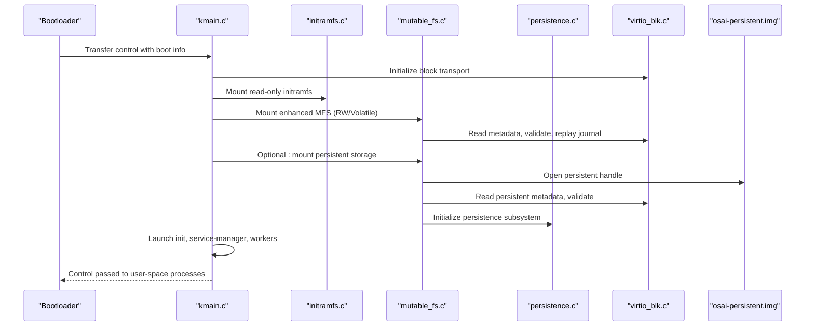
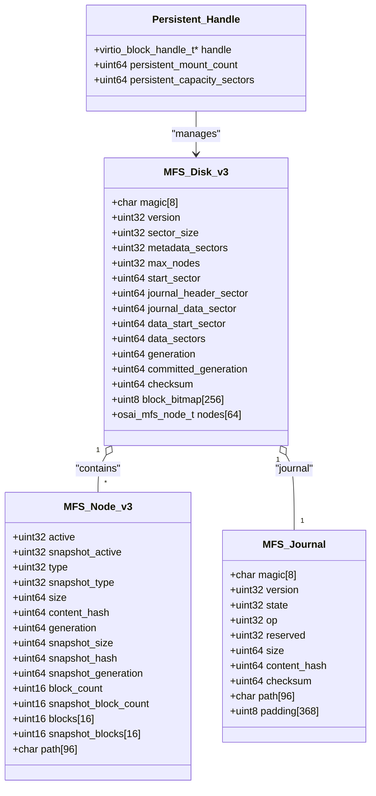
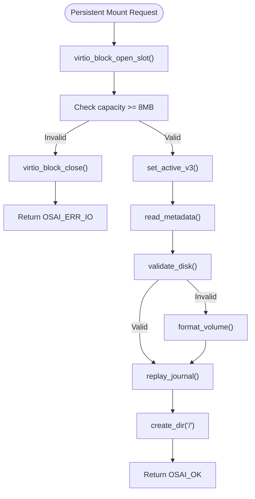
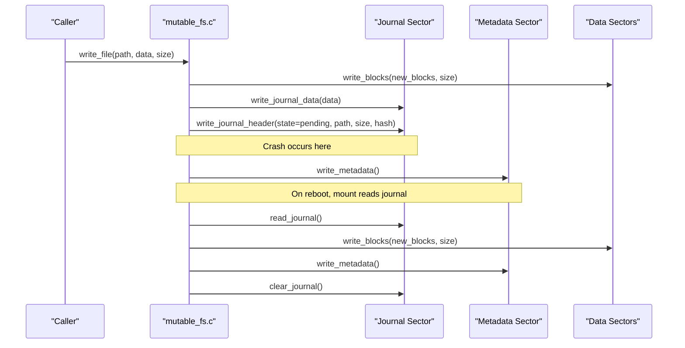
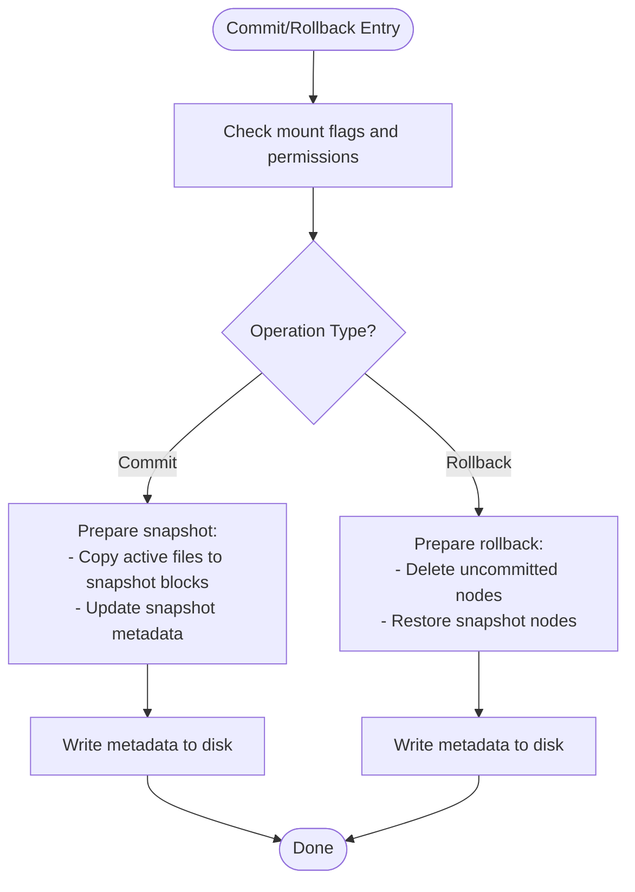
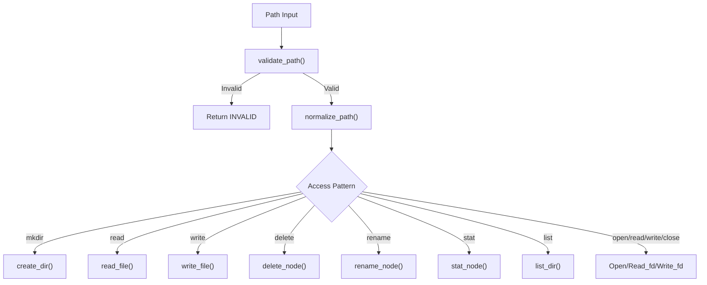
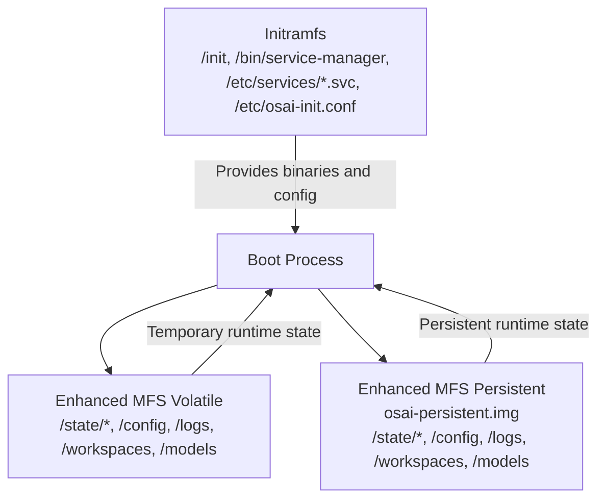
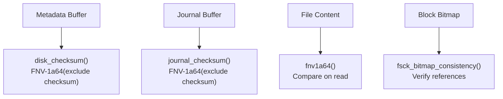
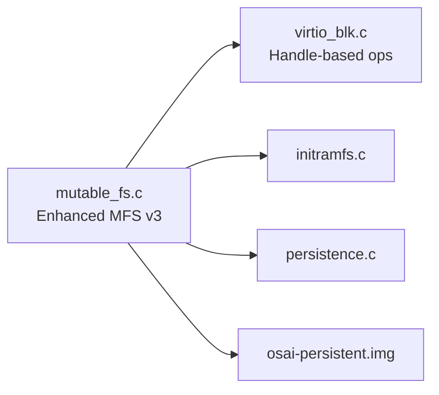

# Mutable Filesystem - Persistent State Management

<cite>
**Referenced Files in This Document**
- [mutable_fs.c](file://kernel/fs/mutable_fs.c)
- [mutable_fs.h](file://kernel/include/osai/mutable_fs.h)
- [initramfs.c](file://kernel/fs/initramfs.c)
- [initramfs.h](file://kernel/include/osai/initramfs.h)
- [persistence.c](file://kernel/runtime/persistence.c)
- [persistence.h](file://kernel/include/osai/persistence.h)
- [kmain.c](file://kernel/core/kmain.c)
- [virtio_blk.c](file://kernel/dev/virtio/virtio_blk.c)
- [virtio_blk.h](file://kernel/include/osai/virtio_blk.h)
- [create-persistent-image.sh](file://scripts/create-persistent-image.sh)
</cite>

## Update Summary
**Changes Made**
- Enhanced mutable filesystem with persistent storage implementation (v3)
- Expanded from 32 to 64 nodes capacity
- Increased block allocation capacity from 16 to 64 sectors
- Introduced osai-persistent.img that survives reboots
- Updated virtio_blk.c driver with handle-based operations for multi-device management
- Added persistent mount functionality with separate handle management

## Table of Contents
1. [Introduction](#introduction)
2. [Project Structure](#project-structure)
3. [Core Components](#core-components)
4. [Architecture Overview](#architecture-overview)
5. [Detailed Component Analysis](#detailed-component-analysis)
6. [Dependency Analysis](#dependency-analysis)
7. [Performance Considerations](#performance-considerations)
8. [Troubleshooting Guide](#troubleshooting-guide)
9. [Conclusion](#conclusion)

## Introduction
This document describes OSAI's Enhanced Mutable Filesystem (MFS) implementation for persistent state management. The MFS now supports both volatile and persistent storage modes, with expanded capacity and improved multi-device management. It explains the filesystem architecture, write operations, data integrity mechanisms, and journaling capabilities. The document covers directory structures, file operations, access patterns, and the relationship between MFS and the read-only initramfs during the boot process. It includes backup and recovery via snapshots, filesystem maintenance, performance optimization, consistency guarantees, transaction handling, rollback mechanisms, debugging, corruption detection, and repair procedures. The implementation now supports persistent storage that survives reboots through the osai-persistent.img file.

## Project Structure
The Enhanced Mutable Filesystem resides in the kernel filesystem layer and integrates with the virtual block transport and boot-time initialization. The key components are:
- Enhanced mutable filesystem implementation with v3 architecture supporting 64 nodes and 64 sectors
- Read-only initramfs used during early boot
- Persistent storage management through handle-based operations
- Virtual block driver for underlying storage with multi-device support
- Kernel main entry that orchestrates boot-time initialization

```mermaid
graph TB
subgraph "Kernel Boot"
KMAIN["kmain.c<br/>Boot orchestration"]
INITFS["initramfs.c<br/>Read-only initramfs"]
END
subgraph "Enhanced Storage Layer"
VIRTIO["virtio_blk.c<br/>Multi-device block transport"]
PERSIST_HANDLE["Persistent Handle<br/>osai-persistent.img"]
END
subgraph "Filesystems"
MFS["mutable_fs.c<br/>Enhanced MFS (v3)"]
PERSIST["persistence.c<br/>Snapshot persistence"]
END
KMAIN --> INITFS
KMAIN --> MFS
MFS --> VIRTIO
MFS --> PERSIST_HANDLE
PERSIST --> VIRTIO
```

**Diagram sources**
- [kmain.c:60-223](file://kernel/core/kmain.c#L60-L223)
- [initramfs.c:319-397](file://kernel/fs/initramfs.c#L319-L397)
- [mutable_fs.c:1672-1735](file://kernel/fs/mutable_fs.c#L1672-L1735)
- [persistence.c:145-253](file://kernel/runtime/persistence.c#L145-L253)
- [virtio_blk.c:204-247](file://kernel/dev/virtio/virtio_blk.c#L204-L247)

**Section sources**
- [kmain.c:60-223](file://kernel/core/kmain.c#L60-L223)
- [initramfs.c:319-397](file://kernel/fs/initramfs.c#L319-L397)
- [mutable_fs.c:1672-1735](file://kernel/fs/mutable_fs.c#L1672-L1735)
- [persistence.c:145-253](file://kernel/runtime/persistence.c#L145-L253)
- [virtio_blk.c:204-247](file://kernel/dev/virtio/virtio_blk.c#L204-L247)

## Core Components
- **Enhanced Mutable Filesystem (MFS v3)**: Provides a read-write filesystem overlay with expanded capacity (64 nodes, 64 sectors), handle-based persistent storage, on-disk metadata, per-file block allocation, and a single-sector journal for crash-safe writes.
- **Initramfs**: A read-only filesystem embedded in the disk image used during early boot to load essential binaries and configuration.
- **Persistent Storage Manager**: Manages osai-persistent.img with handle-based operations for multi-device scenarios and persistent state across reboots.
- **Virtual Block Driver**: Enhanced with handle-based operations supporting multiple storage devices and improved error handling.
- **Snapshot Subsystem**: Maintains snapshot records that can be committed or rolled back for state management.

Key capabilities:
- Path validation and normalization
- Directory and file operations (create, read, write, delete, rename)
- Snapshot-based commits and rollbacks
- Journal-based crash safety for file writes
- Integrity checks via checksums and hashes
- Multi-device persistent storage management
- Telemetry counters for monitoring usage and errors

**Section sources**
- [mutable_fs.h:23-80](file://kernel/include/osai/mutable_fs.h#L23-L80)
- [mutable_fs.c:181-197](file://kernel/fs/mutable_fs.c#L181-L197)
- [initramfs.h:7-25](file://kernel/include/osai/initramfs.h#L7-L25)
- [persistence.h:7-28](file://kernel/include/osai/persistence.h#L7-L28)
- [virtio_blk.h:7-29](file://kernel/include/osai/virtio_blk.h#L7-L29)

## Architecture Overview
The boot process loads the read-only initramfs, then mounts the enhanced mutable filesystem in either volatile or persistent mode. The initramfs provides the initial OS control plane (init, service manager, workers), while the enhanced MFS persists operational state such as service status, workspaces, updates, and administrative logs. The persistent mode uses osai-persistent.img that survives reboots. The snapshot subsystem maintains snapshot records that can be committed or rolled back for state management.



**Diagram sources**
- [kmain.c:118-125](file://kernel/core/kmain.c#L118-L125)
- [initramfs.c:319-397](file://kernel/fs/initramfs.c#L319-L397)
- [mutable_fs.c:1672-1735](file://kernel/fs/mutable_fs.c#L1672-L1735)
- [persistence.c:145-154](file://kernel/runtime/persistence.c#L145-L154)
- [virtio_blk.c:204-247](file://kernel/dev/virtio/virtio_blk.c#L204-L247)

## Detailed Component Analysis

### Enhanced Mutable Filesystem Implementation (v3)
The enhanced MFS v3 organizes persistent state into:
- **Metadata area**: filesystem superblock, node table (expanded to 64 nodes), block bitmap, and generation counters
- **Journal area**: single-sector header and data sectors for crash-safe writes
- **Data area**: contiguous sectors allocated per file up to 64 sectors (32KB maximum per file)
- **Handle-based storage**: persistent storage management through virtio_block_handle_t

Core operations:
- **Mount**: validates metadata, formats if invalid, replays journal, ensures root exists
- **Write**: allocates blocks, writes data, updates node, writes metadata
- **Read**: validates node and content hash, returns data
- **Delete/Rename**: update node state and metadata atomically
- **Commit/Rollback**: snapshot current state and restore on rollback
- **Open/Read_fd/Write_fd**: per-session file handles with cursors
- **Persistent Mount**: opens osai-persistent.img with handle-based operations



**Diagram sources**
- [mutable_fs.c:59-93](file://kernel/fs/mutable_fs.c#L59-L93)
- [mutable_fs.c:41-57](file://kernel/fs/mutable_fs.c#L41-L57)
- [mutable_fs.c:150-106](file://kernel/fs/mutable_fs.c#L150-L106)
- [mutable_fs.c:150-151](file://kernel/fs/mutable_fs.c#L150-L151)

**Section sources**
- [mutable_fs.c:181-197](file://kernel/fs/mutable_fs.c#L181-L197)
- [mutable_fs.c:733-788](file://kernel/fs/mutable_fs.c#L733-L788)
- [mutable_fs.c:877-943](file://kernel/fs/mutable_fs.c#L877-L943)
- [mutable_fs.c:988-1013](file://kernel/fs/mutable_fs.c#L988-L1013)
- [mutable_fs.c:1015-1044](file://kernel/fs/mutable_fs.c#L1015-L1044)
- [mutable_fs.c:1151-1280](file://kernel/fs/mutable_fs.c#L1151-L1280)
- [mutable_fs.c:1518-1645](file://kernel/fs/mutable_fs.c#L1518-L1645)

### Persistent Storage Management
The enhanced MFS now supports persistent storage through osai-persistent.img with handle-based operations:
- **Handle-based operations**: Uses virtio_block_handle_t for multi-device management
- **Persistent mount**: Opens and manages osai-persistent.img separately from volatile storage
- **Capacity validation**: Ensures persistent disk meets minimum requirements (8MB)
- **Version switching**: Automatically switches to v3 when persistent storage is detected
- **Separate telemetry**: Tracks persistent mount counts independently



**Diagram sources**
- [mutable_fs.c:1672-1735](file://kernel/fs/mutable_fs.c#L1672-L1735)
- [virtio_blk.c:204-247](file://kernel/dev/virtio/virtio_blk.c#L204-L247)

**Section sources**
- [mutable_fs.c:1672-1735](file://kernel/fs/mutable_fs.c#L1672-L1735)
- [virtio_blk.c:204-247](file://kernel/dev/virtio/virtio_blk.c#L204-L247)
- [create-persistent-image.sh:1-18](file://scripts/create-persistent-image.sh#L1-L18)

### Journaling and Crash Safety
MFS employs a single-sector journal to guarantee atomicity for file writes:
- **Pending write**: data written to journal data sector, journal header populated with metadata and checksum
- **Commit**: metadata updated to reflect new file state
- **Replay**: on mount, if journal header indicates pending operation, data is read from journal data sector, validated, applied, and journal cleared



**Diagram sources**
- [mutable_fs.c:1282-1309](file://kernel/fs/mutable_fs.c#L1282-L1309)
- [mutable_fs.c:561-578](file://kernel/fs/mutable_fs.c#L561-L578)
- [mutable_fs.c:438-447](file://kernel/fs/mutable_fs.c#L438-L447)
- [mutable_fs.c:417-428](file://kernel/fs/mutable_fs.c#L417-L428)

**Section sources**
- [mutable_fs.c:561-578](file://kernel/fs/mutable_fs.c#L561-L578)
- [mutable_fs.c:1282-1309](file://kernel/fs/mutable_fs.c#L1282-L1309)
- [mutable_fs.c:438-447](file://kernel/fs/mutable_fs.c#L438-L447)
- [mutable_fs.c:417-428](file://kernel/fs/mutable_fs.c#L417-L428)

### Snapshot-Based Backup and Recovery
MFS supports committing the current state as a snapshot and rolling back to it:
- **Commit**: copies active files to snapshot blocks, updates snapshot metadata, advances committed generation
- **Rollback**: deletes uncommitted nodes, restores snapshot nodes, re-allocates snapshot blocks to active nodes



**Diagram sources**
- [mutable_fs.c:1151-1204](file://kernel/fs/mutable_fs.c#L1151-L1204)
- [mutable_fs.c:1243-1280](file://kernel/fs/mutable_fs.c#L1243-L1280)

**Section sources**
- [mutable_fs.c:1151-1204](file://kernel/fs/mutable_fs.c#L1151-L1204)
- [mutable_fs.c:1243-1280](file://kernel/fs/mutable_fs.c#L1243-L1280)

### Path Validation, Directory Operations, and Access Patterns
- **Path validation**: enforces leading slash, printable ASCII range, absence of wildcards, and proper separators
- **Directory creation**: ensures parent exists and node is free or reusable
- **Listing**: enumerates direct children of a directory
- **Stat**: exposes type, block count, size, generation, and content hash
- **Open/Read_fd/Write_fd**: support streaming access with per-handle cursors



**Diagram sources**
- [mutable_fs.c:356-381](file://kernel/fs/mutable_fs.c#L356-L381)
- [mutable_fs.c:383-390](file://kernel/fs/mutable_fs.c#L383-L390)
- [mutable_fs.c:800-832](file://kernel/fs/mutable_fs.c#L800-L832)
- [mutable_fs.c:945-972](file://kernel/fs/mutable_fs.c#L945-L972)
- [mutable_fs.c:1479-1508](file://kernel/fs/mutable_fs.c#L1479-L1508)
- [mutable_fs.c:1518-1645](file://kernel/fs/mutable_fs.c#L1518-L1645)

**Section sources**
- [mutable_fs.c:356-381](file://kernel/fs/mutable_fs.c#L356-L381)
- [mutable_fs.c:383-390](file://kernel/fs/mutable_fs.c#L383-L390)
- [mutable_fs.c:800-832](file://kernel/fs/mutable_fs.c#L800-L832)
- [mutable_fs.c:945-972](file://kernel/fs/mutable_fs.c#L945-L972)
- [mutable_fs.c:1479-1508](file://kernel/fs/mutable_fs.c#L1479-L1508)
- [mutable_fs.c:1518-1645](file://kernel/fs/mutable_fs.c#L1518-L1645)

### Relationship Between Enhanced Mutable Filesystem and Initramfs
- **Initramfs**: mounted read-only and provides the initial OS control plane (init, service-manager, workers) and configuration manifest
- **Enhanced MFS**: mounted read-write to persist operational state such as service states, workspaces, updates, and admin logs
- **Persistent Mode**: optional persistent storage through osai-persistent.img that survives reboots
- **Two filesystems**: coexist - initramfs supplies boot-time artifacts, enhanced MFS supplies persistent runtime state



**Diagram sources**
- [initramfs.c:319-397](file://kernel/fs/initramfs.c#L319-L397)
- [kmain.c:158-186](file://kernel/core/kmain.c#L158-L186)
- [mutable_fs.c:1672-1735](file://kernel/fs/mutable_fs.c#L1672-L1735)

**Section sources**
- [initramfs.c:319-397](file://kernel/fs/initramfs.c#L319-L397)
- [kmain.c:158-186](file://kernel/core/kmain.c#L158-L186)
- [mutable_fs.c:1672-1735](file://kernel/fs/mutable_fs.c#L1672-L1735)

### Data Integrity Mechanisms
- **Disk checksum**: FNV-1a64 over the entire metadata structure (excluding checksum field)
- **Journal checksum**: FNV-1a64 over the journal structure (excluding checksum field)
- **Content hash**: FNV-1a64 computed over file content for read verification
- **Validation routines**: check magic/version/geometry and node invariants
- **Bitmap consistency**: fsck validates block bitmap consistency



**Diagram sources**
- [mutable_fs.c:317-332](file://kernel/fs/mutable_fs.c#L317-L332)
- [mutable_fs.c:561-578](file://kernel/fs/mutable_fs.c#L561-L578)
- [mutable_fs.c:945-972](file://kernel/fs/mutable_fs.c#L945-L972)
- [mutable_fs.c:1737-1768](file://kernel/fs/mutable_fs.c#L1737-L1768)

**Section sources**
- [mutable_fs.c:317-332](file://kernel/fs/mutable_fs.c#L317-L332)
- [mutable_fs.c:561-578](file://kernel/fs/mutable_fs.c#L561-L578)
- [mutable_fs.c:945-972](file://kernel/fs/mutable_fs.c#L945-L972)
- [mutable_fs.c:1737-1768](file://kernel/fs/mutable_fs.c#L1737-L1768)

### Telemetry and Monitoring Counters
Enhanced MFS tracks extensive statistics for diagnostics and performance tuning:
- **Mount/format/boot-load counts**: separate counters for volatile and persistent mounts
- **File/directory counts**: track nodes (expanded to 64)
- **Read/write/delete/commit/rollback/rename/list/stat/open/close counts**
- **Allocation/free/replay/journal-write/multi-sector-file/state-record counts**
- **Rejects and checksum errors**
- **Persistent storage counters**: separate persistent mount count

These counters are exposed via dedicated getters and emitted in telemetry.

**Section sources**
- [mutable_fs.c:115-151](file://kernel/fs/mutable_fs.c#L115-L151)
- [mutable_fs.c:1647-1670](file://kernel/fs/mutable_fs.c#L1647-L1670)
- [mutable_fs.h:25-47](file://kernel/include/osai/mutable_fs.h#L25-L47)

## Dependency Analysis
Enhanced MFS depends on:
- **Virtual block transport**: for sector reads/writes with handle-based operations
- **Initramfs**: for boot-time artifacts (no runtime dependency after mount)
- **Persistence**: for snapshot lifecycle management
- **Persistent storage**: osai-persistent.img for persistent state across reboots



**Diagram sources**
- [mutable_fs.c:199-218](file://kernel/fs/mutable_fs.c#L199-L218)
- [initramfs.c:319-397](file://kernel/fs/initramfs.c#L319-L397)
- [persistence.c:164-199](file://kernel/runtime/persistence.c#L164-L199)

**Section sources**
- [mutable_fs.c:199-218](file://kernel/fs/mutable_fs.c#L199-L218)
- [initramfs.c:319-397](file://kernel/fs/initramfs.c#L319-L397)
- [persistence.c:164-199](file://kernel/runtime/persistence.c#L164-L199)

## Performance Considerations
- **Expanded capacity**: up to 64 nodes and 64 sectors (32KB maximum per file) for improved scalability
- **Handle-based operations**: reduced overhead for multi-device scenarios
- **Metadata writes**: minimal footprint due to compact structures and checksum caching
- **Journaling overhead**: single-sector writes for pending state; only triggered on write operations
- **Open file handles**: bounded by a small fixed number to limit memory footprint
- **Telemetry counters**: enable targeted profiling of hot paths
- **Persistent storage**: separate handle management reduces contention with volatile storage

Optimization tips:
- Batch writes to reduce journal overhead
- Prefer smaller files to minimize fragmentation
- Monitor allocation/free counters to detect leaks or excessive churn
- Use commit/rollback judiciously to avoid frequent snapshot writes
- Leverage persistent storage for frequently accessed data to reduce wear on volatile storage

## Troubleshooting Guide
Common issues and remedies:
- **Mount failures**: verify block capacity and geometry; check reject and checksum error counters
- **Corrupted metadata**: MFS auto-formats if validation fails; inspect checksum error counters
- **Journal anomalies**: replay routine clears invalid journals; monitor journal write and replay counts
- **Write failures**: check allocation failures and block bitmap exhaustion
- **Read verification failures**: content hash mismatch indicates corruption; investigate storage health
- **Persistent mount failures**: verify osai-persistent.img exists and meets capacity requirements
- **Handle-based operation failures**: check device availability and handle validity

Debugging aids:
- Self-tests for MFS and persistence validate internal structures and operations
- Telemetry counters provide visibility into operations and errors
- Kernel logs emit detailed messages during mount, replay, and operations
- Separate persistent mount counters help distinguish persistent vs volatile storage issues

**Section sources**
- [mutable_fs.c:733-788](file://kernel/fs/mutable_fs.c#L733-L788)
- [mutable_fs.c:1282-1309](file://kernel/fs/mutable_fs.c#L1282-L1309)
- [mutable_fs.c:1737-1768](file://kernel/fs/mutable_fs.c#L1737-L1768)
- [persistence.c:369-412](file://kernel/runtime/persistence.c#L369-L412)

## Conclusion
OSAI's Enhanced Mutable Filesystem provides a robust, crash-safe, and efficient mechanism for persistent state management. The v3 implementation expands capacity significantly (64 nodes, 64 sectors) while introducing handle-based persistent storage through osai-persistent.img that survives reboots. By combining a compact metadata layout, per-file block allocation, and a single-sector journal, it ensures atomicity and integrity for write operations. The integration with the read-only initramfs during boot enables a clean separation between immutable boot artifacts and mutable runtime state. Handle-based operations improve multi-device management and reduce overhead. Snapshot-based persistence further strengthens reliability with commit/rollback semantics. With comprehensive telemetry and validation routines, operators can monitor, maintain, and troubleshoot the filesystem effectively. The persistent storage capability ensures critical state information persists across system reboots, enhancing system reliability and user experience.