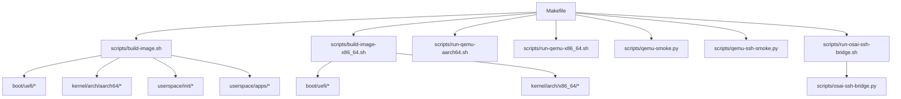
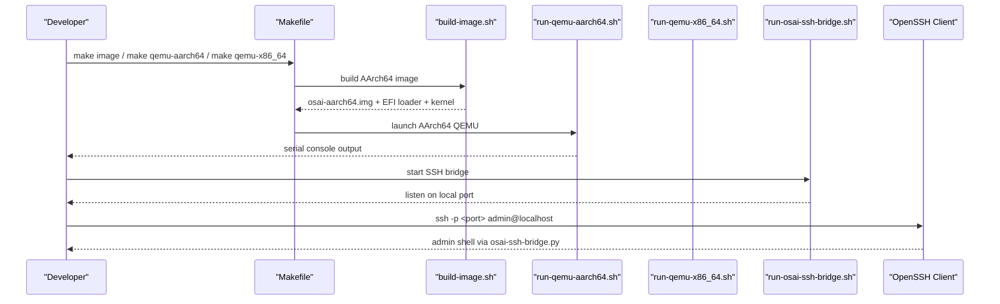
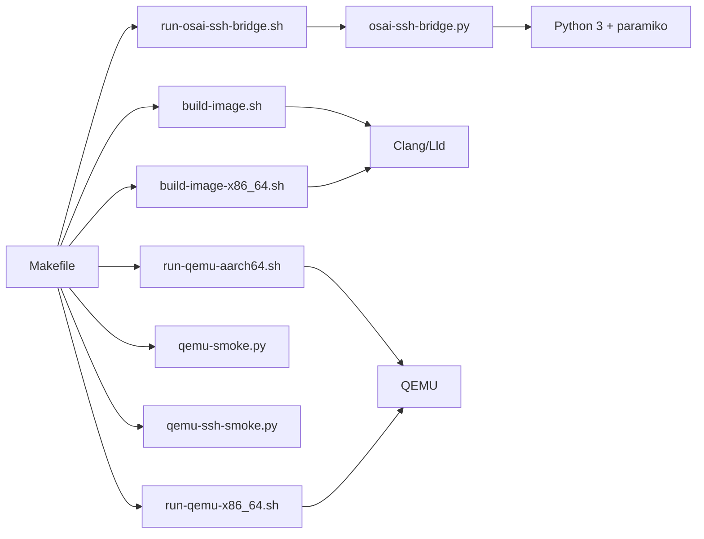

# Getting Started

<cite>
**Referenced Files in This Document**
- [README.md](file://README.md)
- [HARDWARE-READINESS.md](file://HARDWARE-READINESS.md)
- [QEMU-FULL-OS-PLAN.md](file://QEMU-FULL-OS-PLAN.md)
- [Makefile](file://Makefile)
- [requirements-dev.txt](file://requirements-dev.txt)
- [scripts/macos-bootstrap.sh](file://scripts/macos-bootstrap.sh)
- [scripts/build-image.sh](file://scripts/build-image.sh)
- [scripts/build-image-x86_64.sh](file://scripts/build-image-x86_64.sh)
- [scripts/run-qemu-aarch64.sh](file://scripts/run-qemu-aarch64.sh)
- [scripts/run-qemu-x86_64.sh](file://scripts/run-qemu-x86_64.sh)
- [scripts/qemu-smoke.py](file://scripts/qemu-smoke.py)
- [scripts/qemu-ssh-smoke.py](file://scripts/qemu-ssh-smoke.py)
- [scripts/run-osai-ssh-bridge.sh](file://scripts/run-osai-ssh-bridge.sh)
- [scripts/osai-ssh-bridge.py](file://scripts/osai-ssh-bridge.py)
- [CONTRIBUTING.md](file://CONTRIBUTING.md)
</cite>

## Table of Contents
1. [Introduction](#introduction)
2. [Project Structure](#project-structure)
3. [Core Components](#core-components)
4. [Architecture Overview](#architecture-overview)
5. [Detailed Component Analysis](#detailed-component-analysis)
6. [Dependency Analysis](#dependency-analysis)
7. [Performance Considerations](#performance-considerations)
8. [Troubleshooting Guide](#troubleshooting-guide)
9. [Conclusion](#conclusion)
10. [Appendices](#appendices)

## Introduction
This guide helps you set up, build, and develop OSAI from source on macOS. It covers prerequisites, environment preparation, building OSAI images, launching QEMU-based development environments for AArch64 and x86_64, establishing SSH access via the OSAI SSH bridge, and performing basic verification steps. It also outlines supported platforms, hardware readiness criteria, and common development workflows.

## Project Structure
OSAI is organized around a Makefile-driven build system and a collection of shell and Python scripts that orchestrate cross-compilation, image creation, QEMU launch, and remote access. Key areas:
- boot/uefi: UEFI loader sources for AArch64 and x86_64.
- kernel/: OS kernel sources, architecture-specific and core modules.
- userspace/: Userspace init, service manager, worker, and example applications.
- scripts/: Build, QEMU launch, and SSH bridge automation.
- Makefile: Top-level targets for building images, running QEMU, and executing gates/tests.

**Diagram sources**
- [Makefile:1-135](file://Makefile#L1-L135)
- [scripts/build-image.sh:1-366](file://scripts/build-image.sh#L1-L366)
- [scripts/build-image-x86_64.sh:1-141](file://scripts/build-image-x86_64.sh#L1-L141)
- [scripts/run-qemu-aarch64.sh:1-162](file://scripts/run-qemu-aarch64.sh#L1-L162)
- [scripts/run-qemu-x86_64.sh:1-127](file://scripts/run-qemu-x86_64.sh#L1-L127)
- [scripts/qemu-smoke.py:1-388](file://scripts/qemu-smoke.py#L1-L388)
- [scripts/qemu-ssh-smoke.py:1-105](file://scripts/qemu-ssh-smoke.py#L1-L105)
- [scripts/run-osai-ssh-bridge.sh:1-33](file://scripts/run-osai-ssh-bridge.sh#L1-L33)
- [scripts/osai-ssh-bridge.py:1-952](file://scripts/osai-ssh-bridge.py#L1-L952)

**Section sources**
- [README.md:1-86](file://README.md#L1-L86)
- [Makefile:1-135](file://Makefile#L1-L135)

## Core Components
- Build system: Makefile orchestrates bootstrap, image creation, QEMU runs, and gates.
- Cross-compilation toolchain: Clang and LLD are used to compile kernel and userspace for AArch64 and x86_64.
- QEMU automation: Scripts launch AArch64 and x86_64 VMs with UEFI firmware, VirtIO devices, and optional SSH bridging.
- SSH bridge: A Python-based SSH server proxy enables secure admin access to the guest via OpenSSH client.
- Smoke tests: Automated suites validate kernel, filesystem, networking, AI runtime, and control-plane behavior.

Practical outcomes:
- Build AArch64 and x86_64 images with UEFI loaders and kernel binaries.
- Boot QEMU VMs and observe full userspace initialization.
- Access the system remotely via SSH using the OSAI SSH bridge.

**Section sources**
- [Makefile:1-135](file://Makefile#L1-L135)
- [scripts/build-image.sh:1-366](file://scripts/build-image.sh#L1-L366)
- [scripts/build-image-x86_64.sh:1-141](file://scripts/build-image-x86_64.sh#L1-L141)
- [scripts/run-qemu-aarch64.sh:1-162](file://scripts/run-qemu-aarch64.sh#L1-L162)
- [scripts/run-qemu-x86_64.sh:1-127](file://scripts/run-qemu-x86_64.sh#L1-L127)
- [scripts/qemu-smoke.py:1-388](file://scripts/qemu-smoke.py#L1-L388)
- [scripts/qemu-ssh-smoke.py:1-105](file://scripts/qemu-ssh-smoke.py#L1-L105)
- [scripts/run-osai-ssh-bridge.sh:1-33](file://scripts/run-osai-ssh-bridge.sh#L1-L33)
- [scripts/osai-ssh-bridge.py:1-952](file://scripts/osai-ssh-bridge.py#L1-L952)

## Architecture Overview
The OSAI development workflow centers on a Makefile pipeline that compiles sources, creates bootable images, launches QEMU, and validates behavior through smoke tests. The SSH bridge provides a controlled admin interface.

**Diagram sources**
- [Makefile:1-135](file://Makefile#L1-L135)
- [scripts/build-image.sh:1-366](file://scripts/build-image.sh#L1-L366)
- [scripts/run-qemu-aarch64.sh:1-162](file://scripts/run-qemu-aarch64.sh#L1-L162)
- [scripts/run-qemu-x86_64.sh:1-127](file://scripts/run-qemu-x86_64.sh#L1-L127)
- [scripts/run-osai-ssh-bridge.sh:1-33](file://scripts/run-osai-ssh-bridge.sh#L1-L33)
- [scripts/osai-ssh-bridge.py:1-952](file://scripts/osai-ssh-bridge.py#L1-L952)

## Detailed Component Analysis

### Prerequisites and Environment Setup
- Host OS: macOS recommended for AArch64/QEMU development.
- Tools:
  - QEMU system emulator for AArch64 and x86_64.
  - LLVM/Clang and LLD linker for cross-compilation.
  - Python 3 and mtools for image creation.
  - Git and Make.
  - Optional: mtools (mformat, mcopy, mmd) for FAT image manipulation.
- Firmware:
  - AArch64: EDK2/AAVMF firmware (QEMU_EFI.fd).
  - x86_64: EDK2 OVMF firmware (OVMF_CODE.fd).
- Development dependencies:
  - Python package paramiko is required for the SSH bridge.

Verification steps:
- Run the macOS bootstrap script to check tool availability and firmware presence.
- Confirm QEMU acceleration support (HVF for AArch64 on Apple Silicon).

**Section sources**
- [scripts/macos-bootstrap.sh:1-251](file://scripts/macos-bootstrap.sh#L1-L251)
- [README.md:43-48](file://README.md#L43-L48)

### Building OSAI from Source
- Bootstrap: Prepare the environment and verify tool availability.
- Images:
  - AArch64: make image builds the UEFI loader, kernel, userspace ELF binaries, and the FAT boot image with a VirtIO test block image.
  - x86_64: make image-x86_64 builds the UEFI loader and kernel for x86_64.
- Clean: make clean removes build artifacts.

Build flow highlights:
- Cross-compilation with Clang targeting bare-metal ABIs.
- Linking with LLD using architecture-specific linker scripts.
- Image creation with mtools to populate FAT partitions and initialize the test block image.

**Section sources**
- [Makefile:7-16](file://Makefile#L7-L16)
- [scripts/build-image.sh:1-366](file://scripts/build-image.sh#L1-L366)
- [scripts/build-image-x86_64.sh:1-141](file://scripts/build-image-x86_64.sh#L1-L141)

### QEMU-Based Development Environments
- AArch64:
  - Launch with make qemu-aarch64 or make qemu.
  - The script selects HVF acceleration when available, otherwise falls back to TCG.
  - Uses UEFI firmware, VirtIO block and network devices, and forwards guest port 22 to host port 2222 by default.
- x86_64:
  - Launch with make qemu-x86_64.
  - Uses OVMF firmware and VirtIO network device with port forwarding to 2223 by default.
- Dry run:
  - Pass --dry-run to either run script to print the constructed QEMU command without launching.

Initial boot process:
- UEFI loader transfers control to the kernel.
- Kernel initializes memory management, drivers, telemetry, and userspace.
- Init and service-manager start, followed by built-in test applications.

**Section sources**
- [Makefile:18-25](file://Makefile#L18-L25)
- [scripts/run-qemu-aarch64.sh:1-162](file://scripts/run-qemu-aarch64.sh#L1-L162)
- [scripts/run-qemu-x86_64.sh:1-127](file://scripts/run-qemu-x86_64.sh#L1-L127)

### SSH Bridge and Remote Access
- Start the bridge:
  - make osai-ssh-bridge launches the SSH bridge script, which sets up a Python virtual environment and installs paramiko if missing.
- Connect:
  - Use an OpenSSH client to connect to admin@localhost on the configured port (default 2222).
- Bridge behavior:
  - Provides a restricted command surface suitable for administrative tasks.
  - Implements a virtual filesystem abstraction for file operations and packaging tools (tar, cpio).

Smoke test:
- scripts/qemu-ssh-smoke.py starts the bridge, waits for the listening port, and executes a short series of commands to validate connectivity and basic system status.

**Section sources**
- [Makefile:118-119](file://Makefile#L118-L119)
- [scripts/run-osai-ssh-bridge.sh:1-33](file://scripts/run-osai-ssh-bridge.sh#L1-L33)
- [scripts/osai-ssh-bridge.py:1-952](file://scripts/osai-ssh-bridge.py#L1-L952)
- [scripts/qemu-ssh-smoke.py:1-105](file://scripts/qemu-ssh-smoke.py#L1-L105)
- [README.md:70-75](file://README.md#L70-L75)

### Basic Verification Steps
- AArch64 smoke:
  - make qemu-smoke runs a comprehensive smoke test that monitors console output for expected milestones and telemetry completions.
- x86_64 smoke:
  - make qemu-x86_64-smoke runs architecture-specific smoke checks.
- Gates:
  - make qemu-readiness-gate and make qemu-full-os-rc validate the current state against frozen contracts and produce reports under build/.

**Section sources**
- [Makefile:31-71](file://Makefile#L31-L71)
- [scripts/qemu-smoke.py:1-388](file://scripts/qemu-smoke.py#L1-L388)
- [HARDWARE-READINESS.md:1-135](file://HARDWARE-READINESS.md#L1-L135)
- [QEMU-FULL-OS-PLAN.md:1-168](file://QEMU-FULL-OS-PLAN.md#L1-L168)

### Supported Platforms and Hardware Readiness
- Target platforms:
  - QEMU on macOS for early bring-up and correctness.
  - Intel Desktop CPUs for performance evaluation.
  - Intel Xeon CPUs for multi-agent, NUMA-aware deployments.
  - ARM/NVIDIA N1X/GB10-class systems for AArch64 SoCs.
- Hardware readiness:
  - Local QEMU matrices and gates must pass before moving to Intel Desktop.
  - Contract freezing and report generation define readiness and release-candidate status.

**Section sources**
- [README.md:39-48](file://README.md#L39-L48)
- [HARDWARE-READINESS.md:1-135](file://HARDWARE-READINESS.md#L1-L135)
- [QEMU-FULL-OS-PLAN.md:1-168](file://QEMU-FULL-OS-PLAN.md#L1-L168)

### Practical Development Workflows
- Build custom images:
  - make image for AArch64, make image-x86_64 for x86_64.
- Run smoke tests:
  - make qemu-smoke for AArch64; make qemu-x86_64-smoke for x86_64.
- Gate checks:
  - make qemu-readiness-gate and make qemu-full-os-rc to validate contracts and artifacts.
- SSH access:
  - make osai-ssh-bridge then ssh -p 2222 admin@localhost (or the configured port).
- Regression and fault injection:
  - make qemu-regression-suite, make qemu-fault-injection, and related gates.

**Section sources**
- [Makefile:31-131](file://Makefile#L31-L131)
- [README.md:63-75](file://README.md#L63-L75)

## Dependency Analysis
The build and run pipeline depends on a tight coupling between Makefile targets, shell scripts, and Python utilities. Toolchain dependencies (Clang/LLD) and firmware presence are validated during bootstrap and image build stages.

**Diagram sources**
- [Makefile:1-135](file://Makefile#L1-L135)
- [scripts/build-image.sh:1-366](file://scripts/build-image.sh#L1-L366)
- [scripts/build-image-x86_64.sh:1-141](file://scripts/build-image-x86_64.sh#L1-L141)
- [scripts/run-qemu-aarch64.sh:1-162](file://scripts/run-qemu-aarch64.sh#L1-L162)
- [scripts/run-qemu-x86_64.sh:1-127](file://scripts/run-qemu-x86_64.sh#L1-L127)
- [scripts/qemu-smoke.py:1-388](file://scripts/qemu-smoke.py#L1-L388)
- [scripts/qemu-ssh-smoke.py:1-105](file://scripts/qemu-ssh-smoke.py#L1-L105)
- [scripts/run-osai-ssh-bridge.sh:1-33](file://scripts/run-osai-ssh-bridge.sh#L1-L33)
- [scripts/osai-ssh-bridge.py:1-952](file://scripts/osai-ssh-bridge.py#L1-L952)

**Section sources**
- [Makefile:1-135](file://Makefile#L1-L135)
- [scripts/macos-bootstrap.sh:1-251](file://scripts/macos-bootstrap.sh#L1-L251)

## Performance Considerations
- Use HVF acceleration on Apple Silicon for AArch64 QEMU to improve performance.
- Prefer TCG fallback when HVF is unavailable; expect slower emulation.
- Keep the development environment minimal to reduce noise in correctness checks.

## Troubleshooting Guide
Common setup issues and resolutions:
- Missing QEMU:
  - Install QEMU and ensure qemu-system-aarch64 or qemu-system-x86_64 is available.
- Missing firmware:
  - Provide OSAI_AAVMF_CODE or OSAI_OVMF_CODE pointing to the correct EDK2 firmware files.
- Missing tools:
  - Install LLVM/Clang and LLD via Homebrew; confirm clang and ld.lld are on PATH.
- SSH bridge fails:
  - Ensure paramiko is installed in the isolated virtual environment created by the bridge script.
- Port conflicts:
  - Adjust hostfwd ports via environment variables exposed by the QEMU scripts.
- Gate failures:
  - Review build/qemu-*-report.json outputs and fix failing milestones before advancing.

**Section sources**
- [scripts/macos-bootstrap.sh:163-239](file://scripts/macos-bootstrap.sh#L163-L239)
- [scripts/run-qemu-aarch64.sh:88-96](file://scripts/run-qemu-aarch64.sh#L88-L96)
- [scripts/run-qemu-x86_64.sh:86-94](file://scripts/run-qemu-x86_64.sh#L86-L94)
- [scripts/run-osai-ssh-bridge.sh:9-28](file://scripts/run-osai-ssh-bridge.sh#L9-L28)
- [HARDWARE-READINESS.md:1-135](file://HARDWARE-READINESS.md#L1-L135)

## Conclusion
With the macOS bootstrap script, Makefile targets, and QEMU automation, you can build OSAI images, boot AArch64 and x86_64 environments, and access the system securely via SSH. Use smoke tests and gates to verify correctness before moving to hardware readiness and Intel Desktop planning.

## Appendices

### Appendix A: Quick Start Checklist
- Install prerequisites (QEMU, LLVM/Clang, LLD, Python 3, mtools).
- Run the macOS bootstrap script to validate environment.
- Build images: make image and make image-x86_64.
- Boot QEMU: make qemu-aarch64 or make qemu-x86_64.
- Verify: make qemu-smoke and/or make qemu-x86_64-smoke.
- Access: make osai-ssh-bridge then ssh -p 2222 admin@localhost.

**Section sources**
- [scripts/macos-bootstrap.sh:1-251](file://scripts/macos-bootstrap.sh#L1-L251)
- [Makefile:1-135](file://Makefile#L1-L135)
- [README.md:63-75](file://README.md#L63-L75)