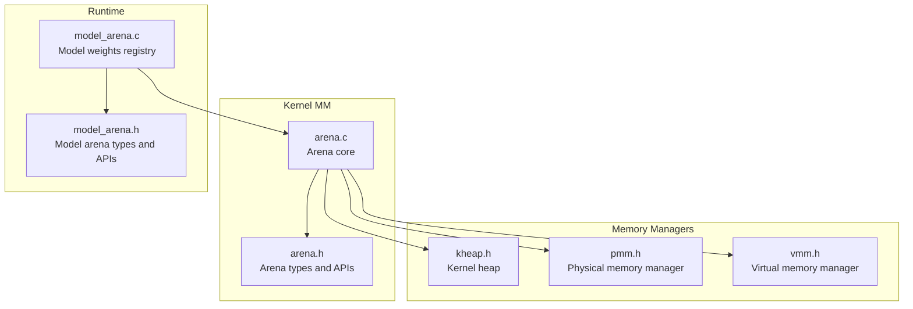
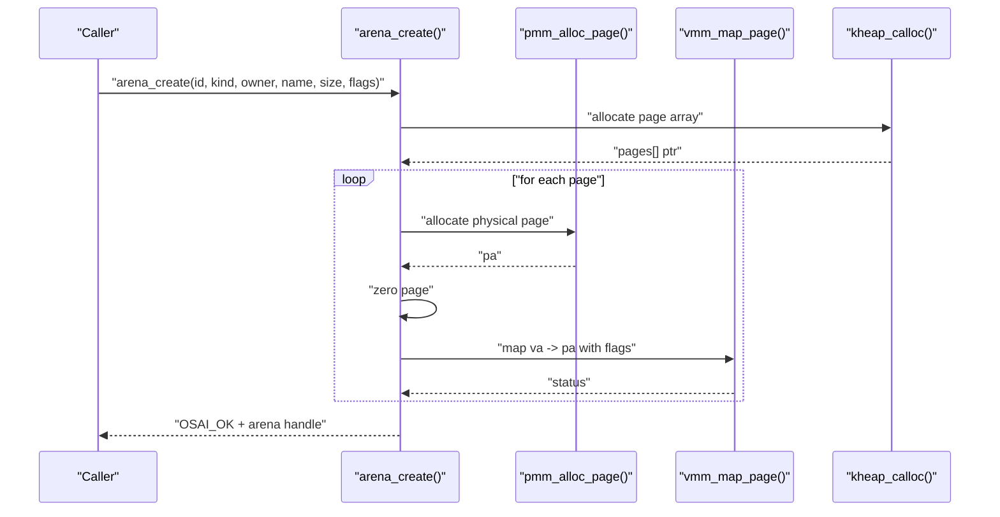
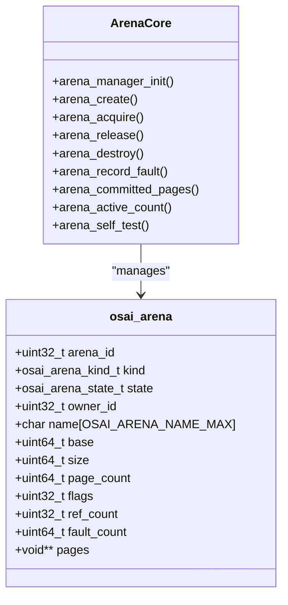
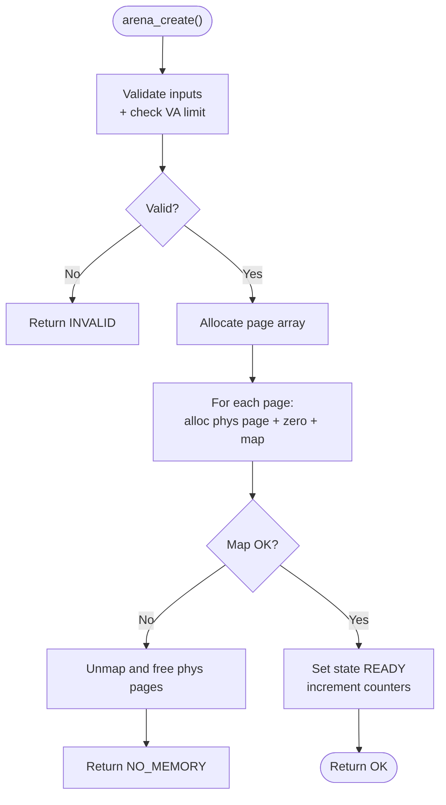
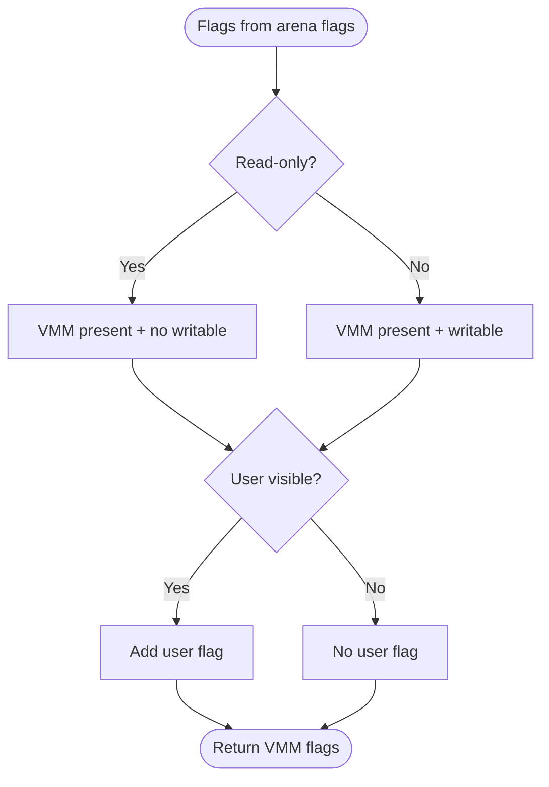
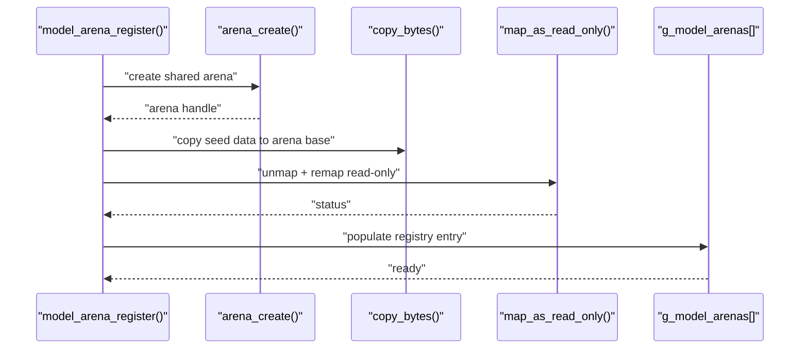
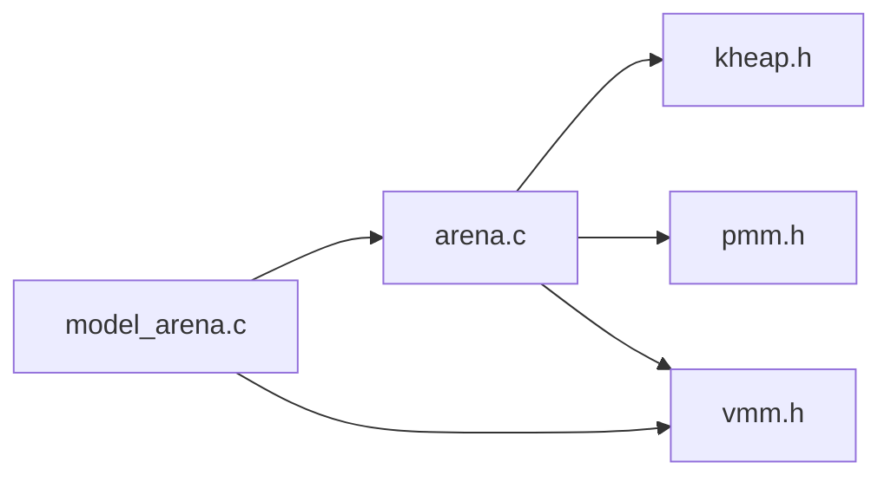

# Arena Allocator

<cite>
**Referenced Files in This Document**
- [arena.c](file://kernel/mm/arena.c)
- [arena.h](file://kernel/include/osai/arena.h)
- [model_arena.c](file://kernel/runtime/model_arena.c)
- [model_arena.h](file://kernel/include/osai/model_arena.h)
- [kheap.h](file://kernel/include/osai/kheap.h)
- [pmm.h](file://kernel/include/osai/pmm.h)
- [vmm.h](file://kernel/include/osai/vmm.h)
</cite>

## Table of Contents
1. [Introduction](#introduction)
2. [Project Structure](#project-structure)
3. [Core Components](#core-components)
4. [Architecture Overview](#architecture-overview)
5. [Detailed Component Analysis](#detailed-component-analysis)
6. [Dependency Analysis](#dependency-analysis)
7. [Performance Considerations](#performance-considerations)
8. [Troubleshooting Guide](#troubleshooting-guide)
9. [Conclusion](#conclusion)
10. [Appendices](#appendices)

## Introduction
This document explains OSAI’s Arena allocator, a kernel-side memory management primitive designed to provide efficient, low-fragmentation allocation for specialized subsystems. It focuses on arena initialization, creation, mapping, lifecycle management, and integration with the broader memory management stack (page and virtual memory managers). It also covers arena kinds, flags, sizing and alignment, and usage patterns across kernel components such as model weights, KV cache, build output, logs, and telemetry. Thread-safety considerations, debugging aids, and performance characteristics are included to guide safe and effective use.

## Project Structure
The arena implementation spans two primary areas:
- Memory manager arena core: defines the arena data structure, lifecycle APIs, and internal helpers.
- Model arena wrapper: a higher-level registry that registers read-only model weights into arenas and exposes a simplified interface for consumers.

**Diagram sources**
- [arena.c:1-256](file://kernel/mm/arena.c#L1-L256)
- [arena.h:1-57](file://kernel/include/osai/arena.h#L1-L57)
- [model_arena.c:1-141](file://kernel/runtime/model_arena.c#L1-L141)
- [model_arena.h:1-28](file://kernel/include/osai/model_arena.h#L1-L28)
- [kheap.h:1-14](file://kernel/include/osai/kheap.h#L1-L14)
- [pmm.h:1-14](file://kernel/include/osai/pmm.h#L1-L14)
- [vmm.h:1-29](file://kernel/include/osai/vmm.h#L1-L29)

**Section sources**
- [arena.c:1-256](file://kernel/mm/arena.c#L1-L256)
- [arena.h:1-57](file://kernel/include/osai/arena.h#L1-L57)
- [model_arena.c:1-141](file://kernel/runtime/model_arena.c#L1-L141)
- [model_arena.h:1-28](file://kernel/include/osai/model_arena.h#L1-L28)
- [kheap.h:1-14](file://kernel/include/osai/kheap.h#L1-L14)
- [pmm.h:1-14](file://kernel/include/osai/pmm.h#L1-L14)
- [vmm.h:1-29](file://kernel/include/osai/vmm.h#L1-L29)

## Core Components
- Arena core (arena.c): Implements arena creation, mapping, reference counting, destruction, and statistics. It manages per-arena metadata, tracks committed pages, and enforces basic safety checks.
- Arena types and APIs (arena.h): Declares arena kinds, flags, state, and public APIs.
- Model arena registry (model_arena.c): Registers read-only model weights into shared arenas, exposes acquisition/release semantics, and remaps pages to read-only mode after population.
- Model arena types and APIs (model_arena.h): Declares model arena registration API set and lightweight descriptor.
- Kernel heap (kheap.h): Used for allocating arena metadata arrays (page pointer arrays).
- Physical memory manager (pmm.h): Allocates/free physical pages backing arena mappings.
- Virtual memory manager (vmm.h): Maps/unmaps virtual addresses to physical pages with appropriate flags.

Key responsibilities:
- Arena core: allocate and map pages, maintain arena state, enforce lifecycle rules, and expose stats.
- Model arena: register/unregister shared read-only weights, manage consumer references, and apply read-only mappings.

**Section sources**
- [arena.c:45-155](file://kernel/mm/arena.c#L45-L155)
- [arena.h:14-42](file://kernel/include/osai/arena.h#L14-L42)
- [model_arena.c:54-84](file://kernel/runtime/model_arena.c#L54-L84)
- [model_arena.h:9-26](file://kernel/include/osai/model_arena.h#L9-L26)
- [kheap.h:6-11](file://kernel/include/osai/kheap.h#L6-L11)
- [pmm.h:7-11](file://kernel/include/osai/pmm.h#L7-L11)
- [vmm.h:18-26](file://kernel/include/osai/vmm.h#L18-L26)

## Architecture Overview
The arena allocator sits atop the physical and virtual memory managers. Creation allocates physical pages, zeros them, maps them into a reserved virtual address range, and records the mapping. Consumers acquire references to arenas and release them when done. Destruction tears down mappings and frees physical pages.

**Diagram sources**
- [arena.c:102-155](file://kernel/mm/arena.c#L102-L155)
- [pmm.h:8](file://kernel/include/osai/pmm.h#L8)
- [vmm.h:21](file://kernel/include/osai/vmm.h#L21)
- [kheap.h:7-8](file://kernel/include/osai/kheap.h#L7-L8)

## Detailed Component Analysis

### Arena Core: Data Structures and Lifecycle
- Arena metadata includes identifiers, kind, state, owner, name, base, size, page count, flags, reference count, fault count, and a pointer array to physical pages.
- Lifecycle states: EMPTY, READY, DESTROYED. Reference counting prevents premature destruction.
- Flags control read-only, sharing, pre-faulting, and user visibility. These map to VMM flags during mapping.

**Diagram sources**
- [arena.h:29-42](file://kernel/include/osai/arena.h#L29-L42)
- [arena.c:45-202](file://kernel/mm/arena.c#L45-L202)

**Section sources**
- [arena.h:29-42](file://kernel/include/osai/arena.h#L29-L42)
- [arena.c:45-63](file://kernel/mm/arena.c#L45-L63)
- [arena.c:102-155](file://kernel/mm/arena.c#L102-L155)
- [arena.c:157-194](file://kernel/mm/arena.c#L157-L194)
- [arena.c:196-210](file://kernel/mm/arena.c#L196-L210)

### Arena Initialization and Validation
- Manager initialization zeroes all arena entries and resets counters.
- Creation validation checks arena ID bounds, non-empty name, non-zero size, and sufficient virtual address space within configured limits.
- Base virtual address is computed as a stride offset from a fixed base, ensuring per-arena separation.

**Diagram sources**
- [arena.c:65-77](file://kernel/mm/arena.c#L65-L77)
- [arena.c:112-144](file://kernel/mm/arena.c#L112-L144)
- [arena.c:86-100](file://kernel/mm/arena.c#L86-L100)

**Section sources**
- [arena.c:45-63](file://kernel/mm/arena.c#L45-L63)
- [arena.c:65-77](file://kernel/mm/arena.c#L65-L77)
- [arena.c:112-144](file://kernel/mm/arena.c#L112-L144)

### Virtual Memory Mapping and Flags
- Mapping flags derive from arena flags: read-only implies no write permission; user visibility sets user-mode accessibility.
- Read-only mapping for model weights is enforced by remapping pages after initial population.

**Diagram sources**
- [arena.c:34-43](file://kernel/mm/arena.c#L34-L43)
- [vmm.h:8-12](file://kernel/include/osai/vmm.h#L8-L12)

**Section sources**
- [arena.c:34-43](file://kernel/mm/arena.c#L34-L43)
- [vmm.h:18-26](file://kernel/include/osai/vmm.h#L18-L26)

### Model Arena Registry
- Registers a read-only model weights image into a shared arena, copies data into the arena, then remaps pages to read-only.
- Provides acquisition/release semantics for consumers while keeping a separate lightweight descriptor.

**Diagram sources**
- [model_arena.c:54-84](file://kernel/runtime/model_arena.c#L54-L84)
- [model_arena.c:23-39](file://kernel/runtime/model_arena.c#L23-L39)

**Section sources**
- [model_arena.c:54-84](file://kernel/runtime/model_arena.c#L54-L84)
- [model_arena.c:23-39](file://kernel/runtime/model_arena.c#L23-L39)
- [model_arena.h:9-26](file://kernel/include/osai/model_arena.h#L9-L26)

### Usage Patterns Across Kernel Subsystems
- Model weights: Registered via model arena; acquired by runtime components; released when done. Supports shared, read-only access.
- KV cache, source index, build output, logs, telemetry: Created per-cell or per-task with explicit ownership and sizes; destroyed when resources are freed.

Practical examples (described):
- Registering a shared model weights arena and acquiring it twice for concurrent consumers.
- Creating a KV cache arena for a cell, using it, then destroying it upon teardown.
- Destroying multiple arena kinds (KV cache, source index, build output, logs, telemetry) in a controlled sequence.

**Section sources**
- [model_arena.c:125-140](file://kernel/runtime/model_arena.c#L125-L140)
- [arena.c:212-255](file://kernel/mm/arena.c#L212-L255)

## Dependency Analysis
The arena core depends on:
- Kernel heap for allocating per-arena page arrays.
- Physical memory manager for page allocation and freeing.
- Virtual memory manager for mapping and unmapping pages.
- Logging and assertion facilities for diagnostics.

**Diagram sources**
- [arena.c:1-6](file://kernel/mm/arena.c#L1-L6)
- [kheap.h:1-14](file://kernel/include/osai/kheap.h#L1-L14)
- [pmm.h:1-14](file://kernel/include/osai/pmm.h#L1-L14)
- [vmm.h:1-29](file://kernel/include/osai/vmm.h#L1-L29)
- [model_arena.c:1-6](file://kernel/runtime/model_arena.c#L1-L6)

**Section sources**
- [arena.c:1-6](file://kernel/mm/arena.c#L1-L6)
- [model_arena.c:1-6](file://kernel/runtime/model_arena.c#L1-L6)

## Performance Considerations
- Page granularity: Arenas are sized and aligned to page boundaries, minimizing TLB pressure and simplifying mapping operations.
- Pre-faulting: Arena flags include a pre-fault indicator, which can reduce early page faults by touching pages during creation.
- Zero-filled pages: Newly allocated pages are zeroed to avoid uninitialized memory hazards and reduce later clearing overhead.
- Shared read-only models: Remapping to read-only reduces accidental writes and improves cache locality for read-heavy workloads.
- Statistics: Committed page and active arena counts enable capacity planning and anomaly detection.

Optimization opportunities:
- Batch creation: Group arena creation to amortize overhead.
- Alignment: Prefer sizes aligned to power-of-two page multiples for predictable mapping costs.
- Reference management: Ensure balanced acquire/release to prevent leaks and unnecessary residency.

**Section sources**
- [arena.c:18-20](file://kernel/mm/arena.c#L18-L20)
- [arena.c:123](file://kernel/mm/arena.c#L123)
- [arena.c:135](file://kernel/mm/arena.c#L135)
- [model_arena.c:23-39](file://kernel/runtime/model_arena.c#L23-L39)
- [arena.c:204-210](file://kernel/mm/arena.c#L204-L210)

## Troubleshooting Guide
Common issues and diagnostics:
- Invalid creation: Creation fails if arena ID is out of range, name is empty, size is zero, or virtual address limit is exceeded.
- Out-of-memory during mapping: If any page mapping fails, the system unmaps previously mapped pages and returns an error.
- Destroy while busy: Destruction requires zero reference count; otherwise, an invalid operation is returned.
- Fault accounting: Faults can be recorded per arena for monitoring and tuning.
- Self-tests: Both arena core and model arena include self-tests validating creation, mapping, reference counting, and destruction.

Debugging tips:
- Inspect arena state and flags to confirm readiness and permissions.
- Verify committed page and active count to detect leaks or miscounts.
- Use logging outputs emitted during creation and destruction to trace lifecycle events.

**Section sources**
- [arena.c:65-77](file://kernel/mm/arena.c#L65-L77)
- [arena.c:86-100](file://kernel/mm/arena.c#L86-L100)
- [arena.c:177-194](file://kernel/mm/arena.c#L177-L194)
- [arena.c:196-202](file://kernel/mm/arena.c#L196-L202)
- [arena.c:212-255](file://kernel/mm/arena.c#L212-L255)
- [model_arena.c:125-140](file://kernel/runtime/model_arena.c#L125-L140)

## Conclusion
OSAI’s arena allocator provides a robust, low-friction mechanism for kernel components to allocate and share contiguous memory regions with predictable performance. By leveraging page-granularity allocation, explicit lifecycle management, and read-only optimization for shared assets, it minimizes fragmentation and simplifies memory management across subsystems. The integration with PMM and VMM ensures safe and efficient mapping, while the model arena wrapper streamlines shared read-only weight distribution. Proper use of flags, careful reference management, and monitoring of statistics yield reliable and high-performance memory usage.

## Appendices

### Arena Sizing and Alignment
- Arena sizes are rounded up to the next page boundary.
- Virtual bases are spaced by a fixed stride to prevent overlap and simplify diagnostics.
- Alignment helpers support page-alignment computations.

**Section sources**
- [arena.c:18-20](file://kernel/mm/arena.c#L18-L20)
- [arena.c:110-111](file://kernel/mm/arena.c#L110-L111)
- [arena.c:72-75](file://kernel/mm/arena.c#L72-L75)

### Thread-Safety and Concurrency
- Arena core maintains counters and per-arena metadata but does not implement internal locking around these fields.
- Reference counting is performed with simple atomic increments/decrements in the provided APIs.
- Consumers should serialize access to arena creation/destroy and coordinate across threads to avoid races on shared arenas.
- Model arena registry maintains its own lightweight descriptors and does not introduce additional synchronization primitives.

Guidance:
- Use external locks or atomic operations around shared arena access if accessed concurrently.
- Avoid destroying arenas while references still exist.

**Section sources**
- [arena.c:157-175](file://kernel/mm/arena.c#L157-L175)
- [model_arena.c:101-123](file://kernel/runtime/model_arena.c#L101-L123)

### Debugging and Monitoring
- Logging statements during creation, destruction, and self-tests aid in tracing lifecycle events.
- Statistics functions expose committed page and active arena counts for capacity monitoring.
- Self-tests validate correctness of creation, mapping, reference counting, and destruction.

**Section sources**
- [arena.c:62](file://kernel/mm/arena.c#L62)
- [arena.c:151-154](file://kernel/mm/arena.c#L151-L154)
- [arena.c:192](file://kernel/mm/arena.c#L192)
- [arena.c:253-254](file://kernel/mm/arena.c#L253-L254)
- [model_arena.c:51](file://kernel/runtime/model_arena.c#L51)
- [model_arena.c:80-83](file://kernel/runtime/model_arena.c#L80-L83)
- [model_arena.c:139](file://kernel/runtime/model_arena.c#L139)