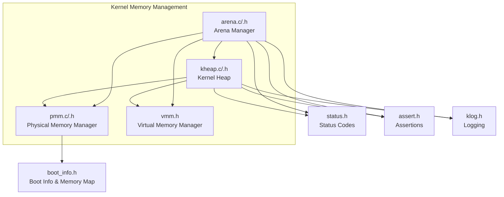
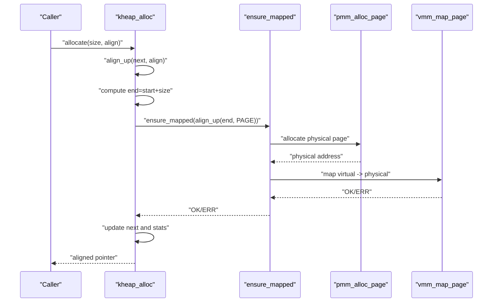
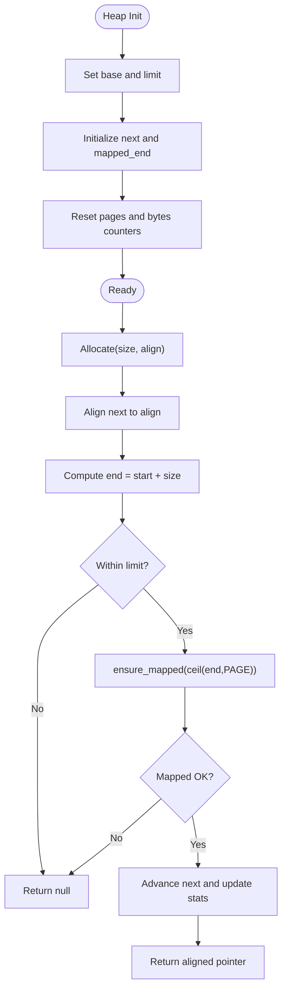
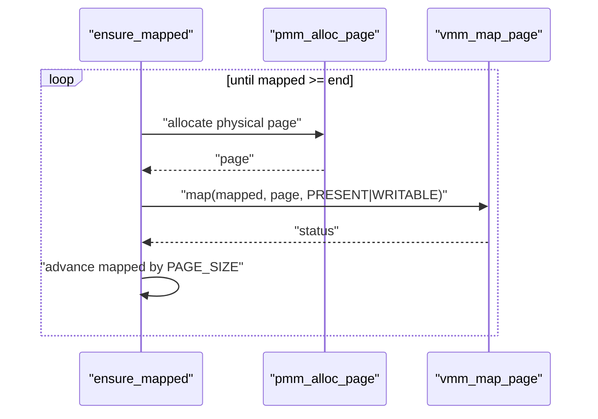
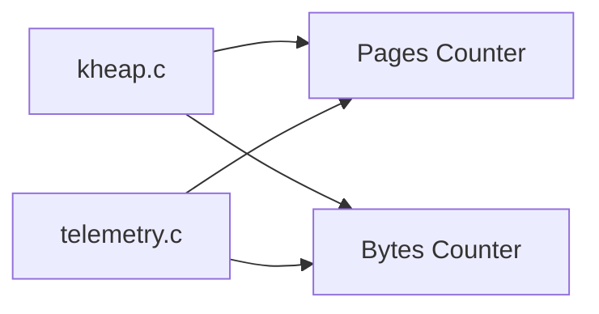
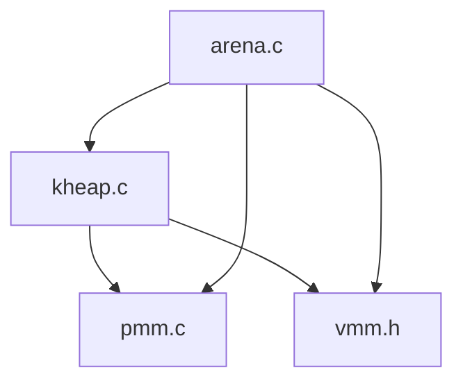
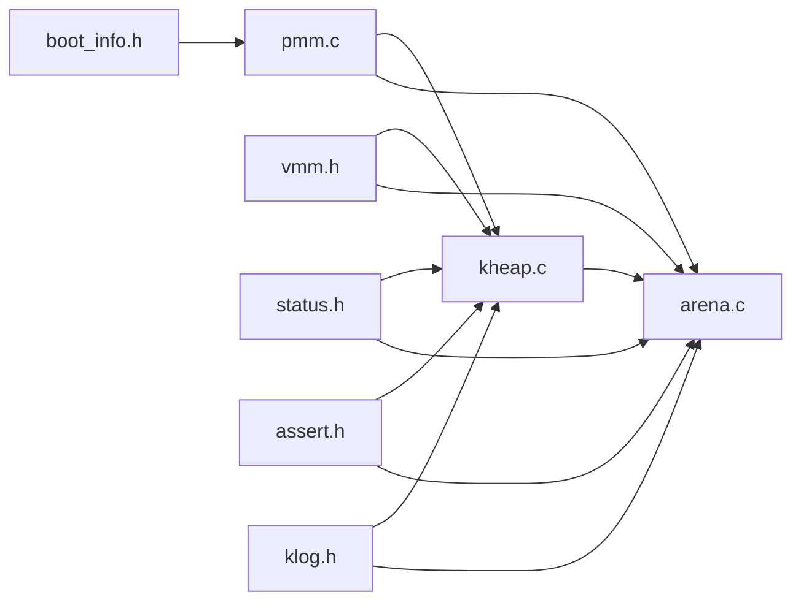

# Kernel Heap

<cite>
**Referenced Files in This Document**
- [kheap.h](file://kernel/include/osai/kheap.h)
- [kheap.c](file://kernel/mm/kheap.c)
- [pmm.h](file://kernel/include/osai/pmm.h)
- [pmm.c](file://kernel/mm/pmm.c)
- [vmm.h](file://kernel/include/osai/vmm.h)
- [arena.h](file://kernel/include/osai/arena.h)
- [arena.c](file://kernel/mm/arena.c)
- [boot_info.h](file://kernel/include/osai/boot_info.h)
- [status.h](file://kernel/include/osai/status.h)
- [assert.h](file://kernel/include/osai/assert.h)
- [klog.h](file://kernel/include/osai/klog.h)
- [kmain.c](file://kernel/core/kmain.c)
- [telemetry.c](file://kernel/core/telemetry.c)
- [virtio_blk.c](file://kernel/dev/virtio/virtio_blk.c)
- [virtio_net.c](file://kernel/dev/virtio/virtio_net.c)
- [initramfs.c](file://kernel/fs/initramfs.c)
</cite>

## Table of Contents
1. [Introduction](#introduction)
2. [Project Structure](#project-structure)
3. [Core Components](#core-components)
4. [Architecture Overview](#architecture-overview)
5. [Detailed Component Analysis](#detailed-component-analysis)
6. [Dependency Analysis](#dependency-analysis)
7. [Performance Considerations](#performance-considerations)
8. [Troubleshooting Guide](#troubleshooting-guide)
9. [Conclusion](#conclusion)
10. [Appendices](#appendices)

## Introduction
This document describes the OSAI kernel heap implementation, focusing on heap initialization, memory pool management, allocation algorithms, metadata and chunk organization, free block management, heap growth, memory statistics, and integration with other memory management components. It also covers heap usage patterns, safety guidelines, and how the kernel heap supports kernel services such as AI runtime, file systems, and device drivers.

## Project Structure
The kernel heap resides in the memory management subsystem alongside physical memory management (PMM) and virtual memory management (VMM). Arena management integrates with the kernel heap for larger allocations and shared memory regions. The boot info structure provides memory map descriptors used during PMM initialization.

**Diagram sources**
- [kheap.c:1-114](file://kernel/mm/kheap.c#L1-L114)
- [kheap.h:1-14](file://kernel/include/osai/kheap.h#L1-L14)
- [pmm.c:1-101](file://kernel/mm/pmm.c#L1-L101)
- [pmm.h:1-14](file://kernel/include/osai/pmm.h#L1-L14)
- [vmm.h:1-29](file://kernel/include/osai/vmm.h#L1-L29)
- [arena.c:1-256](file://kernel/mm/arena.c#L1-L256)
- [arena.h:1-57](file://kernel/include/osai/arena.h#L1-L57)
- [boot_info.h:1-34](file://kernel/include/osai/boot_info.h#L1-L34)
- [status.h:1-14](file://kernel/include/osai/status.h#L1-L14)
- [assert.h:1-14](file://kernel/include/osai/assert.h#L1-L14)
- [klog.h:1-12](file://kernel/include/osai/klog.h#L1-L12)

**Section sources**
- [kheap.c:1-114](file://kernel/mm/kheap.c#L1-L114)
- [kheap.h:1-14](file://kernel/include/osai/kheap.h#L1-L14)
- [pmm.c:1-101](file://kernel/mm/pmm.c#L1-L101)
- [pmm.h:1-14](file://kernel/include/osai/pmm.h#L1-L14)
- [vmm.h:1-29](file://kernel/include/osai/vmm.h#L1-L29)
- [arena.c:1-256](file://kernel/mm/arena.c#L1-L256)
- [arena.h:1-57](file://kernel/include/osai/arena.h#L1-L57)
- [boot_info.h:1-34](file://kernel/include/osai/boot_info.h#L1-L34)
- [status.h:1-14](file://kernel/include/osai/status.h#L1-L14)
- [assert.h:1-14](file://kernel/include/osai/assert.h#L1-L14)
- [klog.h:1-12](file://kernel/include/osai/klog.h#L1-L12)

## Core Components
- Kernel Heap (kheap): Provides a simple bump allocator with alignment-aware growth inside a fixed virtual range. It grows the heap by allocating physical pages via PMM and mapping them into the kernel’s virtual address space via VMM.
- Physical Memory Manager (PMM): Manages a free page stack derived from the UEFI memory map, reserving pages used by the kernel and firmware.
- Virtual Memory Manager (VMM): Maps virtual addresses to physical pages with appropriate flags (present, writable).
- Arena Manager (arena): Allocates larger regions backed by physical pages, zero-initialized, and mapped with configurable permissions. It uses the kernel heap for small internal allocations.

Key responsibilities:
- Initialization of heap boundaries and counters
- Alignment-aware allocation and growth
- Statistics tracking (allocated pages and bytes)
- Self-tests validating behavior under constraints

**Section sources**
- [kheap.c:21-27](file://kernel/mm/kheap.c#L21-L27)
- [kheap.c:48-66](file://kernel/mm/kheap.c#L48-L66)
- [kheap.c:68-77](file://kernel/mm/kheap.c#L68-L77)
- [kheap.c:79-85](file://kernel/mm/kheap.c#L79-L85)
- [kheap.c:87-113](file://kernel/mm/kheap.c#L87-L113)
- [pmm.c:41-77](file://kernel/mm/pmm.c#L41-L77)
- [pmm.c:79-92](file://kernel/mm/pmm.c#L79-L92)
- [vmm.h:18-26](file://kernel/include/osai/vmm.h#L18-L26)
- [arena.c:102-155](file://kernel/mm/arena.c#L102-L155)
- [arena.c:112-115](file://kernel/mm/arena.c#L112-L115)

## Architecture Overview
The kernel heap operates within a dedicated virtual address range. On each allocation, the system ensures the target region is mapped by allocating physical pages and mapping them into the kernel’s VA space. Allocation sizes are rounded up to alignment boundaries, and the next allocation pointer advances accordingly.

**Diagram sources**
- [kheap.c:48-66](file://kernel/mm/kheap.c#L48-L66)
- [kheap.c:29-46](file://kernel/mm/kheap.c#L29-L46)
- [pmm.c:79-84](file://kernel/mm/pmm.c#L79-L84)
- [vmm.h:21-23](file://kernel/include/osai/vmm.h#L21-L23)

## Detailed Component Analysis

### Kernel Heap Metadata and Chunk Organization
- Fixed virtual range: Base and limit define the heap’s virtual bounds.
- Growth pointer: g_heap_next tracks the next unallocated byte within the heap.
- Mapped boundary: g_heap_mapped_end tracks the extent of currently mapped pages.
- Statistics: g_heap_pages counts mapped pages; g_heap_bytes_allocated counts total bytes allocated.

There is no explicit chunk header or free list in the kernel heap. Allocations are tracked only by the growth pointer and counters. This simplifies the allocator but precludes coalescing or reuse of freed blocks.

**Diagram sources**
- [kheap.c:21-27](file://kernel/mm/kheap.c#L21-L27)
- [kheap.c:48-66](file://kernel/mm/kheap.c#L48-L66)
- [kheap.c:29-46](file://kernel/mm/kheap.c#L29-L46)

**Section sources**
- [kheap.c:7-16](file://kernel/mm/kheap.c#L7-L16)
- [kheap.c:21-27](file://kernel/mm/kheap.c#L21-L27)
- [kheap.c:48-66](file://kernel/mm/kheap.c#L48-L66)
- [kheap.c:29-46](file://kernel/mm/kheap.c#L29-L46)

### Allocation Algorithms
- Current strategy: Bump allocator with alignment. No explicit first-fit, best-fit, or worst-fit selection is implemented.
- Behavior: Aligns the current growth pointer to the requested alignment, computes the end, validates bounds, ensures pages are mapped, then advances the pointer and updates statistics.

Implications:
- Predictable performance characteristics with minimal overhead.
- No fragmentation within the heap’s contiguous region.
- No free list maintenance or coalescing.

**Section sources**
- [kheap.c:48-66](file://kernel/mm/kheap.c#L48-L66)
- [kheap.c:17-19](file://kernel/mm/kheap.c#L17-L19)

### Free Block Management
- Not applicable: The kernel heap does not track free blocks or support deallocation. There is no free list, chunk headers, or coalescing logic.

Guidelines:
- Use the kernel heap for temporary allocations or when a simple bump allocator suffices.
- For long-lived allocations requiring freeing, prefer arena-backed regions or other allocators designed for reuse.

**Section sources**
- [kheap.c:1-114](file://kernel/mm/kheap.c#L1-L114)

### Heap Growth Mechanisms
- ensure_mapped iteratively allocates physical pages and maps them until the requested end is covered.
- Uses PMM for physical pages and VMM for mapping with present/writable flags.
- Tracks the number of mapped pages and advances the mapped boundary.

**Diagram sources**
- [kheap.c:29-46](file://kernel/mm/kheap.c#L29-L46)
- [pmm.c:79-84](file://kernel/mm/pmm.c#L79-L84)
- [vmm.h:21-23](file://kernel/include/osai/vmm.h#L21-L23)

**Section sources**
- [kheap.c:29-46](file://kernel/mm/kheap.c#L29-L46)
- [pmm.c:79-84](file://kernel/mm/pmm.c#L79-L84)
- [vmm.h:8-12](file://kernel/include/osai/vmm.h#L8-L12)

### Memory Compaction and Fragmentation Prevention
- No compaction: The kernel heap does not relocate existing allocations.
- Minimal fragmentation within the heap: Because allocations are contiguous and there is no free list, external fragmentation is not observed in this allocator.
- Internal fragmentation: May occur due to alignment padding.

Recommendations:
- Prefer aligned allocations to reduce internal fragmentation.
- Use arenas for large, long-lived buffers to keep the kernel heap lean for small allocations.

**Section sources**
- [kheap.c:48-66](file://kernel/mm/kheap.c#L48-L66)
- [kheap.c:17-19](file://kernel/mm/kheap.c#L17-L19)

### Heap Statistics Tracking and Monitoring
- Pages allocated: kheap_pages_allocated returns the number of mapped pages.
- Bytes allocated: kheap_bytes_allocated returns the total bytes handed out by the heap.
- Telemetry integration: These metrics are exposed via kernel telemetry for monitoring.

**Diagram sources**
- [kheap.c:79-85](file://kernel/mm/kheap.c#L79-L85)
- [telemetry.c:29-31](file://kernel/core/telemetry.c#L29-L31)

**Section sources**
- [kheap.c:79-85](file://kernel/mm/kheap.c#L79-L85)
- [telemetry.c:29-31](file://kernel/core/telemetry.c#L29-L31)

### Debugging Capabilities
- Self-test routine validates:
  - Correct alignment of returned pointers
  - Proper handling of invalid inputs (zero size, invalid alignment)
  - Boundary checks preventing overflow beyond the heap limit
  - Zero-filled calloc behavior
  - Minimum page count and byte accounting after allocations

**Section sources**
- [kheap.c:87-113](file://kernel/mm/kheap.c#L87-L113)

### Integration with Other Memory Management Components
- PMM: Supplies physical pages for heap growth.
- VMM: Maps physical pages into the kernel’s virtual address space.
- Arena: Uses the kernel heap for small internal allocations (e.g., arrays of page pointers) and provides larger, zero-initialized regions with configurable permissions.

**Diagram sources**
- [kheap.c:1-6](file://kernel/mm/kheap.c#L1-L6)
- [arena.c:1-7](file://kernel/mm/arena.c#L1-L7)
- [pmm.c:1-101](file://kernel/mm/pmm.c#L1-L101)
- [vmm.h:1-29](file://kernel/include/osai/vmm.h#L1-L29)

**Section sources**
- [kheap.c:1-6](file://kernel/mm/kheap.c#L1-L6)
- [arena.c:102-155](file://kernel/mm/arena.c#L102-L155)
- [arena.c:112-115](file://kernel/mm/arena.c#L112-L115)

### Allocation Size Limits and Constraints
- Virtual range: The heap is constrained to a fixed base and size, with a hard upper bound enforced during allocation.
- Alignment: Must be a power-of-two; otherwise allocation fails.
- Page granularity: ensure_mapped rounds the end to a page boundary before mapping.

**Section sources**
- [kheap.c:7-10](file://kernel/mm/kheap.c#L7-L10)
- [kheap.c:49-57](file://kernel/mm/kheap.c#L49-L57)
- [kheap.c:59-61](file://kernel/mm/kheap.c#L59-L61)

### Heap Corruption Detection and Memory Leak Prevention
- Assertions: The codebase uses assertions for invariant checks (e.g., self-test assertions).
- No explicit guard bytes or checksums are present in the kernel heap.
- Leak awareness: Expose statistics (pages and bytes) to detect unexpected growth.

Recommendations:
- Instrument allocations with logging for suspiciously large totals.
- Use arenas for large buffers to separate concerns and enable controlled lifetimes.

**Section sources**
- [kheap.c:87-113](file://kernel/mm/kheap.c#L87-L113)
- [assert.h:6-11](file://kernel/include/osai/assert.h#L6-L11)

### Performance Optimization Techniques
- Minimizing overhead: Single pointer advancement and simple arithmetic.
- Avoiding fragmentation: Contiguous allocation simplifies access and reduces TLB pressure.
- Practical tips:
  - Batch similar-sized allocations to improve cache locality.
  - Prefer calloc for zero-initialized buffers to avoid explicit memset loops outside the heap.

**Section sources**
- [kheap.c:68-77](file://kernel/mm/kheap.c#L68-L77)
- [kheap.c:17-19](file://kernel/mm/kheap.c#L17-L19)

### Role in Supporting Kernel Services
- AI runtime: Large model weights and KV caches are managed via arenas; the kernel heap can be used for auxiliary allocations.
- File systems: Temporary buffers and per-operation allocations are supported by the heap.
- Device drivers (virtio): DMA descriptors and packet buffers are often allocated via arenas; the heap may back small internal structures.

Examples of usage patterns:
- Driver initialization: Allocate descriptor rings and packet buffers using arena or heap depending on lifetime.
- File system operations: Allocate temporary buffers for reads/writes and release promptly.

**Section sources**
- [arena.c:102-155](file://kernel/mm/arena.c#L102-L155)
- [virtio_blk.c:69-78](file://kernel/dev/virtio/virtio_blk.c#L69-L78)
- [virtio_blk.c:195-196](file://kernel/dev/virtio/virtio_blk.c#L195-L196)
- [virtio_net.c:51-62](file://kernel/dev/virtio/virtio_net.c#L51-L62)
- [initramfs.c](file://kernel/fs/initramfs.c#L354)

## Dependency Analysis
The kernel heap depends on PMM for physical pages and VMM for mapping. Arena management depends on the kernel heap for small allocations and on PMM/VMM for large regions.

**Diagram sources**
- [boot_info.h:1-34](file://kernel/include/osai/boot_info.h#L1-L34)
- [pmm.c:41-77](file://kernel/mm/pmm.c#L41-L77)
- [kheap.c:1-6](file://kernel/mm/kheap.c#L1-L6)
- [vmm.h:1-29](file://kernel/include/osai/vmm.h#L1-L29)
- [arena.c:1-7](file://kernel/mm/arena.c#L1-L7)
- [status.h:1-14](file://kernel/include/osai/status.h#L1-L14)
- [assert.h:1-14](file://kernel/include/osai/assert.h#L1-L14)
- [klog.h:1-12](file://kernel/include/osai/klog.h#L1-L12)

**Section sources**
- [kheap.c:1-6](file://kernel/mm/kheap.c#L1-L6)
- [pmm.c:41-77](file://kernel/mm/pmm.c#L41-L77)
- [vmm.h:1-29](file://kernel/include/osai/vmm.h#L1-L29)
- [arena.c:1-7](file://kernel/mm/arena.c#L1-L7)
- [boot_info.h:1-34](file://kernel/include/osai/boot_info.h#L1-L34)
- [status.h:1-14](file://kernel/include/osai/status.h#L1-L14)
- [assert.h:1-14](file://kernel/include/osai/assert.h#L1-L14)
- [klog.h:1-12](file://kernel/include/osai/klog.h#L1-L12)

## Performance Considerations
- Allocation cost: O(n_pages_for_mapping) due to iterative mapping; typical n is small for modest allocations.
- Memory locality: Contiguous allocations improve cache behavior.
- Overhead: Negligible compared to kernel services; suitable for frequent small allocations.

[No sources needed since this section provides general guidance]

## Troubleshooting Guide
Common issues and diagnostics:
- Allocation returns null:
  - Invalid size or alignment (must be non-zero and power-of-two).
  - Request exceeds heap limit.
  - Out of physical memory (PMM exhausted).
- Unexpected statistics:
  - Monitor kheap_pages_allocated and kheap_bytes_allocated via telemetry.
- Self-test failures:
  - Verify alignment requirements and boundary checks.

Remediation steps:
- Validate inputs before calling kheap_alloc/calloc.
- Switch to arenas for large or long-lived allocations.
- Inspect PMM free page count and boot memory map.

**Section sources**
- [kheap.c:49-57](file://kernel/mm/kheap.c#L49-L57)
- [kheap.c:59-61](file://kernel/mm/kheap.c#L59-L61)
- [pmm.c:79-92](file://kernel/mm/pmm.c#L79-L92)
- [kheap.c:87-113](file://kernel/mm/kheap.c#L87-L113)
- [telemetry.c:29-31](file://kernel/core/telemetry.c#L29-L31)

## Conclusion
The OSAI kernel heap is a minimal, alignment-aware bump allocator operating within a fixed virtual range. It safely grows by mapping new pages from PMM and exposes simple statistics for monitoring. While it lacks free lists and fragmentation mitigation, its simplicity enables predictable performance and ease of integration with kernel services. For large or reusable allocations, the arena manager complements the kernel heap effectively.

[No sources needed since this section summarizes without analyzing specific files]

## Appendices

### Example Usage Patterns
- Small temporary buffers: Use kheap_alloc/kheap_calloc for short-lived allocations.
- Driver descriptors: Prefer arenas for DMA-capable buffers with controlled lifetimes.
- File system buffers: Allocate per-operation buffers via heap; ensure prompt cleanup.

**Section sources**
- [virtio_blk.c:69-78](file://kernel/dev/virtio/virtio_blk.c#L69-L78)
- [virtio_blk.c:195-196](file://kernel/dev/virtio/virtio_blk.c#L195-L196)
- [virtio_net.c:51-62](file://kernel/dev/virtio/virtio_net.c#L51-L62)
- [initramfs.c](file://kernel/fs/initramfs.c#L354)

### Safety Guidelines for Kernel Memory Management
- Always validate alignment and size before allocation.
- Respect heap limits; avoid exceeding the configured virtual range.
- Prefer arenas for large or persistent allocations.
- Track statistics to detect anomalies.
- Use assertions and self-tests during development and regression.

**Section sources**
- [kheap.c:49-57](file://kernel/mm/kheap.c#L49-L57)
- [kheap.c:87-113](file://kernel/mm/kheap.c#L87-L113)
- [arena.c:102-155](file://kernel/mm/arena.c#L102-L155)