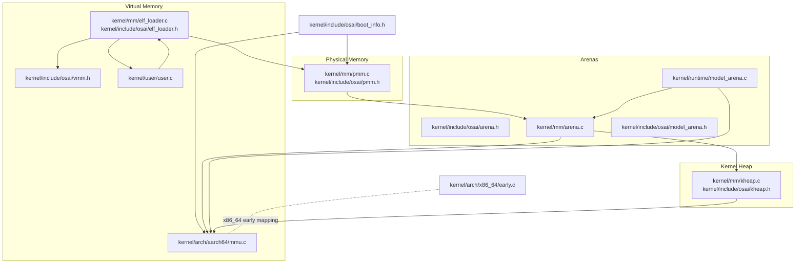
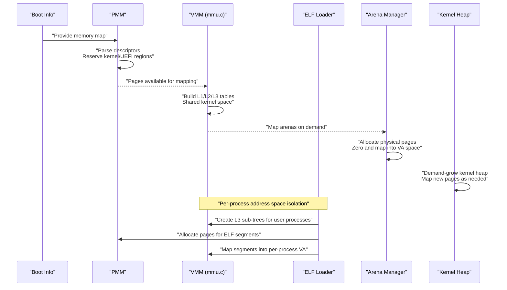
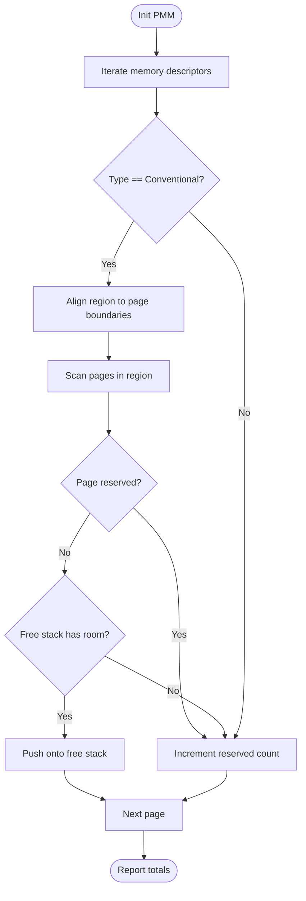
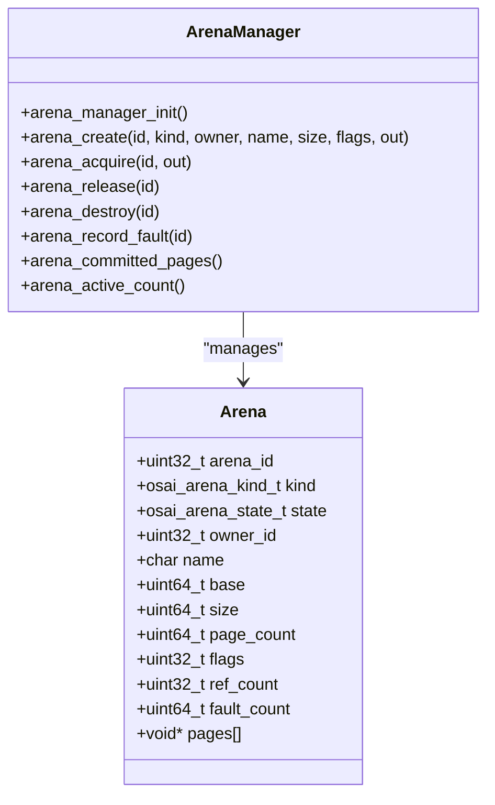
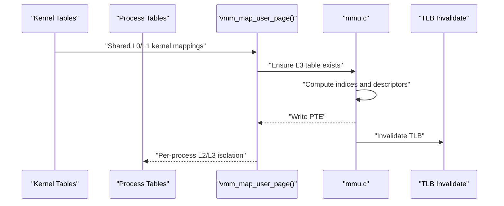
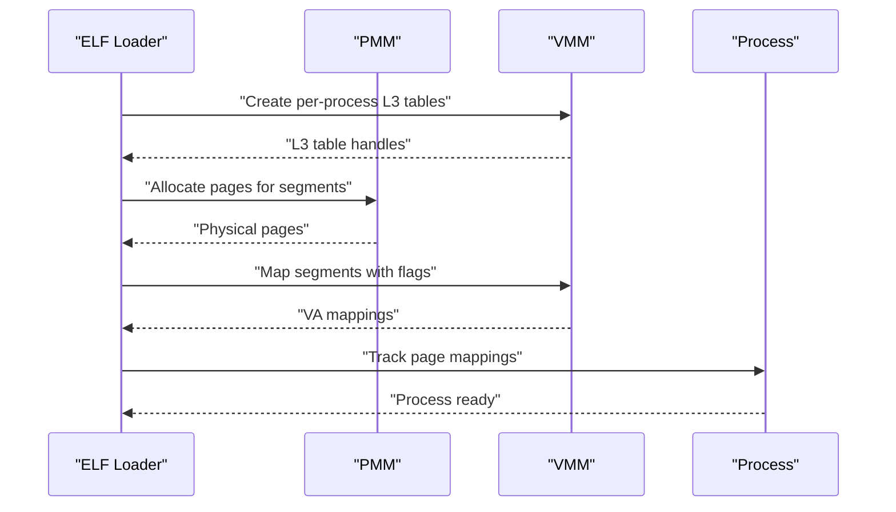
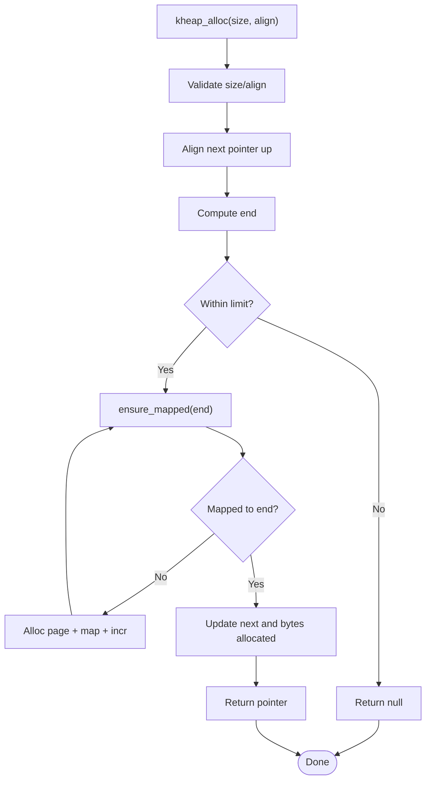
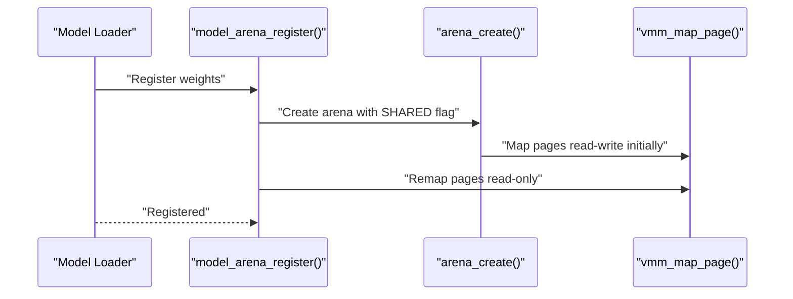
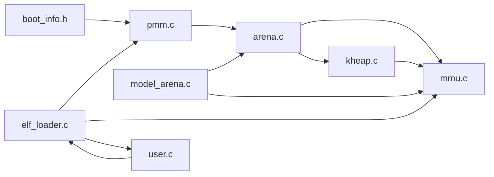
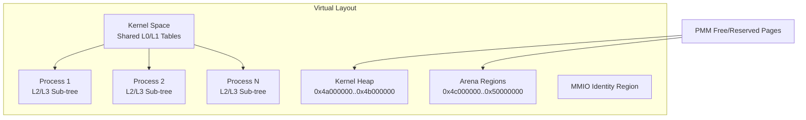

# Memory Management

<cite>
**Referenced Files in This Document**
- [pmm.h](file://kernel/include/osai/pmm.h)
- [pmm.c](file://kernel/mm/pmm.c)
- [vmm.h](file://kernel/include/osai/vmm.h)
- [mmu.c](file://kernel/arch/aarch64/mmu.c)
- [arena.h](file://kernel/include/osai/arena.h)
- [arena.c](file://kernel/mm/arena.c)
- [kheap.h](file://kernel/include/osai/kheap.h)
- [kheap.c](file://kernel/mm/kheap.c)
- [boot_info.h](file://kernel/include/osai/boot_info.h)
- [model_arena.h](file://kernel/include/osai/model_arena.h)
- [model_arena.c](file://kernel/runtime/model_arena.c)
- [cpu_ai_runtime.c](file://kernel/runtime/cpu_ai_runtime.c)
- [early.c](file://kernel/arch/x86_64/early.c)
- [elf_loader.h](file://kernel/include/osai/elf_loader.h)
- [elf_loader.c](file://kernel/mm/elf_loader.c)
- [user.c](file://kernel/user/user.c)
</cite>

## Update Summary
**Changes Made**
- Added comprehensive ELF loader implementation with address space isolation capabilities
- Integrated per-process L2/L3 page table sub-trees for user address spaces
- Enhanced VMM with user address space management functions
- Added process isolation infrastructure supporting shared L0/L1 kernel page table levels
- Updated memory management architecture to support multi-process memory isolation

## Table of Contents
1. [Introduction](#introduction)
2. [Project Structure](#project-structure)
3. [Core Components](#core-components)
4. [Architecture Overview](#architecture-overview)
5. [Detailed Component Analysis](#detailed-component-analysis)
6. [Dependency Analysis](#dependency-analysis)
7. [Performance Considerations](#performance-considerations)
8. [Troubleshooting Guide](#troubleshooting-guide)
9. [Conclusion](#conclusion)
10. [Appendices](#appendices)

## Introduction
This document explains OSAI's hybrid physical and virtual memory system with enhanced process isolation capabilities. It covers:
- Physical Memory Management (PMM): memory map parsing, allocation, and heap organization
- Arena allocator: efficient allocation patterns for kernel-managed regions
- Virtual Memory Management (VMM): page table management, address translation, protection, and process isolation
- Kernel heap: dynamic allocation with demand paging
- ELF loader: process address space isolation with per-process L2/L3 sub-trees
- AI runtime support: model weight sharing, KV cache, and inference execution
- Safety, fragmentation prevention, and debugging techniques

## Project Structure
OSAI organizes memory-related code by responsibility with enhanced process isolation:
- Physical memory: kernel/mm/pmm.c and kernel/include/osai/pmm.h
- Virtual memory: kernel/arch/aarch64/mmu.c and kernel/include/osai/vmm.h
- Kernel heap: kernel/mm/kheap.c and kernel/include/osai/kheap.h
- Arenas and model arenas: kernel/mm/arena.c, kernel/include/osai/arena.h, runtime/model_arena.c, runtime/include/osai/model_arena.h
- ELF loader: kernel/mm/elf_loader.c and kernel/include/osai/elf_loader.h
- Process management: kernel/user/user.c
- Boot info and x86_64 early mapping: include/osai/boot_info.h and arch/x86_64/early.c

**Diagram sources**
- [pmm.c:1-101](file://kernel/mm/pmm.c#L1-L101)
- [pmm.h:1-14](file://kernel/include/osai/pmm.h#L1-L14)
- [vmm.h:1-29](file://kernel/include/osai/vmm.h#L1-L29)
- [mmu.c:1-452](file://kernel/arch/aarch64/mmu.c#L1-L452)
- [kheap.c:1-114](file://kernel/mm/kheap.c#L1-L114)
- [kheap.h:1-14](file://kernel/include/osai/kheap.h#L1-L14)
- [arena.c:1-256](file://kernel/mm/arena.c#L1-L256)
- [arena.h:1-57](file://kernel/include/osai/arena.h#L1-L57)
- [model_arena.c:1-141](file://kernel/runtime/model_arena.c#L1-L141)
- [model_arena.h:1-28](file://kernel/include/osai/model_arena.h#L1-L28)
- [boot_info.h:1-34](file://kernel/include/osai/boot_info.h#L1-L34)
- [early.c:1-726](file://kernel/arch/x86_64/early.c#L1-L726)
- [elf_loader.c:1-291](file://kernel/mm/elf_loader.c#L1-L291)
- [elf_loader.h:1-30](file://kernel/include/osai/elf_loader.h#L1-L30)
- [user.c:274-302](file://kernel/user/user.c#L274-L302)

**Section sources**
- [pmm.h:1-14](file://kernel/include/osai/pmm.h#L1-L14)
- [pmm.c:1-101](file://kernel/mm/pmm.c#L1-L101)
- [vmm.h:1-29](file://kernel/include/osai/vmm.h#L1-L29)
- [mmu.c:1-452](file://kernel/arch/aarch64/mmu.c#L1-L452)
- [arena.h:1-57](file://kernel/include/osai/arena.h#L1-L57)
- [arena.c:1-256](file://kernel/mm/arena.c#L1-L256)
- [kheap.h:1-14](file://kernel/include/osai/kheap.h#L1-L14)
- [kheap.c:1-114](file://kernel/mm/kheap.c#L1-L114)
- [boot_info.h:1-34](file://kernel/include/osai/boot_info.h#L1-L34)
- [model_arena.h:1-28](file://kernel/include/osai/model_arena.h#L1-L28)
- [model_arena.c:1-141](file://kernel/runtime/model_arena.c#L1-L141)
- [early.c:1-726](file://kernel/arch/x86_64/early.c#L1-L726)
- [elf_loader.h:1-30](file://kernel/include/osai/elf_loader.h#L1-L30)
- [elf_loader.c:1-291](file://kernel/mm/elf_loader.c#L1-L291)
- [user.c:274-302](file://kernel/user/user.c#L274-L302)

## Core Components
- Physical Memory Manager (PMM): parses UEFI memory map, marks reserved regions, and provides page allocation/free.
- Virtual Memory Manager (VMM): initializes page tables, translates VA to PA, maps/unmaps pages, validates user buffers, enforces protection, and manages per-process address spaces.
- Arena Allocator: pre-allocates physical pages per arena, lazily faults on access, and supports shared read-only model weights.
- Kernel Heap: grows on-demand via demand paging with alignment-aware allocation.
- Model Arena: registers shared read-only model weights into arenas and exposes acquisition/release semantics.
- ELF Loader: loads ELF executables with complete address space isolation, creates per-process L2/L3 page table sub-trees, and manages process memory mappings.

**Updated** Enhanced with comprehensive process isolation capabilities including per-process address space management and shared kernel page table levels.

**Section sources**
- [pmm.c:41-77](file://kernel/mm/pmm.c#L41-L77)
- [mmu.c:335-339](file://kernel/arch/aarch64/mmu.c#L335-L339)
- [arena.c:102-155](file://kernel/mm/arena.c#L102-L155)
- [kheap.c:21-66](file://kernel/mm/kheap.c#L21-L66)
- [model_arena.c:54-84](file://kernel/runtime/model_arena.c#L54-L84)
- [elf_loader.c:168-201](file://kernel/mm/elf_loader.c#L168-L201)

## Architecture Overview
OSAI's memory architecture integrates early physical memory discovery with virtual memory mapping, kernel-managed allocators, and comprehensive process isolation.

**Diagram sources**
- [boot_info.h:20-31](file://kernel/include/osai/boot_info.h#L20-L31)
- [pmm.c:41-77](file://kernel/mm/pmm.c#L41-L77)
- [mmu.c:258-280](file://kernel/arch/aarch64/mmu.c#L258-L280)
- [arena.c:128-144](file://kernel/mm/arena.c#L128-L144)
- [kheap.c:29-46](file://kernel/mm/kheap.c#L29-L46)
- [elf_loader.c:179-182](file://kernel/mm/elf_loader.c#L179-L182)

## Detailed Component Analysis

### Physical Memory Management (PMM)
- Parses UEFI memory map to count total, free, and reserved pages.
- Skips kernel and boot-provided regions from the free pool.
- Provides stack-based LIFO page allocator with bounds checks.

Key behaviors:
- Memory map iteration with descriptor size and version fields
- Alignment helpers for region trimming
- Reserved-region detection for kernel and boot memory
- Stack-based free list with maximum capacity guard

**Diagram sources**
- [pmm.c:41-77](file://kernel/mm/pmm.c#L41-L77)
- [boot_info.h:11-18](file://kernel/include/osai/boot_info.h#L11-L18)

**Section sources**
- [pmm.c:41-77](file://kernel/mm/pmm.c#L41-L77)
- [boot_info.h:20-31](file://kernel/include/osai/boot_info.h#L20-L31)

### Arena Allocator Design
- Pre-allocates physical pages per arena and maps them contiguously into virtual address space.
- Supports arena kinds (model weights, KV cache, logs, telemetry) and flags (read-only, shared, prefaulted, user-visible).
- Tracks committed pages and active arenas for diagnostics.
- Enforces user vs supervisor mappings and write/read/exec permissions.

**Diagram sources**
- [arena.h:29-42](file://kernel/include/osai/arena.h#L29-L42)
- [arena.c:45-63](file://kernel/mm/arena.c#L45-L63)

Allocation pattern:
- On creation: allocate page pointers, allocate physical pages, zero, map into VA, set flags, increment counters.
- On destroy: unmap and free physical pages, reset state.
- Prefaulting ensures first access does not trigger faults.

**Section sources**
- [arena.c:102-155](file://kernel/mm/arena.c#L102-L155)
- [arena.c:177-194](file://kernel/mm/arena.c#L177-L194)
- [arena.c:204-210](file://kernel/mm/arena.c#L204-L210)

### Virtual Memory Management (VMM)
- Initializes early page tables with identity mapping for low RAM and kernel regions.
- Supports translating VA to PA, mapping/unmapping pages, and validating user buffers.
- Encodes protection attributes (present, writable, executable, user, device) into page table entries.
- **Enhanced** with per-process address space management including shared L0/L1 kernel levels and isolated L2/L3 user sub-trees.

**Diagram sources**
- [vmm.h:18-26](file://kernel/include/osai/vmm.h#L18-L26)
- [mmu.c:381-394](file://kernel/arch/aarch64/mmu.c#L381-L394)
- [mmu.c:246-256](file://kernel/arch/aarch64/mmu.c#L246-L256)

Protection mapping:
- Flags translate to ARM attributes (normal/device, RO/RW, PXN/UXN, AP_EL0).
- User vs supervisor mappings enforced by flags and address ranges.
- **Enhanced** with per-process L3 table isolation for user address spaces.

**Section sources**
- [mmu.c:187-206](file://kernel/arch/aarch64/mmu.c#L187-L206)
- [mmu.c:341-379](file://kernel/arch/aarch64/mmu.c#L341-L379)
- [mmu.c:408-431](file://kernel/arch/aarch64/mmu.c#L408-L431)

### ELF Loader and Process Isolation
- **New** Comprehensive ELF loader implementation with complete address space isolation.
- Creates per-process L2/L3 page table sub-trees for user address spaces.
- Loads ELF executables with PT_LOAD segments into isolated virtual address spaces.
- Manages process memory mappings with shared L0/L1 kernel page table levels.
- Supports stack mapping with guard pages and per-process memory tracking.

**Diagram sources**
- [elf_loader.c:168-201](file://kernel/mm/elf_loader.c#L168-L201)
- [elf_loader.c:118-166](file://kernel/mm/elf_loader.c#L118-L166)
- [elf_loader.c:240-278](file://kernel/mm/elf_loader.c#L240-L278)

Key features:
- Per-process address space structure with L3 table handles and page tracking
- ELF segment loading with proper validation and memory mapping
- Stack allocation with guard page unmapping and user mapping
- Comprehensive memory reclaim with both tracked and untracked pages
- Integration with user process management for seamless process creation

**Section sources**
- [elf_loader.h:12-28](file://kernel/include/osai/elf_loader.h#L12-L28)
- [elf_loader.c:168-201](file://kernel/mm/elf_loader.c#L168-L201)
- [elf_loader.c:118-166](file://kernel/mm/elf_loader.c#L118-L166)
- [elf_loader.c:203-238](file://kernel/mm/elf_loader.c#L203-L238)
- [elf_loader.c:240-278](file://kernel/mm/elf_loader.c#L240-L278)

### Kernel Heap
- Fixed virtual region with base and limit.
- Grows on demand by allocating and mapping new pages as allocations exceed current mapped length.
- Ensures alignment and validates requested sizes.

**Diagram sources**
- [kheap.c:48-66](file://kernel/mm/kheap.c#L48-L66)
- [kheap.c:29-46](file://kernel/mm/kheap.c#L29-L46)

**Section sources**
- [kheap.c:21-66](file://kernel/mm/kheap.c#L21-L66)
- [kheap.c:79-85](file://kernel/mm/kheap.c#L79-L85)

### Model Arena and AI Runtime Support
- Registers shared read-only model weights into a dedicated arena and remaps pages read-only.
- Exposes acquire/release semantics for shared usage across subsystems.
- CPU AI runtime binds to model arena and validates KV cache availability and sizing.

**Diagram sources**
- [model_arena.c:54-84](file://kernel/runtime/model_arena.c#L54-L84)
- [arena.c:102-155](file://kernel/mm/arena.c#L102-L155)
- [mmu.c:381-394](file://kernel/arch/aarch64/mmu.c#L381-L394)

**Section sources**
- [model_arena.c:54-84](file://kernel/runtime/model_arena.c#L54-L84)
- [model_arena.c:23-39](file://kernel/runtime/model_arena.c#L23-L39)
- [cpu_ai_runtime.c:408-444](file://kernel/runtime/cpu_ai_runtime.c#L408-L444)

### x86_64 Early Memory Mapping (Context)
- Demonstrates early identity mapping and NX enablement via MSRs and CR registers.
- Uses large pages for identity mapping and sets global and NX bits appropriately.

**Section sources**
- [early.c:398-432](file://kernel/arch/x86_64/early.c#L398-L432)
- [early.c:421-423](file://kernel/arch/x86_64/early.c#L421-L423)

## Dependency Analysis
- PMM depends on boot info to parse memory descriptors and avoid reserving kernel regions.
- VMM depends on PMM for physical pages and uses architecture-specific page table management.
- Arena manager depends on PMM for physical pages, VMM for mapping, and KHeap for internal allocations.
- Kernel heap depends on PMM and VMM for page provisioning.
- Model arena depends on arena manager and VMM to enforce read-only mappings.
- **Enhanced** ELF loader depends on PMM, VMM, and user process management for complete process isolation.

**Diagram sources**
- [boot_info.h:20-31](file://kernel/include/osai/boot_info.h#L20-L31)
- [pmm.c:41-77](file://kernel/mm/pmm.c#L41-L77)
- [arena.c:102-155](file://kernel/mm/arena.c#L102-L155)
- [kheap.c:29-46](file://kernel/mm/kheap.c#L29-L46)
- [model_arena.c:54-84](file://kernel/runtime/model_arena.c#L54-L84)
- [mmu.c:335-339](file://kernel/arch/aarch64/mmu.c#L335-L339)
- [elf_loader.c:168-201](file://kernel/mm/elf_loader.c#L168-L201)
- [user.c:274-302](file://kernel/user/user.c#L274-L302)

**Section sources**
- [pmm.c:41-77](file://kernel/mm/pmm.c#L41-L77)
- [arena.c:102-155](file://kernel/mm/arena.c#L102-L155)
- [kheap.c:29-46](file://kernel/mm/kheap.c#L29-L46)
- [model_arena.c:54-84](file://kernel/runtime/model_arena.c#L54-L84)
- [mmu.c:335-339](file://kernel/arch/aarch64/mmu.c#L335-L339)
- [elf_loader.c:168-201](file://kernel/mm/elf_loader.c#L168-L201)
- [user.c:274-302](file://kernel/user/user.c#L274-L302)

## Performance Considerations
- Arena preallocation reduces first-access latency and avoids frequent page faults during model inference.
- Demand paging in kernel heap minimizes footprint and avoids overcommit.
- Large-page identity mapping on x86_64 reduces TLB pressure; similar block mappings can be considered on ARM for hot paths.
- Prefaulting flags ensure predictable access behavior for shared model weights.
- Avoid repeated TLB invalidations by batching map/unmap operations where possible.
- **Enhanced** Per-process L3 table isolation provides efficient memory protection with minimal overhead.
- Shared L0/L1 kernel page table levels reduce memory usage and improve TLB hit rates across processes.

## Troubleshooting Guide
Common issues and diagnostics:
- Allocation failures: check free page counts and reserved regions; verify arena limits and VA stride.
- Protection violations: confirm VMM flags and user/supervisor mappings; ensure read-only remapping for model weights.
- User buffer validation errors: ensure addresses fall within user range and required flags are present.
- Self-tests: use arena and VMM self-test routines to validate mappings and protections.
- **New** Process isolation issues: verify per-process L3 table creation and memory tracking; check ELF loader error codes.
- **New** Memory reclaim problems: ensure proper page untracking and L3 table destruction in ELF loader.

**Section sources**
- [pmm.c:79-100](file://kernel/mm/pmm.c#L79-L100)
- [arena.c:212-255](file://kernel/mm/arena.c#L212-L255)
- [mmu.c:433-451](file://kernel/arch/aarch64/mmu.c#L433-L451)
- [kheap.c:87-113](file://kernel/mm/kheap.c#L87-L113)
- [elf_loader.c:280-291](file://kernel/mm/elf_loader.c#L280-L291)

## Conclusion
OSAI's memory system combines a simple yet robust PMM with flexible VMM and kernel-managed allocators, now enhanced with comprehensive process isolation capabilities. The new ELF loader provides complete address space isolation through per-process L2/L3 page table sub-trees while maintaining shared L0/L1 kernel page table levels for efficiency. Arenas provide predictable, shared regions for AI workloads, while the kernel heap offers efficient dynamic allocation. Together, these components support large model loading, inference execution, and secure multi-process memory management with strong safety guarantees and minimal fragmentation.

## Appendices

### Memory Layout Diagrams
- Virtual layout highlights user space, kernel heap, arena regions, MMIO areas, and per-process L3 table isolation.
- Physical layout shows PMM's free/reserved page accounting and arena page arrays.

**Diagram sources**
- [elf_loader.h:12-18](file://kernel/include/osai/elf_loader.h#L12-L18)
- [mmu.c:258-280](file://kernel/arch/aarch64/mmu.c#L258-L280)

### Memory Safety and Fragmentation Prevention
- Strict flag enforcement prevents accidental write/exec combinations.
- Arena refcounts and destruction guards prevent premature deallocation.
- Prefaulting and read-only remapping reduce unexpected faults and protect model weights.
- Demand paging caps footprint and avoids fragmentation by mapping only what is used.
- **Enhanced** Per-process address space isolation prevents memory leaks and security violations between processes.
- Shared kernel page table levels ensure consistent kernel access while maintaining user process isolation.