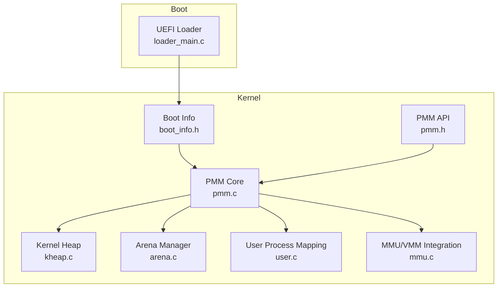
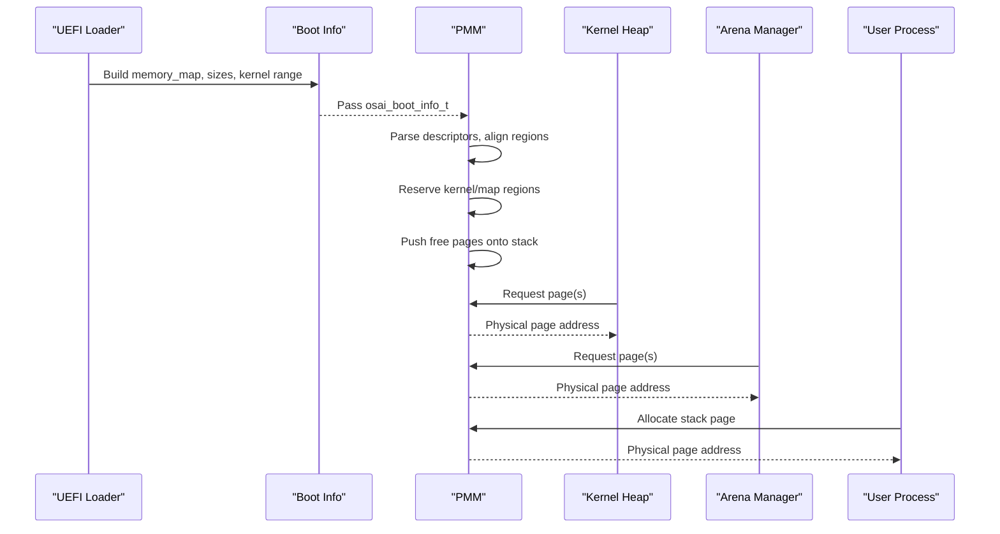
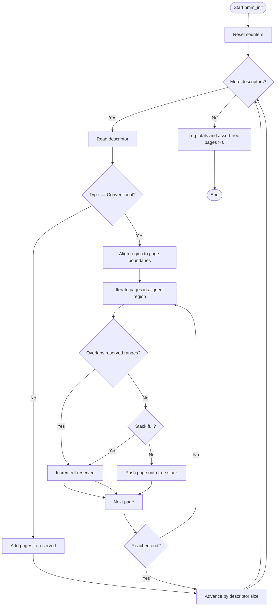
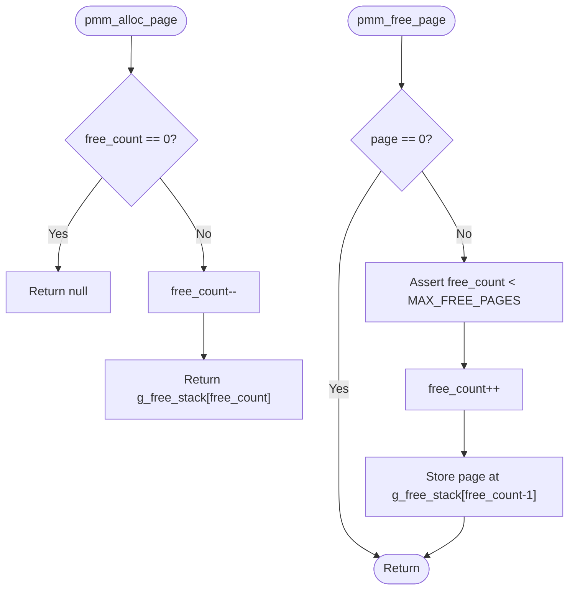
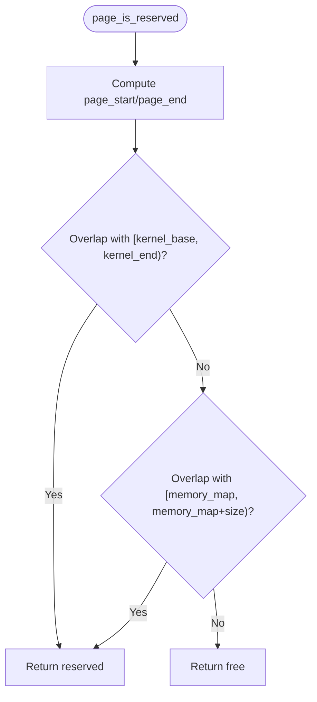
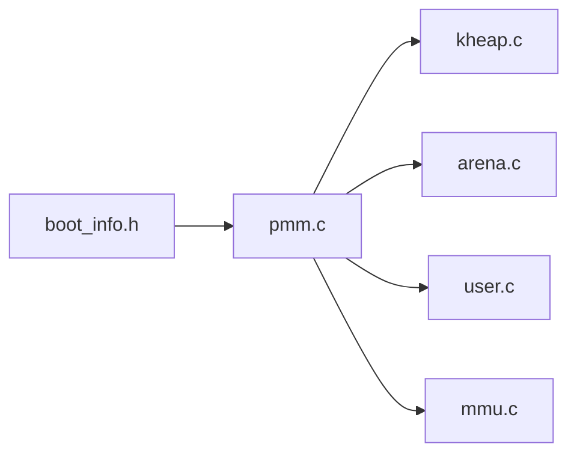

# Physical Memory Management (PMM)

<cite>
**Referenced Files in This Document**
- [pmm.c](file://kernel/mm/pmm.c)
- [pmm.h](file://kernel/include/osai/pmm.h)
- [boot_info.h](file://kernel/include/osai/boot_info.h)
- [loader_main.c](file://boot/uefi/loader_main.c)
- [user.c](file://kernel/user/user.c)
- [kheap.c](file://kernel/mm/kheap.c)
- [mmu.c](file://kernel/arch/aarch64/mmu.c)
- [assert.h](file://kernel/include/osai/assert.h)
- [panic.h](file://kernel/include/osai/panic.h)
- [arena.c](file://kernel/mm/arena.c)
</cite>

## Table of Contents
1. [Introduction](#introduction)
2. [Project Structure](#project-structure)
3. [Core Components](#core-components)
4. [Architecture Overview](#architecture-overview)
5. [Detailed Component Analysis](#detailed-component-analysis)
6. [Dependency Analysis](#dependency-analysis)
7. [Performance Considerations](#performance-considerations)
8. [Troubleshooting Guide](#troubleshooting-guide)
9. [Conclusion](#conclusion)

## Introduction
This document describes OSAI’s Physical Memory Management (PMM) subsystem. It explains how the kernel parses the UEFI memory map to identify available RAM regions, how it reserves critical areas (kernel, bootloader, firmware), and how it maintains a LIFO stack of free pages for efficient allocation and deallocation. It also documents memory alignment utilities, overlap detection, bounds checking, and memory statistics. Finally, it outlines integration points with higher-level allocators and virtual memory management.

## Project Structure
The PMM system spans several modules:
- Boot-time UEFI memory map extraction and boot info packaging
- PMM initialization and page stack management
- Integration with Virtual Memory Management (VMM) and higher-level allocators (kernel heap, arenas)
- User-space process mapping and reclaim flows

**Diagram sources**
- [loader_main.c](file://boot/uefi/loader_main.c)
- [boot_info.h](file://kernel/include/osai/boot_info.h)
- [pmm.c](file://kernel/mm/pmm.c)
- [pmm.h](file://kernel/include/osai/pmm.h)
- [kheap.c](file://kernel/mm/kheap.c)
- [arena.c](file://kernel/mm/arena.c)
- [user.c](file://kernel/user/user.c)
- [mmu.c](file://kernel/arch/aarch64/mmu.c)

**Section sources**
- [loader_main.c](file://boot/uefi/loader_main.c)
- [boot_info.h](file://kernel/include/osai/boot_info.h)
- [pmm.c](file://kernel/mm/pmm.c)
- [pmm.h](file://kernel/include/osai/pmm.h)

## Core Components
- Memory map parser: Iterates UEFI memory descriptors, filters conventional memory, and computes aligned page ranges.
- Reservation logic: Excludes kernel and memory map regions from the free pool.
- Page stack: LIFO stack of free pages with bounds checking and overflow protection.
- Alignment utilities: Helper routines to align addresses up/down to page boundaries.
- Overlap detection: Determines whether a candidate page overlaps with reserved regions.
- Statistics: Tracks total pages, free pages, and reserved pages.
- Safety mechanisms: Assertions and logging for correctness and diagnostics.

Key APIs exposed by PMM:
- Initialization: consumes boot info and builds free page stack
- Allocation: single-page LIFO pop
- Deallocation: single-page LIFO push
- Stats: total/free/reserved counts

**Section sources**
- [pmm.c](file://kernel/mm/pmm.c)
- [pmm.h](file://kernel/include/osai/pmm.h)

## Architecture Overview
The PMM initialization consumes a UEFI-provided memory map and transforms it into a compact free page stack. Allocation and deallocation are O(1) LIFO operations. Higher-level components (kernel heap, arenas, user processes) allocate pages via PMM and later free them back.

**Diagram sources**
- [loader_main.c](file://boot/uefi/loader_main.c)
- [boot_info.h](file://kernel/include/osai/boot_info.h)
- [pmm.c](file://kernel/mm/pmm.c)
- [kheap.c](file://kernel/mm/kheap.c)
- [arena.c](file://kernel/mm/arena.c)
- [user.c](file://kernel/user/user.c)

## Detailed Component Analysis

### Memory Map Parsing and Reservation
- Input: UEFI memory map pointer and metadata from the boot info structure.
- Descriptor iteration: Walks the memory map using the descriptor size and total size.
- Conventional memory filtering: Only considers pages whose type matches the conventional memory type constant.
- Alignment: Aligns region start up and end down to page boundaries to ensure whole pages.
- Reservation: Pages overlapping kernel physical range or the memory map itself are marked reserved.
- Free stack population: Pages that pass reservation checks are pushed onto the free stack until the maximum capacity is reached.

**Diagram sources**
- [pmm.c](file://kernel/mm/pmm.c)
- [boot_info.h](file://kernel/include/osai/boot_info.h)

**Section sources**
- [pmm.c](file://kernel/mm/pmm.c)
- [boot_info.h](file://kernel/include/osai/boot_info.h)

### Page Allocation Strategy (LIFO Stack)
- Allocation: Pop from the top of the free stack. Returns null if empty.
- Deallocation: Push a freed page back onto the stack after asserting capacity.
- Complexity: O(1) amortized for both operations.
- Thread-safety: Not synchronized; intended for single-threaded early kernel stages or protected contexts.

**Diagram sources**
- [pmm.c](file://kernel/mm/pmm.c)

**Section sources**
- [pmm.c](file://kernel/mm/pmm.c)

### Memory Reservation Logic
- Kernel exclusion: Any page overlapping the kernel physical base-to-end range is reserved.
- Firmware/bootloader exclusion: Any page overlapping the memory map region is reserved.
- Overlap detection: Uses interval overlap logic to test whether two half-open ranges intersect.

**Diagram sources**
- [pmm.c](file://kernel/mm/pmm.c)
- [boot_info.h](file://kernel/include/osai/boot_info.h)

**Section sources**
- [pmm.c](file://kernel/mm/pmm.c)
- [boot_info.h](file://kernel/include/osai/boot_info.h)

### Page Alignment Utilities and Overlap Detection
- Alignment helpers: Round up and round down to the nearest page boundary.
- Overlap predicate: Interval overlap test for two ranges.

These utilities ensure that only whole, properly aligned pages are considered for allocation.

**Section sources**
- [pmm.c](file://kernel/mm/pmm.c)

### Free Page Stack Implementation and Bounds Checking
- Static array-backed stack with a fixed maximum capacity.
- Bounds checks prevent underflow on pop and overflow on push.
- Overflow protection: When the stack is full, additional pages are treated as reserved rather than pushed.

**Section sources**
- [pmm.c](file://kernel/mm/pmm.c)

### Memory Statistics Tracking
- Total pages: Count of all pages encountered during parsing.
- Free pages: Current size of the free stack.
- Reserved pages: Pages excluded due to reservation rules.

These metrics are logged during initialization and can be queried via dedicated accessor functions.

**Section sources**
- [pmm.c](file://kernel/mm/pmm.c)
- [pmm.h](file://kernel/include/osai/pmm.h)

### Memory Safety Mechanisms and Debugging
- Assertions: Used to catch invariant violations (e.g., free stack underflow, overflow, zero free pages after initialization).
- Panic on assertion failure: Ensures immediate detection of memory management errors.
- Logging: Initialization logs total/free/reserved page counts for visibility.

Integration points:
- Kernel heap relies on PMM for backing pages and asserts on successful mapping.
- Arena manager allocates per-page buffers and maps them via VMM, freeing pages on teardown.
- User processes allocate stack pages via PMM and map them into virtual memory.

**Section sources**
- [pmm.c](file://kernel/mm/pmm.c)
- [assert.h](file://kernel/include/osai/assert.h)
- [panic.h](file://kernel/include/osai/panic.h)
- [kheap.c](file://kernel/mm/kheap.c)
- [arena.c](file://kernel/mm/arena.c)
- [user.c](file://kernel/user/user.c)

### Integration with Virtual Memory Management
- VMM maps a returned physical page to a virtual address with appropriate flags.
- Translation and unmap operations validate page presence and attributes.
- PMM pages are used to back kernel heap, arenas, and user stacks.

**Section sources**
- [kheap.c](file://kernel/mm/kheap.c)
- [arena.c](file://kernel/mm/arena.c)
- [user.c](file://kernel/user/user.c)
- [mmu.c](file://kernel/arch/aarch64/mmu.c)

## Dependency Analysis
PMM depends on:
- Boot info structure containing UEFI memory map and kernel range.
- Alignment and overlap utilities (implemented inline).
- Assertions and panic for safety.

It is consumed by:
- Kernel heap allocator for dynamic allocations.
- Arena manager for committed pages.
- User process mapper for stack pages.
- VMM for virtual-to-physical mapping.

**Diagram sources**
- [boot_info.h](file://kernel/include/osai/boot_info.h)
- [pmm.c](file://kernel/mm/pmm.c)
- [kheap.c](file://kernel/mm/kheap.c)
- [arena.c](file://kernel/mm/arena.c)
- [user.c](file://kernel/user/user.c)
- [mmu.c](file://kernel/arch/aarch64/mmu.c)

**Section sources**
- [pmm.c](file://kernel/mm/pmm.c)
- [boot_info.h](file://kernel/include/osai/boot_info.h)
- [kheap.c](file://kernel/mm/kheap.c)
- [arena.c](file://kernel/mm/arena.c)
- [user.c](file://kernel/user/user.c)
- [mmu.c](file://kernel/arch/aarch64/mmu.c)

## Performance Considerations
- Allocation/deallocation: O(1) time with minimal overhead.
- Memory map parsing: Linear in the number of descriptors; alignment and reservation checks are constant-time per page.
- Stack capacity: Fixed upper bound prevents unbounded growth but may reserve otherwise free pages if exhausted.
- Cache locality: Pages are pushed and popped from a contiguous array, yielding good cache behavior.

[No sources needed since this section provides general guidance]

## Troubleshooting Guide
Common issues and diagnostics:
- No free pages after initialization: Indicates reservation of all conventional pages or parsing failure. Check kernel range and memory map coverage.
- Allocation returns null: Indicates free stack exhaustion; consider expanding capacity or reducing usage.
- Panic on free: Indicates double-free or invalid pointer; verify caller logic.
- Logging: Review PMM initialization logs for total/free/reserved page counts to validate assumptions.

Remediation steps:
- Verify UEFI memory map completeness and descriptor size/version compatibility.
- Confirm kernel physical range and memory map region boundaries.
- Ensure proper VMM mapping/unmapping around PMM allocations.

**Section sources**
- [pmm.c](file://kernel/mm/pmm.c)
- [assert.h](file://kernel/include/osai/assert.h)
- [panic.h](file://kernel/include/osai/panic.h)

## Conclusion
OSAI’s PMM provides a compact, efficient, and safe foundation for physical memory allocation. By parsing the UEFI memory map, reserving critical regions, and maintaining a LIFO free page stack, it enables predictable performance and strong safety guarantees. Its integration with VMM, kernel heap, arenas, and user processes forms a cohesive memory subsystem suitable for early-stage kernel operation and beyond.