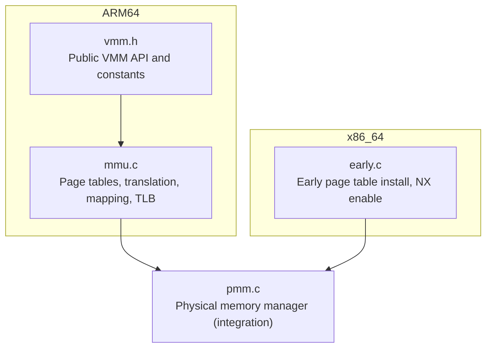
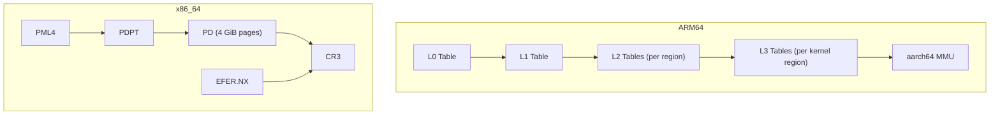
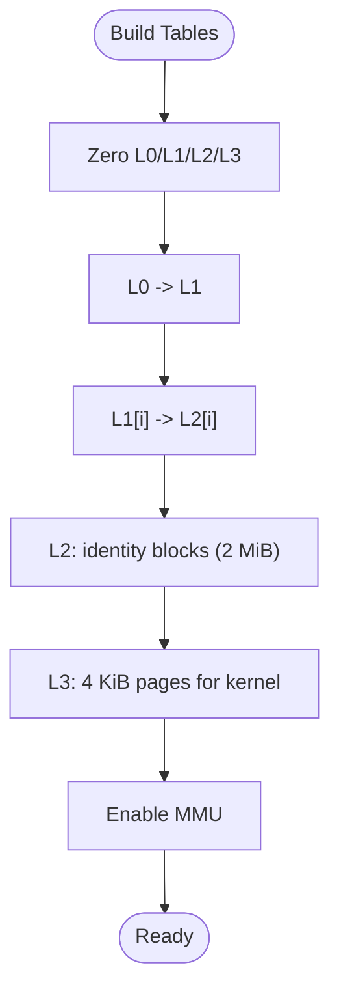
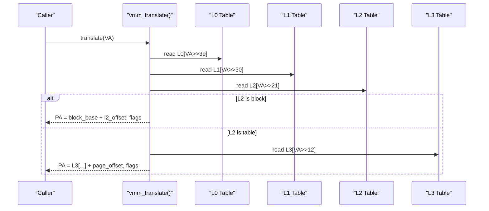
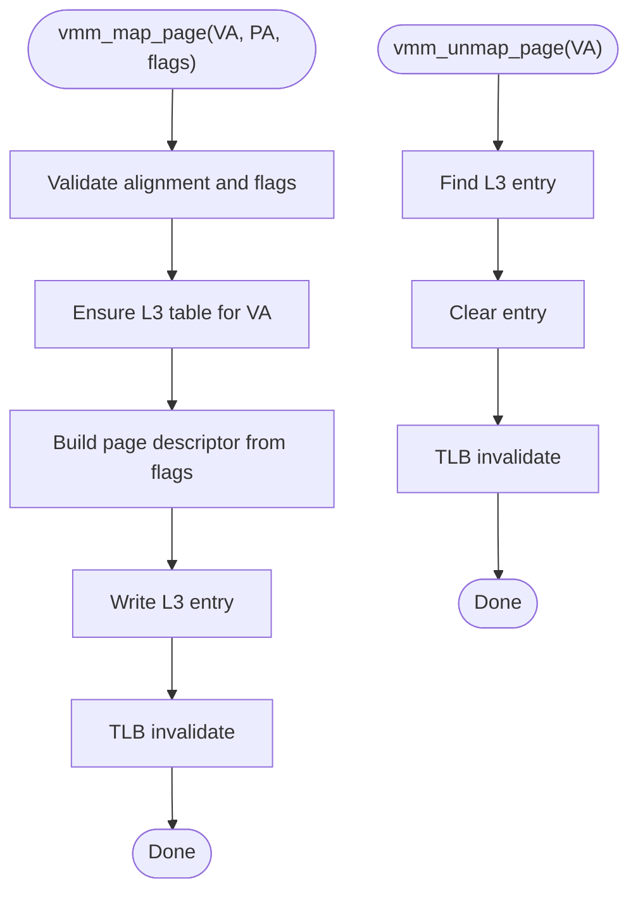
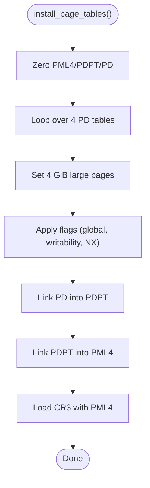
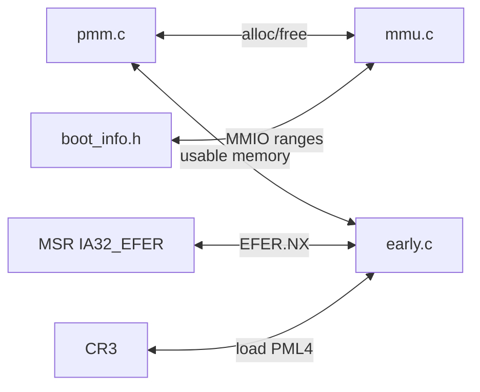

# Virtual Memory Management (VMM)

<cite>
**Referenced Files in This Document**
- [mmu.c](file://kernel/arch/aarch64/mmu.c)
- [vmm.h](file://kernel/include/osai/vmm.h)
- [early.c](file://kernel/arch/x86_64/early.c)
</cite>

## Table of Contents
1. [Introduction](#introduction)
2. [Project Structure](#project-structure)
3. [Core Components](#core-components)
4. [Architecture Overview](#architecture-overview)
5. [Detailed Component Analysis](#detailed-component-analysis)
6. [Dependency Analysis](#dependency-analysis)
7. [Performance Considerations](#performance-considerations)
8. [Troubleshooting Guide](#troubleshooting-guide)
9. [Conclusion](#conclusion)

## Introduction
This document describes the Virtual Memory Management (VMM) subsystem of OSAI with a focus on the architecture-specific Memory Management Unit (MMU) implementations for ARM64 and x86_64. It explains page table management across level-1, level-2, and level-3 tables on ARM64, address translation from virtual-to-physical, memory protection attributes, and the initialization and TLB management procedures. It also covers identity mapping, kernel/user space separation, integration with physical memory management, and practical guidance for performance, TLB shootdown, and debugging.

## Project Structure
The VMM implementation is split by architecture:
- ARM64: Page tables and translation logic are implemented in a dedicated MMU module.
- x86_64: Early-stage page table installation and NX enablement are handled in the early boot module.

**Diagram sources**
- [mmu.c](file://kernel/arch/aarch64/mmu.c)
- [vmm.h](file://kernel/include/osai/vmm.h)
- [early.c](file://kernel/arch/x86_64/early.c)

**Section sources**
- [mmu.c](file://kernel/arch/aarch64/mmu.c)
- [vmm.h](file://kernel/include/osai/vmm.h)
- [early.c](file://kernel/arch/x86_64/early.c)

## Core Components
- Public VMM interface and constants:
  - Flags for present, writable, executable, device, and user mappings.
  - User-space address range boundaries and stack top.
  - Function prototypes for initialization, translation, mapping, unmapping, buffer validation, and self-test.
- ARM64 MMU implementation:
  - Static page table arrays for L0/L1/L2/L3 levels.
  - Helper routines for alignment, zeroing, and descriptor construction.
  - Identity mapping via L2 blocks and kernel page mapping via L3 pages.
  - Translation, mapping, unmapping, and user buffer validation.
  - TLB invalidation and MMU enablement.
- x86_64 early boot:
  - PML4/PDPT/PD setup with large-page identity mappings.
  - NX bit enablement via EFER MSR and CR3 load.

**Section sources**
- [vmm.h](file://kernel/include/osai/vmm.h)
- [mmu.c](file://kernel/arch/aarch64/mmu.c)
- [early.c](file://kernel/arch/x86_64/early.c)

## Architecture Overview
OSAI implements a unified VMM API with architecture-specific backends:
- ARM64 uses a four-level page table hierarchy (L0–L3) with identity mapping and per-region L3 tables for kernel pages.
- x86_64 uses a four-level paging hierarchy (PML4/PDPT/PD/PTE) with large pages for identity mapping and NX enforcement.

**Diagram sources**
- [mmu.c](file://kernel/arch/aarch64/mmu.c)
- [early.c](file://kernel/arch/x86_64/early.c)

## Detailed Component Analysis

### ARM64 VMM Implementation

#### Page Table Hierarchy and Identity Mapping
- Level-1 (L0): Root pointer to L1.
- Level-2 (L1): One or more L2 tables covering distinct regions.
- Level-3 (L2/L3): L2 holds either L3 pointers or block descriptors; L3 holds 4 KiB page descriptors.
- Identity mapping:
  - L2 blocks cover 2 MiB regions; used for identity mapping kernel and device regions.
  - Kernel pages are mapped via preallocated L3 tables per region.
- Device vs normal memory:
  - Device memory uses device memory attributes; normal memory uses normal cacheable attributes.

**Diagram sources**
- [mmu.c](file://kernel/arch/aarch64/mmu.c)

**Section sources**
- [mmu.c](file://kernel/arch/aarch64/mmu.c)

#### Address Translation (Virtual to Physical)
Translation follows the four-level hierarchy:
- Extract indices for L0/L1/L2/L3.
- Traverse descriptors, handling both table pointers and block descriptors.
- Compute physical address from either block base or page table entry plus offset.
- Convert descriptor attributes to VMM flags (present, device, writable, executable, user).

**Diagram sources**
- [mmu.c](file://kernel/arch/aarch64/mmu.c)

**Section sources**
- [mmu.c](file://kernel/arch/aarch64/mmu.c)

#### Page Mapping and Unmapping
- Mapping:
  - Ensure L3 table exists for the VA’s region.
  - Build page descriptor from physical address and attributes derived from VMM flags.
  - Invalidate TLB for the VA.
- Unmapping:
  - Locate L3 entry and clear it.
  - Invalidate TLB for the VA.

**Diagram sources**
- [mmu.c](file://kernel/arch/aarch64/mmu.c)

**Section sources**
- [mmu.c](file://kernel/arch/aarch64/mmu.c)

#### Memory Protection Attributes
- Privilege and access:
  - User bit sets AP_EL0 to allow EL0 access.
  - Read-only bit sets AP_RO to restrict writes.
- Execute-protection:
  - Privileged executable requires PXN cleared for kernel.
  - User executable requires UXN cleared for user mappings.
- Cacheability and device memory:
  - Device memory uses device attributes; normal memory uses normal cacheable attributes with inner-shareable cache policy.

**Section sources**
- [mmu.c](file://kernel/arch/aarch64/mmu.c)

#### TLB Management and Cache Coherency
- Per-page TLB invalidation uses VMALL indices to ensure correctness after mapping/unmapping.
- Instruction synchronization barrier ensures subsequent instruction fetches see updated translations.

**Section sources**
- [mmu.c](file://kernel/arch/aarch64/mmu.c)

#### Public API and Constants
- VMM flags and user address boundaries are exposed via the public header.
- Self-test validates mapping, translation, and user buffer validation.

**Section sources**
- [vmm.h](file://kernel/include/osai/vmm.h)
- [mmu.c](file://kernel/arch/aarch64/mmu.c)

### x86_64 VMM Implementation

#### Early Page Table Installation
- Initialize PML4 and PDPT.
- Populate PD with 4 GiB large pages covering low-memory regions.
- Set global and writability flags; mark higher regions non-writable.
- Load CR3 with PML4 base.

**Diagram sources**
- [early.c](file://kernel/arch/x86_64/early.c)

**Section sources**
- [early.c](file://kernel/arch/x86_64/early.c)

#### NX Bit and Execute-Protection
- Enable NX capability by setting EFER.NX via MSR.
- Apply NX flag to non-kernel mappings to prevent execution.

**Section sources**
- [early.c](file://kernel/arch/x86_64/early.c)

## Dependency Analysis
- ARM64 VMM depends on:
  - Physical memory manager for allocating L3 page tables during mapping.
  - Boot info for MMIO range detection and identity mapping decisions.
- x86_64 VMM depends on:
  - Physical memory manager for usable memory parsing and early identity mapping.
  - CPU MSRs and CR registers for enabling NX and loading page tables.

**Diagram sources**
- [mmu.c](file://kernel/arch/aarch64/mmu.c)
- [early.c](file://kernel/arch/x86_64/early.c)

**Section sources**
- [mmu.c](file://kernel/arch/aarch64/mmu.c)
- [early.c](file://kernel/arch/x86_64/early.c)

## Performance Considerations
- Prefer large pages (2 MiB or 4 GiB) for identity and kernel mappings to reduce TLB pressure and translation overhead.
- Minimize TLB flushes by batching updates and using targeted invalidation where supported.
- Keep kernel page tables localized to reduce cross-core TLB shootdown costs.
- Avoid unnecessary re-mapping; reuse existing L3 tables when extending kernel regions.

## Troubleshooting Guide
- Translation failures:
  - Verify that the corresponding L0/L1/L2/L3 entries are valid and properly linked.
  - Confirm that block vs table entries are handled correctly during traversal.
- Mapping errors:
  - Ensure VA/PA alignment and presence flag are set.
  - Confirm L3 table allocation succeeded and was initialized to zeros.
- TLB-related faults:
  - After mapping/unmapping, issue TLB invalidation before resuming execution.
  - Use instruction synchronization barriers to ensure instruction fetches observe new mappings.
- User buffer validation:
  - Validate user buffers against configured user limits and required permission flags.
- Self-tests:
  - Use the built-in self-test to verify basic mapping/unmapping and flag propagation.

**Section sources**
- [mmu.c](file://kernel/arch/aarch64/mmu.c)
- [vmm.h](file://kernel/include/osai/vmm.h)

## Conclusion
OSAI’s VMM provides architecture-specific implementations tailored to ARM64 and x86_64. On ARM64, a four-level page table hierarchy supports identity mapping, kernel/user separation, and strict execute-protection via UXN/PXN. On x86_64, early boot installs large-page identity mappings and enables NX via EFER. Both backends integrate with the physical memory manager and expose a unified VMM API for safe, controlled virtual-to-physical translation and protection.