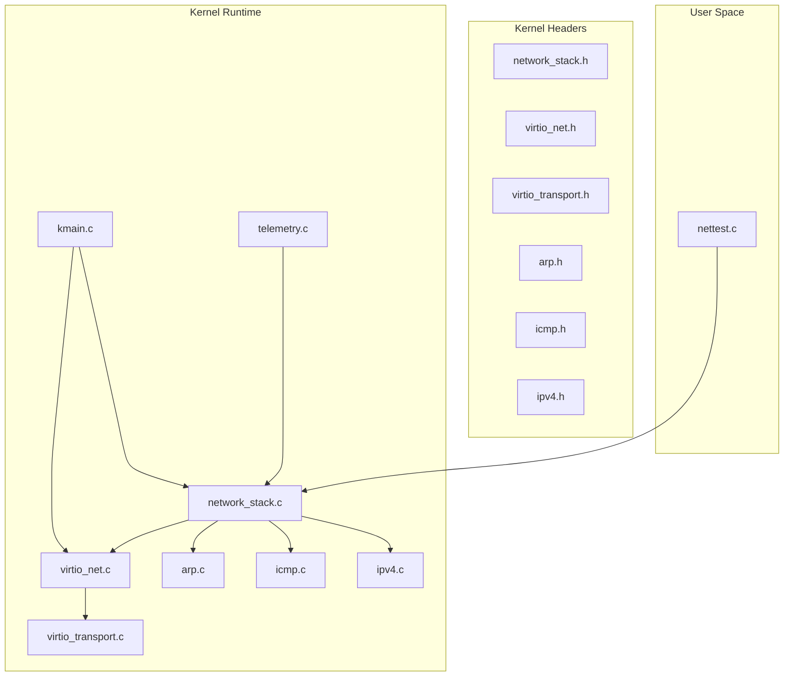
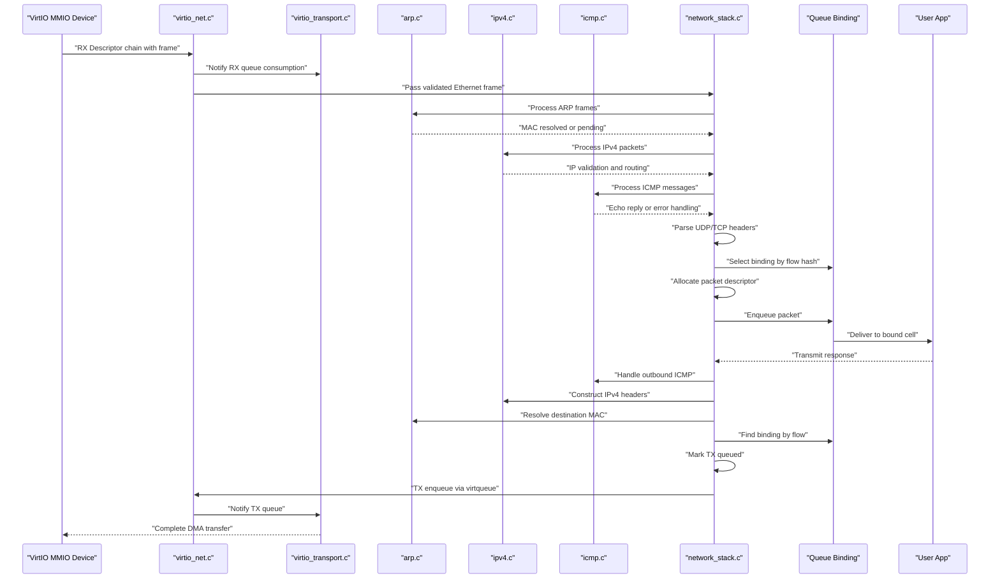
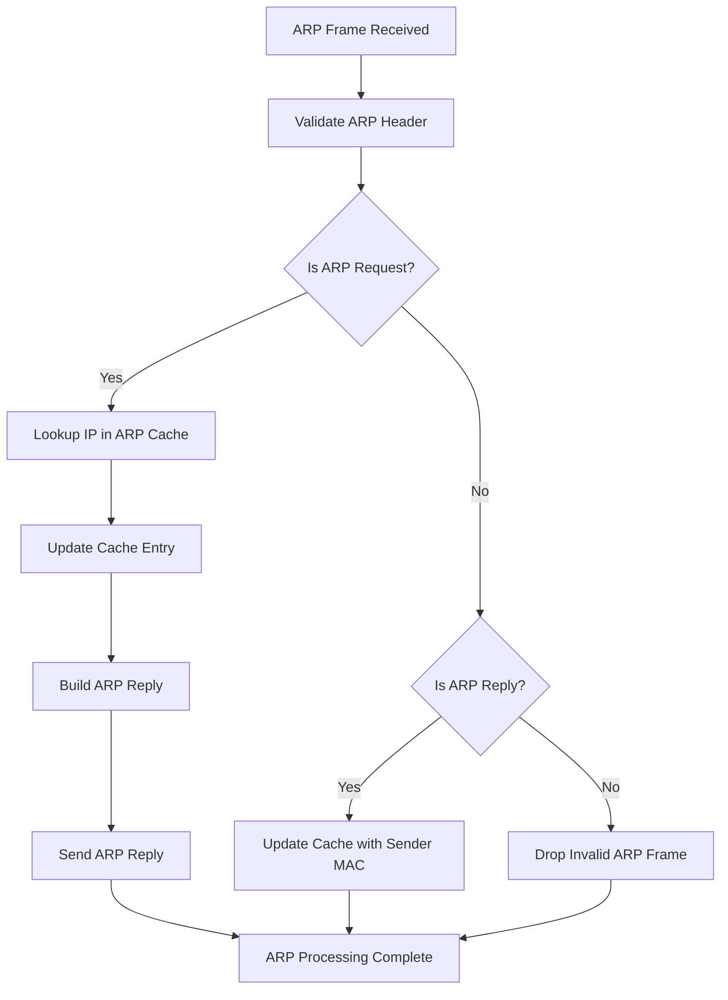
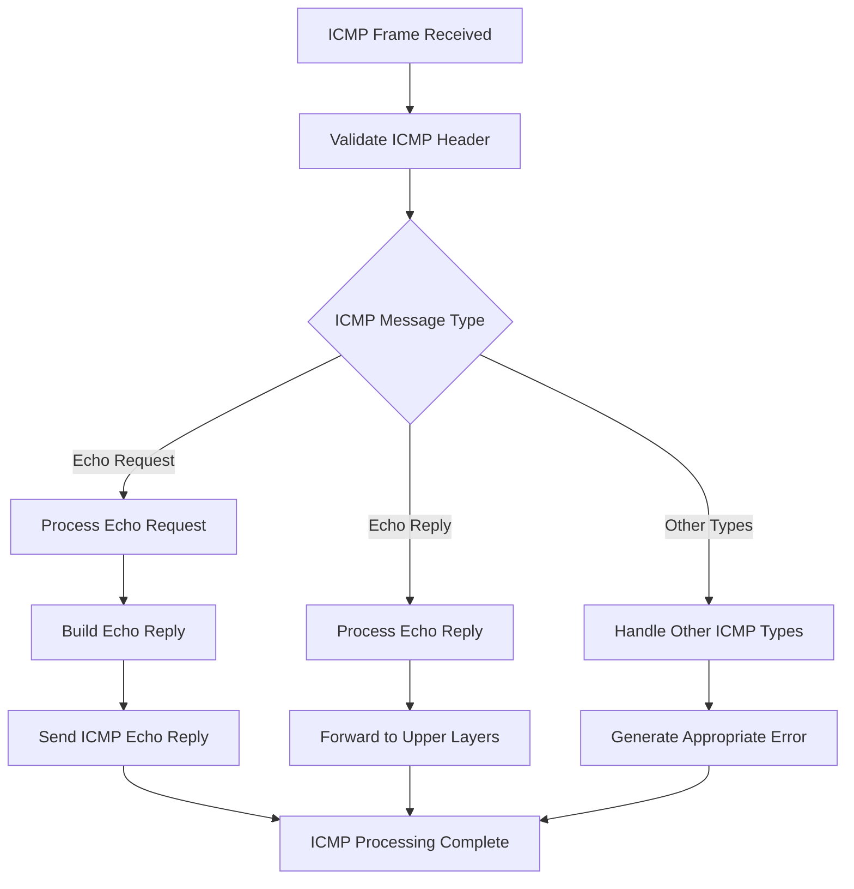
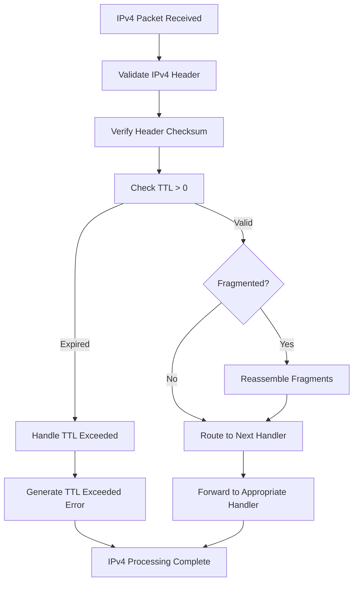
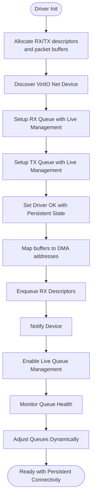
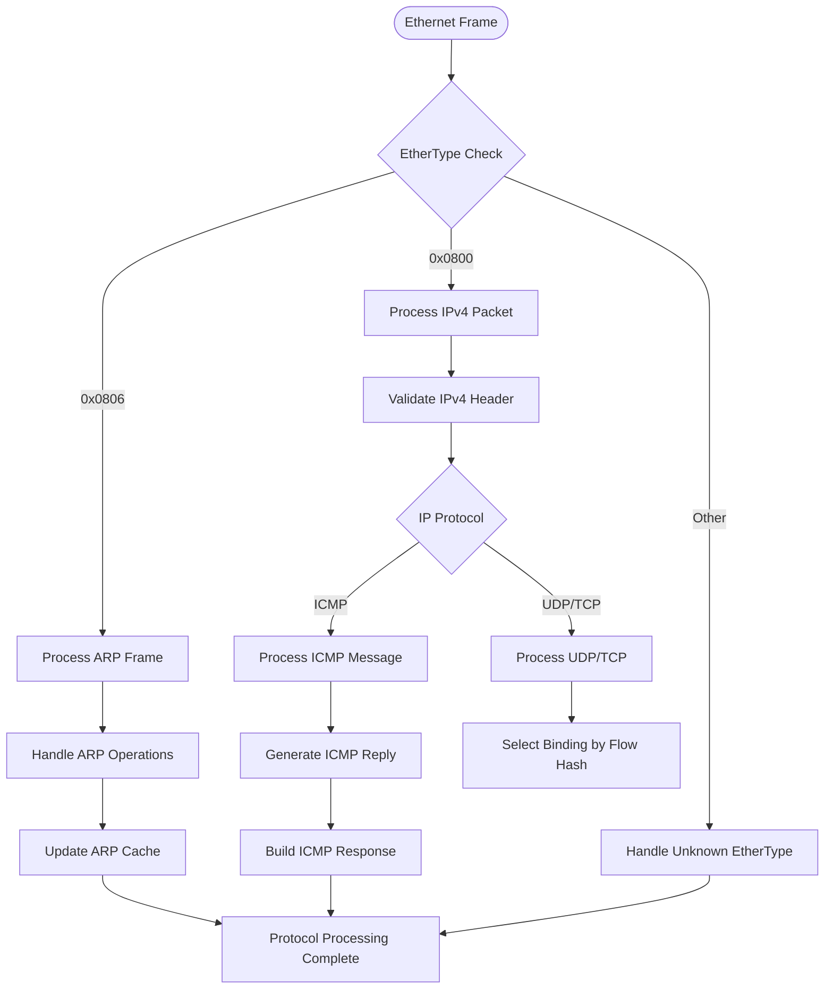
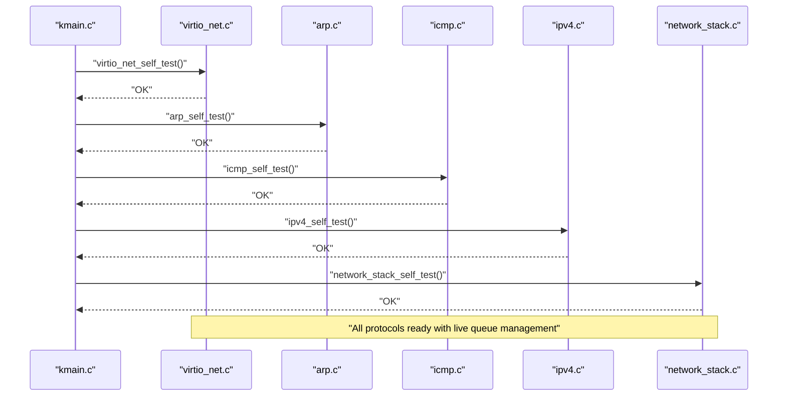
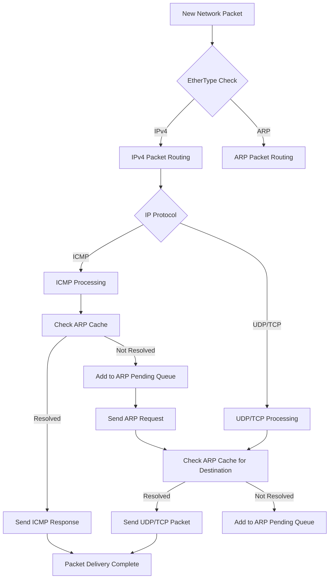
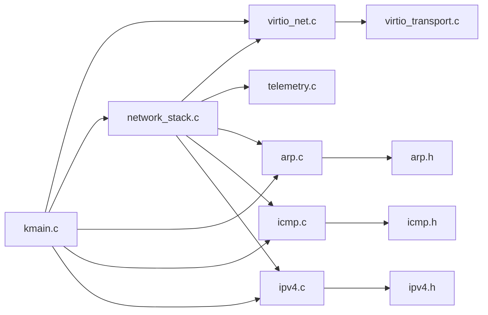

# Network Stack Implementation

<cite>
**Referenced Files in This Document**
- [kernel/include/osai/network_stack.h](file://kernel/include/osai/network_stack.h)
- [kernel/runtime/network_stack.c](file://kernel/runtime/network_stack.c)
- [kernel/dev/virtio/virtio_net.c](file://kernel/dev/virtio/virtio_net.c)
- [kernel/include/osai/virtio_net.h](file://kernel/include/osai/virtio_net.h)
- [kernel/dev/virtio/virtio_transport.c](file://kernel/dev/virtio/virtio_transport.c)
- [kernel/include/osai/virtio_transport.h](file://kernel/include/osai/virtio_transport.h)
- [kernel/net/arp.c](file://kernel/net/arp.c)
- [kernel/net/icmp.c](file://kernel/net/icmp.c)
- [kernel/net/ipv4.c](file://kernel/net/ipv4.c)
- [kernel/include/osai/arp.h](file://kernel/include/osai/arp.h)
- [kernel/include/osai/icmp.h](file://kernel/include/osai/icmp.h)
- [kernel/include/osai/ipv4.h](file://kernel/include/osai/ipv4.h)
- [kernel/core/kmain.c](file://kernel/core/kmain.c)
- [kernel/core/telemetry.c](file://kernel/core/telemetry.c)
- [userspace/apps/nettest.c](file://userspace/apps/nettest.c)
</cite>

## Update Summary
**Changes Made**
- Added comprehensive TCP/IP stack implementation with ARP, ICMP, and IPv4 modules
- Enhanced VirtIO-net driver with live TX/RX queue management and persistent network connectivity
- Integrated ARP cache management, IPv4 header construction, and ICMP echo reply functionality
- Expanded network protocol handling beyond basic Ethernet frames to full IP layer support

## Table of Contents
1. [Introduction](#introduction)
2. [Project Structure](#project-structure)
3. [Core Components](#core-components)
4. [Architecture Overview](#architecture-overview)
5. [Detailed Component Analysis](#detailed-component-analysis)
6. [Dependency Analysis](#dependency-analysis)
7. [Performance Considerations](#performance-considerations)
8. [Troubleshooting Guide](#troubleshooting-guide)
9. [Conclusion](#conclusion)
10. [Appendices](#appendices)

## Introduction
This document describes OSAI's complete network stack implementation, featuring a full TCP/IP stack with ARP, ICMP, and IPv4 modules integrated with the VirtIO network driver. The implementation provides comprehensive network protocol handling, live queue management, and persistent connectivity while maintaining the existing packet processing pipeline and telemetry-driven observability.

## Project Structure
The network stack now encompasses complete TCP/IP protocol layers alongside the existing VirtIO transport infrastructure and user-space testing framework.

**Diagram sources**
- [kernel/include/osai/network_stack.h](file://kernel/include/osai/network_stack.h)
- [kernel/runtime/network_stack.c](file://kernel/runtime/network_stack.c)
- [kernel/dev/virtio/virtio_net.c](file://kernel/dev/virtio/virtio_net.c)
- [kernel/include/osai/virtio_net.h](file://kernel/include/osai/virtio_net.h)
- [kernel/dev/virtio/virtio_transport.c](file://kernel/dev/virtio/virtio_transport.c)
- [kernel/include/osai/virtio_transport.h](file://kernel/include/osai/virtio_transport.h)
- [kernel/net/arp.c](file://kernel/net/arp.c)
- [kernel/net/icmp.c](file://kernel/net/icmp.c)
- [kernel/net/ipv4.c](file://kernel/net/ipv4.c)
- [kernel/include/osai/arp.h](file://kernel/include/osai/arp.h)
- [kernel/include/osai/icmp.h](file://kernel/include/osai/icmp.h)
- [kernel/include/osai/ipv4.h](file://kernel/include/osai/ipv4.h)
- [kernel/core/kmain.c](file://kernel/core/kmain.c)
- [kernel/core/telemetry.c](file://kernel/core/telemetry.c)
- [userspace/apps/nettest.c](file://userspace/apps/nettest.c)

**Section sources**
- [kernel/include/osai/network_stack.h](file://kernel/include/osai/network_stack.h)
- [kernel/runtime/network_stack.c](file://kernel/runtime/network_stack.c)
- [kernel/dev/virtio/virtio_net.c](file://kernel/dev/virtio/virtio_net.c)
- [kernel/include/osai/virtio_net.h](file://kernel/include/osai/virtio_net.h)
- [kernel/dev/virtio/virtio_transport.c](file://kernel/dev/virtio/virtio_transport.c)
- [kernel/include/osai/virtio_transport.h](file://kernel/include/osai/virtio_transport.h)
- [kernel/net/arp.c](file://kernel/net/arp.c)
- [kernel/net/icmp.c](file://kernel/net/icmp.c)
- [kernel/net/ipv4.c](file://kernel/net/ipv4.c)
- [kernel/include/osai/arp.h](file://kernel/include/osai/arp.h)
- [kernel/include/osai/icmp.h](file://kernel/include/osai/icmp.h)
- [kernel/include/osai/ipv4.h](file://kernel/include/osai/ipv4.h)
- [kernel/core/kmain.c](file://kernel/core/kmain.c)
- [kernel/core/telemetry.c](file://kernel/core/telemetry.c)
- [userspace/apps/nettest.c](file://userspace/apps/nettest.c)

## Core Components
- **Network Stack Runtime**: Provides packet allocation, queue rings, UDP/TCP flow tracking, per-flow binding selection, and integration with TCP/IP protocol layers
- **VirtIO Network Driver**: Manages DMA-capable RX/TX virtqueues with live queue management, performs self-tests, and integrates with VirtIO transport
- **VirtIO Transport Layer**: Handles device discovery, queue setup, and notifications
- **ARP Module**: Implements Address Resolution Protocol for MAC-to-IP address mapping with cache management
- **ICMP Module**: Provides Internet Control Message Protocol support including echo request/reply functionality
- **IPv4 Module**: Handles Internet Protocol version 4 packet processing, header validation, and routing
- **Telemetry**: Exposes comprehensive counters for TCP/IP metrics, queue depths, drops, and latencies
- **Test Application**: Validates network stack behavior end-to-end across all protocol layers

Key responsibilities:
- Complete TCP/IP packet parsing and validation
- ARP cache management and resolution
- ICMP echo reply processing
- IPv4 header construction and fragmentation handling
- Live queue management for dynamic network conditions
- Persistent network connectivity across system states
- Backpressure-aware enqueue/dequeue with comprehensive drop accounting
- Flow tracking and connection lifecycle management

**Section sources**
- [kernel/runtime/network_stack.c](file://kernel/runtime/network_stack.c)
- [kernel/dev/virtio/virtio_net.c](file://kernel/dev/virtio/virtio_net.c)
- [kernel/dev/virtio/virtio_transport.c](file://kernel/dev/virtio/virtio_transport.c)
- [kernel/net/arp.c](file://kernel/net/arp.c)
- [kernel/net/icmp.c](file://kernel/net/icmp.c)
- [kernel/net/ipv4.c](file://kernel/net/ipv4.c)
- [kernel/core/telemetry.c](file://kernel/core/telemetry.c)

## Architecture Overview
The enhanced network pipeline now supports complete TCP/IP protocol processing, beginning with the VirtIO driver receiving Ethernet frames, which are then processed through ARP, IPv4, and ICMP layers before reaching the application-level UDP/TCP handlers.

**Diagram sources**
- [kernel/dev/virtio/virtio_net.c](file://kernel/dev/virtio/virtio_net.c)
- [kernel/dev/virtio/virtio_transport.c](file://kernel/dev/virtio/virtio_transport.c)
- [kernel/net/arp.c](file://kernel/net/arp.c)
- [kernel/net/ipv4.c](file://kernel/net/ipv4.c)
- [kernel/net/icmp.c](file://kernel/net/icmp.c)
- [kernel/runtime/network_stack.c](file://kernel/runtime/network_stack.c)

## Detailed Component Analysis

### ARP Module Implementation
The ARP module provides essential network resolution services with comprehensive cache management and dynamic entry handling.

Responsibilities:
- ARP request/response processing for IP-to-MAC address resolution
- ARP cache management with aging and cleanup mechanisms
- Broadcast and unicast ARP frame handling
- Dynamic cache updates based on received ARP communications

Implementation highlights:
- ARP cache entries with timeout-based expiration
- Support for both request and reply ARP frame types
- Efficient cache lookup and insertion operations
- Automatic cleanup of stale ARP entries

**Diagram sources**
- [kernel/net/arp.c](file://kernel/net/arp.c)

**Section sources**
- [kernel/net/arp.c](file://kernel/net/arp.c)
- [kernel/include/osai/arp.h](file://kernel/include/osai/arp.h)

### ICMP Module Implementation
The ICMP module implements Internet Control Message Protocol functionality essential for network diagnostics and error reporting.

Responsibilities:
- ICMP echo request/reply processing for ping functionality
- Error message generation and propagation
- Time-to-live exceeded handling
- Destination unreachable message construction

Implementation highlights:
- Echo request detection and automatic reply generation
- Proper ICMP header construction and checksum calculation
- Integration with IPv4 layer for packet encapsulation
- Support for various ICMP message types beyond echo requests

**Diagram sources**
- [kernel/net/icmp.c](file://kernel/net/icmp.c)

**Section sources**
- [kernel/net/icmp.c](file://kernel/net/icmp.c)
- [kernel/include/osai/icmp.h](file://kernel/include/osai/icmp.h)

### IPv4 Module Implementation
The IPv4 module provides comprehensive Internet Protocol version 4 support including packet validation, routing, and fragmentation handling.

Responsibilities:
- IPv4 header validation and integrity checking
- Packet fragmentation and reassembly
- TTL (Time-To-Live) processing and expiration handling
- Routing decisions based on destination IP addresses
- Header checksum calculation and verification

Implementation highlights:
- Complete IPv4 header parsing with option field support
- Fragmentation detection and reassembly logic
- TTL decrement and hop limit enforcement
- Proper header checksum validation
- Integration with ARP for next-hop MAC resolution

**Diagram sources**
- [kernel/net/ipv4.c](file://kernel/net/ipv4.c)

**Section sources**
- [kernel/net/ipv4.c](file://kernel/net/ipv4.c)
- [kernel/include/osai/ipv4.h](file://kernel/include/osai/ipv4.h)

### Enhanced VirtIO Network Driver
The VirtIO network driver now supports live queue management and persistent connectivity, significantly improving network reliability and performance.

Responsibilities:
- Allocate DMA buffers for RX/TX descriptors and packet buffers
- Discover and negotiate VirtIO network devices
- Set up RX/TX virtqueues with dynamic management capabilities
- Self-test validates queue setup and DMA translation
- Support for live queue adjustments during operation

Implementation highlights:
- Dynamic RX/TX queue adjustment without system restart
- Persistent network state maintenance across system transitions
- Enhanced DMA address translation for scatter-gather buffers
- Improved queue management with live monitoring capabilities
- Robust error recovery and queue reinitialization

**Diagram sources**
- [kernel/dev/virtio/virtio_net.c](file://kernel/dev/virtio/virtio_net.c)

**Section sources**
- [kernel/dev/virtio/virtio_net.c](file://kernel/dev/virtio/virtio_net.c)
- [kernel/include/osai/virtio_net.h](file://kernel/include/osai/virtio_net.h)

### Network Stack Runtime Integration
The network stack runtime now coordinates with all TCP/IP protocol layers, providing seamless integration between hardware and application-level networking.

Responsibilities:
- Parse Ethernet frames and route to appropriate protocol handlers
- Manage ARP cache integration for IP-to-MAC resolution
- Coordinate ICMP processing for network diagnostics
- Handle IPv4 packet validation and forwarding
- Maintain packet descriptors through complete protocol processing

Key structures and algorithms:
- Protocol-specific packet routing based on EtherType and IP protocol fields
- ARP cache integration for transparent IP resolution
- ICMP echo reply generation and processing
- IPv4 header validation and fragmentation handling
- Comprehensive error handling across all protocol layers

**Diagram sources**
- [kernel/runtime/network_stack.c](file://kernel/runtime/network_stack.c)

**Section sources**
- [kernel/runtime/network_stack.c](file://kernel/runtime/network_stack.c)
- [kernel/include/osai/network_stack.h](file://kernel/include/osai/network_stack.h)

### Telemetry and Monitoring Enhancement
Enhanced telemetry now covers comprehensive TCP/IP protocol metrics alongside the existing UDP/TCP monitoring capabilities.

Telemetry exposes counters for:
- **ARP**: request/reply counts, cache hits/misses, resolution failures
- **ICMP**: echo requests/replies, error messages, type-specific statistics
- **IPv4**: packet validation, fragmentation, TTL exceeded, routing errors
- **UDP**: tx/rx counts, malformed packets, dropped packets, flow stats, latency percentiles
- **TCP**: connections, handshake events, resets, timeouts, retransmits, established/closed counts
- **Queues**: bindings, rx/tx enqueue, completion, backpressure drops
- **Packets**: total lifecycle events across all protocol layers

**Section sources**
- [kernel/core/telemetry.c](file://kernel/core/telemetry.c)

### Integration Points and Lifecycle Management
Enhanced lifecycle management now spans complete TCP/IP protocol processing from hardware reception to application delivery.

- **Initialization**: kmain triggers VirtIO, ARP, ICMP, and IPv4 self-tests
- **Device lifecycle**: VirtIO driver sets up queues with live management and signals readiness
- **Protocol lifecycle**: ARP cache, ICMP handlers, and IPv4 processors initialize and maintain state
- **Interface lifecycle**: network stack manages packet descriptors through complete protocol processing
- **Flow lifecycle**: UDP/TCP flows tracked per binding with ARP resolution support; expired flows accounted for

**Diagram sources**
- [kernel/core/kmain.c](file://kernel/core/kmain.c)
- [kernel/dev/virtio/virtio_net.c](file://kernel/dev/virtio/virtio_net.c)
- [kernel/net/arp.c](file://kernel/net/arp.c)
- [kernel/net/icmp.c](file://kernel/net/icmp.c)
- [kernel/net/ipv4.c](file://kernel/net/ipv4.c)
- [kernel/runtime/network_stack.c](file://kernel/runtime/network_stack.c)

**Section sources**
- [kernel/core/kmain.c](file://kernel/core/kmain.c)

### Packet Routing and Flow Handling Enhancement
Enhanced packet routing now supports complete TCP/IP protocol processing with intelligent ARP resolution and ICMP handling.

- **ARP Resolution**: Automatic IP-to-MAC resolution with cache management for all outgoing packets
- **ICMP Processing**: Comprehensive echo request/reply handling for network diagnostics
- **IPv4 Routing**: Intelligent packet forwarding with TTL management and fragmentation support
- **UDP/TCP Integration**: Seamless flow handling with ARP cache integration for transparent resolution
- **Backpressure Management**: Enhanced queue management with live adjustments across all protocol layers
- **Latency Tracking**: Per-protocol latency percentiles including ARP resolution and ICMP processing times

**Diagram sources**
- [kernel/runtime/network_stack.c](file://kernel/runtime/network_stack.c)
- [kernel/net/arp.c](file://kernel/net/arp.c)
- [kernel/net/icmp.c](file://kernel/net/icmp.c)
- [kernel/net/ipv4.c](file://kernel/net/ipv4.c)

**Section sources**
- [kernel/runtime/network_stack.c](file://kernel/runtime/network_stack.c)
- [kernel/net/arp.c](file://kernel/net/arp.c)
- [kernel/net/icmp.c](file://kernel/net/icmp.c)
- [kernel/net/ipv4.c](file://kernel/net/ipv4.c)

### Security Considerations and Access Control
Enhanced security measures now cover the complete TCP/IP stack with comprehensive protocol validation and access control capabilities.

- **Packet validation**: Multi-layer validation including ARP cache integrity, ICMP message authenticity, and IPv4 header correctness
- **Flow-based routing**: Binding selection ensures traffic reaches intended destinations with ARP cache protection
- **Protocol security**: ICMP message filtering, ARP poisoning prevention through cache validation, and IPv4 header manipulation detection
- **Access control**: Integration points for per-binding ACLs, rate limiting, and policy enforcement hooks at all protocol layers
- **Traffic filtering**: Enhanced filtering capabilities through ARP cache management, ICMP access controls, and IPv4 routing restrictions

**Section sources**
- [kernel/net/arp.c](file://kernel/net/arp.c)
- [kernel/net/icmp.c](file://kernel/net/icmp.c)
- [kernel/net/ipv4.c](file://kernel/net/ipv4.c)

## Dependency Analysis
The enhanced network stack now depends on comprehensive TCP/IP protocol modules alongside VirtIO transport and telemetry infrastructure.

**Diagram sources**
- [kernel/dev/virtio/virtio_net.c](file://kernel/dev/virtio/virtio_net.c)
- [kernel/dev/virtio/virtio_transport.c](file://kernel/dev/virtio/virtio_transport.c)
- [kernel/runtime/network_stack.c](file://kernel/runtime/network_stack.c)
- [kernel/net/arp.c](file://kernel/net/arp.c)
- [kernel/net/icmp.c](file://kernel/net/icmp.c)
- [kernel/net/ipv4.c](file://kernel/net/ipv4.c)
- [kernel/core/telemetry.c](file://kernel/core/telemetry.c)
- [kernel/core/kmain.c](file://kernel/core/kmain.c)

**Section sources**
- [kernel/dev/virtio/virtio_net.c](file://kernel/dev/virtio/virtio_net.c)
- [kernel/dev/virtio/virtio_transport.c](file://kernel/dev/virtio/virtio_transport.c)
- [kernel/runtime/network_stack.c](file://kernel/runtime/network_stack.c)
- [kernel/net/arp.c](file://kernel/net/arp.c)
- [kernel/net/icmp.c](file://kernel/net/icmp.c)
- [kernel/net/ipv4.c](file://kernel/net/ipv4.c)
- [kernel/core/telemetry.c](file://kernel/core/telemetry.c)
- [kernel/core/kmain.c](file://kernel/core/kmain.c)

## Performance Considerations
Enhanced performance optimizations now span the complete TCP/IP protocol stack with improved queue management and protocol-specific optimizations.

- **Buffer sizing**: RX/TX buffers configured for typical Ethernet frames with IPv4 MTU support; adjust based on workload MTU and burst sizes
- **Queue depth**: Enhanced ring depth limits prevent memory exhaustion under load; live queue management adjusts dynamically based on network conditions
- **Protocol-specific optimizations**: ARP cache hit ratios, ICMP processing efficiency, and IPv4 fragmentation handling optimized for performance
- **Hash-based binding selection**: Reduced contention by distributing flows across bindings with intelligent ARP cache utilization
- **Telemetry-driven tuning**: Comprehensive per-protocol latency percentiles and drop counters to identify bottlenecks across all network layers
- **Live queue management**: Dynamic queue adjustment without system downtime improves network responsiveness under varying loads

**Section sources**
- [kernel/dev/virtio/virtio_net.c](file://kernel/dev/virtio/virtio_net.c)
- [kernel/net/arp.c](file://kernel/net/arp.c)
- [kernel/net/icmp.c](file://kernel/net/icmp.c)
- [kernel/net/ipv4.c](file://kernel/net/ipv4.c)

## Troubleshooting Guide
Comprehensive troubleshooting procedures now cover the complete TCP/IP protocol stack with specialized diagnostics for each protocol layer.

Common issues and remedies:
- **No ARP resolution**: Verify ARP cache integrity, check for ARP broadcast storms, ensure proper ARP request/reply processing
- **ICMP connectivity problems**: Inspect ICMP message filtering, verify echo request/reply processing, check for ICMP rate limiting
- **IPv4 routing failures**: Review IPv4 header validation, check TTL settings, verify fragmentation handling and reassembly
- **No RX frames**: Verify VirtIO queue setup and DMA mapping, ensure RX descriptors are enqueued and device notified
- **High drop rates**: Inspect backpressure drops across all protocol layers, monitor ARP cache misses, check ICMP processing queues
- **UDP/TCP anomalies**: Check malformed packet counters across all protocol layers, validate port/address tuples, monitor ARP resolution failures
- **Latency spikes**: Review per-protocol latency percentiles including ARP resolution times, ICMP processing delays, and IPv4 routing overhead

Diagnostic aids:
- Self-tests for VirtIO, ARP, ICMP, and IPv4 protocol initialization
- Enhanced telemetry counters for immediate visibility into traffic and errors across all protocol layers
- Protocol-specific debugging interfaces for ARP cache inspection, ICMP message tracing, and IPv4 packet analysis

**Section sources**
- [kernel/dev/virtio/virtio_net.c](file://kernel/dev/virtio/virtio_net.c)
- [kernel/runtime/network_stack.c](file://kernel/runtime/network_stack.c)
- [kernel/net/arp.c](file://kernel/net/arp.c)
- [kernel/net/icmp.c](file://kernel/net/icmp.c)
- [kernel/net/ipv4.c](file://kernel/net/ipv4.c)
- [kernel/core/telemetry.c](file://kernel/core/telemetry.c)

## Conclusion
OSAI's enhanced network stack now provides a complete TCP/IP implementation with sophisticated ARP, ICMP, and IPv4 protocol support integrated seamlessly with the VirtIO network driver. The addition of live queue management, persistent connectivity, and comprehensive protocol layers significantly improves network reliability, performance, and diagnostic capabilities. The system maintains its structured flow handling, advanced queue management with backpressure, and comprehensive telemetry for monitoring across all protocol layers. Future enhancements can build upon this foundation to implement advanced security controls and traffic filtering capabilities.

## Appendices

### Enhanced Network Protocol Handling Summary
- **Ethernet**: 14-byte header; EtherType field determines payload protocol
- **ARP**: Address Resolution Protocol with cache management, request/reply processing, and dynamic cache updates
- **ICMP**: Internet Control Message Protocol with echo request/reply, error message handling, and diagnostic support
- **IPv4**: Complete Internet Protocol version 4 with header validation, fragmentation/reassembly, TTL management, and routing
- **UDP**: Port extraction, length validation, payload bounds with ARP integration
- **TCP**: Port extraction, sequence/ACK handling, flags inspection with comprehensive flow tracking

**Section sources**
- [kernel/runtime/network_stack.c](file://kernel/runtime/network_stack.c)
- [kernel/net/arp.c](file://kernel/net/arp.c)
- [kernel/net/icmp.c](file://kernel/net/icmp.c)
- [kernel/net/ipv4.c](file://kernel/net/ipv4.c)

### Enhanced Network Configuration Options
Observed compile-time constants and tunables with expanded protocol support:
- **VIRTQ_SIZE**: virtqueue capacity for enhanced queue management
- **NETWORK_QUEUE_RING_SIZE**: per-binding queue depth with live adjustment capabilities
- **OSAI_NETWORK_MAX_QUEUE_BINDINGS**: maximum number of bindings for protocol-aware distribution
- **NETWORK_PACKET_DESCRIPTORS**: global packet descriptor pool sized for complete TCP/IP processing
- **NETWORK_UDP_FLOWS**: UDP flow table size with ARP cache integration
- **NETWORK_TCP_CONNECTIONS**: TCP connection tracking with enhanced state management
- **ARP_CACHE_SIZE**: ARP cache capacity for IP-to-MAC resolution
- **ICMP_ECHO_TIMEOUT**: ICMP echo request timeout configuration
- **IPv4_FRAGMENT_REASSEMBLY**: IPv4 fragmentation reassembly buffer management

Tuning recommendations:
- Increase queue ring sizes for high-throughput scenarios with multiple protocol processing
- Scale descriptor pools according to concurrent flows and ARP cache requirements
- Adjust buffer sizes to match expected MTU and IPv4 fragmentation patterns
- Configure ARP cache size based on network topology and device density
- Tune ICMP timeouts for optimal network diagnostic performance

**Section sources**
- [kernel/runtime/network_stack.c](file://kernel/runtime/network_stack.c)
- [kernel/net/arp.c](file://kernel/net/arp.c)
- [kernel/net/icmp.c](file://kernel/net/icmp.c)
- [kernel/net/ipv4.c](file://kernel/net/ipv4.c)

### Enhanced Packet Processing Pipeline Details
- **Ingress**: Validate Ethernet/IP headers; parse ARP/ICMP/IPv4/UDP/TCP with comprehensive error handling
- **Routing**: Compute 5-tuple for UDP/TCP; ARP cache lookup for IPv4 routing decisions
- **Allocation**: Reserve packet descriptor; set ownership and timestamps across protocol layers
- **Protocol Processing**: Sequential processing through ARP, ICMP, and IPv4 layers before application handling
- **Enqueue**: Increment ring depths; update comprehensive telemetry across all protocol layers
- **Egress**: User app consumes; TX path mirrors RX with complete protocol stack processing

**Section sources**
- [kernel/runtime/network_stack.c](file://kernel/runtime/network_stack.c)
- [kernel/net/arp.c](file://kernel/net/arp.c)
- [kernel/net/icmp.c](file://kernel/net/icmp.c)
- [kernel/net/ipv4.c](file://kernel/net/ipv4.c)

### Enhanced Traffic Filtering and Access Control
- **ARP Protection**: Cache validation prevents ARP poisoning attacks and ensures legitimate MAC resolution
- **ICMP Filtering**: Configurable ICMP message filtering for security and bandwidth management
- **IPv4 Access Control**: Policy enforcement through routing decisions and packet validation
- **Per-Binding ACLs**: Enhanced filtering capabilities through binding-level access control
- **Rate Limiting**: Protocol-specific rate limiting for ARP requests, ICMP messages, and IPv4 fragments
- **Policy Enforcement**: Integration points for advanced traffic shaping and quality of service

**Section sources**
- [kernel/net/arp.c](file://kernel/net/arp.c)
- [kernel/net/icmp.c](file://kernel/net/icmp.c)
- [kernel/net/ipv4.c](file://kernel/net/ipv4.c)

### Enhanced Throughput and Buffering Strategies
- **Scatter-gather DMA**: Minimizes copies across all protocol layers; ensure descriptor alignment for optimal performance
- **Ring-based batching**: Improves CPU efficiency with protocol-aware batching strategies
- **Live Queue Management**: Dynamic queue adjustment without system downtime improves network responsiveness
- **Protocol-specific Buffers**: Optimized buffer sizing for ARP cache, ICMP message queues, and IPv4 fragmentation
- **Backpressure Monitoring**: Enhanced monitoring across all protocol layers to prevent memory exhaustion
- **Cache Optimization**: ARP cache hit ratio optimization and ICMP processing efficiency improvements

**Section sources**
- [kernel/dev/virtio/virtio_net.c](file://kernel/dev/virtio/virtio_net.c)
- [kernel/net/arp.c](file://kernel/net/arp.c)
- [kernel/net/icmp.c](file://kernel/net/icmp.c)
- [kernel/net/ipv4.c](file://kernel/net/ipv4.c)

### Enhanced Monitoring and Diagnostics
- **ARP Metrics**: cache hits/misses, resolution failures, request/reply ratios
- **ICMP Metrics**: echo requests/replies, error message distribution, diagnostic effectiveness
- **IPv4 Metrics**: packet validation success/failure, fragmentation statistics, TTL exceeded events
- **UDP/TCP Metrics**: tx/rx, malformed, dropped, flow stats, latency percentiles
- **Queue Metrics**: bindings, enqueue/completion, backpressure drops across all protocol layers
- **Packet Lifecycle**: total events, per-state transitions, protocol-specific processing times

**Section sources**
- [kernel/core/telemetry.c](file://kernel/core/telemetry.c)
- [kernel/net/arp.c](file://kernel/net/arp.c)
- [kernel/net/icmp.c](file://kernel/net/icmp.c)
- [kernel/net/ipv4.c](file://kernel/net/ipv4.c)