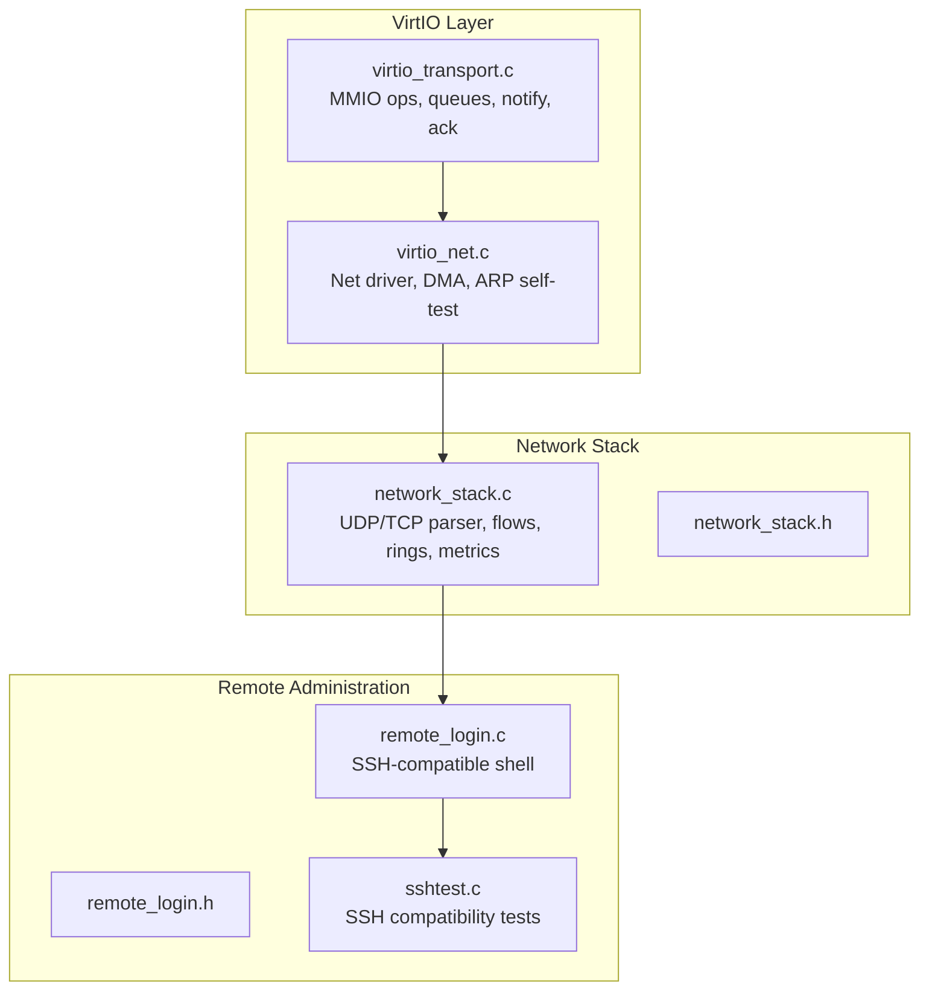
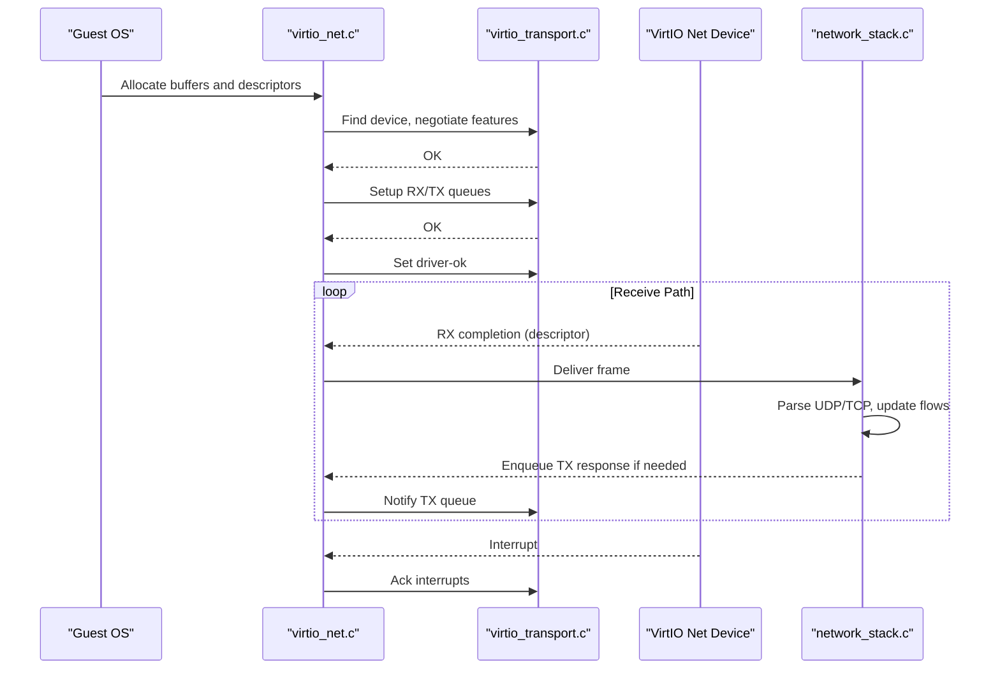
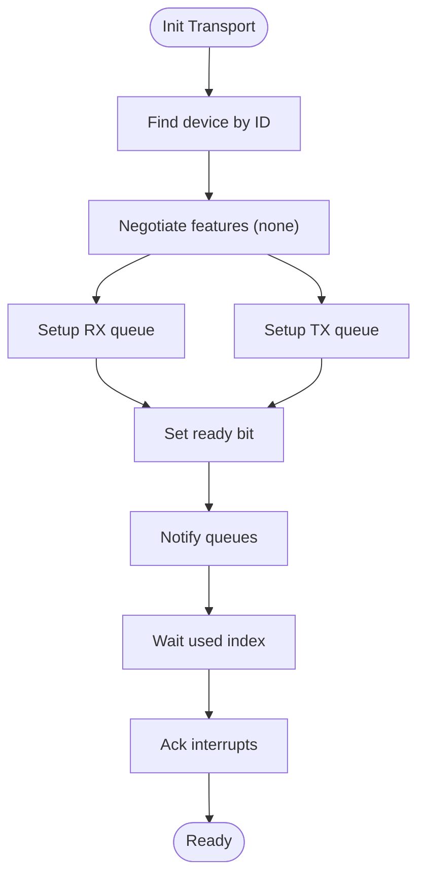
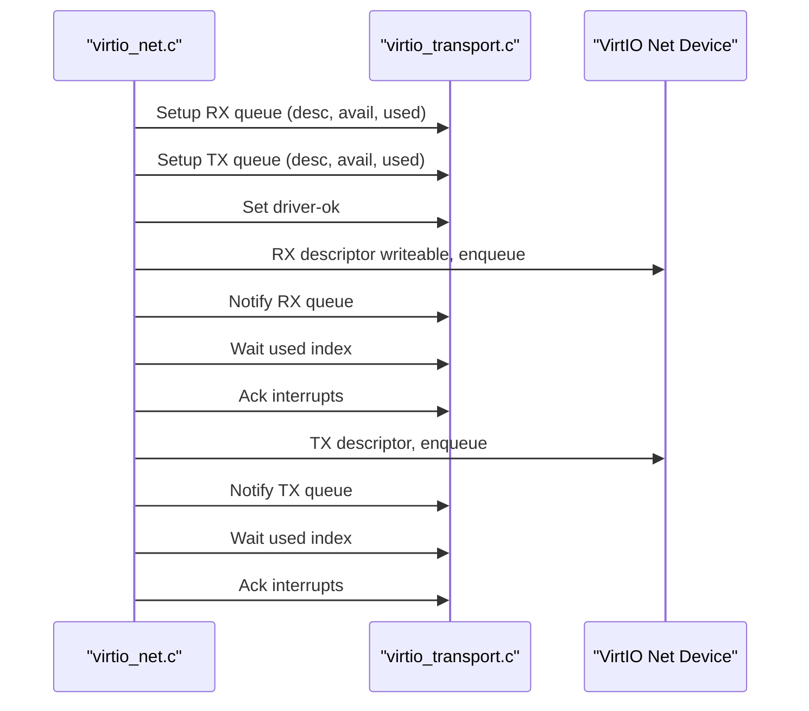
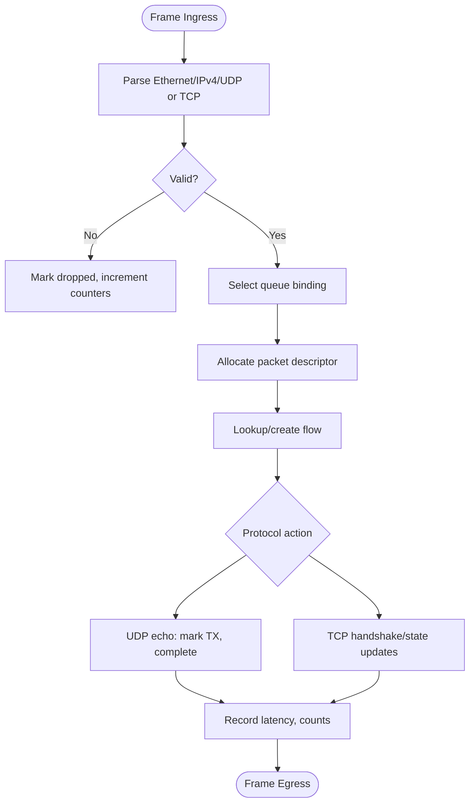
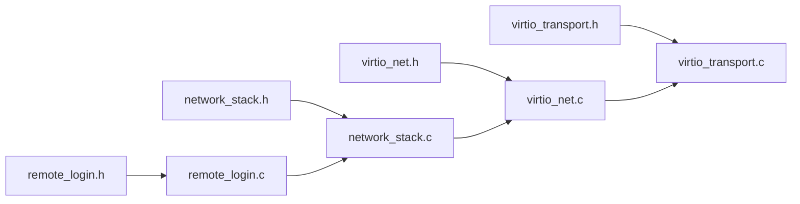

# Networking

<cite>
**Referenced Files in This Document**
- [virtio_net.c](file://kernel/dev/virtio/virtio_net.c)
- [virtio_transport.c](file://kernel/dev/virtio/virtio_transport.c)
- [virtio_transport.h](file://kernel/include/osai/virtio_transport.h)
- [virtio_net.h](file://kernel/include/osai/virtio_net.h)
- [network_stack.c](file://kernel/runtime/network_stack.c)
- [network_stack.h](file://kernel/include/osai/network_stack.h)
- [remote_login.c](file://kernel/runtime/remote_login.c)
- [remote_login.h](file://kernel/include/osai/remote_login.h)
- [sshtest.c](file://userspace/apps/sshtest.c)
- [qemu-network-suite.py](file://scripts/qemu-network-suite.py)
</cite>

## Table of Contents
1. [Introduction](#introduction)
2. [Project Structure](#project-structure)
3. [Core Components](#core-components)
4. [Architecture Overview](#architecture-overview)
5. [Detailed Component Analysis](#detailed-component-analysis)
6. [Dependency Analysis](#dependency-analysis)
7. [Performance Considerations](#performance-considerations)
8. [Security and Access Control](#security-and-access-control)
9. [Remote Login and Administrative Access](#remote-login-and-administrative-access)
10. [Troubleshooting Guide](#troubleshooting-guide)
11. [Conclusion](#conclusion)

## Introduction
This document describes OSAI’s virtualized networking stack built on VirtIO. It covers the VirtIO network driver implementation (packet reception/transmission, interrupts, and buffer management), the higher-level network stack (protocol handling, packet processing, and queue management), integration points between the driver and stack, configuration and performance tuning, security considerations, and remote administration via SSH-compatible access.

## Project Structure
OSAI organizes networking code across three primary areas:
- VirtIO transport and device driver: MMIO register access, queue setup, notifications, and basic self-tests.
- Network stack: UDP/TCP parsing, flow tracking, queue bindings, latency sampling, and application test harnesses.
- Remote login: SSH-compatible command execution with allowlists and credential checks.

**Diagram sources**
- [virtio_transport.c:1-183](file://kernel/dev/virtio/virtio_transport.c#L1-L183)
- [virtio_net.c:1-183](file://kernel/dev/virtio/virtio_net.c#L1-L183)
- [network_stack.c:1-1571](file://kernel/runtime/network_stack.c#L1-L1571)
- [network_stack.h:1-76](file://kernel/include/osai/network_stack.h#L1-L76)
- [remote_login.c:1-2318](file://kernel/runtime/remote_login.c#L1-L2318)
- [remote_login.h:1-16](file://kernel/include/osai/remote_login.h#L1-L16)
- [sshtest.c:1-57](file://userspace/apps/sshtest.c#L1-L57)

**Section sources**
- [virtio_net.c:1-183](file://kernel/dev/virtio/virtio_net.c#L1-L183)
- [virtio_transport.c:1-183](file://kernel/dev/virtio/virtio_transport.c#L1-L183)
- [network_stack.c:1-1571](file://kernel/runtime/network_stack.c#L1-L1571)
- [network_stack.h:1-76](file://kernel/include/osai/network_stack.h#L1-L76)
- [remote_login.c:1-2318](file://kernel/runtime/remote_login.c#L1-L2318)
- [remote_login.h:1-16](file://kernel/include/osai/remote_login.h#L1-L16)
- [sshtest.c:1-57](file://userspace/apps/sshtest.c#L1-L57)

## Core Components
- VirtIO transport: MMIO register abstraction, queue setup, notification, and interrupt acknowledgment.
- VirtIO network driver: RX/TX queue descriptors, DMA mapping, barrier usage, and ARP self-test.
- Network stack: Packet parsing (UDP/TCP), flow tracking, queue binding/ring depth control, latency metrics, and application test harnesses.
- Remote login: SSH-compatible command execution with allowlists and secret material rejection.

Key responsibilities:
- Transport: Device discovery, feature negotiation, queue configuration, notify, wait, and interrupt ack.
- Driver: Buffer allocation, descriptor setup, notify RX/TX, and completion handling.
- Stack: Protocol parsing, flow lifecycle, queue ownership, and performance counters.
- Remote login: Authentication gating, command allowlist enforcement, and audit logging.

**Section sources**
- [virtio_transport.c:75-182](file://kernel/dev/virtio/virtio_transport.c#L75-L182)
- [virtio_net.c:48-182](file://kernel/dev/virtio/virtio_net.c#L48-L182)
- [network_stack.c:607-1570](file://kernel/runtime/network_stack.c#L607-L1570)
- [remote_login.c:2246-2283](file://kernel/runtime/remote_login.c#L2246-L2283)

## Architecture Overview
The system integrates VirtIO MMIO devices with a kernel network stack. The driver configures RX and TX virtqueues and notifies the device. The network stack parses incoming frames, manages flows and queue bindings, and exposes metrics and application APIs. Remote login provides SSH-compatible administrative access.

**Diagram sources**
- [virtio_net.c:131-182](file://kernel/dev/virtio/virtio_net.c#L131-L182)
- [virtio_transport.c:104-182](file://kernel/dev/virtio/virtio_transport.c#L104-L182)
- [network_stack.c:747-948](file://kernel/runtime/network_stack.c#L747-L948)

## Detailed Component Analysis

### VirtIO Transport
Responsibilities:
- MMIO register reads/writes and memory barriers.
- Device discovery by ID and name.
- Feature negotiation (no features selected).
- Queue setup with descriptor, driver, and device addresses.
- Notification and waiting for completions.
- Interrupt acknowledgment.

Implementation highlights:
- Device enumeration scans MMIO slots and validates magic/version/device ID.
- Queue setup writes descriptor and address pairs to device registers.
- Notification triggers device via queue notify register.
- Wait routine spins until used index advances or times out.

**Diagram sources**
- [virtio_transport.c:75-182](file://kernel/dev/virtio/virtio_transport.c#L75-L182)
- [virtio_transport.h:1-64](file://kernel/include/osai/virtio_transport.h#L1-L64)

**Section sources**
- [virtio_transport.c:41-182](file://kernel/dev/virtio/virtio_transport.c#L41-L182)
- [virtio_transport.h:12-40](file://kernel/include/osai/virtio_transport.h#L12-L40)

### VirtIO Network Driver
Responsibilities:
- Allocate per-queue descriptors and buffers.
- Map buffers to DMA addresses via VMM translation.
- Build and send ARP requests for self-test.
- Configure RX descriptor as writeable and enqueue via avail ring.
- Trigger notifications and wait for completions.
- Ack interrupts after processing.

Key behaviors:
- RX descriptor flags include write-back for received data.
- TX descriptor flags empty for transmit.
- Barrier ensures ordering before notify.
- Self-test validates RX/TX path and ARP reply handling.

**Diagram sources**
- [virtio_net.c:131-182](file://kernel/dev/virtio/virtio_net.c#L131-L182)
- [virtio_transport.c:124-182](file://kernel/dev/virtio/virtio_transport.c#L124-L182)

**Section sources**
- [virtio_net.c:48-182](file://kernel/dev/virtio/virtio_net.c#L48-L182)
- [virtio_transport.c:124-182](file://kernel/dev/virtio/virtio_transport.c#L124-L182)

### Network Stack
Responsibilities:
- Initialize queues, flows, and packet descriptors.
- Bind logical queues to cells/cores and enforce backpressure via ring depths.
- Parse IPv4/UDP and IPv4/TCP frames, validate headers and checksums.
- Track UDP flows and TCP connections with state machine.
- Record latency percentiles and operational metrics.
- Provide application APIs for UDP echo and TCP connect/close.

Key structures and policies:
- Fixed-size rings per queue with RX/TX depth limits.
- UDP idle expiration and TCP retransmit/timeout logic.
- Hash-based selection of queue binding for flows.
- Packet lifecycle tracking (RX owned, TX queued, complete, dropped).

**Diagram sources**
- [network_stack.c:747-948](file://kernel/runtime/network_stack.c#L747-L948)
- [network_stack.h:19-36](file://kernel/include/osai/network_stack.h#L19-L36)

**Section sources**
- [network_stack.c:607-1570](file://kernel/runtime/network_stack.c#L607-L1570)
- [network_stack.h:1-76](file://kernel/include/osai/network_stack.h#L1-L76)

### Application Test Harnesses
- UDP echo app: Builds a synthetic UDP frame and exercises the stack end-to-end.
- TCP connect app: Emulates SYN/SYN+ACK/RST to exercise TCP state transitions.
- External session API: Accepts UDP/TCP payloads and returns formatted results.

These are used for self-tests and integration verification.

**Section sources**
- [network_stack.c:1218-1282](file://kernel/runtime/network_stack.c#L1218-L1282)
- [network_stack.c:1317-1364](file://kernel/runtime/network_stack.c#L1317-L1364)

## Dependency Analysis
- virtio_net depends on virtio_transport and VMM for DMA translation.
- network_stack depends on virtio_net for packet ingress and on timer for timeouts.
- remote_login depends on network_stack for administrative sessions and on security subsystem for credential checks.

**Diagram sources**
- [virtio_transport.h:1-64](file://kernel/include/osai/virtio_transport.h#L1-L64)
- [virtio_transport.c:1-183](file://kernel/dev/virtio/virtio_transport.c#L1-L183)
- [virtio_net.h:1-7](file://kernel/include/osai/virtio_net.h#L1-L7)
- [virtio_net.c:1-183](file://kernel/dev/virtio/virtio_net.c#L1-L183)
- [network_stack.h:1-76](file://kernel/include/osai/network_stack.h#L1-L76)
- [network_stack.c:1-1571](file://kernel/runtime/network_stack.c#L1-L1571)
- [remote_login.h:1-16](file://kernel/include/osai/remote_login.h#L1-L16)
- [remote_login.c:1-2318](file://kernel/runtime/remote_login.c#L1-L2318)

**Section sources**
- [virtio_net.c:1-183](file://kernel/dev/virtio/virtio_net.c#L1-L183)
- [virtio_transport.c:1-183](file://kernel/dev/virtio/virtio_transport.c#L1-L183)
- [network_stack.c:1-1571](file://kernel/runtime/network_stack.c#L1-L1571)
- [remote_login.c:1-2318](file://kernel/runtime/remote_login.c#L1-L2318)

## Performance Considerations
- Queue sizing: Virtqueue size is fixed and configured during setup.
- Backpressure: Per-queue ring depth limits prevent unbounded growth; exceeding depth leads to drops.
- Latency sampling: UDP/TCP latency percentiles tracked for observability.
- Retransmissions and timeouts: TCP SYN retransmit and timeout thresholds tune reliability vs. latency.
- Buffer sizes: RX/TX buffers sized for typical frames; ARP self-test validates minimal path.

Tuning levers:
- Adjust queue ring depth constants to balance throughput and memory usage.
- Tune TCP retransmit and SYN timeout windows for network conditions.
- Monitor packet drop counters to detect congestion or misconfiguration.

**Section sources**
- [virtio_transport.h:7-7](file://kernel/include/osai/virtio_transport.h#L7-L7)
- [network_stack.c:13-25](file://kernel/runtime/network_stack.c#L13-L25)
- [network_stack.c:290-334](file://kernel/runtime/network_stack.c#L290-L334)
- [network_stack.c:969-1006](file://kernel/runtime/network_stack.c#L969-L1006)

## Security and Access Control
- Remote login enforces:
  - Username validation (“admin” only).
  - Secret material rejection in commands.
  - Command allowlist enforcement; unknown commands are rejected.
- Audit logs track sessions, commands, and denials.
- Network stack validates IP/TCP headers and checksums; malformed packets are dropped and counted.

Operational controls:
- Limit administrative access to “admin” user.
- Restrict commands to allowlisted set.
- Monitor denials and malformed packet counters.

**Section sources**
- [remote_login.c:2246-2283](file://kernel/runtime/remote_login.c#L2246-L2283)
- [remote_login.c:2297-2317](file://kernel/runtime/remote_login.c#L2297-L2317)
- [network_stack.c:461-464](file://kernel/runtime/network_stack.c#L461-L464)
- [network_stack.c:513-516](file://kernel/runtime/network_stack.c#L513-L516)

## Remote Login and Administrative Access
- SSH-compatible command surface: Users can execute allowlisted commands under an authenticated session.
- Session lifecycle: Opened with credentials, executed, and closed with audit logging.
- Test coverage: Userspace test validates core commands (pwd, cd, help, status, sysinfo, file ops).

Integration:
- Remote login invokes network stack for administrative sessions.
- Userspace app demonstrates expected command behavior.

**Section sources**
- [remote_login.c:2246-2283](file://kernel/runtime/remote_login.c#L2246-L2283)
- [sshtest.c:1-57](file://userspace/apps/sshtest.c#L1-L57)

## Troubleshooting Guide
Common symptoms and diagnostics:
- No RX/TX: Verify driver OK status and interrupts acknowledged.
- Packet drops: Inspect backpressure drops and malformed packet counters.
- TCP connection failures: Check retransmit and timeout counters; review SYN state progression.
- ARP/loopback issues: Run driver self-test to validate RX/TX and ARP reply handling.

Validation tools:
- Network stack self-test verifies queue bindings, UDP/TCP flows, and latency metrics.
- QEMU network suite markers capture UDP lifecycle, TCP timeouts/retransmits, and malformed packet handling.

Debugging steps:
- Confirm device presence and queue setup succeeded.
- Validate DMA addresses and descriptor flags.
- Check queue ring depths and completion counts.
- Review audit logs for denied commands and session outcomes.

**Section sources**
- [virtio_net.c:131-182](file://kernel/dev/virtio/virtio_net.c#L131-L182)
- [network_stack.c:1366-1570](file://kernel/runtime/network_stack.c#L1366-L1570)
- [qemu-network-suite.py:8-41](file://scripts/qemu-network-suite.py#L8-L41)

## Conclusion
OSAI’s networking stack combines a minimal VirtIO transport and driver with a kernel network stack that parses and routes UDP/TCP traffic, tracks flows, and exposes metrics and application APIs. Remote login provides SSH-compatible administrative access with strict allowlists and secret material checks. The design emphasizes deterministic queue management, latency sampling, and robust error handling, validated by self-tests and QEMU suites.