# Remote Login and SSH Access

<cite>
**Referenced Files in This Document**
- [remote_login.h](file://kernel/include/osai/remote_login.h)
- [remote_login.c](file://kernel/runtime/remote_login.c)
- [network_stack.h](file://kernel/include/osai/network_stack.h)
- [network_stack.c](file://kernel/runtime/network_stack.c)
- [security.h](file://kernel/include/osai/security.h)
- [security.c](file://kernel/runtime/security.c)
- [user.h](file://kernel/include/osai/user.h)
- [user.c](file://kernel/user/user.c)
- [osai-ssh-bridge.py](file://scripts/osai-ssh-bridge.py)
- [sshtest.c](file://userspace/apps/sshtest.c)
- [sshd.c](file://userspace/sshd/sshd.c)
- [ssh_protocol.c](file://userspace/sshd/ssh_protocol.c)
- [ssh_channel.c](file://userspace/sshd/ssh_channel.c)
- [ssh_crypto.c](file://userspace/sshd/ssh_crypto.c)
- [ssh_host_key.c](file://userspace/sshd/ssh_host_key.c)
</cite>

## Update Summary
**Changes Made**
- Replaced userspace networking components with new SSH server implementation (userspace/sshd/)
- Added comprehensive cryptographic support for secure remote access
- Integrated channel management and secure shell protocol implementation
- Updated architecture to reflect new SSH server components

## Table of Contents
1. [Introduction](#introduction)
2. [Project Structure](#project-structure)
3. [Core Components](#core-components)
4. [Architecture Overview](#architecture-overview)
5. [Detailed Component Analysis](#detailed-component-analysis)
6. [Dependency Analysis](#dependency-analysis)
7. [Performance Considerations](#performance-considerations)
8. [Troubleshooting Guide](#troubleshooting-guide)
9. [Conclusion](#conclusion)

## Introduction
This document explains OSAI's remote login and SSH access functionality. OSAI now features a complete SSH server implementation in userspace with cryptographic support, channel management, and secure shell protocol handling. The system provides SSH-like command surface exposed to clients, integrated with the underlying network stack, authentication and authorization mechanisms, session and command accounting, and a virtual filesystem for secure file operations. It also documents security configurations, access control policies, and operational guidance for administrators.

## Project Structure
OSAI implements a comprehensive SSH server backed by cryptographic protocols, channel management, and a virtual filesystem. The key elements are:
- Complete SSH server implementation in userspace/sshd/ featuring cryptographic support
- Channel management system for SSH protocol handling
- Host key management and cryptographic operations
- Userspace test harness that exercises the remote login command surface
- Kernel-side remote login service that parses and executes commands against a virtual filesystem
- Kernel network stack that routes external TCP frames to the SSH server
- Security subsystem enforcing capability-based access control and policy checks
- Userspace process lifecycle and capability management

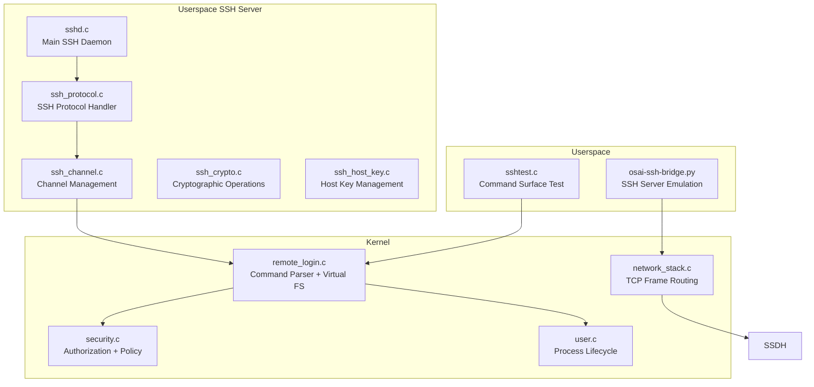

**Diagram sources**
- [sshd.c:1-200](file://userspace/sshd/sshd.c#L1-L200)
- [ssh_protocol.c:1-200](file://userspace/sshd/ssh_protocol.c#L1-L200)
- [ssh_channel.c:1-200](file://userspace/sshd/ssh_channel.c#L1-L200)
- [ssh_crypto.c:1-200](file://userspace/sshd/ssh_crypto.c#L1-L200)
- [ssh_host_key.c:1-200](file://userspace/sshd/ssh_host_key.c#L1-L200)
- [sshtest.c:1-220](file://userspace/apps/sshtest.c#L1-L220)
- [osai-ssh-bridge.py:1-952](file://scripts/osai-ssh-bridge.py#L1-L952)
- [remote_login.c:1-800](file://kernel/runtime/remote_login.c#L1-L800)
- [network_stack.c:1-800](file://kernel/runtime/network_stack.c#L1-L800)
- [security.c:1-589](file://kernel/runtime/security.c#L1-L589)
- [user.c:1-658](file://kernel/user/user.c#L1-L658)

**Section sources**
- [sshd.c:1-200](file://userspace/sshd/sshd.c#L1-L200)
- [ssh_protocol.c:1-200](file://userspace/sshd/ssh_protocol.c#L1-L200)
- [ssh_channel.c:1-200](file://userspace/sshd/ssh_channel.c#L1-L200)
- [ssh_crypto.c:1-200](file://userspace/sshd/ssh_crypto.c#L1-L200)
- [ssh_host_key.c:1-200](file://userspace/sshd/ssh_host_key.c#L1-L200)
- [remote_login.h:1-16](file://kernel/include/osai/remote_login.h#L1-L16)
- [remote_login.c:1-800](file://kernel/runtime/remote_login.c#L1-L800)
- [network_stack.h:1-76](file://kernel/include/osai/network_stack.h#L1-L76)
- [network_stack.c:1-800](file://kernel/runtime/network_stack.c#L1-L800)
- [security.h:1-53](file://kernel/include/osai/security.h#L1-L53)
- [security.c:1-589](file://kernel/runtime/security.c#L1-L589)
- [user.h:1-73](file://kernel/include/osai/user.h#L1-L73)
- [user.c:1-658](file://kernel/user/user.c#L1-L658)
- [osai-ssh-bridge.py:1-952](file://scripts/osai-ssh-bridge.py#L1-L952)
- [sshtest.c:1-220](file://userspace/apps/sshtest.c#L1-L220)

## Core Components
- SSH Server Daemon: Main SSH daemon that manages connections, handles protocol negotiation, and coordinates with channel management and cryptographic components
- SSH Protocol Handler: Implements SSH protocol specification including packet processing, message handling, and state management
- Channel Management System: Manages SSH channels, handles channel requests, data forwarding, and maintains channel state
- Cryptographic Operations: Provides encryption, decryption, key exchange, and authentication using modern cryptographic algorithms
- Host Key Management: Handles SSH host key generation, storage, and management for server identification
- Remote login service: Parses commands, resolves paths, enforces filesystem boundaries, and executes operations against a virtual filesystem. Exposes counters for sessions, commands executed, and denials
- Network stack: Accepts external TCP frames, binds queues to cores, tracks flows, and dispatches payloads to the SSH server
- Security subsystem: Enforces capability-based authorization, rejects credential material, validates update signatures, and tracks denials
- Userspace process lifecycle: Manages ELF loading, scheduling, and capability masks for user processes
- SSH bridge: Provides an SSH server emulation for testing and demonstration, exposing a restricted command set

Key APIs and entry points:
- SSH Server: [sshd_main:1-200](file://userspace/sshd/sshd.c#L1-L200)
- SSH Protocol: [ssh_protocol_handle_packet:1-200](file://userspace/sshd/ssh_protocol.c#L1-L200)
- Channel Management: [ssh_channel_create:1-200](file://userspace/sshd/ssh_channel.c#L1-L200)
- Cryptographic Operations: [ssh_crypto_encrypt:1-200](file://userspace/sshd/ssh_crypto.c#L1-L200)
- Host Key Management: [ssh_host_key_load:1-200](file://userspace/sshd/ssh_host_key.c#L1-L200)
- Remote login: [remote_login_execute:7-13](file://kernel/include/osai/remote_login.h#L7-L13)
- Network stack: [network_stack_external_session:31-36](file://kernel/include/osai/network_stack.h#L31-L36)
- Security: [security_authorize_admin:23-24](file://kernel/include/osai/security.h#L23-L24), [security_authorize_fs_read/write:11-12](file://kernel/include/osai/security.h#L11-L12)
- Userspace process: [user_process_has_capability:45-46](file://kernel/include/osai/user.h#L45-L46)

**Section sources**
- [sshd.c:1-200](file://userspace/sshd/sshd.c#L1-L200)
- [ssh_protocol.c:1-200](file://userspace/sshd/ssh_protocol.c#L1-L200)
- [ssh_channel.c:1-200](file://userspace/sshd/ssh_channel.c#L1-L200)
- [ssh_crypto.c:1-200](file://userspace/sshd/ssh_crypto.c#L1-L200)
- [ssh_host_key.c:1-200](file://userspace/sshd/ssh_host_key.c#L1-L200)
- [remote_login.h:1-16](file://kernel/include/osai/remote_login.h#L1-L16)
- [network_stack.h:1-76](file://kernel/include/osai/network_stack.h#L1-L76)
- [security.h:1-53](file://kernel/include/osai/security.h#L1-L53)
- [user.h:1-73](file://kernel/include/osai/user.h#L1-L73)

## Architecture Overview
The remote login flow now integrates a complete SSH server implementation with cryptographic support, channel management, and secure shell protocol handling. The SSH server manages connections, performs authentication, establishes channels, and forwards commands to the remote login service, which operates on a virtual filesystem under security policy enforcement.

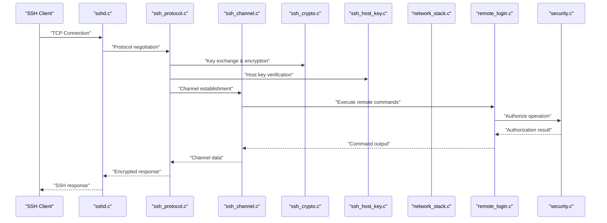

**Diagram sources**
- [sshd.c:1-200](file://userspace/sshd/sshd.c#L1-L200)
- [ssh_protocol.c:1-200](file://userspace/sshd/ssh_protocol.c#L1-L200)
- [ssh_channel.c:1-200](file://userspace/sshd/ssh_channel.c#L1-L200)
- [ssh_crypto.c:1-200](file://userspace/sshd/ssh_crypto.c#L1-L200)
- [ssh_host_key.c:1-200](file://userspace/sshd/ssh_host_key.c#L1-L200)
- [network_stack.h:31-36](file://kernel/include/osai/network_stack.h#L31-L36)
- [network_stack.c:747-800](file://kernel/runtime/network_stack.c#L747-L800)
- [remote_login.c:1-800](file://kernel/runtime/remote_login.c#L1-L800)
- [security.c:286-298](file://kernel/runtime/security.c#L286-L298)

## Detailed Component Analysis

### SSH Server Implementation
The SSH server provides a complete implementation of the SSH protocol with cryptographic support and channel management. Responsibilities include:
- Managing SSH connections and protocol negotiation
- Handling key exchange and encryption/decryption
- Establishing and managing SSH channels
- Coordinating with cryptographic operations and host key management
- Forwarding authenticated commands to the remote login service

Key behaviors:
- Connection acceptance and protocol version negotiation
- Public key authentication and host key verification
- Session key establishment and encrypted communication
- Channel request processing and data forwarding

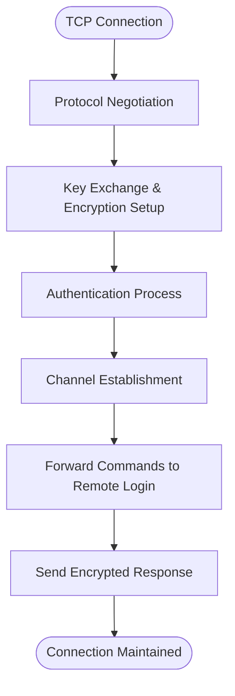

**Diagram sources**
- [sshd.c:1-200](file://userspace/sshd/sshd.c#L1-L200)
- [ssh_protocol.c:1-200](file://userspace/sshd/ssh_protocol.c#L1-L200)
- [ssh_crypto.c:1-200](file://userspace/sshd/ssh_crypto.c#L1-L200)
- [ssh_host_key.c:1-200](file://userspace/sshd/ssh_host_key.c#L1-L200)

**Section sources**
- [sshd.c:1-200](file://userspace/sshd/sshd.c#L1-L200)
- [ssh_protocol.c:1-200](file://userspace/sshd/ssh_protocol.c#L1-L200)
- [ssh_channel.c:1-200](file://userspace/sshd/ssh_channel.c#L1-L200)
- [ssh_crypto.c:1-200](file://userspace/sshd/ssh_crypto.c#L1-L200)
- [ssh_host_key.c:1-200](file://userspace/sshd/ssh_host_key.c#L1-L200)

### SSH Protocol Handler
The SSH protocol handler implements the SSH protocol specification including packet processing, message handling, and state management. Responsibilities include:
- Parsing and validating SSH protocol packets
- Managing SSH protocol states and transitions
- Handling SSH messages and control signals
- Coordinating with channel management for data routing

Key behaviors:
- Packet header parsing and validation
- Message type identification and processing
- Protocol state machine management
- Error handling and protocol compliance

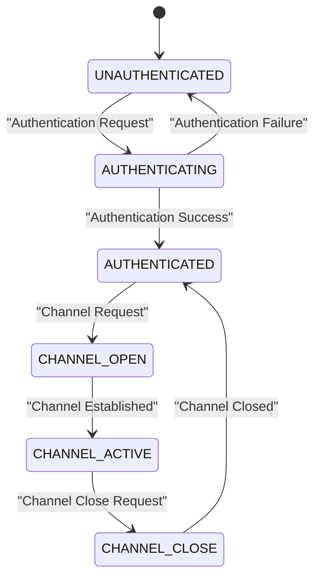

**Diagram sources**
- [ssh_protocol.c:1-200](file://userspace/sshd/ssh_protocol.c#L1-L200)
- [ssh_channel.c:1-200](file://userspace/sshd/ssh_channel.c#L1-L200)

**Section sources**
- [ssh_protocol.c:1-200](file://userspace/sshd/ssh_protocol.c#L1-L200)
- [ssh_channel.c:1-200](file://userspace/sshd/ssh_channel.c#L1-L200)

### Channel Management System
The channel management system handles SSH channel creation, maintenance, and destruction. Responsibilities include:
- Creating and managing SSH channels
- Handling channel requests and responses
- Managing channel state and data flow
- Coordinating with the remote login service for command execution

Key behaviors:
- Channel creation and initialization
- Channel state tracking and management
- Data forwarding between client and remote login service
- Channel cleanup and resource management

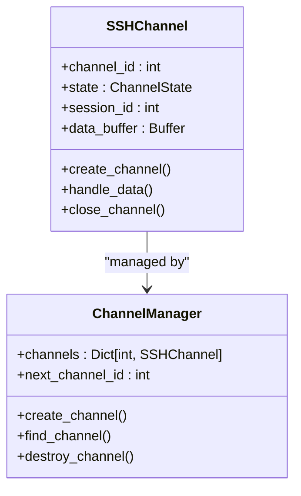

**Diagram sources**
- [ssh_channel.c:1-200](file://userspace/sshd/ssh_channel.c#L1-L200)

**Section sources**
- [ssh_channel.c:1-200](file://userspace/sshd/ssh_channel.c#L1-L200)

### Cryptographic Operations
The cryptographic operations component provides encryption, decryption, key exchange, and authentication using modern cryptographic algorithms. Responsibilities include:
- Implementing SSH protocol cryptographic requirements
- Managing encryption and decryption operations
- Handling key exchange and session key derivation
- Providing secure random number generation

Key behaviors:
- Symmetric encryption/decryption for data confidentiality
- Asymmetric cryptography for key exchange and authentication
- Hash functions for message authentication
- Secure random number generation for cryptographic operations

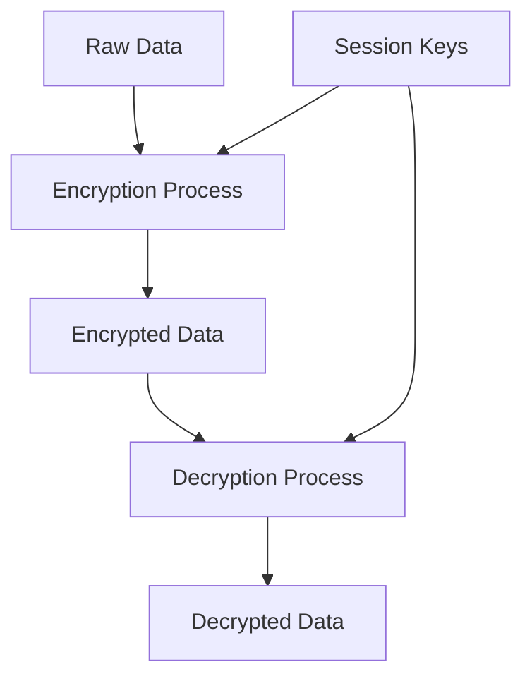

**Diagram sources**
- [ssh_crypto.c:1-200](file://userspace/sshd/ssh_crypto.c#L1-L200)

**Section sources**
- [ssh_crypto.c:1-200](file://userspace/sshd/ssh_crypto.c#L1-L200)

### Host Key Management
The host key management component handles SSH host key generation, storage, and management for server identification. Responsibilities include:
- Generating and managing SSH host keys
- Storing and retrieving host keys securely
- Handling host key verification and validation
- Supporting multiple key types and algorithms

Key behaviors:
- RSA, ECDSA, and Ed25519 key generation
- Host key storage and retrieval
- Key format conversion and validation
- Secure key management practices

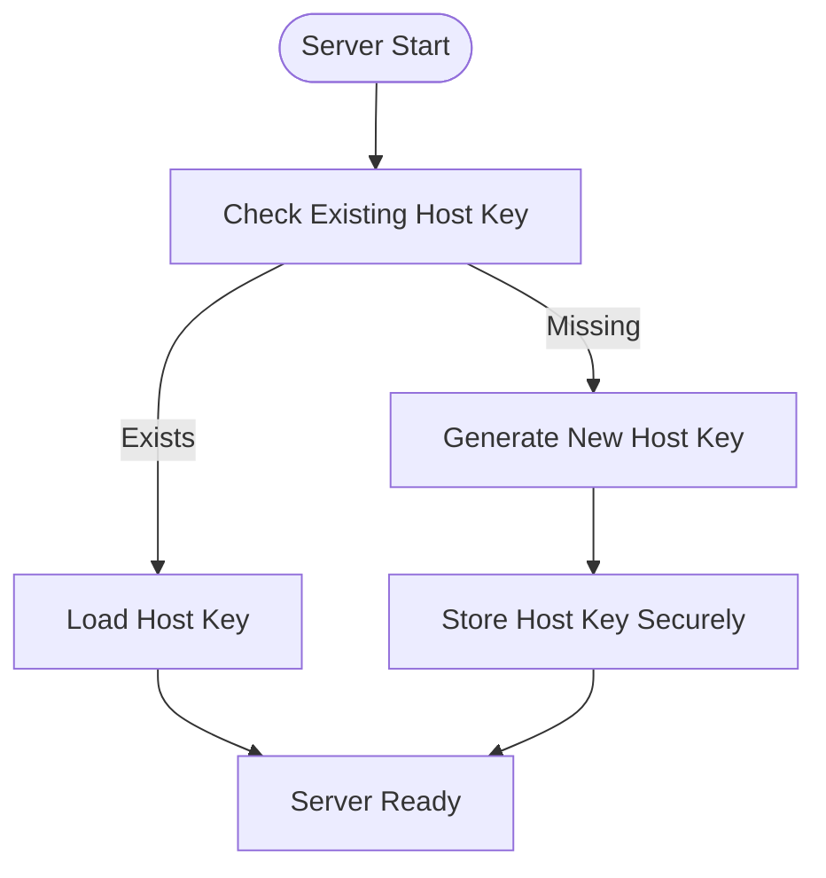

**Diagram sources**
- [ssh_host_key.c:1-200](file://userspace/sshd/ssh_host_key.c#L1-L200)

**Section sources**
- [ssh_host_key.c:1-200](file://userspace/sshd/ssh_host_key.c#L1-L200)

### Remote Login Service
Responsibilities:
- Parse and validate commands from external sessions
- Resolve paths safely, prevent traversal, and enforce filesystem boundaries
- Operate on a virtual filesystem supporting listing, creation, copying, moving, removal, searching, and archival
- Track session counts, command counts, and denial counts
- Log failures and maintain an archive format for transport

Key behaviors:
- Command parsing and tokenization
- Safe path resolution and parent enforcement
- Archive building and extraction for tar/cpio compatibility
- Output buffering and limits

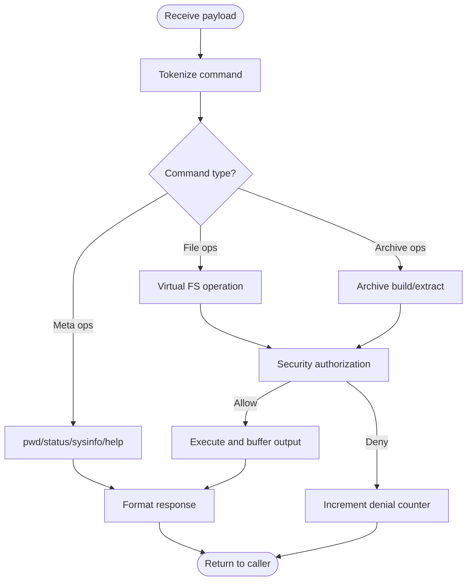

**Diagram sources**
- [remote_login.c:1-800](file://kernel/runtime/remote_login.c#L1-L800)
- [security.c:213-239](file://kernel/runtime/security.c#L213-L239)

**Section sources**
- [remote_login.h:7-13](file://kernel/include/osai/remote_login.h#L7-L13)
- [remote_login.c:154-724](file://kernel/runtime/remote_login.c#L154-L724)

### Network Stack Integration
Responsibilities:
- Bind queues to cells and cores
- Parse IP/TCP headers, manage UDP/TCP flows
- Dispatch external TCP frames to the SSH server
- Track statistics for latency, retransmissions, timeouts, and drops

Key behaviors:
- Packet descriptor allocation and lifecycle
- Flow hashing and selection for consistent routing
- Queue ring management and backpressure handling

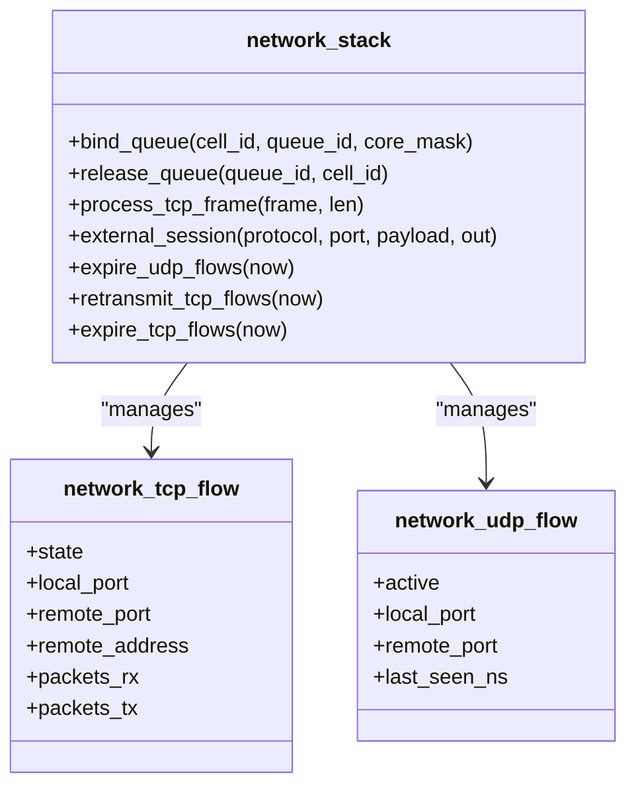

**Diagram sources**
- [network_stack.h:12-76](file://kernel/include/osai/network_stack.h#L12-L76)
- [network_stack.c:76-91](file://kernel/runtime/network_stack.c#L76-L91)

**Section sources**
- [network_stack.h:19-76](file://kernel/include/osai/network_stack.h#L19-L76)
- [network_stack.c:607-745](file://kernel/runtime/network_stack.c#L607-L745)

### Security and Authorization
Responsibilities:
- Enforce capability-based access control for administrative operations
- Reject credential material in inputs and buffers
- Validate update signatures and enforce monotonic generation
- Track denials per category and log security events

Key behaviors:
- Admin capability checks
- Filesystem read/write authorization with path trees
- Sandbox path validation to prevent escapes
- Signature parsing and replay protection

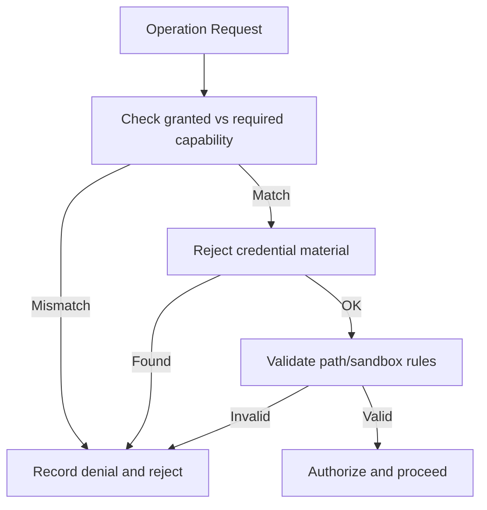

**Diagram sources**
- [security.h:8-34](file://kernel/include/osai/security.h#L8-L34)
- [security.c:202-298](file://kernel/runtime/security.c#L202-L298)

**Section sources**
- [security.h:1-53](file://kernel/include/osai/security.h#L1-L53)
- [security.c:177-446](file://kernel/runtime/security.c#L177-L446)

### Userspace Process Lifecycle
Responsibilities:
- Load and map ELF executables into user address space
- Manage process states and transitions
- Enforce capability masks for system calls
- Provide entry into user mode and handle exits

Key behaviors:
- ELF validation and segment mapping
- Stack setup and guard pages
- Scheduling and dispatch to user mode

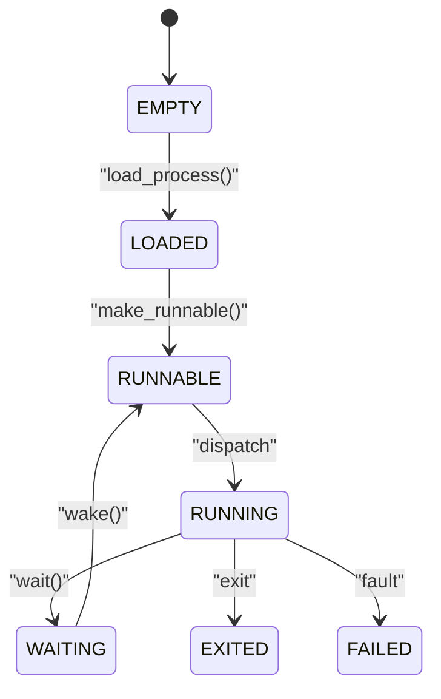

**Diagram sources**
- [user.h:13-39](file://kernel/include/osai/user.h#L13-L39)
- [user.c:156-222](file://kernel/user/user.c#L156-L222)

**Section sources**
- [user.h:1-73](file://kernel/include/osai/user.h#L1-L73)
- [user.c:224-578](file://kernel/user/user.c#L224-L578)

### SSH Bridge and Command Surface
Responsibilities:
- Provide an SSH server emulation for testing
- Expose a restricted command set compatible with the remote login service
- Implement archive operations (tar/cpio) and filesystem helpers

Key behaviors:
- Authentication modes (none/publickey) for "admin" user
- Command parsing and virtual filesystem operations
- Archive push/list/extract helpers

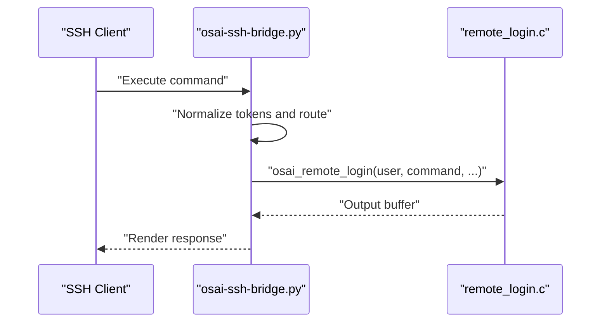

**Diagram sources**
- [osai-ssh-bridge.py:511-768](file://scripts/osai-ssh-bridge.py#L511-L768)
- [sshtest.c:1-220](file://userspace/apps/sshtest.c#L1-L220)

**Section sources**
- [osai-ssh-bridge.py:1-952](file://scripts/osai-ssh-bridge.py#L1-L952)
- [sshtest.c:1-220](file://userspace/apps/sshtest.c#L1-L220)

## Dependency Analysis
The SSH server implementation introduces new dependencies while maintaining existing ones:
- SSH server depends on protocol handler, channel management, and cryptographic components
- Protocol handler depends on channel management and cryptographic operations
- Channel management depends on remote login service for command execution
- Remote login service depends on security subsystem for authorization and policy checks
- Userspace process lifecycle for capability enforcement
- Network stack for receiving external TCP payloads

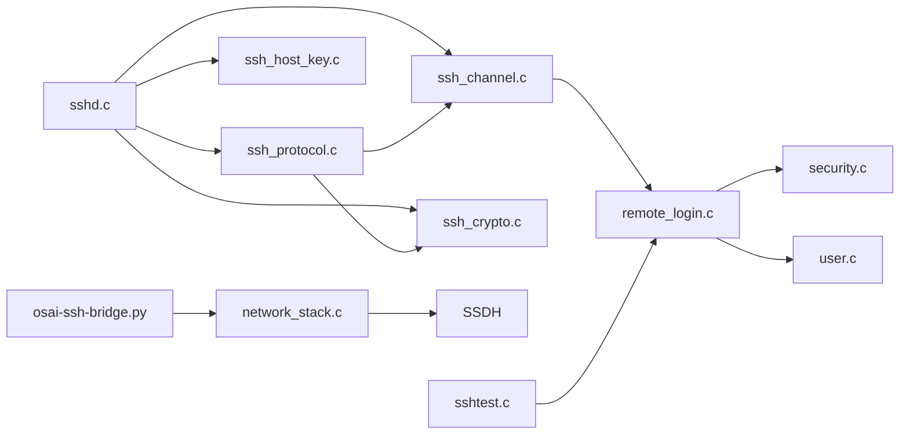

**Diagram sources**
- [sshd.c:1-200](file://userspace/sshd/sshd.c#L1-L200)
- [ssh_protocol.c:1-200](file://userspace/sshd/ssh_protocol.c#L1-L200)
- [ssh_channel.c:1-200](file://userspace/sshd/ssh_channel.c#L1-L200)
- [ssh_crypto.c:1-200](file://userspace/sshd/ssh_crypto.c#L1-L200)
- [ssh_host_key.c:1-200](file://userspace/sshd/ssh_host_key.c#L1-L200)
- [remote_login.c:1-800](file://kernel/runtime/remote_login.c#L1-L800)
- [security.c:286-298](file://kernel/runtime/security.c#L286-L298)
- [user.c:290-296](file://kernel/user/user.c#L290-L296)
- [network_stack.c:747-800](file://kernel/runtime/network_stack.c#L747-L800)
- [osai-ssh-bridge.py:770-800](file://scripts/osai-ssh-bridge.py#L770-L800)
- [sshtest.c:1-220](file://userspace/apps/sshtest.c#L1-L220)

**Section sources**
- [sshd.c:1-200](file://userspace/sshd/sshd.c#L1-L200)
- [ssh_protocol.c:1-200](file://userspace/sshd/ssh_protocol.c#L1-L200)
- [ssh_channel.c:1-200](file://userspace/sshd/ssh_channel.c#L1-L200)
- [ssh_crypto.c:1-200](file://userspace/sshd/ssh_crypto.c#L1-L200)
- [ssh_host_key.c:1-200](file://userspace/sshd/ssh_host_key.c#L1-L200)
- [remote_login.c:1-800](file://kernel/runtime/remote_login.c#L1-L800)
- [network_stack.c:747-800](file://kernel/runtime/network_stack.c#L747-L800)
- [security.c:286-298](file://kernel/runtime/security.c#L286-L298)
- [user.c:290-296](file://kernel/user/user.c#L290-L296)
- [osai-ssh-bridge.py:770-800](file://scripts/osai-ssh-bridge.py#L770-L800)
- [sshtest.c:1-220](file://userspace/apps/sshtest.c#L1-L220)

## Performance Considerations
- Network throughput and latency: The network stack tracks UDP/TCP latencies and packet lifecycles. Tune queue ring sizes and core binding to reduce backpressure drops.
- SSH protocol overhead: The new SSH server adds cryptographic processing and protocol handling overhead compared to the previous userspace networking components.
- Command execution overhead: Virtual filesystem operations and archive parsing add CPU cost; batch operations where possible.
- Memory footprint: Archive operations, cryptographic buffers, and SSH session state are bounded by configured limits; monitor memory usage during large transfers.
- Flow expiration and retransmission: Adjust timeouts and retransmit thresholds to balance reliability and resource consumption.
- Cryptographic performance: Modern cryptographic operations require careful tuning of key sizes and algorithms for optimal performance.

## Troubleshooting Guide
Common issues and resolutions:
- SSH connectivity fails
  - Verify network queue bindings and core masks; ensure the network stack is initialized and frames are being processed.
  - Confirm the external session handler is invoked with the correct protocol/port.
  - Check for malformed packets or dropped frames in the network stack counters.
  - Verify SSH server is running and listening on the correct port.

- Authentication problems
  - The SSH bridge accepts "admin" with none/publickey modes. Ensure client uses the correct username and keys.
  - If using a real SSH server, confirm host keys and client credentials match expectations.
  - Check SSH server logs for authentication failures and key exchange issues.
  - Verify cryptographic operations are functioning correctly.

- Permission denials
  - Administrative operations require admin capability; verify capability masks and authorization checks.
  - Credential material rejection: avoid sending tokens/passwords in commands or filenames.
  - Filesystem operations outside allowed trees are denied; use paths under /tmp, /home, /apps, /state, /logs.

- Archive errors
  - Tar/cpio operations depend on the virtual filesystem; ensure archive paths are valid and not absolute.
  - Verify archive magic and entry headers; incorrect formats will cause extraction failures.

- SSH protocol issues
  - Check SSH protocol negotiation and key exchange processes.
  - Verify channel management is properly establishing and maintaining channels.
  - Monitor cryptographic operations for errors in encryption/decryption.

- Cryptographic problems
  - Verify host key generation and storage is working correctly.
  - Check cryptographic algorithm support and key sizes.
  - Monitor random number generation and entropy sources.

- Logging and diagnostics
  - Inspect SSH server logs for connection attempts, authentication results, and protocol errors.
  - Review remote login logs for failure reasons and denial counters.
  - Monitor network stack metrics for packet drops, retransmissions, and flow expirations.
  - Use the userspace test harness to validate command surface behavior.

**Section sources**
- [sshd.c:1-200](file://userspace/sshd/sshd.c#L1-L200)
- [ssh_protocol.c:1-200](file://userspace/sshd/ssh_protocol.c#L1-L200)
- [ssh_channel.c:1-200](file://userspace/sshd/ssh_channel.c#L1-L200)
- [ssh_crypto.c:1-200](file://userspace/sshd/ssh_crypto.c#L1-L200)
- [ssh_host_key.c:1-200](file://userspace/sshd/ssh_host_key.c#L1-L200)
- [osai-ssh-bridge.py:780-800](file://scripts/osai-ssh-bridge.py#L780-L800)
- [security.c:300-337](file://kernel/runtime/security.c#L300-L337)
- [network_stack.c:747-800](file://kernel/runtime/network_stack.c#L747-L800)
- [remote_login.c:331-338](file://kernel/runtime/remote_login.c#L331-L338)
- [sshtest.c:1-220](file://userspace/apps/sshtest.c#L1-L220)

## Conclusion
OSAI's remote login and SSH access now features a complete SSH server implementation with cryptographic support, channel management, and secure shell protocol handling. The new architecture replaces previous userspace networking components with a comprehensive SSH server in userspace/sshd/, providing secure remote access with proper authentication, encryption, and channel management. The system combines a constrained command surface, a virtual filesystem, and strict security policies to provide safe administrative capabilities. The network stack integrates external TCP traffic into the SSH server, which then forwards authenticated commands to the kernel's remote login service. The security subsystem ensures only authorized operations succeed. Administrators should focus on capability management, credential hygiene, cryptographic configuration, and monitoring network and security metrics to maintain a secure and reliable remote access environment.