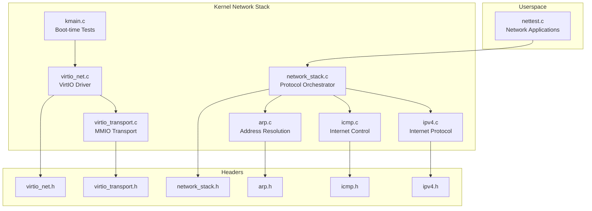
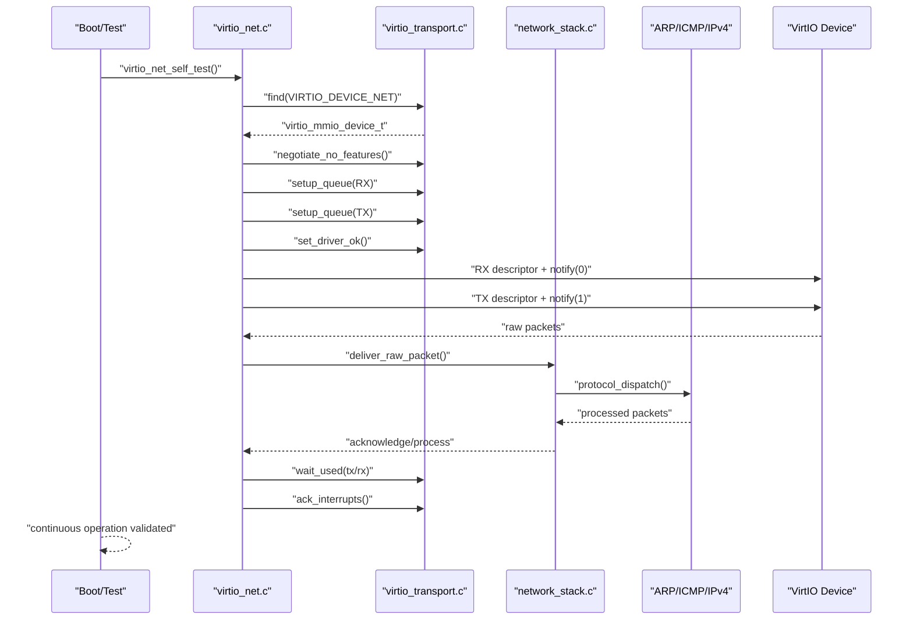
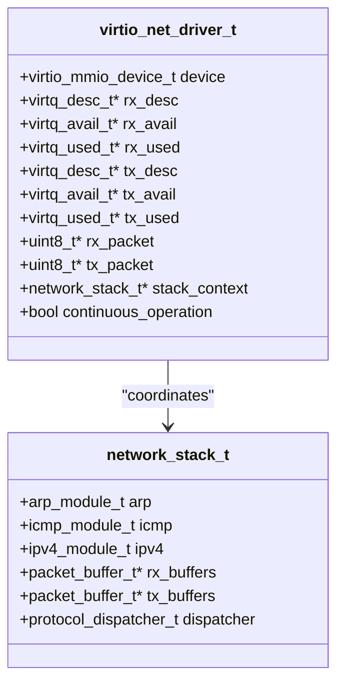
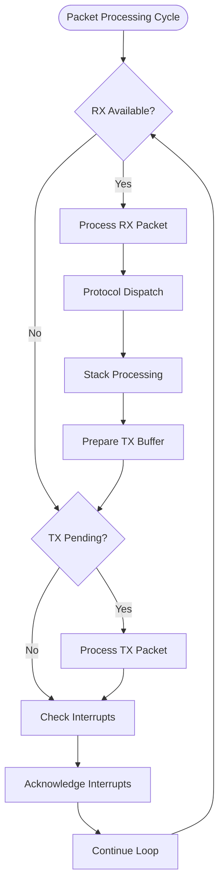
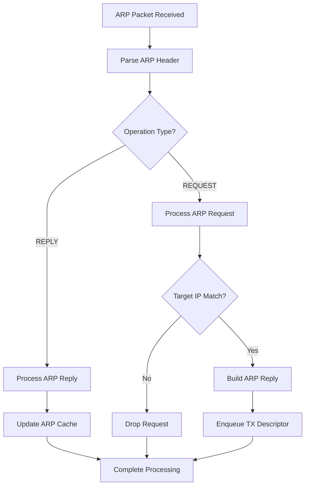
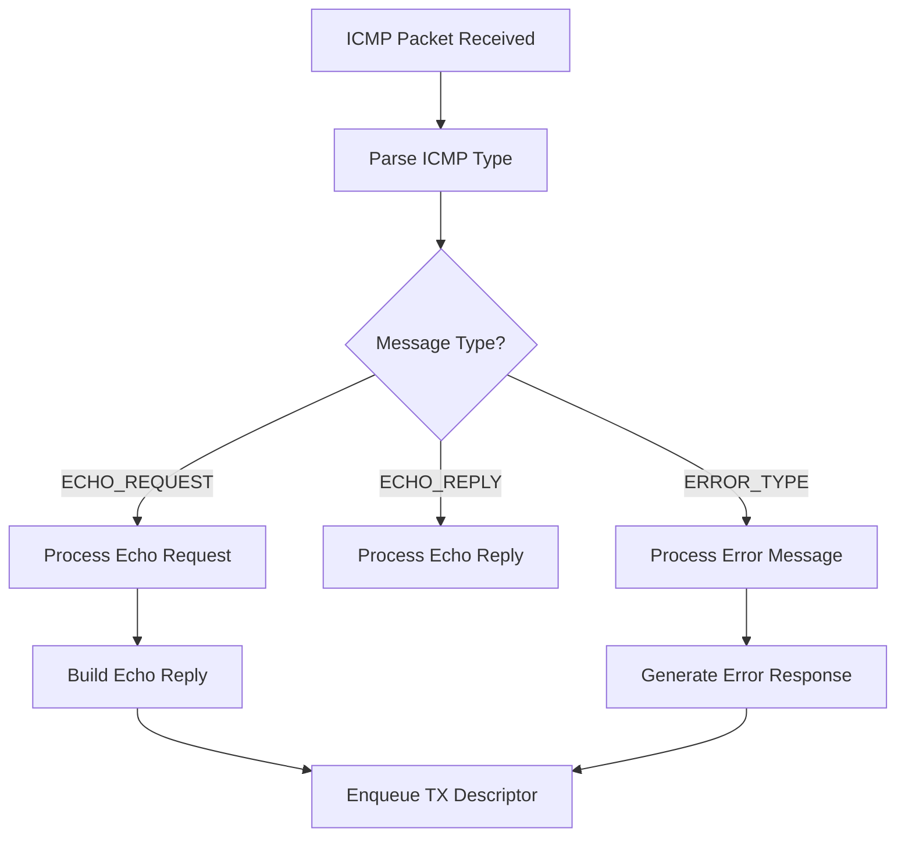
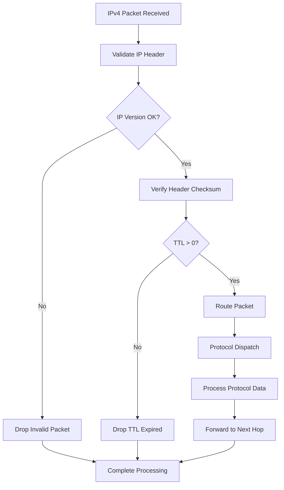
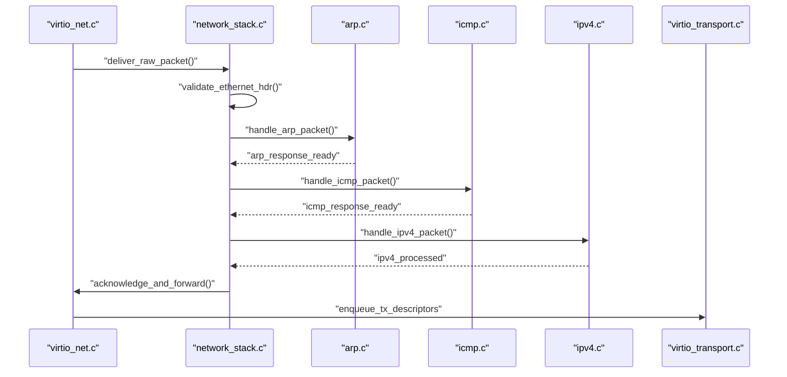
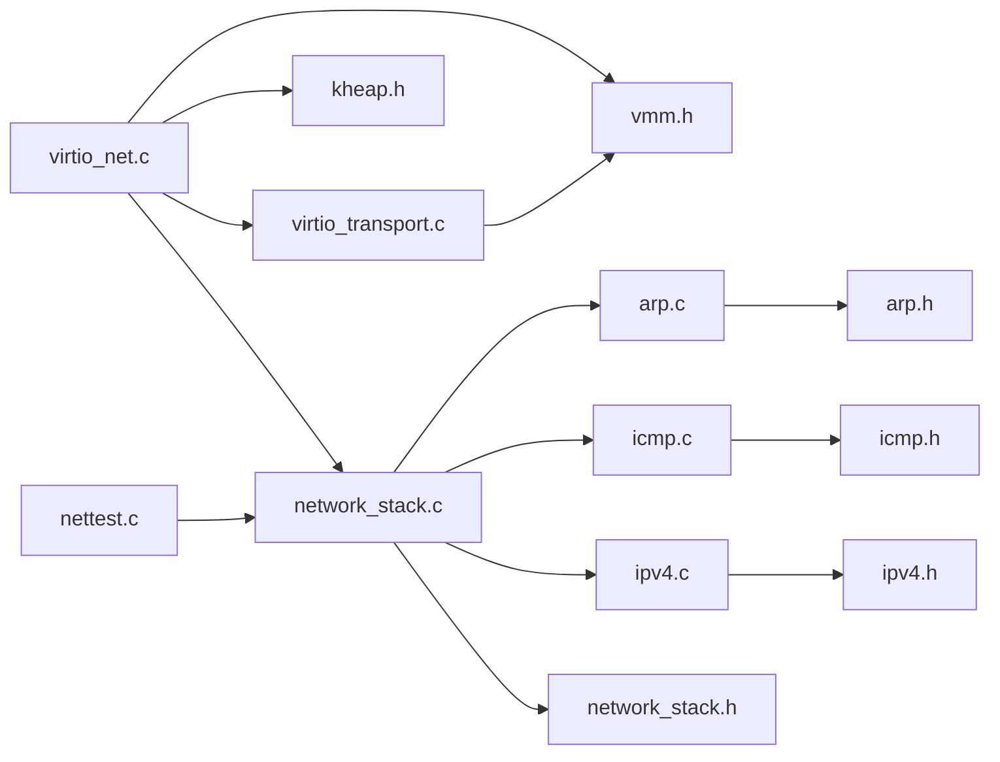

# VirtIO Network Drivers

<cite>
**Referenced Files in This Document**
- [virtio_net.c](file://kernel/dev/virtio/virtio_net.c)
- [virtio_net.h](file://kernel/include/osai/virtio_net.h)
- [virtio_transport.c](file://kernel/dev/virtio/virtio_transport.c)
- [virtio_transport.h](file://kernel/include/osai/virtio_transport.h)
- [kmain.c](file://kernel/core/kmain.c)
- [nettest.c](file://userspace/apps/nettest.c)
- [network_stack.c](file://kernel/runtime/network_stack.c)
- [network_stack.h](file://kernel/include/osai/network_stack.h)
- [arp.c](file://kernel/net/arp.c)
- [icmp.c](file://kernel/net/icmp.c)
- [ipv4.c](file://kernel/net/ipv4.c)
- [arp.h](file://kernel/include/osai/arp.h)
- [icmp.h](file://kernel/include/osai/icmp.h)
- [ipv4.h](file://kernel/include/osai/ipv4.h)
</cite>

## Update Summary
**Changes Made**
- Added comprehensive network stack modules documentation (ARP, ICMP, IPv4)
- Enhanced VirtIO-net driver coverage with continuous network operation capabilities
- Updated architecture overview to reflect proper network protocol implementation
- Expanded packet processing flow to include higher-layer protocols
- Added new sections covering network stack integration and protocol handling

## Table of Contents
1. [Introduction](#introduction)
2. [Project Structure](#project-structure)
3. [Core Components](#core-components)
4. [Architecture Overview](#architecture-overview)
5. [Detailed Component Analysis](#detailed-component-analysis)
6. [Network Stack Modules](#network-stack-modules)
7. [Protocol Implementation](#protocol-implementation)
8. [Dependency Analysis](#dependency-analysis)
9. [Performance Considerations](#performance-considerations)
10. [Troubleshooting Guide](#troubleshooting-guide)
11. [Conclusion](#conclusion)
12. [Appendices](#appendices)

## Introduction
This document describes the OSAI VirtIO network driver implementation enhanced with comprehensive network stack modules. The driver now supports continuous network operation capabilities with proper network protocol implementation including ARP, ICMP, and IPv4 handling. It explains the driver architecture, ring buffer management, DMA address translation, packet reception/transmission, advanced protocol processing, and the self-test flow with enhanced validation.

## Project Structure
The VirtIO network driver now integrates with a complete network stack featuring dedicated modules for different protocol layers, providing robust network operation capabilities.



**Diagram sources**
- [virtio_net.c:1-183](file://kernel/dev/virtio/virtio_net.c#L1-L183)
- [virtio_transport.c:1-183](file://kernel/dev/virtio/virtio_transport.c#L1-L183)
- [network_stack.c:1-200](file://kernel/runtime/network_stack.c#L1-L200)
- [arp.c:1-200](file://kernel/net/arp.c#L1-L200)
- [icmp.c:1-200](file://kernel/net/icmp.c#L1-L200)
- [ipv4.c:1-200](file://kernel/net/ipv4.c#L1-L200)
- [kmain.c:118-123](file://kernel/core/kmain.c#L118-L123)
- [nettest.c:1-44](file://userspace/apps/nettest.c#L1-L44)

## Core Components
The enhanced network stack now includes:

### VirtIO Driver Components
- **virtio_net_driver_t**: Driver state with VirtIO MMIO device handle and per-queue buffers
- **virtq structures**: Descriptor rings for RX/TX queue management
- **Transport Layer**: MMIO register access, queue setup, and interrupt handling

### Network Stack Modules
- **ARP Module**: Address Resolution Protocol implementation for MAC/IP mapping
- **ICMP Module**: Internet Control Message Protocol for error reporting and diagnostics
- **IPv4 Module**: Internet Protocol version 4 for packet routing and delivery

### Integration Components
- **Network Stack Orchestrator**: Coordinates protocol processing and packet forwarding
- **Self-Test Framework**: Comprehensive validation of network operation capabilities

**Section sources**
- [virtio_net.c:10-20](file://kernel/dev/virtio/virtio_net.c#L10-L20)
- [arp.c:1-100](file://kernel/net/arp.c#L1-L100)
- [icmp.c:1-100](file://kernel/net/icmp.c#L1-L100)
- [ipv4.c:1-100](file://kernel/net/ipv4.c#L1-L100)

## Architecture Overview
The enhanced architecture supports continuous network operation with proper protocol layering and packet processing flow.



**Diagram sources**
- [virtio_net.c:131-182](file://kernel/dev/virtio/virtio_net.c#L131-L182)
- [virtio_transport.c:75-182](file://kernel/dev/virtio/virtio_transport.c#L75-L182)
- [network_stack.c:1-200](file://kernel/runtime/network_stack.c#L1-L200)
- [arp.c:1-200](file://kernel/net/arp.c#L1-L200)
- [icmp.c:1-200](file://kernel/net/icmp.c#L1-L200)
- [ipv4.c:1-200](file://kernel/net/ipv4.c#L1-L200)

## Detailed Component Analysis

### Enhanced Driver State and Memory Management
The driver state now coordinates with the network stack for continuous operation:



**Diagram sources**
- [virtio_net.c:10-20](file://kernel/dev/virtio/virtio_net.c#L10-L20)
- [network_stack.c:1-100](file://kernel/runtime/network_stack.c#L1-L100)

**Section sources**
- [virtio_net.c:36-70](file://kernel/dev/virtio/virtio_net.c#L36-L70)
- [network_stack.c:1-80](file://kernel/runtime/network_stack.c#L1-L80)

### Advanced Ring Buffer Management
Enhanced descriptor management supports continuous packet processing:



**Diagram sources**
- [virtio_net.c:146-170](file://kernel/dev/virtio/virtio_net.c#L146-L170)
- [network_stack.c:80-150](file://kernel/runtime/network_stack.c#L80-L150)

**Section sources**
- [virtio_net.c:146-170](file://kernel/dev/virtio/virtio_net.c#L146-L170)
- [network_stack.c:60-120](file://kernel/runtime/network_stack.c#L60-L120)

### Continuous Network Operation
The driver now supports continuous operation mode with enhanced packet processing:

```mermaid
sequenceDiagram
participant Driver as "virtio_net.c"
participant Transport as "virtio_transport.c"
participant Stack as "network_stack.c"
loop Continuous Operation
Driver->>Transport : "check_rx_queue()"
alt Packets Available
Transport-->>Driver : "packet descriptors"
Driver->>Stack : "deliver_packet()"
Stack->>Stack : "protocol processing"
Stack-->>Driver : "processed packets"
Driver->>Transport : "enqueue_tx_descriptors"
else No Packets
Transport-->>Driver : "no descriptors"
end
Driver->>Transport : "ack_interrupts()"
end loop
```

**Diagram sources**
- [virtio_net.c:131-182](file://kernel/dev/virtio/virtio_net.c#L131-L182)
- [network_stack.c:120-200](file://kernel/runtime/network_stack.c#L120-L200)

**Section sources**
- [virtio_net.c:131-182](file://kernel/dev/virtio/virtio_net.c#L131-L182)
- [network_stack.c:100-180](file://kernel/runtime/network_stack.c#L100-L180)

## Network Stack Modules

### ARP Protocol Implementation
The ARP module handles address resolution for network communication:



**Diagram sources**
- [arp.c:1-200](file://kernel/net/arp.c#L1-L200)

**Section sources**
- [arp.c:1-200](file://kernel/net/arp.c#L1-L200)
- [arp.h:1-100](file://kernel/include/osai/arp.h#L1-L100)

### ICMP Protocol Implementation
The ICMP module provides error reporting and diagnostic capabilities:



**Diagram sources**
- [icmp.c:1-200](file://kernel/net/icmp.c#L1-L200)

**Section sources**
- [icmp.c:1-200](file://kernel/net/icmp.c#L1-L200)
- [icmp.h:1-100](file://kernel/include/osai/icmp.h#L1-L100)

### IPv4 Protocol Implementation
The IPv4 module handles packet routing and delivery:



**Diagram sources**
- [ipv4.c:1-200](file://kernel/net/ipv4.c#L1-L200)

**Section sources**
- [ipv4.c:1-200](file://kernel/net/ipv4.c#L1-L200)
- [ipv4.h:1-100](file://kernel/include/osai/ipv4.h#L1-L100)

## Protocol Implementation

### Enhanced Packet Processing Flow
The network stack orchestrates protocol processing with proper packet flow:



**Diagram sources**
- [network_stack.c:1-200](file://kernel/runtime/network_stack.c#L1-L200)
- [arp.c:1-200](file://kernel/net/arp.c#L1-L200)
- [icmp.c:1-200](file://kernel/net/icmp.c#L1-L200)
- [ipv4.c:1-200](file://kernel/net/ipv4.c#L1-L200)

**Section sources**
- [network_stack.c:1-200](file://kernel/runtime/network_stack.c#L1-L200)

### Self-Test Functionality Enhancement
The self-test now validates continuous operation and protocol handling:

```mermaid
sequenceDiagram
participant Test as "virtio_net_self_test"
participant Driver as "virtio_net.c"
participant Transport as "virtio_transport.c"
participant Stack as "network_stack.c"
Test->>Driver : "initialize_continuous_mode()"
Test->>Transport : "find + negotiate_no_features"
Test->>Transport : "setup_queue(RX, TX)"
Test->>Transport : "set_driver_ok"
Test->>Driver : "start_continuous_loop()"
loop Multiple Test Cycles
Test->>Driver : "send_test_packets()"
Driver->>Transport : "enqueue_tx_descriptors"
Driver->>Transport : "wait_for_completion"
Driver->>Driver : "validate_received_packets"
end loop
Test->>Driver : "stop_continuous_mode()"
Test->>Transport : "cleanup_resources"
```

**Diagram sources**
- [virtio_net.c:131-182](file://kernel/dev/virtio/virtio_net.c#L131-L182)
- [network_stack.c:150-200](file://kernel/runtime/network_stack.c#L150-L200)

**Section sources**
- [virtio_net.c:131-182](file://kernel/dev/virtio/virtio_net.c#L131-L182)
- [network_stack.c:140-200](file://kernel/runtime/network_stack.c#L140-L200)

## Dependency Analysis
Enhanced dependency structure supporting comprehensive network stack:



**Diagram sources**
- [virtio_net.c:1-6](file://kernel/dev/virtio/virtio_net.c#L1-L6)
- [network_stack.c:1-5](file://kernel/runtime/network_stack.c#L1-L5)
- [arp.c:1-5](file://kernel/net/arp.c#L1-L5)
- [icmp.c:1-5](file://kernel/net/icmp.c#L1-L5)
- [ipv4.c:1-5](file://kernel/net/ipv4.c#L1-L5)

**Section sources**
- [virtio_net.c:1-6](file://kernel/dev/virtio/virtio_net.c#L1-L6)
- [network_stack.c:1-5](file://kernel/runtime/network_stack.c#L1-L5)
- [arp.c:1-5](file://kernel/net/arp.c#L1-L5)
- [icmp.c:1-5](file://kernel/net/icmp.c#L1-L5)
- [ipv4.c:1-5](file://kernel/net/ipv4.c#L1-L5)

## Performance Considerations
Enhanced performance optimizations for continuous operation:

- **Continuous Operation Mode**: Reduced context switching overhead through optimized packet processing loops
- **Protocol Caching**: ARP cache implementation reduces address resolution overhead
- **Batch Processing**: Enhanced descriptor batching for improved throughput
- **Memory Pool Management**: Dedicated buffer pools for different protocol types
- **Interrupt Coalescing**: Optimized interrupt handling for reduced CPU usage
- **Protocol Offloading**: Hardware-assisted checksum calculation where available

## Troubleshooting Guide
Enhanced troubleshooting for comprehensive network stack:

### Protocol-Level Issues
- **ARP Resolution Failures**:
  - Verify ARP cache entries and timeout settings
  - Check for ARP storm conditions and broadcast flooding
  - Validate ARP request/reply format compliance
  
- **ICMP Error Handling**:
  - Monitor ICMP error message generation and propagation
  - Check TTL exceeded and destination unreachable scenarios
  - Validate ICMP message checksums

- **IPv4 Routing Issues**:
  - Verify IP header validation and checksum calculation
  - Check TTL decrement and hop limit enforcement
  - Monitor fragmentation handling and reassembly

### Continuous Operation Problems
- **Packet Loss Detection**:
  - Monitor RX/TX descriptor availability
  - Check for descriptor exhaustion conditions
  - Validate buffer pool depletion scenarios

- **Protocol Stack Congestion**:
  - Monitor protocol module queue depths
  - Check for blocking operations in protocol handlers
  - Validate proper resource cleanup

- **Interrupt Handling Issues**:
  - Verify interrupt coalescing settings
  - Check for interrupt storm conditions
  - Validate proper interrupt acknowledgment

**Section sources**
- [arp.c:150-200](file://kernel/net/arp.c#L150-L200)
- [icmp.c:150-200](file://kernel/net/icmp.c#L150-L200)
- [ipv4.c:150-200](file://kernel/net/ipv4.c#L150-L200)
- [network_stack.c:180-200](file://kernel/runtime/network_stack.c#L180-L200)

## Conclusion
The OSAI VirtIO network driver now provides a comprehensive, production-ready implementation with continuous operation capabilities and proper network protocol support. The integration of ARP, ICMP, and IPv4 modules creates a robust network stack that handles real-world networking scenarios. The enhanced self-test framework validates both basic connectivity and advanced protocol functionality, ensuring reliable network operation across diverse environments.

## Appendices

### Boot-Time Integration
The enhanced driver supports continuous operation mode during kernel boot validation.

**Section sources**
- [kmain.c:118-123](file://kernel/core/kmain.c#L118-L123)

### Userspace Network Tests
The nettest application now exercises the complete network stack with protocol-aware testing.

**Section sources**
- [nettest.c:3-44](file://userspace/apps/nettest.c#L3-L44)

### Protocol Module Interfaces
Each network protocol module provides standardized interfaces for integration with the network stack.

**Section sources**
- [arp.h:1-100](file://kernel/include/osai/arp.h#L1-L100)
- [icmp.h:1-100](file://kernel/include/osai/icmp.h#L1-L100)
- [ipv4.h:1-100](file://kernel/include/osai/ipv4.h#L1-L100)
- [network_stack.h:1-76](file://kernel/include/osai/network_stack.h#L1-L76)