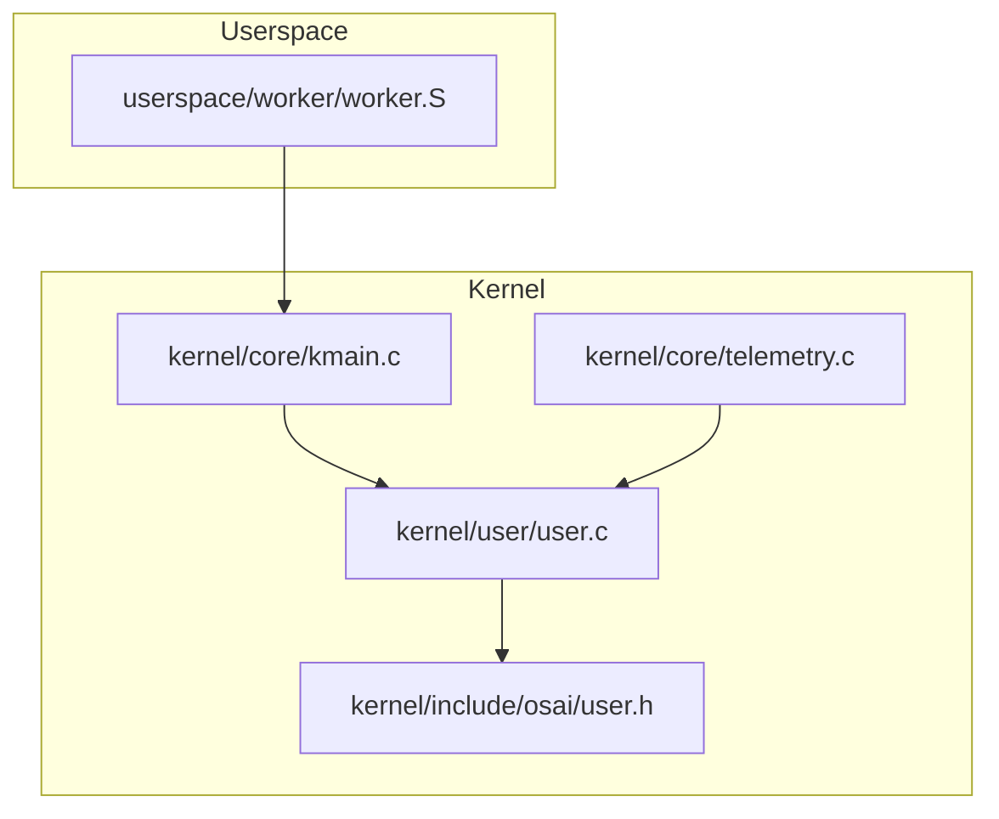
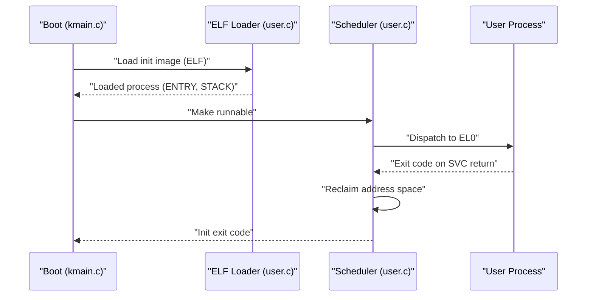
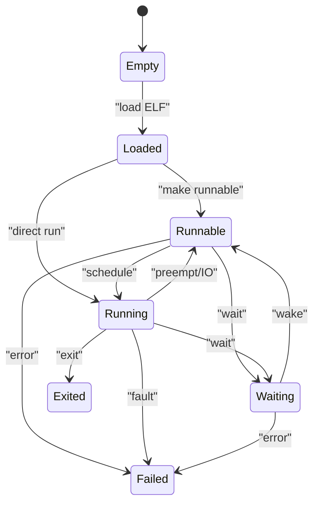
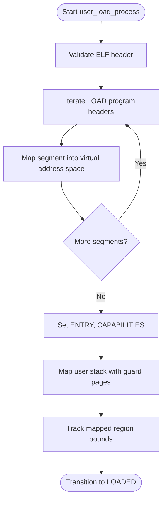
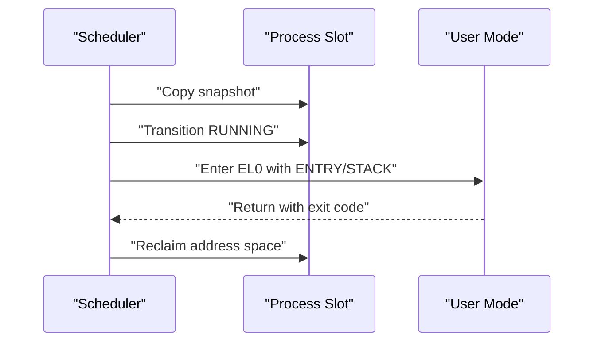
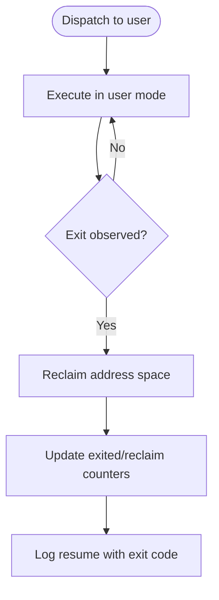
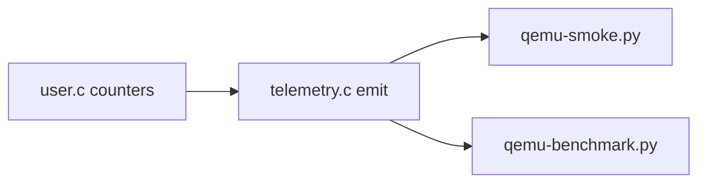
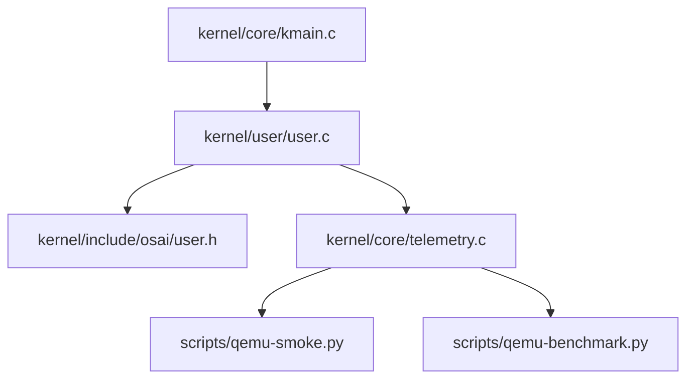

# Process Lifecycle Management

<cite>
**Referenced Files in This Document**
- [user.c](file://kernel/user/user.c)
- [user.h](file://kernel/include/osai/user.h)
- [kmain.c](file://kernel/core/kmain.c)
- [telemetry.c](file://kernel/core/telemetry.c)
- [qemu-smoke.py](file://scripts/qemu-smoke.py)
- [qemu-benchmark.py](file://scripts/qemu-benchmark.py)
- [worker.S](file://userspace/worker/worker.S)
</cite>

## Table of Contents
1. [Introduction](#introduction)
2. [Project Structure](#project-structure)
3. [Core Components](#core-components)
4. [Architecture Overview](#architecture-overview)
5. [Detailed Component Analysis](#detailed-component-analysis)
6. [Dependency Analysis](#dependency-analysis)
7. [Performance Considerations](#performance-considerations)
8. [Troubleshooting Guide](#troubleshooting-guide)
9. [Conclusion](#conclusion)
10. [Appendices](#appendices)

## Introduction
This document describes OSAI’s process lifecycle management within the microkernel architecture. It covers how user processes are created (fork/exec semantics via ELF loading), how resources are allocated and tracked, the internal process states and transitions, scheduling behavior, termination and cleanup, monitoring and telemetry, and practical operational guidance for debugging and performance tuning.

## Project Structure
OSAI organizes process lifecycle logic primarily in the kernel user subsystem and exposes APIs consumed during boot and runtime. Key areas:
- Kernel user lifecycle and state machine: kernel/user/user.c
- Public interface declarations: kernel/include/osai/user.h
- Boot-time process creation and dispatch: kernel/core/kmain.c
- Telemetry emission for lifecycle metrics: kernel/core/telemetry.c
- Test harness telemetry verification: scripts/qemu-smoke.py, scripts/qemu-benchmark.py
- Example userspace program using SVC to communicate with the kernel: userspace/worker/worker.S

**Diagram sources**
- [user.c](file://kernel/user/user.c)
- [user.h](file://kernel/include/osai/user.h)
- [kmain.c](file://kernel/core/kmain.c)
- [telemetry.c](file://kernel/core/telemetry.c)
- [worker.S](file://userspace/worker/worker.S)

**Section sources**
- [user.c](file://kernel/user/user.c)
- [user.h](file://kernel/include/osai/user.h)
- [kmain.c](file://kernel/core/kmain.c)
- [telemetry.c](file://kernel/core/telemetry.c)
- [worker.S](file://userspace/worker/worker.S)

## Core Components
- Process state machine and transitions: enforced by a deterministic state validator and transition counters.
- Process table and per-process metadata: PID, parent PID, capability mask, entry point, stack, mapped regions, scheduler ticks.
- ELF-based process creation: loads segments, sets entry point, maps user stack with guard pages.
- Scheduling hooks: wait/wake transitions and dispatch to user mode.
- Termination and reclaim: detects exit from user mode and reclaims address space.
- Monitoring and telemetry: counts for transitions, states, waits, wakes, scheduled runs, and active processes.

**Section sources**
- [user.c](file://kernel/user/user.c)
- [user.h](file://kernel/include/osai/user.h)

## Architecture Overview
OSAI’s microkernel orchestrates user processes through a strict state machine. At boot, the kernel loads an initial process image from initramfs, transitions it to RUNNABLE, and dispatches it into user mode. Subsequent processes may be launched similarly. The kernel tracks process state, enforces valid transitions, and emits telemetry for observability.

**Diagram sources**
- [kmain.c](file://kernel/core/kmain.c)
- [user.c](file://kernel/user/user.c)

## Detailed Component Analysis

### Process States and Transitions
OSAI defines a closed set of user process states with strict allowed transitions. The state machine ensures correctness and simplifies debugging by rejecting invalid sequences.

Key behaviors:
- Transitions are validated before applying.
- Each transition increments a global counter and updates per-state counters.
- Logging records state changes and exit codes.

Operational notes:
- Use wait/wake to cooperatively suspend/resume a process.
- Transition to FAILED indicates unrecoverable errors (e.g., invalid state change).
- Exited processes require explicit reclaim of address space.

**Diagram sources**
- [user.c](file://kernel/user/user.c)

**Section sources**
- [user.c](file://kernel/user/user.c)

### Process Creation (Fork/Exec Semantics)
Creation is implemented as exec-like loading of an ELF image:
- Validate ELF header and load program segments into memory.
- Set entry point and initialize process metadata.
- Map a user stack with guard pages and track mapped region bounds.
- Transition to LOADED; later make RUNNABLE and schedule.

Notes:
- Stack guard pages protect against overflow and are verified by translation checks.
- Mapped region tracking enables precise reclaim later.

**Diagram sources**
- [user.c](file://kernel/user/user.c)

**Section sources**
- [user.c](file://kernel/user/user.c)

### Resource Allocation and Initial State Setup
- Memory: Program segments mapped according to ELF headers; user stack mapped with guard pages; mapped region bounds recorded.
- Metadata: PID, parent PID, capability mask, entry point, stack pointers, guard addresses, mapped region limits, scheduler ticks.
- Capability mask controls allowed operations (e.g., logging, exit, OS control).

Practical tips:
- Ensure guard pages are unmapped from other mappings and remapped as user pages.
- Track mapped_low/mapped_high to support efficient reclaim.

**Section sources**
- [user.c](file://kernel/user/user.c)

### Scheduling Behavior
- Dispatch: Copy process snapshot into current slot and transition to RUNNING; increment scheduler ticks and scheduled count.
- Wait/Wake: Transition to WAITING or back to RUNNABLE; maintain wait/wake counters for monitoring.
- Preemption: Running processes can move to RUNNABLE upon preemption or blocking IO.

**Diagram sources**
- [user.c](file://kernel/user/user.c)

**Section sources**
- [user.c](file://kernel/user/user.c)

### Process Termination Procedures
Termination occurs when the user process returns to the kernel (via SVC). The kernel:
- Reads the exit code encoded by the return mechanism.
- Logs kernel resumption with current state and exit code.
- Reclaims the process’s address space by unmapping mapped pages and freeing physical pages.
- Maintains counters for exits and reclaims.

**Diagram sources**
- [user.c](file://kernel/user/user.c)

**Section sources**
- [user.c](file://kernel/user/user.c)

### Signal Handling
Signals are not modeled in the referenced code. Processes terminate via normal exit semantics; no explicit signal delivery or handler setup is present in the analyzed files.

**Section sources**
- [user.c](file://kernel/user/user.c)

### Process Monitoring and Lifecycle Events
Telemetry exposes counters for lifecycle events:
- Total transitions, per-state counts, scheduled runs, waits, wakes, reclaims, and active process count.
- Boot summary includes user process metrics.

**Diagram sources**
- [user.c](file://kernel/user/user.c)
- [telemetry.c](file://kernel/core/telemetry.c)
- [qemu-smoke.py](file://scripts/qemu-smoke.py)
- [qemu-benchmark.py](file://scripts/qemu-benchmark.py)

**Section sources**
- [telemetry.c](file://kernel/core/telemetry.c)
- [qemu-smoke.py](file://scripts/qemu-smoke.py)
- [qemu-benchmark.py](file://scripts/qemu-benchmark.py)

### Practical Examples of Process Management Operations
- Bootstrapping the init process:
  - Load init image from initramfs, transition to RUNNABLE, and dispatch.
  - Reference: [kmain.c](file://kernel/core/kmain.c)
- Spawning workers:
  - Load worker images with minimal capabilities and dispatch.
  - Reference: [kmain.c](file://kernel/core/kmain.c)
- Userspace SVC usage:
  - Example userspace program invokes SVC to communicate with the kernel.
  - Reference: [worker.S](file://userspace/worker/worker.S)

**Section sources**
- [kmain.c](file://kernel/core/kmain.c)
- [worker.S](file://userspace/worker/worker.S)

## Dependency Analysis
- kernel/core/kmain.c depends on kernel/user/user.c for loading and dispatching.
- kernel/user/user.c exposes public functions declared in kernel/include/osai/user.h.
- kernel/core/telemetry.c consumes counters from kernel/user/user.c.
- scripts/qemu-smoke.py and scripts/qemu-benchmark.py rely on emitted telemetry keys.

**Diagram sources**
- [kmain.c](file://kernel/core/kmain.c)
- [user.c](file://kernel/user/user.c)
- [user.h](file://kernel/include/osai/user.h)
- [telemetry.c](file://kernel/core/telemetry.c)
- [qemu-smoke.py](file://scripts/qemu-smoke.py)
- [qemu-benchmark.py](file://scripts/qemu-benchmark.py)

**Section sources**
- [kmain.c](file://kernel/core/kmain.c)
- [user.c](file://kernel/user/user.c)
- [user.h](file://kernel/include/osai/user.h)
- [telemetry.c](file://kernel/core/telemetry.c)
- [qemu-smoke.py](file://scripts/qemu-smoke.py)
- [qemu-benchmark.py](file://scripts/qemu-benchmark.py)

## Performance Considerations
- Minimize unnecessary transitions: avoid frequent wait/wake cycles for short tasks.
- Efficient reclaim: rely on mapped region tracking to quickly unmap and free pages.
- Monitor active process count: helps detect runaway spawns or stuck processes.
- Use telemetry to correlate transitions with workload patterns.

[No sources needed since this section provides general guidance]

## Troubleshooting Guide
Common scenarios and remedies:
- Invalid state transitions: The state machine rejects illegal moves. Review the transition validation logic and ensure correct sequencing (e.g., do not move RUNNING directly to EXITED without proper scheduling).
  - Reference: [user.c](file://kernel/user/user.c)
- Stuck in WAITING: Use wake to move back to RUNNABLE; confirm wait/wake counters increase.
  - Reference: [user.c](file://kernel/user/user.c)
- Excessive reclaims: Verify mapped region tracking and ensure processes exit cleanly to trigger reclaim.
  - Reference: [user.c](file://kernel/user/user.c)
- Telemetry gaps: Confirm telemetry emission and test harness expectations.
  - References: [telemetry.c](file://kernel/core/telemetry.c), [qemu-smoke.py](file://scripts/qemu-smoke.py), [qemu-benchmark.py](file://scripts/qemu-benchmark.py)
- Userspace SVC failures: Validate SVC invocation and argument encoding in userspace assembly.
  - Reference: [worker.S](file://userspace/worker/worker.S)

**Section sources**
- [user.c](file://kernel/user/user.c)
- [telemetry.c](file://kernel/core/telemetry.c)
- [qemu-smoke.py](file://scripts/qemu-smoke.py)
- [qemu-benchmark.py](file://scripts/qemu-benchmark.py)
- [worker.S](file://userspace/worker/worker.S)

## Conclusion
OSAI’s process lifecycle is built around a strict state machine, deterministic ELF-based loading, and robust scheduling hooks. Telemetry provides strong observability for transitions, scheduling, and resource usage. By following the documented patterns and using the provided monitoring and debugging techniques, operators can reliably manage and troubleshoot process lifecycles in the microkernel.

[No sources needed since this section summarizes without analyzing specific files]

## Appendices

### API Surface Summary
- Load process from ELF: [user.h](file://kernel/include/osai/user.h)
- Snapshot process by PID: [user.h](file://kernel/include/osai/user.h)
- Make runnable: [user.h](file://kernel/include/osai/user.h)
- Wait/Wake: [user.h](file://kernel/include/osai/user.h)
- Run process: [user.h](file://kernel/include/osai/user.h)
- Telemetry counters: [telemetry.c](file://kernel/core/telemetry.c)

**Section sources**
- [user.h](file://kernel/include/osai/user.h)
- [telemetry.c](file://kernel/core/telemetry.c)