# Process Management

<cite>
**Referenced Files in This Document**
- [service.h](file://kernel/include/osai/service.h)
- [syscall.h](file://kernel/include/osai/syscall.h)
- [sandbox.h](file://kernel/include/osai/sandbox.h)
- [security.h](file://kernel/include/osai/security.h)
- [scheduler.h](file://kernel/include/osai/scheduler.h)
- [context.h](file://kernel/include/osai/context.h)
- [gic.h](file://kernel/include/osai/gic.h)
- [ai_cell.h](file://kernel/include/osai/ai_cell.h)
- [scheduler.c](file://kernel/sched/scheduler.c)
- [context.S](file://kernel/sched/context.S)
- [gic.c](file://kernel/arch/aarch64/gic.c)
- [timer.c](file://kernel/arch/aarch64/timer.c)
- [service.c](file://kernel/user/service.c)
- [syscall.c](file://kernel/user/syscall.c)
- [osai_user.c](file://userspace/lib/osai_user.c)
- [osai-init.conf](file://userspace/init/osai-init.conf)
- [kmain.c](file://kernel/core/kmain.c)
- [panic.c](file://kernel/core/panic.c)
- [klog.c](file://kernel/core/klog.c)
- [telemetry.c](file://kernel/core/telemetry.c)
- [entry.S](file://kernel/arch/aarch64/entry.S)
- [exception.c](file://kernel/arch/aarch64/exception.c)
- [vmm.h](file://kernel/include/osai/vmm.h)
- [pmm.h](file://kernel/include/osai/pmm.h)
- [virtio_blk.c](file://kernel/dev/virtio/virtio_blk.c)
- [virtio_net.c](file://kernel/dev/virtio/virtio_net.c)
- [initramfs.c](file://kernel/fs/initramfs.c)
- [mutable_fs.c](file://kernel/fs/mutable_fs.c)
- [qemu-process-gate.py](file://scripts/qemu-process-gate.py)
- [qemu-fault-injection.py](file://scripts/qemu-fault-injection.py)
</cite>

## Update Summary
**Changes Made**
- Added comprehensive preemptive scheduler implementation with round-robin scheduling
- Integrated GICv3 interrupt controller initialization for single-core systems
- Implemented 288-byte AArch64 interrupt context frame with full register preservation
- Added cooperative context switching mechanisms for task management
- Introduced dedicated AI core separation capabilities
- Enhanced process lifecycle management with scheduler integration

## Table of Contents
1. [Introduction](#introduction)
2. [Project Structure](#project-structure)
3. [Core Components](#core-components)
4. [Architecture Overview](#architecture-overview)
5. [Detailed Component Analysis](#detailed-component-analysis)
6. [Dependency Analysis](#dependency-analysis)
7. [Performance Considerations](#performance-considerations)
8. [Troubleshooting Guide](#troubleshooting-guide)
9. [Conclusion](#conclusion)

## Introduction
This document describes OSAI's microkernel-based process model with a focus on service architecture, process supervision, inter-process communication, capability-based security, sandboxing, and the syscall interface. The system now features a real preemptive scheduler for single-core systems with GICv3 initialization, context switching mechanisms with 288-byte interrupt frames, and dedicated AI core separation. It covers lifecycle management from creation to termination, configuration patterns, process hierarchies, monitoring, and debugging/performance techniques. The goal is to provide a practical guide for developers and operators to understand, extend, and troubleshoot the process subsystem.

## Project Structure
OSAI organizes process-related logic across kernel headers, runtime implementations, and userspace libraries:
- Kernel headers define service, syscall, sandbox, security, scheduler, and context interfaces.
- Kernel userspace components implement service management and syscall dispatch.
- Scheduler infrastructure provides preemptive task management with GICv3 integration.
- Context switching mechanisms handle 288-byte interrupt frames for seamless task transitions.
- Userspace library exposes safe wrappers for kernel-provided services.
- Init configuration defines the initial service hierarchy and policies.
- Arch-specific files handle entry, exceptions, timers, and device drivers.
- Filesystems and VMM/PMM support memory management and storage.

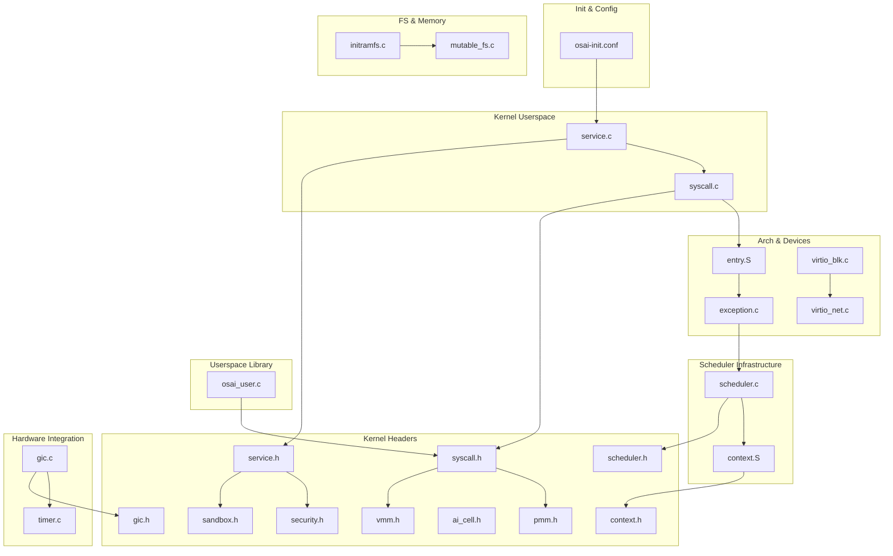

**Diagram sources**
- [service.h](file://kernel/include/osai/service.h)
- [syscall.h](file://kernel/include/osai/syscall.h)
- [sandbox.h](file://kernel/include/osai/sandbox.h)
- [security.h](file://kernel/include/osai/security.h)
- [scheduler.h](file://kernel/include/osai/scheduler.h)
- [context.h](file://kernel/include/osai/context.h)
- [gic.h](file://kernel/include/osai/gic.h)
- [ai_cell.h](file://kernel/include/osai/ai_cell.h)
- [service.c](file://kernel/user/service.c)
- [syscall.c](file://kernel/user/syscall.c)
- [scheduler.c](file://kernel/sched/scheduler.c)
- [context.S](file://kernel/sched/context.S)
- [gic.c](file://kernel/arch/aarch64/gic.c)
- [timer.c](file://kernel/arch/aarch64/timer.c)
- [osai_user.c](file://userspace/lib/osai_user.c)
- [osai-init.conf](file://userspace/init/osai-init.conf)
- [entry.S](file://kernel/arch/aarch64/entry.S)
- [exception.c](file://kernel/arch/aarch64/exception.c)
- [virtio_blk.c](file://kernel/dev/virtio/virtio_blk.c)
- [virtio_net.c](file://kernel/dev/virtio/virtio_net.c)
- [initramfs.c](file://kernel/fs/initramfs.c)
- [mutable_fs.c](file://kernel/fs/mutable_fs.c)
- [vmm.h](file://kernel/include/osai/vmm.h)
- [pmm.h](file://kernel/include/osai/pmm.h)

**Section sources**
- [service.h](file://kernel/include/osai/service.h)
- [syscall.h](file://kernel/include/osai/syscall.h)
- [sandbox.h](file://kernel/include/osai/sandbox.h)
- [security.h](file://kernel/include/osai/security.h)
- [scheduler.h](file://kernel/include/osai/scheduler.h)
- [context.h](file://kernel/include/osai/context.h)
- [gic.h](file://kernel/include/osai/gic.h)
- [ai_cell.h](file://kernel/include/osai/ai_cell.h)
- [service.c](file://kernel/user/service.c)
- [syscall.c](file://kernel/user/syscall.c)
- [scheduler.c](file://kernel/sched/scheduler.c)
- [context.S](file://kernel/sched/context.S)
- [gic.c](file://kernel/arch/aarch64/gic.c)
- [timer.c](file://kernel/arch/aarch64/timer.c)
- [osai_user.c](file://userspace/lib/osai_user.c)
- [osai-init.conf](file://userspace/init/osai-init.conf)
- [entry.S](file://kernel/arch/aarch64/entry.S)
- [exception.c](file://kernel/arch/aarch64/exception.c)
- [timer.c](file://kernel/arch/aarch64/timer.c)
- [virtio_blk.c](file://kernel/dev/virtio/virtio_blk.c)
- [virtio_net.c](file://kernel/dev/virtio/virtio_net.c)
- [initramfs.c](file://kernel/fs/initramfs.c)
- [mutable_fs.c](file://kernel/fs/mutable_fs.c)
- [vmm.h](file://kernel/include/osai/vmm.h)
- [pmm.h](file://kernel/include/osai/pmm.h)

## Core Components
- Service Manager: Declares service registry, supervision, and IPC orchestration interfaces. Implements service discovery, spawning, and lifecycle hooks.
- Syscall Interface: Defines system call numbers, parameter marshalling, and kernel-side dispatch. Provides a strict ABI for user-kernel transitions.
- Sandbox Security: Enforces capability-based isolation, memory protection, and permission gating.
- Security Policy: Centralizes policy evaluation and enforcement for sensitive operations.
- Preemptive Scheduler: Manages task scheduling with round-robin algorithm, GICv3 integration, and 288-byte interrupt frame handling.
- Context Switching: Provides cooperative and preemptive context switching with full register preservation.
- AI Cell Separation: Dedicated AI core management with resource isolation and specialized scheduling.
- Userspace Library: Wraps syscalls and service APIs with safe helpers and typed interfaces.
- Init Configuration: Bootstraps the service hierarchy and sets baseline policies.

Key responsibilities:
- Service Manager: Register, supervise, restart on failure, and coordinate IPC among services.
- Syscall Layer: Validate arguments, enforce permissions, and route to appropriate kernel handlers.
- Scheduler: Manage task lifecycle, enforce time-slicing, and handle preemptive scheduling.
- Context Management: Preserve and restore full processor state during task transitions.
- AI Cell: Isolate AI workloads, manage dedicated cores, and handle specialized resource allocation.
- Security: Evaluate policy decisions and maintain audit trails.
- Userspace Library: Provide ergonomic APIs while preserving safety guarantees.

**Section sources**
- [service.h](file://kernel/include/osai/service.h)
- [syscall.h](file://kernel/include/osai/syscall.h)
- [sandbox.h](file://kernel/include/osai/sandbox.h)
- [security.h](file://kernel/include/osai/security.h)
- [scheduler.h](file://kernel/include/osai/scheduler.h)
- [context.h](file://kernel/include/osai/context.h)
- [ai_cell.h](file://kernel/include/osai/ai_cell.h)
- [service.c](file://kernel/user/service.c)
- [syscall.c](file://kernel/user/syscall.c)
- [scheduler.c](file://kernel/sched/scheduler.c)
- [context.S](file://kernel/sched/context.S)
- [osai_user.c](file://userspace/lib/osai_user.c)
- [osai-init.conf](file://userspace/init/osai-init.conf)

## Architecture Overview
OSAI employs a microkernel design with integrated preemptive scheduling:
- Services run in separate address spaces with explicit IPC channels.
- The kernel enforces sandboxing and delegates policy to security modules.
- Preemptive scheduler manages task execution with GICv3 interrupt handling.
- Context switching preserves full processor state across task transitions.
- AI cells receive dedicated core allocation and specialized resource management.
- Syscalls traverse a controlled boundary with strict validation.
- Init config bootstraps the root service hierarchy and policies.

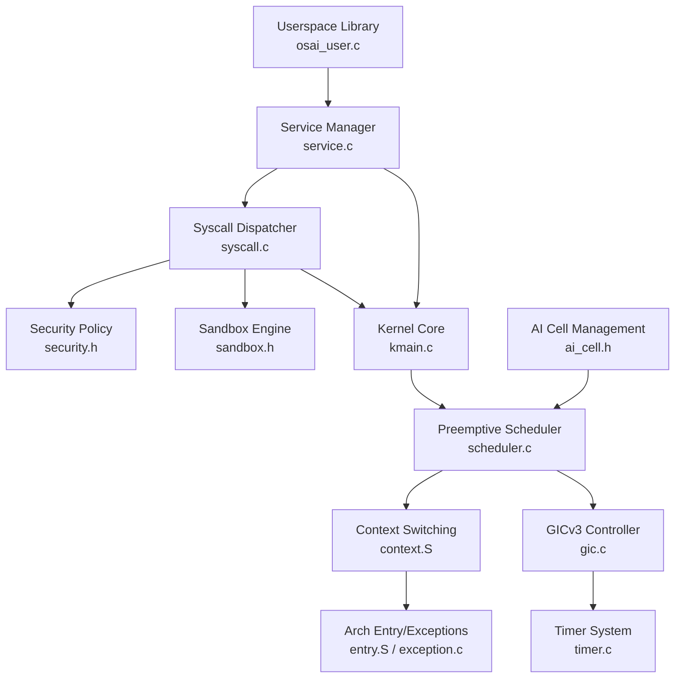

**Diagram sources**
- [osai_user.c](file://userspace/lib/osai_user.c)
- [service.c](file://kernel/user/service.c)
- [kmain.c](file://kernel/core/kmain.c)
- [security.h](file://kernel/include/osai/security.h)
- [sandbox.h](file://kernel/include/osai/sandbox.h)
- [syscall.c](file://kernel/user/syscall.c)
- [scheduler.c](file://kernel/sched/scheduler.c)
- [context.S](file://kernel/sched/context.S)
- [gic.c](file://kernel/arch/aarch64/gic.c)
- [timer.c](file://kernel/arch/aarch64/timer.c)
- [entry.S](file://kernel/arch/aarch64/entry.S)
- [exception.c](file://kernel/arch/aarch64/exception.c)
- [ai_cell.h](file://kernel/include/osai/ai_cell.h)

## Detailed Component Analysis

### Preemptive Scheduler Implementation
The scheduler provides comprehensive task management for single-core systems:

**Round-Robin Scheduling Algorithm:**
- Fixed quantum of 100 Hz (10ms) for fair time-slicing
- Circular runqueue with O(1) enqueue/dequeue operations
- Lock mechanism prevents race conditions during context switches
- Tick-based preemption with automatic task rotation

**Task State Management:**
- Task registration with PID allocation (1-16 max tasks)
- Runnable/blocked state transitions
- Context frame preservation for seamless resumption
- Statistics tracking for performance monitoring

**Context Frame Handling:**
- 288-byte AArch64 interrupt frame with full register preservation
- Preserves x0-x30, SP_EL1, SP_EL0, ELR_EL1, SPSR_EL1
- Supports both preemptive and cooperative context switching
- Automatic address space switching between tasks

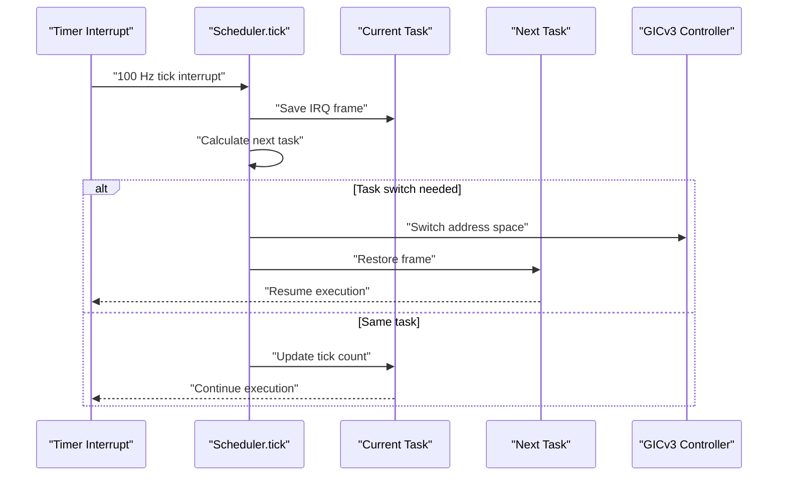

**Diagram sources**
- [scheduler.c](file://kernel/sched/scheduler.c)
- [context.S](file://kernel/sched/context.S)
- [gic.c](file://kernel/arch/aarch64/gic.c)
- [timer.c](file://kernel/arch/aarch64/timer.c)

**Section sources**
- [scheduler.h](file://kernel/include/osai/scheduler.h)
- [scheduler.c](file://kernel/sched/scheduler.c)
- [context.h](file://kernel/include/osai/context.h)
- [context.S](file://kernel/sched/context.S)
- [gic.h](file://kernel/include/osai/gic.h)
- [gic.c](file://kernel/arch/aarch64/gic.c)
- [timer.c](file://kernel/arch/aarch64/timer.c)

### GICv3 Interrupt Controller Integration
The Generic Interrupt Controller v3 provides hardware-level interrupt management:

**Initialization Sequence:**
- QEMU virtual GIC discovery and configuration
- Distributor setup with interrupt line detection
- Redistributor configuration for CPU 0
- Priority masking and group 1 enablement
- CPU interface activation with priority mask

**Interrupt Routing:**
- Timer PPI (Physical Private Interrupt 30) for scheduling
- Group 1 interrupts for kernel-level events
- Priority configuration for deterministic response
- Wake-up sequence for CPU sleep states

**Hardware Abstraction:**
- MMIO register access for GIC control
- System register manipulation via inline assembly
- Interrupt enable/disable sequences
- Self-testing capabilities for validation

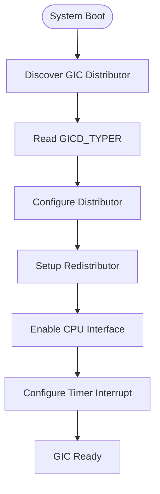

**Diagram sources**
- [gic.c](file://kernel/arch/aarch64/gic.c)
- [gic.h](file://kernel/include/osai/gic.h)

**Section sources**
- [gic.h](file://kernel/include/osai/gic.h)
- [gic.c](file://kernel/arch/aarch64/gic.c)

### Context Switching Mechanisms
The context switching system preserves full processor state across task transitions:

**Full Interrupt Frame Preservation:**
- 288-byte frame layout with 16-byte alignment
- Complete register state including callee-saved registers
- Stack pointer preservation for both EL0 and EL1
- Exception link register and processor state

**Cooperative vs Preemptive:**
- Cooperative switching for voluntary yields
- Preemptive switching for timer-based interruptions
- Atomic transition with minimal overhead
- Return address restoration for seamless continuation

**Assembly Implementation:**
- Optimized ARMv8 assembly for maximum performance
- Stack-based register preservation and restoration
- SP_EL0 and SP_EL1 stack pointer management
- Interrupt flag preservation and restoration

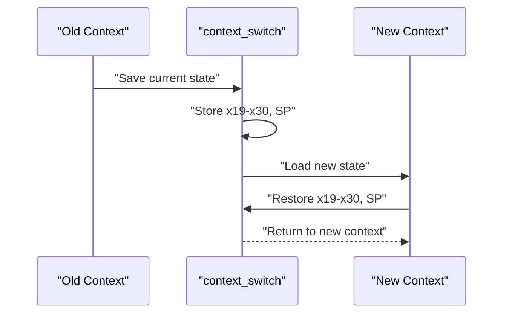

**Diagram sources**
- [context.S](file://kernel/sched/context.S)
- [context.h](file://kernel/include/osai/context.h)

**Section sources**
- [context.h](file://kernel/include/osai/context.h)
- [context.S](file://kernel/sched/context.S)

### AI Core Separation and Management
Dedicated AI workload isolation with specialized resource management:

**Cell Architecture:**
- Specialized AI processing units with dedicated cores
- Resource isolation through core masks and memory allocation
- Model arena management for AI model storage
- KV cache and workspace separation for data isolation

**State Management:**
- Cell lifecycle from EMPTY to RUNNING states
- Manifest-based configuration with core allocation
- Resource admission control and rejection tracking
- Transition counting for performance monitoring

**Integration Points:**
- Scheduler awareness for AI task prioritization
- Memory management for AI-specific data structures
- Network queue binding for AI inference workloads
- Git workspace integration for AI model development

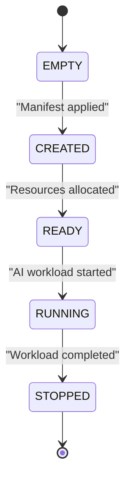

**Diagram sources**
- [ai_cell.h](file://kernel/include/osai/ai_cell.h)

**Section sources**
- [ai_cell.h](file://kernel/include/osai/ai_cell.h)

### Service Architecture and Process Supervision
The service manager coordinates with the scheduler for optimal process management:

**Enhanced Supervision:**
- Scheduler-aware service lifecycle management
- Time-slice allocation for responsive service execution
- Priority-based scheduling for critical services
- Resource contention resolution through scheduling

**Process Coordination:**
- Service registration with scheduler integration
- Automatic runnable state management
- Context switching for service thread execution
- Performance monitoring through scheduler statistics

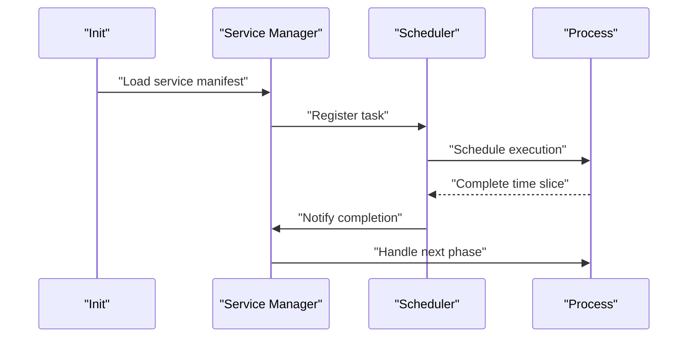

**Diagram sources**
- [service.c](file://kernel/user/service.c)
- [scheduler.c](file://kernel/sched/scheduler.c)
- [osai-init.conf](file://userspace/init/osai-init.conf)

**Section sources**
- [service.h](file://kernel/include/osai/service.h)
- [service.c](file://kernel/user/service.c)
- [scheduler.c](file://kernel/sched/scheduler.c)
- [osai-init.conf](file://userspace/init/osai-init.conf)

### Inter-Process Communication Mechanisms
IPC operates seamlessly with the scheduler and context switching infrastructure:

**Scheduler-Aware IPC:**
- Context switching during blocking IPC operations
- Priority inheritance for IPC synchronization
- Deadlock prevention through scheduler intervention
- Fair queuing for high-priority IPC messages

**Message Delivery:**
- Channel-based messaging with capability validation
- Interrupt-driven message delivery for real-time services
- Context preservation across IPC boundaries
- Priority-based message scheduling

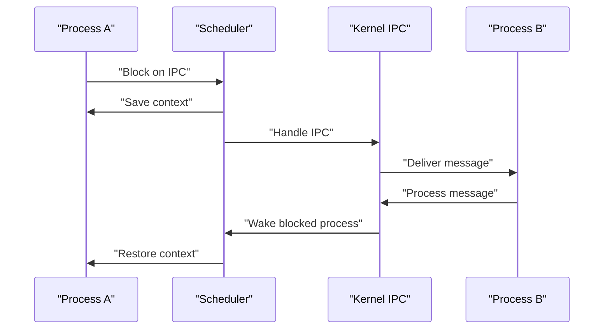

**Diagram sources**
- [syscall.c](file://kernel/user/syscall.c)
- [scheduler.c](file://kernel/sched/scheduler.c)
- [security.h](file://kernel/include/osai/security.h)

**Section sources**
- [syscall.h](file://kernel/include/osai/syscall.h)
- [syscall.c](file://kernel/user/syscall.c)
- [scheduler.c](file://kernel/sched/scheduler.c)
- [security.h](file://kernel/include/osai/security.h)

### Capability-Based Security and Sandboxing
Enhanced security with scheduler integration for process isolation:

**Scheduler-Aware Security:**
- Time-slice based security enforcement
- Priority-based access control for shared resources
- Context switching with security policy validation
- Audit trail integration with scheduler statistics

**Capability Management:**
- Capability validation during context switches
- Security policy enforcement at scheduler boundaries
- Resource access tracking through scheduler monitoring
- Violation detection through timing analysis

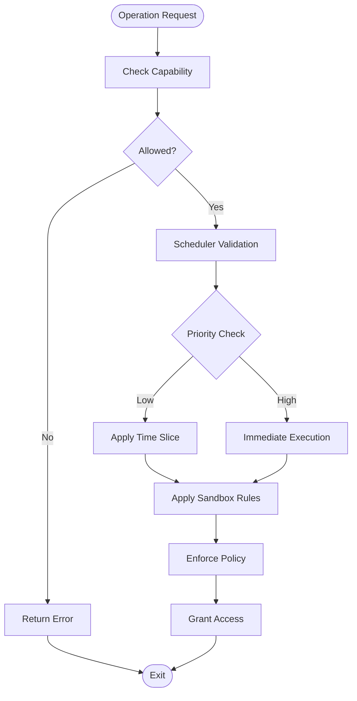

**Diagram sources**
- [sandbox.h](file://kernel/include/osai/sandbox.h)
- [security.h](file://kernel/include/osai/security.h)
- [scheduler.c](file://kernel/sched/scheduler.c)

**Section sources**
- [sandbox.h](file://kernel/include/osai/sandbox.h)
- [security.h](file://kernel/include/osai/security.h)
- [scheduler.c](file://kernel/sched/scheduler.c)

### Syscall Interface Design
The syscall interface integrates with the scheduler for optimal performance:

**Scheduler-Aware Syscalls:**
- Context switching for blocking system calls
- Priority-based syscall handling
- Timeout management through scheduler intervention
- Fair resource allocation across concurrent syscalls

**Interface Design:**
- System call numbers and ABI with scheduler metadata
- Parameter marshalling with context preservation
- Pre/post validation with security integration
- Fault handling with scheduler statistics tracking

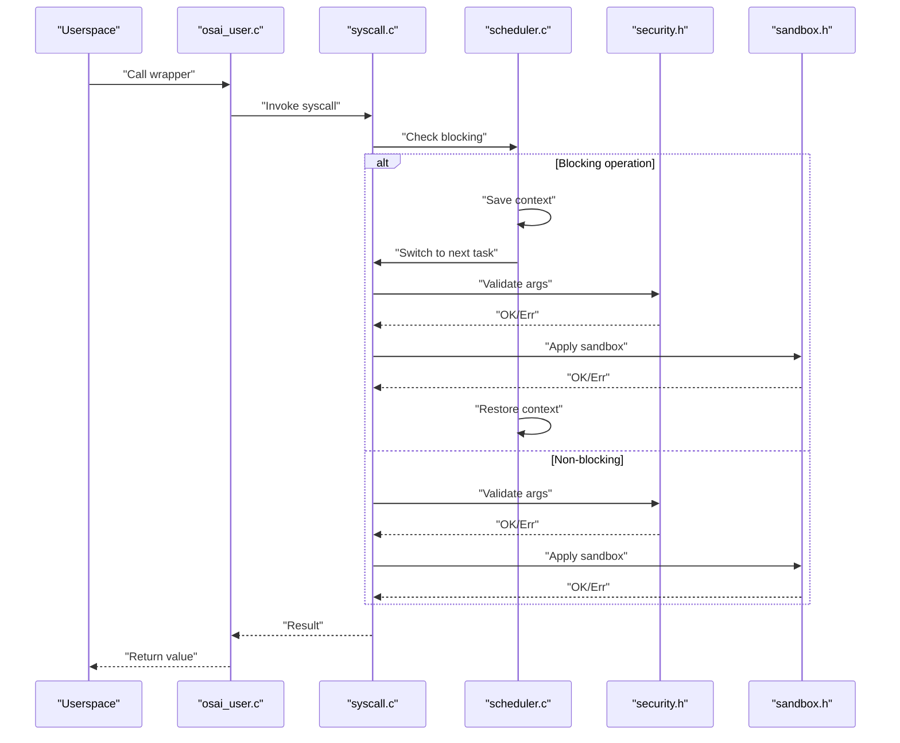

**Diagram sources**
- [syscall.h](file://kernel/include/osai/syscall.h)
- [syscall.c](file://kernel/user/syscall.c)
- [osai_user.c](file://userspace/lib/osai_user.c)
- [scheduler.c](file://kernel/sched/scheduler.c)
- [security.h](file://kernel/include/osai/security.h)
- [sandbox.h](file://kernel/include/osai/sandbox.h)

**Section sources**
- [syscall.h](file://kernel/include/osai/syscall.h)
- [syscall.c](file://kernel/user/syscall.c)
- [osai_user.c](file://userspace/lib/osai_user.c)
- [scheduler.c](file://kernel/sched/scheduler.c)
- [security.h](file://kernel/include/osai/security.h)
- [sandbox.h](file://kernel/include/osai/sandbox.h)

### Process Lifecycle Management
Enhanced lifecycle management with scheduler integration:

**Scheduler-Aware Stages:**
- Creation: Init loads service manifests, security evaluates, scheduler configures
- Running: Supervision monitors health, scheduler manages time slices, IPC coordinated
- Termination: Cleanup resources, scheduler releases contexts, state preserved if required

**Lifecycle Integration:**
- Task registration with scheduler during creation
- Automatic runnable state management
- Context switching for lifecycle transitions
- Performance statistics collection throughout lifecycle

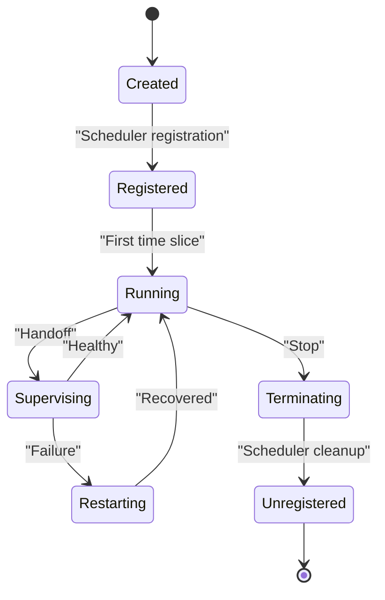

**Diagram sources**
- [service.c](file://kernel/user/service.c)
- [scheduler.c](file://kernel/sched/scheduler.c)
- [osai-init.conf](file://userspace/init/osai-init.conf)

**Section sources**
- [service.c](file://kernel/user/service.c)
- [scheduler.c](file://kernel/sched/scheduler.c)
- [osai-init.conf](file://userspace/init/osai-init.conf)

### Service Configuration Patterns and Hierarchies
Enhanced configuration with scheduler and AI cell integration:

**Multi-Dimensional Configuration:**
- Root services defined in init configuration with scheduler priorities
- AI cells configured with dedicated core masks and resource allocations
- Dependencies and ordering with time-slice considerations
- Policies and capabilities bound to service identities with security levels

**Hierarchical Management:**
- Top-down supervision with scheduler awareness
- Resource allocation with AI cell isolation
- Priority-based scheduling for service hierarchies
- Performance monitoring across service layers

**Section sources**
- [osai-init.conf](file://userspace/init/osai-init.conf)
- [service.h](file://kernel/include/osai/service.h)
- [ai_cell.h](file://kernel/include/osai/ai_cell.h)

### Monitoring and Telemetry
Enhanced monitoring with scheduler integration:

**Scheduler Statistics:**
- Context switch counts and timing analysis
- Tick distribution across tasks for fairness measurement
- Yield counts for cooperative scheduling effectiveness
- Runqueue utilization and task migration patterns

**Kernel Telemetry:**
- Syscall counts, failures, and latency with scheduler correlation
- Panic logs capturing fatal errors during process operations
- Klog providing structured logging for diagnostics with scheduler timestamps

**Performance Tracking:**
- Real-time monitoring of scheduler performance metrics
- AI cell resource utilization and isolation verification
- Interrupt handling latency and GICv3 performance
- Context switching overhead analysis

**Section sources**
- [telemetry.c](file://kernel/core/telemetry.c)
- [panic.c](file://kernel/core/panic.c)
- [klog.c](file://kernel/core/klog.c)
- [scheduler.c](file://kernel/sched/scheduler.c)

### Debugging Techniques and Troubleshooting
Enhanced debugging with scheduler and hardware integration:

**Scheduler Debugging:**
- Use fault injection scripts to simulate failures and validate supervision
- Employ process gate tests to verify lifecycle and IPC behavior
- Analyze scheduler statistics for performance bottlenecks
- Monitor context switch patterns for scheduling issues

**Hardware Integration Debugging:**
- Validate GICv3 initialization and interrupt routing
- Test timer interrupt generation and scheduler tick accuracy
- Verify context frame preservation across switches
- Debug AI cell isolation and resource allocation

**Diagnostic Tools:**
- Inspect kernel logs and telemetry for anomalies
- Validate capability grants and sandbox violations
- Monitor scheduler statistics for fairness and performance
- Trace interrupt handling through GICv3 and scheduler

**Section sources**
- [qemu-fault-injection.py](file://scripts/qemu-fault-injection.py)
- [qemu-process-gate.py](file://scripts/qemu-process-gate.py)
- [klog.c](file://kernel/core/klog.c)
- [panic.c](file://kernel/core/panic.c)
- [scheduler.c](file://kernel/sched/scheduler.c)
- [gic.c](file://kernel/arch/aarch64/gic.c)
- [context.S](file://kernel/sched/context.S)

## Dependency Analysis
Enhanced dependency graph with scheduler and hardware integration:

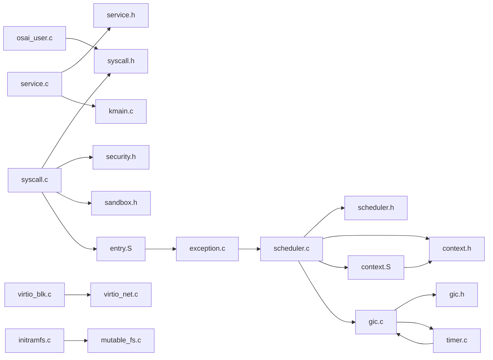

**Diagram sources**
- [service.c](file://kernel/user/service.c)
- [service.h](file://kernel/include/osai/service.h)
- [syscall.c](file://kernel/user/syscall.c)
- [syscall.h](file://kernel/include/osai/syscall.h)
- [security.h](file://kernel/include/osai/security.h)
- [sandbox.h](file://kernel/include/osai/sandbox.h)
- [scheduler.c](file://kernel/sched/scheduler.c)
- [scheduler.h](file://kernel/include/osai/scheduler.h)
- [context.h](file://kernel/include/osai/context.h)
- [context.S](file://kernel/sched/context.S)
- [gic.c](file://kernel/arch/aarch64/gic.c)
- [gic.h](file://kernel/include/osai/gic.h)
- [timer.c](file://kernel/arch/aarch64/timer.c)
- [osai_user.c](file://userspace/lib/osai_user.c)
- [kmain.c](file://kernel/core/kmain.c)
- [entry.S](file://kernel/arch/aarch64/entry.S)
- [exception.c](file://kernel/arch/aarch64/exception.c)
- [virtio_blk.c](file://kernel/dev/virtio/virtio_blk.c)
- [virtio_net.c](file://kernel/dev/virtio/virtio_net.c)
- [initramfs.c](file://kernel/fs/initramfs.c)
- [mutable_fs.c](file://kernel/fs/mutable_fs.c)

**Section sources**
- [service.c](file://kernel/user/service.c)
- [service.h](file://kernel/include/osai/service.h)
- [syscall.c](file://kernel/user/syscall.c)
- [syscall.h](file://kernel/include/osai/syscall.h)
- [security.h](file://kernel/include/osai/security.h)
- [sandbox.h](file://kernel/include/osai/sandbox.h)
- [scheduler.c](file://kernel/sched/scheduler.c)
- [scheduler.h](file://kernel/include/osai/scheduler.h)
- [context.h](file://kernel/include/osai/context.h)
- [context.S](file://kernel/sched/context.S)
- [gic.c](file://kernel/arch/aarch64/gic.c)
- [gic.h](file://kernel/include/osai/gic.h)
- [timer.c](file://kernel/arch/aarch64/timer.c)
- [osai_user.c](file://userspace/lib/osai_user.c)
- [kmain.c](file://kernel/core/kmain.c)
- [entry.S](file://kernel/arch/aarch64/entry.S)
- [exception.c](file://kernel/arch/aarch64/exception.c)
- [virtio_blk.c](file://kernel/dev/virtio/virtio_blk.c)
- [virtio_net.c](file://kernel/dev/virtio/virtio_net.c)
- [initramfs.c](file://kernel/fs/initramfs.c)
- [mutable_fs.c](file://kernel/fs/mutable_fs.c)

## Performance Considerations
Enhanced performance optimization with scheduler integration:

**Scheduler Optimization:**
- Minimize context switching overhead through efficient frame handling
- Optimize timer interrupt frequency for balancing responsiveness and overhead
- Use capability caching to reduce repeated policy checks during scheduling
- Implement priority-based scheduling for critical service responsiveness

**Hardware Integration:**
- Leverage GICv3 interrupt handling for low-latency scheduling
- Optimize memory access patterns for context frame preservation
- Use dedicated AI cores for isolation and performance separation
- Minimize IPC overhead by batching messages and reusing channels

**Monitoring and Tuning:**
- Use scheduler statistics to identify hotspots and optimization opportunities
- Monitor context switch rates and adjust timer frequencies accordingly
- Track AI cell resource utilization for optimal core allocation
- Analyze interrupt latency through GICv3 performance metrics

## Troubleshooting Guide
Enhanced troubleshooting with scheduler and hardware debugging:

**Scheduler Issues:**
- Service fails to start: Verify init configuration and capability grants; check security policy decisions; analyze scheduler registration failures
- Excessive context switches: Review scheduler statistics; optimize timer frequency; check for busy-waiting loops
- Starvation detection: Monitor scheduler tick distribution; adjust task priorities; validate fairness algorithms
- Performance degradation: Inspect scheduler statistics; analyze context switching overhead; check for memory pressure

**Hardware Integration Issues:**
- GICv3 initialization failures: Verify MMIO access; check interrupt routing; validate CPU interface configuration
- Timer interrupt problems: Test timer frequency calculation; verify compare value setting; check interrupt enable sequences
- Context frame corruption: Validate assembly implementation; check stack alignment; verify register preservation
- AI cell isolation failures: Confirm core mask application; verify resource separation; check memory protection

**Diagnostic Approaches:**
- Use fault injection scripts to simulate failures and validate supervision
- Employ process gate tests to verify lifecycle and IPC behavior
- Inspect kernel logs and telemetry for anomalies with scheduler timestamps
- Validate capability grants and sandbox violations through scheduler monitoring
- Analyze GICv3 register states and interrupt handling sequences

**Section sources**
- [panic.c](file://kernel/core/panic.c)
- [klog.c](file://kernel/core/klog.c)
- [qemu-fault-injection.py](file://scripts/qemu-fault-injection.py)
- [qemu-process-gate.py](file://scripts/qemu-process-gate.py)
- [scheduler.c](file://kernel/sched/scheduler.c)
- [gic.c](file://kernel/arch/aarch64/gic.c)
- [context.S](file://kernel/sched/context.S)

## Conclusion
OSAI's process model now combines a microkernel architecture with comprehensive preemptive scheduling, GICv3 hardware integration, and dedicated AI core separation. The real-time scheduler provides fair time-slicing with 288-byte interrupt frame preservation, while the GICv3 controller ensures reliable interrupt handling for single-core systems. The scheduler infrastructure supports both cooperative and preemptive context switching, enabling responsive service execution and effective AI workload isolation. The service manager orchestrates process lifecycles with scheduler awareness, while the sandbox and security modules enforce isolation and policy. Userspace libraries provide safe, ergonomic APIs with enhanced performance monitoring. Robust monitoring, logging, and testing tools support ongoing maintenance and troubleshooting across the integrated scheduler and hardware subsystems.