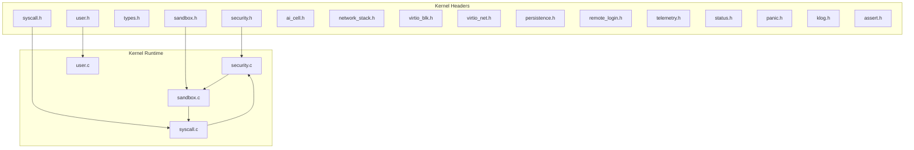
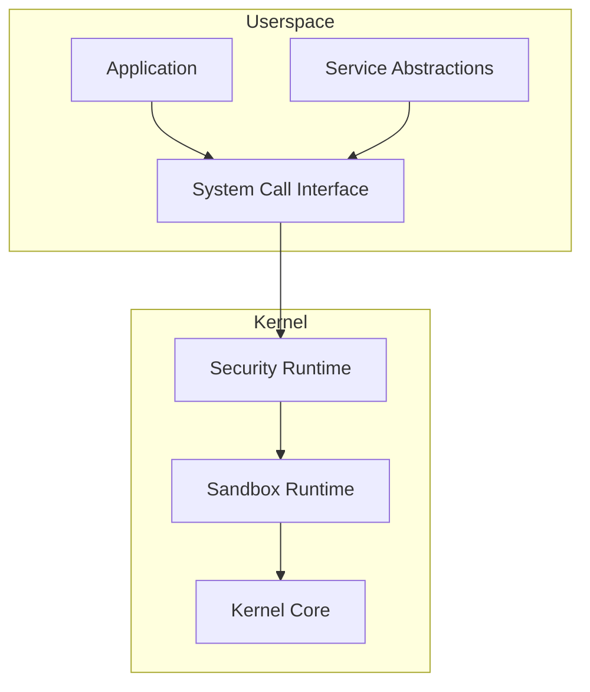
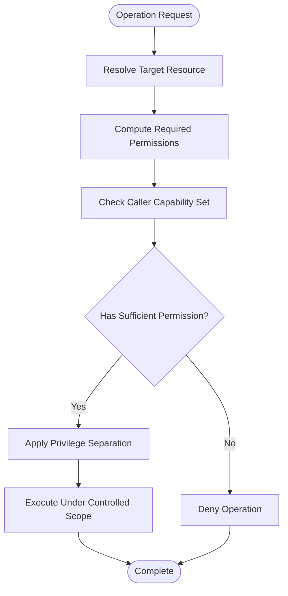
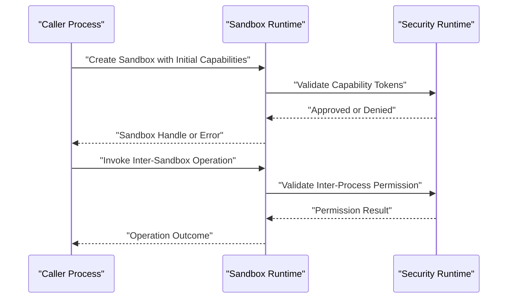
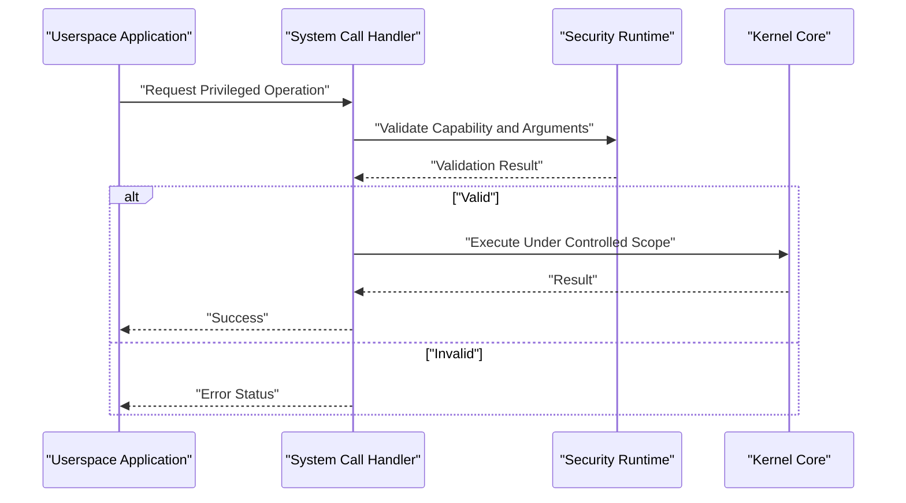
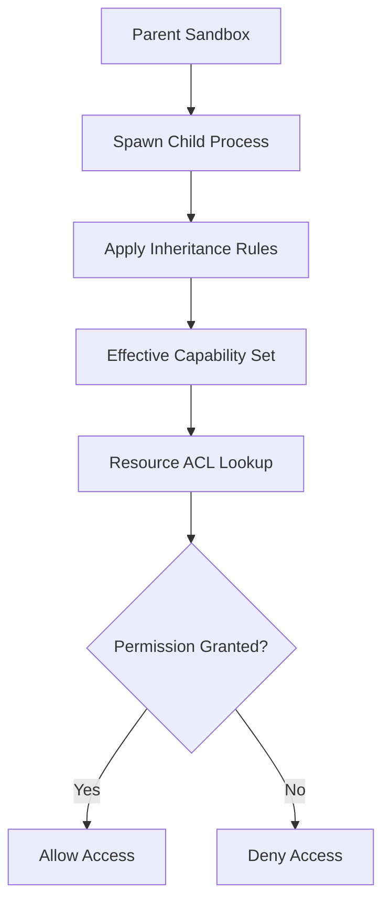
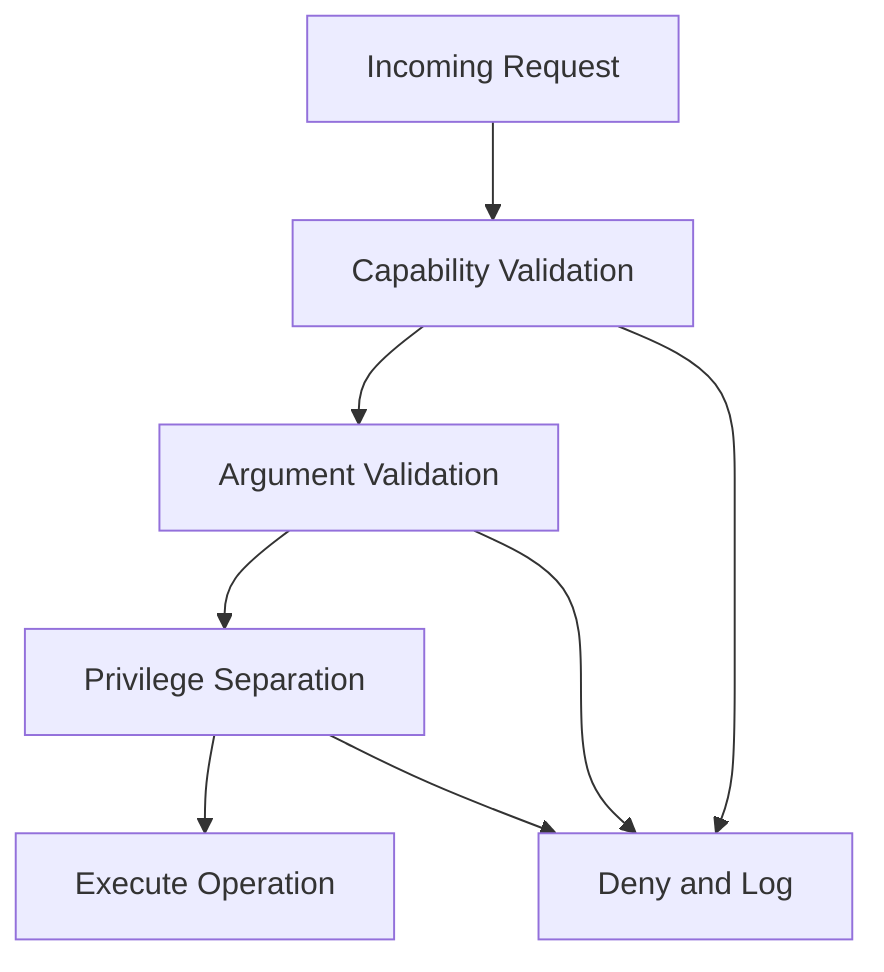
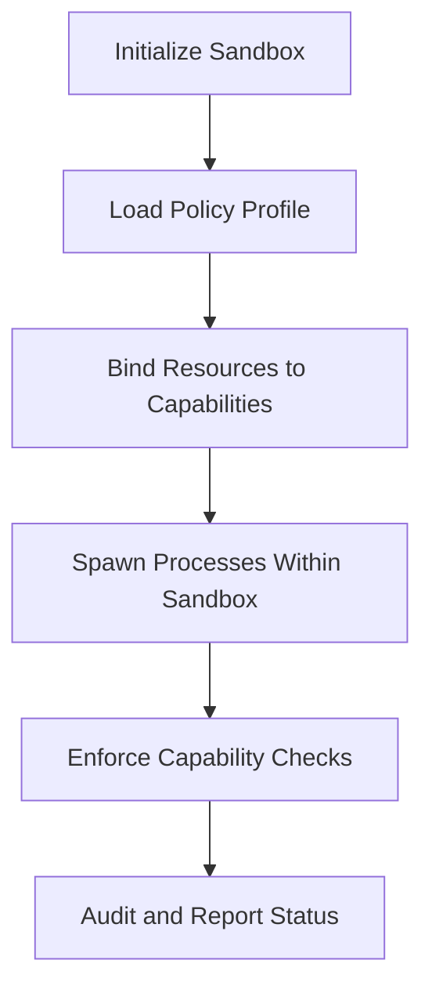
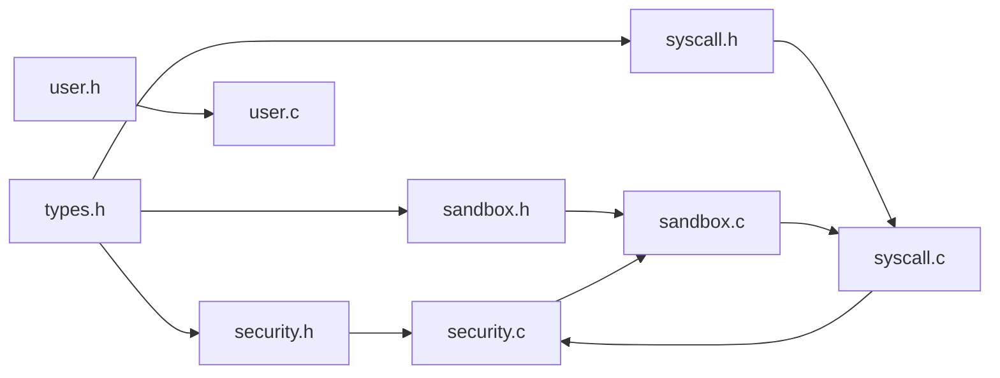

# Sandbox Security

<cite>
**Referenced Files in This Document**
- [security.h](file://kernel/include/osai/security.h)
- [security.c](file://kernel/runtime/security.c)
- [sandbox.h](file://kernel/include/osai/sandbox.h)
- [sandbox.c](file://kernel/runtime/sandbox.c)
- [syscall.h](file://kernel/include/osai/syscall.h)
- [syscall.c](file://kernel/user/syscall.c)
- [types.h](file://kernel/include/osai/types.h)
- [user.h](file://kernel/include/osai/user.h)
- [user.c](file://kernel/user/user.c)
- [service.h](file://kernel/include/osai/service.h)
- [ai_cell.h](file://kernel/include/osai/ai_cell.h)
- [network_stack.h](file://kernel/include/osai/network_stack.h)
- [virtio_blk.h](file://kernel/include/osai/virtio_blk.h)
- [virtio_net.h](file://kernel/include/osai/virtio_net.h)
- [persistence.h](file://kernel/include/osai/persistence.h)
- [remote_login.h](file://kernel/include/osai/remote_login.h)
- [telemetry.h](file://kernel/include/osai/telemetry.h)
- [status.h](file://kernel/include/osai/status.h)
- [panic.h](file://kernel/include/osai/panic.h)
- [klog.h](file://kernel/include/osai/klog.h)
- [assert.h](file://kernel/include/osai/assert.h)
- [README.md](file://README.md)
- [SECURITY.md](file://SECURITY.md)
</cite>

## Table of Contents
1. [Introduction](#introduction)
2. [Project Structure](#project-structure)
3. [Core Components](#core-components)
4. [Architecture Overview](#architecture-overview)
5. [Detailed Component Analysis](#detailed-component-analysis)
6. [Dependency Analysis](#dependency-analysis)
7. [Performance Considerations](#performance-considerations)
8. [Troubleshooting Guide](#troubleshooting-guide)
9. [Conclusion](#conclusion)
10. [Appendices](#appendices)

## Introduction
This document explains OSAI’s capability-based sandbox security model. It covers how capabilities are modeled, how permissions are validated, and how privilege separation is enforced across system calls, resource access, and inter-process operations. It also documents the sandbox creation lifecycle, configuration, enforcement policies, and secure coding practices grounded in the repository’s security primitives.

OSAI’s kernel exposes a security runtime and a sandbox runtime that together define capability tokens, access control semantics, and enforcement boundaries. Userspace interacts via system calls that are validated against the current process’ capability set.

## Project Structure
The security model spans kernel headers and runtime implementations under kernel/include/osai and kernel/runtime. Key areas include:
- Capability and permission types
- Sandbox runtime and enforcement
- System call interface and validation
- Userspace helpers and service abstractions

**Diagram sources**
- [security.h](file://kernel/include/osai/security.h)
- [sandbox.h](file://kernel/include/osai/sandbox.h)
- [syscall.h](file://kernel/include/osai/syscall.h)
- [user.h](file://kernel/include/osai/user.h)
- [security.c](file://kernel/runtime/security.c)
- [sandbox.c](file://kernel/runtime/sandbox.c)
- [syscall.c](file://kernel/user/syscall.c)
- [user.c](file://kernel/user/user.c)

**Section sources**
- [README.md](file://README.md)
- [SECURITY.md](file://SECURITY.md)

## Core Components
- Capability types and permission sets: Defined in header files to represent capability tokens and permission masks used for access control.
- Security runtime: Implements capability validation, permission checks, and privilege separation for system calls and resource access.
- Sandbox runtime: Manages sandbox creation, capability assignment, and enforcement boundaries.
- System call interface: Exposes userspace entry points that are validated against the caller’s capabilities.
- Userspace helpers: Provide safe wrappers and service abstractions for capability-aware operations.

Key responsibilities:
- Enforce capability-based access control for AI cell operations, networking, block devices, persistence, remote login, and telemetry.
- Validate system calls and enforce privilege separation between unprivileged and privileged contexts.
- Provide audit-ready status reporting and panic/panic-safe logging for security events.

**Section sources**
- [security.h](file://kernel/include/osai/security.h)
- [sandbox.h](file://kernel/include/osai/sandbox.h)
- [types.h](file://kernel/include/osai/types.h)
- [user.h](file://kernel/include/osai/user.h)
- [service.h](file://kernel/include/osai/service.h)

## Architecture Overview
OSAI’s sandbox security architecture is centered on capability tokens and permission validation. The kernel enforces access control by checking a process’ capability set against requested operations. System calls are gateways to privileged resources; they are validated by the security runtime before execution. Sandboxes encapsulate capability sets and operational boundaries.

**Diagram sources**
- [security.c](file://kernel/runtime/security.c)
- [sandbox.c](file://kernel/runtime/sandbox.c)
- [syscall.c](file://kernel/user/syscall.c)
- [user.c](file://kernel/user/user.c)

## Detailed Component Analysis

### Capability Types and Permission Model
Capabilities are represented as typed tokens with associated permission masks. These tokens define what operations a process can perform and against which resources. Permission validation routines check whether a capability grants sufficient rights for a given operation.

- Capability tokens: Unique identifiers bound to permission sets.
- Permission masks: Bitfields representing allowed operations (e.g., read, write, execute).
- Permission inheritance: Capabilities may be inherited or delegated according to sandbox policy.

Validation flow:
- On each operation, resolve the target resource and compute required permissions.
- Check caller’s capability set against required permissions.
- Deny if insufficient; otherwise, proceed with privilege separation.

**Diagram sources**
- [security.h](file://kernel/include/osai/security.h)
- [security.c](file://kernel/runtime/security.c)

**Section sources**
- [security.h](file://kernel/include/osai/security.h)
- [types.h](file://kernel/include/osai/types.h)

### Sandbox Runtime
The sandbox runtime manages sandbox creation, capability assignment, and enforcement boundaries. It ensures that each sandbox operates within a defined set of capabilities and that cross-sandbox interactions are mediated.

Key responsibilities:
- Create sandboxes with initial capability sets.
- Apply capability inheritance rules.
- Enforce boundary checks for inter-process operations.
- Track sandbox state and status for auditing.

**Diagram sources**
- [sandbox.c](file://kernel/runtime/sandbox.c)
- [security.c](file://kernel/runtime/security.c)
- [sandbox.h](file://kernel/include/osai/sandbox.h)
- [security.h](file://kernel/include/osai/security.h)

**Section sources**
- [sandbox.c](file://kernel/runtime/sandbox.c)
- [sandbox.h](file://kernel/include/osai/sandbox.h)

### System Call Validation and Privilege Separation
System calls are the primary entry points for userspace to request privileged operations. The system call interface validates requests against the caller’s capability set and enforces privilege separation.

- Request validation: Verify arguments and requested operation align with caller’s capabilities.
- Privilege separation: Perform sensitive operations in a restricted kernel context.
- Status reporting: Return structured status codes indicating success or failure reasons.

**Diagram sources**
- [syscall.c](file://kernel/user/syscall.c)
- [security.c](file://kernel/runtime/security.c)
- [syscall.h](file://kernel/include/osai/syscall.h)

**Section sources**
- [syscall.c](file://kernel/user/syscall.c)
- [syscall.h](file://kernel/include/osai/syscall.h)
- [security.c](file://kernel/runtime/security.c)

### Access Control Lists and Permission Inheritance
Access control lists (ACLs) associate resources with capability tokens and permission masks. Permission inheritance defines how capabilities propagate across processes and services spawned within a sandbox.

- ACL binding: Map resources (files, devices, services) to capability sets.
- Inheritance rules: Define parent-to-child capability propagation and delegation policies.
- Enforcement: Validate each access against the effective capability set.

**Diagram sources**
- [sandbox.c](file://kernel/runtime/sandbox.c)
- [security.c](file://kernel/runtime/security.c)
- [types.h](file://kernel/include/osai/types.h)

**Section sources**
- [sandbox.c](file://kernel/runtime/sandbox.c)
- [security.c](file://kernel/runtime/security.c)
- [types.h](file://kernel/include/osai/types.h)

### Security Validation Mechanisms
Validation occurs across three layers:
- Capability validation: Ensures the caller possesses the required capability tokens.
- Argument validation: Confirms request parameters are sane and bounded.
- Privilege separation: Executes sensitive operations in a restricted kernel context.

Common validations:
- Resource existence and type checks.
- Boundary checks for memory and I/O operations.
- Audit logging for denied operations.

**Diagram sources**
- [security.c](file://kernel/runtime/security.c)
- [syscall.c](file://kernel/user/syscall.c)

**Section sources**
- [security.c](file://kernel/runtime/security.c)
- [syscall.c](file://kernel/user/syscall.c)

### Sandbox Creation, Configuration, and Enforcement Policies
Creation:
- Initialize sandbox with a capability set and policy profile.
- Bind resources to capability tokens via ACLs.

Configuration:
- Define capability inheritance rules.
- Configure inter-process communication boundaries.
- Set up auditing and status reporting hooks.

Enforcement:
- Enforce capability checks on all system calls.
- Monitor inter-sandbox operations.
- Report violations and trigger panic/logging when appropriate.

**Diagram sources**
- [sandbox.c](file://kernel/runtime/sandbox.c)
- [security.c](file://kernel/runtime/security.c)
- [status.h](file://kernel/include/osai/status.h)

**Section sources**
- [sandbox.c](file://kernel/runtime/sandbox.c)
- [security.c](file://kernel/runtime/security.c)
- [status.h](file://kernel/include/osai/status.h)

### Practical Examples
Note: The following describe typical usage patterns without reproducing code. See the referenced files for precise APIs and definitions.

- Capability usage:
  - Acquire a capability token for a specific resource (e.g., a virtualized device or service).
  - Use the token to request operations via system calls; the kernel validates the capability before executing.

- Permission granting:
  - Assign capability tokens to child processes during spawn to grant scoped permissions.
  - Revoke or restrict capabilities by adjusting the capability set prior to spawning.

- Security policy implementation:
  - Define ACLs mapping resources to capability sets.
  - Enforce policy by validating each operation against the effective capability set.

- Inter-process operations:
  - Mediate IPC using capability tokens; validate sender and receiver capabilities for the operation.
  - Log and report denied operations for auditing.

- Secure coding practices:
  - Always validate inputs and arguments in system call handlers.
  - Prefer least-privilege capability sets for each process.
  - Use panic-safe logging for security events and violations.

**Section sources**
- [security.h](file://kernel/include/osai/security.h)
- [sandbox.h](file://kernel/include/osai/sandbox.h)
- [syscall.h](file://kernel/include/osai/syscall.h)
- [types.h](file://kernel/include/osai/types.h)
- [user.h](file://kernel/include/osai/user.h)

## Dependency Analysis
The security model exhibits layered dependencies:
- Headers define capability types, permissions, and system call contracts.
- Runtime implementations enforce validation and privilege separation.
- Userspace relies on system calls and service abstractions to interact securely.

**Diagram sources**
- [types.h](file://kernel/include/osai/types.h)
- [security.h](file://kernel/include/osai/security.h)
- [sandbox.h](file://kernel/include/osai/sandbox.h)
- [syscall.h](file://kernel/include/osai/syscall.h)
- [user.h](file://kernel/include/osai/user.h)
- [security.c](file://kernel/runtime/security.c)
- [sandbox.c](file://kernel/runtime/sandbox.c)
- [syscall.c](file://kernel/user/syscall.c)
- [user.c](file://kernel/user/user.c)

**Section sources**
- [types.h](file://kernel/include/osai/types.h)
- [security.h](file://kernel/include/osai/security.h)
- [sandbox.h](file://kernel/include/osai/sandbox.h)
- [syscall.h](file://kernel/include/osai/syscall.h)
- [user.h](file://kernel/include/osai/user.h)
- [security.c](file://kernel/runtime/security.c)
- [sandbox.c](file://kernel/runtime/sandbox.c)
- [syscall.c](file://kernel/user/syscall.c)
- [user.c](file://kernel/user/user.c)

## Performance Considerations
- Minimize capability checks overhead by batching related operations and caching frequently accessed capability states.
- Keep capability sets minimal to reduce validation cost.
- Use efficient ACL lookup structures (e.g., hash maps keyed by resource identifiers) to accelerate permission decisions.
- Offload non-critical logging to asynchronous buffers to avoid blocking privileged operations.

## Troubleshooting Guide
- Violation detection:
  - Review status codes returned by system calls and security routines to identify denial reasons.
  - Use panic-safe logging to capture denied operations and their context.

- Secure coding practices:
  - Validate all inputs and enforce strict argument bounds.
  - Prefer least-privilege capability sets and avoid broad grants.
  - Instrument capability checks with clear error messages for debugging.

- Auditing:
  - Enable status reporting and logging hooks to track capability usage and denials.
  - Correlate system call traces with capability sets to diagnose policy misconfigurations.

**Section sources**
- [status.h](file://kernel/include/osai/status.h)
- [panic.h](file://kernel/include/osai/panic.h)
- [klog.h](file://kernel/include/osai/klog.h)
- [assert.h](file://kernel/include/osai/assert.h)
- [security.c](file://kernel/runtime/security.c)
- [syscall.c](file://kernel/user/syscall.c)

## Conclusion
OSAI’s capability-based sandbox security model provides strong isolation and controlled access to system resources. By combining capability tokens, permission validation, and privilege separation, the kernel enforces robust security boundaries. Proper sandbox configuration, disciplined capability management, and comprehensive auditing enable secure development and deployment of system components.

## Appendices
- Reference headers and runtime files for detailed API definitions and implementation specifics.
- Consult the project’s README and SECURITY documents for broader context and responsible disclosure practices.

**Section sources**
- [README.md](file://README.md)
- [SECURITY.md](file://SECURITY.md)