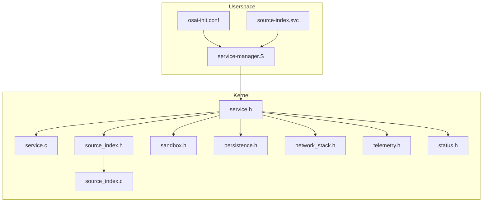
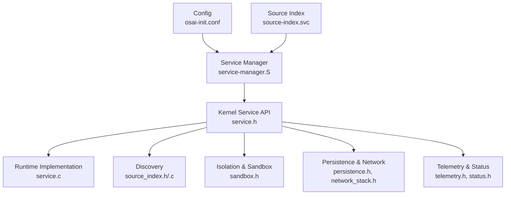
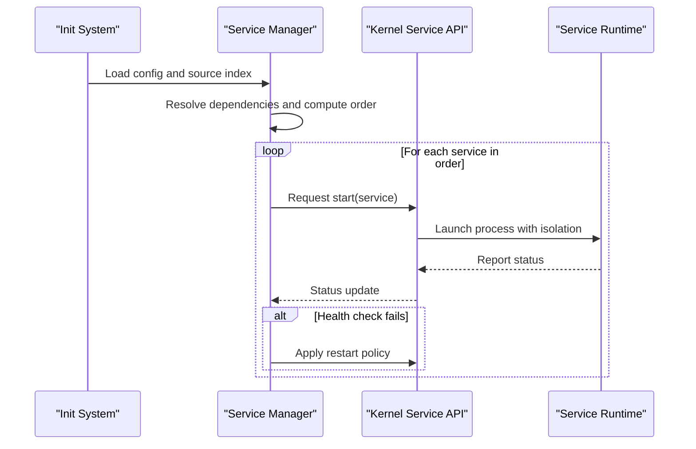
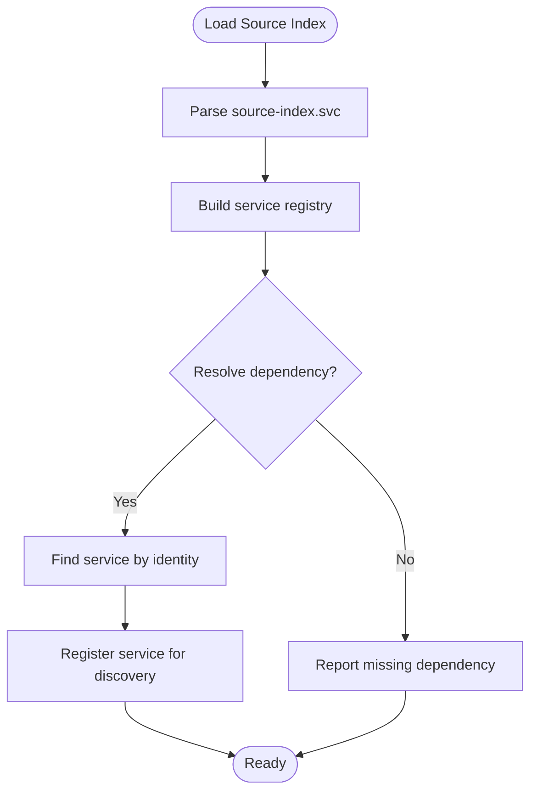
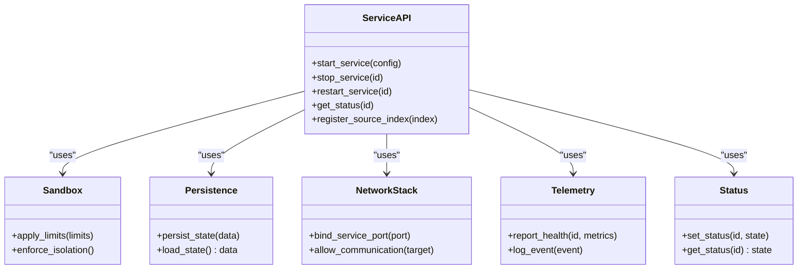
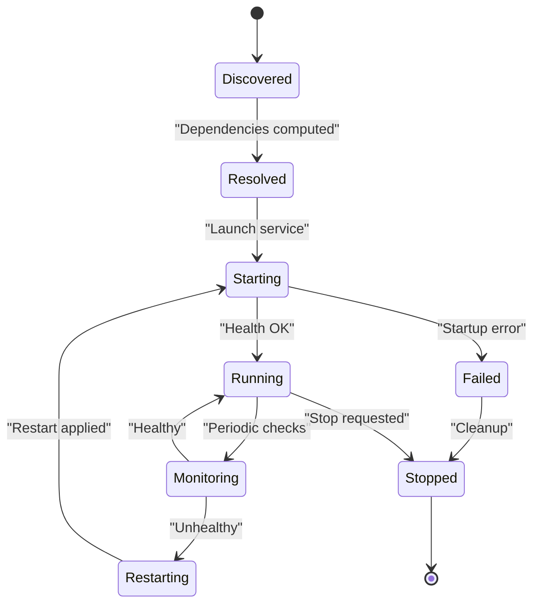
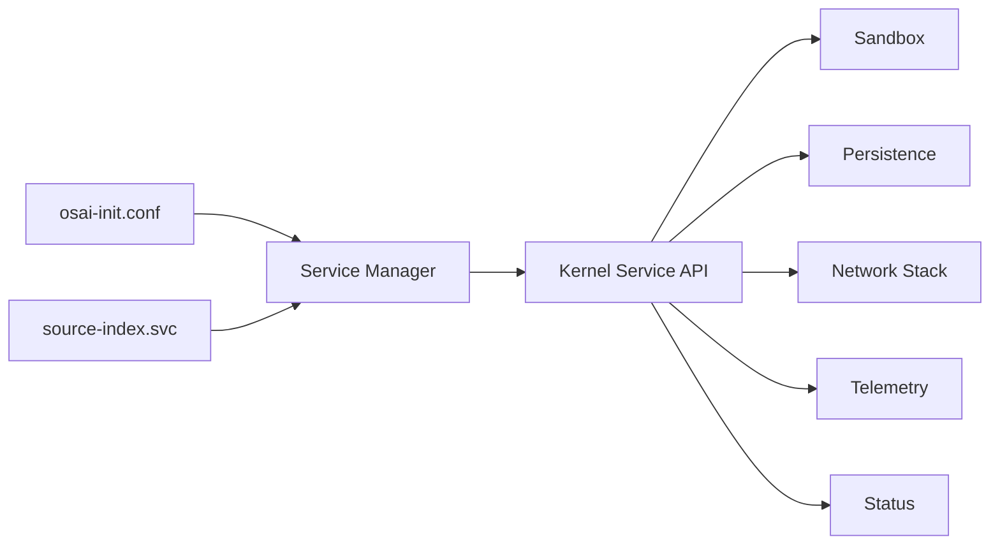

# Service Architecture

<cite>
**Referenced Files in This Document**
- [osai-init.conf](file://userspace/init/osai-init.conf)
- [service-manager.S](file://userspace/service-manager/service-manager.S)
- [source-index.svc](file://userspace/service-manager/source-index.svc)
- [service.h](file://kernel/include/osai/service.h)
- [service.c](file://kernel/user/service.c)
- [source_index.h](file://kernel/include/osai/source_index.h)
- [source_index.c](file://kernel/runtime/source_index.c)
- [sandbox.h](file://kernel/include/osai/sandbox.h)
- [persistence.h](file://kernel/include/osai/persistence.h)
- [network_stack.h](file://kernel/include/osai/network_stack.h)
- [telemetry.h](file://kernel/include/osai/telemetry.h)
- [status.h](file://kernel/include/osai/status.h)
</cite>

## Table of Contents
1. [Introduction](#introduction)
2. [Project Structure](#project-structure)
3. [Core Components](#core-components)
4. [Architecture Overview](#architecture-overview)
5. [Detailed Component Analysis](#detailed-component-analysis)
6. [Dependency Analysis](#dependency-analysis)
7. [Performance Considerations](#performance-considerations)
8. [Troubleshooting Guide](#troubleshooting-guide)
9. [Conclusion](#conclusion)

## Introduction
This document describes OSAI's service architecture and management system. It explains how services are configured, discovered, supervised, and monitored, along with their lifecycle management, dependency resolution, isolation, and inter-service communication patterns. The focus areas include:
- Service Manager role in process supervision and lifecycle control
- Service configuration via osai-init.conf
- Source index mechanism for service discovery and registration
- Health checks and automatic restart policies
- Practical examples for creating and managing services
- Isolation, resource limits, and communication patterns

## Project Structure
OSAI organizes service-related functionality across userspace and kernel layers:
- Userspace configuration and manager: osai-init.conf, service-manager.S, source-index.svc
- Kernel service interfaces and runtime: service.h, service.c, source_index.h, source_index.c
- Isolation and infrastructure: sandbox.h, persistence.h, network_stack.h, telemetry.h, status.h

**Diagram sources**
- [osai-init.conf](file://userspace/init/osai-init.conf)
- [service-manager.S](file://userspace/service-manager/service-manager.S)
- [source-index.svc](file://userspace/service-manager/source-index.svc)
- [service.h](file://kernel/include/osai/service.h)
- [service.c](file://kernel/user/service.c)
- [source_index.h](file://kernel/include/osai/source_index.h)
- [source_index.c](file://kernel/runtime/source_index.c)
- [sandbox.h](file://kernel/include/osai/sandbox.h)
- [persistence.h](file://kernel/include/osai/persistence.h)
- [network_stack.h](file://kernel/include/osai/network_stack.h)
- [telemetry.h](file://kernel/include/osai/telemetry.h)
- [status.h](file://kernel/include/osai/status.h)

**Section sources**
- [osai-init.conf](file://userspace/init/osai-init.conf)
- [service-manager.S](file://userspace/service-manager/service-manager.S)
- [source-index.svc](file://userspace/service-manager/source-index.svc)
- [service.h](file://kernel/include/osai/service.h)
- [service.c](file://kernel/user/service.c)
- [source_index.h](file://kernel/include/osai/source_index.h)
- [source_index.c](file://kernel/runtime/source_index.c)
- [sandbox.h](file://kernel/include/osai/sandbox.h)
- [persistence.h](file://kernel/include/osai/persistence.h)
- [network_stack.h](file://kernel/include/osai/network_stack.h)
- [telemetry.h](file://kernel/include/osai/telemetry.h)
- [status.h](file://kernel/include/osai/status.h)

## Core Components
- Service Manager: orchestrates service lifecycle, supervises processes, enforces startup order, and applies restart policies.
- Service Configuration: osai-init.conf defines services, their dependencies, and startup ordering.
- Source Index: maintains a registry of discoverable services for dynamic discovery and registration.
- Kernel Service Interfaces: define service contracts, isolation boundaries, and operational primitives.
- Monitoring and Telemetry: health checks, status reporting, and observability hooks.

Key responsibilities:
- Process supervision and restart policies
- Dependency resolution and startup sequencing
- Service discovery and registration
- Resource isolation and sandboxing
- Inter-service communication and networking
- Persistence and status tracking

**Section sources**
- [service-manager.S](file://userspace/service-manager/service-manager.S)
- [osai-init.conf](file://userspace/init/osai-init.conf)
- [source-index.svc](file://userspace/service-manager/source-index.svc)
- [service.h](file://kernel/include/osai/service.h)
- [service.c](file://kernel/user/service.c)
- [source_index.h](file://kernel/include/osai/source_index.h)
- [source_index.c](file://kernel/runtime/source_index.c)
- [sandbox.h](file://kernel/include/osai/sandbox.h)
- [persistence.h](file://kernel/include/osai/persistence.h)
- [network_stack.h](file://kernel/include/osai/network_stack.h)
- [telemetry.h](file://kernel/include/osai/telemetry.h)
- [status.h](file://kernel/include/osai/status.h)

## Architecture Overview
The service architecture comprises a userspace manager coordinating kernel-level service primitives. The manager reads configuration and source index, resolves dependencies, starts services in order, monitors health, and enforces restart policies. Kernel interfaces provide isolation, persistence, networking, telemetry, and status reporting.

**Diagram sources**
- [service-manager.S](file://userspace/service-manager/service-manager.S)
- [osai-init.conf](file://userspace/init/osai-init.conf)
- [source-index.svc](file://userspace/service-manager/source-index.svc)
- [service.h](file://kernel/include/osai/service.h)
- [service.c](file://kernel/user/service.c)
- [source_index.h](file://kernel/include/osai/source_index.h)
- [source_index.c](file://kernel/runtime/source_index.c)
- [sandbox.h](file://kernel/include/osai/sandbox.h)
- [persistence.h](file://kernel/include/osai/persistence.h)
- [network_stack.h](file://kernel/include/osai/network_stack.h)
- [telemetry.h](file://kernel/include/osai/telemetry.h)
- [status.h](file://kernel/include/osai/status.h)

## Detailed Component Analysis

### Service Manager
The Service Manager controls service lifecycle and supervision:
- Reads configuration and source index
- Resolves dependencies and computes startup order
- Starts services sequentially and monitors health
- Applies restart policies on failure
- Coordinates with kernel service interfaces for isolation and telemetry

**Diagram sources**
- [service-manager.S](file://userspace/service-manager/service-manager.S)
- [service.h](file://kernel/include/osai/service.h)
- [service.c](file://kernel/user/service.c)

**Section sources**
- [service-manager.S](file://userspace/service-manager/service-manager.S)
- [service.h](file://kernel/include/osai/service.h)
- [service.c](file://kernel/user/service.c)

### Service Configuration (osai-init.conf)
The configuration file defines services, their dependencies, and startup ordering. Typical entries include:
- Service identity and executable path
- Dependencies on other services
- Startup ordering hints
- Optional resource limits and isolation parameters

Practical usage:
- Define a base service with minimal dependencies
- Add dependent services that require the base service to be ready
- Use explicit ordering to ensure correct startup sequence

**Section sources**
- [osai-init.conf](file://userspace/init/osai-init.conf)

### Source Index Mechanism
The source index enables dynamic discovery and registration of services:
- Maintains a registry of available services
- Supports lookup by service identity
- Provides metadata for discovery and dependency resolution
- Integrated with the Service Manager for runtime registration

**Diagram sources**
- [source-index.svc](file://userspace/service-manager/source-index.svc)
- [source_index.h](file://kernel/include/osai/source_index.h)
- [source_index.c](file://kernel/runtime/source_index.c)

**Section sources**
- [source-index.svc](file://userspace/service-manager/source-index.svc)
- [source_index.h](file://kernel/include/osai/source_index.h)
- [source_index.c](file://kernel/runtime/source_index.c)

### Kernel Service Interfaces
The kernel exposes service primitives for lifecycle control, isolation, and observability:
- Service contract definitions and status reporting
- Sandbox and isolation boundaries
- Persistence and network stack integration
- Telemetry hooks for health and metrics
- Status tracking and error reporting

**Diagram sources**
- [service.h](file://kernel/include/osai/service.h)
- [sandbox.h](file://kernel/include/osai/sandbox.h)
- [persistence.h](file://kernel/include/osai/persistence.h)
- [network_stack.h](file://kernel/include/osai/network_stack.h)
- [telemetry.h](file://kernel/include/osai/telemetry.h)
- [status.h](file://kernel/include/osai/status.h)

**Section sources**
- [service.h](file://kernel/include/osai/service.h)
- [sandbox.h](file://kernel/include/osai/sandbox.h)
- [persistence.h](file://kernel/include/osai/persistence.h)
- [network_stack.h](file://kernel/include/osai/network_stack.h)
- [telemetry.h](file://kernel/include/osai/telemetry.h)
- [status.h](file://kernel/include/osai/status.h)

### Service Lifecycle Management
Lifecycle stages:
- Discovery: Services are discovered via source index and configuration
- Dependency Resolution: Dependencies are resolved and startup order computed
- Start: Services are launched under isolation with resource limits
- Monitor: Health checks and telemetry are collected
- Restart: Failed services are restarted according to policy
- Stop: Graceful shutdown with persistence and cleanup

**Diagram sources**
- [service-manager.S](file://userspace/service-manager/service-manager.S)
- [service.h](file://kernel/include/osai/service.h)
- [telemetry.h](file://kernel/include/osai/telemetry.h)
- [status.h](file://kernel/include/osai/status.h)

**Section sources**
- [service-manager.S](file://userspace/service-manager/service-manager.S)
- [service.h](file://kernel/include/osai/service.h)
- [telemetry.h](file://kernel/include/osai/telemetry.h)
- [status.h](file://kernel/include/osai/status.h)

### Inter-Service Communication Patterns
Services communicate through:
- Network stack bindings for local and inter-service ports
- Explicit allow-lists for controlled communication
- Shared persistence for coordinated state
- Telemetry channels for health and metrics exchange

Best practices:
- Define explicit communication contracts
- Enforce isolation and allow-lists
- Use persistence for coordination where appropriate
- Monitor communication via telemetry

**Section sources**
- [network_stack.h](file://kernel/include/osai/network_stack.h)
- [persistence.h](file://kernel/include/osai/persistence.h)
- [telemetry.h](file://kernel/include/osai/telemetry.h)

### Service Isolation and Resource Limits
Isolation mechanisms:
- Sandboxing to enforce resource limits and boundary enforcement
- Controlled access to persistent storage and network resources
- Status and telemetry for observability

Resource limit examples:
- CPU quotas and scheduling priorities
- Memory caps and allocation policies
- File descriptor and network socket limits

**Section sources**
- [sandbox.h](file://kernel/include/osai/sandbox.h)
- [persistence.h](file://kernel/include/osai/persistence.h)
- [network_stack.h](file://kernel/include/osai/network_stack.h)
- [status.h](file://kernel/include/osai/status.h)

## Dependency Analysis
The Service Manager depends on configuration and source index for dependency resolution. The kernel service interfaces provide the primitives for isolation, persistence, networking, telemetry, and status.

**Diagram sources**
- [osai-init.conf](file://userspace/init/osai-init.conf)
- [source-index.svc](file://userspace/service-manager/source-index.svc)
- [service-manager.S](file://userspace/service-manager/service-manager.S)
- [service.h](file://kernel/include/osai/service.h)
- [sandbox.h](file://kernel/include/osai/sandbox.h)
- [persistence.h](file://kernel/include/osai/persistence.h)
- [network_stack.h](file://kernel/include/osai/network_stack.h)
- [telemetry.h](file://kernel/include/osai/telemetry.h)
- [status.h](file://kernel/include/osai/status.h)

**Section sources**
- [service-manager.S](file://userspace/service-manager/service-manager.S)
- [service.h](file://kernel/include/osai/service.h)
- [osai-init.conf](file://userspace/init/osai-init.conf)
- [source-index.svc](file://userspace/service-manager/source-index.svc)

## Performance Considerations
- Minimize startup contention by ordering dependent services after their prerequisites
- Use telemetry to detect slow-starting services and adjust resource allocations
- Apply conservative restart delays to avoid thrashing during transient failures
- Limit per-service resource usage to prevent contention across services

## Troubleshooting Guide
Common issues and resolutions:
- Service fails to start: inspect status and logs via telemetry; verify dependencies and source index entries
- Dependency resolution errors: confirm service identities match between configuration and source index
- Communication failures: review allow-lists and network bindings; validate port availability
- Resource exhaustion: tighten sandbox limits; reduce concurrency or memory caps

**Section sources**
- [status.h](file://kernel/include/osai/status.h)
- [telemetry.h](file://kernel/include/osai/telemetry.h)
- [service-manager.S](file://userspace/service-manager/service-manager.S)
- [osai-init.conf](file://userspace/init/osai-init.conf)
- [source-index.svc](file://userspace/service-manager/source-index.svc)

## Conclusion
OSAI’s service architecture integrates a userspace Service Manager with kernel-level service primitives to provide robust lifecycle management, discovery, isolation, and observability. By leveraging osai-init.conf for configuration and source-index.svc for discovery, operators can reliably manage complex service topologies with clear dependency resolution, health monitoring, and restart policies. Adhering to isolation and resource-limit practices ensures predictable performance and strong service boundaries.