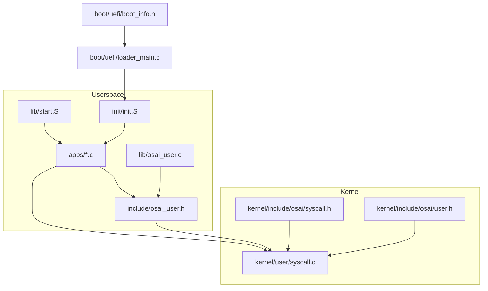
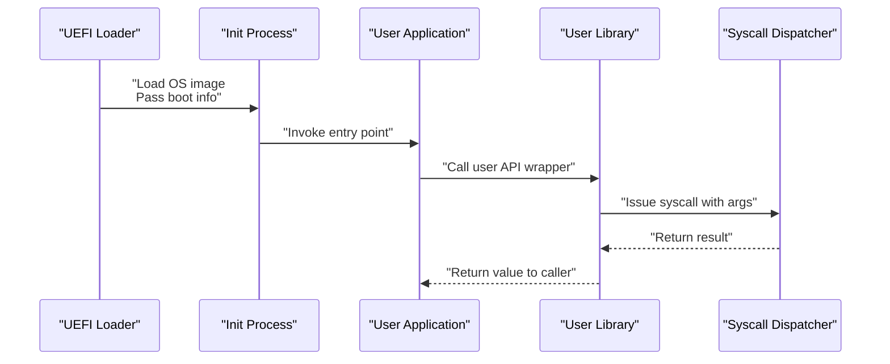
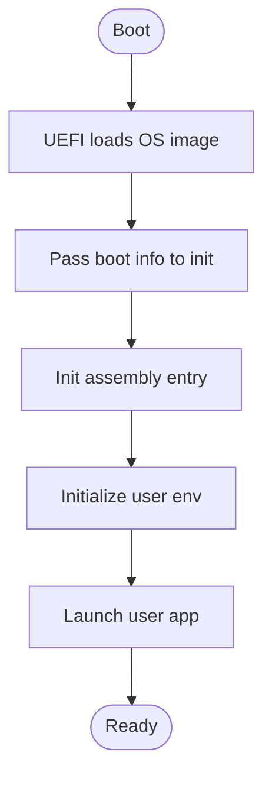
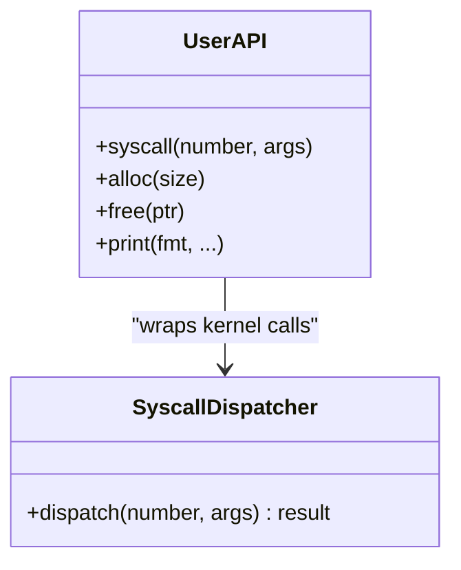
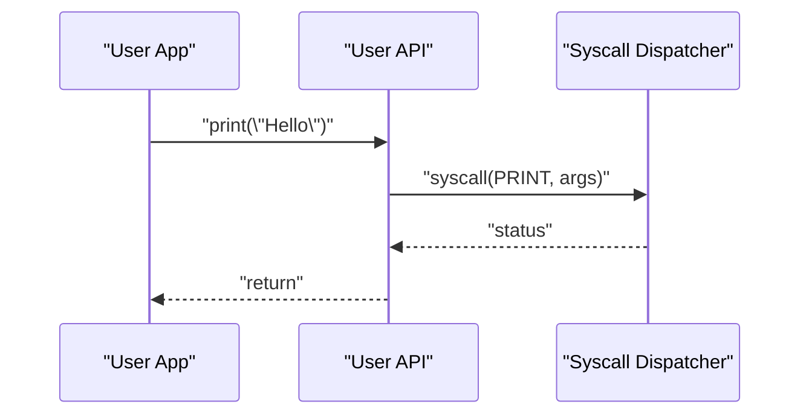
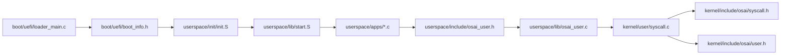

# User Processes

<cite>
**Referenced Files in This Document**
- [userspace/apps/hello.c](file://userspace/apps/hello.c)
- [userspace/apps/sysinfo.c](file://userspace/apps/sysinfo.c)
- [userspace/apps/systest.c](file://userspace/apps/systest.c)
- [userspace/include/osai_user.h](file://userspace/include/osai_user.h)
- [userspace/lib/osai_user.c](file://userspace/lib/osai_user.c)
- [userspace/lib/start.S](file://userspace/lib/start.S)
- [userspace/init/init.S](file://userspace/init/init.S)
- [kernel/user/syscall.c](file://kernel/user/syscall.c)
- [kernel/include/osai/syscall.h](file://kernel/include/osai/syscall.h)
- [kernel/include/osai/user.h](file://kernel/include/osai/user.h)
- [boot/uefi/loader_main.c](file://boot/uefi/loader_main.c)
- [boot/uefi/boot_info.h](file://boot/uefi/boot_info.h)
- [scripts/create-initfs.py](file://scripts/create-initfs.py)
</cite>

## Table of Contents
1. [Introduction](#introduction)
2. [Project Structure](#project-structure)
3. [Core Components](#core-components)
4. [Architecture Overview](#architecture-overview)
5. [Detailed Component Analysis](#detailed-component-analysis)
6. [Dependency Analysis](#dependency-analysis)
7. [Performance Considerations](#performance-considerations)
8. [Troubleshooting Guide](#troubleshooting-guide)
9. [Conclusion](#conclusion)

## Introduction
This document explains OSAI’s user process model and execution environment. It covers how user processes are created and executed, how the execution context is set up, and how applications enter user space. It documents the syscall interface design, including syscall numbers, parameter passing conventions, and return value handling. It also describes process initialization from startup assembly through library initialization and environment setup, and outlines user library functions and application development patterns. Practical examples show how to write user applications, make syscalls, and manage system resources. Finally, it addresses process isolation, memory management, and resource allocation from the user perspective.

## Project Structure
OSAI organizes user-space artifacts under userspace/, including:
- apps/: Example user applications
- include/: Public user API header
- lib/: Runtime support (startup assembly and C library helpers)
- init/: Init process assembly and configuration
- service-manager/: Service manager assembly and service index
- worker/: Worker assembly

Key kernel-side components supporting user processes include:
- kernel/user/syscall.c: User-space syscall dispatch
- kernel/include/osai/syscall.h: Syscall number definitions and declarations
- kernel/include/osai/user.h: User-mode types and constants
- boot/uefi/*: UEFI loader and boot info structures

**Diagram sources**
- [userspace/apps/hello.c](file://userspace/apps/hello.c)
- [userspace/lib/osai_user.c](file://userspace/lib/osai_user.c)
- [userspace/lib/start.S](file://userspace/lib/start.S)
- [userspace/init/init.S](file://userspace/init/init.S)
- [userspace/include/osai_user.h](file://userspace/include/osai_user.h)
- [kernel/user/syscall.c](file://kernel/user/syscall.c)
- [kernel/include/osai/syscall.h](file://kernel/include/osai/syscall.h)
- [kernel/include/osai/user.h](file://kernel/include/osai/user.h)
- [boot/uefi/loader_main.c](file://boot/uefi/loader_main.c)
- [boot/uefi/boot_info.h](file://boot/uefi/boot_info.h)

**Section sources**
- [userspace/apps/hello.c](file://userspace/apps/hello.c)
- [userspace/include/osai_user.h](file://userspace/include/osai_user.h)
- [userspace/lib/osai_user.c](file://userspace/lib/osai_user.c)
- [userspace/lib/start.S](file://userspace/lib/start.S)
- [userspace/init/init.S](file://userspace/init/init.S)
- [kernel/user/syscall.c](file://kernel/user/syscall.c)
- [kernel/include/osai/syscall.h](file://kernel/include/osai/syscall.h)
- [kernel/include/osai/user.h](file://kernel/include/osai/user.h)
- [boot/uefi/loader_main.c](file://boot/uefi/loader_main.c)
- [boot/uefi/boot_info.h](file://boot/uefi/boot_info.h)

## Core Components
- User API header: Declares user-space function wrappers and constants for syscalls and user types.
- Startup assembly: Provides the entry point and initial register/context setup before C runtime runs.
- C library helpers: Implements user-space helpers for common operations and syscall wrappers.
- Syscall dispatcher: Translates user-space syscall requests into kernel actions.
- Bootloader and boot info: Loads the OS image and passes platform-specific boot information to the init process.

**Section sources**
- [userspace/include/osai_user.h](file://userspace/include/osai_user.h)
- [userspace/lib/start.S](file://userspace/lib/start.S)
- [userspace/lib/osai_user.c](file://userspace/lib/osai_user.c)
- [kernel/user/syscall.c](file://kernel/user/syscall.c)
- [boot/uefi/loader_main.c](file://boot/uefi/loader_main.c)
- [boot/uefi/boot_info.h](file://boot/uefi/boot_info.h)

## Architecture Overview
The user process lifecycle spans bootloader, init, and user applications:
- The UEFI loader initializes hardware, loads the OS image, and passes boot info to the init process.
- The init process sets up the user execution environment and starts user applications.
- Applications link against the user API and call syscall wrappers to interact with the kernel.
- The syscall dispatcher routes requests to kernel services and returns results to user space.

**Diagram sources**
- [boot/uefi/loader_main.c](file://boot/uefi/loader_main.c)
- [boot/uefi/boot_info.h](file://boot/uefi/boot_info.h)
- [userspace/init/init.S](file://userspace/init/init.S)
- [userspace/lib/osai_user.c](file://userspace/lib/osai_user.c)
- [kernel/user/syscall.c](file://kernel/user/syscall.c)

## Detailed Component Analysis

### Syscall Interface Design
- Syscall numbers: Defined in the kernel syscall header and mirrored in the user API header.
- Parameter passing: Arguments are passed via registers or stack according to ABI; the user library marshals arguments into the expected convention.
- Return values: The syscall wrapper returns a typed result to the caller; errors are indicated via negative values or special sentinel types.

Implementation highlights:
- Syscall numbers and declarations are centralized in the syscall header.
- The syscall dispatcher validates and executes requests, returning results to user space.
- User library wrappers encapsulate argument marshaling and return handling.

**Section sources**
- [kernel/include/osai/syscall.h](file://kernel/include/osai/syscall.h)
- [kernel/user/syscall.c](file://kernel/user/syscall.c)
- [userspace/include/osai_user.h](file://userspace/include/osai_user.h)
- [userspace/lib/osai_user.c](file://userspace/lib/osai_user.c)

### Process Initialization
- Startup assembly: Establishes initial context and invokes the C runtime entrypoint.
- Init process: Sets up the user execution environment and launches user applications.
- Environment setup: Boot info is parsed and made available to user applications.

**Diagram sources**
- [boot/uefi/loader_main.c](file://boot/uefi/loader_main.c)
- [boot/uefi/boot_info.h](file://boot/uefi/boot_info.h)
- [userspace/init/init.S](file://userspace/init/init.S)

**Section sources**
- [userspace/lib/start.S](file://userspace/lib/start.S)
- [userspace/init/init.S](file://userspace/init/init.S)
- [boot/uefi/loader_main.c](file://boot/uefi/loader_main.c)
- [boot/uefi/boot_info.h](file://boot/uefi/boot_info.h)

### User Library Functions and Application Patterns
- User API: Declares wrappers for kernel-provided services, exposing a clean interface to applications.
- Helper routines: Provide common operations such as memory allocation, string utilities, and syscall invocation helpers.
- Application patterns: Typical apps initialize, call user API wrappers, handle results, and exit cleanly.

**Diagram sources**
- [userspace/include/osai_user.h](file://userspace/include/osai_user.h)
- [userspace/lib/osai_user.c](file://userspace/lib/osai_user.c)
- [kernel/user/syscall.c](file://kernel/user/syscall.c)

**Section sources**
- [userspace/include/osai_user.h](file://userspace/include/osai_user.h)
- [userspace/lib/osai_user.c](file://userspace/lib/osai_user.c)
- [kernel/user/syscall.c](file://kernel/user/syscall.c)

### Practical Examples: Writing User Applications
- Hello world: Demonstrates basic program structure and printing via user API.
- System info: Queries system information through syscalls.
- System tests: Exercises kernel services and validates responses.

**Diagram sources**
- [userspace/apps/hello.c](file://userspace/apps/hello.c)
- [userspace/include/osai_user.h](file://userspace/include/osai_user.h)
- [kernel/user/syscall.c](file://kernel/user/syscall.c)

**Section sources**
- [userspace/apps/hello.c](file://userspace/apps/hello.c)
- [userspace/apps/sysinfo.c](file://userspace/apps/sysinfo.c)
- [userspace/apps/systest.c](file://userspace/apps/systest.c)
- [userspace/include/osai_user.h](file://userspace/include/osai_user.h)

### Process Isolation, Memory Management, and Resource Allocation
- Isolation: User applications execute in restricted mode with controlled access to kernel services via syscalls.
- Memory management: Applications allocate and free memory through user library helpers; kernel manages physical and virtual memory.
- Resource allocation: Kernel allocates and tracks resources (files, network, timers) and exposes them to user apps through syscalls.

[No sources needed since this section provides general guidance]

## Dependency Analysis
The user process subsystem exhibits clear separation of concerns:
- Userspace depends on the user API header and library for syscall wrappers.
- The syscall dispatcher depends on syscall numbers and user types.
- The init process depends on startup assembly and boot info.
- The UEFI loader depends on platform-specific boot info structures.

**Diagram sources**
- [boot/uefi/loader_main.c](file://boot/uefi/loader_main.c)
- [boot/uefi/boot_info.h](file://boot/uefi/boot_info.h)
- [userspace/init/init.S](file://userspace/init/init.S)
- [userspace/lib/start.S](file://userspace/lib/start.S)
- [userspace/apps/hello.c](file://userspace/apps/hello.c)
- [userspace/include/osai_user.h](file://userspace/include/osai_user.h)
- [userspace/lib/osai_user.c](file://userspace/lib/osai_user.c)
- [kernel/user/syscall.c](file://kernel/user/syscall.c)
- [kernel/include/osai/syscall.h](file://kernel/include/osai/syscall.h)
- [kernel/include/osai/user.h](file://kernel/include/osai/user.h)

**Section sources**
- [boot/uefi/loader_main.c](file://boot/uefi/loader_main.c)
- [boot/uefi/boot_info.h](file://boot/uefi/boot_info.h)
- [userspace/init/init.S](file://userspace/init/init.S)
- [userspace/lib/start.S](file://userspace/lib/start.S)
- [userspace/apps/hello.c](file://userspace/apps/hello.c)
- [userspace/include/osai_user.h](file://userspace/include/osai_user.h)
- [userspace/lib/osai_user.c](file://userspace/lib/osai_user.c)
- [kernel/user/syscall.c](file://kernel/user/syscall.c)
- [kernel/include/osai/syscall.h](file://kernel/include/osai/syscall.h)
- [kernel/include/osai/user.h](file://kernel/include/osai/user.h)

## Performance Considerations
- Minimize syscall overhead by batching operations where appropriate.
- Use the provided user library helpers to avoid redundant argument marshaling.
- Keep user applications small and focused to reduce memory footprint.

[No sources needed since this section provides general guidance]

## Troubleshooting Guide
Common issues and remedies:
- Syscall failures: Check return values from user API wrappers; negative values typically indicate errors.
- Incorrect argument order: Verify argument marshaling matches syscall signatures.
- Missing dependencies: Ensure the user API header and library are linked properly.
- Boot-time problems: Confirm boot info is correctly passed and parsed by the init process.

**Section sources**
- [userspace/include/osai_user.h](file://userspace/include/osai_user.h)
- [userspace/lib/osai_user.c](file://userspace/lib/osai_user.c)
- [kernel/user/syscall.c](file://kernel/user/syscall.c)
- [boot/uefi/loader_main.c](file://boot/uefi/loader_main.c)
- [boot/uefi/boot_info.h](file://boot/uefi/boot_info.h)

## Conclusion
OSAI’s user process model provides a clean separation between user applications and kernel services. User applications rely on a thin user API and library to issue syscalls safely and efficiently. The init process and startup assembly establish a predictable execution environment, while the syscall dispatcher ensures robust routing of requests. Following the patterns shown in the example applications and adhering to the documented interface enables reliable development of user-space programs.