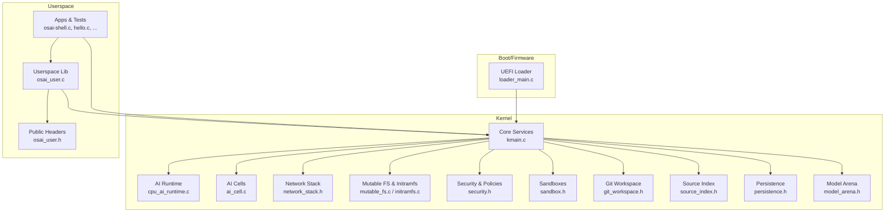
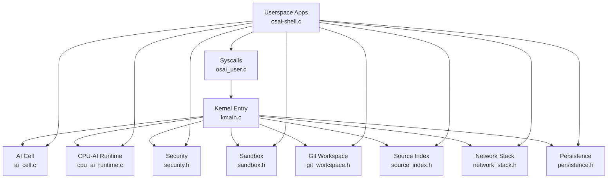
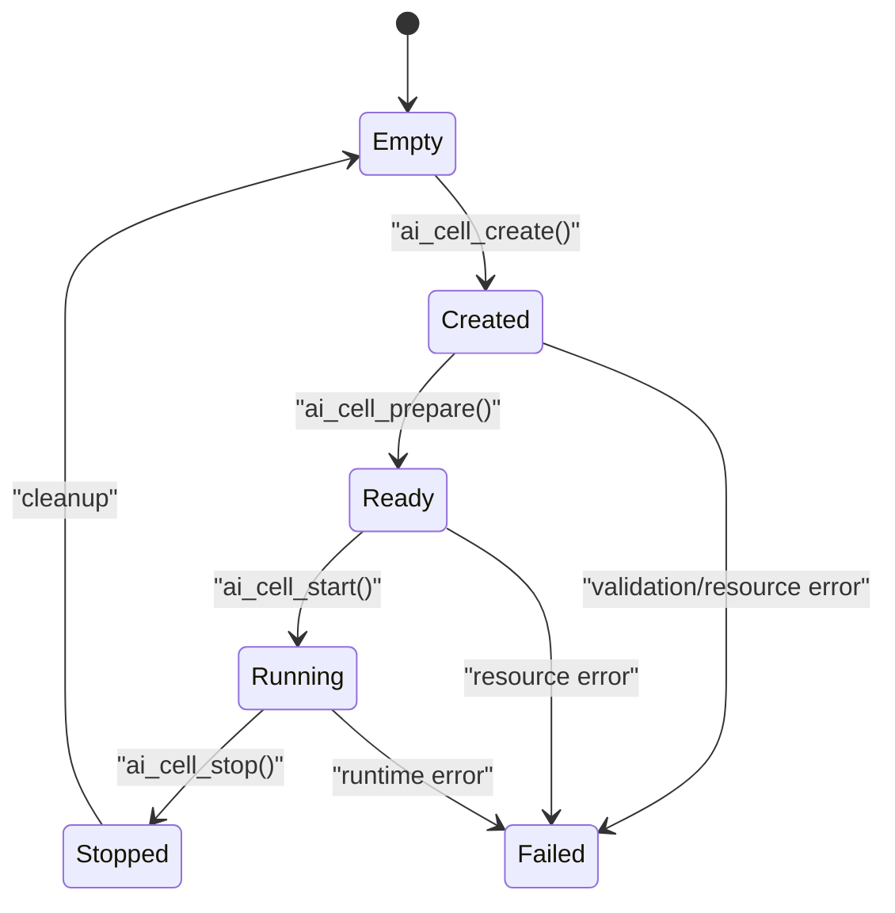
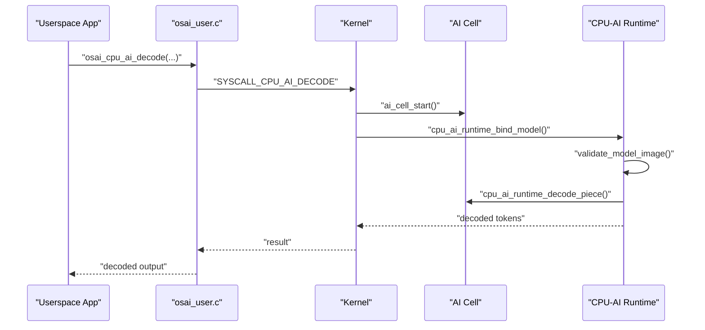
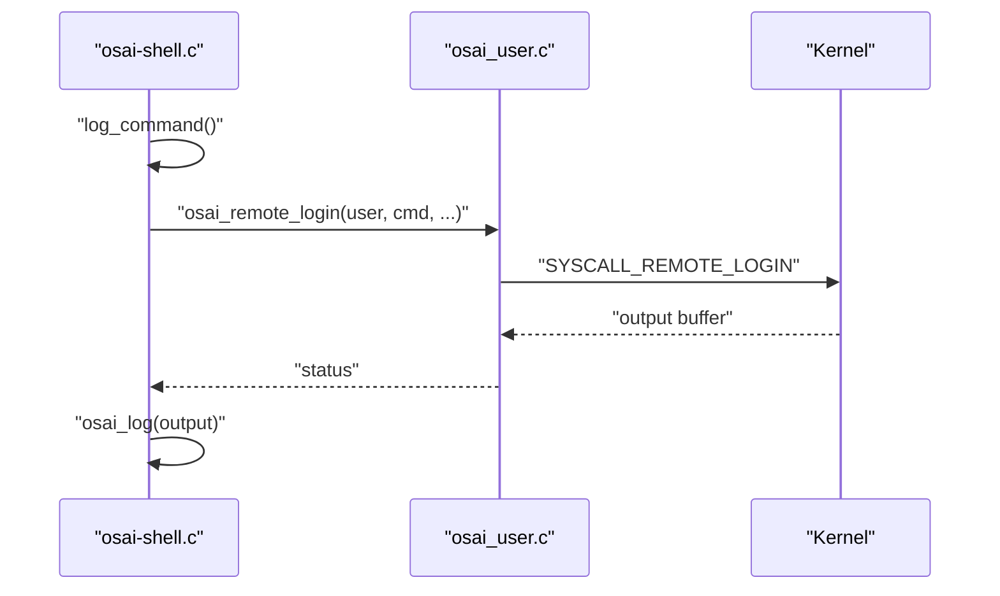
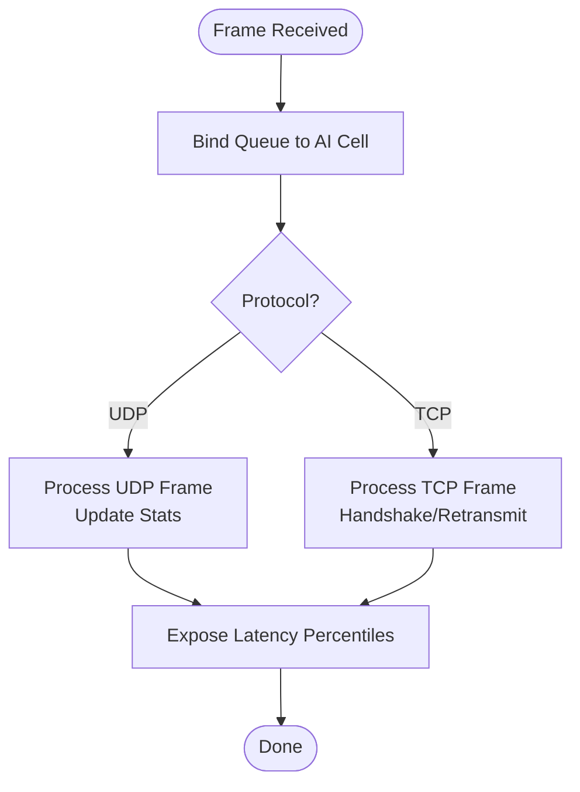
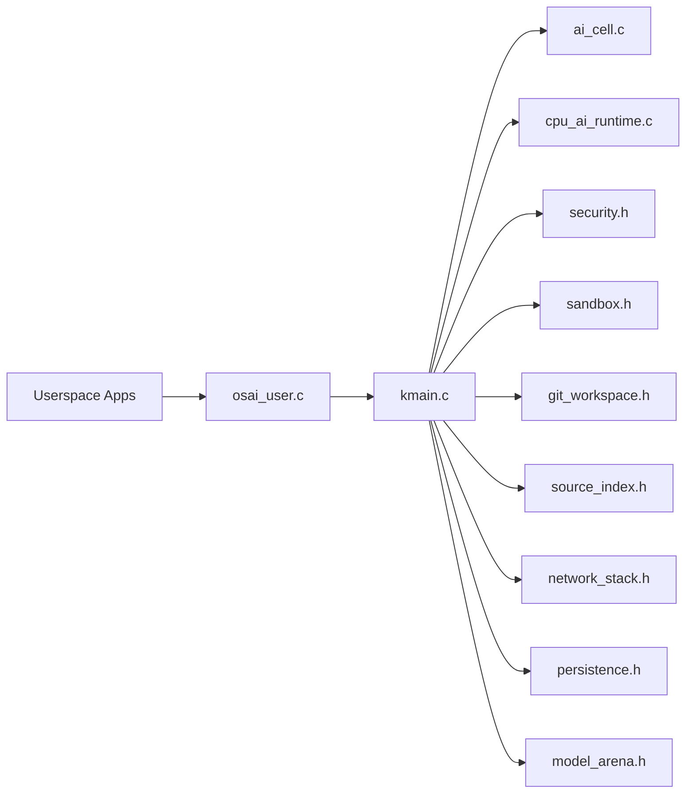

# Project Overview

<cite>
**Referenced Files in This Document**
- [README.md](file://README.md)
- [kmain.c](file://kernel/core/kmain.c)
- [cpu_ai_runtime.h](file://kernel/include/osai/cpu_ai_runtime.h)
- [ai_cell.h](file://kernel/include/osai/ai_cell.h)
- [sandbox.h](file://kernel/include/osai/sandbox.h)
- [security.h](file://kernel/include/osai/security.h)
- [model_arena.h](file://kernel/include/osai/model_arena.h)
- [persistence.h](file://kernel/include/osai/persistence.h)
- [network_stack.h](file://kernel/include/osai/network_stack.h)
- [git_workspace.h](file://kernel/include/osai/git_workspace.h)
- [source_index.h](file://kernel/include/osai/source_index.h)
- [osai-shell.c](file://userspace/apps/osai-shell.c)
- [osai_user.c](file://userspace/lib/osai_user.c)
- [osai_user.h](file://userspace/include/osai_user.h)
</cite>

## Table of Contents
1. [Introduction](#introduction)
2. [Project Structure](#project-structure)
3. [Core Components](#core-components)
4. [Architecture Overview](#architecture-overview)
5. [Detailed Component Analysis](#detailed-component-analysis)
6. [Dependency Analysis](#dependency-analysis)
7. [Performance Considerations](#performance-considerations)
8. [Troubleshooting Guide](#troubleshooting-guide)
9. [Conclusion](#conclusion)

## Introduction
OSAI is a server-only operating system designed specifically for CPU-only embedded AI agents. Unlike traditional operating systems, OSAI eliminates unnecessary OS interference to deliver predictable, low-latency performance for AI workloads. Its core philosophy is to embed AI agents directly into applications so they can act quickly on source code, network events, and operational needs—without the overhead of generic stacks, cross-core migrations, or background tasks.

OSAI targets applications that are still “operationally dumb” (they run business logic, expose APIs, and store data) and aims to transform them into “smart applications.” In this model, each application hosts an embedded AI agent that understands the application’s Git source tree, accepts human requests, generates and applies patches, rebuilds and tests the application, reviews and syncs changes with Git, and hot reloads or redeploys improvements where appropriate.

Key design goals:
- Reduce TCP/UDP latency by optimizing the network stack and avoiding generic paths
- Improve CPU-AI memory bandwidth and sustained usable CPU-core performance
- Achieve near-zero scheduler jitter on hot AI paths by keeping AI workloads localized and deterministic
- Minimize OS interference while maintaining isolation and predictability

These targets are not guaranteed benchmarks but represent realistic gains from removing avoidable OS overhead such as scheduler migration, context switching, post-warmup page faults, generic socket overhead, memory duplication, poor NUMA placement, and unrelated interrupts.

**Section sources**
- [README.md:1-86](file://README.md#L1-L86)

## Project Structure
OSAI is organized into distinct layers:
- Boot and firmware: UEFI loader and platform-specific entry points
- Kernel: Core OS services, memory management, virtualization, device drivers, and AI runtime subsystems
- Userspace: Applications, libraries, and service managers that interact with the kernel via a minimal syscall interface
- Scripts and tooling: Build, testing, and QEMU-based verification utilities

**Diagram sources**
- [kmain.c:60-223](file://kernel/core/kmain.c#L60-L223)
- [cpu_ai_runtime.h:1-51](file://kernel/include/osai/cpu_ai_runtime.h#L1-L51)
- [ai_cell.h:1-103](file://kernel/include/osai/ai_cell.h#L1-L103)
- [network_stack.h:1-76](file://kernel/include/osai/network_stack.h#L1-L76)
- [sandbox.h:1-43](file://kernel/include/osai/sandbox.h#L1-L43)
- [git_workspace.h:1-49](file://kernel/include/osai/git_workspace.h#L1-L49)
- [source_index.h:1-55](file://kernel/include/osai/source_index.h#L1-L55)
- [persistence.h:1-31](file://kernel/include/osai/persistence.h#L1-L31)
- [model_arena.h:1-28](file://kernel/include/osai/model_arena.h#L1-L28)
- [osai-shell.c:1-97](file://userspace/apps/osai-shell.c#L1-L97)
- [osai_user.c:1-200](file://userspace/lib/osai_user.c#L1-L200)
- [osai_user.h:1-158](file://userspace/include/osai_user.h#L1-L158)

**Section sources**
- [README.md:39-48](file://README.md#L39-L48)
- [kmain.c:60-223](file://kernel/core/kmain.c#L60-L223)

## Core Components
- AI Cell: The fundamental unit of an embedded AI agent. It encapsulates resources (KV cache, source index, build logs, model binding) and enforces strict resource admission and isolation policies. AI cells are created from descriptors that specify CPU affinity, NIC queue binding, Git workspace linkage, and model arena usage.
- CPU-AI Runtime: Provides model loading, binding, decoding, and inference execution tailored for CPU-only environments. It validates model images, manages tokenizer/runtime bindings, tracks KV cache writes, and exposes telemetry counters for performance insights.
- Sandbox: Manages isolated build environments for applying patches, building artifacts, and rolling back changes safely. Sandboxes are owned by AI cells and bound to Git workspaces to maintain provenance and safety.
- Security: Enforces capability-based authorization for filesystem, Git, sandbox, rollback, and administrative operations. It tracks denials and validates signatures and paths to prevent escapes and replay attacks.
- Model Arena: A shared memory region registry for ML models, enabling efficient sharing and binding across AI cells without duplication.
- Network Stack: Optimized UDP/TCP handling with queue binding per AI cell, flow lifecycle tracking, and latency metrics to reduce generic network overhead.
- Persistence: Snapshot and rollback mechanisms for boot config, services, workspaces, sandboxes, and updates, supporting safe experimentation and recovery.
- Git Workspace and Source Index: Enable AI agents to understand the application’s source tree, track revisions, and apply patches with conflict detection and resolution.
- Userspace Syscalls: A minimal syscall surface that apps use for logging, filesystem operations, networking, SMP, AI decoding, remote login, and ML execution.

**Section sources**
- [ai_cell.h:24-101](file://kernel/include/osai/ai_cell.h#L24-L101)
- [cpu_ai_runtime.h:13-48](file://kernel/include/osai/cpu_ai_runtime.h#L13-L48)
- [sandbox.h:16-40](file://kernel/include/osai/sandbox.h#L16-L40)
- [security.h:7-50](file://kernel/include/osai/security.h#L7-L50)
- [model_arena.h:9-25](file://kernel/include/osai/model_arena.h#L9-L25)
- [network_stack.h:19-73](file://kernel/include/osai/network_stack.h#L19-L73)
- [persistence.h:15-28](file://kernel/include/osai/persistence.h#L15-L28)
- [git_workspace.h:20-44](file://kernel/include/osai/git_workspace.h#L20-L44)
- [source_index.h:30-52](file://kernel/include/osai/source_index.h#L30-L52)
- [osai_user.h:8-28](file://userspace/include/osai_user.h#L8-L28)

## Architecture Overview
OSAI’s architecture centers on embedding AI agents directly into applications, keeping AI workloads close to the source code they improve. The kernel initializes core services, sets up memory and device mappings, and launches userspace components. Userspace apps communicate with the kernel through syscalls to perform logging, filesystem operations, networking, SMP, AI decoding, and ML execution.

**Diagram sources**
- [kmain.c:60-223](file://kernel/core/kmain.c#L60-L223)
- [osai_user.c:3-13](file://userspace/lib/osai_user.c#L3-L13)
- [osai-shell.c:38-96](file://userspace/apps/osai-shell.c#L38-L96)
- [ai_cell.c:115-120](file://kernel/runtime/ai_cell.c#L115-L120)
- [cpu_ai_runtime.c:92-94](file://kernel/runtime/cpu_ai_runtime.c#L92-L94)
- [security.h:7-50](file://kernel/include/osai/security.h#L7-L50)
- [sandbox.h:29-40](file://kernel/include/osai/sandbox.h#L29-L40)
- [git_workspace.h:29-44](file://kernel/include/osai/git_workspace.h#L29-L44)
- [source_index.h:38-52](file://kernel/include/osai/source_index.h#L38-L52)
- [network_stack.h:19-73](file://kernel/include/osai/network_stack.h#L19-L73)
- [persistence.h:15-28](file://kernel/include/osai/persistence.h#L15-L28)

## Detailed Component Analysis

### AI Cell Lifecycle and Resource Management
AI cells are the core abstraction for isolating and controlling AI agents. They enforce strict admission policies, bind NIC queues, manage Git workspaces, and track resource usage. The lifecycle transitions from creation to readiness and running, with telemetry counters for descriptor acceptance/rejection, resource admission, and conflicts.

**Diagram sources**
- [ai_cell.h:24-31](file://kernel/include/osai/ai_cell.h#L24-L31)
- [ai_cell.h:78-100](file://kernel/include/osai/ai_cell.h#L78-L100)

**Section sources**
- [ai_cell.h:15-101](file://kernel/include/osai/ai_cell.h#L15-L101)
- [ai_cell.c:115-200](file://kernel/runtime/ai_cell.c#L115-L200)

### CPU-AI Runtime Execution Flow
The CPU-AI runtime validates model images, binds models to cells, decodes tokens, and runs inference. It tracks telemetry such as load counts, tokenizer calls, KV writes, and GPU rejection counts to measure performance and correctness.

**Diagram sources**
- [osai_user.c:163-174](file://userspace/lib/osai_user.c#L163-L174)
- [osai_user.h:24-28](file://userspace/include/osai_user.h#L24-L28)
- [cpu_ai_runtime.h:14-31](file://kernel/include/osai/cpu_ai_runtime.h#L14-L31)
- [ai_cell.h:80-85](file://kernel/include/osai/ai_cell.h#L80-L85)

**Section sources**
- [cpu_ai_runtime.h:13-48](file://kernel/include/osai/cpu_ai_runtime.h#L13-L48)
- [cpu_ai_runtime.c:143-198](file://kernel/runtime/cpu_ai_runtime.c#L143-L198)

### Remote Login and Userspace Shell Surface
The userspace shell demonstrates the remote login surface and filesystem commands, validating the OS’s remote-login capability and mutable filesystem APIs. It exercises commands like listing, creating, copying, and archiving files, and interacts with the remote login syscall.

**Diagram sources**
- [osai-shell.c:9-36](file://userspace/apps/osai-shell.c#L9-L36)
- [osai_user.c:176-189](file://userspace/lib/osai_user.c#L176-L189)
- [osai_user.h:176-189](file://userspace/include/osai_user.h#L176-L189)

**Section sources**
- [osai-shell.c:38-96](file://userspace/apps/osai-shell.c#L38-L96)
- [osai_user.c:50-59](file://userspace/lib/osai_user.c#L50-L59)

### Network Stack and Latency Metrics
The network stack binds queues per AI cell, processes UDP/TCP frames, and exposes latency percentiles and flow statistics. This enables targeted reductions in TCP/UDP latency by keeping hot AI paths on fixed cores and avoiding generic network paths.

**Diagram sources**
- [network_stack.h:20-73](file://kernel/include/osai/network_stack.h#L20-L73)

**Section sources**
- [network_stack.h:19-73](file://kernel/include/osai/network_stack.h#L19-L73)

## Dependency Analysis
OSAI’s kernel orchestrates a tightly integrated set of subsystems. The userspace library provides a minimal syscall interface that apps use to interact with kernel services. AI cells depend on the CPU-AI runtime, model arenas, security policies, sandboxes, Git workspaces, and source indexing. The network stack integrates with AI cells via queue binding and telemetry.

**Diagram sources**
- [kmain.c:1-32](file://kernel/core/kmain.c#L1-L32)
- [osai_user.c:3-13](file://userspace/lib/osai_user.c#L3-L13)
- [ai_cell.c:1-10](file://kernel/runtime/ai_cell.c#L1-L10)
- [cpu_ai_runtime.c:1-7](file://kernel/runtime/cpu_ai_runtime.c#L1-L7)
- [security.h:1-6](file://kernel/include/osai/security.h#L1-L6)
- [sandbox.h:1-6](file://kernel/include/osai/sandbox.h#L1-L6)
- [git_workspace.h:1-6](file://kernel/include/osai/git_workspace.h#L1-L6)
- [source_index.h:1-6](file://kernel/include/osai/source_index.h#L1-L6)
- [network_stack.h:1-6](file://kernel/include/osai/network_stack.h#L1-L6)
- [persistence.h:1-6](file://kernel/include/osai/persistence.h#L1-L6)
- [model_arena.h:1-6](file://kernel/include/osai/model_arena.h#L1-L6)

**Section sources**
- [kmain.c:1-32](file://kernel/core/kmain.c#L1-L32)

## Performance Considerations
OSAI targets measurable improvements by reducing OS interference:
- TCP/UDP latency: Up to 10–45% lower latency through optimized network stack and NIC queue binding per AI cell
- CPU-AI memory bandwidth: 3–18% higher effective bandwidth by minimizing memory duplication and improving locality
- Sustained usable CPU-core performance: 2–12% higher sustained performance by reducing scheduler jitter and migration on hot AI paths
- Scheduler jitter/migration: Near-zero jitter on hot AI paths by fixing cores, binding queues, and avoiding generic paths

These gains derive from removing avoidable overhead such as scheduler migration, context switching, post-warmup page faults, generic socket overhead, memory duplication, poor NUMA placement, and unrelated interrupts. The design intentionally avoids GPU acceleration and vendor-specific runtimes, focusing purely on CPU-only AI workloads.

**Section sources**
- [README.md:26-37](file://README.md#L26-L37)

## Troubleshooting Guide
Common areas to inspect when diagnosing issues:
- AI Cell Admission and Conflicts: Check descriptor acceptance/rejection counts, resource admission failures, and queue/workspace binding conflicts.
- CPU-AI Runtime Validation: Review model load/validation failures, checksum mismatches, and GPU rejection counts.
- Security Denials: Audit capability denials, filesystem denials, workspace and sandbox denials, and signature validation outcomes.
- Network Stack: Examine UDP/TCP flow statistics, queue binding counts, and latency percentiles to isolate network-related regressions.
- Persistence Snapshots: Verify snapshot creation/rollback counts and disk load/write activity for recovery-related issues.

**Section sources**
- [ai_cell.h:86-100](file://kernel/include/osai/ai_cell.h#L86-L100)
- [cpu_ai_runtime.h:42-48](file://kernel/include/osai/cpu_ai_runtime.h#L42-L48)
- [security.h:33-50](file://kernel/include/osai/security.h#L33-L50)
- [network_stack.h:41-73](file://kernel/include/osai/network_stack.h#L41-L73)
- [persistence.h:16-28](file://kernel/include/osai/persistence.h#L16-L28)

## Conclusion
OSAI reimagines the operating system for CPU-only embedded AI agents by embedding intelligence directly into applications. Through strict isolation, predictable resource management, and minimized OS interference, it delivers faster, more predictable performance for AI workloads. By transforming “operationally dumb” applications into “smart applications,” OSAI enables continuous improvement loops that understand source code, generate and apply patches, and deploy improvements autonomously—while maintaining isolation, security, and reliability.

[No sources needed since this section summarizes without analyzing specific files]