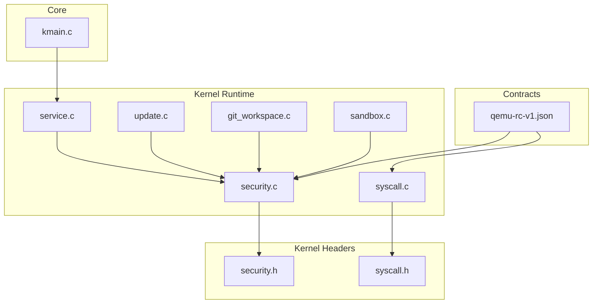
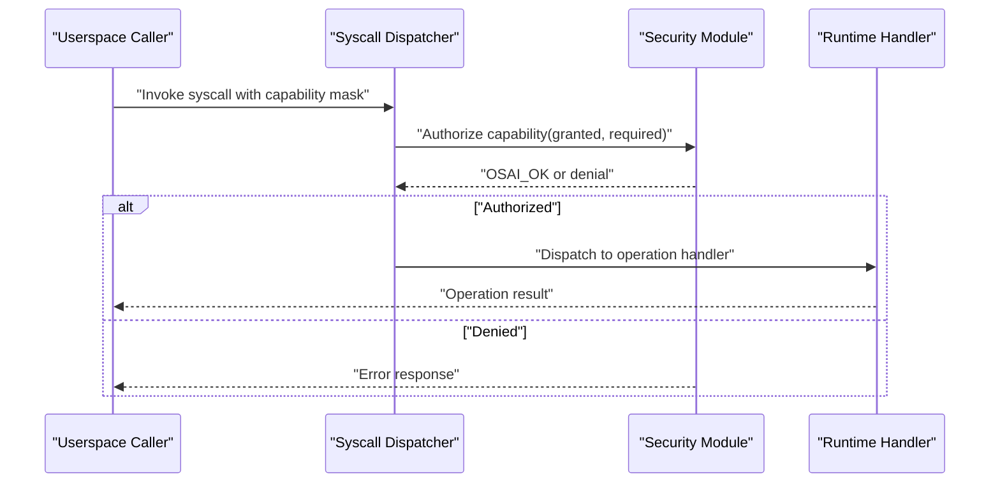
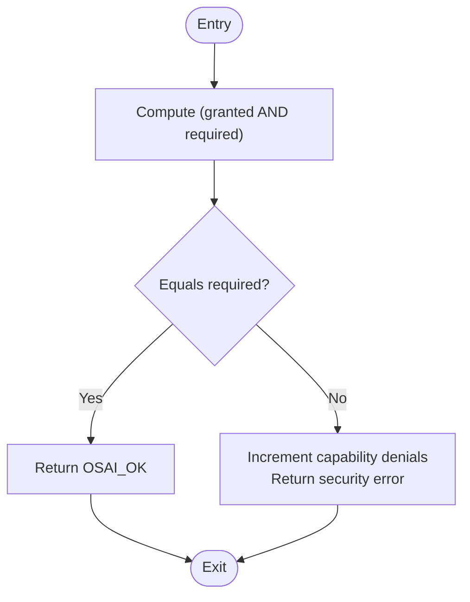
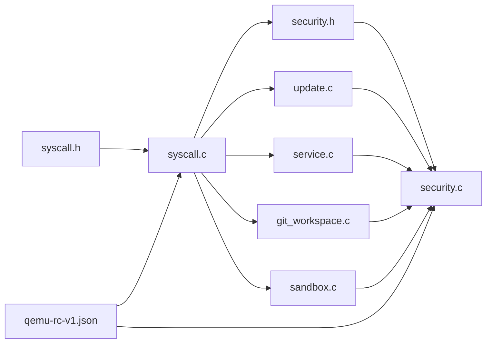

# Capability-Based Security

<cite>
**Referenced Files in This Document**
- [security.h](file://kernel/include/osai/security.h)
- [security.c](file://kernel/runtime/security.c)
- [syscall.h](file://kernel/include/osai/syscall.h)
- [syscall.c](file://kernel/user/syscall.c)
- [qemu-rc-v1.json](file://contracts/qemu-rc-v1.json)
- [update.c](file://kernel/runtime/update.c)
- [service.c](file://kernel/user/service.c)
- [kmain.c](file://kernel/core/kmain.c)
- [git_workspace.c](file://kernel/runtime/git_workspace.c)
- [sandbox.c](file://kernel/runtime/sandbox.c)
- [SECURITY.md](file://SECURITY.md)
- [QEMU-FULL-OS-CORE-WORKDOWN.md](file://QEMU-FULL-OS-CORE-WORKDOWN.md)
</cite>

## Table of Contents
1. [Introduction](#introduction)
2. [Project Structure](#project-structure)
3. [Core Components](#core-components)
4. [Architecture Overview](#architecture-overview)
5. [Detailed Component Analysis](#detailed-component-analysis)
6. [Dependency Analysis](#dependency-analysis)
7. [Performance Considerations](#performance-considerations)
8. [Troubleshooting Guide](#troubleshooting-guide)
9. [Conclusion](#conclusion)
10. [Appendices](#appendices)

## Introduction
This document describes OSAI’s capability-based security system. It explains the capability token architecture, capability flags, permission delegation, capability inheritance patterns, and the security_authorize_capability function. It also documents capability types such as OSAI_CAP_ADMIN and OSAI_CAP_UPDATE, capability validation and masks, permission matrix operations, and practical examples of capability usage in system calls, file operations, and service authorization. Finally, it covers capability storage, propagation across system boundaries, auditing, escalation, and revocation mechanisms.

## Project Structure
OSAI organizes capability-related logic primarily in:
- Kernel headers defining capability constants and authorization APIs
- Kernel runtime implementing authorization policies and enforcement
- Userspace syscall dispatch mapping syscalls to required capabilities
- Contracts defining capability-to-syscall mappings and admin capability
- Runtime modules enforcing capabilities for filesystem, sandbox, Git workspace, and update operations

**Diagram sources**
- [security.h](file://kernel/include/osai/security.h)
- [syscall.h](file://kernel/include/osai/syscall.h)
- [security.c](file://kernel/runtime/security.c)
- [syscall.c](file://kernel/user/syscall.c)
- [update.c](file://kernel/runtime/update.c)
- [service.c](file://kernel/user/service.c)
- [git_workspace.c](file://kernel/runtime/git_workspace.c)
- [sandbox.c](file://kernel/runtime/sandbox.c)
- [qemu-rc-v1.json](file://contracts/qemu-rc-v1.json)
- [kmain.c](file://kernel/core/kmain.c)

**Section sources**
- [security.h](file://kernel/include/osai/security.h)
- [security.c](file://kernel/runtime/security.c)
- [syscall.h](file://kernel/include/osai/syscall.h)
- [syscall.c](file://kernel/user/syscall.c)
- [qemu-rc-v1.json](file://contracts/qemu-rc-v1.json)
- [update.c](file://kernel/runtime/update.c)
- [service.c](file://kernel/user/service.c)
- [git_workspace.c](file://kernel/runtime/git_workspace.c)
- [sandbox.c](file://kernel/runtime/sandbox.c)
- [kmain.c](file://kernel/core/kmain.c)

## Core Components
- Capability constants and masks: OSAI defines capability bit flags for distinct permissions. Examples include OSAI_CAP_UPDATE and OSAI_CAP_ADMIN.
- Authorization APIs: The kernel exposes functions to authorize operations, validate credentials, and enforce capability checks for filesystem, sandbox, Git workspace, rollback, and admin operations.
- Syscall capability mapping: Userspace syscall dispatch associates each syscall with a required capability mask.
- Contract-driven policy: The ABI contract enumerates syscall capabilities and the admin capability, ensuring alignment between kernel and userspace.

Key implementation references:
- Capability constants and masks: [syscall.h](file://kernel/include/osai/syscall.h)
- Authorization functions: [security.h](file://kernel/include/osai/security.h), [security.c](file://kernel/runtime/security.c)
- Syscall-to-capability mapping: [syscall.c](file://kernel/user/syscall.c)
- Contract definitions: [qemu-rc-v1.json](file://contracts/qemu-rc-v1.json)

**Section sources**
- [syscall.h](file://kernel/include/osai/syscall.h)
- [security.h](file://kernel/include/osai/security.h)
- [security.c](file://kernel/runtime/security.c)
- [syscall.c](file://kernel/user/syscall.c)
- [qemu-rc-v1.json](file://contracts/qemu-rc-v1.json)

## Architecture Overview
OSAI enforces capability-based access control by:
- Requiring a capability mask for each syscall
- Verifying that the caller’s granted capability set includes all required bits
- Applying domain-specific checks (filesystem paths, sandbox escape prevention, credential material rejection)
- Enforcing admin-only operations via OSAI_CAP_ADMIN
- Supporting update authorization requiring both OSAI_CAP_UPDATE and OSAI_CAP_ADMIN

**Diagram sources**
- [security.c](file://kernel/runtime/security.c)
- [syscall.c](file://kernel/user/syscall.c)

**Section sources**
- [security.c](file://kernel/runtime/security.c)
- [syscall.c](file://kernel/user/syscall.c)

## Detailed Component Analysis

### Capability Token Architecture and Masks
- Capability flags are represented as bitmasks stored in an unsigned 64-bit integer.
- Example masks:
  - OSAI_CAP_UPDATE: used for update operations
  - OSAI_CAP_ADMIN: required for administrative actions
- Capability masks enable permission delegation and composition. An actor with multiple capabilities can invoke syscalls requiring subsets of those capabilities.

Practical usage patterns:
- Syscall dispatch maps each syscall number to a required capability mask.
- Runtime handlers call security_authorize_capability to validate the caller’s granted capability set against the required mask.

References:
- Capability masks: [syscall.h](file://kernel/include/osai/syscall.h)
- Syscall-to-capability mapping: [syscall.c](file://kernel/user/syscall.c)

**Section sources**
- [syscall.h](file://kernel/include/osai/syscall.h)
- [syscall.c](file://kernel/user/syscall.c)

### security_authorize_capability Function and Checking Logic
The core authorization primitive performs bitwise containment checks:
- Input: operation name, granted capability mask, required capability mask
- Logic: return success if (granted AND required) equals required
- Otherwise, increment capability denial counter and return a security error

**Diagram sources**
- [security.c:202-211](file://kernel/runtime/security.c#L202-L211)

**Section sources**
- [security.c:202-211](file://kernel/runtime/security.c#L202-L211)

### Capability Types and Usage Patterns
- OSAI_CAP_ADMIN: Admin-only operations. Required for sensitive actions such as service updates and rollback decisions.
- OSAI_CAP_UPDATE: Update operations require both OSAI_CAP_UPDATE and OSAI_CAP_ADMIN per policy.
- Other capability types appear in the ABI contract (e.g., logging, exit, OS control, filesystem read/write, networking, SMP, CPU AI, remote login, threads, ML).

Usage patterns:
- Syscall dispatch associates each syscall with a required capability mask.
- Runtime handlers call authorization functions tailored to the operation domain (filesystem, sandbox, Git workspace, rollback, admin).
- Contract definitions enumerate capabilities and admin capability, aligning kernel and userspace.

References:
- Admin capability and update policy: [qemu-rc-v1.json](file://contracts/qemu-rc-v1.json)
- Syscall-to-capability mapping: [syscall.c](file://kernel/user/syscall.c)
- Admin enforcement: [security.c:286-298](file://kernel/runtime/security.c#L286-L298)
- Update authorization: [security.c:404-411](file://kernel/runtime/security.c#L404-L411), [update.c:155](file://kernel/runtime/update.c#L155)

**Section sources**
- [qemu-rc-v1.json](file://contracts/qemu-rc-v1.json)
- [syscall.c](file://kernel/user/syscall.c)
- [security.c:286-298](file://kernel/runtime/security.c#L286-L298)
- [security.c:404-411](file://kernel/runtime/security.c#L404-L411)
- [update.c:155](file://kernel/runtime/update.c#L155)

### Permission Delegation and Inheritance Patterns
- Delegation: A caller with a superset of required capabilities can invoke syscalls requiring subsets.
- Inheritance: Capability sets can be propagated across system boundaries (e.g., from the service manager to child processes) as part of process metadata.
- Evidence of inheritance: The service manager is granted administrative capabilities during initialization.

References:
- Capability propagation evidence: [kmain.c:178](file://kernel/core/kmain.c#L178)

**Section sources**
- [kmain.c:178](file://kernel/core/kmain.c#L178)

### Capability Validation and Credential Material Checks
- General validation rejects inputs containing credential material patterns.
- Sandbox path validation prevents escape attempts (e.g., double slashes, parent directory traversal).
- Benchmark record validation enforces policy compliance.

References:
- Credential rejection: [security.c:300-317](file://kernel/runtime/security.c#L300-L317)
- Sandbox path validation: [security.c:422-446](file://kernel/runtime/security.c#L422-L446)
- Benchmark record validation: [security.c:448-456](file://kernel/runtime/security.c#L448-L456)

**Section sources**
- [security.c:300-317](file://kernel/runtime/security.c#L300-L317)
- [security.c:422-446](file://kernel/runtime/security.c#L422-L446)
- [security.c:448-456](file://kernel/runtime/security.c#L448-L456)

### Permission Matrix Operations
- The authorization logic uses bitwise AND and equality checks to validate required capabilities.
- Domain-specific checks refine authorization decisions (e.g., filesystem path trees, sandbox path normalization).

References:
- Capability check: [security.c:206](file://kernel/runtime/security.c#L206)
- Filesystem read/write checks: [security.c:213-239](file://kernel/runtime/security.c#L213-L239)
- Sandbox checks: [sandbox.c](file://kernel/runtime/sandbox.c)
- Git workspace checks: [git_workspace.c](file://kernel/runtime/git_workspace.c)

**Section sources**
- [security.c:206](file://kernel/runtime/security.c#L206)
- [security.c:213-239](file://kernel/runtime/security.c#L213-L239)
- [sandbox.c](file://kernel/runtime/sandbox.c)
- [git_workspace.c](file://kernel/runtime/git_workspace.c)

### Capability Escalation Procedures
- Escalation occurs when a caller seeks to perform admin-only operations.
- The admin authorization function verifies OSAI_CAP_ADMIN presence in the granted mask.
- Update authorization escalates to require both OSAI_CAP_UPDATE and OSAI_CAP_ADMIN.

References:
- Admin authorization: [security.c:286-298](file://kernel/runtime/security.c#L286-L298)
- Update escalation: [security.c:404-411](file://kernel/runtime/security.c#L404-L411), [update.c:155](file://kernel/runtime/update.c#L155)

**Section sources**
- [security.c:286-298](file://kernel/runtime/security.c#L286-L298)
- [security.c:404-411](file://kernel/runtime/security.c#L404-L411)
- [update.c:155](file://kernel/runtime/update.c#L155)

### Capability Revocation Mechanisms
- Revocation is implicit: removing a capability bit from a caller’s granted mask will cause future authorization checks to fail.
- The authorization function enforces strict subset checks; missing bits lead to denials.
- No explicit revocation API is shown in the analyzed files; revocation is managed by adjusting the granted capability set upstream.

References:
- Authorization logic: [security.c:202-211](file://kernel/runtime/security.c#L202-L211)

**Section sources**
- [security.c:202-211](file://kernel/runtime/security.c#L202-L211)

### Capability Storage and Propagation Across Boundaries
- Capability sets are propagated as part of process metadata and inherited by child processes.
- Evidence: the service manager is initialized with administrative capabilities, indicating capability propagation from the kernel bootstrap phase.

References:
- Capability propagation evidence: [kmain.c:178](file://kernel/core/kmain.c#L178)

**Section sources**
- [kmain.c:178](file://kernel/core/kmain.c#L178)

### Capability Auditing and Counters
- The security module maintains counters for denied operations, capability denials, filesystem denials, workspace denials, sandbox denials, rollback denials, update policy rejections, signature accept/reject counts, credential rejections, admin denials, update authorizations, update replay rejections, key accept/reject counts, sandbox escape rejections, and last update generation.
- These counters support operational auditing and incident analysis.

References:
- Counter declarations and accessors: [security.c:177-196](file://kernel/runtime/security.c#L177-L196), [security.c:458-456](file://kernel/runtime/security.c#L458-L456)

**Section sources**
- [security.c:177-196](file://kernel/runtime/security.c#L177-L196)
- [security.c:458-456](file://kernel/runtime/security.c#L458-L456)

### Practical Examples

#### System Calls and Capability Usage
- Syscall dispatcher maps each syscall to a required capability mask.
- Example mappings include time, networking, SMP, CPU AI, remote login, threads, and ML operations.

References:
- Syscall-to-capability mapping: [syscall.c](file://kernel/user/syscall.c)

**Section sources**
- [syscall.c](file://kernel/user/syscall.c)

#### File Operations and Capability Checks
- Filesystem read/write checks validate paths against allowed trees and reject credential material.
- Path validation ensures safe access patterns.

References:
- Filesystem checks: [security.c:213-239](file://kernel/runtime/security.c#L213-L239)
- Credential rejection: [security.c:300-317](file://kernel/runtime/security.c#L300-L317)

**Section sources**
- [security.c:213-239](file://kernel/runtime/security.c#L213-L239)
- [security.c:300-317](file://kernel/runtime/security.c#L300-L317)

#### Service Authorization and Capability Escalation
- Service control operations require OSAI_CAP_SERVICE_CONTROL.
- Update operations require OSAI_CAP_UPDATE; escalation to OSAI_CAP_ADMIN is enforced for signed updates.

References:
- Service update invocation: [service.c](file://kernel/user/service.c)
- Update authorization: [security.c:404-411](file://kernel/runtime/security.c#L404-L411), [update.c:155](file://kernel/runtime/update.c#L155)

**Section sources**
- [service.c](file://kernel/user/service.c)
- [security.c:404-411](file://kernel/runtime/security.c#L404-L411)
- [update.c:155](file://kernel/runtime/update.c#L155)

#### Sandbox and Git Workspace Operations
- Sandbox operations validate paths and prevent escape attempts.
- Git workspace operations enforce authorization using dedicated functions.

References:
- Sandbox checks: [sandbox.c](file://kernel/runtime/sandbox.c)
- Git workspace checks: [git_workspace.c](file://kernel/runtime/git_workspace.c)

**Section sources**
- [sandbox.c](file://kernel/runtime/sandbox.c)
- [git_workspace.c](file://kernel/runtime/git_workspace.c)

## Dependency Analysis
The capability system exhibits tight coupling between syscall dispatch, security authorization, and runtime handlers. The ABI contract anchors capability semantics across kernel and userspace.

**Diagram sources**
- [syscall.h](file://kernel/include/osai/syscall.h)
- [syscall.c](file://kernel/user/syscall.c)
- [security.h](file://kernel/include/osai/security.h)
- [security.c](file://kernel/runtime/security.c)
- [update.c](file://kernel/runtime/update.c)
- [service.c](file://kernel/user/service.c)
- [git_workspace.c](file://kernel/runtime/git_workspace.c)
- [sandbox.c](file://kernel/runtime/sandbox.c)
- [qemu-rc-v1.json](file://contracts/qemu-rc-v1.json)

**Section sources**
- [syscall.h](file://kernel/include/osai/syscall.h)
- [syscall.c](file://kernel/user/syscall.c)
- [security.h](file://kernel/include/osai/security.h)
- [security.c](file://kernel/runtime/security.c)
- [update.c](file://kernel/runtime/update.c)
- [service.c](file://kernel/user/service.c)
- [git_workspace.c](file://kernel/runtime/git_workspace.c)
- [sandbox.c](file://kernel/runtime/sandbox.c)
- [qemu-rc-v1.json](file://contracts/qemu-rc-v1.json)

## Performance Considerations
- Authorization is O(1) bitwise operations, minimizing overhead.
- Path validation and credential checks are linear in input length; keep paths short and avoid repeated validations.
- Prefer coarse-grained capability masks to reduce authorization overhead in hot paths.

## Troubleshooting Guide
Common issues and diagnostics:
- Missing capability errors: Inspect capability denial counters and verify granted vs. required masks.
- Filesystem access denials: Confirm path falls under allowed trees and does not contain credential material.
- Sandbox escape attempts: Review sandbox path validation and ensure normalized absolute paths.
- Admin capability denials: Ensure OSAI_CAP_ADMIN is present for admin-only operations.
- Update authorization failures: Verify both OSAI_CAP_UPDATE and OSAI_CAP_ADMIN are granted for signed updates.

References:
- Counters and denial functions: [security.c:177-196](file://kernel/runtime/security.c#L177-L196), [security.c:458-456](file://kernel/runtime/security.c#L458-L456)
- Filesystem checks: [security.c:213-239](file://kernel/runtime/security.c#L213-L239)
- Sandbox checks: [security.c:422-446](file://kernel/runtime/security.c#L422-L446)
- Admin checks: [security.c:286-298](file://kernel/runtime/security.c#L286-L298)
- Update checks: [security.c:404-411](file://kernel/runtime/security.c#L404-L411)

**Section sources**
- [security.c:177-196](file://kernel/runtime/security.c#L177-L196)
- [security.c:458-456](file://kernel/runtime/security.c#L458-L456)
- [security.c:213-239](file://kernel/runtime/security.c#L213-L239)
- [security.c:422-446](file://kernel/runtime/security.c#L422-L446)
- [security.c:286-298](file://kernel/runtime/security.c#L286-L298)
- [security.c:404-411](file://kernel/runtime/security.c#L404-L411)

## Conclusion
OSAI’s capability-based security system uses explicit bitmask-based authorization, domain-specific checks, and admin-only escalation to enforce least-privilege access. The ABI contract anchors policy across kernel and userspace, while counters enable auditing. By composing capability masks and propagating them across system boundaries, OSAI achieves flexible and secure permission delegation suitable for a modern embedded OS.

## Appendices

### Appendix A: Capability Constants and Masks
- OSAI_CAP_UPDATE: used for update operations
- OSAI_CAP_ADMIN: required for administrative actions

References:
- [syscall.h](file://kernel/include/osai/syscall.h)

**Section sources**
- [syscall.h](file://kernel/include/osai/syscall.h)

### Appendix B: Contract-Defined Capabilities and Admin Capability
- The ABI contract enumerates capability bit positions and names, including OSAI_CAP_UPDATE and OSAI_CAP_ADMIN, and specifies the admin capability.

References:
- [qemu-rc-v1.json](file://contracts/qemu-rc-v1.json)

**Section sources**
- [qemu-rc-v1.json](file://contracts/qemu-rc-v1.json)

### Appendix C: Security Model Statement
- The evolving security model emphasizes capability-based resource ownership, signed updates, SSH-only administration, and rollback.

References:
- [SECURITY.md](file://SECURITY.md)

**Section sources**
- [SECURITY.md](file://SECURITY.md)

### Appendix D: Design Notes on Capability Policy
- Capability policy enforcement for kernel APIs, service operations, filesystem, Git/workspace, update, and sandbox is documented in the core workdown.

References:
- [QEMU-FULL-OS-CORE-WORKDOWN.md](file://QEMU-FULL-OS-CORE-WORKDOWN.md)

**Section sources**
- [QEMU-FULL-OS-CORE-WORKDOWN.md](file://QEMU-FULL-OS-CORE-WORKDOWN.md)