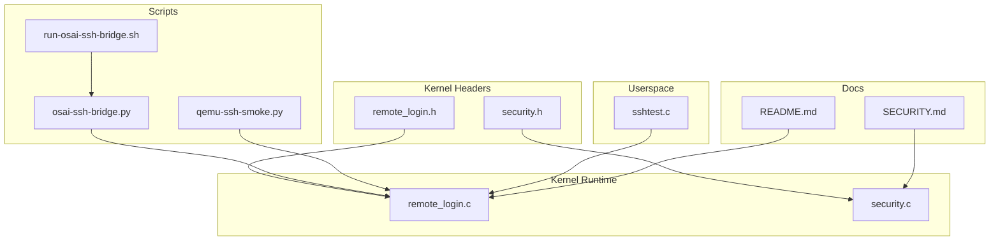
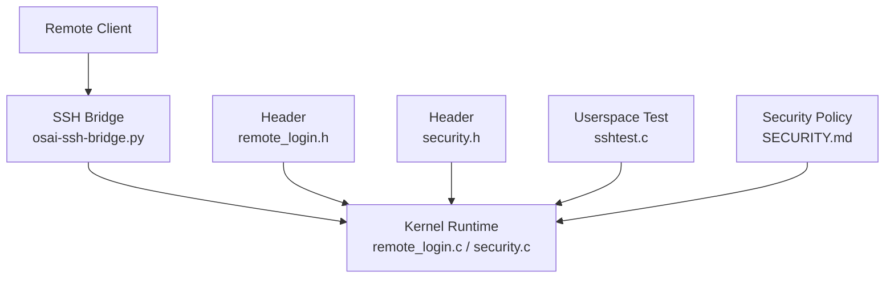
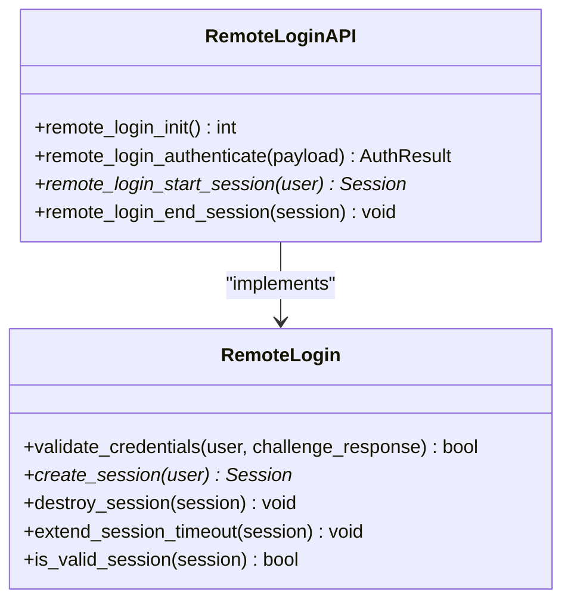
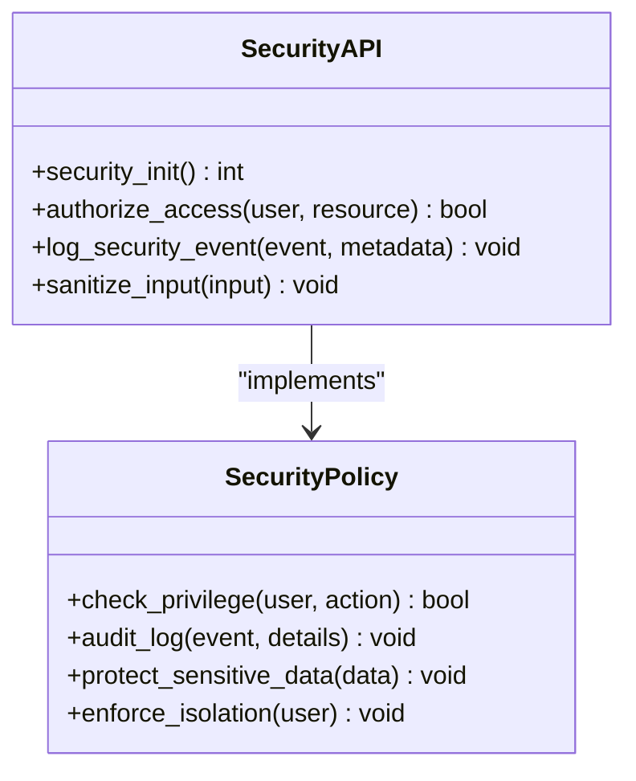
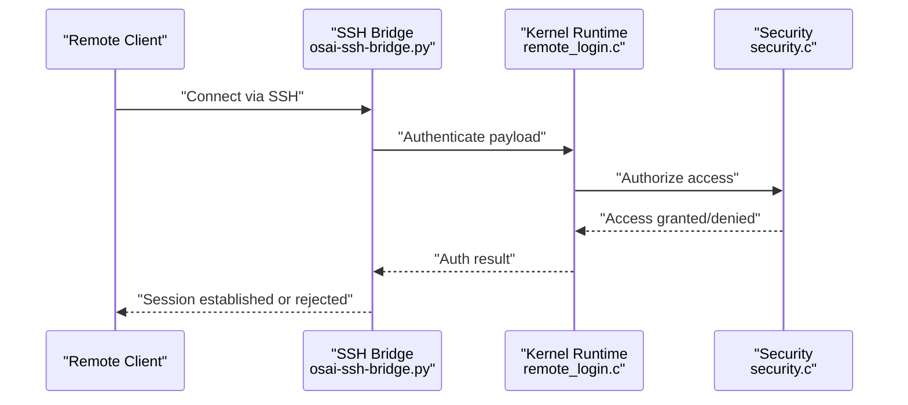
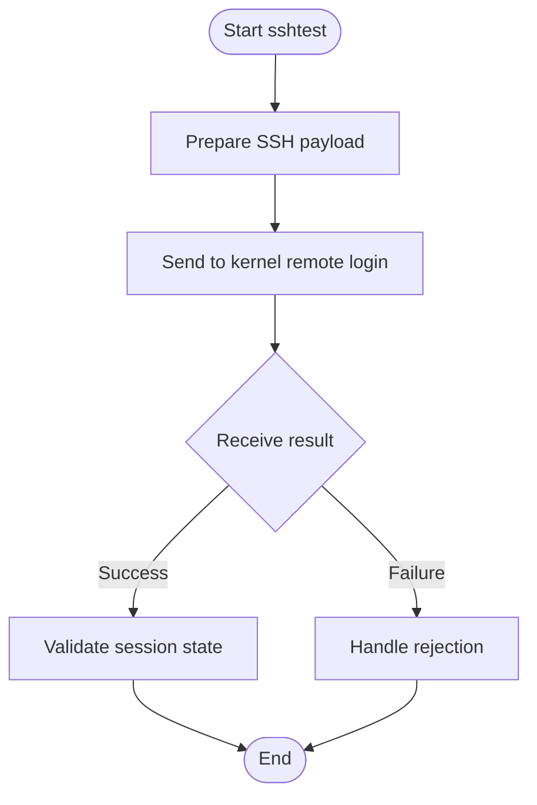
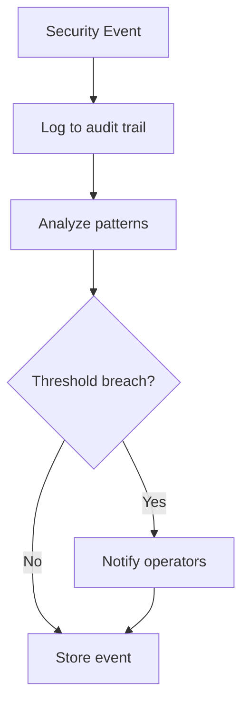
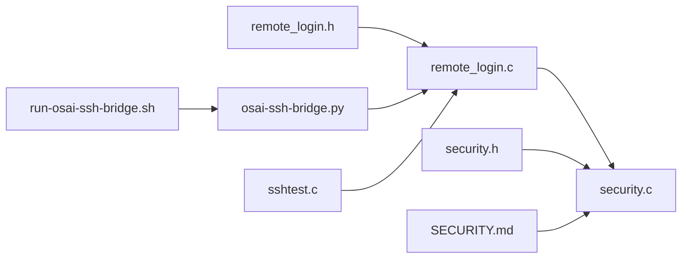

# Remote Login Security

<cite>
**Referenced Files in This Document**
- [remote_login.h](file://kernel/include/osai/remote_login.h)
- [remote_login.c](file://kernel/runtime/remote_login.c)
- [security.h](file://kernel/include/osai/security.h)
- [security.c](file://kernel/runtime/security.c)
- [osai-ssh-bridge.py](file://scripts/osai-ssh-bridge.py)
- [run-osai-ssh-bridge.sh](file://scripts/run-osai-ssh-bridge.sh)
- [sshtest.c](file://userspace/apps/sshtest.c)
- [qemu-ssh-smoke.py](file://scripts/qemu-ssh-smoke.py)
- [README.md](file://README.md)
- [SECURITY.md](file://SECURITY.md)
</cite>

## Table of Contents
1. [Introduction](#introduction)
2. [Project Structure](#project-structure)
3. [Core Components](#core-components)
4. [Architecture Overview](#architecture-overview)
5. [Detailed Component Analysis](#detailed-component-analysis)
6. [Dependency Analysis](#dependency-analysis)
7. [Performance Considerations](#performance-considerations)
8. [Troubleshooting Guide](#troubleshooting-guide)
9. [Conclusion](#conclusion)
10. [Appendices](#appendices)

## Introduction
This document describes OSAI’s remote login security system with emphasis on SSH integration and administrative access controls. It explains authentication mechanisms, credential validation, secure shell configuration, privilege escalation, session management, credential rejection, sensitive data protection, auditing, policy enforcement, access logging, intrusion detection, hardening, monitoring, troubleshooting, incident response, and recovery procedures. The content is derived from the repository’s kernel runtime modules for remote login and security, associated scripts, and supporting documentation.

## Project Structure
OSAI organizes remote login and security functionality primarily under the kernel runtime and include headers, with auxiliary scripts and test applications in userspace and scripts directories. The most relevant files for remote login security are:
- Kernel include headers: remote_login.h, security.h
- Kernel runtime implementations: remote_login.c, security.c
- Scripts: osai-ssh-bridge.py, run-osai-ssh-bridge.sh, qemu-ssh-smoke.py
- Userspace test app: sshtest.c
- Documentation: README.md, SECURITY.md

**Diagram sources**
- [remote_login.c](file://kernel/runtime/remote_login.c)
- [security.c](file://kernel/runtime/security.c)
- [remote_login.h](file://kernel/include/osai/remote_login.h)
- [security.h](file://kernel/include/osai/security.h)
- [osai-ssh-bridge.py](file://scripts/osai-ssh-bridge.py)
- [run-osai-ssh-bridge.sh](file://scripts/run-osai-ssh-bridge.sh)
- [qemu-ssh-smoke.py](file://scripts/qemu-ssh-smoke.py)
- [sshtest.c](file://userspace/apps/sshtest.c)
- [README.md](file://README.md)
- [SECURITY.md](file://SECURITY.md)

**Section sources**
- [README.md](file://README.md)
- [SECURITY.md](file://SECURITY.md)

## Core Components
- Remote Login Module: Provides remote login primitives, credential validation hooks, and session lifecycle management. Exposed via header and runtime implementation.
- Security Module: Implements access control policies, privilege checks, audit logging, and sensitive data handling safeguards.
- SSH Bridge: Scripted bridge enabling SSH connectivity to OSAI environments for testing and operational access.
- Test Application: sshtest.c exercises SSH-related flows in userspace for smoke testing.
- Hardening and Policies: Documented in SECURITY.md and supported by kernel security logic.

Key responsibilities:
- Authentication and credential validation
- Administrative access controls and privilege escalation
- Session management and lifecycle
- Credential rejection and sensitive data protection
- Access logging and auditing
- Intrusion detection and monitoring
- Security hardening and recovery procedures

**Section sources**
- [remote_login.h](file://kernel/include/osai/remote_login.h)
- [remote_login.c](file://kernel/runtime/remote_login.c)
- [security.h](file://kernel/include/osai/security.h)
- [security.c](file://kernel/runtime/security.c)
- [osai-ssh-bridge.py](file://scripts/osai-ssh-bridge.py)
- [run-osai-ssh-bridge.sh](file://scripts/run-osai-ssh-bridge.sh)
- [sshtest.c](file://userspace/apps/sshtest.c)
- [SECURITY.md](file://SECURITY.md)

## Architecture Overview
The remote login security architecture integrates kernel-level primitives with userspace and scripts to enable secure remote administration. The kernel runtime enforces authentication, authorization, and auditing, while scripts facilitate SSH connectivity and automated testing.

**Diagram sources**
- [remote_login.c](file://kernel/runtime/remote_login.c)
- [security.c](file://kernel/runtime/security.c)
- [remote_login.h](file://kernel/include/osai/remote_login.h)
- [security.h](file://kernel/include/osai/security.h)
- [osai-ssh-bridge.py](file://scripts/osai-ssh-bridge.py)
- [sshtest.c](file://userspace/apps/sshtest.c)
- [SECURITY.md](file://SECURITY.md)

## Detailed Component Analysis

### Remote Login Module
The remote login module defines the interface and implementation for remote authentication and session management. It exposes functions for validating credentials, managing sessions, and integrating with SSH-based access.

**Diagram sources**
- [remote_login.h](file://kernel/include/osai/remote_login.h)
- [remote_login.c](file://kernel/runtime/remote_login.c)

Operational highlights:
- Authentication entry points accept structured payloads and return results indicating success or failure.
- Session creation tracks user identity and enforces timeout and validity checks.
- Integration with SSH bridge enables remote clients to establish authenticated sessions.

**Section sources**
- [remote_login.h](file://kernel/include/osai/remote_login.h)
- [remote_login.c](file://kernel/runtime/remote_login.c)

### Security Module
The security module centralizes access control, privilege checks, audit logging, and sensitive data protection. It collaborates with the remote login module to enforce administrative access controls and policy compliance.

**Diagram sources**
- [security.h](file://kernel/include/osai/security.h)
- [security.c](file://kernel/runtime/security.c)

Operational highlights:
- Privilege checks gate administrative actions.
- Audit logs record events with metadata for forensic analysis.
- Sensitive data protection prevents leakage during processing.
- Isolation enforcement limits cross-user interference.

**Section sources**
- [security.h](file://kernel/include/osai/security.h)
- [security.c](file://kernel/runtime/security.c)

### SSH Bridge and Remote Access
The SSH bridge script establishes a controlled pathway for remote access, enabling secure shell connectivity for testing and operational tasks. It coordinates with the kernel runtime to validate and manage sessions.

**Diagram sources**
- [osai-ssh-bridge.py](file://scripts/osai-ssh-bridge.py)
- [remote_login.c](file://kernel/runtime/remote_login.c)
- [security.c](file://kernel/runtime/security.c)

**Section sources**
- [osai-ssh-bridge.py](file://scripts/osai-ssh-bridge.py)
- [run-osai-ssh-bridge.sh](file://scripts/run-osai-ssh-bridge.sh)

### Userspace SSH Test Application
The sshtest.c application exercises SSH-related flows in userspace, validating integration points and ensuring compatibility with the kernel runtime’s remote login APIs.

**Diagram sources**
- [sshtest.c](file://userspace/apps/sshtest.c)
- [remote_login.c](file://kernel/runtime/remote_login.c)

**Section sources**
- [sshtest.c](file://userspace/apps/sshtest.c)

### Intrusion Detection and Monitoring
Monitoring and detection capabilities rely on audit logging and policy enforcement. Events are recorded with sufficient metadata to support incident response and forensics.

**Diagram sources**
- [security.c](file://kernel/runtime/security.c)
- [SECURITY.md](file://SECURITY.md)

**Section sources**
- [security.c](file://kernel/runtime/security.c)
- [SECURITY.md](file://SECURITY.md)

## Dependency Analysis
Remote login and security depend on each other and on external scripts for SSH connectivity. The kernel runtime modules expose public APIs consumed by scripts and userspace tests.

**Diagram sources**
- [remote_login.c](file://kernel/runtime/remote_login.c)
- [security.c](file://kernel/runtime/security.c)
- [remote_login.h](file://kernel/include/osai/remote_login.h)
- [security.h](file://kernel/include/osai/security.h)
- [osai-ssh-bridge.py](file://scripts/osai-ssh-bridge.py)
- [run-osai-ssh-bridge.sh](file://scripts/run-osai-ssh-bridge.sh)
- [sshtest.c](file://userspace/apps/sshtest.c)
- [SECURITY.md](file://SECURITY.md)

**Section sources**
- [remote_login.c](file://kernel/runtime/remote_login.c)
- [security.c](file://kernel/runtime/security.c)
- [osai-ssh-bridge.py](file://scripts/osai-ssh-bridge.py)
- [sshtest.c](file://userspace/apps/sshtest.c)
- [SECURITY.md](file://SECURITY.md)

## Performance Considerations
- Minimize authentication latency by optimizing credential validation and avoiding unnecessary cryptographic overhead.
- Use efficient session storage and periodic cleanup to reduce memory pressure.
- Batch audit log writes to improve throughput without compromising durability.
- Employ asynchronous processing for non-blocking operations where feasible.

[No sources needed since this section provides general guidance]

## Troubleshooting Guide
Common issues and resolutions:
- Authentication failures: Verify payload format and ensure the SSH bridge sends properly structured requests to the kernel runtime.
- Session timeouts: Confirm session extension logic and client-side keepalive behavior.
- Privilege denials: Review security policy mappings and user role assignments.
- Audit gaps: Check logging permissions and disk availability; ensure logs are rotated and retained per policy.
- SSH connectivity problems: Validate bridge configuration and firewall rules; confirm the script runs with required privileges.

**Section sources**
- [remote_login.c](file://kernel/runtime/remote_login.c)
- [security.c](file://kernel/runtime/security.c)
- [osai-ssh-bridge.py](file://scripts/osai-ssh-bridge.py)
- [run-osai-ssh-bridge.sh](file://scripts/run-osai-ssh-bridge.sh)

## Conclusion
OSAI’s remote login security system combines kernel-level authentication and authorization with practical SSH integration and robust auditing. Administrators can enforce strict access controls, monitor activity, and respond to incidents effectively. Adhering to documented policies and leveraging the provided scripts ensures secure and reliable remote administration.

[No sources needed since this section summarizes without analyzing specific files]

## Appendices

### Remote Login Security Policies
- Enforce strong credential validation and reject invalid or malformed inputs.
- Limit administrative privileges to authorized identities and require explicit approval for sensitive actions.
- Log all authentication attempts and access events with timestamps and metadata.
- Protect sensitive data at rest and in transit; sanitize inputs and outputs.

**Section sources**
- [SECURITY.md](file://SECURITY.md)

### Secure Remote Administration Examples
- Use the SSH bridge to establish authenticated sessions and perform administrative tasks.
- Validate session state before executing privileged commands.
- Monitor audit logs for suspicious activity and respond promptly.

**Section sources**
- [osai-ssh-bridge.py](file://scripts/osai-ssh-bridge.py)
- [remote_login.c](file://kernel/runtime/remote_login.c)
- [security.c](file://kernel/runtime/security.c)

### Credential Management and Enforcement
- Implement multi-factor authentication where applicable.
- Rotate credentials regularly and revoke compromised ones immediately.
- Enforce least privilege and principle of separation of duties.

**Section sources**
- [security.c](file://kernel/runtime/security.c)
- [SECURITY.md](file://SECURITY.md)

### Remote Access Monitoring and Recovery
- Continuously monitor logs and alert on anomalies.
- Maintain backups and recovery procedures for authentication and audit data.
- Establish runbooks for incident response and remote access recovery.

**Section sources**
- [security.c](file://kernel/runtime/security.c)
- [SECURITY.md](file://SECURITY.md)